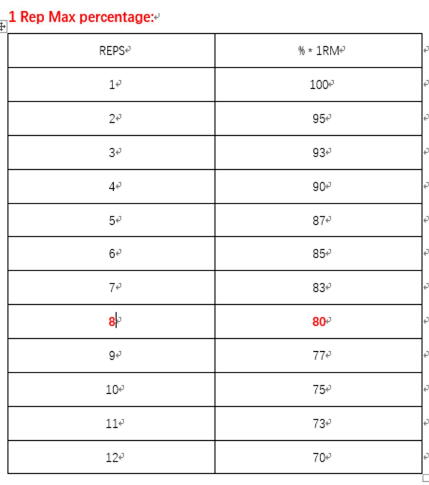

**The variables linked to growth****：**

文章整理自平时训练笔记，若有不对之处，还望各路大神指教！

整理者：张德舟，微博ID：http://weibo.com/2964964450/profile?rightmod=1&wvr=6&mod=personinfo

 

**1.**  **你的训练计划应该尽量围绕多关节动作展开。**

也就是我们通常所说的复合动作；这些复合动作包含多个肌群协同工作，不仅有利于力量训练，同时也能够提高你的核心控制力及心肺功能，这些动作例如：深蹲，硬拉，卧推，站姿推举，划船，奥林匹克举等；

**2.**   **以一个相当高的强度进行训练****。**

当然不是让你去做你力不能及的重量，为了获得更好的效果，你应该以你的70-85% * 1RM的重量进行训练，在这一重量范围每组往往能做6-12次（不断调整重量使你保持在这一黄金范围（Golden range），上次所讲的8次也可以说成是这一范围中的黄金次数（Golden reps））；

**3.**  **选择一个对你来说的大重量。**

这个就涉及到第二点中的1RM，根据你的1RM推算出适合你的重量。一般情况更大的训练强度会更加促进新陈代谢，同时也会带来肌肉的增长，但是每个个体不一样，从训练中的恢复能力也有所不同。想要知道你理想的重量的唯一方式就是通过不断地尝试，70-85%是一个参考值，实际训练过程中得靠你自己来测量；

**4.**  **组间休息控制在60-90s。**

组间休息看似和肌肉增长没有多大关系，但合适的组间休息，60-90s，表明能够使你的新陈代谢达到最大化。太短的组间休息可能会增加新陈代谢的压力，而且你的潜力不能很好地发挥。为了获得最好的力量和肌肉方面的收益，应该控制组间休息时间足够短以至于能够达到最佳的新陈代谢压力，同时又要足够长地让那些生长因素完全恢复，例如：phosphocreatine。

**5.**  **偶尔训练至力竭。**

相信很多人都知道力竭这个概念（在你的动作都标准的情况下，不需要借力及他人的帮助，你不能在完成一次的那个点，也就是力竭点），但不是每次训练都应该训练至力竭。不排除力竭的好处，但经常练至力竭可能会导致精力过早消耗殆尽（本来你今天想大干好几个回合，可是在尝试力竭之后可能2组就没力气了，这样会影响接下来的动作的标准，从而导致受伤的风险大大增加），以及会给骨骼肌带来损伤。也有研究表明，太多地训练至力竭，效果往往适得其反。经常训练至力竭会导致分解肌肉的激素增加，同时会减少合成肌肉的激素。所以可以偶尔尝试一下力竭带来的酸爽！

 

**1RM****（Repetition Maximum）**：在动作标准，使用自由器械，没有他人帮助的情况下你一次能够举起、推起或蹲起的最大重量。

 