**15****个泡沫轴使用方法！**

概述 

1、自我肌筋膜放松让肌肉恢复原有弹性，不再是“易碎的泥瓷罐”。 

2、正确的使用泡沫轴，你会得到比拉伸更多的好处。 

3、坚持使用泡沫轴，消除肌肉组织粘连，逐渐改善你的错误体态。 

4、学习关键技术，调整对身体施加的压力，可以最大限度的利用到泡沫轴这个器械。 

 **使用泡沫轴放松肌肉最常见的5个错误**

在HuffPost的网站上分享一篇《5个使用泡沫轴常见的错误》：这些日子以来，Foam Roller泡沫轴几乎是无处不在，健身房、物理治疗师的办公室、客厅甚至是你的手提箱。毕竟，泡沫轴已经成为运动界的宠儿并做为许多不同疼痛的万灵丹。从本质来看，泡沫轴是一种自我肌筋放松的方式，释放肌肉及结缔组织里的粘黏。

　　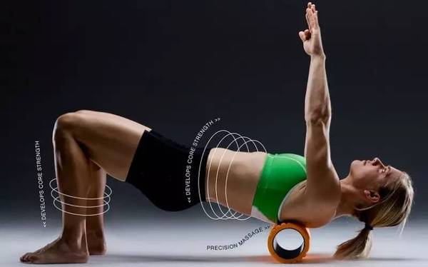

　　而这些沾黏会在软组织中产生薄弱或是敏感的点。如果肌肉端点到端点没有均匀的收缩，这可能导致受伤或疼痛。泡沫轴可以增加血液流入肌肉并且产生更好的活动度，以帮助恢复并提升高运表现。

　　听起来很好，对吗？是的，泡沫轴在“释放疼痛”及“身体表现更好”上提供巨大的潜力，前提是“如果你使用的正确”。如果没有，将带来风险，并可能受伤。

　　以下提供五种常见的错误操作方式：

　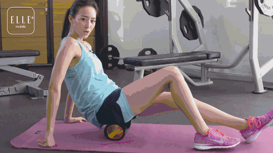

　　**错误1：直接滚压疼痛的地方**

　　当我们感到疼痛时，我们第一个反应是直接按摩该点。然而，这可能是一个很大的错误。MELT Method作者说：“疼痛的区域是身体其它部位失衡导致产生张力下的受害者。”

　　让我们以髂胫束做为例子，对于髂胫束摩擦综合征来说，泡沫轴是一个常用的治疗处方。虽然滚压你的髂胫束可能感觉很好，但释放或放松髂胫束的想法是一种误解。髂胫束是一片明显强壮的结缔组织，而研员发现，它无法借由按摩技术来进行放松。此外，如果你处在疼痛的情况中，身体因为太多的压力而无法自我进行修复。

　　**改正：**直接按压前先间接按压。如果你发现一个敏感的点，这是一个线索，你可以在附近几厘米的地方先开始进行滚压。需要在疼痛区域的周围花了更多的时间及工作。对于髂胫束来说，先处于附着在髂胫束上的主要肌肉 – 特别是臀大肌(臀部上最大的肌肉)，然后是阔筋膜张肌(Tensor Fasciae Latae)(沿着髋关节外侧运行的肌肉)。

　　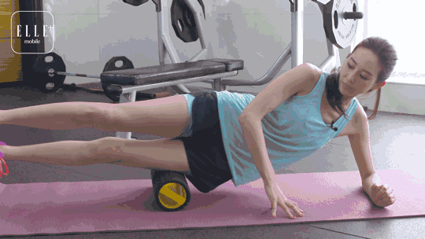

　　**错误2：滚压的太快**

　　虽然快速前后滚可能感觉满好的，但你这不是消除任何粘黏的方式。你需要给大脑足够的时间来告诉肌肉放松。

　　**改正：**慢慢的进行，让浅层的筋膜及肌肉有时间来适应。当发现张力较大的局部区域时，短距离移动前后的方式来进行滚动。如果只有少数的敏感区域，没有理由要去滚压整个肌肉。

　　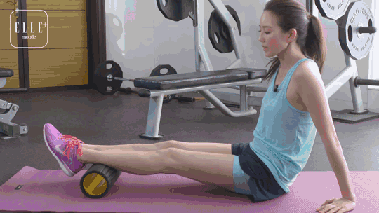

　　**错误3：花太多的时间在哪些"结"上面**

　　我们经常听到，如果你感觉到一个“点”，花时间利用泡沫轴在点上进行放松。然而，有些人会花到5至10分钟的时间，甚至更长的时间在同样的点上，并尝试把全身的重量都移转到泡沫轴上。如果你在身体某个部位上持续加压，实际上你可能会触地到神经或是损坏软组织，最后可能导致黑青。

　　**改正：**在较为有张力的点上进行20秒的处理。你可以控制使用多少身体重量来进行按摩。

　　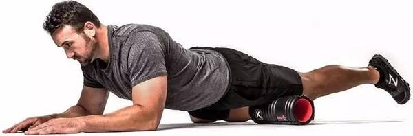

　　**错误4：不良姿势**

　　等一下，在进行滚泡沫轴时会有什么姿势出现呢？非常多。你必须在某些姿势下在泡沫轴上保持住身体，这需要大量的肌肉力量。当你滚压髂胫束时，你利用单臂来支撑上半身的重量；当你滚压大腿前侧时，你基本上是呈现一个平板支撑的姿势。如果你不注意姿势，你可能会加剧身体已存在的体位偏差，导致更多的伤害。

　　**改正：**请有经验的个人训练师、物理治疗师或是教练告诉你正确的形式及技术。或是考虑使用手机或相机拍摄自己在按压的情况，观察自己做的方式是否正确，臀部有没有下垂、脊椎有没有扭曲。

　　**错误5：在下背处使用泡沫轴**

　　当看到有人使用泡沫轴滚压下背时，我都会为之忧虑。你们千万不要这样做，这会给你的脊椎造成巨大压力，使得全部脊椎的肌肉都会进行收缩来保护脊椎。

　　**改正：**因为上背有肩胛骨及肌肉在保护脊柱，你可以使用泡沫轴来按压上背。一旦你触及到肋骨的终端就停止。如果你想要放松下背，尝试侧身滚压或是滚连接至下背的肌肉 - 梨状肌(位在臀部深处的肌肉)、髋屈肌及股直肌(股四头肌中主要的肌肉)。

 

随便一个健身房泡沫轴都可以见到，甚至你只需要花几十块钱，就可以在万能的x宝购买到，从此不再需要花钱去做大保健，每天回家滚一滚，身体轻松乐无忧。让你从肌肉得到充分放松，恢复原有的肌肉弹性。别担心，这个内容不是一个广告，只是希望你能够找到一个比花钱大保健更有效的方式，通过泡沫轴进行自我肌筋膜放松和深层肌肉组织的按摩，毕竟，大保健也并不是特别有用（比如落枕....） 

 

泡沫轴是怎么工作的呢？ 

使用泡沫轴进行的自我肌筋膜放松（SMR）可能要归功于被称为自生抑制（autogenic inhibition） 的原则，如果你看了不少健身相关文章的话，你应该听说过高尔基腱器（GTO），也叫腱梭，它分布在肌腹与肌腱的连接处，是一种肌肉张力感受器，能感受静力工作中肌肉张力的变化。 

当张力增加导致高受伤风险（如肌腱断裂）来看，牵拉GTO会通过抑制与肌腱附近肌肉相连的躯体运动神经而产生肌肉舒张反射。这种舒张反射就是自生抑制，对GTO来说，不仅仅是在保护我们免受过强或过快收缩引起的损伤，它也在本体感觉神经肌肉促进(PNF)技术上扮演着重要的角色。 

 

在被动伸展前预先收缩肌肉可以刺激GTO促进主动伸展放松和增加肌肉活动范围。使用泡棉轴可以增加肌肉张力，促使GTO放松肌肉，从本质上来看，你会获得更多伸展的好处。 

 

还有一个重要的观念是，你的肌肉不仅仅需要强壮，还需要柔软，无论是你健美爱好者，力量举爱着，还只是个普通的“周末勇士（假期训练者）”重要的是通过全方位的训练提升自己的力量和最佳的身体能力。 

 

同时，伸展将增加肌肉的长度，而SMR和按摩则可以调整肌肉的状态。只关注一点，而厚此薄彼，就好像从来没有将书本上的知识活学活用。 

 

SMR的好处 

传统的伸展方式在不受伤的状况下，短暂的增加肌肉的长度（假设我们不超过应力应变曲线的“临界点”）。而使用泡棉轴上进行SMR，将有助于软组织粘黏及疤痕组织的分解。 

 

我们必须要看到主动放松技术(Active Release Techniques, ART) 的价值，它在消除粘黏和疤痕组织的效果上是无庸置疑的，但是在金钱花费与便利性的角度来看，我们并不能指望使用者能够经常性使用ART。 

 

但是，泡棉轴上进行SMR，既可以减少粘黏及疤痕组织的累积，还能够消除每天增加的粘黏和疤痕组织，而且在有效程度、价格、以及便捷程度方面有着独特性。只是要注意，像伸展和泡沫轴放松，不会有“一夜暴富”在一夜之间使身体有显著的进步，你依然需要坚持并且时常进行（虽然你一定会发现一些马上见效的福利） 

 

泡沫轴还在矫正不良姿势上有宝贵的作用，花时间使用泡沫轴放松那些紧绷肌肉，你一定会看到你努力后明显的效果。 

 

使用技巧 

这些技术简单易学，基本上，你只需要利用自己的体重在地板上的泡沫轴上进行缓慢的滚动，最最疼痛的点上（“热点”激痛点）停留数秒，并小范围内进行滚动放松，在疼痛感减轻后，再转向其他区域。 

http://v.youku.com/v_show/id_XMTQ3MDcxNTI0MA==.html?from=s1.8-1-1.2&spm=a2h0k.8191407.0.0

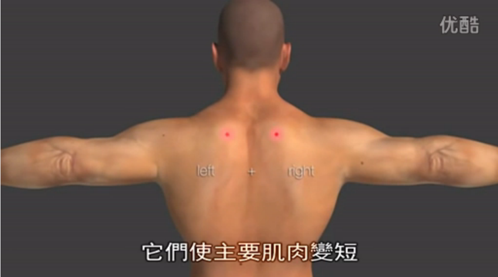

△激痛点介绍

 

为了增加对软组织的压力，你要让更多的体重压在泡沫轴上，最简单的方法是通过将双腿更改为单腿，或者将另一条腿叠加上另一条腿上，额外施加压力，或者将双侧改为单侧。 

 

当你在滚动式的疼痛感减弱，可以将身体大部分的重量施加在泡沫轴上，与训练类似的地方在于，滚筒放松必须不断尝试、寻找最适合自己的方式，但是必须避开“骨刺”部位。 

 

我们发现另一个有益的训练是从身体近端（靠近身体中心）逐渐向肌肉远端（远离身体中心）滚动，缩短滚动的范围，而不是从举例来说，要放松股四头肌不要一次从头到尾滚动，缩短每次滚动距离，先从上半段开始滚动，直到感觉肌肉放松后，再移至下半段滚动。 

 

这是进行SMR的一个重要的策略，因为当滚动接近远端肌肉肌腱连结处时，压力会随之增加，先处理上半部肌肉，则可以减少之后产生的下半部压力。 

 

特别注意：有循环系统问题和慢性疼痛疾病(例如，纤维肌痛症候群) 的病人不应使用滚筒放松。 

使用示例和描述 

腘绳肌：将脚趾朝前，双手放置地面保持平衡，从臀部向膝盖方向滚动，为了增加负荷，可以将一条腿叠加到另一条腿上，并有意施加压力（叠加在上方的腿向下施力） 

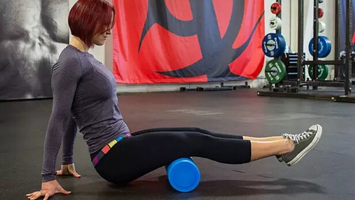

 

髋屈肌：将双臂放置地面，泡沫轴放于单侧大腿前侧上方，在腹部与腿部的链接处进行小范围滚动。 

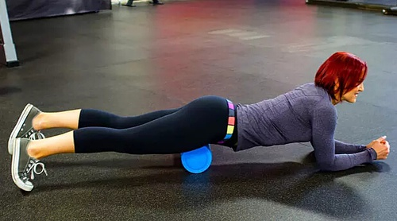

 

阔筋膜张肌和髂胫束： 这个有点难度，所以我们提供了从两个不同角度的照片。 这可能是疼痛感最强的部位。起始位置侧躺，泡沫轴略低于骨盆，从这里逐渐向膝盖滚动，你可以将另一条腿叠加增加负荷。 

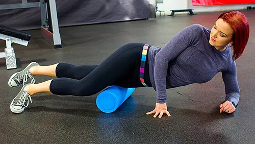

 

内收肌：单侧大腿内侧放置泡沫轴上，小臂支撑保持平衡，逐渐向略高于膝盖方向滚动。 

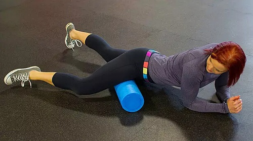

 

股四头肌：类似髋屈肌放松，将双腿放置在泡沫轴上，也可以单腿，增加强度，像膝盖方向缓慢滚动。 

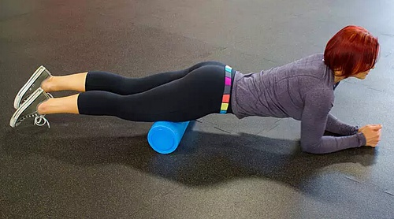

 

臀中肌和梨状肌：侧躺，将臀靠近外侧放置在泡沫轴上，从上向下缓慢滚动。 

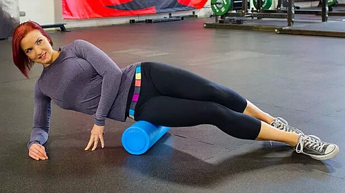

 

臀大肌：类似腘绳肌，只是坐在泡沫轴上，调整手臂高低，让泡沫轴能更深层的放松。 

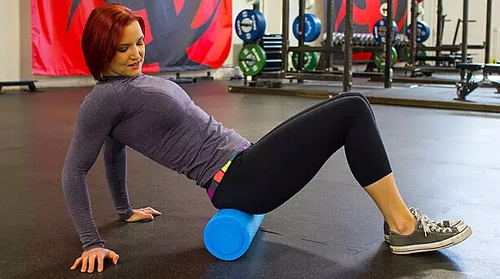

 

小腿：类似腘绳肌，臀部不要接触地面，尝试在滚动时勾脚尖和伸脚尖，将一条腿叠加在一条腿上，向下施加压力。 

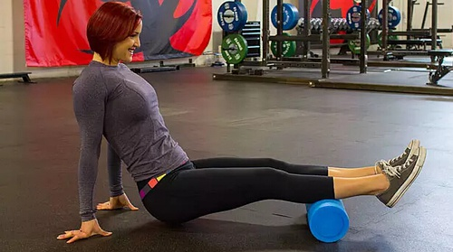

 

胫骨前肌：类似股四头肌，但此时是在你的小腿前侧。 

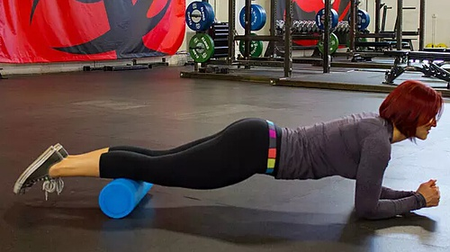

 

腓骨肌群：小腿外侧，从膝盖向脚踝滚动。 

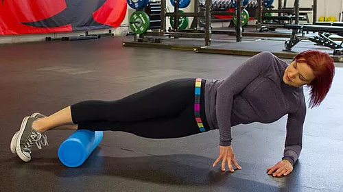

 

胸腰筋膜：双臂交叉置于胸前，泡沫轴放在背部中间，抬起臀部，从一侧肩胛骨方向向对侧骨盆顶端方向滚动，要注意，并非是直上直下，而是背部呈X型，对侧滚动。 

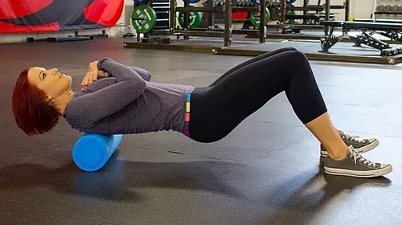

 

胸腰筋膜，中下方斜方肌，菱形肌：双手至于头后（不要勾脖子），泡沫轴放在背部中间，臀部抬离地面，向上滚动，将要到达腋下位置时，双侧扭转方向，这可以帮助纠正驼背问题。 

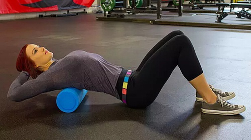

 

背阔肌，大圆肌：侧躺，伸直手臂，泡沫轴应当从背阔肌下方向腋下滚动。 

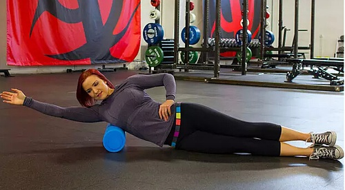

 

三头肌：同样的位置，将泡沫轴放在腋下，头部可以枕于手臂上方，向肘关节滚动。 

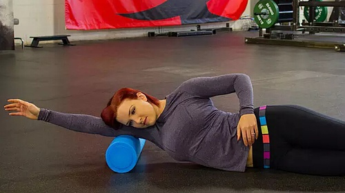

 

胸大肌和三角肌前束：手臂135度斜上方伸直，将泡沫轴斜放于胸部，向腋下滚动。 

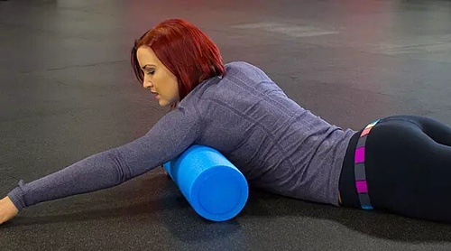

 

提示： 

越硬的泡沫轴，施加在肌肉上的压力越大，如果你之前没有使用过，我建议你从一个软硬适度的泡沫轴开始。学习视频链接http://v.youku.com/v_show/id_XNzI3MDU4NzQ0.html?from=s1.8-1-1.2&spm=a2h0k.8191407.0.0

 