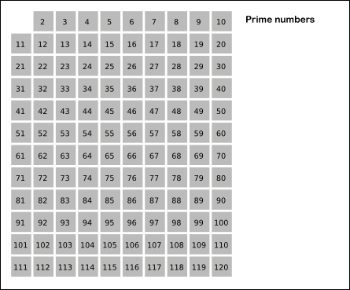

# 概念


# 相关引申

## 合数


# 解法

声明：

<font color=red>积的取余等每个数取余的乘积再取余</font>

证明：

## 传统解法

```java
public int numPrimeArrangements(int n) {
    // 所有大于3的质数都分布在6*k的两边，所以先判断小于
    if (n <= 2) {
        return 1;
    }

    // 找到n以内的质数的个数
    int primeCount = 1;
    for (int i = 3; i <= n; i++) {
        if (isPrime(i)) {
            primeCount++;
        }
    }

    return findPairs(n, primeCount);
}

/**
     * 传统的判定素数的思路，从2~sqrt（n）看能不能被整除
     *
     * @param k 当前待判定的数
     * @return 素数(true), 非素数(false)
     */
private boolean isPrime(int k) {
    int len = (int) Math.sqrt(k);
    for (int i = 2; i <= len; i++) {
        if (k % i == 0) {
            return false;
        }
    }

    return k > 2;
}

/**
     * 计算所有的组合数= 所有非质数排列组合数 * 所有质数的排列组合数
     *
     * @param n          总个数
     * @param primeCount 质数的个数
     * @return 总的排列个数
     */
private static int findPairs(int n, int primeCount) {
    long res = 1;
    int count = n < 8 ? primeCount : n - primeCount;
    for (int i = 2; i <= count; i++) {
        res = (res * i) % 1000000007;
        if (i == n - count) {
            res = (res * res) % 1000000007;
        }
    }

    return (int) res;
}
```

## 厄拉多塞筛法

### 厄拉多塞

（来源于百度百科）

Eratosthenes, 公元前276-前196，古希腊天文学家。 他是[阿基米德](https://baike.baidu.com/item/阿基米德/121228)的朋友，也和[亚里士多德](https://baike.baidu.com/item/亚里士多德/26769)一样是一个具有广泛兴趣的人。他不仅是著名的天文学家和数学家，而且还是[地理学](https://baike.baidu.com/item/地理学)家、历史学家，甚至还涉猎文学评论。 

 他是管理亚历山大图书馆的理想人选，所以在他从雅典学园毕业后，托勒密把他召到亚历山大，就给他安排了这个职务，同时还担任托勒密儿子的家庭教师。他以β这个别名著称，β是希腊字母中的第二个字母，因为他在几个方面都在世界上居第二把交椅。 

在数学方面他研究出一个[素数](https://baike.baidu.com/item/素数)系统，现在叫做厄拉多塞筛法（Eratosthenes sieve)，是一种从按照顺序排列的所有自然数中找出素数的方法。

在地理学方面，他绘制了当时已知世界的地图，包括从英伦三岛到印度洋的锡兰，从里海到非洲的埃塞俄比亚。在当时是最完整的地图，虽然伊巴谷和斯特拉波对比下成就更大些，但那毕竟是200多年以后的事情了。

厄拉多塞最大的成就是在天文学方面，其中尤其以在公元前240年测量出地球的大小。在亚历山大城东南约800千米的赛伊尼（今埃及阿斯旺）处，夏至日中午的阳光直射地面。厄拉多塞注意到同日同时在800千米外的亚历山大城，阳光则偏7.12度。这个差异只能是由于两地之间的地球表面的弯曲造成的。由于该角是圆周角的1/50，当知道两地之间的确切距离（可能通过记录车轮转数的测步器测得），并假设太阳距我们十分遥远，阳光射到地球可看成是平行的，并且地球是一表面各处的曲率相等的球体，由此就可以计算出地球的周长。他根据一些旅行者对上述两城市距离的估计，他测算黄赤道交角为23度51分19秒.5，并以此估算地球的周长约为40000千米，与实际值（40075.13千米）相差无几，在当时已经是一个相当精确的了。他还编写了一本星表；研究出一种包含闰年的历法并企图确定从特洛伊城被困以后在文献上记载的和发生的政治事件的日期。

### 算法思路

无穷流：用流表示的无穷长的序列（SICP chapter 3.5）

首先，无穷流从整数2开始，因为这是第一个素数。为了得到其余的素数，就需要从2后面的整数中过滤掉所有2的倍数，这样就留下一个从3开始的无穷流，而3也就是下一个素数。现在再从这个流的后面部分过滤掉所有3的倍数，这样就留下一个从5开头的无穷流，而5又是下一个素数，就这样继续下去。换句话说，这种方法就是通过一个筛选过程构造出各个素数。

具体过程如下：

 先将 2~n 的各个数放入表中，然后在2的上面画一个圆圈，然后划去2的其他倍数；第一个既未画圈又没有被划去的数是3，将它画圈，再划去3的其他倍数；现在既未画圈又没有被划去的第一个数 是5，将它画圈，并划去5的其他倍数……依次类推，一直到所有小于或等于 n 的各数都画了圈或划去为止。这时，表中画了圈的以及未划去的那些数正好就是小于 n 的素数。 如下图所示：

  

```java
/**
     * 厄拉多塞筛法
     *
     * @param n 总个数
     * @return 排列组合数
     */
public int numPrimeArrangementsEeatosthese(int n) {
    // 数组用于记录当前数是否为质数
    boolean[] isPrime = new boolean[n + 1];
    Arrays.fill(isPrime, true);

    for (int i = 2; i <= n; i++) {
        if (isPrime[i]) {
            int j = 2;
            int temp = i * j;
            for (; temp <= n; j++) {
                isPrime[temp] = false;
                temp = i * j;
            }
        }
    }

    int primeCount = 0;
    for (int i = 2; i <= n; i++) {
        if (isPrime[i]) {
            primeCount++;
        }
    }

    return findPairs(n, primeCount);
}
```

 https://www.geeksforgeeks.org/sieve-of-eratosthenes/ 上的另一种解法，原理相似！