# 配置copyright和类头

## copyright

File->Setting->Copyright->Copyright Profiles,点击+号按钮，输入合法的copyright信息，点击validate，合格后，点击apply；

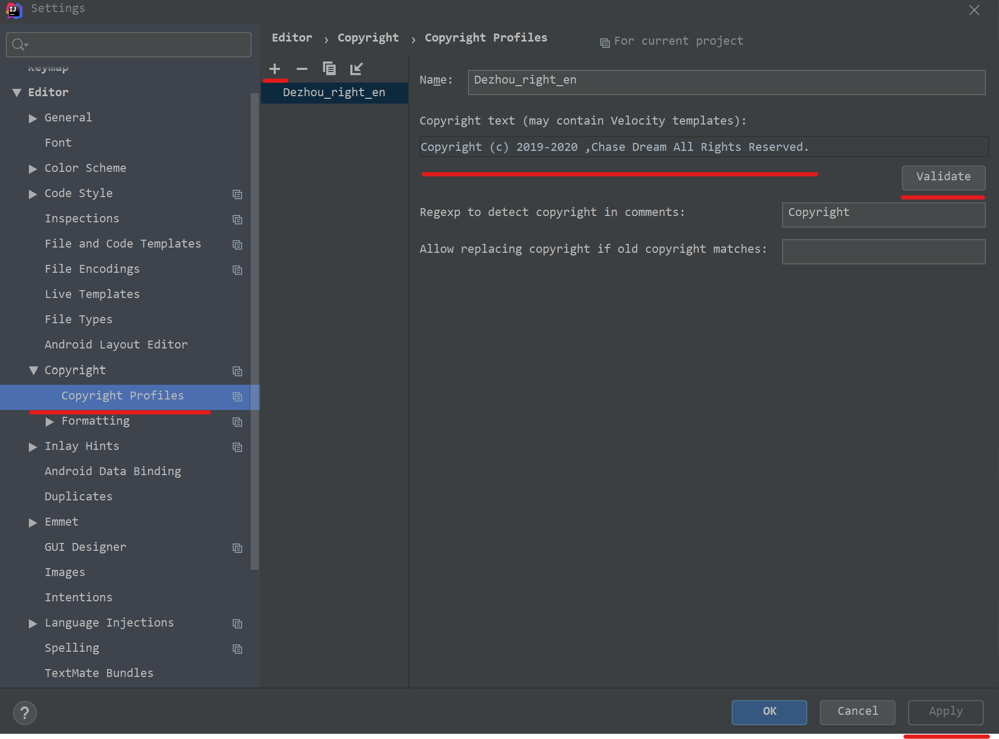

点击上一层的Copyright，Default project copyright，选择刚刚创建的coptright后点击应用。


## 类头信息

Editor下的File and Code Templates，然后点击右侧的Includes，选择File Header进行编辑，编辑的内容如右侧所示，然后点击Apply即可。

```
/**
 * @Description 
 * @author      Zhang Dezhou
 * @date        ${DATE} ${TIME}
 */
```

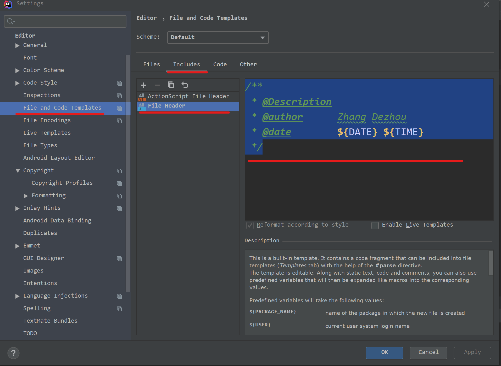

#　设置自动导包

首先，点击左上角的 “File”，选择 “settings”，或直接按快捷键Ctrl+Alt+s

选择“Editor”-“general”-“auto import”

在右侧将空勾选

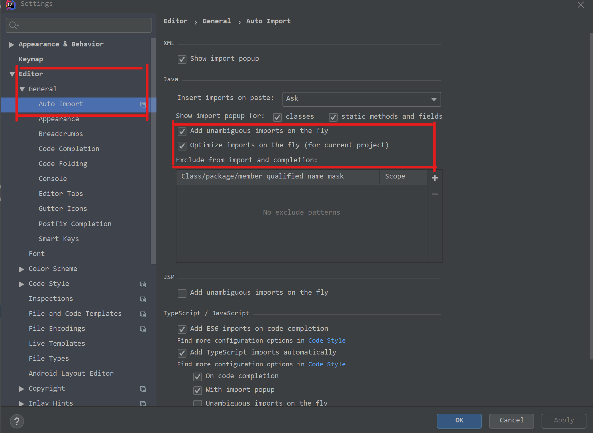

# 插件工具

*以下非原创，来源不详，待check*

## 1. ignore

经常使用git的同学对于ignore一定不会陌生，我们可以在该文件中设置一些忽略提交的规则。

通过该插件可以生成各种ignore文件，一键创建git ignore文件的模板，解决了手动去配置的麻烦。

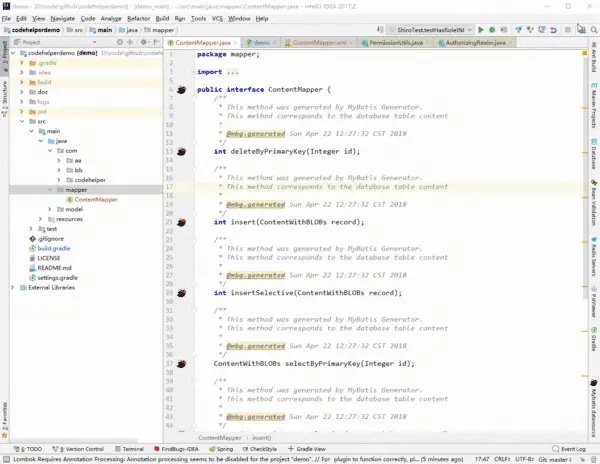

## 2. p3c

阿里巴巴出品的java代码规范插件

可以扫描整个项目 找到不规范的地方 并且大部分可以自动修复

更多可以查看 [https://github.com/alibaba/p3c/tree/master/idea-plugin](https://links.jianshu.com/go?to=https%3A%2F%2Fgithub.com%2Falibaba%2Fp3c%2Ftree%2Fmaster%2Fidea-plugin)

## 3. GsonFormat

一键根据json文本生成java类 非常方便

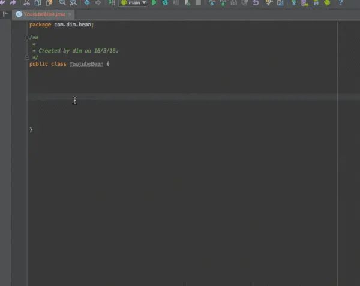

## 4. VisualVM Launcher

运行java程序的时候启动visualvm，方便查看jvm的情况 比如堆内存大小的分配

某个对象占用了多大的内存，jvm调优必备工具

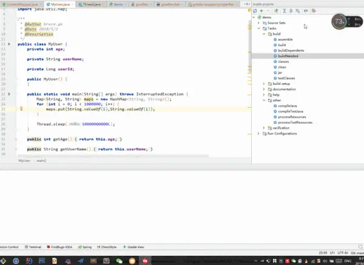

## 5. SequenceDiagram

有的时候，我们需要梳理业务逻辑或者阅读源码。从中，我们需要了解整个调用链路，反向生成 UML 的时序图是强需求。其中，SequenceDiagram 插件是一个非常棒的插件。

官方详细介绍地址 https://plugins.jetbrains.com/plugin/8286-sequencediagram

比如：你想看某个方法的执行流程，可以选择右键这个方法接口或者方法实现

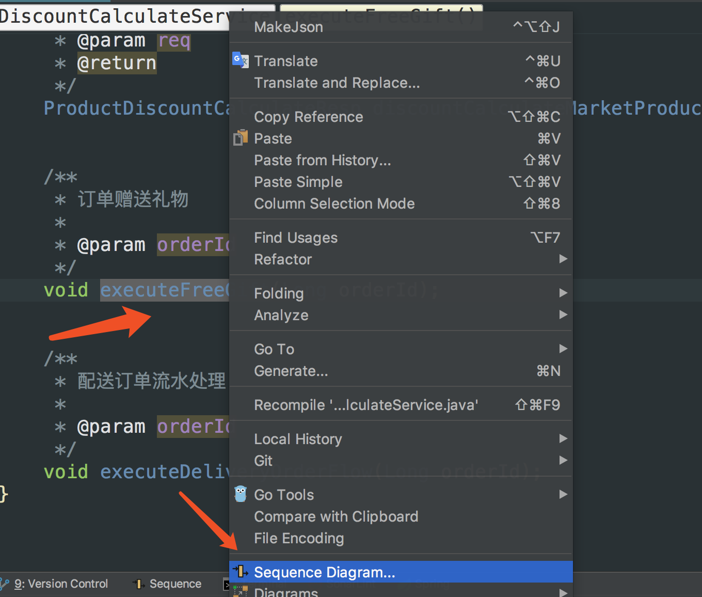

立即生成时序图

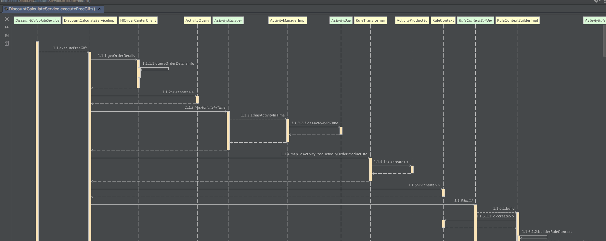

## 6. Key promoter X

快捷键提示工具，官方详细介绍地址 https://plugins.jetbrains.com/plugin/9792-key-promoter-x

这个插件什么用呢？举个例子，你想看某个方法内部实现的时候，如果你不用快捷键，你会这样鼠标点：

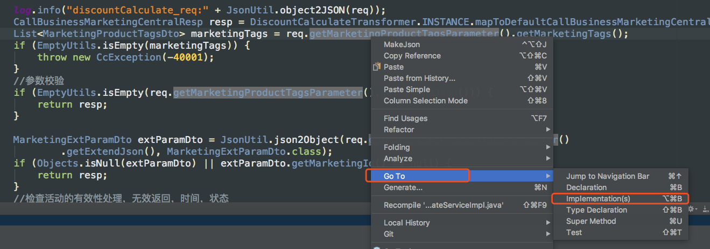

如果你安装了这个插件，你每次这样鼠标点击后，开发工具右下角会提示你，使用快捷键：

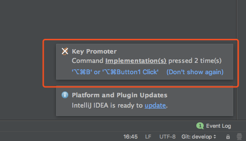

安装这个插件后，快捷键用的飞起来。

## 7. CodeGlance 插件

当你的类上千行的时候，在你往下拖拽找对象的时候，是不是感觉挺累的，有个这个插件，可以查看缩略图一样，快速切换到自己需要去的地方，飞翔的感觉。

官方详细介绍地址 https://github.com/Vektah/CodeGlance

安装后显示效果图如下：


## 8. JUnitGenerator V2.0 

编写单元测试是好的开发者的习惯，但是怎么提高你代码的效率，单元测试代码可否自动生成，这个插件就是帮我们做这事情。

修改JUnitGenerator V2.0 的配置，Settings下的 Other Settings 修改下模版和更新配置

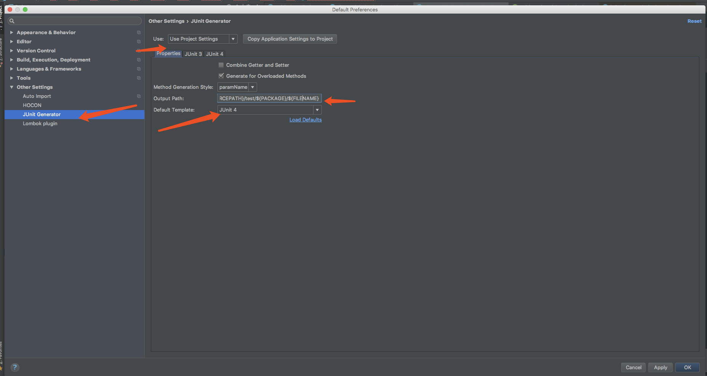

设置成功后，就可以根据方法或者类生成单元测试模版了：

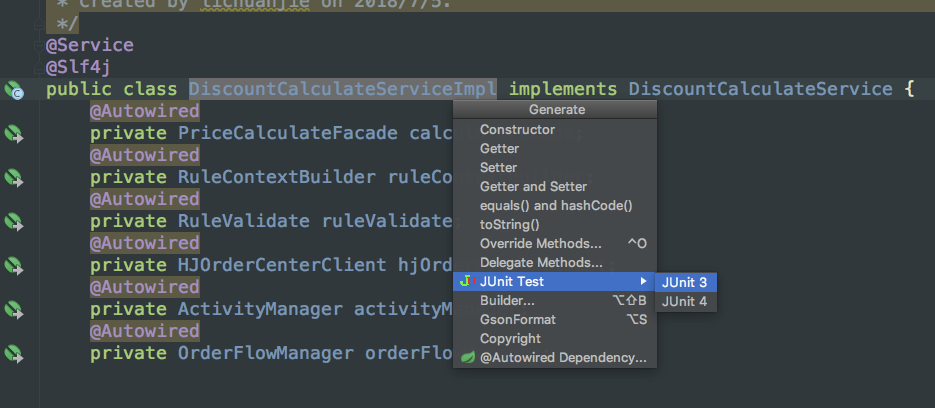

## 9. GenerateAllSetter

当你进行对象之间赋值的时候，有没有觉得好麻烦，能不能有一个更好的办法呢~ 有，只要你选中需要生成set方法的对象，按下快捷键 alt+enter 界面如下：


官方详细介绍地址 https://plugins.jetbrains.com/plugin/9360-generateallsetter

## 10. Sonarlint

代码质量管理

找出你的代码隐藏bug或者坏味道

官方详细介绍地址 http://intellij.sonarlint.org

可以选择你要执行的代码类或者项目执行就可以类，下面会列出结果和意见

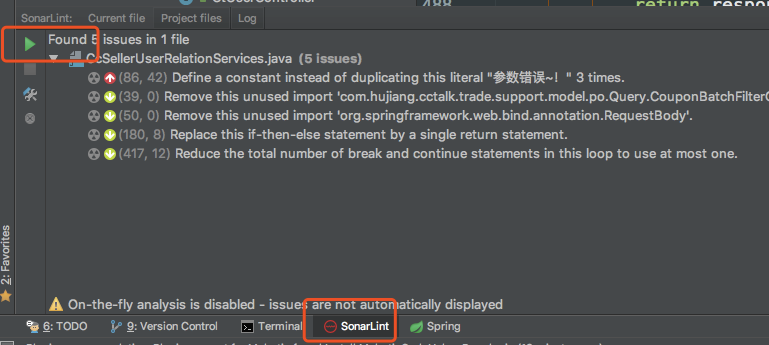

## 11. CheckStyle

CheckStyle-IDEA

## 12. spellcheck

Grazie

Elixir

##　13.JavaDoc

