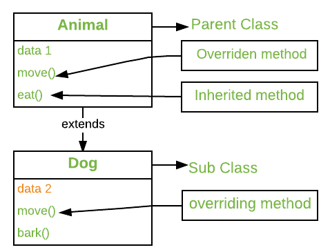
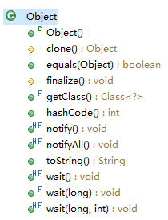
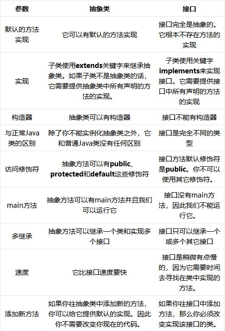
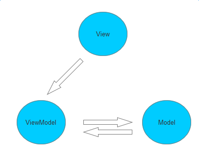

# Java基础


## Java中面向对象的特征

### 类

#### 内部类

> 内部类的定义：

灵魂之问

1. 为什么需要内部类
2. 内部类的特性

### 接口

### 抽象类


### Enum

### 之间的关系


## 重写和重载的区别 

### 重写(Override)

在任何面向对象的编程语言中，Oerriding是一个重要的特性，其允许直接子类/间接子类提供其父类或超类的某个方法的特殊实现。当子类中的方法和超类中方法具有：相同的方法名，相同的方法参数或签名，相同的返回值（或者是父类返回值的子类）；那么子类中的这个方法就被称作覆写了父类的方法。



方法重写是Java实现运行时多态的一种方式。具体执行哪个类里面的方法将由其调用的对象决定。 如果使用父类的对象来调用该方法，则将执行父类中的方法，但是如果使用子类的对象来调用该方法，则将执行子类中的方法。 换句话说，确定要执行哪个重写方法的是被引用对象的类型（而不是引用变量的类型）所决定的。

重写是子类对父类的允许访问的方法的实现过程进行重新编写, 返回值和形参都不能改变。**即外壳不变，核心重写！**

重写的好处在于子类可以根据需要，定义特定于自己的行为。 也就是说子类能够根据需要实现父类的方法。

重写方法不能抛出新的检查异常或者比被重写方法申明更加宽泛的异常。例如： 父类的一个方法申明了一个检查异常 IOException，但是在重写这个方法的时候不能抛出 Exception 异常，因为 Exception 是 IOException 的父类，只能抛出 IOException 的子类异常。

在面向对象原则里，重写意味着可以重写任何现有方法。

```java
// A Simple Java program to demonstrate 
// method overriding in java 
  
// Base Class 
class Parent { 
    void show() 
    { 
        System.out.println("Parent's show()"); 
    } 
} 
  
// Inherited class 
class Child extends Parent { 
    // This method overrides show() of Parent 
    @Override
    void show() 
    { 
        System.out.println("Child's show()"); 
    } 
} 
  
// Driver class 
class Main { 
    public static void main(String[] args) 
    { 
        // If a Parent type reference refers 
        // to a Parent object, then Parent's 
        // show is called 
        Parent obj1 = new Parent(); 
        obj1.show(); 
  
        // If a Parent type reference refers 
        // to a Child object Child's show() 
        // is called. This is called RUN TIME 
        // POLYMORPHISM. 
        Parent obj2 = new Child(); 
        obj2.show(); 
    } 
} 
```

**Output:**

```
Parent's show()
Child's show()
```

#### 方法的重写规则

1. 重写和访问修饰符

   重写的方法相比于被重写方法的访问修饰符可以更广，但是不能更窄。例如父类中的一个protected修饰的实例方法，其子类中重写的方法访问修饰符可以用public修饰，但是不能用private修饰。如果这样做的话，会产生编译错误。

   ```java
   // A Simple Java program to demonstrate 
   // Overriding and Access-Modifiers 
     
   class Parent { 
       // private methods are not overridden 
       private void m1() 
       { 
           System.out.println("From parent m1()"); 
       } 
     
       protected void m2() 
       { 
           System.out.println("From parent m2()"); 
       } 
   } 
     
   class Child extends Parent { 
       // new m1() method 
       // unique to Child class 
       private void m1() 
       { 
           System.out.println("From child m1()"); 
       } 
     
       // overriding method 
       // with more accessibility 
       @Override
       public void m2() 
       { 
           System.out.println("From child m2()"); 
       } 
   } 
     
   // Driver class 
   class Main { 
       public static void main(String[] args) 
       { 
           Parent obj1 = new Parent(); 
           obj1.m2(); 
           Parent obj2 = new Child(); 
           obj2.m2(); 
       } 
   }
   ```

   **Output:**

   ```
   From parent m2()
   From child m2()
   ```

2. fianl关键字修饰的方法不能够被重写 

   如果我们不想让一个方法被重写，可以将其申明为final。可以查看 [Using final with Inheritance](https://www.geeksforgeeks.org/using-final-with-inheritance-in-java/)

   ```java
   // A Java program to demonstrate that 
   // final methods cannot be overridden 
     
   class Parent { 
       // Can't be overridden 
       final void show() {} 
   } 
     
   class Child extends Parent { 
       // This would produce error 
       void show() {} 
   } 
   ```

   **Output:**

   ```
   13: error: show() in Child cannot override show() in Parent
       void show() {  }
            ^
     overridden method is final
   ```

3. 静态方法不能够被重写（方法重写-voerride vs 方法隐藏-hide）

   当子类中定义了和基类中具有相同签名的静态方法时，此行为被称为方法隐藏。

   下面的表格中总结了基类和子类中具有相同方法签名的声明为静态和非静态时会出现的结果：

   |                          |   SUPERCLASS INSTANCE METHOD   |    SUPERCLASS STATIC METHOD    |
   | :----------------------: | :----------------------------: | :----------------------------: |
   | SUBCLASS INSTANCE METHOD |           Overrides            | Generates a compile-time error |
   |  SUBCLASS STATIC METHOD  | Generates a compile-time error |             Hides              |

   ```java
   // Java program to show that 
   // if the static method is redefined by 
   // a derived class, then it is not 
   // overriding, it is hiding 
     
   class Parent { 
       // Static method in base class 
       // which will be hidden in subclass 
       static void m1() 
       { 
           System.out.println("From parent "
                              + "static m1()"); 
       } 
     
       // Non-static method which will 
       // be overridden in derived class 
       void m2() 
       { 
           System.out.println("From parent "
                              + "non-static(instance) m2()"); 
       } 
   } 
     
   class Child extends Parent { 
       // This method hides m1() in Parent 
       static void m1() 
       { 
           System.out.println("From child static m1()"); 
       } 
     
       // This method overrides m2() in Parent 
       @Override
       public void m2() 
       { 
           System.out.println("From child "
                              + "non-static(instance) m2()"); 
       } 
   } 
     
   // Driver class 
   class Main { 
       public static void main(String[] args) 
       { 
           Parent obj1 = new Child(); 
     
           // As per overriding rules this 
           // should call to class Child static 
           // overridden method. Since static 
           // method can not be overridden, it 
           // calls Parent's m1() 
           obj1.m1(); 
     
           // Here overriding works 
           // and Child's m2() is called 
           obj1.m2(); 
       } 
   } 
   ```

   **Output:**

   ```
   From parent static m1()
   From child non-static(instance) m2()
   ```

   强化说明：

   我们可以在子类中声明和父类相同的静态方法，但是这并不认为是重写，因为这并不是运行时多态。因此答案是“不能”。

   如果任何子类定义了一个和父类具有相同签名的静态方法，那么子类中的静态方法将会隐藏父类中的静态方法。

   ```java
   /* Java program to show that if static method is redefined by 
      a derived class, then it is not overriding. */
     
   // Superclass 
   class Base { 
         
       // Static method in base class which will be hidden in subclass  
       public static void display() { 
           System.out.println("Static or class method from Base"); 
       } 
         
        // Non-static method which will be overridden in derived class  
        public void print()  { 
            System.out.println("Non-static or Instance method from Base"); 
       } 
   } 
     
   // Subclass 
   class Derived extends Base { 
         
       // This method hides display() in Base  
       public static void display() { 
            System.out.println("Static or class method from Derived"); 
       } 
         
       // This method overrides print() in Base  
       public void print() { 
            System.out.println("Non-static or Instance method from Derived"); 
      } 
   } 
     
   // Driver class 
   public class Test { 
       public static void main(String args[ ])  { 
          Base obj1 = new Derived(); 
            
          // As per overriding rules this should call to class Derive's static  
          // overridden method. Since static method can not be overridden, it  
          // calls Base's display()  
          obj1.display();   
            
          // Here overriding works and Derive's print() is called  
          obj1.print();      
       } 
   } 
   ```

   Output:

   ```
   Static or class method from Base
   Non-static or Instance method from Derived
   ```

   下面是针对Java中static方法重写的一些重要的点：

   1）对于类（静态）方法，方法的调用是针对类，而不是针对具体的某个实例对象。这意味着方法的调用是在编译时决定的。

   2）对于实例（非静态）方法，方法的调用发生在具体的实例对象上。这意味着方法的调用是在运行时决定的。

   3）实例方法不能重写static方法，并且static方法不能隐藏实例方法。例如，以下程序有两个编译错误。

   ```java
   /* Java program to show that if static methods are redefined by 
      a derived class, then it is not overriding but hidding. */
     
   // Superclass 
   class Base { 
         
       // Static method in base class which will be hidden in subclass  
       public static void display() { 
           System.out.println("Static or class method from Base"); 
       } 
         
        // Non-static method which will be overridden in derived class  
        public void print()  { 
            System.out.println("Non-static or Instance method from Base"); 
       } 
   } 
     
   // Subclass 
   class Derived extends Base { 
         
       // Static is removed here (Causes Compiler Error)  
       public void display() { 
           System.out.println("Non-static method from Derived"); 
       } 
         
       // Static is added here (Causes Compiler Error)  
       public static void print() { 
           System.out.println("Static method from Derived"); 
      } 
   } 
   ```

   4）在子类中，我们可以重载继承自父类的方法。这种方法的重载既不会隐藏父类的方法又不会重写父类的方法-这是一个新的方法，子类独有的方法。

4. private修饰的方法不能被重写

   私有方法不能够被重写，因为它们是编译时绑定的。因此我们甚至无法覆盖子类中的私有方法

5. 重写方法的返回值必须和子类相同或者是父类返回值得派生类

   从Java 5.0及以后，子类重写父类的方法可以返回不同的返回值，但是子类的返回值类型必须是父类返回值的派生类。这种现象又被称作[**covariant return type**](https://www.geeksforgeeks.org/covariant-return-types-java/)。

6. 从子类调用重写方法：我们可以使用[super 关键字](http://quiz.geeksforgeeks.org/super-keyword/)在重写方法中调用父类方法。

   ```java
   // A Java program to demonstrate that overridden 
   // method can be called from sub-class 
     
   // Base Class 
   class Parent { 
       void show() 
       { 
           System.out.println("Parent's show()"); 
       } 
   } 
     
   // Inherited class 
   class Child extends Parent { 
       // This method overrides show() of Parent 
       @Override
       void show() 
       { 
           super.show(); 
           System.out.println("Child's show()"); 
       } 
   } 
     
   // Driver class 
   class Main { 
       public static void main(String[] args) 
       { 
           Parent obj = new Child(); 
           obj.show(); 
       } 
   } 
   ```

   **Output:**

   ```
   Parent's show()
   Child's show()
   ```

7. 构造函数不能够重写

   我们不能覆盖构造函数，因为父类和子类永远不能具有相同名称的构造函数（构造函数名称必须始终与类名称相同）。

8. 重写的异常处理，下面是重写时和异常相关的两条原则

   * 原则1：如果被重写的超类方法没有抛出任何异常，则子类的重写方法只能抛出 [unchecked exception](https://www.geeksforgeeks.org/checked-vs-unchecked-exceptions-in-java/)，抛出checked异常会导致编译时错误。

     ```java
     /* Java program to demonstrate overriding when  
       superclass method does not declare an exception 
     */
       
     class Parent { 
         void m1() 
         { 
             System.out.println("From parent m1()"); 
         } 
       
         void m2() 
         { 
             System.out.println("From parent  m2()"); 
         } 
     } 
       
     class Child extends Parent { 
         @Override
         // no issue while throwing unchecked exception 
         void m1() throws ArithmeticException 
         { 
             System.out.println("From child m1()"); 
         } 
       
         @Override
         // compile-time error 
         // issue while throwin checked exception 
         void m2() throws Exception 
         { 
             System.out.println("From child m2"); 
         } 
     } 
     ```

     **Output:**

     ```
     error: m2() in Child cannot override m2() in Parent
         void m2() throws Exception{ System.out.println("From child m2");}
              ^
       overridden method does not throw Exception
     ```

   * 原则2：如果被重写的超类方法抛出了异常，则子类重写的方法只能抛出相同的异常或者子类异常。 在Exception层次结构中抛出父异常将导致编译时错误。如果子类重写方法未引发任何异常，也没有问题。

     ```java
     // Java program to demonstrate overriding when 
     // superclass method does declare an exception 
       
     class Parent { 
         void m1() throws RuntimeException 
         { 
             System.out.println("From parent m1()"); 
         } 
     } 
       
     class Child1 extends Parent { 
         @Override
         // no issue while throwing same exception 
         void m1() throws RuntimeException 
         { 
             System.out.println("From child1 m1()"); 
         } 
     } 
     class Child2 extends Parent { 
         @Override
         // no issue while throwing subclass exception 
         void m1() throws ArithmeticException 
         { 
             System.out.println("From child2 m1()"); 
         } 
     } 
     class Child3 extends Parent { 
         @Override
         // no issue while not throwing any exception 
         void m1() 
         { 
             System.out.println("From child3 m1()"); 
         } 
     } 
     class Child4 extends Parent { 
         @Override
         // compile-time error 
         // issue while throwing parent exception 
         void m1() throws Exception 
         { 
             System.out.println("From child4 m1()"); 
         } 
     } 
     ```

     **Output:**

     ```
     error: m1() in Child4 cannot override m1() in Parent
         void m1() throws Exception
              ^
       overridden method does not throw Exception
     ```

9. 抽象方法的重写

   接口或抽象类中的抽象方法应在派生的具体类中重写，否则将引发编译时错误。

10. **synchronized/strictfp**方法的重写

    带有方法的synced / strictfp修饰符的存在对覆盖规则没有影响，即，synchronized / strictfp方法可能会覆盖非sync / strictfp方法，反之亦然。

#### 注意

1. 在c++中，我们需要virtual关键字去达到重写或者运行时多态的目的。在Java中的方法默认是virtual的。

2. 可以有多级方法重写

   ```java
   // A Java program to demonstrate 
   // multi-level overriding 
     
   // Base Class 
   class Parent { 
       void show() 
       { 
           System.out.println("Parent's show()"); 
       } 
   } 
     
   // Inherited class 
   class Child extends Parent { 
       // This method overrides show() of Parent 
       void show() { System.out.println("Child's show()"); } 
   } 
     
   // Inherited class 
   class GrandChild extends Child { 
       // This method overrides show() of Parent 
       void show() 
       { 
           System.out.println("GrandChild's show()"); 
       } 
   } 
     
   // Driver class 
   class Main { 
       public static void main(String[] args) 
       { 
           Parent obj1 = new GrandChild(); 
           obj1.show(); 
       } 
   } 
   ```

   **Output:**

   ```
   GrandChild's show()
   ```

3. 重写vs重载

   * 重载是同样的方法名拥有不同的方法签名。重写是同样的方法名，同样的方法签名但是通过继承连接不同的类

     

   * 重载是编译时多态的例子，而重写是运行时多态的一个例子

#### 为什么需要方法重写？

如前所述，重写允许Java支持运行时多态。多态于面向对象编程至关重要，原因之一是：多态性允许基类指定对其所有的子类通用的方法，同时允许子类根据需要对某些或者所有的方法的进行各自的内部实现。重写是Java实现多态性的“one interface， mutiple methods”方面的另一种方式。

Dynamic Method Dispatch是面向对象设计带来的最强大的机制之一，它影响了代码的重用性和健壮性。

重写方法使我们可以调用任何派生类的方法，甚至不知道派生类的对象的类型。

#### 总结

- 访问权限不能比父类中被重写的方法的访问权限更低。例如：如果父类的一个方法被声明为 public，那么在子类中重写该方法就不能声明为 protected。
- 声明为 final 的方法不能被重写。
- 声明为 static 的方法不能被重写，但是能够被再次声明。
- 返回类型与被重写方法的返回类型可以不相同，但是必须是父类返回值的派生类（java5 及更早版本返回类型要一样，java7 及更高版本可以不同）。
- 参数列表必须完全与被重写方法的相同。
- 父类的成员方法只能被它的子类重写。
- 子类和父类在同一个包中，那么子类可以重写父类所有方法，除了声明为 private 和 final 的方法。
- 子类和父类不在同一个包中，那么子类只能够重写父类的声明为 public 和 protected 的非 final 方法。
- 重写的方法能够抛出任何非强制异常，无论被重写的方法是否抛出异常。但是，重写的方法不能抛出新的强制性异常，或者比被重写方法声明的更广泛的强制性异常，反之则可以。
- 构造方法不能被重写。
- 如果不能继承一个方法，则不能重写这个方法。

### 重载(Overload)

重载(overloading) 是在一个类里面，方法名字相同，而方法签名不同（输入参数的个数或者输入参数的类型）；返回类型可以相同也可以不同。

重载和编译时多态相关。

```java
// Java program to demonstrate working of method 
// overloading in Java. 
  
public class Sum { 
  
    // Overloaded sum(). This sum takes two int parameters 
    public int sum(int x, int y) 
    { 
        return (x + y); 
    } 
  
    // Overloaded sum(). This sum takes three int parameters 
    public int sum(int x, int y, int z) 
    { 
        return (x + y + z); 
    } 
  
    // Overloaded sum(). This sum takes two double parameters 
    public double sum(double x, double y) 
    { 
        return (x + y); 
    } 
  
    // Driver code 
    public static void main(String args[]) 
    { 
        Sum s = new Sum(); 
        System.out.println(s.sum(10, 20)); 
        System.out.println(s.sum(10, 20, 30)); 
        System.out.println(s.sum(10.5, 20.5)); 
    } 
} 
```

Output :

```
30
60
31.0
```

#### 相关的问题：

* Q.当传入的实际参数类型和方法参数类型不匹配时会怎样。

  编译器蚕蛹以下步骤：

  1. 类型转换，但转换为同一系列中的更高类型（就范围而言）。
  2. 将类型转换为下一个更高的类型族（假设如果没有长数据类型可用于int数据类型，则它将搜索float数据类型）。

  让我们来看一个具体的示例，用来理解这些概念

  ```java
  class Demo { 
      public void show(int x) 
      { 
          System.out.println("In int" + x); 
      } 
      public void show(String s) 
      { 
          System.out.println("In String" + s); 
      } 
      public void show(byte b) 
      { 
          System.out.println("In byte" + b); 
      } 
  } 
  class UseDemo { 
      public static void main(String[] args) 
      { 
          byte a = 25; 
          Demo obj = new Demo(); 
          obj.show(a); // it will go to byte argument 
          obj.show("hello"); // String 
          obj.show(250); // Int 
          // Since char is 
          // not available, so the datatype 
          // higher than char in terms of 
          // range is int. 
          obj.show('A'); 
          obj.show("A"); // String 
          // since float datatype 
          // is not available and so it's higher 
          // datatype, so at this step their 
          // will be an error.
          obj.show(7.5); 
      } 
  } 
  ```

* 优势是什么？

  我们不必为执行相同操作的函数创建和记住不同的名称。 例如，在我们的代码中，如果Java不支持重载，则必须创建方法名称，例如sum1，sum2，…或sum2Int，sum3Int，…等。

* 能否根据返回值进行方法重载么？

  我们不能够根据返回值进行方法重载。这种行为就和C++中的一致。看下面这段代码

  ```java
  public class Main { 
      public int foo() { return 10; } 
    
      // compiler error: foo() is already defined 
      public char foo() { return 'a'; } 
    
      public static void main(String args[]) 
      { 
      } 
  } 
  ```

  然而，下面的情况是允许的：

  ```java
  // Java program to demonstrate the working of method 
  // overloading in static methods 
  public class Main { 
    
      public static int foo(int a) { return 10; } 
      public static char foo(int a, int b) { return 'a'; } 
    
      public static void main(String args[]) 
      { 
          System.out.println(foo(1)); 
          System.out.println(foo(1, 2)); 
      } 
  } 
  ```

  Output:

  ```
  10
  a
  ```

  ```java
  // Java program to demonstrate working of method 
  // overloading in  methods 
  class A { 
      public int foo(int a) { return 10; } 
    
      public char foo(int a, int b) { return 'a'; } 
  } 
    
  public class Main { 
    
      public static void main(String args[]) 
      { 
          A a = new A(); 
          System.out.println(a.foo(1)); 
          System.out.println(a.foo(1, 2)); 
      } 
  } 
  ```

  Output:

  ```
  10
  a
  ```

* 静态方法可以重载么？

  静态方法时可以重载的。我们可以有两个甚至更多的同名，但是入参不相同的方法。例如，参考下面的Java程序。

  ```java
  // filename Test.java 
  public class Test { 
      public static void foo() { 
          System.out.println("Test.foo() called "); 
      } 
      public static void foo(int a) {  
          System.out.println("Test.foo(int) called "); 
      } 
      public static void main(String args[]) 
      {  
          Test.foo(); 
          Test.foo(10); 
      } 
  } 
  ```

  Output:

  ```
  Test.foo() called 
  Test.foo(int) called 
  ```

* 我们可以仅仅通过static关键字的有无来进行方法的重载么？

  Java中我们不能重载两个仅static有无的方法（参数列表完全一致），看下面的代码；这个行为和C++是一致的。

  ```java
  // filename Test.java 
  public class Test { 
      public static void foo() { 
          System.out.println("Test.foo() called "); 
      } 
      public void foo() { // Compiler Error: cannot redefine foo() 
          System.out.println("Test.foo(int) called "); 
      } 
      public static void main(String args[]) {  
          Test.foo(); 
      } 
  } 
  ```

  Output: Compiler Error, cannot redefine foo()

* 是否可以重载main()方法。

  和其他的static方法一样，我们可以重载Java中的main()方法。

  ```java
  // A Java program with overloaded main() 
  import java.io.*; 
    
  public class Test { 
    
      // Normal main() 
      public static void main(String[] args) 
      { 
          System.out.println("Hi Geek (from main)"); 
          Test.main("Geek"); 
      } 
    
      // Overloaded main methods 
      public static void main(String arg1) 
      { 
          System.out.println("Hi, " + arg1); 
          Test.main("Dear Geek", "My Geek"); 
      } 
      public static void main(String arg1, String arg2) 
      { 
          System.out.println("Hi, " + arg1 + ", " + arg2); 
      } 
  } 
  ```

  Output :

  ```
  Hi Geek (from main)
  Hi, Geek
  Hi, Dear Geek, My Geek
  ```

  重要的点：

  Java中main方法并不是另类的方法。除了main()方法可以像其他任何方法一样被重载之外；JVM始终会查找该方法签名来启动程序。

  * 普通的main方法充当JVM开始执行程序的入口
  * 我们可以重载Java中的main方法。但是，当我们运行您的程序时，该程序不会执行重载的main方法，我们只需要从实际的main方法中调用重载的main方法即可。

* Java是否支持运算符重载？

  和C++不同，Java不允许用户自定义重载运算符。Java内部重载了运算符，例如，+被重载以进行拼接

* 重写和重载的区别

  * 重载是相同的名称的函数具有不同的方法签名。重写是相同的函数，相同的签名，但是通过继承连接起来的不同的类

    

  * 重载是编译时多态的一个示例，而重写是运行时多态的一个示例。

#### **方法的重载规则**

- 被重载的方法必须改变参数列表(参数个数或类型不一样)；
- 被重载的方法可以改变返回类型；
- 被重载的方法可以改变访问修饰符；
- 被重载的方法可以声明新的或更广的检查异常；
- 方法能够在同一个类中或者在一个子类中被重载。
- 无法以返回值类型作为重载函数的区分标准。

#### 实例

Overloading.java 文件代码：

```java
public class Overloading {
    public int test(){
        System.out.println("test1");
        return 1;
    }
 
    public void test(int a){
        System.out.println("test2");
    }   
 
    //以下两个参数类型顺序不同
    public String test(int a,String s){
        System.out.println("test3");
        return "returntest3";
    }   
 
    public String test(String s,int a){
        System.out.println("test4");
        return "returntest4";
    }   
 
    public static void main(String[] args){
        Overloading o = new Overloading();
        System.out.println(o.test());
        o.test(1);
        System.out.println(o.test(1,"test3"));
        System.out.println(o.test("test4",1));
    }
}
```

### 重写与重载之间的区别

| 区别点   | 重载方法 | 重写方法                                       |
| :------- | :------- | :--------------------------------------------- |
| 参数列表 | 必须修改 | 一定不能修改                                   |
| 返回类型 | 可以修改 | 一定不能修改                                   |
| 异常     | 可以修改 | 可以减少或删除，一定不能抛出新的或者更广的异常 |
| 访问     | 可以修改 | 一定不能做更严格的限制（可以降低限制）         |

### 总结

方法的重写(Overriding)和重载(Overloading)是java多态性的不同表现，重写是父类与子类之间多态性的一种表现，重载可以理解成多态的具体表现形式。

- (1)方法重载是一个类中定义了多个方法名相同,而他们的参数的数量不同或数量相同而类型和次序不同,则称为方法的重载(Overloading)。
- (2)方法重写是在子类存在方法与父类的方法的名字相同,而且参数的个数与类型一样,返回值也一样的方法,就称为重写(Overriding)。
- (3)方法重载是一个类的多态性表现,而方法重写是子类与父类的一种多态性表现。


## Java中的保留字段

### 访问权限控制符

### 字段修饰符

#### static

#### final

#### volatile

## final, finally, finalize 的区别

1.final

final修饰类：不能被继承，没有子类。且final类中的方法默认是final的；设计时，如果确定这个类不需要有子类，类的实现细节不允许改变，并且确信这个类不会被扩展，那就设计为final类。

final修饰变量（静态变量，实例变量，局部变量）：表示常量，只能被赋值一次，赋值后值不再改变；

final修饰方法：不能被子类的方法覆盖，但可以被继承；

2.finally

https://www.ibm.com/developerworks/cn/java/j-lo-finally/?lnk=hm

异常处理时提供finally块来执行任何清除操作。不管有没有异常被抛出、捕获，finally块都会被执行（除了特别的情况，如调用System.exit(0)）。

try块中的内容是在无异常时执行到结束。

catch块中的内容，是在try块内容发生catch所声明的异常时，跳转到catch块中执行。

finally块则是无论异常是否发生，都会执行finally块的内容，所以在代码逻辑中有需要无论发生什么都必须执行的代码，就可以放在finally块中。

3.finalize:

finalize是方法名。java技术允许使用finalize（）方法在垃圾收集器将对象从内存中清除出去之前做必要的清理工作。这个方法是由垃圾收集器在确定这个对象没有被引用时对这个对象调用的。它是在object类中定义的，因此所有的类都继承了它。子类覆盖finalize（）方法以整理系统资源或者被执行其他清理工作。finalize（）方法是在垃圾收集器删除对象之前对这个对象调用的。

最新的jdk版本中不再提供该方法。

## Object类中有哪些方法（注意和新版本中的Object方法进行比较）

构造方法：Object（）

判断对象是否相等：hashcoe（），equals（Object）

线程相关：wait...，notify（）

复制对象：clone（）

垃圾回收：finalize（）

对象本身相关内容：toString（）

getClass（） 

​     

**equals:**

​	== 和equal的区别：==表示变量值完全相同（对于基础类型，地址中存储的是值，引用类型则存储指向实际对象的地址）；equals表示的是对象的内容完全相同，此处的内容多指对象的特性/属性。

​	查阅源码，我们可以看到，Object的equals内部也是用==判断是否相等（https://blog.csdn.net/striverli/article/details/52997927）

**hashcode:**

​	java约定，重写equals方法必须重写hashcode方法

​	同一对象调用hashcode，返回的hashcode是相同的，前提是equals没有被修改，同一对象执行到不同时刻，返回的hashcode无需一致

​	<font color=red>**即严格的数学逻辑表示为： 两个对象相等 <=> equals()相等 => hashCode()相等。因此，重写equlas()方法必须重写hashCode()方法，以保证此逻辑严格成立，同时可以推理出：hasCode()不相等 => equals（）不相等 <=> 两个对象不相等。**</font>

​	哈希码方便集合中对象的查找，通过预先计算对象的哈希码，然后通过哈希算法计算出其在Set中存放的位置，直接判断此位置上是否已有此对象即可：

​     一、当我们向一个set、HashMap、HashSet、HashTable集合中添加某个元素，集合会首先调用该对象的hashCode方法，

​     这样就可以直接定位它所存储的位置，若该处没有其他元素，则直接保存。

​     若该处已经有元素存在，就调用equals方法来匹配这两个元素是否相同，相同则不存，不同则散列到其他位置

​     二、hashCode重要么？

​     对于List集合、数组而言，他就是一个累赘，不重要；但是对于HashMap、HashSet、HashTable而言，它变得异常重要

**toString:**：

​	由对象的类型和其哈希码唯一确定，同一类型但不相等的两个对象分别调用toString（）

**wait（...），notify，notifyAll:**

​	wait（）：Causes the current thread to wait until another thread invokes the [notify()](https://docs.oracle.com/javase/8/docs/api/java/lang/Object.html#notify--) method or the [notifyAll()](https://docs.oracle.com/javase/8/docs/api/java/lang/Object.html#notifyAll--) method for this object.

​	wait（long）/wait（long，int）：等待超时

​	wait和notify一般都是配对使用，且只能在同步代码块中才能使用，因为要对持有锁的线程操作

​	1、wait(...)方法调用后当前线程将立即阻塞，且释放其所持有的同步代码块中的锁，直到被唤醒或超时或打断后且重新获取到锁后才能继续执行；

​	2、notify()/notifyAll()方法调用后，其所在线程不会立即释放所持有的锁，直到其所在同步代码块中的代码执行完毕，此时释放锁，因此，如果其同步代码块后还有代码，其执行则依赖于JVM的线程调度。

​	sleep和wait的区别就是：调用sleep方法的线程不会释放对象锁，而调用wait方法会释放对象锁

## 为什么wait，notify这些会放在object中（java面试高频问题之一）

   简单来说是因为锁，Sychronized锁可以是任意对象，让当前线程等待某个对象的锁，当然应该通过这个对象来操作。而不是用当前线程来操作，因为当前线程可能会等待多个线程的锁，如果通过线程来操作，就非常复杂。

  本质上：这些个方法在操作同步线程时，都必须要标识它们操作线程的锁，同一个锁上的被等待线程，可以被同一个锁上的notify唤醒，不可以对不同锁中的线程进行唤醒->等待和唤醒必须是同一个锁

   概括为：

   1.这些方法用于同步中

   2.这些方法时必须要标识所属的同步的锁

   3.锁可以是任意对象，所以任意对象调用的方法一定是定义在Object类中

## java的单例模式

​     懒汉式，饿汉式、静态内部类加载、双重检查锁(能够手写直接跑通)

·    **请写出5种常见到的runtime exception**

​       Nullpointer exception ,arrayoutofboundsexception, classcastexception,illegalearguementsexception,unsupportedoperationexception

·    **int** **和** **Integer** 有什么区别，**Integer**的值缓存范围

​     base：

​     int是基本数据类型，integaer是int的包装类；integer必须实例化之后才能引用，而int不需要；integer实际是对象的引用，指向new之后的integer对象，而int直接存储改值；integer默认是null，而int默认是0

​     advance：

·    **包装类，装箱和拆箱**

​     Integer i = 5；//编译器自动装箱，实际调用Integer.Valueof(5)

​     int j = i；

## String、StringBuilder、StringBuffer

​     执行速度上：StringBuilder > StringBuffer > String

​     String一旦创建对象之后是不可更改的，Java中对String的操作实际上是一个不断创建新的对象并且回收旧的对象的过程，所以执行速度会慢

​     而StringBuilder和StringBuffer的对象是变量，对变量的操作就是直接对该对象进行更改，而不进行创建和回收操作，所以执行速度会快很多

​     线程安全上：

​     StringBuilder是线程不安全的，而StringBuffer是线程安全的；因为StringBuffer中很多方法可以带有Synchronized关键字，所以可以保证线程安全；正因为加了synchronized关键字，所以效率会有所降低；在单线程的情况下，还是建议使用速度比较快的stringbuilder。

### 灵魂之问

1. new String(byte[]) 之后干了哪些事情?

2. 分析下面代码片段，试问图片能不能正确保存？

   ```JAVA
   private void methodA() {
       String data = "..." // 接收到的网络图片数据，经过Base64编码后形成的字符串
       byte[] decode = Base64.decode(data, Base64.DEFAULT);
       // 假设此处只能获取到decode后的byte[], 但是methodB的参数又只能是String，通过如下调用会存在什么问题，图片能不能正确保存
       methodB(new String(decode););
   }
   
   private void methodB(String str) {
       OutputStream os = ...; // os打开的文件名称格式正确
       os.write(str.getBytes());
   }
   ```

3. （插一个Android的问题）Android中的String.java中为什么所有的构造方法都没有具体实现，都是简单地抛出了一个异常？其具体的实现在哪里？

   ```java
   /**
        * Initializes a newly created {@code String} object so that it represents
        * the same sequence of characters as the argument; in other words, the
        * newly created string is a copy of the argument string. Unless an
        * explicit copy of {@code original} is needed, use of this constructor is
        * unnecessary since Strings are immutable.
        *
        * @param  original
        *         A {@code String}
        */
   public String(String original) {
       // Android-changed: Constructor unsupported as all calls are intercepted by the runtime.
       throw new UnsupportedOperationException("Use StringFactory instead.");
   }
   ```

   我们看到上面的一句注释：// Android-changed: Constructor unsupported as all calls are intercepted by the runtime.

   请你说明String构造函数是怎样被runtime拦截的？或者说说runtime拦截一个类的构造方法的原理？

## **抽象类和接口有什么区别**

​    相似：都不能被实例化，都可以包含抽象方法，实现接口或继承抽象类的普通子类必须实现这些方法

​     区别：

​     一个类可以实现多个接口，而最多只能继承一个直接父类，包括抽象类；接口中所有方法都是抽象的，不能有具体实现，而抽象类可以有普通方法的具体实现，接口中的方法必须为public修饰

**java10.0**中更改了一些特性，接口中可以有方法的具体实现



应用场景：

   当涉及到公共方法的具体实现时，可以使用抽象类，将这些公共方法写到抽象类中，也就是说抽象方法可以实现代码复用

   当涉及到多重继承的时候，这时，接口的优势就发挥了，这种情况下可以使用接口；简单来说，抽象类是对根源的概括，而接口是对动作的概括，以男女为例来说，他们的抽象类是人，而人的动作包括吃饭...，可以定义成接口；即关注事物的本质的时候，用抽象类，关注一个操作的时候，用接口

  使用的时候就需要考虑周全，抽象类的代价较高，要编写出所有子类的共性；接口则会弱化很多，关注的是动作。

## 说说反射的用途及实现

概念：反射机制是在运行状态中，对于任意一个类，都能够知道这个类的所有属性和方法

## 说说自定义注解的场景及实现

## HTTP请求的GET与POST方式的区别


同时，可见性方面，Get请求，请求的数据会被附加在URL之后，以?分割URL和传输数据，多个参数是用&连接，所有的非ASCII编码字符都要编码之后进行传输；而POST请求会把请求数据放置在HTTP请求包的包体中。


## 列出自己常用的JDK包

  java.lang:语言包，该包中主要包含的类有：

  1.Object类：所有类的父类，其中定义的方法其他类都可以使用

  2.数据类型包装类：简单数据类型的包装类，Integer，Float，Boolean等

  3.数学类Math：提供常量和数学函数，包括E和PI常数及abs(),sin(),cos(),min(),max(),random()等方法，这些常量和方法都是静态的

  4.字符串类String和StringBuffer类

  5.系统和运行时类：System类提供一个独立于具体系统资源的编程界面；Runtime类可以直接访问运行时资源

  6.操作类：Class和Classloafder类，Class提供了对象运行时的若干信息，Classloader是一个抽象类，它提供了将类名转换成文件名并在文件系统中查找并装载该文件的方法

  7.线程类：Thread类。Java是一个多线程环境，主要有Thread，ThreadDeath，ThreadGroup，Runnnable

  8.错误和异常处理类：Throwable（所有错误和异常处理的父类），Exception（处理异常，需要用户捕获处理）和Error（处理硬件错误，不要用户捕获处理）

  9.进程类Process：支持系统进程，当Runtime执行系统命令时，会建立处理系统进程的Process

 

java.util:

实用包提供了各种实用功能的类，主要包括日期类、数据结构类和随机数类等。

1.日期类：包括Date（获取日期和时间）、Calendar（抽象类，日历类）和GregorianCalendar（Calendar类的子类）类。

2.数据结构类：包括链表类LinkedList、向量类Vector、栈类Stack和散列表类Hashtable等。

3.随机数类Random：封装了Math类中的random方法，并提供了更多的辅助功能。

 

[java.io](http://java.io/):

[java.io](http://java.io/)提供了系统输入输出类和接口，只要包括输入流类InputStream和输出流OutputStream就可以实现文件的输入输出、管道的数据传输以及网络数据传输的功能

 

[java.net](http://java.net/):

[java.net](http://java.net/)提供了实现网络应用程序的类，主要包括用于实现Socket通信的Socket类，此外还提供了便于处理URL的类

## MVC设计思想

概念：

MVC是一种框架模式，而不是一种设计模式，框架通常是实现代码重用，而设计模式往往是设计上的重用，架构则介于两者之间，部分代码重用，部分设计重用。

model（业务数据）：通常情况下处理的任务最多。比如对数据库的操作，模型返回的数据是和将要显示的格式无关，这样的数据能为多个视图提供数据，减少了代码的重复性

view（视图）：与用户交互的界面

control（控制器）：控制器接收用户的输入并调用模型和视图去完成用户需求


大体工作流程：用户触发事件时，view层会发送指令到Controller层，接着Controller去通知model层更新释放数据 ，model层更新释放完数据直接显示在view层上。

之所以设计MVC，我想是为了实现model层和view层的代码分离，从而使一个程序可以表现出不同的形式，Controlller则是为了保证model和view之间的同步

 

但是有时候，有些逻辑实现要在view层，有时会跨越controller层，直接和model进行交互，这些在view里实现的业务逻辑不能被其他view重用。这就是MVC和MVP最主要的区别

 

优点：MVC 式的出现不仅实现了功能模块和显示模块的分离，同时它还提高了应用系统的可维护性、可扩展性、可移植性和组件的可复用性

1：耦合性低

　　视图层和业务层分离，这样就允许更改视图层代码而不用重新编译模型和控制器代码,[例如，改写jsp,html,css,javascirpt的代码，并不需要重启服务器]同样，一个应用的业务流程或者业务规则的改变只需要改动MVC的模型层即可[例如，换表名查询，更改一些查询的条件，或者使用动态sql还是静态的sql，只用更改model即可]。因为模型与控制器和视图相分离，所以很容易改变应用程序的数据层和业务规则。

2：重用性高

　　随着技术的不断进步，需要用越来越多的方式来访问应用程序。MVC模式允许使用各种不同样式的视图来访问同一个服务器端的代码，因为多个视图能共享一个模型，它包括任何WEB(HTTP)浏览器或者无线浏览器(wap)，比如，用户可以通过电脑也可通过手机来订购某样产品，虽然订购的方式不一样，但处理订购产品的方式是一样的。由于模型返回的数据没有进行格式化，所以同样的构件能被不同的界面使用。[例如，模型层实现了同样的分页，不同的视图层可以用一万种不同的显示方法，例如百度搜索下面的分页和谷歌搜索下面的分页]MVC使开发和维护用户接口的技术含量降低。

3：部署快

　　使用MVC模式使开发时间得到相当大的缩减，它使程序员(Java开发人员)集中精力于业务逻辑，界面程序员(HTML和JSP开发人员)集中精力于表现形式上。[例如，前端后端可以分工作业，效率高，方便多开发人员间的分工]

4：可维护性高

　　分离视图层和业务逻辑层也使得WEB应用更易于维护和修改。[例如：如果想改业务逻辑，只用改业务逻辑，如果想改视图，只用改视图，如果想增加功能，只需要增加即可，分层最大的好处就是容易后期维护降低维护成本，和增加新的功能，提高代码重用性，从而提高开发效率]

5：有利软件工程化管理

　　由于不同的层各司其职，每一层不同的应用具有某些相同的特征，有利于通过工程化、工具化管理程序代码。控制器也提供了一个好处，就是可以使用控制器来联接不同的模型和视图去完成用户的需求，这样控制器可以为构造应用程序提供强有力的手段。给定一些可重用的模型和视图，控制器可以根据用户的需求选择模型进行处理，然后选择视图将处理结果显示给用户。[因为控制器重点在于分配，更好的结合视图和模型]

 

缺点：

1：没有明确的定义

　　完全理解MVC并不是很容易。使用MVC需要精心的计划，由于它的内部原理比较复杂，所以需要花费一些时间去思考。同时由于模型和视图要严格的分离，这样也给调试应用程序带来了一定的困难。每个构件在使用之前都需要经过彻底的测试。

2：不适合小型，中等规模的应用程序

　　花费大量时间将MVC应用到规模并不是很大的应用程序通常会得不偿失。[这个是最明显的缺点，例如我们仅仅需要到数据库查信息，如果不分层设计我们可以直接从视图型层到模型去访问，效率上会有所提高，如果以代码的复杂性为代价，多了一层，代码量大大增加，在这个时候就降低了开发效率]

3：增加系统结构和实现的复杂性

　　对于简单的界面，严格遵循MVC，使模型、视图与控制器分离，会增加结构的复杂性，并可能产生过多的更新操作，降低运行效率。

4：视图与控制器间的过于紧密的连接

　　视图与控制器是相互分离，但却是联系紧密的部件，视图没有控制器的存在，其应用是很有限的，反之亦然，这样就妨碍了他们的独立重用。[例如，不可能总是在jsp页面中直接访问模型，一般放在逻辑控制层进行处理，servlet]

5：视图对模型数据的低效率访问

　　依据模型操作接口的不同，视图可能需要多次调用才能获得足够的显示数据。对未变化数据的不必要的频繁访问，也将损害操作性能。[例如，页面的有一部分数据我并没有更新，但是提交到模型层照样会去获得返回显示 ]

 

6：一般高级的界面工具或构造器不支持模式

　　改造这些工具以适应MVC需要和建立分离的部件的代价是很高的，会造成MVC使用的困难。

总结：

　　优点：分层，结构清晰，耦合性低，大型项目代码的复用性得到极大的提高，开发人员分工明确，提高了开发的效率，维护方便，降低了维护成本。

　　缺点：简单的小型项目，使用MVC设计反而会降低开发效率，层和层虽然相互分离，但是之间关联性太强，没有做到独立的重用。

## MVP设计思想

   view层和modle层不再相互可知，完全解耦，取而代之的是Presenter层充当桥梁的作用

​    

   动手实现https://www.jianshu.com/p/8586f5042579

https://blog.csdn.net/github_33304260/article/details/53161277

https://blog.csdn.net/jdsjlzx/article/details/51174396

## MVVM设计思想

​     

 

## 什么是Java序列化和反序列化，如何实现Java序列化？或者请解释Serializable 接口的作用

  概念：Serializable接口，以及相关的东西，全部都在java io里面

  序列化：把对象转换为字节序列的过程

  反序列化：把字节序列恢复为对象的过程

 

  什么情况下需要序列化：

  1.需要把内存中的对象保存到一个文件中的时候

  2.想用套接字在网络上传输对象的时候

  3.想用RMI（Remote method invocation）传输对象的时候

 

  如何实现序列化：

  对象实现Serializable接口，调用ObjectOutputStream.writeObject()


 

下面是程序执行入口：


 

执行结果：


 

上面的几行代码：

1.实现对象的序列化和反序列化

2.transient关键字修饰的属性，不会被序列化，可以看到设置的name为null（前提是我们实现的是Serializable接口，若实现的是Externalizable接口另当别论）

3.我们预先定义的静态变量也被序列化了？

 

验证静态变量能不能被序列化，我们先进行序列化，然后将main方法中的第十三行注释掉，并修改LoveYou类中的第十三行修改为：**private** **static** String *yourAge* = "birth last year";

重新执行代码，结果输出：


我们的对象age变为"birth last year"（去年出生的)，并不是序列化时的"not birth yet"(还没有出生),所以static属性，不能序列化

  

***serialVersionUID\******的作用和用法\***

 

现在如果我们将这一行注释掉，然后执行代码，会报如下错误：


因为我们一开始指定了serialVersionUID = 1L，序列化之后再将这行注释掉，执行代码，java会自动给我们这个id赋值，这个值是根据model的属性相关计算出来的，这个计算的值对类有较强的敏感性，此时，两个id不匹配，就会抛出异常，原因就是序列化和反序列化的ID版本号不同导致的

为了跨不同java编译器实现的一致性，建议序列化的时候一定要给这个serialVersionUID赋值，而且如果我们不赋值，编辑器会提示黄色警告，让我们加上这个值。

那么我们给这个值赋值为多少呢？简单的1L就行了，这样可以确保代码一致时反序列化成功。

 


 

注意点：

可序列化的所有子类本身必须都是可序列化的

## RMI（远程方法调用）

https://blog.csdn.net/lmy86263/article/details/72594760


## 

## 谈谈HashMap，哈希表解决hash冲突的方法；

## 为什么要重写hashcode()和equals()以及他们之间的区别与关系；

## Object的hashcode()是怎么计算的？

## 若hashcode方法永远返回1或者一个常量会产生什么结果？

## Java Collections和Arrays的sort方法默认的排序方法是什么；

## 引用计数法与GC Root可达性分析法区别；

## 浅拷贝和深拷贝的区别；

## String s="abc"和String s=new String("abc")区别；

## HashSet方法里面的hashcode存在哪，如果重写equals不重写hashcode会怎么样？

## 反射的作用与实现原理；

## Java中的回调机制；

## 模板方法模式；

## 开闭原则说一下；

## 发布/订阅使用场景；

## KMP算法（一种改进的字符串匹配算法）；

## JMM里边的原子性、可见性、有序性是如何体现出来的，JMM中内存屏障是什么意思，

## 怎么解决Hash冲突；（开放地址法、链地址法、再哈希法、建立公共溢出区等）

## 写出一个必然会产生死锁的伪代码；

## Spring IoC涉及到的设计模式；（工厂模式、单利模式。。）

## toString()方法什么情况下需要重写；

## 判断对象相等时，什么情况下只需要重写 equals()，什么情况下需要重写 equals(),hashcode()？

## Set内存放的元素为什么不可以重复，内部是如何保证和实现的？

## 如何保证分布式缓存的一致性(分布式缓存一致性hash算法?)？分布式session实现？

## Java 8流式迭代的好处？

## 项目中用到的JDK的哪些特性？

## 说一下TreeMap的实现原理？红黑树的性质？红黑树遍历方式有哪些？如果key冲突如何解决？setColor()方法在什么时候用？什么时候会进行旋转和颜色转换？

## Spring的bean的创建时机？依赖注入的时机？

## ArrayList和LinkList的删除一个元素的时间复杂度；（ArrayList是O(N)，LinkList是O(1)）；

## CopyOnWriteArrayList是什么；

## 序列化和反序列化底层如何实现的（ObjectOutputStream 、ObjectInputStream、 readObject writeObject）；

## 如何调试多线程的程序；

## 一个线程连着调用start两次会出现什么情况？（由于状态只有就绪、阻塞、执行，状态是无法由执行转化为执行的，所以会报不合法的状态！）

## HashMap在什么时候时间复杂度是O（1），什么时候是O（n），什么时候又是O（logn）；

## wait方法能不能被重写？（wait是final类型的，不可以被重写，不仅如此，notify和notifyall都是final类型的），wait能不能被中断；

## 一个Controller调用两个Service，这两Service又都分别调用两个Dao，问其中用到了几个数据库连接池的连接？

## 为什么JVM调优经常会将-Xms和-Xmx参数设置成一样；

## Java线程池的核心属性以及处理流程；

## Java内存模型，方法区存什么；

## CMS垃圾回收过程；

## Full GC次数太多了，如何优化；

## 直接内存如何管理的；

## Java线程池的几个参数的意义和实现机制；

## Java线程池使用无界任务队列和有界任务队列的优劣对比；

## CountDownLatch和CyclicBarrier的区别；

## Java中有哪些同步方案（重量级锁、显式锁、并发容器、并发同步器、CAS、volatile、AQS等）

## 如果你的项目出现了内存泄露，怎么监控这个问题呢；

## 标记清除和标记整理的区别和优缺点，为何标记整理会发生stop the world；

## 线程池，如何根据CPU的核数来设计线程大小，如果是计算机密集型的呢，如果是IO密集型的呢？

## 让你设计一个cache如何设计；

## String中hashcode是怎么实现的；

## JDK中哪些实现了单例模式？

## 多个线程同时读写，读线程的数量远远⼤于写线程，你认为应该如何解决并发的问题？你会选择加什么样的锁？

## 线程池内的线程如果全部忙，提交⼀个新的任务，会发⽣什么？队列全部塞满了之后，还是忙，再提交会发⽣什么？

## synchronized关键字锁住的是什么东西？在字节码中是怎么表示的？在内存中的对象上表现为什么？

## wait/notify/notifyAll⽅法需不需要被包含在synchronized块中？这是为什么？

## ExecutorService你一般是怎么⽤的？是每个Service放一个还是个项目放一个？有什么好处？

## 乐观悲观锁的设计，如何保证原子性，解决的问题；

## char和double的字节，以及在内存的分布是怎样；

## 对象内存布局，然后讲下对象的死亡过程？

## 对象头，详细讲下；

## sync原理详细，sync内抛异常会怎样，死锁吗？还是释放掉？怎么排查死锁？死锁会怎样？有没有什么更好的替代方案？

## 详细讲一下集合，HashSet源码，HashMap源码，如果要线程安全需要怎么做？

## 多线程是解决什么问题的？线程池解决什么问题？

## 线程池，如何设计的，里面的参数有多少种，里面的工作队列和线程队列是怎样的结构，如果给你，怎样设计线程池？

## AQS原理，ReentranLock源码，设计原理，整体过程。

## 继续聊多线程源码，sync原理，然后一个场景设计题；

## float f = 1.4f;double d = 1.4d; 与 float f = 1.5f;double d = 1.5d; 是否为true，内存是怎样的；

## split的源码，split("a|b|c");得出多少个数组；

## 把所有认识熟用的JUC( java.util.concurrent(简称JUC)包)下的类写出来，讲下使用，然后讲下原生的线程操作;

## 开闭原则，解析工厂方法模式，建造者模式，区别。手撸出来。

## 讲下JVM的大页模式，JVM内存模型;

## 什么是敏捷开发，防御性编程，并行编程。Team Leader的思考;

## 逃逸分析是什么，作用是什么，用途是什么;

## 怎么认为一个类是线程安全？线程安全的定义是什么？Java有多少个关键字进行同步？为什么这样设计？（聊了一大堆，一堆为什么）；

## 两个线程设计题。记得一个是：t1,t2,t3，让t1，t2执行完才执行t3，原生实现。

## 写个后缀表达式，为什么要设计后缀表达式，有什么好处？然后写下中缀。

## 我看你做过性能优化，比如你怎么分析项目里面的OOM的，内存泄露呢？详细说思路;

## 说下多线程，我们什么时候需要分析线程数，怎么分析，分析什么因素;

## 抽象方法和类方法的区别，static的抽象方法可以吗？

## 说下Java的克隆体系;

## 涉及OOM、JVM优化、源码问题、数据库优化、多线程等问题;

## CPU高？什么情况CPU高？解决什么问题？

## 你有遇到过临界区问题吗？有遇到过吗？你在项目遇到这个问题是怎样解决的？

## Java的多态怎么实现;

## 解释一下自旋;

## 解释一下信号量;

## 什么情况下会触发类加载；

## Java内存抖动严重，优化的思路；

## 灵魂之问

1. Java中枚举类是怎样工作的？和普通的类有什么区别？什么是整数枚举模式和字符串枚举模式，枚举还可以有哪些模式（即还可以用来干什么）？

   分析下面代码：

   ```java
   public class EnumTest {
       public static void main(String[] args) {
           System.out.println(Answer.YES); //
           System.out.println(Answer.NO); // 输出是什么，内部发生了什么，可从字节码角度分析
       }
   }
   
   enum Answer {
       YES {
           @Override
           public String toString() {
               return "yes";
           }
       },
       NO,
       MAYBE
   }
   ```

   再来看下一段代码，对上面的作了简化

   ```java
   public enum ComparisonResult {
       ORDERED_ASCENDING;
       ORDERED_SAME,
       ORDERED_DESCENDING
   }
   
   // 在内存中这三个值是如何存储的，从上面的代码可看出没什么输出是string字符串，而不是整型0,1,2之类的数
   ```

2. 看下面的代码，分析执行结果，并解释具体原理，能够从字节码的角度深入分析？为什么这样设计？

   ```java
   public class Increment {
   	public static void main(String[] args) {
   		increase1();
           increase2();
   	}
       
       private void increase1() {
           int count = 0;
           for (int i = 0; i < 100; i++) {
               count = count++;
           }
           
           System.out.println(count);
       }
       
       private void increase2() {
           int count = 0;
           for (int i = 0; i < 100; i++) {
               count++;
           }
           
           System.out.println(count);
       }
   }
   ```

3. Java中的多态是否违背了里式替换原则？

4. 字段修饰符

   * static 修饰的字段具有什么特性
* final修饰的字段具有什么特性
   * static fianal修饰的字段具有什么特性？不可变的含义是什么，值不可变还是地址不可变？
* volidate修饰的字段有什么特性？一般什么场景需要用到？
  
5. 抽象和封装的区别（What‘s the difference between abstraction and encapsulation?）

   http://java67.blogspot.com/2012/08/difference-between-abstraction-and-encapsulation-java-oops.html

   
