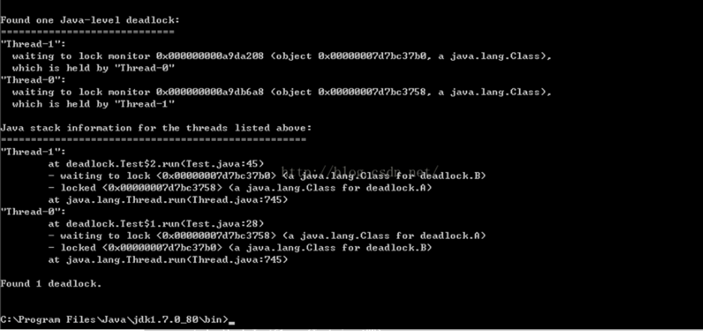
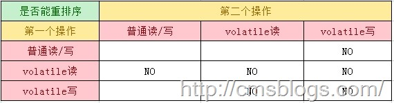
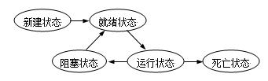

## 线程安全问题，什么是线程安全，如何保证线程安全

定义：当多个线程访问同一个类（对象或方法）的时候，该类都能表现出正常的行为（与自己预想的结果一致），那我们就可以说这个类是线程安全的。

 

概念：

如果你的代码所在的进程中有多个线程在同时运行，而这些线程可能会同时运行这段代码。如果每次运行结果和单线程运行的结果是一样的，而且其他的变量的值也和预期的是一样的，就是线程安全的。

或者说:一个类或者程序所提供的接口对于线程来说是原子操作或者多个线程之间的切换不会导致该接口的执行结果存在二义性,也就是说我们不用考虑同步的问题。

线程安全问题都是由全局变量及静态变量引起的。

若每个线程中对全局变量、静态变量只有读操作，而无写操作，一般来说，这个全局变量是线程安全的；若有多个线程同时执行写操作，一般都需要考虑线程同步，否则的话就可能影响线程安全。

 

安全性：

比如一个 ArrayList 类，在添加一个元素的时候，它可能会有两步来完成：1. 在 Items[Size] 的位置存放此元素；2. 增大 Size 的值。在单线程运行的情况下，如果 Size = 0，添加一个元素后，此元素在位置 0，而且 Size=1；而如果是在多线程情况下，比如有两个线程，线程 A 先将元素存放在位置 0。但是此时 CPU 调度线程A暂停，线程 B 得到运行的机会。线程B也向此 ArrayList 添加元素，因为此时 Size 仍然等于 0 （注意，我们假设的是添加一个元素是要两个步骤哦，而线程A仅仅完成了步骤1），所以线程B也将元素存放在位置0。然后线程A和线程B都继续运行，都增加 Size 的值。那好，我们来看看 ArrayList 的情况，元素实际上只有一个，存放在位置 0，而 Size 却等于 2。这就是“线程不安全”了。安全性：

线程安全性不是一个非真即假的命题。 Vector 的方法都是同步的，并且 Vector 明确地设计为在多线程环境中工作。但是它的线程安全性是有限制的，即在某些方法之间有状态依赖(类似地，如果在迭代过程中 Vector 被其他线程修改，那么由 Vector.iterator() 返回的 iterator会抛出ConcurrentModifiicationException)。对于 Java 类中常见的线程安全性级别，没有一种分类系统可被广泛接受，不过重要的是在编写类时尽量记录下它们的线程安全行为。Bloch 给出了描述五类线程安全性的分类方法：不可变、线程安全、有条件线程安全、线程兼容和线程对立。只要明确地记录下线程安全特性，那么您是否使用这种系统都没关系。这种系统有其局限性 -- 各类之间的界线不是百分之百地明确，而且有些情况它没照顾到 -- 但是这套系统是一个很好的起点。这种分类系统的核心是调用者是否可以或者必须用外部同步包围操作(或者一系列操作)。下面几节分别描述了线程安全性的这五种类别。不可变不可变的对象一定是线程安全的，并且永远也不需要额外的同步[1] 。因为一个不可变的对象只要构建正确，其外部可见状态永远也不会改变，永远也不会看到它处于不一致的状态。Java 类库中大多数基本数值类如 Integer 、 String 和 BigInteger 都是不可变的。需要注意的是，对于Integer，该类不提供add方法，加法是使用+来直接操作。而+操作是不具线程安全的。这是提供原子操作类AtomicInteger的原。线程安全线程安全的对象具有在上面“线程安全”一节中描述的属性 -- 由类的规格说明所规定的约束在对象被多个线程访问时仍然有效，不管运行时环境如何排线程都不需要任何额外的同步。这种线程安全性保证是很严格的 -- 许多类，如 Hashtable 或者 Vector 都不能满足这种严格的定义。

有条件的有条件的线程安全类对于单独的操作可以是线程安全的，但是某些操作序列可能需要外部同步。条件线程安全的最常见的例子是遍历由 Hashtable 或者 Vector 或者返回的迭代器 -- 由这些类返回的 fail-fast 迭代器假定在迭代器进行遍历的时候底层集合不会有变化。为了保证其他线程不会在遍历的时候改变集合，进行迭代的线程应该确保它是独占性地访问集合以实现遍历的完整性。通常，独占性的访问是由对锁的同步保证的 -- 并且类的文档应该说明是哪个锁(通常是对象的内部监视器(intrinsic monitor))。如果对一个有条件线程安全类进行记录，那么您应该不仅要记录它是有条件线程安全的，而且还要记录必须防止哪些操作序列的并发访问。用户可以合理地假设其他操作序列不需要任何额外的同步。线程兼容线程兼容类不是线程安全的，但是可以通过正确使用同步而在并发环境中安全地使用。这可能意味着用一个 synchronized 块包围每一个方法调用，或者创建一个包装器对象，其中每一个方法都是同步的(就像 Collections.synchronizedList() 一样)。也可能意味着用 synchronized 块包围某些操作序列。为了最大程度地利用线程兼容类，如果所有调用都使用同一个块，那么就不应该要求调用者对该块同步。这样做会使线程兼容的对象作为变量实例包含在其他线程安全的对象中，从而可以利用其所有者对象的同步。许多常见的类是线程兼容的，如集合类 ArrayList 和 HashMap 、 java.text.SimpleDateFormat 、或者 JDBC 类 Connection 和 ResultSet 。线程对立线程对立类是那些不管是否调用了外部同步都不能在并发使用时安全地呈现的类。线程对立很少见，当类修改静态数据，而静态数据会影响在其他线程中执行的其他类的行为，这时通常会出现线程对立。线程对立类的一个例子是调用 System.setOut() 的类。

 

## 多线程编程中的三个核心概念

### 原子性

这一点，跟数据库事务的原子性概念差不多，即一个操作（有可能包含有多个子操作）要么全部执行（生效），要么全部都不执行（都不生效）。

关于原子性，一个非常经典的例子就是银行转账问题：比如A和B同时向C转账10万元。如果转账操作不具有原子性，A在向C转账时，读取了C的余额为20万，然后加上转账的10万，计算出此时应该有30万，但还未来及将30万写回C的账户，此时B的转账请求过来了，B发现C的余额为20万，然后将其加10万并写回。然后A的转账操作继续——将30万写回C的余额。这种情况下C的最终余额为30万，而非预期的40万。

### 可见性

可见性是指，当多个线程并发访问共享变量时，一个线程对共享变量的修改，其它线程能够立即看到。可见性问题是好多人忽略或者理解错误的一点。

CPU从主内存中读数据的效率相对来说不高，现在主流的计算机中，都有几级缓存。每个线程读取共享变量时，都会将该变量加载进其对应CPU的高速缓存里，修改该变量后，CPU会立即更新该缓存，但并不一定会立即将其写回主内存（实际上写回主内存的时间不可预期）。此时其它线程（尤其是不在同一个CPU上执行的线程）访问该变量时，从主内存中读到的就是旧的数据，而非第一个线程更新后的数据。

这一点是操作系统或者说是硬件层面的机制，所以很多应用开发人员经常会忽略。

### 顺序性

顺序性指的是，程序执行的顺序按照代码的先后顺序执行。

以下面这段代码为例

| 1  2  3  4 | boolean started = false; // 语句1  long counter = 0L; // 语句2  counter = 1; // 语句3  started = true; // 语句4 |
| ---------- | ------------------------------------------------------------ |
|            |                                                              |

从代码顺序上看，上面四条语句应该依次执行，但实际上JVM真正在执行这段代码时，并不保证它们一定完全按照此顺序执行。

处理器为了提高程序整体的执行效率，可能会对代码进行优化，其中的一项优化方式就是调整代码顺序，按照更高效的顺序执行代码。

讲到这里，有人要着急了——什么，CPU不按照我的代码顺序执行代码，那怎么保证得到我们想要的效果呢？实际上，大家大可放心，CPU虽然并不保证完全按照代码顺序执行，但它会保证程序最终的执行结果和代码顺序执行时的结果一致。

## Java如何解决多线程并发问题

### Java如何保证原子性

#### 锁和同步

常用的保证Java操作原子性的工具是锁和同步方法（或者同步代码块）。使用锁，可以保证同一时间只有一个线程能拿到锁，也就保证了同一时间只有一个线程能执行申请锁和释放锁之间的代码。

| 1  2  3  4  5  6  7  8  9 | public void testLock  ()  {  lock.lock();  try{  int j = i;  i = j + 1;  } finally  {  lock.unlock();  }  } |
| ------------------------- | ------------------------------------------------------------ |
|                           |                                                              |

与锁类似的是同步方法或者同步代码块。使用非静态同步方法时，锁住的是当前实例；使用静态同步方法时，锁住的是该类的Class对象；使用静态代码块时，锁住的是synchronized关键字后面括号内的对象。下面是同步代码块示例

| 1  2  3  4  5  6 | public void testLock  ()  {  synchronized (anyObject){  int j = i;  i = j + 1;  }  } |
| ---------------- | ------------------------------------------------------------ |
|                  |                                                              |

无论使用锁还是synchronized，本质都是一样，通过锁来实现资源的排它性，从而实际目标代码段同一时间只会被一个线程执行，进而保证了目标代码段的原子性。这是一种以牺牲性能为代价的方法。

#### CAS（compare and swap）

基础类型变量自增（i++）是一种常被新手误以为是原子操作而实际不是的操作。Java中提供了对应的原子操作类来实现该操作，并保证原子性，其本质是利用了CPU级别的CAS指令。由于是CPU级别的指令，其开销比需要操作系统参与的锁的开销小。AtomicInteger使用方法如下。

| 1  2  3  4  5  6  7  8 | AtomicInteger atomicInteger = new  AtomicInteger();  for(int b = 0;  b < numThreads; b++) {  new Thread(() -> {  for(int a = 0;  a < iteration; a++) {  atomicInteger.incrementAndGet();  }  }).start();  } |
| ---------------------- | ------------------------------------------------------------ |
|                        |                                                              |

### Java如何保证可见性

Java提供了volatile关键字来保证可见性。当使用volatile修饰某个变量时，它会保证对该变量的修改会立即被更新到内存中，并且将其它缓存中对该变量的缓存设置成无效，因此其它线程需要读取该值时必须从主内存中读取，从而得到最新的值。

### Java如何保证顺序性

上文讲过编译器和处理器对指令进行重新排序时，会保证重新排序后的执行结果和代码顺序执行的结果一致，所以重新排序过程并不会影响单线程程序的执行，却可能影响多线程程序并发执行的正确性。

Java中可通过volatile在一定程序上保证顺序性，另外还可以通过synchronized和锁来保证顺序性。

synchronized和锁保证顺序性的原理和保证原子性一样，都是通过保证同一时间只会有一个线程执行目标代码段来实现的。

除了从应用层面保证目标代码段执行的顺序性外，JVM还通过被称为happens-before原则隐式地保证顺序性。两个操作的执行顺序只要可以通过happens-before推导出来，则JVM会保证其顺序性，反之JVM对其顺序性不作任何保证，可对其进行任意必要的重新排序以获取高效率。

### happens-before原则（先行发生原则）

- 传递规则：如果操作1在操作2前面，而操作2在操作3前面，则操作1肯定会在操作3前发生。该规则说明了happens-before原则具有传递性
- 锁定规则：一个unlock操作肯定会在后面对同一个锁的lock操作前发生。这个很好理解，锁只有被释放了才会被再次获取
- volatile变量规则：对一个被volatile修饰的写操作先发生于后面对该变量的读操作
- 程序次序规则：一个线程内，按照代码顺序执行
- 线程启动规则：Thread对象的start()方法先发生于此线程的其它动作
- 线程终结原则：线程的终止检测后发生于线程中其它的所有操作
- 线程中断规则： 对线程interrupt()方法的调用先发生于对该中断异常的获取
- 对象终结规则：一个对象构造先于它的finalize发生

## volatile适用场景

volatile适用于不需要保证原子性，但却需要保证可见性的场景。一种典型的使用场景是用它修饰用于停止线程的状态标记。如下所示

| 1  2  3  4  5  6  7  8  9  10  11  12  13 | boolean isRunning = false;  public void start  ()  {  new Thread( () -> {  while(isRunning) {  someOperation();  }  }).start();  }  public void stop  ()  {  isRunning = false;  } |
| ----------------------------------------- | ------------------------------------------------------------ |
|                                           |                                                              |

在这种实现方式下，即使其它线程通过调用stop()方法将isRunning设置为false，循环也不一定会立即结束。可以通过volatile关键字，保证while循环及时得到isRunning最新的状态从而及时停止循环，结束线程。

## 线程安全十万个为什么

问：平时项目中使用锁和synchronized比较多，而很少使用volatile，难道就没有保证可见性？

答：锁和synchronized即可以保证原子性，也可以保证可见性。都是通过保证同一时间只有一个线程执行目标代码段来实现的。

问：锁和synchronized为何能保证可见性？

答：根据[JDK 7的Java doc](http://docs.oracle.com/javase/7/docs/api/java/util/concurrent/package-summary.html#MemoryVisibility)中对concurrent包的说明，一个线程的写结果保证对另外线程的读操作可见，只要该写操作可以由happen-before原则推断出在读操作之前发生。

The results of a write by one thread are guaranteed to be **visible** to a read by another thread only if the write operation happens-before the read operation. The synchronized and volatile constructs, as well as the Thread.start() and Thread.join() methods, can form happens-before relationships.

问：既然锁和synchronized即可保证原子性也可保证可见性，为何还需要volatile？

答：synchronized和锁需要通过操作系统来仲裁谁获得锁，开销比较高，而volatile开销小很多。因此在只需要保证可见性的条件下，使用volatile的性能要比使用锁和synchronized高得多。

问：既然锁和synchronized可以保证原子性，为什么还需要AtomicInteger这种的类来保证原子操作？

答：锁和synchronized需要通过操作系统来仲裁谁获得锁，开销比较高，而AtomicInteger是通过CPU级的CAS操作来保证原子性，开销比较小。所以使用AtomicInteger的目的还是为了提高性能。

问：还有没有别的办法保证线程安全

答：有。尽可能避免引起非线程安全的条件——共享变量。如果能从设计上避免共享变量的使用，即可避免非线程安全的发生，也就无须通过锁或者synchronized以及volatile解决原子性、可见性和顺序性的问题。

问：synchronized即可修饰非静态方式，也可修饰静态方法，还可修饰代码块，有何区别

答：synchronized修饰非静态同步方法时，锁住的是当前实例；synchronized修饰静态同步方法时，锁住的是该类的Class对象；synchronized修饰静态代码块时，锁住的是synchronized关键字后面括号内的对象。

·    **重入锁的概念，重入锁为什么可以防止死锁**

**不可重入锁**

所谓不可重入锁，即若当前线程执行某个方法已经获取了该锁，那么在方法中尝试再次获取锁时，就会获取不到被阻塞。我们尝试设计一个不可重入锁：

使用该锁：

当前线程执行print()方法首先获取lock，接下来执行doAdd()方法就无法执行doAdd()中的逻辑，必须先释放锁。这个例子很好的说明了不可重入锁。

 

**可重入锁**

接下来，我们设计一种可重入锁

所谓可重入，意味着线程可以进入它已经拥有的锁的同步代码块儿。

 

第一个线程执行print()方法，得到了锁，使lockedBy等于当前线程，也就是说，执行的这个方法的线程获得了这个锁，执行add()方法时，同样要先获得锁，因不满足while循环的条件，也就是不等待，继续进行，将此时的lockedCount变量，也就是当前获得锁的数量加一，当释放了所有的锁，才执行notify()。如果在执行这个方法时，有第二个线程想要执行这个方法，因为lockedBy不等于第二个线程，导致这个线程进入了循环，也就是等待，不断执行wait()方法。只有当第一个线程释放了所有的锁，执行了notify()方法，第二个线程才得以跳出循环，继续执行。

 

可重入锁的概念和设计思想大体如此!

java中常用的可重入锁

synchronized

 

java.util.concurrent.locks.ReentrantLock

 

顺便记录下java中实现原子操作的类

Java.util.concurrent.atomic常用方法描述？

AtomicIntegerFieldUpdater:原子更新整型的字段的更新器

AtomicLongFieldUpdater：原子更新长整型字段的更新器

AtomicStampedReference:原子更新带有版本号的引用类型。该类将整型数值与引用关联起来，可用于原子的更新数据和数据的版本号，可以解决使用CAS进行原子更新时可能出现的ABA问题。

AtomicReference ：原子更新引用类型

AtomicReferenceFieldUpdater ：原子更新引用类型里的字段

AtomicMarkableReference：原子更新带有标记位的引用类型。可以原子更新一个布尔类型的标记位和应用类型

AtomicIntegerArray ：原子更新整型数组里的元素

AtomicLongArray :原子更新长整型数组里的元素

AtomicReferenceArray : 原子更新引用类型数组的元素

AtomicBooleanArray ：原子更新布尔类型数组的元素

AtomicBoolean ：原子更新布尔类型

AtomicInteger： 原子更新整型

AtomicLong: 原子更新长整型

 

·    **产生死锁的四个条件（互斥、请求与保持、不剥夺、循环等待）**

**死锁产生的四个必要条件**

互斥条件：资源是独占的且排他使用，进程互斥使用资源，即任意时刻一个资源只能给一个进程使用，其他进程若申请一个资源，而该资源被另一进程占有时，则申请者等待直到资源被占有者释放。

不可剥夺条件：进程所获得的资源在未使用完毕之前，不被其他进程强行剥夺，而只能由获得该资源的进程资源释放。

请求和保持条件：进程每次申请它所需要的一部分资源，在申请新的资源的同时，继续占用已分配到的资源。

循环等待条件：在发生死锁时必然存在一个进程等待队列{P1,P2,…,Pn},其中P1等待P2占有的资源，P2等待P3占有的资源，…，Pn等待P1占有的资源，形成一个进程等待环路，环路中每一个进程所占有的资源同时被另一个申请，也就是前一个进程占有后一个进程所深情地资源。

以上给出了导致死锁的四个必要条件，只要系统发生死锁则以上四个条件至少有一个成立。事实上循环等待的成立蕴含了前三个条件的成立，似乎没有必要列出然而考虑这些条件对死锁的预防是有利的，因为可以通过破坏四个条件中的任何一个来预防死锁的发生。

**死锁预防**

我们可以通过破坏死锁产生的4个必要条件来 预防死锁，由于资源互斥是资源使用的固有特性是无法改变的。

 

破坏“不可剥夺”条件：一个进程不能获得所需要的全部资源时便处于等待状态，等待期间他占有的资源将被隐式的释放重新加入到 系统的资源列表中，可以被其他的进程使用，而等待的进程只有重新获得自己原有的资源以及新申请的资源才可以重新启动，执行。

破坏”请求与保持条件“：第一种方法静态分配即每个进程在开始执行时就申请他所需要的全部资源。第二种是动态分配即每个进程在申请所需要的资源时他本身不占用系统资源。

破坏“循环等待”条件：采用资源有序分配其基本思想是将系统中的所有资源顺序编号，将紧缺的，稀少的采用较大的编号，在申请资源时必须按照编号的顺序进行，一个进程只有获得较小编号的进程才能申请较大编号的进程。

**死锁避免**

死锁避免的基本思想：系统对进程发出的每一个系统能够满足的资源申请进行动态检查，并根据检查结果决定是否分配资源，如果分配后系统可能发生死锁，则不予分配，否则予以分配，这是一种保证系统不进入死锁状态的动态策略。

如果操作系统能保证所有进程在有限时间内得到需要的全部资源，则系统处于安全状态否则系统是不安全的。

 

安全状态是指：如果系统存在 由所有的安全序列{P1，P2，…Pn},则系统处于安全状态。一个进程序列是安全的，如果对其中每一个进程Pi(i >=1 && i <= n)他以后尚需要的资源不超过系统当前剩余资源量与所有进程Pj(j < i)当前占有资源量之和，系统处于安全状态则不会发生死锁。

不安全状态：如果不存在任何一个安全序列，则系统处于不安全状态。他们之间的对对应关系如下图所示：

下面我们来通过一个例子对安全状态和不安全状态进行更深的了解

如上图所示系统处于安全状态，系统剩余3个资源，可以把其中的2个分配给P3，此时P3已经获得了所有的资源，执行完毕后还能还给系统4个资源，此时系统剩余5个资源所以满足（P2所需的资源不超过系统当前剩余量与P3当前占有资源量之和），同理P1也可以在P2执行完毕后获得自己需要的资源。

如果P1提出再申请一个资源的要求，系统从剩余的资源中分配一个给进程P1，此时系统剩余2个资源，新的状态图如下：那么是否仍是安全序列呢那我们来分析一下

系统当前剩余2个资源，分配给P3后P3执行完毕还给系统4个资源，但是P2需要5个资源，P1需要6个资源，他们都无法获得资源执行完成，因此找不到一个安全序列。此时系统转到了不安全状态。

·    **如何检查死锁（通过****jConsole****检查死锁）**

Java中当我们的开发涉及到多线程的时候，这个时候就很容易遇到死锁问题，刚开始遇到死锁问题的时候，我们很容易觉得莫名其妙，而且定位问题也很困难。

 

因为涉及到java多线程的时候，有的问题会特别复杂，而且就算我们知道问题出现是因为死锁了，我们也很难弄清楚为什么发生死锁，那么当我们遇到了死锁问题，我们应该如何来检测和查看死锁呢？

 

Java中jdk 给我们提供了很便利的工具，帮助我们定位和分析死锁问题：

 

1、死锁产生原因：当两个或者多个线程互相持有一定资源，并互相等待其他线程释放资源而形成的一种僵局，就是死锁。

 

2、构建一个死锁的场景：

可以看到运行时，一个线程持有A资源，希望使用B资源，而另一个线程持有B资源，希望使用A 资源，然后就陷入了相互等待的僵局，这样就形成了死锁。

3、Jconsole查看死锁

 

进入java安装的位置，输入Jconsole，然后弹出界面（或者进入安装目录/java/jdk1.70_80/bin/，点击Jconsole.exe）：

然后点击进入：

然后点击检测死锁：

然后可以看到造成死锁的两个线程，以及死锁原因：

Thread-0：持有java.lang.Class@1694ce18，需要java.lang.Class@1feb0edd，但是java.lang.Class@1feb0edd却被Thread-1持有，然后陷入等待。

Thread-1：持有java.lang.Class@1feb0edd，需要java.lang.Class@1694ce18，但是java.lang.Class@1694ce18却被Thread-0持有，然后陷入等待。

 

4、Jstack查看死锁：

 

同样，也是进入jdk安装目录的bin下面，输入jps，先查看我们要检测死锁的进程：

然后可以看到进程Test的进程号：8384，然后执行：Jstack -l 8384

查看死锁信息：

·    **volatile** **实现原理（禁止指令重排、刷新内存）**

Java语言提供了volatile，在某些情况下比锁要更加方便。如果一个字段被声明成volatile，Java线程内存模型确保所有线程看到这个变量的值是一致的。如果一个变量使用volatile，则它比使用synchronized的成本更加低，因为它不会引起线程上下文的切换和调度。Java语言规范对volatile的定义如下：

*Java**编程语言允许线程访问共享变量，为了确保共享变量能被准确和一致地更新，线程应该确保通过排他锁单独获得这个变量。*

上面比较绕口，通俗点讲就是说一个变量如果用volatile修饰了，则Java可以确保所有线程看到这个变量的值是一致的，如果某个线程对volatile修饰的共享变量进行更新，那么其他线程可以立马看到这个更新，这就是所谓的线程可见性。

在了解volatile实现原理之前，我们先来看下与其实现原理相关的CPU术语与说明。表2-1是CPU术语的定义。

表2-1　CPU的术语定义

内存模型相关概念

理解volatile其实还是有点儿难度的，它与Java的内存模型有关，所以在理解volatile之前我们需要先了解有关Java内存模型的概念，这里只做初步的介绍，后续LZ会详细介绍Java内存模型。

操作系统语义

计算机在运行程序时，每条指令都是在CPU中执行的，在执行过程中势必会涉及到数据的读写。我们知道程序运行的数据是存储在主存中，这时就会有一个问题，读写主存中的数据没有CPU中执行指令的速度快，如果任何的交互都需要与主存打交道则会大大影响效率，所以就有了CPU高速缓存。CPU高速缓存为某个CPU独有，只与在该CPU运行的线程有关。

有了CPU高速缓存虽然解决了效率问题，但是它会带来一个新的问题：数据一致性。在程序运行中，会将运行所需要的数据复制一份到CPU高速缓存中，在进行运算时CPU不再也主存打交道，而是直接从高速缓存中读写数据，只有当运行结束后才会将数据刷新到主存中。举一个简单的例子：

| 1    | i++i++ |
| ---- | ------ |
|      |        |

当线程运行这段代码时，首先会从主存中读取i( i = 1)，然后复制一份到CPU高速缓存中，然后CPU执行 + 1 （2）的操作，然后将数据（2）写入到告诉缓存中，最后刷新到主存中。其实这样做在单线程中是没有问题的，有问题的是在多线程中。如下：

假如有两个线程A、B都执行这个操作（i++），按照我们正常的逻辑思维主存中的i值应该=3，但事实是这样么？分析如下：

两个线程从主存中读取i的值（1）到各自的高速缓存中，然后线程A执行+1操作并将结果写入高速缓存中，最后写入主存中，此时主存i==2,线程B做同样的操作，主存中的i仍然=2。所以最终结果为2并不是3。这种现象就是缓存一致性问题。

解决缓存一致性方案有两种：

1.通过在总线加LOCK#锁的方式

2.通过缓存一致性协议

但是方案1存在一个问题，它是采用一种独占的方式来实现的，即总线加LOCK#锁的话，只能有一个CPU能够运行，其他CPU都得阻塞，效率较为低下。

第二种方案，缓存一致性协议（MESI协议）它确保每个缓存中使用的共享变量的副本是一致的。其核心思想如下：当某个CPU在写数据时，如果发现操作的变量是共享变量，则会通知其他CPU告知该变量的缓存行是无效的，因此其他CPU在读取该变量时，发现其无效会重新从主存中加载数据。

Java内存模型

上面从操作系统层次阐述了如何保证数据一致性，下面我们来看一下Java内存模型，稍微研究一下Java内存模型为我们提供了哪些保证以及在Java中提供了哪些方法和机制来让我们在进行多线程编程时能够保证程序执行的正确性。

在并发编程中我们一般都会遇到这三个基本概念：原子性、可见性、有序性。我们稍微看下volatile

原子性

原子性：即一个操作或者多个操作 要么全部执行并且执行的过程不会被任何因素打断，要么就都不执行。

原子性就像数据库里面的事务一样，他们是一个团队，同生共死。其实理解原子性非常简单，我们看下面一个简单的例子即可：

| 1  2  3  4 | i  = 0;      ---1  j  = i ;      ---2  i++;        ---3  i  = j + 1;  ---4 |
| ---------- | ------------------------------------------------------------ |
|            |                                                              |

上面四个操作，有哪个几个是原子操作，那几个不是？如果不是很理解，可能会认为都是原子性操作，其实只有1才是原子操作，其余均不是。

1—在Java中，对基本数据类型的变量和赋值操作都是原子性操作；

2—包含了两个操作：读取i，将i值赋值给j

3—包含了三个操作：读取i值、i + 1 、将+1结果赋值给i；

4—同三一样

在单线程环境下我们可以认为整个步骤都是原子性操作，但是在多线程环境下则不同，Java只保证了基本数据类型的变量和赋值操作才是原子性的（注：在32位的JDK环境下，对64位数据的读取不是原子性操作*，如long、double）。要想在多线程环境下保证原子性，则可以通过锁、synchronized来确保。

volatile是无法保证复合操作的原子性

可见性

可见性是指当多个线程访问同一个变量时，一个线程修改了这个变量的值，其他线程能够立即看得到修改的值。

在上面已经分析了，在多线程环境下，一个线程对共享变量的操作对其他线程是不可见的。

Java提供了volatile来保证可见性。

当一个变量被volatile修饰后，表示着线程本地内存无效，当一个线程修改共享变量后他会立即被更新到主内存中，当其他线程读取共享变量时，它会直接从主内存中读取。

当然，synchronize和锁都可以保证可见性。

有序性

有序性：即程序执行的顺序按照代码的先后顺序执行。

在Java内存模型中，为了效率是允许编译器和处理器对指令进行重排序，当然重排序它不会影响单线程的运行结果，但是对多线程会有影响。

Java提供volatile来保证一定的有序性。最著名的例子就是单例模式里面的DCL（双重检查锁）。这里LZ就不再阐述了。

剖析volatile原理

JMM比较庞大，不是上面一点点就能够阐述的。上面简单地介绍都是为了volatile做铺垫的。

volatile可以保证线程可见性且提供了一定的有序性，但是无法保证原子性。在JVM底层volatile是采用“内存屏障”来实现的。

上面那段话，有两层语义

1.保证可见性、不保证原子性

2.禁止指令重排序

第一层语义就不做介绍了，下面重点介绍指令重排序。

在执行程序时为了提高性能，编译器和处理器通常会对指令做重排序：

1.编译器重排序。编译器在不改变单线程程序语义的前提下，可以重新安排语句的执行顺序；

2.处理器重排序。如果不存在数据依赖性，处理器可以改变语句对应机器指令的执行顺序；

指令重排序对单线程没有什么影响，他不会影响程序的运行结果，但是会影响多线程的正确性。既然指令重排序会影响到多线程执行的正确性，那么我们就需要禁止重排序。那么JVM是如何禁止重排序的呢？这个问题稍后回答，我们先看另一个原则happens-before，happen-before原则保证了程序的“有序性”，它规定如果两个操作的执行顺序无法从happens-before原则中推到出来，那么他们就不能保证有序性，可以随意进行重排序。其定义如下：

1.同一个线程中的，前面的操作 happen-before 后续的操作。（即单线程内按代码顺序执行。但是，在不影响在单线程环境执行结果的前提下，编译器和处理器可以进行重排序，这是合法的。换句话说，这一是规则无法保证编译重排和指令重排）。

2.监视器上的解锁操作 happen-before 其后续的加锁操作。（Synchronized 规则）

3.对volatile变量的写操作 happen-before 后续的读操作。（volatile 规则）

4.线程的start() 方法 happen-before 该线程所有的后续操作。（线程启动规则）

5.线程所有的操作 happen-before 其他线程在该线程上调用 join 返回成功后的操作。

6.如果 a happen-before b，b happen-before c，则a happen-before c（传递性）。

我们着重看第三点volatile规则：对volatile变量的写操作 happen-before 后续的读操作。为了实现volatile内存语义，JMM会重排序，其规则如下：

对happen-before原则有了稍微的了解，我们再来回答这个问题JVM是如何禁止重排序的？

(http://cmsblogs.qiniudn.com/wp-content/uploads/2017/02/20170104-volatile-1.jpg /o /20170104-volatile/ /t _blank)

观察加入volatile关键字和没有加入volatile关键字时所生成的汇编代码发现，加入volatile关键字时，会多出一个lock前缀指令。lock前缀指令其实就相当于一个内存屏障。内存屏障是一组处理指令，用来实现对内存操作的顺序限制。volatile的底层就是通过内存屏障来实现的。下图是完成上述规则所需要的内存屏障：

volatile暂且下分析到这里，JMM体系较为庞大，不是三言两语能够说清楚的，后面会结合JMM再一次对volatile深入分析。

[

(http://cmsblogs.qiniudn.com/wp-content/uploads/2017/02/20170104-volatile2-1.jpg /o /20170104-volatile2/ /t _blank)

总结

volatile看起来简单，但是要想理解它还是比较难的，这里只是对其进行基本的了解。volatile相对于synchronized稍微轻量些，在某些场合它可以替代synchronized，但是又不能完全取代synchronized，只有在某些场合才能够使用volatile。使用它必须满足如下两个条件：

1.对变量的写操作不依赖当前值；

2.该变量没有包含在具有其他变量的不变式中。

volatile经常用于两个两个场景：状态标记两、double check

//----------补充解释：

volatile是如何来保证可见性的呢？让我们在X86处理器下通过工具获取JIT编译器生成的汇编指令来查看对volatile进行写操作时，CPU会做什么事情。

Java代码如下。

instance = new Singleton(); // instance是volatile变量

转变成汇编代码，如下。

0x01a3de1d: movb $0×0,0×1104800(%esi);

0x01a3de24: lock addl $0×0,(%esp);

有volatile变量修饰的共享变量进行写操作的时候会多出第二行汇编代码，通过查IA-32架构软件开发者手册可知，Lock前缀的指令在多核处理器下会引发了两件事情。

1）将当前处理器缓存行的数据写回到系统内存。

2）这个写回内存的操作会使在其他CPU里缓存了该内存地址的数据无效。

为了提高处理速度，处理器不直接和内存进行通信，而是先将系统内存的数据读到内部缓存（L1，L2或其他）后再进行操作，但操作完不知道何时会写到内存。如果对声明了volatile的变量进行写操作，JVM就会向处理器发送一条Lock前缀的指令，将这个变量所在缓存行的数据写回到系统内存。但是，就算写回到内存，如果其他处理器缓存的值还是旧的，再执行计算操作就会有问题。所以，在多处理器下，为了保证各个处理器的缓存是一致的，就会实现缓存一致性协议，每个处理器通过嗅探在总线上传播的数据来检查自己缓存的值是不是过期了，当处理器发现自己缓存行对应的内存地址被修改，就会将当前处理器的缓存行设置成无效状态，当处理器对这个数据进行修改操作的时候，会重新从系统内存中把数据读到处理器缓存里。

下面来具体讲解volatile的两条实现原则。

1）Lock前缀指令会引起处理器缓存回写到内存。Lock前缀指令导致在执行指令期间，声言处理器的LOCK#信号。在多处理器环境中，LOCK#信号确保在声言该信号期间，处理器可以独占任何共享内存[2]。但是，在最近的处理器里，LOCK＃信号一般不锁总线，而是锁缓存，毕竟锁总线开销的比较大。在8.1.4节有详细说明锁定操作对处理器缓存的影响，对于Intel486和Pentium处理器，在锁操作时，总是在总线上声言LOCK#信号。但在P6和目前的处理器中，如果访问的内存区域已经缓存在处理器内部，则不会声言LOCK#信号。相反，它会锁定这块内存区域的缓存并回写到内存，并使用缓存一致性机制来确保修改的原子性，此操作被称为“缓存锁定”，缓存一致性机制会阻止同时修改由两个以上处理器缓存的内存区域数据。

2）一个处理器的缓存回写到内存会导致其他处理器的缓存无效。IA-32处理器和Intel 64处理器使用MESI（修改、独占、共享、无效）控制协议去维护内部缓存和其他处理器缓存的一致性。在多核处理器系统中进行操作的时候，IA-32和Intel 64处理器能嗅探其他处理器访问系统内存和它们的内部缓存。处理器使用嗅探技术保证它的内部缓存、系统内存和其他处理器的缓存的数据在总线上保持一致。例如，在Pentium和P6 family处理器中，如果通过嗅探一个处理器来检测其他处理器打算写内存地址，而这个地址当前处于共享状态，那么正在嗅探的处理器将使它的缓存行无效，在下次访问相同内存地址时，强制执行缓存行填充。

·    **synchronized** **实现原理（对象监视器）**

synchronized可以保证方法或者代码块在运行时，同一时刻只有一个方法可以进入到临界区，同时它还可以保证共享变量的内存可见性

Java中每一个对象都可以作为锁，这是synchronized实现同步的基础：

1.普通同步方法，锁是当前实例对象

2.静态同步方法，锁是当前类的class对象

3.同步方法块，锁是括号里面的对象

当一个线程访问同步代码块时，它首先是需要得到锁才能执行同步代码，当退出或者抛出异常时必须要释放锁，那么它是如何来实现这个机制的呢？我们先看一段简单的代码：

| 1  2  3  4  5  6  7  8  9  10  11 | public  class SynchronizedTest {    public  synchronized void test1(){       }       public  void test2(){      synchronized  (this){         }    }  } |
| --------------------------------- | ------------------------------------------------------------ |
|                                   |                                                              |

利用javap工具查看生成的class文件信息来分析Synchronize的实现

从上面可以看出，同步代码块是使用monitorenter和monitorexit指令实现的，同步方法（在这看不出来需要看JVM底层实现）依靠的是方法修饰符上的ACC_SYNCHRONIZED实现。

同步代码块：monitorenter指令插入到同步代码块的开始位置，monitorexit指令插入到同步代码块的结束位置，JVM需要保证每一个monitorenter都有一个monitorexit与之相对应。任何对象都有一个monitor与之相关联，当且一个monitor被持有之后，他将处于锁定状态。线程执行到monitorenter指令时，将会尝试获取对象所对应的monitor所有权，即尝试获取对象的锁；

同步方法：synchronized方法则会被翻译成普通的方法调用和返回指令如:invokevirtual、areturn指令，在VM字节码层面并没有任何特别的指令来实现被synchronized修饰的方法，而是在Class文件的方法表中将该方法的access_flags字段中的synchronized标志位置1，表示该方法是同步方法并使用调用该方法的对象或该方法所属的Class在JVM的内部对象表示Klass做为锁对象。(摘自：[http://www.cnblogs.com/javaminer/p/3889023.html](http://www.cnblogs.com/javaminer/p/3889023.html /t _blank))

下面我们来继续分析，但是在深入之前我们需要了解两个重要的概念：Java对象头，Monitor。

**Java****对象头、monitor**

Java对象头和monitor是实现synchronized的基础！下面就这两个概念来做详细介绍。

**Java****对象头**

synchronized用的锁是存在Java对象头里的，那么什么是Java对象头呢？Hotspot虚拟机的对象头主要包括两部分数据：Mark Word（标记字段）、Klass Pointer（类型指针）。其中Klass Point是是对象指向它的类元数据的指针，虚拟机通过这个指针来确定这个对象是哪个类的实例，Mark Word用于存储对象自身的运行时数据，它是实现轻量级锁和偏向锁的关键，所以下面将重点阐述

Mark Word。

Mark Word用于存储对象自身的运行时数据，如哈希码（HashCode）、GC分代年龄、锁状态标志、线程持有的锁、偏向线程 ID、偏向时间戳等等。Java对象头一般占有两个机器码（在32位虚拟机中，1个机器码等于4字节，也就是32bit），但是如果对象是数组类型，则需要三个机器码，因为JVM虚拟机可以通过Java对象的元数据信息确定Java对象的大小，但是无法从数组的元数据来确认数组的大小，所以用一块来记录数组长度。下图是Java对象头的存储结构（32位虚拟机）：

对象头信息是与对象自身定义的数据无关的额外存储成本，但是考虑到虚拟机的空间效率，Mark Word被设计成一个非固定的数据结构以便在极小的空间内存存储尽量多的数据，它会根据对象的状态复用自己的存储空间，也就是说，Mark Word会随着程序的运行发生变化，变化状态如下（32位虚拟机）：

简单介绍了Java对象头，我们下面再看Monitor。

**Monitor**

什么是Monitor？我们可以把它理解为一个同步工具，也可以描述为一种同步机制，它通常被描述为一个对象。

与一切皆对象一样，所有的Java对象是天生的Monitor，每一个Java对象都有成为Monitor的潜质，因为在Java的设计中 ，每一个Java对象自打娘胎里出来就带了一把看不见的锁，它叫做内部锁或者Monitor锁。

Monitor 是线程私有的数据结构，每一个线程都有一个可用monitor record列表，同时还有一个全局的可用列表。每一个被锁住的对象都会和一个monitor关联（对象头的MarkWord中的LockWord指向monitor的起始地址），同时monitor中有一个Owner字段存放拥有该锁的线程的唯一标识，表示该锁被这个线程占用。其结构如下：

Owner：初始时为NULL表示当前没有任何线程拥有该monitor record，当线程成功拥有该锁后保存线程唯一标识，当锁被释放时又设置为NULL；

EntryQ:关联一个系统互斥锁（semaphore），阻塞所有试图锁住monitor record失败的线程。

RcThis:表示blocked或waiting在该monitor record上的所有线程的个数。

Nest:用来实现重入锁的计数。

HashCode:保存从对象头拷贝过来的HashCode值（可能还包含GC age）。

Candidate:用来避免不必要的阻塞或等待线程唤醒，因为每一次只有一个线程能够成功拥有锁，如果每次前一个释放锁的线程唤醒所有正在阻塞或等待的线程，会引起不必要的上下文切换（从阻塞到就绪然后因为竞争锁失败又被阻塞）从而导致性能严重下降。Candidate只有两种可能的值0表示没有需要唤醒的线程1表示要唤醒一个继任线程来竞争锁。

摘自：[Java](http://blog.csdn.net/u012465296/article/details/53022317 /t _blank)[中](http://blog.csdn.net/u012465296/article/details/53022317 /t _blank)[synchronized](http://blog.csdn.net/u012465296/article/details/53022317 /t _blank)[的实现原理与应用）](http://blog.csdn.net/u012465296/article/details/53022317 /t _blank)

我们知道synchronized是重量级锁，效率不怎么滴，同时这个观念也一直存在我们脑海里，不过在jdk 1.6中对synchronize的实现进行了各种优化，使得它显得不是那么重了，那么JVM采用了那些优化手段呢？

**锁优化**

jdk1.6对锁的实现引入了大量的优化，如自旋锁、适应性自旋锁、锁消除、锁粗化、偏向锁、轻量级锁等技术来减少锁操作的开销。

锁主要存在四中状态，依次是：无锁状态、偏向锁状态、轻量级锁状态、重量级锁状态，他们会随着竞争的激烈而逐渐升级。注意锁可以升级不可降级，这种策略是为了提高获得锁和释放锁的效率。

**自旋锁**

线程的阻塞和唤醒需要CPU从用户态转为核心态，频繁的阻塞和唤醒对CPU来说是一件负担很重的工作，势必会给系统的并发性能带来很大的压力。同时我们发现在许多应用上面，对象锁的锁状态只会持续很短一段时间，为了这一段很短的时间频繁地阻塞和唤醒线程是非常不值得的。所以引入自旋锁。

何谓自旋锁？

所谓自旋锁，就是让该线程等待一段时间，不会被立即挂起，看持有锁的线程是否会很快释放锁。怎么等待呢？执行一段无意义的循环即可（自旋）。

自旋等待不能替代阻塞，先不说对处理器数量的要求（多核，貌似现在没有单核的处理器了），虽然它可以避免线程切换带来的开销，但是它占用了处理器的时间。如果持有锁的线程很快就释放了锁，那么自旋的效率就非常好，反之，自旋的线程就会白白消耗掉处理的资源，它不会做任何有意义的工作，典型的占着茅坑不拉屎，这样反而会带来性能上的浪费。所以说，自旋等待的时间（自旋的次数）必须要有一个限度，如果自旋超过了定义的时间仍然没有获取到锁，则应该被挂起。

自旋锁在JDK 1.4.2中引入，默认关闭，但是可以使用-XX:+UseSpinning开开启，在JDK1.6中默认开启。同时自旋的默认次数为10次，可以通过参数-XX:PreBlockSpin来调整；

如果通过参数-XX:preBlockSpin来调整自旋锁的自旋次数，会带来诸多不便。假如我将参数调整为10，但是系统很多线程都是等你刚刚退出的时候就释放了锁（假如你多自旋一两次就可以获取锁），你是不是很尴尬。于是JDK1.6引入自适应的自旋锁，让虚拟机会变得越来越聪明。

**适应自旋锁**

JDK 1.6引入了更加聪明的自旋锁，即自适应自旋锁。所谓自适应就意味着自旋的次数不再是固定的，它是由前一次在同一个锁上的自旋时间及锁的拥有者的状态来决定。它怎么做呢？线程如果自旋成功了，那么下次自旋的次数会更加多，因为虚拟机认为既然上次成功了，那么此次自旋也很有可能会再次成功，那么它就会允许自旋等待持续的次数更多。反之，如果对于某个锁，很少有自旋能够成功的，那么在以后要或者这个锁的时候自旋的次数会减少甚至省略掉自旋过程，以免浪费处理器资源。

有了自适应自旋锁，随着程序运行和性能监控信息的不断完善，虚拟机对程序锁的状况预测会越来越准确，虚拟机会变得越来越聪明。

**锁消除**

为了保证数据的完整性，我们在进行操作时需要对这部分操作进行同步控制，但是在有些情况下，JVM检测到不可能存在共享数据竞争，这是JVM会对这些同步锁进行锁消除。锁消除的依据是逃逸分析的数据支持。

如果不存在竞争，为什么还需要加锁呢？所以锁消除可以节省毫无意义的请求锁的时间。变量是否逃逸，对于虚拟机来说需要使用数据流分析来确定，但是对于我们程序员来说这还不清楚么？我们会在明明知道不存在数据竞争的代码块前加上同步吗？但是有时候程序并不是我们所想的那样？我们虽然没有显示使用锁，但是我们在使用一些JDK的内置API时，如StringBuffer、Vector、HashTable等，这个时候会存在隐形的加锁操作。比如StringBuffer的append()方法，Vector的add()方法：

| 1  2  3  4  5  6  7  8 | public  void vectorTest(){     Vector<String>  vector = new Vector<String>();     for(int  i = 0 ; i < 10 ; i++){       vector.add(i  + "");     }        System.out.println(vector);   } |
| ---------------------- | ------------------------------------------------------------ |
|                        |                                                              |

在运行这段代码时，JVM可以明显检测到变量vector没有逃逸出方法vectorTest()之外，所以JVM可以大胆地将vector内部的加锁操作消除。

**锁粗化**

我们知道在使用同步锁的时候，需要让同步块的作用范围尽可能小—仅在共享数据的实际作用域中才进行同步，这样做的目的是为了使需要同步的操作数量尽可能缩小，如果存在锁竞争，那么等待锁的线程也能尽快拿到锁。

在大多数的情况下，上述观点是正确的，LZ也一直坚持着这个观点。但是如果一系列的连续加锁解锁操作，可能会导致不必要的性能损耗，所以引入锁粗话的概念。

锁粗话概念比较好理解，就是将多个连续的加锁、解锁操作连接在一起，扩展成一个范围更大的锁。如上面实例：vector每次add的时候都需要加锁操作，JVM检测到对同一个对象（vector）连续加锁、解锁操作，会合并一个更大范围的加锁、解锁操作，即加锁解锁操作会移到for循环之外。

**轻量级锁**

引入轻量级锁的主要目的是在多没有多线程竞争的前提下，减少传统的重量级锁使用操作系统互斥量产生的性能消耗。当关闭偏向锁功能或者多个线程竞争偏向锁导致偏向锁升级为轻量级锁，则会尝试获取轻量级锁，其步骤如下：

获取锁

1.判断当前对象是否处于无锁状态（hashcode、0、01），若是，则JVM首先将在当前线程的栈帧中建立一个名为锁记录（Lock Record）的空间，用于存储锁对象目前的Mark Word的拷贝（官方把这份拷贝加了一个Displaced前缀，即Displaced Mark Word）；否则执行步骤（3）；

2.JVM利用CAS操作尝试将对象的Mark Word更新为指向Lock Record的指正，如果成功表示竞争到锁，则将锁标志位变成00（表示此对象处于轻量级锁状态），执行同步操作；如果失败则执行步骤（3）；

3.判断当前对象的Mark Word是否指向当前线程的栈帧，如果是则表示当前线程已经持有当前对象的锁，则直接执行同步代码块；否则只能说明该锁对象已经被其他线程抢占了，这时轻量级锁需要膨胀为重量级锁，锁标志位变成10，后面等待的线程将会进入阻塞状态；

释放锁

轻量级锁的释放也是通过CAS操作来进行的，主要步骤如下：

1.取出在获取轻量级锁保存在Displaced Mark Word中的数据；

2.用CAS操作将取出的数据替换当前对象的Mark Word中，如果成功，则说明释放锁成功，否则执行（3）；

3.如果CAS操作替换失败，说明有其他线程尝试获取该锁，则需要在释放锁的同时需要唤醒被挂起的线程。

对于轻量级锁，其性能提升的依据是“对于绝大部分的锁，在整个生命周期内都是不会存在竞争的”，如果打破这个依据则除了互斥的开销外，还有额外的CAS操作，因此在有多线程竞争的情况下，轻量级锁比重量级锁更慢；

 

下图是轻量级锁的获取和释放过程

**偏向锁**

引入偏向锁主要目的是：为了在无多线程竞争的情况下尽量减少不必要的轻量级锁执行路径。上面提到了轻量级锁的加锁解锁操作是需要依赖多次CAS原子指令的。那么偏向锁是如何来减少不必要的CAS操作呢？我们可以查看Mark work的结构就明白了。只需要检查是否为偏向锁、锁标识为以及ThreadID即可，处理流程如下：

获取锁

1.检测Mark Word是否为可偏向状态，即是否为偏向锁1，锁标识位为01；

2.若为可偏向状态，则测试线程ID是否为当前线程ID，如果是，则执行步骤（5），否则执行步骤（3）；

3.如果线程ID不为当前线程ID，则通过CAS操作竞争锁，竞争成功，则将Mark Word的线程ID替换为当前线程ID，否则执行线程（4）；

4.通过CAS竞争锁失败，证明当前存在多线程竞争情况，当到达全局安全点，获得偏向锁的线程被挂起，偏向锁升级为轻量级锁，然后被阻塞在安全点的线程继续往下执行同步代码块；

5.执行同步代码块

**释放锁**

偏向锁的释放采用了一种只有竞争才会释放锁的机制，线程是不会主动去释放偏向锁，需要等待其他线程来竞争。偏向锁的撤销需要等待全局安全点（这个时间点是上没有正在执行的代码）。其步骤如下：

1.暂停拥有偏向锁的线程，判断锁对象石是否还处于被锁定状态；

2.撤销偏向锁，恢复到无锁状态（01）或者轻量级锁的状态；

 

下图是偏向锁的获取和释放流程

**重量级锁**

重量级锁通过对象内部的监视器（monitor）实现，其中monitor的本质是依赖于底层操作系统的Mutex Lock实现，操作系统实现线程之间的切换需要从用户态到内核态的切换，切换成本非常高。

·    **synchronized** **与** **lock** **的区别**

技术点：

1、线程与进程：

在开始之前先把进程与线程进行区分一下，一个程序最少需要一个进程，而一个进程最少需要一个线程。关系是线程–>进程–>程序的大致组成结构。所以线程是程序执行流的最小单位，而进程是系统进行资源分配和调度的一个独立单位。以下我们所有讨论的都是建立在线程基础之上。

2、Thread的几个重要方法：

我们先了解一下Thread的几个重要方法。a、start()方法，调用该方法开始执行该线程；b、stop()方法，调用该方法强制结束该线程执行；c、join方法，调用该方法等待该线程结束。d、sleep()方法，调用该方法该线程进入等待。e、run()方法，调用该方法直接执行线程的run()方法，但是线程调用start()方法时也会运行run()方法，区别就是一个是由线程调度运行run()方法，一个是直接调用了线程中的run()方法！！

看到这里，可能有些人就会问啦，那wait()和notify()呢？要注意，其实wait()与notify()方法是Object的方法，不是Thread的方法！！同时，wait()与notify()会配合使用，分别表示线程挂起和线程恢复。

这里还有一个很常见的问题，顺带提一下：wait()与sleep()的区别，简单来说wait()会释放对象锁而sleep()不会释放对象锁。这些问题有很多的资料，不再赘述。

3、线程状态：

线程总共有5大状态，通过上面第二个知识点的介绍，理解起来就简单了。

- 新建状态：新建线程对象，并没有调用start()方法之前
- 就绪状态：调用start()方法之后线程就进入就绪状态，但是并不是说只要调用start()方法线程就马上变为当前线程，在变为当前线程之前都是为就绪状态。值得一提的是，线程在睡眠和挂起中恢复的时候也会进入就绪状态哦。
- 运行状态：线程被设置为当前线程，开始执行run()方法。就是线程进入运行状态
- 阻塞状态：线程被暂停，比如说调用sleep()方法后线程就进入阻塞状态
- 死亡状态：线程执行结束

4、锁类型

- 可重入锁：在执行对象中所有同步方法不用再次获得锁
- 可中断锁：在等待获取锁过程中可中断
- 公平锁：     按等待获取锁的线程的等待时间进行获取，等待时间长的具有优先获取锁权利
- 读写锁：对资源读取和写入的时候拆分为2部分处理，读的时候可以多线程一起读，写的时候必须同步地写

 

**synchronized****与Lock的区别**

1、我把两者的区别分类到了一个表中，方便大家对比：

 

| 类别     | synchronized                                                 | Lock                                                         |
| -------- | ------------------------------------------------------------ | ------------------------------------------------------------ |
| 存在层次 | Java的关键字，在jvm层面上                                    | 是一个类                                                     |
| 锁的释放 | 1、以获取锁的线程执行完同步代码，释放锁 2、线程执行发生异常，jvm会让线程释放锁 | 在finally中必须释放锁，不然容易造成线程死锁                  |
| 锁的获取 | 假设A线程获得锁，B线程等待。如果A线程阻塞，B线程会一直等待   | 分情况而定，Lock有多个锁获取的方式，具体下面会说道，大致就是可以尝试获得锁，线程可以不用一直等待 |
| 锁状态   | 无法判断                                                     | 可以判断                                                     |
| 锁类型   | 可重入 不可中断 非公平                                       | 可重入 可判断 可公平（两者皆可）                             |
| 性能     | 少量同步                                                     | 大量同步                                                     |

 

或许，看到这里还对LOCK所知甚少，那么接下来，我们进入LOCK的深入学习。

Lock详细介绍与Demo

以下是Lock接口的源码，笔者修剪之后的结果：

从Lock接口中我们可以从方法的功能从注释中看出：

- lock()：获取锁，如果锁被暂用则一直等待
- unlock():释放锁
- tryLock(): 注意返回类型是boolean，如果获取锁的时候锁被占用就返回false，否则返回true
- tryLock(long time, TimeUnit unit)：比起tryLock()就是给了一个时间期限，保证等待参数时间
- lockInterruptibly()：用该锁的获得方式，如果线程在获取锁的阶段进入了等待，那么可以中断此线程，先去做别的事

通过 以上的解释，大致可以解释在上个部分中“锁类型(lockInterruptibly())”，“锁状态(tryLock())”等问题，还有就是前面子所获取的过程我所写的“大致就是可以尝试获得锁，线程可以不会一直等待”用了“可以”的原因。

下面是Lock一般使用的例子，注意ReentrantLock是Lock接口的实现。

lock()：

tryLock():

看到这里相信大家也都会使用如何使用Lock了吧，关于tryLock(long time, TimeUnit unit)和lockInterruptibly()不再赘述。前者主要存在一个等待时间，在测试代码中写入一个等待时间，后者主要是等待中断，会抛出一个中断异常，常用度不高，喜欢探究可以自己深入研究。

前面比较重提到“公平锁”，在这里可以提一下ReentrantLock对于平衡锁的定义，在源码中有这么两段：

 

从以上源码可以看出在Lock中可以自己控制锁是否公平，而且，默认的是非公平锁，以下是ReentrantLock的构造函数：

 

 

1、两种锁的底层实现方式： 

synchronized：我们知道java是用字节码指令来控制程序（这里不包括热点代码编译成机器码）。在字节指令中，存在有synchronized所包含的代码块，那么会形成2段流程的执行。 

我们点击查看SyncDemo.java的源码SyncDemo.class，可以看到如下： 

如上就是这段代码段字节码指令，没你想的那么难吧。言归正传，我们可以清晰段看到，其实synchronized映射成字节码指令就是增加来两个指令：monitorenter和monitorexit。当一条线程进行执行的遇到monitorenter指令的时候，它会去尝试获得锁，如果获得锁那么锁计数+1（为什么会加一呢，因为它是一个可重入锁，所以需要用这个锁计数判断锁的情况），如果没有获得锁，那么阻塞。当它遇到monitorexit的时候，锁计数器-1，当计数器为0，那么就释放锁。

那么有的朋友看到这里就疑惑了，那图上有2个monitorexit呀？马上回答这个问题：上面我以前写的文章也有表述过，synchronized锁释放有两种机制，一种就是执行完释放；另外一种就是发送异常，虚拟机释放。图中第二个monitorexit就是发生异常时执行的流程，这就是我开头说的“会有2个流程存在“。而且，从图中我们也可以看到在第13行，有一个goto指令，也就是说如果正常运行结束会跳转到19行执行。

这下，你对synchronized是不是了解的很清晰了呢。接下来我们再聊一聊Lock。

Lock：Lock实现和synchronized不一样，后者是一种悲观锁，它胆子很小，它很怕有人和它抢吃的，所以它每次吃东西前都把自己关起来。而Lock呢底层其实是CAS乐观锁的体现，它无所谓，别人抢了它吃的，它重新去拿吃的就好啦，所以它很乐观。具体底层怎么实现，博主不在细述，有机会的话，我会对concurrent包下面的机制好好和大家说说，如果面试问起，你就说底层主要靠volatile和CAS操作实现的。

现在，才是我真正想在这篇博文后面加的，我要说的是：尽可能去使用synchronized而不要去使用LOCK

什么概念呢？我和大家打个比方：你叫jdk，你生了一个孩子叫synchronized，后来呢，你领养了一个孩子叫LOCK。起初，LOCK刚来到新家的时候，它很乖，很懂事，各个方面都表现的比synchronized好。你很开心，但是你内心深处又有一点淡淡的忧伤，你不希望你自己亲生的孩子竟然还不如一个领养的孩子乖巧。这个时候，你对亲生的孩子教育更加深刻了，你想证明，你的亲生孩子synchronized并不会比领养的孩子LOCK差。（博主只是打个比方）

那如何教育呢？ 

在jdk1.6~jdk1.7的时候，也就是synchronized16、7岁的时候，你作为爸爸，你给他优化了，具体优化在哪里呢：

1、线程自旋和适应性自旋 

我们知道，java’线程其实是映射在内核之上的，线程的挂起和恢复会极大的影响开销。并且jdk官方人员发现，很多线程在等待锁的时候，在很短的一段时间就获得了锁，所以它们在线程等待的时候，并不需要把线程挂起，而是让他无目的的循环，一般设置10次。这样就避免了线程切换的开销，极大的提升了性能。 

而适应性自旋，是赋予了自旋一种学习能力，它并不固定自旋10次一下。他可以根据它前面线程的自旋情况，从而调整它的自旋，甚至是不经过自旋而直接挂起。

2、锁消除 

什么叫锁消除呢？就是把不必要的同步在编译阶段进行移除。 

那么有的小伙伴又迷糊了，我自己写的代码我会不知道这里要不要加锁？我加了锁就是表示这边会有同步呀？ 

并不是这样，这里所说的锁消除并不一定指代是你写的代码的锁消除，我打一个比方： 

在jdk1.5以前，我们的String字符串拼接操作其实底层是StringBuffer来实现的（这个大家可以用我前面介绍的方法，写一个简单的demo，然后查看class文件中的字节码指令就清楚了），而在jdk1.5之后，那么是用StringBuilder来拼接的。我们考虑前面的情况，比如如下代码：

底层实现会变成这样：

我们知道，StringBuffer是一个线程安全的类，也就是说两个append方法都会同步，通过指针逃逸分析（就是变量不会外泄），我们发现在这段代码并不存在线程安全问题，这个时候就会把这个同步锁消除。

3、锁粗化 

在用synchronized的时候，我们都讲究为了避免大开销，尽量同步代码块要小。那么为什么还要加粗呢？ 

我们继续以上面的字符串拼接为例，我们知道在这一段代码中，每一个append都需要同步一次，那么我可以把锁粗化到第一个append和最后一个append（这里不要去纠结前面的锁消除，我只是打个比方）

4、轻量级锁

5、偏向锁

·    **AQS****同步队列**

·    **CAS****无锁的概念、乐观锁和悲观锁**https://blog.csdn.net/mmoren/article/details/79185862

·    **常见的原子操作类**

**概述**

java.util.concurrent.atomic包一共提供了13个类，属于4中类型的原子更新方式：原子更新基本数据类型、原子更新数组、原子更新引用、原子更新属性。

 

原子更新基本类型

\>java.util.concurrent.atomic包提供了以下3个类：

以上三个类提供的方法几乎一样，下面只分析AtomicInteger：

**通过getAndIncrement方法来看看实现原理：**

public final int getAndIncrement() {

​    for (;;) {

​      int current = get();//先取得AtomicInteger存储的数组

​      int next = current + 1;//对当前数组加1

​      if (compareAndSet(current, next))//CAS操作更新，先检查当前数值是否等于current，如果是则将AtomicInteger的当前数组更新成next；如果不是，则返回false，重新循环更新

​        return current;//返回更新前的值

​    }

  }

  

  public final boolean compareAndSet(int expect, int update) {

​    return unsafe.compareAndSwapInt(this, valueOffset, expect, update);

  }

  

如何原子的更新其他的基本类型？

由于java.util.concurrent.atomic包的类都是使用Unsafe实现的，先看一下Unsafe的源码：

 

public native boolean compareAndSwapObject(Object obj, long offset,Object expect, Object update);

 

public native boolean compareAndSwapLong(Object obj, long offset,long expect, long update);

 

public native boolean compareAndSwapInt(Object obj, long offset,int expect, int update);

 

通过Unsafe源码分析可知，只提供了3中CAS操作，分别是compareAndSwapObject、compareAndSwapLong、compareAndSwapInt

 

我们在看一下AtomicBoolean类的实现：

 

  public final boolean compareAndSet(boolean expect, boolean update) {

​    int e = expect ? 1 : 0;//转换成int类型

​    int u = update ? 1 : 0;//转换成int类型

​    return unsafe.compareAndSwapInt(this, valueOffset, e, u);

  }

 

通过以上代码可以发现，AtomicBoolean先把boolean类型的参数转换成int类型，然后再调用Unsafe的compareAndSwapInt来进行CAS操作。因此，对于char、float、double类型的变量也可以用类似的思路实现。

 

**原子更新数组**

java.util.concurrent.atomic包提供了3个原子更新数组的类：

 

- AtomicIntegerArray:原子更新整型数组里的元素
- AtomicLongArray：原子更新长整型数组里的元素
- AtomicReferenceArray：原子更新引用类型数组里的元素

 

AtomicInter常用方法如下：

 

- addAndGet(int i,int delta):以原子方式将输入值与数组中索引i的元素相加。

 

- boolean compareAndSet(int i,int     expect,int update)：如果当前值等于预期值，则以原子方式将数组位置i的元素设置成update值

public class Test {

   static int[] value = new int[]{1,2};

   static AtomicIntegerArray ai = new AtomicIntegerArray(value);

   

   public static void main(String[] args){

​     ai.getAndSet(0, 3);

​     System.out.println(ai.get(0));

​     System.out.println(value[0]);

   }

}

输出结果为：

3

1

 

**原子更新引用类型**

如果要原子更新多个变量，需要使用原子更新引用类型提供的类。java.util.concurrent.atomic包提供了3个类：

 

- AtomicReference：原子更新引用类型
- AtomicReferenceFieldUpdater：原子更新引用类型里的字段
- AtomicMarkableReference：原子更新带有标记为的引用类型。可以原子更新一个布尔类型的标记位和引用类型。构造方法是AtomicMarkableReference(V initialRef,boolean initialMark)
- AtomicReference示例如下：

 

public class AtomicReferenceTest {

  static class User{

​    private String name;

​    private int old;

​    public User(String name,int old){

​      this.name=name;

​      this.old=old;

​    }

​    public String getName() {

​      return name;

​    }

​    public int getOld() {

​      return old;

​    }

 

  }

  public static AtomicReference<AtomicReferenceTest.User> atomicReference=new AtomicReference<AtomicReferenceTest.User>();

  public static void main(String[] args){

​    AtomicReferenceTest.User user = new User("Tom", 15);

​    atomicReference.set(user);

​    User updateUser = new User("Jack",16);

atomicReference.compareAndSet(user, updateUser);

​    System.out.println(atomicReference.get().getName());

​    System.out.println(atomicReference.get().getOld());

  }

}

输出结果：

jack

16

 

**原子更新字段类**

如果需要原子更新某个类的字段时，需要使用原子更新字段类，java.util.concurrent.atomic提供了3个类：

 

- AtomicIntegerFieldUpdater：原子更新整型的字段的更新器
- AtomicLongFieldUpdater：原子更新长整型的字段的更新器
- AtomicStampedReference：原子更新带有版本号的引用类型。该类型将整数值与引用关联起来，可用于原子的更新数据和数据的版本号，可以解决使用CAS进行原子更新时可能出现的ABA问题

原子更新类的字段，需要两步：

 

- 第一步：因为原子更新字段类都是抽象类，每次使用的时候必须使用静态方法newUpdater()创建一个更新器，并且需要设置想要更新的类和属性。
- 第二步：更新类的字段必须使用 public volatile修饰

AtomicIntegerFieldUpdater示例如下：

 

public class AtomicIntegerFieldUpdaterTest {

  static class User{

​    private String name;

​    private int old;

​    public User(String name,int old){

​      this.name=name;

​      this.old=old;

​    }

​    public String getName() {

​      return name;

​    }

​    public int getOld() {

​      return old;

​    }

 

  }

  private static AtomicIntegerFieldUpdater<User> aifu = AtomicIntegerFieldUpdater.newUpdater(User.class,"old");

  public static void main(String[] args){

​    User user = new User("Tom", 15);

​    System.out.println(aifu.getAndIncrement(user));//old加1，但是仍然会输出15

​    System.out.println(aifu.get(user));//16

  }

}

 

输入结果如下;

15

16

·    **什么是****ABA****问题，出现****ABA****问题****JDK****是如何解决的**

**wikipedia** **解释：**https://en.wikipedia.org/wiki/ABA_problem

多线程计算过程中，ABA问题往往发生在同步中，当一块地址被读了两次，且两次读到的值都相同，“两次指相同”表明“什么都没有改变”。然而，在这两次读数据的过程中，另外一个线程也执行了，同时可以修改同一块地址中的值，然后再修改回原来的值；这样就会给第一个线程一个假象认为“什么都没有改变”

 

因此ABA问题发生在多线程交错访问共享数据的时候，下面是一个会产生ABA问题的过程：

- 线程P1从共享内存中读取值A
- P1被抢占，此时允许线程P2去执行
- P2修改共享内存中的值A为B，然后又在抢占之前修改回原来的A
- P1又一次开始执行，发现共享内存中的值没有发生变化然后继续它的执行

 

 

**什么是ABA问题？**

ABA问题大多出现在多线程或多进程中。问题描述：

假设两个线程T1和T2访问同一个变量V，当T1访问变量V时，读取到V的值为A；此时线程T1被抢占了，T2开始执行，T2先将变量V的值从A变成了B，然后又将变量V从B变回了A；此时T1又抢占了主动权，继续执行，它发现变量V的值还是A，以为没有发生变化，所以就继续执行了。这个过程中，变量V从A变为B，再由B变为A就被形象地称为ABA问题了。

 

上面的描述看上去并不会导致什么问题。T1中的判断V的值是A就不应该有问题的，无论是开始的A，还是ABA后面的A，判断的结果应该是一样的才对。

 

不容易看出问题的主要还是因为：“值是一样的”等同于“没有发生变化”（就算被改回去了，那也是变化）的认知。毕竟在大多数程序代码中，我们只需要知道值是不是一样的，并不关心它在之前的过程中有没有发生变化；所以，当我需要知道之前的过程中“有没有发生变化”的时候，ABA就是问题了。

 

**现实中的ABA问题：**

警匪剧看多了人应该可以快速反应到发生了什么。应用到ABA问题，首先，这里的A和B并不表示被掉的包这个实物，而是掉包过程中的状态的变化。假设一个装有10000W箱子（别管它有多大）放在一个房间里，10分钟后再进去拿出来赎人去。但是，有个贼在这10分钟内进去（别管他是怎么进去的）用一个同样大小的空箱子，把我的箱子掉包了。当我再进去看的时候，发现箱子还在，自然也就以为没有问题了的，就继续拿着桌子上的箱子去赎人了（别管重量对不对）。现在只要知道这里有问题就行了，拿着没钱的箱子去赎人还没有问题么？

 

这里的变量V就是桌子上是否有箱子的状态。A，是桌子上有箱子的状态；B是箱子在掉包过程中，离开桌子，桌子上没有箱子的状态；最后一个A也是桌子上有箱子的状态。但是箱子里面的东西是什么就不不知道了。

 

**程序世界的ABA问题**

（看表面的问题，你爸爸不再是你爸爸的问题）

在运用CAS（Compare and swap/compare and set）做Lock-Free操作中有一个经典的ABA问题：

CAS是一个原子操作，用于多线程环境下的同步，通过比较内存中的内容和给定的指，只有当两者相同时（说明其未被修改），才会修改内存中的内容。

 

 

线程1准备用CAS将变量的值由A替换为B，在此之前，线程2将变量的值由A替换为C，又由C替换为A，然后线程1执行CAS时发现变量的值仍然为A，所以CAS成功。但实际上这时的现场已经和最初不同了，尽管CAS成功，但可能存在潜藏的问题，下面的链表替换问题虽然不是太准确，但是能大体上阐明这个过程的变化：

现有一个用单向链表实现的堆栈，栈顶为A，这时线程T1已经知道A.next为B，然后希望用CAS将栈顶替换为B：

head.compareAndSet(A,B);

在T1执行上面这条指令之前，线程T2介入，将A、B出栈，再pushD、C、A，此时堆栈结构如下图，而对象B此时处于游离状态：

此时轮到线程T1执行CAS操作，检测发现栈顶仍为A，所以CAS成功，栈顶变为B，但实际上B.next为null，所以此时的情况变为：

其中堆栈中只有B一个元素，C和D组成的链表不再存在于堆栈中，平白无故就把C、D丢掉了。

 

以上就是由于ABA问题带来的隐患，各种乐观锁的实现中通常都会用版本戳version来对记录或对象标记，避免并发操作带来的问题，在Java中，AtomicStampedReference也实现了这个作用，它通过包装[E,Integer]的元组来对对象标记版本戳stamp，从而避免ABA问题，例如下面的代码分别用AtomicInteger和AtomicStampedReference来对初始值为100的原子整型变量进行更新，AtomicInteger会成功执行CAS操作，而加上版本戳的AtomicStampedReference对于ABA问题会执行CAS失败：

 

**解决方法：**

用AtomicStampedReference/AtomicMarkableReference解决ABA问题

atomicStamreference是使用pair的int stamp作为计数器使用（动过几次），AtomicMarkableReference的pair使用的是boolean mark（有没有被动过）

 

·    **乐观锁的业务场景及实现方式**

乐观锁通常应用与读取频繁的场景，如果出现大量的写入操作，数据发生冲突的可能性就会加大，为了保证数据的一致性，应用层需要不断地重新获取数据，这样就会增加大量的查询操作，降低了系统的吞吐量。

乐观锁，使用版本标识来确定读到的数据与提交时的数据是否一致。提交后修改版本标识，不一致时可以采取丢弃和再次尝试的策略。

记录1，id,status1,status2,stauts3,version，表示有三个不同的状态，以及数据当前的版本

操作1：update table set status1=1,status2=0,status3=0 where id=111; 

操作2：update table set status1=0,status2=1,status3=0 where id=111;

操作3：update table set status1=0,status2=0,status3=1 where id=111;

没有任何控制的情况下，顺序执行3个操作，最后前两个操作会被直接覆盖。

加上version字段，每一次的操作都会更新version，提交时如果version不匹配，停止本次提交，可以尝试下一次的提交，以保证拿到的是操作1提交后的结果。

这是一种经典的乐观锁实现。

另外，java中的compareandswap即cas，解决多线程并行情况下使用锁造成性能损耗的一种机制。

CAS操作包含三个操作数，内存位置（V）,预期原值（A）和新值（B）。如果内存位置的值与预期原值相匹配，那么处理器会西东将该位置值更新为新值。否则，处理器不做任何操作。

记录2: id，stauts，status 包含3种状态值 1，2，3操作，update status＝3 where id＝111 and status＝1；

即 如果内存值为1，预期值为1，则修改新值。对于没有执行的操作则丢弃。

https://www.cnblogs.com/qjjazry/p/6581568.html

·    **Java 8****并法包下常见的并发类**

https://blog.csdn.net/lh87522/article/details/45973373

·    **偏向锁、轻量级锁、重量级锁、自旋锁的概念**

·    **可参考：《**[Java多线程编程核心技术](http://mp.weixin.qq.com/s?__biz=MzI1NDQ3MjQxNA==&mid=2247484881&idx=2&sn=b0ecf85cd7c9e543c84e7a9859c20a26&chksm=e9c5fc60deb27576a6a9c453dabc585f43d9f29fd8a8f37ed0e7cc2f012c86b23fbd21763a39&scene=21%23wechat_redirect)**》**

 ## 灵魂之问

1. 什么是data race？

   > 两个线程分别对一个非volatile修饰的变量进行访问的时候，且其中至少有一个是写操作，且这两个操作之间没有happen-before关系
   >
   > 为什么是非volatile修饰的变量？volatile修饰的变量会不会存在data race的情况，为什么？
   >
   > 为什么至少有一个是写操作？
   >
   > happens-before关系是什么？举例说明！
   >
   > 我们通常需要避免data race，但是有些场景下通过data race可以带来效率的提升，且能够产生正确的结果，请举几个允许data race存在的场景？
   >
   > > 实现对象缓存、sloppy counter、slapshot-at-the begining算法等