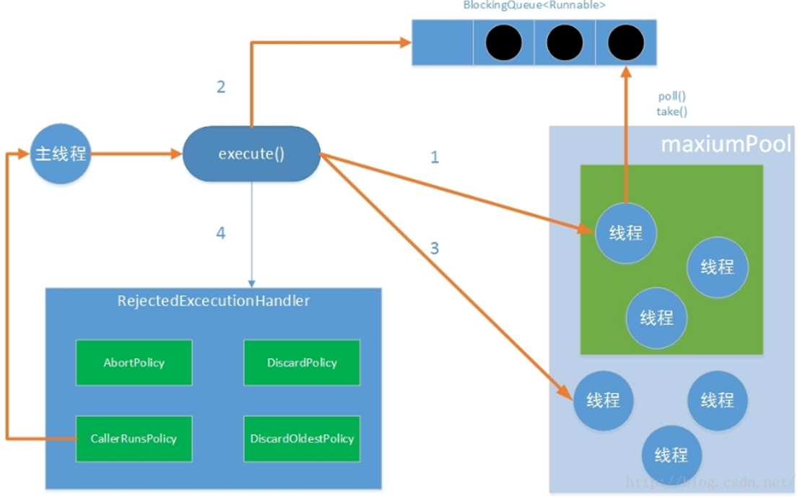
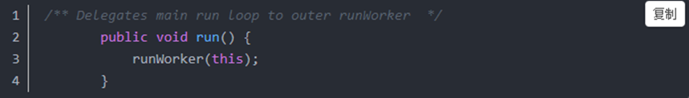

## 说说 CountDownLatch、CyclicBarrier 原理和区别

## 说说 Semaphore 原理

## 说说 Exchanger 原理

## ThreadLocal 原理分析，ThreadLocal为什么会出现OOM，出现的深层次原理

## 讲讲线程池的实现原理

一个线程从被提交（submit）到执行共经历以下流程：

 

线程池判断核心线程池里是的线程是否都在执行任务，如果不是，则创建一个新的工作线程来执行任务。如果核心线程池里的线程都在执行任务，则进入下一个流程

线程池判断工作队列是否已满。如果工作队列没有满，则将新提交的任务储存在这个工作队列里。如果工作队列满了，则进入下一个流程。

线程池判断其内部线程是否都处于工作状态。如果没有，则创建一个新的工作线程来执行任务。如果已满了，则交给饱和策略来处理这个任务。

线程池在执行excute方法时，主要有以下四种情况

 

1 如果当前运行的线程少于corePoolSize，则创建新线程来执行任务（需要获得全局锁）

2 如果运行的线程等于或多于corePoolSize ,则将任务加入BlockingQueue

3 如果无法将任务加入BlockingQueue(队列已满)，则创建新的线程来处理任务（需要获得全局锁）

4 如果创建新线程将使当前运行的线程超出maxiumPoolSize，任务将被拒绝，并调用RejectedExecutionHandler.rejectedExecution()方法。

 

线程池采取上述的流程进行设计是为了减少获取全局锁的次数。在线程池完成预热（当前运行的线程数大于或等于corePoolSize）之后，几乎所有的excute方法调用都执行步骤2。

 

Execute方法

从源码中可以看到提交任务的这一过程基本与第二个图的四个流程是一致的，需要检查的是当前工作线程的数量与核心线程数量的关系，来决定提交任务的方式或者是拒绝任务提交。而具体任务的提交工作是在addWorker方法中。在这里面看到了recheck这样的变量，这是在执行了一些动作失败后再次检查线程池的状态，因为在这期间可能有线程池关闭获得线程池饱和等状态的改变。

 

**addWorker****方法**

 

这个方法是任务提交的一个核心方法。在里面完成了状态检查、新建任务、执行任务等一系列动作。它有两个参数，第一个参数是提交的任务，第二个参数是一个标识符，标识在检查工作线程数量的时候是应该与corePoolSize对比还是应该maximumPoolSize对比。

这个方法可以分为两个阶段来看，第一个阶段是判断是否有必要新增一个工作线程，如果有则利用CAS更新工作线程的数量；第二部分是将提交的任务封装成一个工作线程Worker然后加入到线程池的容器中，开始执行新提交的任务。这个Worker在执行完任务后，还会循环地获取工作队列里的任务来执行。下面来看一下Worker的构造方法就能更好地理解上面的代码了

 

**runWorker****方法**

在addWorker方法快要结束的地方，调用了t.start()方法，我们知道它实际执行的就是Worker对象的run()方法，而worker的run()方法是这样定义的：

它实际上是将自己委托给线程池的runWorker方法

这个方法呢也比较好理解，它在不断执行我们提交的任务的run方法。而这个任务可能是我们新提交的，也有可能是从等待队列中获取的。这样就实现了线程池的完成逻辑。

### 线程池的几种实现方式

**（**[**https://blog.csdn.net/w2393040183/article/details/52177572**](https://blog.csdn.net/w2393040183/article/details/52177572)**）**

## 线程的生命周期，状态是如何转移的

1、线程的生命周期：新建（New）、就绪（Runnable）、运行（Running）、阻塞（Blocked）和死亡（Dead）5种状态。

2、当线程对象调用了start（）方法之后，该线程处于就绪状态，Java虚拟机会为其创建方法调用栈和程序计数器，处于这个状态中的线程并没有开始运行，只是表示该线程可以运行了。至于该线程何时开始运行，取决于JVM里线程调度器的调度。

3、启动线程使用start（）方法，而不是run（）方法。

4、只能对处于新建状态的线程调用start（），否则将引发IllegalThreadStateException异常。

5、所有现代的桌面和服务器操作系统都采用抢占式调度策略，只有当一个线程调用了它的sleep（）方法或yield（）方法后才会放弃所占用的资源。

6、线程从阻塞状态只能进入就绪状态，无法进入运行状态。

7、程序会以如下三种方式结束，结束后就处于死亡状态。

（1）run（）或call（）方法执行完成，线程正常结束。

（2）线程抛出一个未捕获的Exception或Error。

（3）直接调用该线程的stop（）方法来结束该线程——该方法容易导致死锁，通常不推荐使用。

8、isAlive（）方法测试某个线程是否已经死亡。

 

（1）New：创建线程对象后，该线程处于新建状态，此时它不能运行，和其他Java对象一样，仅仅有Java虚拟机为其分配了内存，没有表现出任何线程的动态特征；

（2）Runnable：线程对象调用了start（）方法后，该线程就进入了就绪状态（也称可运行状态）。处于就绪状态的线程位于可运行池中，此时它只是具备了运行的条件，能否获得CPU的使用权开始运行，还需要等待系统的调度；

（3）Runing：处于就绪状态的线程获得了CPU使用权，开始执行run（）方法中的线程执行体，则线程处于运行状态。当一个线程启动后，它不能一直处于运行状态（除非它的线程执行体足够短，瞬间结束），当使用完系统分配的时间后，系统就会剥脱该线程占用的CPU资源，让其他线程获得执行的机会。只有处于就绪状态的线程才可能转换到运行状态。

（4）Blocked：一个正在执行的线程在某些特殊情况下，如执行耗时的输入/输出操作时，会放弃CPU的使用权，进入阻塞状态。线程进入阻塞状态后，就不能进入排队队列。只有当引用阻塞的原因，被消除后，线程才可以进入就绪状态。

——当线程试图获取某个对象的同步锁时，如果该锁被其他线程所持有，则当前线程进入阻塞状态，如果想从阻塞状态进入就绪状态必须得获取到其他线程所持有的锁。

——当线程调用了一个阻塞式的IO方法时，该线程就会进入阻塞状态，如果想进入就绪状态就必须要等到这个阻塞的IO方法返回。

——当线程调用了某个对象的wait（）方法时，也会使线程进入阻塞状态，notify（）方法唤醒。

——调用了Thread的sleep（long millis）。线程睡眠时间到了会自动进入阻塞状态。

——一个线程调用了另一个线程的join（）方法时，当前线程进入阻塞状态。等新加入的线程运行结束后会结束阻塞状态，进入就绪状态。

线程从阻塞状态只能进入就绪状态，而不能直接进入运行状态，即结束阻塞的线程需要重新进入可运行池中，等待系统的调度。

（5）Terminated：线程的run（）方法正常执行完毕或者线程抛出一个未捕获的异常（Exception）、错误（Error），线程就进入死亡状态。一旦进入死亡状态，线程将不再拥有运行的资格，也不能转换为其他状态。

·    **可参考：《**[**Java****多线程编程核心技术**](http://mp.weixin.qq.com/s?__biz=MzI1NDQ3MjQxNA==&mid=2247484881&idx=2&sn=b0ecf85cd7c9e543c84e7a9859c20a26&chksm=e9c5fc60deb27576a6a9c453dabc585f43d9f29fd8a8f37ed0e7cc2f012c86b23fbd21763a39&scene=21%23wechat_redirect)**》**

## AtomicInteger底层实现原理；

## synchronized与ReentraLock哪个是公平锁；

## CAS机制会出现什么问题；

## 用过并发包下边的哪些类；

## 一个线程连着调用start两次会出现什么情况？

## wait方法能不能被重写，wait能不能被中断；

## 线程池的实现？四种线程池？重要参数及原理？任务拒接策略有哪几种？

## 线程状态以及API怎么操作会发生这种转换；

## 常用的避免死锁方法；

## 灵魂之问

1. Thread join方法的作用？请解释其实现原理？