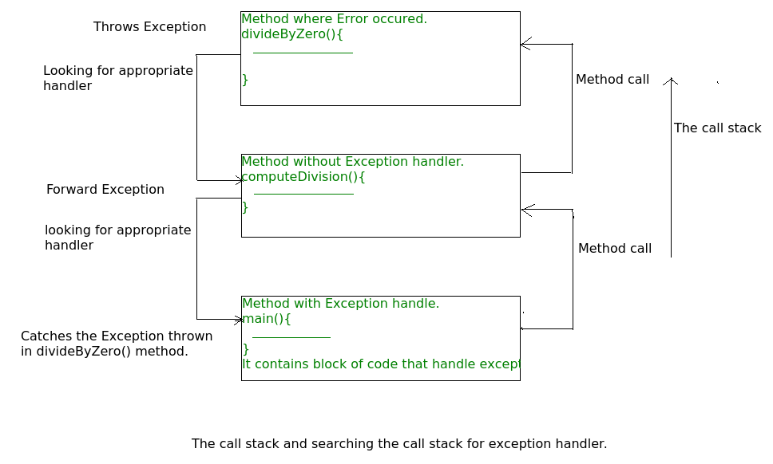
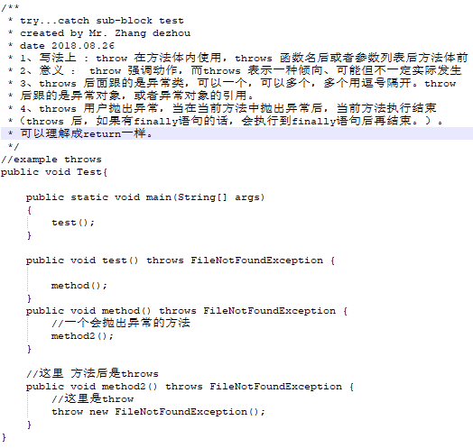

## 异常体系

### 什么是异常？

异常是指在程序的执行期间发生的意外事件，该事件会破坏程序指令的正常流程。

### Error vs Exception

> Error: Error表示严重的问题，即正常应用不应该去捕获
>
> Exception: Exception表示正常的应用可以尝试去捕获。

### Exception 层级

所有Exception和Error类型都是Throwable类的子类，Throwable类是层次结构的基类。其中一个分支以Exception为首。 此类用于用户程序应捕获的异常条件。 NullPointerException是此类异常其中的一个示例。Java运行时系统（JVM）使用另一个分支Error来指示与运行时环境本身（JRE）有关的错误。 StackOverflowError是此类错误的一个示例。


对于checked和unchecked exception的比较，可以看Java基础-常见异常

### JVM怎样处理异常

**默认的异常处理**：无论何时，在一个方法的内部发生了异常，该方法会创建一个称为“异常对象”的对象，并将其交给JVM。异常对象包含异常的名称和描述，UI及发生异常的程序的当前状态。创建异常对象并交由JVM这一过程称为抛出异常。可能存在异常发生那一刻之前的方法调用列表，这一有序的方法列表称为调用栈。现在，异常发生时刻将会经过一下过程：

* JVM搜索调用栈以查找可以处理该异常的代码块的方法。该代码块称为异常处理程序。
* JVM从发生异常的方法开始搜索，然后以与调用顺序相反的顺序遍历调用栈。
* 如果找到合适的处理程序，则将发生的异常传递给它。合适的处理程序意味着抛出的异常对象类型与其可处理的异常对象类型匹配。
* 如果JVM搜索了该调用栈上的所有方法后并没有找到合适的处理异常处理程序，则JVM会将异常对象转交给默认的异常处理程序，该默认的异常处理程序也是JVM的一部分。默认的异常处理程序以以下格式打印异常信息，并终止程序运行。

```
Exception in thread "xxx" Name of Exception : Description
... ...... ..  // Call Stack
```

下面这幅图可以帮助理解这一过程：



示例：

```java
// Java program to demonstrate how exception is thrown. 
class ThrowsExecp{ 
      
    public static void main(String args[]){ 
          
        String str = null; 
        System.out.println(str.length()); 
          
    } 
} 
```

输出：

```
Exception in thread "main" java.lang.NullPointerException
    at ThrowsExecp.main(File.java:8)
```

让我们来看一个示例展示JVM是如何在调用栈上查找合适的异常处理程序的。

```java
// Java program to demonstrate exception is thrown 
// how the runTime system searches th call stack 
// to find appropriate exception handler. 
class ExceptionThrown 
{ 
    // It throws the Exception(ArithmeticException). 
    // Appropriate Exception handler is not found within this method. 
    static int divideByZero(int a, int b){ 
          
        // this statement will cause ArithmeticException(/ by zero) 
        int i = a/b;  
          
        return i; 
    } 
      
    // The runTime System searches the appropriate Exception handler 
    // in this method also but couldn't have found. So looking forward 
    // on the call stack. 
    static int computeDivision(int a, int b) { 
          
        int res =0; 
          
        try
        { 
          res = divideByZero(a,b); 
        } 
        // doesn't matches with ArithmeticException 
        catch(NumberFormatException ex) 
        { 
           System.out.println("NumberFormatException is occured");  
        } 
        return res; 
    } 
      
    // In this method found appropriate Exception handler. 
    // i.e. matching catch block. 
    public static void main(String args[]){ 
          
        int a = 1; 
        int b = 0; 
          
        try
        { 
            int i = computeDivision(a,b); 
          
        } 
          
        // matching ArithmeticException 
        catch(ArithmeticException ex) 
        { 
            // getMessage will print description of exception(here / by zero) 
            System.out.println(ex.getMessage()); 
        } 
    } 
} 
```

输出：

```
/ by zero.
```

### 编程人员怎样处理异常

**自定义异常处理**：java的异常处理通过5个关键词进行管理：try,catch,throw,throws以及finally。简单来讲，下面是它们的工作方式：

* 您认为可能会发生异常的程序语句包含在try块中，如果try块发生异常，则将引发该异常；

* 您的代码可以捕获该异常（使用catch块）并处理以某种合适的方法处理它。

* 系统产生的异常由JVM自动抛出。想要手动抛出一个异常，使用关键字throw。一个方法中抛出的任何异常都必须由throws语句发起。

* 在try语句之后必须要执行的任何代码都放在finally块中。

详细的分析请看：Java基础-常见异常-try,catch,finally控制流

### 需要try-catch语句（自定义异常处理）

看下面这段代码：

```java
// java program to demonstrate  
// need of try-catch clause 
  
class GFG { 
    public static void main (String[] args) { 
          
        // array of size 4. 
        int[] arr = new int[4]; 
       
        // this statement causes an exception 
        int i = arr[4]; 
          
        // the following statement will never execute 
        System.out.println("Hi, I want to execute"); 
    } 
} 
```

输出：

```
Exception in thread "main" java.lang.ArrayIndexOutOfBoundsException: 4
    at GFG.main(GFG.java:9)
```

**解释：**上面的示例中，数组的大小正如实例中所给的那样。你可访问的元素下标只能是0-3.但是你试图去访问下标为4的元素，这就是引发异常的原因。在这种情况下，JVM会终止程序的运行。System.out.println("Hi, I want to execute")将永远不会执行。如果想要执行它，我们必须使用try-catch处理异常。因此，为了继续让程序正常进行，我们需要try-catch语句。

### 怎样使用try-catch语句

```java
try {
// block of code to monitor for errors
// the code you think can raise an exception
}
catch (ExceptionType1 exOb) {
// exception handler for ExceptionType1
}
catch (ExceptionType2 exOb) {
// exception handler for ExceptionType2
}
// optional
finally {
// block of code to be executed after try block ends
}
```

**需要记住的点**

* 一个方法中，可能存在多个可能引发异常的语句因此将所有这些可能发生异常的语句放到自己的try块中，并未每个语句自己的catch块中提供单独的异常处理程序。
* 如果try块中发生异常，则该异常由与该异常关联的异常处理程序处理。要关联异常处理程序，我们需要在其后放置catch块。可以有多个异常处理程序。每一个catch块都是一个异常处理程序，用于处理与其参数对应类型的异常。参数中指定的异常类型声明其可以处理的异常类型，并且其必须是Throwable的派生类。
* 对于每个try块，可以有0个或多个catch块，但只能有一个finally块。
* finally块是可选的。无论try块中是否发生异常，其总是会被执行。如果发生异常，它将在try和catch块之后执行。Java中的finally块通常用于放置重要的代码，例如清理工作：关闭文件或者关闭连接

**总结**


引用：

https://www.geeksforgeeks.org/exceptions-in-java/

https://docs.oracle.com/javase/tutorial/essential/exceptions/definition.html

## OOM (OutOfMemoryError Exception)

Java中，所有的对象都存储在堆内存中（特殊情况除外，这种特殊情况将在这一章节的结束时介绍）。它们使用new操作符进行分配。OOM异常如下：

```
Exception in thread "main" java.lang.OutOfMemoryError: Java heap space
```

通常，当Java虚拟机由于内存不足而无法分配对象，并且垃圾回收器无法再提供更多内存时，将引发此错误。这段话又引出了两个问题：

> Java虚拟机的默认内存是多大？由什么参数控制？
>
> 垃圾回收器的默认内存？其无法提供更多的内存是指什么区的内存，年轻代，老年代？

**OutOfMemoryError** 通常意味着你做错了什么，要么将长时间持有一个对象，要么试图以此处理太多的数据。有时，它也会是一些你无法控制的问题，例如缓存字符串的三方库，亦或者应用服务器在部署后没有及时清理。有时，它压根就和堆上的对象无关。

当本地方法库中的代码分配的内存无法得到满足（如交换空间不足），此时也会抛出**java.lang.OutOfMemoryError** 。让我们了解会引发OOM的不同情况。

### 症状或根本原因？

为了找出原因，异常信息的末尾会包含详细的信息。让我们来检查所有错误。

#### 1、Error1-Java heap space

由于过度使用finalizers的程序而导致此错误。如果一个类具有finalize方法，则此类型的对象在垃圾回收时不会被立即回收。而是，在垃圾回收之后，这类对象会排队进入队列等待finalization，这个时间是由系统决定的。

原因分析：

> 1、finalizers是由一个服务于finalization队列的守护线程执行的; 如果finallizer线程的速度跟不上finalization queue，这样java heap迟早会被填满，因而OOM异常便会发生。
>
> 2、配置参数导致，即指定的heap大小（或默认的大小）不能满足应用的开销
>
> 3、请求创建一个超大对象，通常是一个大数组。
>
> 4、超出预期的访问量/数据量，通常是上游系统请求流量飙升，常见于各类促销/秒杀活动，可以结合业务流量指标排查是否有尖状峰值。
>
> 5、内存泄漏（Memory Leak），大量对象引用没有释放，JVM 无法对其自动回收，常见于使用了 File 等资源没有回收。

```java
// Java program to illustrate 
// Heap error 
import java.util.*; 
  
public class Heap { 
    static List<String> list = new ArrayList<String>(); 
  
public static void main(String args[]) throws Exception 
    { 
        Integer[] array = new Integer[10000 * 10000]; 
    } 
} 
```

当你执行上面的代码时，你可能想着应该不会有什么问题。结果是，随着执行时间的推移，在不断使用泄漏代码的情况下，“缓存”结果最终会占用大量Java堆空间，并当泄漏的内存填满堆区域中的所有可用内存且GC无法将其清理时，将会抛出OOM异常。

**Prevention**：检查如何监视尚未完成的finalize对象（Monitor the Objects pending finalization）

解决方案：

> 针对大部分情况，通常只需要通过 `-Xmx` 参数调高 JVM 堆内存空间即可。如果仍然没有解决，可以参考以下情况做进一步处理：
>
> 1、如果是超大对象，可以检查其合理性，比如是否一次性查询了数据库全部结果，而没有做结果数限制。
>
> 2、如果是业务峰值压力，可以考虑添加机器资源，或者做限流降级。
>
> 3、如果是内存泄漏，需要找到持有的对象，修改代码设计，比如关闭没有释放的连接。

#### 2、Error 2-  GC Overhead limit exceeded

此错误表示GC一直在运行，并且Java程序的执行进度非常缓慢。进行GC之后，如果Java进程花费了98%的时间用于GC，并且回复的可用内存不到2%，且连续执行了5（编译期确定的常量）次GC，则会抛出OOM。

通常抛出此异常因为Java堆中可分配的可用空间很少无法容纳新来的数据量。

```java
// Java program to illustrate 
// GC Overhead limit exceeded 
import java.util.*; 
  
public class Wrapper { 
public static void main(String args[]) throws Exception 
    { 
        Map m = new HashMap(); 
        m = System.getProperties(); 
        Random r = new Random(); 
        while (true) { 
            m.put(r.nextInt(), "randomValue"); 
        } 
    } 
} 
```

用**java -Xmx100m -XX:+UseParallelGC Wrapper**命令运行上面这段程序，会得到下面的输出：

```
Exception in thread "main" java.lang.OutOfMemoryError: GC overhead limit exceeded
    at java.lang.Integer.valueOf(Integer.java:832)
    at Wrapper.main(error.java:9)
```

**Prevention :** 增加堆空间的大小，并用下面的命令参数将其关闭 **-XX:-UseGCOverheadLimit.**

#### 3、Error3- Permgen space

Java内存被分为了不同的区域。所有区域的大小，包括permgen区域，在JVM启动时会被设置。如果你自己不对其进行修改，JVM启动时会加载默认的大小。

OOM：PermGen space 错误表明Permanent Generation's 区域的内存空间被耗尽。

```java
// Java program to illustrate 
// Permgen Space error 
import javassist.ClassPool; 
  
public class Permgen { 
    static ClassPool classPool = ClassPool.getDefault(); 
  
public static void main(String args[]) throws Exception 
    { 
        for (int i = 0; i < 1000000000; i++) { 
            Class c = classPool.makeClass(com.saket.demo.Permgen" + i).toClass(); 
            System.out.println(c.getName()); 
        } 
    } 
} 
```

上面的代码中，在运行时迭代产生一系列class。产生Class的复杂性右Javassist库关心。

运行上面的代码会不断地创建新的类并将其加载进Permgen空间直到Permgen的空间耗尽，此时便会抛出OOM：Permgen space is thrown.

> 永久代存储对象主要包括以下几类：
>
> 1、加载/缓存到内存中的 class 定义，包括类的名称，字段，方法和字节码；
>
> 2、常量池；
>
> 3、对象数组/类型数组所关联的 class；
>
> 4、JIT 编译器优化后的 class 信息。
>
> PermGen 的使用量与加载到内存的 class 的数量/大小正相关。

解决方案：

> 根据 Permgen space 报错的时机，可以采用不同的解决方案，如下所示：
>
> 1)、程序启动报错，修改 `-XX:MaxPermSize` 启动参数，调大永久代空间。
>
> ```
> java -XX:MaxPermSize=512m com.saket.demo.Permgen
> ```
>
> 2)、应用重新部署时报错，很可能是没有应用没有重启，导致加载了多份 class 信息，只需重启 JVM 即可解决。
>
> 3)、运行时报错，应用程序可能会动态创建大量 class，而这些 class 的生命周期很短暂，但是 JVM 默认不会卸载 class，可以设置 `-XX:+CMSClassUnloadingEnabled` 和 `-XX:+UseConcMarkSweepGC`这两个参数允许 JVM 卸载 class。
>
> 如果上述方法无法解决，可以通过 jmap 命令 dump 内存对象 `jmap-dump:format=b,file=dump.hprof` ，然后利用 Eclipse MAT https://www.eclipse.org/mat 功能逐一分析开销最大的 classloader 和重复 class。

#### 4、Error4-Metaspace

metaspace的大小由MaxMetaSpaceSize控制。当加载类需要的metadata超过MaxMetaSpaceSize就会抛出此异常。

```java
// Java program to illustrate 
// Metaspace error 
import java.util.*; 
  
public class Metaspace { 
    static javassist.ClassPool cp = javassist.ClassPool.getDefault(); 
  
public static void main(String args[]) throws Exception 
    { 
        for (int i = 0; i < 100000; i++) { 
            Class c = cp.makeClass("com.saket.demo.Metaspace" + i).toClass(); 
        } 
    } 
} 
```

这段代码和上面Error3非常像，是因为在Java8中用Metaspace取代了PermGen，至于取代的原因，会在这节末尾总结。

上面这段代码持续生成新的类，并将其定义加载到Metaspace中，直到该空间被完全利用后，抛出java.lang.OutOfMemoryError：Metaspace为止。

解决方案：

> 此问题类似于上面的Error3，可参考其解决方案

#### 5、Error 5 - **Requested array size exceeds VM limit **

 这个错误表明应用试图去分配一个超过heap大小的数组。例如，应用尝试去分配1024MB的数组，但是heap的最大空间为512MB，此时便会抛出此类型的OOM

```JAVA
// Java program to illustrate 
// Requested array size 
// exceeds VM limit error 
import java.util.*; 
  
public class GFG { 
    static List<String> list = new ArrayList<String>(); 
  
public static void main(String args[]) throws Exception 
    { 
        Integer[] array = new Integer[10000 * 10000]; 
    } 
} 
```

OOM:Requested array size exceeds VM limit可能会在下面的情况下出现：

* 你创建的数组很大，介于平台之间和Integer.MAX_INT之间
* 您故意尝试分配大于2 ^ 31-1元素的数组以试验极限。

此问题比较罕见，通常需要检查业务是否确实需要创建这么大的数组。

#### 6、**Error 6 – Request size bytes for reason. Out of swap space?** 

当从native heap中分配内存失败或者native heap资源接近枯竭会触发该异常。该错误指示失败的请求的大小（以字节为单位）以及请求内存的原因。

原因分析：

> OOM：Out of swape space error通常有操作系统层面引起，例如：
>
> 1、操作系统配置的交换空间不足
>
> 2、系统上的另一个进程正在消耗所有的内存资源。
>
> 3、地址空间不足；
>
> 4、物理内存已耗光；
>
> 5、应用程序的本地内存泄漏（native leak），例如不断申请本地内存，却不释放。
>
> 6、执行 `jmap-histo:live` 命令，强制执行 Full GC；如果几次执行后内存明显下降，则基本确认为 Direct ByteBuffer 问题。

解决方案：

> 预防措施：发生此异常时，虚拟机会调用fatal级别的错误处理机制（会产生fatal错误日志文件，其中包含消息崩溃时的线程，进程和系统的有用信息）。在native heap资源耗尽的情况下，日志中的堆内存和内存映射信息可能会有用。
>
> 1、升级地址空间为 64 bit；
>
> 2、使用 Arthas 检查是否为 Inflater/Deflater 解压缩问题，如果是，则显式调用 end 方法。
>
> 3、Direct ByteBuffer 问题可以通过启动参数 `-XX:MaxDirectMemorySize` 调低阈值。
>
> 4、升级服务器配置/隔离部署，避免争用。

#### 7、**Error 7 : reason stack_trace_with_native_method** 

每当抛出此错误消息（原因为stack_trace_with_native_method）时，就会打印堆栈跟踪信息，其中最上面的帧是native方法，那么这表明native方法分配失败。 该消息与上一条消息之间的区别在于，该条错误消息是在Java native interface（JNI）或native方法中检测到的而不是在JVM代码中。

```java
// Java program to illustrate 
// new native thread error 
import java.util.*; 
  
public class GFG { 
public static void main(String args[]) throws Exception 
    { 
        while (true) { 
            new Thread(new Runnable() 
            { 
                public void run() 
                { 
                    try
                    { 
                        Thread.sleep(1000000000); 
        } 
        catch (InterruptedException e) 
        { 
        } 
    } 
            }).start(); 
   } 
  } 
} 
```

#### 8、Unable to create new native thread

此错误和错误7有些类似。每个 Java 线程都需要占用一定的内存空间，当 JVM 向底层操作系统请求创建一个新的 native 线程时，如果没有足够的资源分配就会报此类错误。

原因分析

> JVM 向 OS 请求创建 native 线程失败，就会抛出 `Unableto createnewnativethread`，常见的原因包括以下几类：
>
> 1、线程数超过操作系统最大线程数 ulimit 限制；
>
> 2、线程数超过 kernel.pid_max（只能重启）；
>
> 3、native 内存不足；
>
> 该问题发生的常见过程主要包括以下几步：
>
> 1、JVM 内部的应用程序请求创建一个新的 Java 线程；
>
> 2、JVM native 方法代理了该次请求，并向操作系统请求创建一个 native 线程；
>
> 3、操作系统尝试创建一个新的 native 线程，并为其分配内存；
>
> 4、如果操作系统的虚拟内存已耗尽，或是受到 32 位进程的地址空间限制，操作系统就会拒绝本次 native 内存分配；
>
> 5、JVM 将抛出 `java.lang.OutOfMemoryError:Unableto createnewnativethread` 错误。

解决方案

> 1、升级配置，为机器提供更多的内存；
>
> 2、降低 Java Heap Space 大小；
>
> 3、修复应用程序的线程泄漏问题；
>
> 4、限制线程池大小；
>
> 5、使用 -Xss 参数减少线程栈的大小；
>
> 6、调高 OS 层面的线程最大数：执行 `ulimia-a` 查看最大线程数限制，使用 `ulimit-u xxx` 调整最大线程数限制。
>
> ulimit -a .... 省略部分内容 ..... max user processes (-u) 16384

#### 9、Kill process or sacrifice child

有一种内核作业（Kernel Job）名为 Out of Memory Killer，它会在可用内存极低的情况下“杀死”（kill）某些进程。OOM Killer 会对所有进程进行打分，然后将评分较低的进程“杀死”，具体的评分规则可以参考 Surviving the Linux OOM Killer。

不同于其他的 OOM 错误， `Killprocessorsacrifice child` 错误不是由 JVM 层面触发的，而是由操作系统层面触发的。

原因分析

> 默认情况下，Linux 内核允许进程申请的内存总量大于系统可用内存，通过这种“错峰复用”的方式可以更有效的利用系统资源。
>
> 然而，这种方式也会无可避免地带来一定的“超卖”风险。例如某些进程持续占用系统内存，然后导致其他进程没有可用内存。此时，系统将自动激活 OOM Killer，寻找评分低的进程，并将其“杀死”，释放内存资源。

解决方案

> 1、升级服务器配置/隔离部署，避免争用。
>
> 2、OOM Killer 调优。

#### 10、Direct buffer memory

Java 允许应用程序通过 Direct ByteBuffer 直接访问堆外内存，许多高性能程序通过 Direct ByteBuffer 结合内存映射文件（Memory Mapped File）实现高速 IO。

原因分析

> Direct ByteBuffer 的默认大小为 64 MB，一旦使用超出限制，就会抛出 `Directbuffer memory` 错误。

解决方案

> 1、Java 只能通过 ByteBuffer.allocateDirect 方法使用 Direct ByteBuffer，因此，可以通过 Arthas 等在线诊断工具拦截该方法进行排查。
>
> 2、检查是否直接或间接使用了 NIO，如 netty，jetty 等。
>
> 3、通过启动参数 `-XX:MaxDirectMemorySize` 调整 Direct ByteBuffer 的上限值。
>
> 4、检查 JVM 参数是否有 `-XX:+DisableExplicitGC` 选项，如果有就去掉，因为该参数会使 `System.gc()` 失效。
>
> 5、检查堆外内存使用代码，确认是否存在内存泄漏；或者通过反射调用 `sun.misc.Cleaner` 的 `clean()`方法来主动释放被 Direct ByteBuffer 持有的内存空间。
>
> 6、内存容量确实不足，升级配置。

## Exception、Error、运行时异常与一般异常有何异同

从上面的分析可以知道所有的异常都是由Throwable类，下一层分解为两个分支：Error和Exceprion。

**Error**层次结构描述了java运行时系统的内部错误和资源耗尽错误。大多数错误与代码编写者执行的操作无关，而表示代码运行时 JVM（Java 虚拟机）出现的问题。应用程序不应该抛出这种类型的对象。

**Exceprion**这个层次结构又分解为连个分支：一个分支派生于RuntimeException；另一个分支包含其他异常。划分两个分支的规则是：由程序错误导致的异常属于RuntimeException；而程序本身没有没有问题，但由于像I/O错误这类异常导致的异常属于其他异常。

**RuntimeException（运行时异常）：**

IndexOutOfBoundsException(下标越界异常)

NullPointerException(空指针异常)

NumberFormatException （String转换为指定的数字类型异常）

ArithmeticException -（算术运算异常 如除数为0）

ArrayStoreException - （向数组中存放与声明类型不兼容对象异常）

SecurityException -（安全异常）

**IOException**（其他异常）:

FileNotFoundException（文件未找到异常。）

IOException（操作输入流和输出流时可能出现的异常。）

EOFException （文件已结束异常）

**unchecked exception**（非检查异常）

包括运行时异常（RuntimeException）和派生于Error类的异常。对于运行时异常，java编译器不要求必须进行异常捕获处理或者抛出声明，由程序员自行决定。

**checked exception**（检查异常，编译异常，必须要处理的异常）

也称非运行时异常（运行时异常以外的异常就是非运行时异常），java编译器强制程序员必须进行捕获处理（try...catch/throws），比如常见的IOExeption和SQLException。对于非运行时异常如果不进行捕获或者抛出声明处理，编译都不会通过。

异常的处理：

1.抛出异常：

```java
import java.io.FileNotFoundException;

/*
* @date 2018.08.26
* @author Mr. Zhang Dezhou
*/
public class ExceptionHandle {
    public static void main(String[] args) {
        ExceptionHandle eh = new ExceptionHandle();
        try {
            eh.test();
        } catch (FileNotFoundException e){
            e.printStackTrace(); // 此处打印堆栈信息，工程项目中不建议打印堆栈
        }
    }

    private void test() throws FileNotFoundException {
        method1();
    }

    private void method1() throws FileNotFoundException {
        method2();
    }

    private void method2() throws FileNotFoundException {
        throw new FileNotFoundException();
    }
}
```




2.捕获异常：try...catch...finally，finally块的语句在try或catch中的return语句执行之后返回之前执行且finally里的修改语句可能影响也可能不影响try或catch中return已经确定的返回值，若finally里也有return语句则覆盖try或catch中的return语句直接返回。


 


## 常见的敏感异常

| 异常名称                                    | 存在的风险                                         |
| ------------------------------------------- | -------------------------------------------------- |
| java.io.FileNotFoundException               | 泄露文件系统结构和文件名列举                       |
| java.util.jar.JarException                  | 泄露文件系统结构                                   |
| java.util.MissingResourceException          | 资源列举                                           |
| java.security.acl.NotOwnerException         | 所有人列举                                         |
| java.util.ConcurrentModificationException   | 可能提供线程不安全的代码信息                       |
| javax.naming.InsufficientResourcesException | 服务器资源不足***（可能有利于DoS攻击）***          |
| java.net.BindException                      | 当不信任客户端能够选择服务器端口时造成开放端口列举 |
| java.lang.OutOfMemoryError                  | ***DoS***                                          |
| java.lang.StackOverflowError                | ***DoS***                                          |
| java.sql.SQLException                       | 数据库结构，用户名列举                             |

 