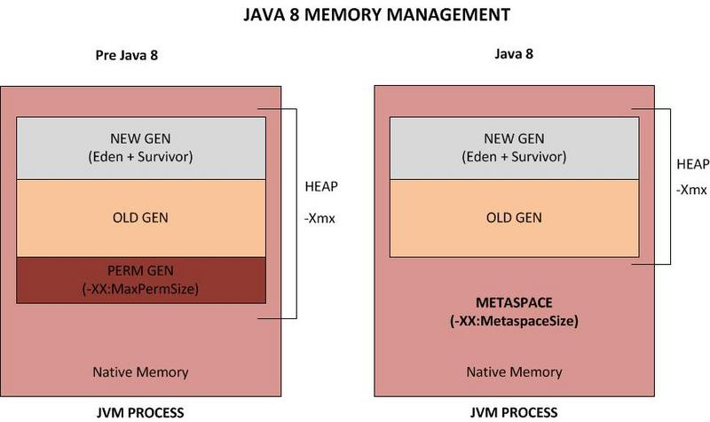

## Java对象存储空间的特殊情况？

这也引出了一个经典的面试题：Java中对象实例和数组元素是否都在堆上分配空间？

## Java 8 中使用metaspace代替PermGen的原因？

## Jvm中的几个概念：native heap，metaspace，newgen,oldgen...

## JVM运行时内存区域划分

https://blog.csdn.net/Zz110753/article/details/70170339

## 内存溢出OOM和堆栈溢出SOE的示例及原因、如何排查与解决

https://blog.csdn.net/BabyNiu411/article/details/44195465

https://blog.csdn.net/pbuzhidaol/article/details/72871898

## 如何判断对象是否可以回收或存活

## 常见的GC回收算法及其含义

## 常见的JVM性能监控和故障处理工具类：jps、jstat、jmap、jinfo、jconsole等

## JVM如何设置参数

## JVM性能调优

## 类加载器、双亲委派模型、一个类的生命周期、类是如何加载到JVM中的

## java的初始化块、静态初始化块、构造函数的执行顺序

https://www.cnblogs.com/BlackStorm/p/5699965.html

​     所有的静态初始化块都优先执行，其次才是非静态的初始化块和构造函数，它们的执行顺序是：

​     1.父类的静态初始化块

​     2.子类的静态初始化块

​     3.父类的初始化块

​     4.父类的构造函数

​     5.子类的初始化块

​     6.子类的构造函数

​     静态初始化块的优先级最高，也就是最先执行，并且仅在类第一次被加载时执行；

​     非静态初始化块和构造函数后执行，并且在每次生成对象时执行一次；

​     非静态初始化块的代码会在类构造函数之前执行。因此若要使用，应当养成把初始化块写在构造函数之前的习惯，便于调试；

​     静态初始化块既可以用于初始化静态成员变量，也可以执行初始化代码；

​     非静态初始化块可以针对多个重载构造函数进行代码复用。

## java类的加载过程

## 类加载的过程：加载、验证、准备、解析、初始化

## 强引用、软引用、弱引用、虚引用

·    Java内存模型JMM

- Minor GC与Full     GC分别在什么时候发生？什么时候触发Full GC;

- GC收集器有哪些？CMS收集器与G1收集器的特点。

- Java在什么时候会出现内存泄漏；

- Java中的大对象如何进行存储；

- rt.jar被什么类加载器加载，什么时间加载；

## 自己写的类被什么加载，什么时间加载；

## 自己写的两个不同的类是被同一个类加载器加载的吗？为什么？

## 为什么新生代内存需要有两个Survivor区？

## 几种常用的内存调试工具：jmap、jstack、jconsole；

## 类加载的五个过程：加载、验证、准备、解析、初始化；

## G1停顿吗，CMS回收步骤，CMS为什么会停顿，停顿时间；

- 栈主要存的数据是什么，堆呢？

- 堆分为哪几块，比如说新生代老生代，那么新生代又分为什么？

- 软引用和弱引用的使用场景（软引用可以实现缓存，弱引用可以用来在回调函数中防止内存泄露）；

## Java字节码

### 字节码的查看工具

### 常用的字节码指令的含义

### 字节码怎么看

#### 一段简单的打印代码

#### 一段四则运算代码

#### 一段包含List操作的代码

#### 一段包含泛型的代码

## 灵魂之问

* 简要讲一下GC的原理？

  Java是在c++的基础之上发展而来的，其显著的特点之一就是垃圾回收器，使得编程人员能够五香像c++中那样每次new完对象后都要手动释放内存。既然Java是在c++的基础上发展而来，那么Java中的内存管理在某些方面势必和c++有些相似之处，讲讲两者在内存管理方面的相似之处，且Java在内存管理方面做了哪些优化 ？

* **High-performance garbage-collected implementations can have bounded pauses to support systems programming and real-time applications.**怎么理解这句话？