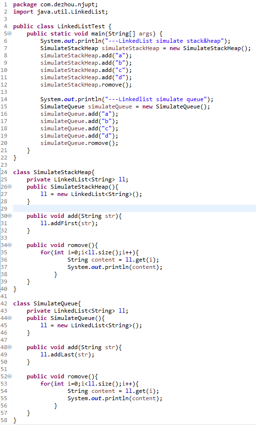
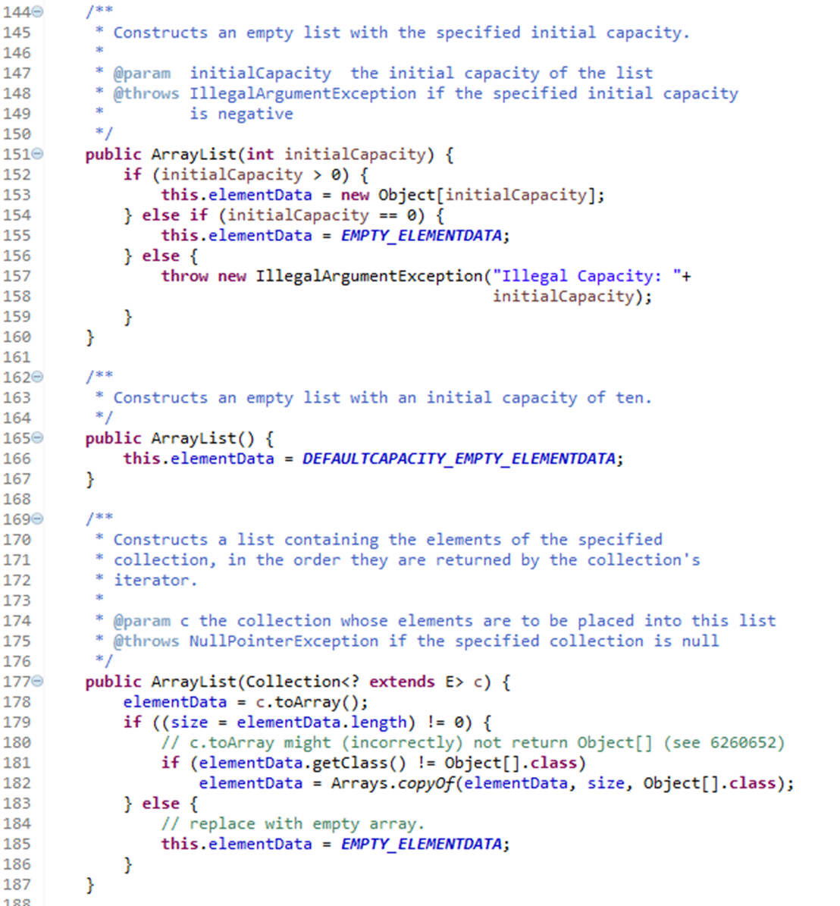
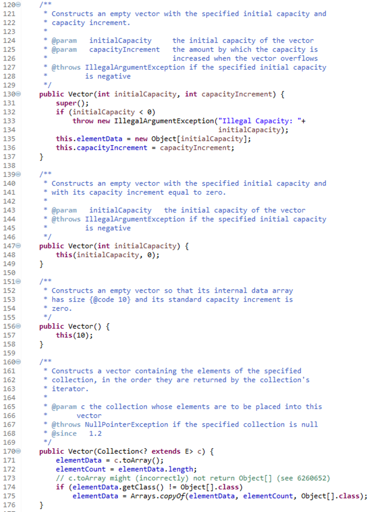
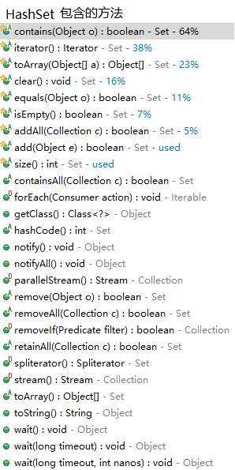

# List 和 Set 区别

相同点：都用于存储对象，并提供方便的Api来插入，删除和检索元素，以及支持迭代

List代表的是有序的，可重复的集合，之前插入的任何元素都会比之后插入的任何元素小；而Set代表的是无序的，不可重复的集合，如果在Set中插入重复项，则会替换旧值

Set使用equals方法来检查存储在Set中的元素的唯一性，而SortedSet使用campareTo来实现自然排序

java中List接口的实现包括ArrayList，Vector，LinkedList；Set接口的实现包括HashSet（快速查询的Set），TreeSet（保存次序的Set，底层为树结构，可以从Set中提取有序的序列）和LinkedHashSet（具有HashSet的查询速度，且内部使用链表维护元素的顺序（插入的次序））

# Set和hashCode以及equals方法的联系

  往Set中add对象时，会调用Hashset中的add方法，然后会调用map的put方法，再调用putVal方法，具体干了什么，我们可以通过阅读源码，一目了然（位于java.util包中的HashMap.class中的第625行开始）：


# List 和 Map 区别

这个问题可以衍生为Collection和Map的区别：

1.Collection类型者，每个位置只有一个元素

2.Map类型者，持有key-value pair

Map代表有映射关系的集合，每个元素都包含一对键对象和值对象，查看源码，可以看到Map没有继承任何接口

 

执行效率是Map的一个大问题。看看get()要做哪些事，就会明白为什么在ArrayList中搜索“键”是相当慢的。而这正是HashMap提高速 度的地方。HashMap使用了特殊的值，称为“散列码”(hash code)，来取代对键的缓慢搜索。“散列码”是“相对唯一”用以代表对象的int值，它是通过将该对象的某些信息进行转换而生成的。所有Java对象都 能产生散列码，因为hashCode()是定义在基类Object中的方法。

 

HashMap就是使用对象的hashCode()进行快速查询的。此方法能够显着提高性能。

 

Map : 维护“键值对”的关联性，使你可以通过“键”查找“值”

 

HashMap：Map基于散列表的实现。插入和查询“键值对”的开销是固定的。可以通过构造器设置容量capacity和负载因子load factor，以调整容器的性能。

 

LinkedHashMap： 类似于HashMap，但是迭代遍历它时，取得“键值对”的顺序是其插入次序，或者是最近最少使用(LRU)的次序。只比HashMap慢一点。而在迭代访问时发而更快，因为它使用链表维护内部次序。

 

TreeMap ： 基于红黑树数据结构的实现。查看“键”或“键值对”时，它们会被排序(次序由Comparabel或Comparator决定)。TreeMap的特点在 于，你得到的结果是经过排序的。TreeMap是唯一的带有subMap()方法的Map，它可以返回一个子树。

 

WeakHashMao ：弱键(weak key)Map，Map中使用的对象也被允许释放: 这是为解决特殊问题设计的。如果没有map之外的引用指向某个“键”，则此“键”可以被垃圾收集器回收。

 

IdentifyHashMap： : 使用==代替equals()对“键”作比较的hash map。专为解决特殊问题而设计。


 

**各自旗下的子类关系**

​    **Collection**

   --List：将以特定次序存储元素。所以取出来的顺序可能和放入顺序不同。

​      --ArrayList / LinkedList / Vector

   --Set ： 不能含有重复的元素

​      --HashSet / TreeSet

   **Map**

   --HashMap

   --HashTable

   --TreeMap


 


 


**其他特征**

List，Set，Map将持有对象一律视为Object型别。

 

Collection、List、Set、Map都是接口，不能实例化。

继承自它们的 ArrayList, Vector, HashTable, HashMap是具象class，这些才可被实例化。

vector容器确切知道它所持有的对象隶属什么型别。vector不进行边界检查。

 

**List****、Set、Map总结**

\1. 如果涉及到堆栈，队列等操作，应该考虑用List，对于需要快速插入，删除元素，应该使用LinkedList，如果需要快速随机访问元素，应该使用ArrayList。

\2. 如果程序在单线程环境中，或者访问仅仅在一个线程中进行，考虑非同步的类，其效率较高，如果多个线程可能同时操作一个类，应该使用同步的类。

\3. 在除需要排序时使用TreeSet,TreeMap外,都应使用HashSet,HashMap,因为他们 的效率更高。

\4. 要特别注意对哈希表的操作，作为key的对象要正确复写equals和hashCode方法。

\5. 容器类仅能持有对象引用（指向对象的指针），而不是将对象信息copy一份至数列某位置。一旦将对象置入容器内，便损失了该对象的型别信息。

\6. 尽量返回接口而非实际的类型，如返回List而非ArrayList，这样如果以后需要将ArrayList换成LinkedList时，客户端代码不用改变。这就是针对抽象编程。

**注意：**

1、Collection没有get()方法来取得某个元素。只能通过iterator()遍历元素。

2、Set和Collection拥有一模一样的接口。

3、List，可以通过get()方法来一次取出一个元素。使用数字来选择一堆对象中的一个，get(0)...。(add/get)

4、一般使用ArrayList。用LinkedList构造堆栈stack、队列queue。

5、Map用 put(k,v) / get(k)，还可以使用containsKey()/containsValue()来检查其中是否含有某个key/value。

   HashMap会利用对象的hashCode来快速找到key。

6、Map中元素，可以将key序列、value序列单独抽取出来。

使用keySet()抽取key序列，将map中的所有keys生成一个Set。

使用values()抽取value序列，将map中的所有values生成一个Collection。

为什么一个生成Set，一个生成Collection？那是因为，key总是独一无二的，value允许重复。

# Arraylist 与 LinkedList 区别

  ArrayList：代表长度可改变的数组，可以对元素进行随机访问，但是想向其中插入和删除的速度慢

  LinkedList：实现中采用链表数据结构，插入和删除速度快，访问速度慢

   

*使用LinkedList实现堆栈、队列和双向队列？

堆栈：先进后出

队列：先进先出

只需重新封装一下LinkedList中的addFirst和addLast方法即可




# ArrayList 与 Vector 区别

1.ArrayList不是线程安全的，而vector是线程安全的，这一点可以阅读Vector的源码可以看到大部分的方法都加了synchronized关键字修饰（位于java.util包中的Vector.class）：

 

\2. ArrayList和Vector都采用线性连续存储空间，当存储空间不足的时候，ArrayList默认增加原来的50%(2*0.75?)，Vector默认增加为原来的一倍；

 

3.Vector可以设置capacityIncrement，而ArrayList不可以，从字面理解就是capacity容量，Increment增加，容量增长的参数。

 

阅读源码比较：

ArrayList：



Vector：



 

**从构造函数上看不出太大的差别，可以对比他们的add方法就可以看出明显的差别了。**

# HashMap 和 Hashtable 的区别

虽然HashMap和HashTable都是基于散列表的数据结构，并且都实现了Map接口，但是它们的主要区别是HashMap不是线程安全的，而HashTable是线程安全的。这意味着你不能在没有同步的情况下在多线程Java应用程序中使用HashMap。另一个区别是HashMap允许一个空键和空值，但是Hashtable不允许空键或值。而且，HashTable的线程安全性是使用内部同步实现的，这使得它比HashMap慢。

 

HashMap和Hashtable都实现了Map接口，但它们之间有一些重要的区别，在决定是使用Java的HashMap还是Hashtable之前，需要记住一些重要的区别。其中一些是线程安全，同步和高速的。以下是这些差异：

1.HashMap类大致等同于Hashtable，不同之处在于它是非同步的并且允许空值。 （HashMap允许空值作为键和值，而Hashtable不允许空值）。

\2. HashMap和Hashtable的主要区别之一是HashMap是非同步的，而Hashtable是同步的，这意味着Hashtable是线程安全的，可以在多个线程之间共享，但HashMap不能在没有正确同步的情况下在多个线程之间共享。 Java 5引入了ConcurrentHashMap，它是Hashtable的一个替代方案，并提供比Java中的Hashtable更好的可伸缩性。


\3. HashMap和Hashtable的另一个显着区别是，HashMap中的迭代器是一个快速迭代器，而Hashtable的枚举器不是，并且如果任何其他线程通过添加或删除元素，而非通过Iterator自身的remove()修改映射，则抛出ConcurrentModificationException。但是，这不是一个有保证的行为，并将尽最大努力由JVM完成。这也是Java中的Enumeration和Iterator之间的一个重要区别。

\4. Hashtable和HashMap之间的一个更显着的区别是，由于线程安全和同步，如果在单线程环境中使用Hashtable比HashMap慢得多。所以，如果你不需要同步，HashMap只能被一个线程使用，那么它比Java中的Hashtable要好。

 

\5. HashMap不能保证Map的顺序会随着时间的推移保持不变。

 

HashMap和Hashtable：关于一些重要术语的注释

1）同步意味着只有一个线程可以在一个时间点修改一个哈希表。基本上，这意味着在对Hashtable执行更新之前，任何线程都必须获取对象上的锁，而其他人将等待锁释放。

 

2）故障安全（fail-safe）与迭代器的上下文有关。如果在集合对象上创建了Iterator或ListIterator，并且某个其他线程尝试修改集合对象的“结构”，则将引发并发修改异常。其他线程可能调用“set”方法，因为它不会“结构性”地修改集合。但是，如果在调用“set”之前，集合已经在结构上进行了修改，则会抛出“IllegalArgumentException”异常。

3）结构性修改是指删除或插入可以有效改变映射结构的元素。HashMap可以被同步

 

Map m = Collections.synchronizeMap(hashMap);

 

总之，Java中的Hashtable和HashMap之间有很大的不同。**考虑到线程的安全性和速度，只能选择使用Hashtable，如果你绝对需要线程安全，并且运行Java 5及以上版本，可以考虑在Java中使用ConcurrentHashMap。**

# HashSet 和 HashMap 区别



**HashMap**是实现Map<K,V>接口的一个实体类，它对键值做了一对一的映射关系，当然里面键值不能重复。Map 接口提供三种collection 视图，允许以键集、值集或键-值映射关系集的形式查看某个映射的内容。映射顺序 定义为迭代器在映射的 collection 视图上返回其元素的顺序。某些映射实现可明确保证其顺序，如 TreeMap 类；另一些映射实现则不保证顺序，如 HashMap 类。


**HashSet**是实现Set<E>接口的一个实体类，数据是以哈希表的形式存放的，里面的不能包含重复数据。Set接口是一种一个不包含重复元素的 collection。


 

**两者之间的的区别？**


# HashMap 和 ConcurrentHashMap 的区别

为什么要引入ConcurrentHashMap？

ConcurentHashMap是怎样保证线程安全的？

HashMap和ConcurrentHashMap使用上要注意什么，它们有哪些是有明显区别的？

# 集合互操作

set，list，map， array

list<->set,set<->array, list<->array, map->list

sort：

set按插入顺序，set按

list排序

map按key/value排序

array排序

## List, Set

```java
/**
* list to set
*
* @param list need to be converted list.
* @param <E>  element type
* @return converted set
*/
public static <E> Set<E> toSet(List<E> list) {
    return new HashSet<>(list);
}

/**
 * set to list
 *
 * @param set need to be converted set
 * @param <E> element type
 * @return converted list
 */
public static <E> List<E> toList(Set<E> set) {
    return new ArrayList<>(set);
}
```

## Map按key/value排序

```java
/**
 * Before JDK 1.7 ,we can sorted according to value like this
 * @param map the map need to be sorted.
 * @param <K> key type
 * @param <V> value type
 * @return the map after sorted.
 */
/*public static <K, V extends Comparable<? super V>> Map<K, V> sortByValue(Map<K, V> map) {
	List<Map.Entry<K, V>> list = new LinkedList<>(map.entrySet());
	Collections.sort(list, Comparator.comparing(Map.Entry::getValue));

	Map<K, V> result = new LinkedHashMap<>();
	for (Map.Entry<K, V> entry : list) {
		result.put(entry.getKey(), entry.getValue());
	}
	return result;
}*/

/**
 * After JDK 1.8(also include) ,we can sorted map according to value with Stream.
 *
 * @param map the map need to be sorted.
 * @param <K> key type
 * @param <V> value type
 * @return the map after sorted.
 */
public static <K, V extends Comparable<? super V>> Map<K, V> sortByValue(Map<K, V> map) {
	Map<K, V> result = new LinkedHashMap<>();
	Stream<Map.Entry<K, V>> st = map.entrySet().stream();

	// from low to high.
	st.sorted(Map.Entry.comparingByValue()).forEach(e -> result.put(e.getKey(), e.getValue()));

	return result;
}

/**
 * After JDK 1.8(also include) ,we can sorted map according to key with Stream.
 *
 * @param map the map need to be sorted.
 * @param <K> key type
 * @param <V> value type
 * @return the map after sorted.
 */
public static <K extends Comparable<? super K>, V> Map<K, V> sortByKey(Map<K, V> map) {
	Map<K, V> result = new LinkedHashMap<>();
	Stream<Map.Entry<K, V>> st = map.entrySet().stream();

	// st.sorted(Map.Entry.comparingByKey()).forEachOrdered(e -> result.put(e.getKey(), e.getValue()))
	// from high to low.
	// st.sorted(Map.Entry.<K, V>comparingByKey().reversed()).forEach(e -> result.put(e.getKey(), e.getValue()))
	// form low to high.
	st.sorted(Map.Entry.comparingByKey()).forEach(e -> result.put(e.getKey(), e.getValue()));

	return result;
}

Map<String, Integer> map = new HashMap<>(16);
List<Map.Entry<String, Integer>> list = new ArrayList<>(map.entrySet());
// before JDK 1.7
// 按key排序
Collections.sort(list, Comparator.comparing(Map.Entry::getKey));
// 按value排序
Collections.sort(list,Comparator.comparing(Map.Entry::getValue));
Collections.sort(list, ((o1, o2) -> o1.getValue().compareTo(o2.getValue()) == 0 ?
                        o1.getKey().compareTo(o2.getKey()) : o1.getValue().compareTo(o2.getValue())));

// access after sorted
for (Map.Entry<String, Integer> entry : list) {
    ...
}
```

## List<int[]> 转int [] []

```java
List<int[]> list = new ArrayList<>();
int[][] = list.toArray(new int[0][]);
```

## List, Array

https://segmentfault.com/a/1190000018436946

https://www.jianshu.com/p/7eee157f74fc

https://blog.csdn.net/qq_34626859/article/details/91355067

掌握基本的操作，引用类型，基本数据类型

掌握j几种转换方法的异同，以及每种转换方法背后的实现原理，如List.toArray(),List.toArray(T[] a);

## Set, Array

https://segmentfault.com/a/1190000018436946