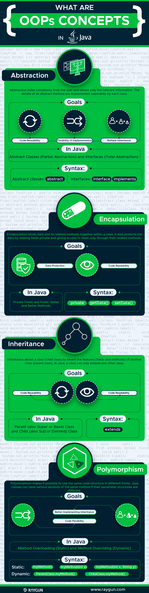
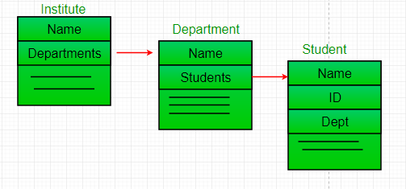

# 面向对象的特征

继承、封装和多态，以及最新归进来的抽象

1.继承：继承了某对象，将拥有该对象的方法和属性，并且可以拓展自己的属性和方法，可以增加代码的重用性、拓展和修改；

2.封装：即不需要关心内部的实现；

3.多态：能够去重写继承对象的方法，例如ToString（）方法，也可以说成是父对象提供的一个接口，然后让各子类来根据实际情况进行完善

（这里插一句：重写展现的是父类与子类之间的多态，而重载展现的是同一类的多态，详见“重写和重载的区别”）

4.抽象：抽象的特性是每一位半编程人员必须掌握的技术。

# 面向对象的设计原则

## 基本的五大原则：SOLID

https://www.youtube.com/watch?v=v-2yFMzxqwU，2009年Gotham Ruby Conference中Duke University的Sandi Metz女士对SOLID Object-Oriented Design的主题演讲：

Rigid：every change causes a cascade of related changes.

In rigid app , everything is connected to everything else.

Fragile: distant and apperently unrelated code breaks after every change

fragility is a lot like rigidity, the difference between fragile app and rigid app is fragile apps are rigid but you can't tell by looking

Immobile: cannot reuse your code

Viscous: behaving badly is the most attractive alternative

<font color=red>Dependencies are killing you and the key point of S.M speech is to talk about how to design can save.</font>

SOLID, this is an acronym that is made by Robert Martin.

Single Responsibility: there should never be more than one reason for a class to change.

Open/Closed: a module should be open for extension but colsed for modificaton.

Liskov Substitution: subclasses should be substitutable for their base classes

Interface segregation: many client specific interfaces are better than one general purpose interface.

Dependency inversion: depend upon abstractions. Don not depend upon concretions.

Common theme is they're about managing the dependencies in our  application.These pricinples are strategies that you can apply to  lead you a place where your application has minimal entanglements with each other so that you can change things.

<font color=red>**Design is all about Dependencies**</font>

To avoid dependencies, our code should be:

* loosely coupled
* highly cohensive
* easily composable
* context indenpendent


Is it DRY?

Does it have one responsibility?

Does everything in it change at the same rate?

Does it depend on things that change less often the it does?

### 单一职责原则（Single responsibility principle

> **定义**
>
> SRP: there should never be more than one reason for a class to change.
>
> 应该有且仅有一个原因引起类的变更。即一个类，最好只负责一件事情，只有一个引起它变化的原因。

> **问题的由来**
>
> （引用自：https://blog.csdn.net/zhengzhb/article/details/7278174）
>
> 问题由来：
>
> 类T负责两个不同的职责：职责P1，职责P2。当由于职责P1需求发生改变而需要修改类T时，有可能会导致原本运行正常的职责P2功能发生故障。
>
> 解决方案：
>
> 遵循单一职责原则。分别建立两个类T1、T2，使T1完成职责P1功能，T2完成职责P2功能。这样，当修改类T1时，不会使职责P2发生故障风险；同理，当修改T2时，也不会使职责P1发生故障风险。
>
> 说到单一职责原则，很多人都会不屑一顾。因为它太简单了。稍有经验的程序员即使从来没有读过设计模式、从来没有听说过单一职责原则，在设计软件时也会自觉的遵守这一重要原则，因为这是常识。在软件编程中，谁也不希望因为修改了一个功能导致其他的功能发生故障。而避免出现这一问题的方法便是遵循单一职责原则。虽然单一职责原则如此简单，并且被认为是常识，但是即便是经验丰富的程序员写出的程序，也会有违背这一原则的代码存在。为什么会出现这种现象呢？因为有职责扩散。所谓职责扩散，就是因为某种原因，职责P被分化为粒度更细的职责P1和P2。
>
> 比如：类T只负责一个职责P，这样设计是符合单一职责原则的。后来由于某种原因，也许是需求变更了，也许是程序的设计者境界提高了，需要将职责P细分为粒度更细的职责P1，P2，这时如果要使程序遵循单一职责原则，需要将类T也分解为两个类T1和T2，分别负责P1、P2两个职责。但是在程序已经写好的情况下，这样做简直太费时间了。所以，简单的修改类T，用它来负责两个职责是一个比较不错的选择，虽然这样做有悖于单一职责原则。（这样做的风险在于职责扩散的不确定性，因为我们不会想到这个职责P，在未来可能会扩散为P1，P2，P3，P4……Pn。所以记住，在职责扩散到我们无法控制的程度之前，立刻对代码进行重构。）

举例说明，用一个类描述动物呼吸这个场景：

```java
class Animal{
	public void breathe(String animal){
		System.out.println(animal+"呼吸空气");
	}
}
public class Client{
	public static void main(String[] args){
		Animal animal = new Animal();
		animal.breathe("牛");
		animal.breathe("羊");
		animal.breathe("猪");
	}
}
```

运行结果：

```
牛呼吸空气
羊呼吸空气
猪呼吸空气
```

程序上线后，发现问题了，并不是所有的动物都呼吸空气的，比如鱼就是呼吸水的。修改时如果遵循单一职责原则，需要将Animal类细分为陆生动物类Terrestrial，水生动物Aquatic，代码如下：

```java
class Terrestrial{
	public void breathe(String animal){
		System.out.println(animal+"呼吸空气");
	}
}
class Aquatic{
	public void breathe(String animal){
		System.out.println(animal+"呼吸水");
	}
}

public class Client{
	public static void main(String[] args){
		Terrestrial terrestrial = new Terrestrial();
		terrestrial.breathe("牛");
		terrestrial.breathe("羊");
		terrestrial.breathe("猪");
		
        Aquatic aquatic = new Aquatic();
        aquatic.breathe("鱼");
	}
}
```


运行结果：

```
牛呼吸空气
羊呼吸空气
猪呼吸空气
鱼呼吸水
```

我们会发现如果这样修改花销是很大的，除了将原来的类分解之外，还需要修改客户端。而直接修改类Animal来达成目的虽然违背了单一职责原则，但花销却小的多，代码如下：

```java
class Animal{
	public void breathe(String animal){
		if("鱼".equals(animal)){
			System.out.println(animal+"呼吸水");
		}else{
			System.out.println(animal+"呼吸空气");
		}
	}
}

public class Client{
	public static void main(String[] args){
		Animal animal = new Animal();
		animal.breathe("牛");
		animal.breathe("羊");
		animal.breathe("猪");
		animal.breathe("鱼");
	}
}
```

可以看到，这种修改方式要简单的多。但是却存在着隐患：有一天需要将鱼分为呼吸淡水的鱼和呼吸海水的鱼，则又需要修改Animal类的breathe方法，而对原有代码的修改会对调用“猪”“牛”“羊”等相关功能带来风险，也许某一天你会发现程序运行的结果变为“牛呼吸水”了。这种修改方式直接在代码级别上违背了单一职责原则，虽然修改起来最简单，但隐患却是最大的。还有一种修改方式：

```java
class Animal{
	public void breathe(String animal){
		System.out.println(animal+"呼吸空气");
	}
	public void breathe2(String animal){
		System.out.println(animal+"呼吸水");
	}
}
public class Client{
	public static void main(String[] args){
		Animal animal = new Animal();
		animal.breathe("牛");
		animal.breathe("羊");
		animal.breathe("猪");
		animal.breathe2("鱼");
	}
}
```


可以看到，这种修改方式没有改动原来的方法，而是在类中新加了一个方法，这样虽然也违背了单一职责原则，但在方法级别上却是符合单一职责原则的，因为它并没有动原来方法的代码。这三种方式各有优缺点，那么在实际编程中，采用哪一中呢？其实这真的比较难说，需要根据实际情况来确定。我的原则是：只有逻辑足够简单，才可以在代码级别上违反单一职责原则；只有类中方法数量足够少，才可以在方法级别上违反单一职责原则；

例如本文所举的这个例子，它太简单了，它只有一个方法，所以，无论是在代码级别上违反单一职责原则，还是在方法级别上违反，都不会造成太大的影响。实际应用中的类都要复杂的多，一旦发生职责扩散而需要修改类时，除非这个类本身非常简单，否则还是遵循单一职责原则的好。

遵循单一职责原的优点有：

* 可以降低类的复杂度，一个类只负责一项职责，其逻辑肯定要比负责多项职责简单的多；
* 提高类的可读性，提高系统的可维护性；
* 变更引起的风险降低，变更是必然的，如果单一职责原则遵守的好，当修改一个功能时，可以显著降低对其他功能的影响

需要说明的一点是单一职责原则不只是面向对象编程思想所特有的，只要是模块化的程序设计，都适用单一职责原则。

### 开放关闭原则（Open-closed principle）

Classes, methods or functions should be Open for extension (new functionality) and Closed for modification.

### 里式替换原则（Liskov substitution principle）

> 定义（是什么）：
>
> 

> 使用场景（产生的原因）：

### 接口隔离原则（Interface segregation principle）:

### 依赖倒置（Dependency inversion principle）:

### 迪米特法则(新增)

### DRY(新增)

Don't repeat yourself.不要写重复的代码

如果一个相同的代码块出现在相同的地方，则需要考虑其是否可以单独作为一个方法存在；或者你是在多处使用一个硬编码的值，则需要考虑将其作为public final 常量。这样做的好处是便于维护。

### Encapsulate What Changes(新增)

### Favor Composition over Inheritance(新增)

有两种常用的能够重用已经编写的代码：继承和组合，它们都有其各自的优缺点。但是，一般来说，如果可能的话，通常更倾向于组合而不是继承。

组合相对于继承来说显得更加灵活。

### Programming for Interface not implementation(新增)

程序应该面向接口编程而不是面向具体实现编程。这样当有新的实现的时候，使用接口编程将会变得非常灵活。

具体来说，你应该在变量，方法的返回值和参数上使用接口类型，例如使用基类类型来存储对象而不是子类类型。如：

````java
// Good
List numbers = getNumbers(); 
// Bad
ArrayList numbers = getNumbers();
````

### Delegation principles(新增)


## 面向对象的6个概念

根源：https://raygun.com/blog/oop-concepts-java/



### [Abstraction](https://raygun.com/blog/oop-concepts-java/#abstraction)

抽象旨在向用户隐藏复杂的实现，仅向他们展现他们所关心的相关信息。 例如，如果您想开车，则无需了解其内部工作原理。 Java类也是如此。 您可以使用抽象类或接口隐藏内部实现的细节。 在抽象级别上，您只需要定义方法签名（名称和参数列表），并让每个类以自己的方式实现它们。

抽象的特性：

* Hides the underlying complexity of data（隐藏数据的复杂性）
* Helps avoid repetitive code（代码的复用）
* Presents only the signature of internal functionality（只显示内部功能的方法签名）
* Gives flexibility to programmers to change the implementation of the abstract behaviour（编程人员可以灵活地改变抽象行为的内部实现）
* Partial abstraction (0-100%) can be achieved with abstract classes（抽象内中可以有抽象方法，也可以由普通方法；抽象类中可以没有抽象方法，一个类中如果有任意一个方法声明为抽象方法，那么包含这个方法的类必须声明为抽象类；子类必须完全实现父类的抽象方法，可以不重写父类的普通方法；这也就是所谓的部分抽象）
* Total abstraction (100%) can be achieved with interfaces（实现接口的类必须完全实现接口中声明的普通方法，默认public abstract修饰，即所谓的100%抽象；在Java1.8中接口中引入了默认方法，由default进行修饰，默认是public修饰的）

### [Encapsulation](https://raygun.com/blog/oop-concepts-java/#encapsulation)

封装使得我们能够保护存储在类中的数据免受系统范围（system-wide）的访问。顾名思义，他可以像生活中的胶囊一样保护类的内部内容。我们可以通过将字段（类变量）保持私有并为每个字段提供公共的getter和setter方法来实现Java中的封装。Java Bean是完全封装的类的示例。

封装的特性：

- Restricts direct access to data members (fields) of a class.（严格限制访问类的成员变量）
- Fields are set to private（成员被设置为private属性）
- Each field has a getter and setter method（每一个成员都有对应的getter和setter方法）
- Getter methods return the field（getter方法返回成员对应的成员变量）
- Setter methods let us change the value of the field（setter方法让我们能够设置成员变量）

### [Inheritance](https://raygun.com/blog/oop-concepts-java/#inheritance)

继承使得创建一个子类继承父类的成员和方法成为可能。子类可以覆盖父类的方法和值，但这不是必须的。子类可以在父类的基础上增加新的数据和功能。父类通常又叫做超类或基类，子类通常又叫做子类或派生类。Java中使用extends关键字在代码中实现继承的原理。

继承的特性：

- A class (child class) can extend another class (parent class) by inheriting its features.（一个类可以通过extends关键字继承自另外一个类）
- Implements the DRY (Don’t Repeat Yourself) programming principle.（实现了DRY原则）
- Improves code reusability.（提高了代码的复用性）
- Multilevel inheritance is allowed in Java (a child class can have its own child class as well).（Java中多层继承是允许的，子类也可以有其自己的子类）
- Multiple inheritances are not allowed in Java (a class can’t extend more than one class).（Java中不允许多重继承，即extends后面不能紧跟多个类）

### [Polymorphism](https://raygun.com/blog/oop-concepts-java/#polymorphism)

多态是指以不同的方式执行特定的动作的能力。在Java中，多态可以采用两种形式：方法重载和方法重写。

当类中存在具有相同名称的各种方法时，此时会发生方法重载；调用它们时，将根据其参数的数量，顺序和类型来区分它们。

当子类覆盖其父类的方法时，将发生方法覆盖。

多态的特性：

- The same method name is used several times.（同一个方法名出现多次）
- Different methods of the same name can be called from the object.（对象可以调用相同名称的不同方法）
- <font color=red>**All Java objects can be considered polymorphic (at the minimum, they are of their own type and instances of the Object class)**</font>.（所有的Java的对象都可以被视为多态的，至少它们是Object的示例）
- Example of <font color=red>**static polymorphism**</font> in Java is method overloading.（Java中静态多态的示例是方法重载）
- Example of <font color=red>**dynamic polymorphism**</font> in Java is method overriding.（Java中动态多态的示例是方法重载）

### [Association](https://raygun.com/blog/oop-concepts-java/#association)

来自：https://www.geeksforgeeks.org/association-composition-aggregation-java/

除了上面的几个OOP原则之外，还有另外三个其他的概念（关联、聚合和组合），可以在程序设计时加以使用。聚合是一种特殊的关联形式，而组合是一种特殊的聚合形式。


关联只是意味着两个不相关的类之间建立关系的行为。例如，当您在同一个类中声明两个不同类型的字段（例如Car和Bicycle）并使它们彼此交互时，就执行了关联。

关联的特性：

- Two separate classes are associated through their objects.（两个单独的类通过它们的对象关联）
- The two classes are unrelated, each can exist without the other one.（两个类没有相关性，每一个类都可以脱离另外一个单独存在）
- Can be a one-to-one, one-to-many, many-to-one, or many-to-many relationship.（可以一对一，一对多，多对一或多对多的关系）

例：

```java
// Java program to illustrate the 
// concept of Association
import java.io.*;

// class bank
class Bank 
{
    private String name;

    // bank name
    Bank(String name)
    {
        this.name = name;
    }

    public String getBankName()
    {
        return this.name;
    }
} 

// employee class 
class Employee
{
    private String name;

    // employee name 
    Employee(String name) 
    {
        this.name = name;
    }

    public String getEmployeeName()
    {
        return this.name;
    } 
}

// Association between both the 
// classes in main method
class Association 
{
    public static void main (String[] args) 
    {
        Bank bank = new Bank("Axis");
        Employee emp = new Employee("Neha");

        System.out.println(emp.getEmployeeName() + 
               " is employee of " + bank.getBankName());
    }
}
```

输出：

```
Neha is employee of Axis
```

上面的示例中两个单独的类Bank和Empolyee通过它们的对象相关联。Bank可以有许多empolyees，所以这是一对多的关系。


### [Aggregation](https://raygun.com/blog/oop-concepts-java/#aggregation)

聚合是一种较严格的关联关系。当您通过对象关联的两个类之间 存在单向的对应关系（one-way（HAS-A）），此时两者非关系便是聚合关系。 聚合关系通常是描述“has-a”/“whole-part”的关系的。聚合类包含着其他类的引用，其之间存在所有权的关系，所引用的每个类均被视为聚合类的一部分。

之所以存在所有权，是因为在聚合关系中不能够存在循环引用的问题。如果A包含B的引用，而B又包含A的引用，则无法确定明确的所有权关系；这时候两者非关系仅仅是关联关系。

例如，假设Student类存储了学校中各个学生的信息。现在假定存在Subject类，其中包含有关特定科目的信息（如历史，地理）。如果将Student类定义为含有Subject对象，则可以说Student对象具有Subject对象。“Subject”对象构成“Student”对象的一部分-毕竟，没有学生一个科目也不学。因此，Student对象拥有Subject对象。

聚合的特性：

- One-directional association.（单向关联关系，例如，部门可以有学生，但反过来不行）
- Represents a HAS-A relationship between two classes.（表示两个类之间存在HAS-A的关系）
- Only one class is dependent on the other.（只有一个类依赖于其他类）
- **both the entries can survive individually**（两个都可以单独存在而不会影响另外一个实体）


例如：

```java
// Java program to illustrate
//the concept of Aggregation.
import java.io.*;
import java.util.*;

// student class
class Student 
{
    String name;
    int id ;
    String dept;

    Student(String name, int id, String dept) 
    {

        this.name = name;
        this.id = id;
        this.dept = dept;

    }
}

/* Department class contains list of student
Objects. It is associated with student
class through its Object(s). */
class Department 
{

    String name;
    private List<Student> students;
    Department(String name, List<Student> students) 
    {

        this.name = name;
        this.students = students;

    }

    public List<Student> getStudents() 
    {
        return students;
    }
}

/* Institute class contains list of Department
Objects. It is asoociated with Department
class through its Object(s).*/
class Institute 
{

    String instituteName;
    private List<Department> departments;

    Institute(String instituteName, List<Department> departments)
    {
        this.instituteName = instituteName;
        this.departments = departments;
    }

    // count total students of all departments
    // in a given institute 
    public int getTotalStudentsInInstitute()
    {
        int noOfStudents = 0;
        List<Student> students; 
        for(Department dept : departments)
        {
            students = dept.getStudents();
            for(Student s : students)
            {
                noOfStudents++;
            }
        }
        return noOfStudents;
    }

} 

// main method
class GFG
{
    public static void main (String[] args) 
    {
        Student s1 = new Student("Mia", 1, "CSE");
        Student s2 = new Student("Priya", 2, "CSE");
        Student s3 = new Student("John", 1, "EE");
        Student s4 = new Student("Rahul", 2, "EE");

        // making a List of 
        // CSE Students.
        List <Student> cse_students = new ArrayList<Student>();
        cse_students.add(s1);
        cse_students.add(s2);

        // making a List of 
        // EE Students
        List <Student> ee_students = new ArrayList<Student>();
        ee_students.add(s3);
        ee_students.add(s4);

        Department CSE = new Department("CSE", cse_students);
        Department EE = new Department("EE", ee_students);

        List <Department> departments = new ArrayList<Department>();
        departments.add(CSE);
        departments.add(EE);

        // creating an instance of Institute.
        Institute institute = new Institute("BITS", departments);

        System.out.print("Total students in institute: ");
        System.out.print(institute.getTotalStudentsInInstitute());
    }
}
```

输出：

```
Total students in institute: 4
```

在此示例中，存在一个机构拥有 CSE，EE等部门。 每个部门都有学生。 因此，我们创建一个Institute类，该类拥有Department(s)对象的引用。 这意味着Institute类通过其对象与Department类相关联。 并且Department类还引用了Student类的一个或多个对象（即对象列表），这意味着它通过其对象与Student类相关联。
它代表一种Has-A关系。



<font color=red>**通过聚合可以实现代码的复用**</font>

### [Composition](https://raygun.com/blog/oop-concepts-java/#composition)


组合是一种较严格的聚合关系。关联的两个类相互高度依赖，且不能单独存在时，两者之间的关系就是组合关系。例如，以Car和Engine为例，如果没有Engine，Car就无法运行；而Engine脱离了Car也无法工作。对象之间的这种关系也称为part-of关系。

组合的特性：

- A restricted form of aggregation（有限制的聚合的关系）
- Represents a PART-OF relationship between two classes（代表一种oart-of的关系，即一个类是另一个类的一部分）
- Both classes are dependent on each other（实例是相互依赖的）
- If one class ceases to exist, the other can’t survive alone（如果一个类不存在了，那么另一个也不能存活）

以**Library**为例：

```java
// Java program to illustrate 
// the concept of Composition
import java.io.*;
import java.util.*;

// class book
class Book 
{

    public String title;
    public String author;

    Book(String title, String author)
    {

        this.title = title;
        this.author = author;
    }
}

// Libary class contains 
// list of books.
class Library 
{

    // reference to refer to list of books.
    private final List<Book> books;

    Library (List<Book> books)
    {
        this.books = books; 
    }

    public List<Book> getTotalBooksInLibrary(){

       return books;  
    }

}

// main method
class GFG 
{
    public static void main (String[] args) 
    {

        // Creating the Objects of Book class.
        Book b1 = new Book("EffectiveJ Java", "Joshua Bloch");
        Book b2 = new Book("Thinking in Java", "Bruce Eckel");
        Book b3 = new Book("Java: The Complete Reference", "Herbert Schildt");

        // Creating the list which contains the 
        // no. of books.
        List<Book> books = new ArrayList<Book>();
        books.add(b1);
        books.add(b2);
        books.add(b3);

        Library library = new Library(books);

        List<Book> bks = library.getTotalBooksInLibrary();
        for(Book bk : bks){

            System.out.println("Title : " + bk.title + " and "
            +" Author : " + bk.author);
        }
    }
}
```

输出：

```
Title : EffectiveJ Java and  Author : Joshua Bloch
Title : Thinking in Java and  Author : Bruce Eckel
Title : Java: The Complete Reference and  Author : Herbert Schildt
```

上面的示例中，图书馆可以拥有同一主题或者不同主题的书籍。所以，如果图书馆被销毁，则该特定图书馆中的所有书籍都会被销毁。也就是说，没有图书馆就不可能存在书籍。

### Aggregation vs Composition（聚合vs组合）

聚合和组合的比较：

1. 依赖：聚合代表被关联的一方可以独立于关联一方而存在的关系，比如说，银行和雇员，将银行对象删除后，雇员对象仍然存在。然后，组合代表着被关联的一方不能独立于一方而存在的关系，比如，人没有心脏就无法生存，心脏也是相对人而言的，没有人，也就没有心脏这么一说。
2. 关系类型：聚合是has-a关系，组合是part-of关系。
3. 关联类型：组合是一种强关联关系，聚合是一种弱关联关系。

例：

```java
// Java program to illustrate the
// difference between Aggregation
// Composition.

import java.io.*;

// Engine class which will 
// be used by car. so 'Car'
// class will have a field 
// of Engine type.
class Engine 
{
    // starting an engine.
    public void work()
    {
        System.out.println("Engine of car has been started ");
    }

}

// Engine class
final class Car 
{
    // For a car to move, 
    // it need to have a engine.
    private final Engine engine; // Composition
    //private Engine engine;     // Aggregation

    Car(Engine engine)
    {
        this.engine = engine;
    }

    // car start moving by starting engine
    public void move() 
    {
        //if(engine != null)
        {
            engine.work();
            System.out.println("Car is moving ");
        }
    }
}

class GFG 
{
    public static void main (String[] args) 
    {
        // making an engine by creating 
        // an instance of Engine class.
        Engine engine = new Engine();

        // Making a car with engine.
        // so we are passing a engine 
        // instance as an argument while
        // creating instace of Car.
        Car car = new Car(engine);
        car.move();
    }
}
```

输出：

```
Engine of car has been started 
Car is moving 
```

在聚合关系的代码实现中，汽车通过引擎对象来实现部分功能，但是，引擎不是总存在汽车的内部，引擎可以换，并且可以从汽车中卸下来，这也是为什么聚合关系中，引擎对象是非final的。