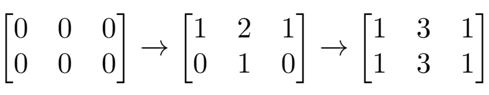

 # Easy

## 1. 两数之和

TwoSum.java

给定一个整数数组 nums 和一个目标值 target，请你在该数组中找出和为目标值的那 两个 整数，并返回他们的数组下标。

你可以假设每种输入只会对应一个答案。但是，你不能重复利用这个数组中同样的元素。

### 示例:

```
给定 nums = [2, 7, 11, 15], target = 9

因为 nums[0] + nums[1] = 2 + 7 = 9
所以返回 [0, 1]
```

## 2.两数相加

addTwoNumbers.java

给出两个 非空 的链表用来表示两个非负的整数。其中，它们各自的位数是按照 逆序 的方式存储的，并且它们的每个节点只能存储 一位 数字。

如果，我们将这两个数相加起来，则会返回一个新的链表来表示它们的和。

您可以假设除了数字 0 之外，这两个数都不会以 0 开头。

### 示例：

```
输入：(2 -> 4 -> 3) + (5 -> 6 -> 4)
输出：7 -> 0 -> 8
原因：342 + 465 = 807
```

## 21. 合并两个有序链表

将两个有序链表合并为一个新的有序链表并返回。新链表是通过拼接给定的两个链表的所有节点组成的。 

### 示例：

```
输入：1->2->4, 1->3->4
输出：1->1->2->3->4->4
```

## 26. 删除排序数组中的重复项

removeDuplicates.java

给定一个排序数组，你需要在原地删除重复出现的元素，使得每个元素只出现一次，返回移除后数组的新长度。

不要使用额外的数组空间，你必须在原地修改输入数组并在使用 O(1) 额外空间的条件下完成。

### 示例 1:

```
给定数组 nums = [1,1,2], 

函数应该返回新的长度 2, 并且原数组 nums 的前两个元素被修改为 1, 2。 

你不需要考虑数组中超出新长度后面的元素。
```

### 示例 2:

```
给定 nums = [0,0,1,1,1,2,2,3,3,4],

函数应该返回新的长度 5, 并且原数组 nums 的前五个元素被修改为 0, 1, 2, 3, 4。

你不需要考虑数组中超出新长度后面的元素。
```

### 说明:

为什么返回数值是整数，但输出的答案是数组呢?

请注意，输入数组是以“引用”方式传递的，这意味着在函数里修改输入数组对于调用者是可见的。

你可以想象内部操作如下:

```java
// nums 是以“引用”方式传递的。也就是说，不对实参做任何拷贝
int len = removeDuplicates(nums);

// 在函数里修改输入数组对于调用者是可见的。
// 根据你的函数返回的长度, 它会打印出数组中该长度范围内的所有元素。
for (int i = 0; i < len; i++) {
    print(nums[i]);
}
```

## 27. 移除元素

RemoveElement.java

给定一个数组 nums 和一个值 val，你需要原地移除所有数值等于 val 的元素，返回移除后数组的新长度。

不要使用额外的数组空间，你必须在原地修改输入数组并在使用 O(1) 额外空间的条件下完成。

元素的顺序可以改变。你不需要考虑数组中超出新长度后面的元素。

### 示例 1:

```
给定 nums = [3,2,2,3], val = 3,

函数应该返回新的长度 2, 并且 nums 中的前两个元素均为 2。

你不需要考虑数组中超出新长度后面的元素。
```

### 示例 2:

```
给定 nums = [0,1,2,2,3,0,4,2], val = 2,

函数应该返回新的长度 5, 并且 nums 中的前五个元素为 0, 1, 3, 0, 4。

注意这五个元素可为任意顺序。

你不需要考虑数组中超出新长度后面的元素。
```

### 说明:

为什么返回数值是整数，但输出的答案是数组呢?

请注意，输入数组是以“引用”方式传递的，这意味着在函数里修改输入数组对于调用者是可见的。

你可以想象内部操作如下:

```java
// nums 是以“引用”方式传递的。也就是说，不对实参作任何拷贝
int len = removeElement(nums, val);

// 在函数里修改输入数组对于调用者是可见的。
// 根据你的函数返回的长度, 它会打印出数组中该长度范围内的所有元素。
for (int i = 0; i < len; i++) {
    print(nums[i]);
}
```

## 28.任务调度器

leastInterval.java

给定一个用字符数组表示的 CPU 需要执行的任务列表。其中包含使用大写的 A - Z 字母表示的26 种不同种类的任务。任务可以以任意顺序执行，并且每个任务都可以在 1 个单位时间内执行完。CPU 在任何一个单位时间内都可以执行一个任务，或者在待命状态。

然而，两个相同种类的任务之间必须有长度为 n 的冷却时间，因此至少有连续 n 个单位时间内 CPU 在执行不同的任务，或者在待命状态。

你需要计算完成所有任务所需要的最短时间。

### 示例 1：

```
输入: tasks = ["A","A","A","B","B","B"], n = 2
输出: 8
执行顺序: A -> B -> (待命) -> A -> B -> (待命) -> A -> B.
```

### 注：

任务的总个数为 [1, 10000]。
n 的取值范围为 [0, 100]。

## 53. 最大子序和

maxSubArray.java

给定一个整数数组 nums ，找到一个具有最大和的连续子数组（子数组最少包含一个元素），返回其最大和。

### 示例:

```
输入: [-2,1,-3,4,-1,2,1,-5,4],
输出: 6
解释: 连续子数组 [4,-1,2,1] 的和最大，为 6。
```

## [83. 删除排序链表中的重复元素](https://leetcode-cn.com/problems/remove-duplicates-from-sorted-list/)

DeleteDuplicates.java

给定一个排序链表，删除所有重复的元素，使得每个元素只出现一次。

### 示例 1:

```
输入: 1->1->2
输出: 1->2
```

### 示例 2:

```
输入: 1->1->2->3->3
输出: 1->2->3
```

## 167. 两数之和 II - 输入有序数组

TwoSum.java

给定一个已按照升序排列 的有序数组，找到两个数使得它们相加之和等于目标数。

函数应该返回这两个下标值 index1 和 index2，其中 index1 必须小于 index2。

### 说明:

返回的下标值（index1 和 index2）不是从零开始的。
你可以假设每个输入只对应唯一的答案，而且你不可以重复使用相同的元素。

### 示例:

```
输入: numbers = [2, 7, 11, 15], target = 9
输出: [1,2]
解释: 2 与 7 之和等于目标数 9 。因此 index1 = 1, index2 = 2 。
```

## [141. 环形链表](https://leetcode-cn.com/problems/linked-list-cycle/)

HasCycle.java

给定一个链表，判断链表中是否有环。

为了表示给定链表中的环，我们使用整数 pos 来表示链表尾连接到链表中的位置（索引从 0 开始）。 如果 pos 是 -1，则在该链表中没有环。

### 示例 1：

```
输入：head = [3,2,0,-4], pos = 1
输出：true
解释：链表中有一个环，其尾部连接到第二个节点。
```


### 示例 2：

```
输入：head = [1,2], pos = 0
输出：true
解释：链表中有一个环，其尾部连接到第一个节点。
```


### 示例 3：

```
输入：head = [1], pos = -1
输出：false
解释：链表中没有环。
```


### 进阶：

你能用 O(1)（即，常量）内存解决此问题吗？

## [155. 最小栈](https://leetcode-cn.com/problems/min-stack/)

MinStackTest.java

设计一个支持 push，pop，top 操作，并能在常数时间内检索到最小元素的栈。

push(x) -- 将元素 x 推入栈中。
pop() -- 删除栈顶的元素。
top() -- 获取栈顶元素。
getMin() -- 检索栈中的最小元素。

### 示例:

```
MinStack minStack = new MinStack();
minStack.push(-2);
minStack.push(0);
minStack.push(-3);
minStack.getMin();   --> 返回 -3.
minStack.pop();
minStack.top();      --> 返回 0.
minStack.getMin();   --> 返回 -2.
```

## [160. 相交链表](https://leetcode-cn.com/problems/intersection-of-two-linked-lists/)

GetIntersectionNode.java

编写一个程序，找到两个单链表相交的起始节点。

如下面的两个链表：


在节点 c1 开始相交。

### 示例 1：


```
输入：intersectVal = 8, listA = [4,1,8,4,5], listB = [5,0,1,8,4,5], skipA = 2, skipB = 3
输出：Reference of the node with value = 8
输入解释：相交节点的值为 8 （注意，如果两个列表相交则不能为 0）。从各自的表头开始算起，链表 A 为 [4,1,8,4,5]，链表 B 为 [5,0,1,8,4,5]。在 A 中，相交节点前有 2 个节点；在 B 中，相交节点前有 3 个节点。
```

### 示例 2：


```
输入：intersectVal = 2, listA = [0,9,1,2,4], listB = [3,2,4], skipA = 3, skipB = 1
输出：Reference of the node with value = 2
输入解释：相交节点的值为 2 （注意，如果两个列表相交则不能为 0）。从各自的表头开始算起，链表 A 为 [0,9,1,2,4]，链表 B 为 [3,2,4]。在 A 中，相交节点前有 3 个节点；在 B 中，相交节点前有 1 个节点。
```

### 示例 3：


```
输入：intersectVal = 0, listA = [2,6,4], listB = [1,5], skipA = 3, skipB = 2
输出：null
输入解释：从各自的表头开始算起，链表 A 为 [2,6,4]，链表 B 为 [1,5]。由于这两个链表不相交，所以 intersectVal 必须为 0，而 skipA 和 skipB 可以是任意值。
解释：这两个链表不相交，因此返回 null。
```

### 注意：

```
如果两个链表没有交点，返回 null.
在返回结果后，两个链表仍须保持原有的结构。
可假定整个链表结构中没有循环。
程序尽量满足 O(n) 时间复杂度，且仅用 O(1) 内存。
```

### 解法：

1）暴力，见源文件

2）哈希，见源文件

3）双指针：

> 双指针最重要的就是消除两个链表的长度差，
> 如果两个链表相交，则在相交的节点开始之后的所有节点都是公用同一个内存地址，他们的hashcode都是一样的
> 因此需要从将两个链表的指针都移动到距离末尾相同的距离

```
令pA = headA, pB = headB;其中headA，headB分别为链表A，B的头节点
同时移动pA和pB
while (pA 和 pB不相等时) {
	// 如果pA跑到末尾，即当pA = null时，将其指向B的头节点即，pA = headB
	pA = pA == null ? headB : pA.next; // (1)
	// 同理，如果pB跑到末尾，即当pB = null时，将其指向A的头节点即，pB = headA
	pB = pB == null ? headA : pB.next; // (2)
}
```

> <font color="red">以下摘自leetcode：https://leetcode-cn.com/problems/intersection-of-two-linked-lists/solution/tu-jie-xiang-jiao-lian-biao-by-user7208t/</font>
>
> 空间复杂度 O(1)O(1) 时间复杂度为 O(n)O(n)
>
> 这里使用图解的方式，解释比较巧妙的一种实现。
>
> 根据题目意思
> 如果两个链表相交，那么相交点之后的长度是相同的
>
> 我们需要做的事情是，让两个链表从同距离末尾同等距离的位置开始遍历。这个位置只能是较短链表的头结点位置。
> 为此，我们必须消除两个链表的长度差
>
> 指针 pA 指向 A 链表，指针 pB 指向 B 链表，依次往后遍历
> 如果 pA 到了末尾，则 pA = headB 继续遍历
> 如果 pB 到了末尾，则 pB = headA 继续遍历
> 比较长的链表指针指向较短链表head时，长度差就消除了
> 如此，只需要将最短链表遍历两次即可找到位置
> 听着可能有点绕，看图最直观，链表的题目最适合看图了


> 下面证明，通过伪代码中的(1),(2)步骤始终会将两个指针移动到距离链表末尾相同长度的位置，即消除长度差异。


## [203. 移除链表元素](https://leetcode-cn.com/problems/remove-linked-list-elements/)

RemoveElements.java

删除链表中等于给定值 **val** 的所有节点。

**示例:**

```
输入: 1->2->6->3->4->5->6, val = 6
输出: 1->2->3->4->5
```

## [206. 反转链表](https://leetcode-cn.com/problems/reverse-linked-list/)

ReverseList.java

反转一个单链表。

### 示例:

```
输入: 1->2->3->4->5->NULL
输出: 5->4->3->2->1->NULL
```

### 进阶:
```
你可以迭代或递归地反转链表。你能否用两种方法解决这道题？
```

## [232. 用栈实现队列](https://leetcode-cn.com/problems/implement-queue-using-stacks/)

MyQueueTest.java

使用栈实现队列的下列操作：

* push(x) -- 将一个元素放入队列的尾部。
* pop() -- 从队列首部移除元素。
* peek() -- 返回队列首部的元素。
* empty() -- 返回队列是否为空。

### 示例:

```java
MyQueue queue = new MyQueue();

queue.push(1);
queue.push(2);  
queue.peek();  // 返回 1
queue.pop();   // 返回 1
queue.empty(); // 返回 false
```

### 说明:

* 你只能使用标准的栈操作 -- 也就是只有 push to top, peek/pop from top, size, 和 is empty 操作是合法的。
* 你所使用的语言也许不支持栈。你可以使用 list 或者 deque（双端队列）来模拟一个栈，只要是标准的栈操作即可。
* 假设所有操作都是有效的 （例如，一个空的队列不会调用 pop 或者 peek 操作）。

## [234. 回文链表](https://leetcode-cn.com/problems/palindrome-linked-list/)

IsPalindrome.java

请判断一个链表是否为回文链表。

**示例 1:**

```
输入: 1->2
输出: false
```

**示例 2:**

```
输入: 1->2->2->1
输出: true
```

## [237. 删除链表中的节点](https://leetcode-cn.com/problems/delete-node-in-a-linked-list/)

请编写一个函数，使其可以删除某个链表中给定的（非末尾）节点，你将只被给定要求被删除的节点。

现有一个链表 -- head = [4,5,1,9]，它可以表示为:


### 示例 1:

```
输入: head = [4,5,1,9], node = 5
输出: [4,1,9]
解释: 给定你链表中值为 5 的第二个节点，那么在调用了你的函数之后，该链表应变为 4 -> 1 -> 9.
```

### 示例 2:

```
输入: head = [4,5,1,9], node = 1
输出: [4,5,9]
解释: 给定你链表中值为 1 的第三个节点，那么在调用了你的函数之后，该链表应变为 4 -> 5 -> 9.
```

### 说明:

```
链表至少包含两个节点。
链表中所有节点的值都是唯一的。
给定的节点为非末尾节点并且一定是链表中的一个有效节点。
不要从你的函数中返回任何结果。
```

## [496. 下一个更大元素 I](https://leetcode-cn.com/problems/next-greater-element-i/)

NextGreaterElement.java

给定两个没有重复元素的数组 nums1 和 nums2 ，其中nums1 是 nums2 的子集。找到 nums1 中每个元素在 nums2 中的下一个比其大的值。

nums1 中数字 x 的下一个更大元素是指 x 在 nums2 中对应位置的右边的第一个比 x 大的元素。如果不存在，对应位置输出-1。

### 示例 1:

```
输入: nums1 = [4,1,2], nums2 = [1,3,4,2].
输出: [-1,3,-1]
解释:
    对于num1中的数字4，你无法在第二个数组中找到下一个更大的数字，因此输出 -1。
    对于num1中的数字1，第二个数组中数字1右边的下一个较大数字是 3。
    对于num1中的数字2，第二个数组中没有下一个更大的数字，因此输出 -1。
```

### 示例 2:

```
输入: nums1 = [2,4], nums2 = [1,2,3,4].
输出: [3,-1]
解释:
    对于num1中的数字2，第二个数组中的下一个较大数字是3。
    对于num1中的数字4，第二个数组中没有下一个更大的数字，因此输出 -1。
```

### 注意:

1. nums1和nums2中所有元素是唯一的。
2. nums1和nums2 的数组大小都不超过1000。

来源：力扣（LeetCode）
链接：https://leetcode-cn.com/problems/next-greater-element-i
著作权归领扣网络所有。商业转载请联系官方授权，非商业转载请注明出处。

## [844. 比较含退格的字符串](https://leetcode-cn.com/problems/backspace-string-compare/)

给定 S 和 T 两个字符串，当它们分别被输入到空白的文本编辑器后，判断二者是否相等，并返回结果。 # 代表退格字符。

### 示例 1：

```
输入：S = "ab#c", T = "ad#c"
输出：true
解释：S 和 T 都会变成 “ac”。
```

### 示例 2：

```
输入：S = "ab##", T = "c#d#"
输出：true
解释：S 和 T 都会变成 “”。
```

### 示例 3：

```
输入：S = "a##c", T = "#a#c"
输出：true
解释：S 和 T 都会变成 “c”。
```

### 示例 4：

```
输入：S = "a#c", T = "b"
输出：false
解释：S 会变成 “c”，但 T 仍然是 “b”。
```

### 提示：

```
1 <= S.length <= 200
1 <= T.length <= 200
S 和 T 只含有小写字母以及字符 '#'。
```

## [876. 链表的中间结点](https://leetcode-cn.com/problems/middle-of-the-linked-list/)

MiddleNode.java

给定一个带有头结点 head 的非空单链表，返回链表的中间结点。

如果有两个中间结点，则返回第二个中间结点。

### 示例 1：

```
输入：[1,2,3,4,5]
输出：此列表中的结点 3 (序列化形式：[3,4,5])
返回的结点值为 3 。 (测评系统对该结点序列化表述是 [3,4,5])。
注意，我们返回了一个 ListNode 类型的对象 ans，这样：
ans.val = 3, ans.next.val = 4, ans.next.next.val = 5, 以及 ans.next.next.next = NULL.
```

### 示例 2：

```
输入：[1,2,3,4,5,6]
输出：此列表中的结点 4 (序列化形式：[4,5,6])
由于该列表有两个中间结点，值分别为 3 和 4，我们返回第二个结点。
```

### 提示：

```
给定链表的结点数介于 1 和 100 之间。
```

## 976. 三角形的最大周长

LargestPerimeter.java

给定由一些正数（代表长度）组成的数组 A，返回由其中三个长度组成的、面积不为零的三角形的最大周长。

如果不能形成任何面积不为零的三角形，返回 0。

### 示例 1：

```
输入：[2,1,2]
输出：5
```

### 示例 2：

```
输入：[1,2,1]
输出：0
```

### 示例 3：

```
输入：[3,2,3,4]
输出：10
```

### 示例 4：

```
输入：[3,6,2,3]
输出：8
```

### 提示：

```
3 <= A.length <= 10000
1 <= A[i] <= 10^6
```

## [1021. 删除最外层的括号](https://leetcode-cn.com/problems/remove-outermost-parentheses/)

RemoveOuterParentheses.java

有效括号字符串为空 ("")、"(" + A + ")" 或 A + B，其中 A 和 B 都是有效的括号字符串，+ 代表字符串的连接。例如，""，"()"，"(())()" 和 "(()(()))" 都是有效的括号字符串。

如果有效字符串 S 非空，且不存在将其拆分为 S = A+B 的方法，我们称其为原语（primitive），其中 A 和 B 都是非空有效括号字符串。

给出一个非空有效字符串 S，考虑将其进行原语化分解，使得：S = P_1 + P_2 + ... + P_k，其中 P_i 是有效括号字符串原语。

对 S 进行原语化分解，删除分解中每个原语字符串的最外层括号，返回 S 。

### 示例 1：

```
输入："(()())(())"
输出："()()()"
解释：
输入字符串为 "(()())(())"，原语化分解得到 "(()())" + "(())"，
删除每个部分中的最外层括号后得到 "()()" + "()" = "()()()"。
```

### 示例 2：

```
输入："(()())(())(()(()))"
输出："()()()()(())"
解释：
输入字符串为 "(()())(())(()(()))"，原语化分解得到 "(()())" + "(())" + "(()(()))"，
删除每隔部分中的最外层括号后得到 "()()" + "()" + "()(())" = "()()()()(())"。
```

### 示例 3：

```
输入："()()"
输出：""
解释：
输入字符串为 "()()"，原语化分解得到 "()" + "()"，
删除每个部分中的最外层括号后得到 "" + "" = ""。
```

### 提示：

1. S.length <= 10000
2. S[i] 为 "(" 或 ")"
3. S 是一个有效括号字符串

## [1047. 删除字符串中的所有相邻重复项](https://leetcode-cn.com/problems/remove-all-adjacent-duplicates-in-string/)

com.chasedream.leetcode.easy.stack.RemoveDuplicates.java

给出由小写字母组成的字符串 S，重复项删除操作会选择两个相邻且相同的字母，并删除它们。

在 S 上反复执行重复项删除操作，直到无法继续删除。

在完成所有重复项删除操作后返回最终的字符串。答案保证唯一。

### 示例：

```
输入："abbaca"
输出："ca"
解释：
例如，在 "abbaca" 中，我们可以删除 "bb" 由于两字母相邻且相同，这是此时唯一可以执行删除操作的重复项。之后我们得到字符串 "aaca"，其中又只有 "aa" 可以执行重复项删除操作，所以最后的字符串为 "ca"。
```

### 提示：

1. 1 <= S.length <= 20000
2. S 仅由小写英文字母组成。

## 1175.质数排列

numPrimeArrangements.java

请你帮忙给从 1 到 n 的数设计排列方案，使得所有的「质数」都应该被放在「质数索引」（索引从 1 开始）上；你需要返回可能的方案总数。

让我们一起来回顾一下「质数」：质数一定是大于 1 的，并且不能用两个小于它的正整数的乘积来表示。

由于答案可能会很大，所以请你返回答案 模 mod 10^9 + 7 之后的结果即可。

### 示例 1：

```
输入：n = 5
输出：12
解释：举个例子，[1,2,5,4,3] 是一个有效的排列，但 [5,2,3,4,1] 不是，因为在第二种情况里质数 5 被错误地放在索引为 1 的位置上。
```

### 示例 2：

```
输入：n = 100
输出：682289015
```

### 提示：

```
1 <= n <= 100
```

## 5255.奇数值单元格的数目

OddCells.java

给你一个 `n` 行 `m` 列的矩阵，最开始的时候，每个单元格中的值都是 `0`。

另有一个索引数组 `indices`，`indices[i] = [ri, ci]` 中的 `ri` 和 `ci` 分别表示指定的行和列（从 `0` 开始编号）。

你需要将每对 `[ri, ci]` 指定的行和列上的所有单元格的值加 `1`。

请你在执行完所有 `indices` 指定的增量操作后，返回矩阵中 「奇数值单元格」 的数目。

### 示例 1：



```
输入：n = 2, m = 3, indices = [[0,1],[1,1]]
输出：6
解释：最开始的矩阵是 [[0,0,0],[0,0,0]]。
第一次增量操作后得到 [[1,2,1],[0,1,0]]。
最后的矩阵是 [[1,3,1],[1,3,1]]，里面有 6 个奇数。
```

### 示例 2：


```
输入：n = 2, m = 2, indices = [[1,1],[0,0]]
输出：0
解释：最后的矩阵是 [[2,2],[2,2]]，里面没有奇数。
```

### 提示：

- `1 <= n <= 50`
- `1 <= m <= 50`
- `1 <= indices.length <= 100`
- `0 <= indices[i][0] < n`
- `0 <= indices[i][1] < m`

 ## 5256.重构 2 行二进制矩阵 

ReconstructMatrix.java

给你一个 `2` 行 `n` 列的二进制数组：

- 矩阵是一个二进制矩阵，这意味着矩阵中的每个元素不是 `0` 就是 `1`。
- 第 `0` 行的元素之和为 `upper`。
- 第 `1` 行的元素之和为 `lower`。
- 第 `i` 列（从 `0` 开始编号）的元素之和为 `colsum[i]`，`colsum` 是一个长度为 `n` 的整数数组。

你需要利用 `upper`，`lower` 和 `colsum` 来重构这个矩阵，并以二维整数数组的形式返回它。

如果有多个不同的答案，那么任意一个都可以通过本题。

如果不存在符合要求的答案，就请返回一个空的二维数组。

### 示例 1:

```
输入：upper = 2, lower = 1, colsum = [1,1,1]
输出：[[1,1,0],[0,0,1]]
解释：[[1,0,1],[0,1,0]] 和 [[0,1,1],[1,0,0]] 也是正确答案。
```

### 示例 2：

```
输入：upper = 2, lower = 3, colsum = [2,2,1,1]
输出：[]
```

### 示例 3：

```
输入：upper = 5, lower = 5, colsum = [2,1,2,0,1,0,1,2,0,1]
输出：[[1,1,1,0,1,0,0,1,0,0],[1,0,1,0,0,0,1,1,0,1]]
```

### 提示：

- `1 <= colsum.length <= 10^5`
- `0 <= upper, lower <= colsum.length`
- `0 <= colsum[i] <= 2`

## [面试题59 - I. 滑动窗口的最大值](https://leetcode-cn.com/problems/hua-dong-chuang-kou-de-zui-da-zhi-lcof/)

com.chasedream.leetcode.easy.stack.MaxSlidingWindow.java

给定一个数组 nums 和滑动窗口的大小 k，请找出所有滑动窗口里的最大值。

### 示例:

```
输入: nums = [1,3,-1,-3,5,3,6,7], 和 k = 3
输出: [3,3,5,5,6,7] 
解释: 

  滑动窗口的位置                最大值

---------------               -----

[1  3  -1] -3  5  3  6  7       3
 1 [3  -1  -3] 5  3  6  7       3
 1  3 [-1  -3  5] 3  6  7       5
 1  3  -1 [-3  5  3] 6  7       5
 1  3  -1  -3 [5  3  6] 7       6
 1  3  -1  -3  5 [3  6  7]      7
```

### 提示：

你可以假设 k 总是有效的，在输入数组不为空的情况下，1 ≤ k ≤ 输入数组的大小。

注意：本题与主站 239 题相同：https://leetcode-cn.com/problems/sliding-window-maximum/

## [面试题 02.01. 移除重复节点](https://leetcode-cn.com/problems/remove-duplicate-node-lcci/)

com.chasedream.leetcode.easy.list.RemoveDuplicateNodes.java

编写代码，移除未排序链表中的重复节点。保留最开始出现的节点。

### 示例1:

```
 输入：[1, 2, 3, 3, 2, 1]

 输出：[1, 2, 3]
```


### 示例2:

 ```
输入：[1, 1, 1, 1, 2]

输出：[1, 2]
 ```


### 提示：

* 链表长度在[0, 20000]范围内。
* 链表元素在[0, 20000]范围内。

### 进阶：

> 如果不得使用临时缓冲区，该怎么解决？

## [面试题22. 链表中倒数第k个节点](https://leetcode-cn.com/problems/lian-biao-zhong-dao-shu-di-kge-jie-dian-lcof/)

com.chasedream.leetcode.easy.list.GetKthFromEnd.java

输入一个链表，输出该链表中倒数第k个节点。为了符合大多数人的习惯，本题从1开始计数，即链表的尾节点是倒数第1个节点。例如，一个链表有6个节点，从头节点开始，它们的值依次是1、2、3、4、5、6。这个链表的倒数第3个节点是值为4的节点。

 

### 示例：

```
给定一个链表: 1->2->3->4->5, 和 k = 2.

返回链表 4->5.
```

# Medium

## [2. 两数相加](https://leetcode-cn.com/problems/add-two-numbers/)

AddTwoNumbers.java

给出两个**非空**的链表用来表示两个非负的整数。其中，它们各自的位数是按照 **逆序** 的方式存储的，并且它们的每个节点只能存储 **一位** 数字。

如果，我们将这两个数相加起来，则会返回一个新的链表来表示它们的和。

您可以假设除了数字 0 之外，这两个数都不会以 0 开头。

### 示例：

```
输入：(2 -> 4 -> 3) + (5 -> 6 -> 4)
输出：7 -> 0 -> 8
原因：342 + 465 = 807
```

## [3. 无重复字符的最长子串](https://leetcode-cn.com/problems/longest-substring-without-repeating-characters/)

LengthOfLongestSubstring.java

给定一个字符串，请你找出其中不含有重复字符的 最长子串 的长度。

### 示例 1:

```
输入: "abcabcbb"
输出: 3 
解释: 因为无重复字符的最长子串是 "abc"，所以其长度为 3。
```

### 示例 2:

```
输入: "bbbbb"
输出: 1
解释: 因为无重复字符的最长子串是 "b"，所以其长度为 1。
```

### 示例 3:

```
输入: "pwwkew"
输出: 3
解释: 因为无重复字符的最长子串是 "wke"，所以其长度为 3。
     请注意，你的答案必须是 子串 的长度，"pwke" 是一个子序列，不是子串。
```

 ## [8. 字符串转换整数 (atoi)](https://leetcode-cn.com/problems/string-to-integer-atoi/)

MyAtoi.java

请你来实现一个 atoi 函数，使其能将字符串转换成整数。

首先，该函数会根据需要丢弃无用的开头空格字符，直到寻找到第一个非空格的字符为止。

当我们寻找到的第一个非空字符为正或者负号时，则将该符号与之后面尽可能多的连续数字组合起来，作为该整数的正负号；假如第一个非空字符是数字，则直接将其与之后连续的数字字符组合起来，形成整数。

该字符串除了有效的整数部分之后也可能会存在多余的字符，这些字符可以被忽略，它们对于函数不应该造成影响。

注意：假如该字符串中的第一个非空格字符不是一个有效整数字符、字符串为空或字符串仅包含空白字符时，则你的函数不需要进行转换。

在任何情况下，若函数不能进行有效的转换时，请返回 0。

说明：

假设我们的环境只能存储 32 位大小的有符号整数，那么其数值范围为 [−231,  231 − 1]。如果数值超过这个范围，请返回  INT_MAX (231 − 1) 或 INT_MIN (−231) 。

### 示例 1:

```
输入: "42"
输出: 42
```

### 示例 2:

```
输入: "   -42"
输出: -42
解释: 第一个非空白字符为 '-', 它是一个负号。
     我们尽可能将负号与后面所有连续出现的数字组合起来，最后得到 -42 。
```

### 示例 3:

```
输入: "4193 with words"
输出: 4193
解释: 转换截止于数字 '3' ，因为它的下一个字符不为数字。
```

### 示例 4:

```
输入: "words and 987"
输出: 0
解释: 第一个非空字符是 'w', 但它不是数字或正、负号。
     因此无法执行有效的转换。
```

### 示例 5:

```
输入: "-91283472332"
输出: -2147483648
解释: 数字 "-91283472332" 超过 32 位有符号整数范围。 
     因此返回 INT_MIN (−231) 。
```

## [11. 盛最多水的容器](https://leetcode-cn.com/problems/container-with-most-water/)

MaxArea.java

给定 n 个非负整数 a1，a2，...，an，每个数代表坐标中的一个点 (i, ai) 。在坐标内画 n 条垂直线，垂直线 i 的两个端点分别为 (i, ai) 和 (i, 0)。找出其中的两条线，使得它们与 x 轴共同构成的容器可以容纳最多的水。


说明：你不能倾斜容器，且 n 的值至少为 2。

图中垂直线代表输入数组 [1,8,6,2,5,4,8,3,7]。在此情况下，容器能够容纳水（表示为蓝色部分）的最大值为 49。

### 示例:

```
输入: [1,8,6,2,5,4,8,3,7]
输出: 49
```

其中主要介绍了三种方法：暴力、顶部下沉、双指针

### 暴力

暴力的方法优点类似排序算法（冒泡、插入），主要包括两层循环，依次计算当前i和j构成的面积，java代码如下：

```java
public int maxArea1(int[] height) {
    int max = 0;
    int len = height.length;
    for (int i = 0; i < len; i++) {
        for (int j = i + 1; j < len; j++) {
            int x = j - i;
            int y = height[i] < height[j] ? height[i] : height[j];
            if (x * y > max) {
                max = x * y;
            }
        }
    }
    return max;
}
```

**复杂度分析**

- 时间复杂度：O(n<sup>2</sup>)，一次扫描。
- 空间复杂度：O(1)，使用恒定的空间。

### 顶部下沉

这种方法的思想就是想象从最高点依次往下切，计算当前高度的容器最大面积。主要工作：记录上一次的左边界和右边界；将当前高度的左边界和右边界与上一次的左右边界进行比较，取出4个数中最小的和最大的值作为新的左右边界。主要代码如下：

```java
public int maxArea2(int[] height) {
    int max = 0;
    int len = height.length;
    // 通过map辅助存储线段的高度值，Integer是当前高度，Integer[]是一个二维数组，存储的是当前高度所对应的下标的最小值和最大值
    Map<Integer, Integer[]> map = new TreeMap<>(new Comparator<Integer>() {
        @Override
        public int compare(Integer o1, Integer o2) {
            return o2 - o1;
        }
    });
    // 将数组中的数据读入map中
    for (int i = 0; i < len; i++) {
        int value = i + 1;
        Integer[] list = map.get(height[i]);
        if (null == list) {
            list = new Integer[2];
            list[0] = value;
            list[1] = value;
        }else {
            if (value < list[0]) { // 更新数组0值
                list[0] = value;
            } else if (value > list[1]) { // 更新数组1值
                list[1] = value;
            }
        }
        
        map.put(height[i], list);
    }
    
    // 初始化左右下标
    int left = 0;
    int right = 0;
    for (Map.Entry<Integer, Integer[]> entry : map.entrySet()) {
        int key = entry.getKey();
        Integer[] list = entry.getValue();
        int curLeft = list[0];
        int curRight = list[1] == 0 ? curLeft : list[1];

        if (left < curLeft && curRight < right) {
            continue;
        }
        // 找出left，right，curLeft，curRight中大于0的最小值为left，最大值为right
        left = left == 0 ? curLeft : (curLeft < left && curLeft > 0 ? curLeft : left);
        right = Math.max(curRight, right);
        max = Math.max((right - left) * key, max);
    }
    return max;
}
```

**复杂度分析**

- 时间复杂度：O(n)，一次扫描。

- 空间复杂度：需要额外的map空间存放数组的值。

- 这个方法和下面双指针的方法比较取决于height的大小，

  ：若height数组中大多数是高度较小的值，即最大的高度<< 最大的下标，矮宽类型的数组，适用顶部下沉法。这时时间上可以和双指针法相抗衡。

  ：高瘦类型的数组则适用双指针法

### 双指针法

双指针的解题思路是通过设置两个指针分别指向数组的两端，然后通过移动较小长度的数组下标，左边的指针+1，右边的指针-1。

题目的关键是要证明双指针一定能够经过最大面积。

这种方法背后的思路在于，两线段之间形成的区域总是会受到其中较短那条长度的限制。此外，两线段距离越远，得到的面积就越大。

我们在由线段长度构成的数组中使用两个指针，一个放在开始，一个置于末尾。 此外，我们会使用变量 maxareamaxarea 来持续存储到目前为止所获得的最大面积。 在每一步中，我们会找出指针所指向的两条线段形成的区域，更新 maxareamaxarea，并将指向较短线段的指针向较长线段那端移动一步。

查看下面的例子将有助于你更好地理解该算法：

1 8 6 2 5 4 8 3 7


这种方法如何工作？

最初我们考虑由最外围两条线段构成的区域。现在，为了使面积最大化，我们需要考虑更长的两条线段之间的区域。如果我们试图将指向较长线段的指针向内侧移动，矩形区域的面积将受限于较短的线段而不会获得任何增加。但是，在同样的条件下，移动指向较短线段的指针尽管造成了矩形宽度的减小，但却可能会有助于面积的增大。因为移动较短线段的指针会得到一条相对较长的线段，这可以克服由宽度减小而引起的面积减小。

```java
public int maxArea3(int[] height) {
    int max = 0;
    int len = height.length;
    for (int p = 0, q = len - 1; p < q; ) {
        int x = q - p;
        int y = height[p] < height[q] ? height[p++] : height[q--];
        // 调用Math.max 会比直接通过if... else 判断多1ms的时间开销
        // max = Math.max(x * y, max);
        if (x * y > max) {
            max = x * y;
        }
    }
    return max;
}
```

**复杂度分析**

- 时间复杂度：O(n)，一次扫描。
- 空间复杂度：O(1)，使用恒定的空间。

#### 简单的数学证明（摘录自leetcode [Terry Su 苏溪云](https://leetcode-cn.com/u/terry-su-su-xi-yun/)的题解）

简单反证法证明：通过双指针方法，两个指针一定会同时经过最大面积对应的指针位置。

```txt
                  |                     
           |      |                     
           |      |                     
     ......|......|......               
——————————————————————————————————————— 
           m      n
```

如图，若m,n之间的面积为最大面积。

双指针方法的规律是：每次都会向内移动偏矮的指针（可观察案例）。要证明两个指针一定会移动到m和n位置，只需证明：

m左侧的指针点等于或矮于n，n右侧指针等于或矮于m。

假设m左侧有一个点p，高度高于n.

```txt
        |                                
        |          |                     
        |   |      |                     
        |   |      |                     
     ...|...|......|......               
——————————————————————————————————————— 
        p   m      n
```

因为:

```lisp
    AreaMN = ( n - m ) * min( arr[ m ], arr[ n ] )
    AreaPN = ( n - p ) * min( arr[ p ], arr[ n ] )
```

又：

```lisp
    (  n - m ) <= ( n - p )
    min( arr[ m ], arr[ n ] ) <= min( arr[ p ], arr[ n ] )
```

所以： `AreaMN < AreaPN`, 与m和n构成最大面积相矛盾，所以假设不成立，即m左侧的点都不高于n，即等于或矮于n。同理可证，n右侧指针等于或矮于m。所以通过双指针方法，两个指针一定会同时经过最大面积对应的指针位置。

#### **严格的数学证明**（摘录自leetcode r3n4ive的题解）

以i,j表示前后指针，H[i]表示位置i处的高度，n是输入的数据长度。*S(i,j)* = *min(H[i],H[j])* ** (j - i)*是*(i,j)*对的面积。

**已知最大性**
根据双指针法的求解过程，可以很容易得到一个性质：

H[i]与H[j]中至少有一个是在*(0,i]*和*[j,n−1)*中，H最大的。

反证一下，很容易证得上述性质。

将(0, i)与(j,n−1)称为已知区域，[i,j]称为未知区域。

假设已知区域有H[k]为最大值，比H[i]和H[j]都大。那么很明显算法执行到k之后，将不可能获得移动机会，算法不可能移动到[i, j]状态。因此假设不成立。

**安全性**
深入思考，移动较小指针到底意味着什么？
每移动一次较小指针，意味着计算了一对S(i, j)的值，而消去了一排S(i, k), i < k <= j

我们定义移动指针的安全性：
如果一次移动指针，消去的所有(i, j)对，要么是被计算过，要么是可证明的小于某个已计算过的S(i, j)，那么我们可以说这一次指针移动是安全的。

以初始状态为例，(i, j) = (0, n-1)，那么该状态将计算S(0, n-1)。

如果H[0] < H[n-1]，那么将消去(0, 1), (0,2) , ... , (0,n)等n-1个状态。

而如果H[0] > H[n-1]，那么将消去(0, n-1), (1, n-1), ... ,(n - 2, n - 1)等n-1个状态。

定义消去集为X ,待解集R，*R<sub>i </sub>= R<sub>{i-1}</sub> - X*

**证明**
(1) 算法的初始状态是安全的。

算法的初始状态，待解集合R = \{(i, j), 0 <= i < j <= n-1 ，而正确状态一定位于R中。

初始状态是安全的。


**重新证明**


**图例**


## [15. 三数之和](https://leetcode-cn.com/problems/3sum/)

ThreeNum.java

给定一个包含 n 个整数的数组 nums，判断 nums 中是否存在三个元素 a，b，c ，使得 a + b + c = 0 ？找出所有满足条件且不重复的三元组。

注意：答案中不可以包含重复的三元组。

### 示例：

```
给定数组 nums = [-1, 0, 1, 2, -1, -4]，

满足要求的三元组集合为：
[
  [-1, 0, 1],
  [-1, -1, 2]
]
```

解题思路：

```
思路1：
将数组进行排序；定义三个变量k,i,j；其中k为起始变量，i，j为位于k之后的数组中的两个指针
PseudoCode:
从k开始循环遍历数组
for(k = 0 : len) {
	int i = k + 1; 
	int j = len - 1;
    while(i < j) {
        int sum = num[i] + nums[j] + nums[k] ;
        if(sum = 0) {
            res.add(new ArrayList<>(Arrays.asList()));
            跳过右边和num[i]相同的数据;
            跳过左边和nums[j]相同的数据;
        } else if(sum > 0) {
        	跳过左边和nums[j]相同的数据;
        } else if(sum < 0){
        	跳过右边和num[i]相同的数据;
        }
    }
}
该方法最终的执行耗时较长，达到了42ms左右，下面思路2着重在时间性能上的优化

思路2:
思路1的耗时部分主要集中在：
1.一开始的ArraysSort方法
2.每一次for循环中的i，j指针的重复移动
```

## [48. 旋转图像](https://leetcode-cn.com/problems/rotate-image/)

Rotate.java

给定一个 n × n 的二维矩阵表示一个图像。

将图像顺时针旋转 90 度。

### 说明：

你必须在原地旋转图像，这意味着你需要直接修改输入的二维矩阵。请不要使用另一个矩阵来旋转图像。

### 示例 1:

```
给定 matrix = 
[
  [1,2,3],
  [4,5,6],
  [7,8,9]
],

原地旋转输入矩阵，使其变为:
[
  [7,4,1],
  [8,5,2],
  [9,6,3]
]
```

### 示例 2:

```
给定 matrix =
[
  [ 5, 1, 9,11],
  [ 2, 4, 8,10],
  [13, 3, 6, 7],
  [15,14,12,16]
], 

原地旋转输入矩阵，使其变为:
[
  [15,13, 2, 5],
  [14, 3, 4, 1],
  [12, 6, 8, 9],
  [16, 7,10,11]
]
```

## [159. 至多包含两个不同字符的最长子串](https://leetcode-cn.com/problems/longest-substring-with-at-most-two-distinct-characters/)

LongestSubstringTwoDistinct.java

给定一个字符串 s ，找出 至多 包含两个不同字符的最长子串 t 。

### 示例 1:

```
输入: "eceba"
输出: 3
解释: t 是 "ece"，长度为3。
```

### 示例 2:

```
输入: "ccaabbb"
输出: 5
解释: t 是 "aabbb"，长度为5。
```

## 794. 有效的井字游戏

用字符串数组作为井字游戏的游戏板 board。当且仅当在井字游戏过程中，玩家有可能将字符放置成游戏板所显示的状态时，才返回 true。

该游戏板是一个 3 x 3 数组，由字符 " "，"X" 和 "O" 组成。字符 " " 代表一个空位。

以下是井字游戏的规则：

玩家轮流将字符放入空位（" "）中。
第一个玩家总是放字符 “X”，且第二个玩家总是放字符 “O”。
“X” 和 “O” 只允许放置在空位中，不允许对已放有字符的位置进行填充。
当有 3 个相同（且非空）的字符填充任何行、列或对角线时，游戏结束。
当所有位置非空时，也算为游戏结束。
如果游戏结束，玩家不允许再放置字符。
### 示例 1:
```
输入: board = ["O  ", "   ", "   "]
输出: false
解释: 第一个玩家总是放置“X”。
```

### 示例 2:

```
输入: board = ["XOX", " X ", "   "]
输出: false
解释: 玩家应该是轮流放置的。
```

### 示例 3:
```
输入: board = ["XXX", "   ", "OOO"]
输出: false
```

### 示例 4:
```
输入: board = ["XOX", "O O", "XOX"]
输出: true
```

### 说明:

游戏板 board 是长度为 3 的字符串数组，其中每个字符串 board[i] 的长度为 3。
 board[i][j] 是集合 {" ", "X", "O"} 中的一个字符。

## [1171. 从链表中删去总和值为零的连续节点](https://leetcode-cn.com/problems/remove-zero-sum-consecutive-nodes-from-linked-list/)

RemoveZeroSumSublists.java

给你一个链表的头节点 head，请你编写代码，反复删去链表中由 总和 值为 0 的连续节点组成的序列，直到不存在这样的序列为止。

删除完毕后，请你返回最终结果链表的头节点。

你可以返回任何满足题目要求的答案。

（注意，下面示例中的所有序列，都是对 ListNode 对象序列化的表示。）

### 示例 1：

```
输入：head = [1,2,-3,3,1]
输出：[3,1]
提示：答案 [1,2,1] 也是正确的。
```

### 示例 2：

```
输入：head = [1,2,3,-3,4]
输出：[1,2,4]
```

### 示例 3：

```
输入：head = [1,2,3,-3,-2]
输出：[1]
```

### 提示：

```
给你的链表中可能有 1 到 1000 个节点。
对于链表中的每个节点，节点的值：-1000 <= node.val <= 1000.
```

## 5257统计封闭岛屿的数目 

closedIsland.java

有一个二维矩阵 `grid` ，每个位置要么是陆地（记号为 `0` ）要么是水域（记号为 `1` ）。

我们从一块陆地出发，每次可以往上下左右 4 个方向相邻区域走，能走到的所有陆地区域，我们将其称为一座「**岛屿**」。

如果一座岛屿 **完全** 由水域包围，即陆地边缘上下左右所有相邻区域都是水域，那么我们将其称为 「**封闭岛屿**」。

请返回封闭岛屿的数目。

### 示例 1：


```
输入：grid = [[1,1,1,1,1,1,1,0],[1,0,0,0,0,1,1,0],[1,0,1,0,1,1,1,0],[1,0,0,0,0,1,0,1],[1,1,1,1,1,1,1,0]]
输出：2
解释：
灰色区域的岛屿是封闭岛屿，因为这座岛屿完全被水域包围（即被 1 区域包围）。
```

### 示例 2：


```
输入：grid = [[0,0,1,0,0],[0,1,0,1,0],[0,1,1,1,0]]
输出：1
```

### 示例 3：

```
输入：grid = [[1,1,1,1,1,1,1],
             [1,0,0,0,0,0,1],
             [1,0,1,1,1,0,1],
             [1,0,1,0,1,0,1],
             [1,0,1,1,1,0,1],
             [1,0,0,0,0,0,1],
             [1,1,1,1,1,1,1]]
输出：2
```

### 提示：

- `1 <= grid.length, grid[0].length <= 100`
- `0 <= grid[i][j] <=1`

# Hard

## [239. 滑动窗口最大值](https://leetcode-cn.com/problems/sliding-window-maximum/)

com.chasedream.leetcode.easy.stack.MaxSlidingWindow.java

给定一个数组 nums 和滑动窗口的大小 k，请找出所有滑动窗口里的最大值。

### 示例:

```
输入: nums = [1,3,-1,-3,5,3,6,7], 和 k = 3
输出: [3,3,5,5,6,7] 
解释: 

  滑动窗口的位置                最大值

---------------               -----

[1  3  -1] -3  5  3  6  7       3
 1 [3  -1  -3] 5  3  6  7       3
 1  3 [-1  -3  5] 3  6  7       5
 1  3  -1 [-3  5  3] 6  7       5
 1  3  -1  -3 [5  3  6] 7       6
 1  3  -1  -3  5 [3  6  7]      7
```

### 提示：

你可以假设 k 总是有效的，在输入数组不为空的情况下，1 ≤ k ≤ 输入数组的大小。

注意：本题与主站 239 题相同：https://leetcode-cn.com/problems/sliding-window-maximum/

## 5258.得分最高的单词集合

maxScoreWord.java

你将会得到一份单词表 `words`，一个字母表 `letters` （可能会有重复字母），以及每个字母对应的得分情况表 `score`。

请你帮忙计算玩家在单词拼写游戏中所能获得的「最高得分」：能够由 `letters` 里的字母拼写出的 **任意** 属于 `words` 单词子集中，分数最高的单词集合的得分。

单词拼写游戏的规则概述如下：

- 玩家需要用字母表 `letters` 里的字母来拼写单词表 `words` 中的单词。
- 可以只使用字母表 `letters` 中的部分字母，但是每个字母最多被使用一次。
- 单词表 `words` 中每个单词只能计分（使用）一次。
- 根据字母得分情况表`score`，字母 `'a'`, `'b'`, `'c'`, ... , `'z'` 对应的得分分别为 `score[0]`, `score[1]`, ..., `score[25]`。
- 本场游戏的「得分」是指：玩家所拼写出的单词集合里包含的所有字母的得分之和。

### 示例 1：

```
输入：words = ["dog","cat","dad","good"], letters = ["a","a","c","d","d","d","g","o","o"], score = [1,0,9,5,0,0,3,0,0,0,0,0,0,0,2,0,0,0,0,0,0,0,0,0,0,0]
输出：23
解释：
字母得分为  a=1, c=9, d=5, g=3, o=2
使用给定的字母表 letters，我们可以拼写单词 "dad" (5+1+5)和 "good" (3+2+2+5)，得分为 23 。
而单词 "dad" 和 "dog" 只能得到 21 分。
```

### 示例 2：

```
输入：words = ["xxxz","ax","bx","cx"], letters = ["z","a","b","c","x","x","x"], score = [4,4,4,0,0,0,0,0,0,0,0,0,0,0,0,0,0,0,0,0,0,0,0,5,0,10]
输出：27
解释：
字母得分为  a=4, b=4, c=4, x=5, z=10
使用给定的字母表 letters，我们可以组成单词 "ax" (4+5)， "bx" (4+5) 和 "cx" (4+5) ，总得分为 27 。
单词 "xxxz" 的得分仅为 25 。
```

### 示例 3:

```
输入：words = ["leetcode"], letters = ["l","e","t","c","o","d"], score = [0,0,1,1,1,0,0,0,0,0,0,1,0,0,1,0,0,0,0,1,0,0,0,0,0,0]
输出：0
解释：
字母 "e" 在字母表 letters 中只出现了一次，所以无法组成单词表 words 中的单词。
```

### 提示：

- `1 <= words.length <= 14`
- `1 <= words[i].length <= 15`
- `1 <= letters.length <= 100`
- `letters[i].length == 1`
- `score.length == 26`
- `0 <= score[i] <= 10`
- `words[i]` 和 `letters[i]` 只包含小写的英文字母。