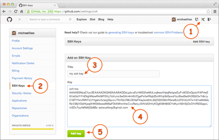
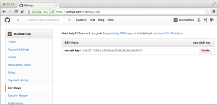

**Git****简单使用**

git config --global user.name "Your Name"

git config --global user.email "email@example.com"

系统出现如下错误：warning: LF will be replaced by CRLF解决

git config --gobal core.autocrlf false 

 

github上创建一个空的resposity

进入你所要创建的文件目录中

git init

 

//添加所有文件

git add README.md

 

//提交所有文件

git commit -m "first commit"

 

//关联远程版本库

git remote add origin git@github.com:2499603447/Kinect_V2_handGesture.git

 

//将本地库和远程版本库同步

git push -u origin master

 

ssh key的创建：

ssh-keygen -t rsa -C "youremail@example.com"

你需要把邮件地址换成你自己的邮件地址，然后一路回车，使用默认值即可，由于这个Key也不是用于军事目的，所以也无需设置密码。

如果一切顺利的话，可以在用户主目录里找到.ssh目录，里面有id_rsa和id_rsa.pub两个文件，这两个就是SSH Key的秘钥对，id_rsa是私钥，不能泄露出去，id_rsa.pub是公钥，可以放心地告诉任何人。

 

第2步：登陆GitHub，打开“Account settings”，“SSH Keys”页面：

 

然后，点“Add SSH Key”，填上任意Title，在Key文本框里粘贴id_rsa.pub文件的内容：

 

# 撤销上次commit

git reset --soft HEAD^

git reset --soft HEAD~1(~2)

# 撤销上次add

**git add 添加 多余文件** 
这样的错误是由于， 有的时候 可能

git add . （空格+ 点） 表示当前目录所有文件，不小心就会提交其他文件

git add 如果添加了错误的文件的话

撤销操作

git status 先看一下add 中的文件 
git reset HEAD 如果后面什么都不跟的话 就是上一次add 里面的全部撤销了 
git reset HEAD XXX/XXX/XXX.java 就是对某个文件进行撤销了