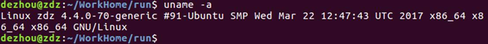
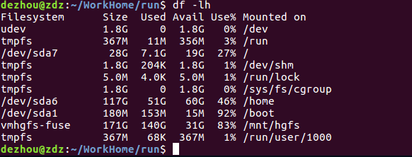

# **1.Terminal error:**

**1).Like sudo apt-get update****：Could not get lock /var/lib/apt/lists/lock**

method1:

$>sudo rm /var/cache/apt/archives/lock

$>sudo rm /var/lib/dpkg/lock

method2:

$>ps -aux 

list prosesses。Find which PID contains apt-get or wget，

$>sudo kill PID

 

**2).Gedit Chinese messy code**

Download dconf-editor: sudo apt-get install dconf-editor, 

Check the key：/org/gnome/gedit/preferences/encodings：auto-detected/ candidate-encodings

gsettings set org.gnome.gedit.preferences.encodings auto-detected "['GB18030', 'GB2312', 'GBK', 'UTF-8', 'BIG5', 'CURRENT', 'UTF-16']"

gsettings set org.gnome.gedit.preferences.encodings shown-in-menu "['GB18030', 'GB2312', 'GBK', 'UTF-8', 'BIG5', 'CURRENT', 'UTF-16']"

**ubunut16.04 different from ubuntu12.04**

gsettings set org.gnome.gedit.preferences.encodings candidate-encodings "['GB18030', 'GB2312', 'GBK', 'UTF-8', 'BIG5', 'CURRENT', 'UTF-16']"

gsettings set org.gnome.gedit.preferences.encodings shown-in-menu "['GB18030', 'GB2312', 'GBK', 'UTF-8', 'BIG5', 'CURRENT', 'UTF-16']"

# **2.The volume “boot” has only 3.9MB disk space remaining.**

**1).$>dpkg --get-selections |grep linux-image**

**check installed linux kernel image**

**2). $>uname -a**

**check which image you current using**

**3).$> sudo apt-get purge linux-image-4.4.0-21-generic**

**unistall linux-image-4.4.0-21-generic**

**4). $>dpkg --get-selections |grep linux-image **

**check current image status**

**5). $>df -lh **

**show disk status**

# **3. Grub error: no such partition**

Input “**set**”, click Enter, terminal window will show message as below:

cmdpath=(hd0) 

prefix=(hd0,msdos8)/boot/grub 

root=hd0,msdox8

Now, we need to find which block the Ubuntu installed,

**Firstly:**

**$>ls (hd0,msdosX)/grub 或者 ls (hd0,msdosX)/boot/grub** 

X:represent number, such as 1,2,3...

If there are lots of message such as: ... XXX.txt ..., remember the block number, for example:the block number is 4

**Secondly:**

**$>set root=(hd0,msdos4)**

**$>set prefix=(hd0,msdos4)/grub**

and then input “**set**”, it will show:

cmdpath=(hd0)

prefix=(hd0,msdos4)/grub

root=hd0,msdos4

**Thirdly:**

**$>insmod normal or insmod /grub/normal.mod**

then input **“normal”**, the system will restart immediately.

 