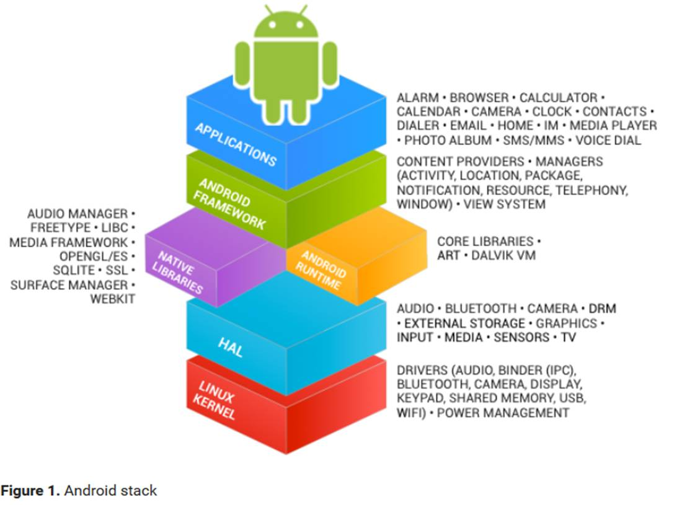
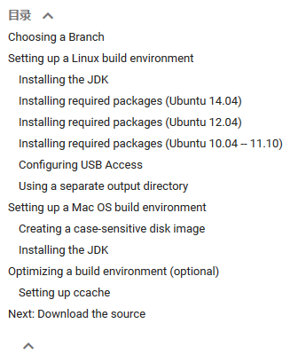

**Android Open Source Project**

**知识：**

Java 

熟练的android app开发 

Linux

Android基于Linux的, 并且AOSP的推荐编译环境是Ubuntu 12.04. 所以熟练的使用并了解Linux这个系统是必不可少的. 如果你想了解偏底层的代码, 那么必需了解基本的Linux环境下的程序开发. 如果再深入到驱动层, 那么Kernel相关的知识也要具备.

Make

AOSP使用Make系统进行编译. 了解基本的Makefile编写会让你更清晰了解AOSP这个庞大的项目是如何构建起来的.

Git

C++

Android系统的一些性能敏感模块及第三方库是用C++实现的, 比如: Input系统, Chromium项目(WebView的底层实现).

**软件：**

Ubuntu12.04

Oracle java1.6，不要安装openjdk，这是个坑，虽然官方文档这么写

Eclipse，但是推荐android studio

**巨人的肩膀：**

AOSP项目官方：https://source.android.com/source/

**这个一定要先读**. 项目介绍, 代码下载, 环境搭建, 刷机方法, Eclipse配置都在这里. 这是一切的基础.

Android官方Training：https://developer.android.com/training/index.html

这个其实是给App开发者看的. 但是里面也有不少关于系统机制的介绍, 值得细读.

老罗的Android之旅: http://blog.csdn.net/luoshengyang

 此老罗非彼老罗. 罗升阳老师的博客非常有营养, 基本可以作为指引你开始阅读AOSP源码的教程. 你可以按照博客的时间顺序一篇篇挑需要的看.但这个系列的博客有些问题: 

早期的博客是基于旧版本的Android; 大量的代码流程追踪. 读文章时你一定要清楚你在看的东西在整个系统处于什么样的位置.

Innost的专栏: http://blog.csdn.net/innost

邓凡平老师也是为Android大牛, 博客同样很有营养. 但是不像罗升阳老师的那么系统. 更多的是一些技术点的深入探讨.

Android Issues: https://source.android.com/source/report-bugs

Android官方Issue列表. 我在开发过程中发现过一些奇怪的bug, 最后发现这里基本都有记录. 当然你可以提一些新的, 有没有人改就是另外一回事了.

**其它：**

代码组织：AOSP的编译单元不是和git项目一一对应的, 而是和Android.mk文件一一对应的. 善用mmm命令进行模块编译将节省你大量的时间.

Binder：这是Android最基础的进程间通讯. 在Application和System services之间大量使用. 你不仅要知道AIDL如何使用, 也要知道如何手写Binder接口. 这对你理解Android的Application和System services如何交互有非常重要的作用. Binder如何实现的倒不必着急看.

HAL：除非你对硬件特别感兴趣或者想去方案公司上班, 否则别花太多时间在这一层

CyanogenMod：这是一个基于AOSP的第三方Rom. 从这个项目的wiki里你能学到很多AOSP官方没有告诉你的东西. 比如如何支持Nexus以外的设备.

DIA：这是一个Linux下画UML的工具, 能够帮你梳理看过的代码.

XDA：https://www.xda-developers.com/

这里有最新资讯和最有趣的论坛.

**Source****：**

Getting Started

\1.   大体介绍:



 

**Establishing a Build Environment**



### Installing the JDK

$ sudo apt-get update

$ sudo apt-get install openjdk-8-jdk

### Installing required packages (Ubuntu 14.04)

```
$ sudo apt-get install git-core gnupg flex bison gperf build-essential zip curl zlib1g-dev gcc-multilib g++-multilib libc6-dev-i386 lib32ncurses5-dev x11proto-core-dev libx11-dev lib32z-dev ccache libgl1-mesa-dev libxml2-utils xsltproc unzip
```

Ubuntu16.04 环境配置：

```
sudo apt-get install libx11-dev:i386 libreadline6-dev:i386 libgl1-mesa-dev g++-multilib 
sudo apt-get install -y git flex bison gperf build-essential libncurses5-dev:i386 
sudo apt-get install tofrodos python-markdown libxml2-utils xsltproc zlib1g-dev:i386 
sudo apt-get install dpkg-dev libsdl1.2-dev libesd0-dev
sudo apt-get install git-core gnupg flex bison gperf build-essential  
sudo apt-get install zip curl zlib1g-dev gcc-multilib g++-multilib 
sudo apt-get install libc6-dev-i386 
sudo apt-get install lib32ncurses5-dev x11proto-core-dev libx11-dev 
sudo apt-get install libgl1-mesa-dev libxml2-utils xsltproc unzip m4
sudo apt-get install lib32z-dev ccache
```

 

Ubuntu16.04编译android内核出现错误：

prebuilts/gcc/linux-x86/host/x86_64-linux-glibc2.15 4.8/sysroot/usr/include/wchar.h:40:11: fatal error: 'stdarg.h' file not found # include <stdarg.h>