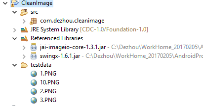
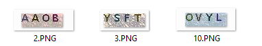
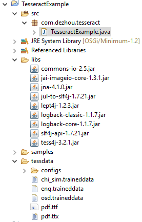
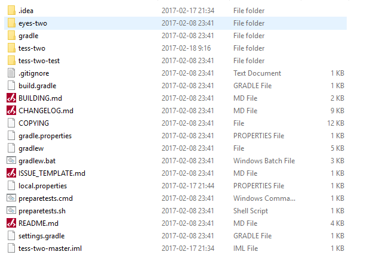
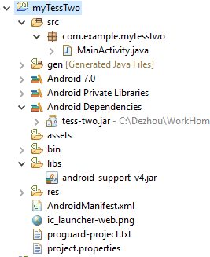
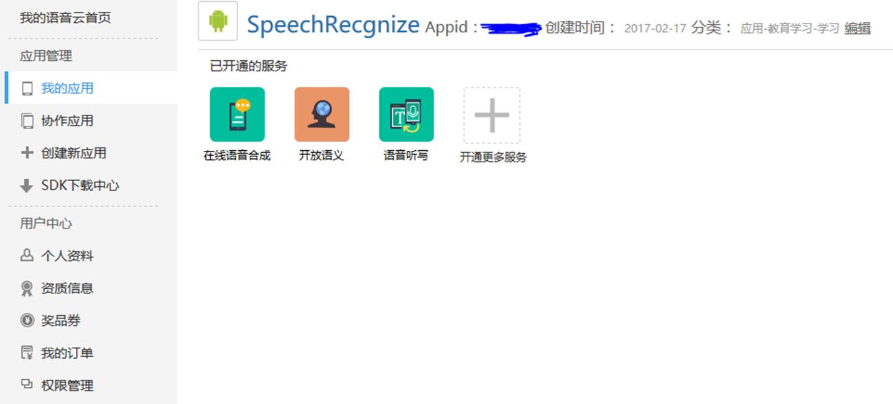
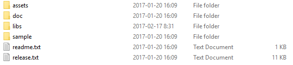
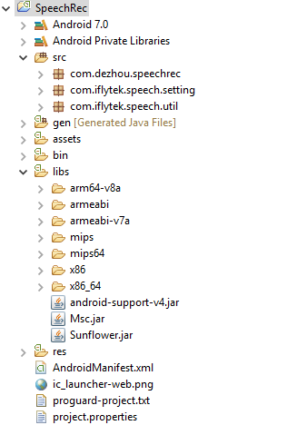

资料整理

**一．**     **Java****字符识别**

**1.Java****查找字符串中的特定的字符，下面示例中文字符的查找：**

**import** java.util.regex.Matcher;

**import** java.util.regex.Pattern;

 

**public** **class** test {

  **public** **static** **void** main(String[] args) {

   String regEx = "[\\u4E00-\\u9FA5\\uF900-\\uFA2D]";

   String str = "我的邮箱帐号：12345678@163.com,张三wechat帐号：1234567";

 

   Pattern pattern = Pattern.*compile*(regEx);

 

   Matcher m = pattern.matcher(str);

   **while** (m.find()) {

 

​     System.***out\***.println(m.group());

   }

  }

}

 

**2.****图像消噪**

将色彩繁杂的图像处理成单一的黑白图像，去除干扰

导入jai-imageio-core-1.3.1.jar和swingx-1.6.1.jar到工程中

工程目录：

 

执行前：

 

执行后：

**package** com.dezhou.cleanimage;

 

**import** java.awt.Color;

**import** java.awt.image.BufferedImage;

**import** java.io.File;

**import** java.io.IOException;

 

**import** javax.imageio.ImageIO;

 

**public** **class** ClearImageHelper {

 

  **public** **static** **void** main(String[] args) **throws** IOException {

   /*

​    \* try {

​    \* 

​    \* File testDataDir = new File("testdata");

​    \* System.out.println(testDataDir.listFiles().length); int i = 0 ;

​    \* for(File file :testDataDir.listFiles()) { i++ ; //String

​    \* recognizeText = new OCRHelper().recognizeText(file, "jpg"); String

​    \* recognizeText = new OCRHelper().recognizeText(file, "PNG");

​    \* System.out.print(recognizeText+"\t");

​    \* 

​     \* if( i % 5 == 0 ) { System.out.println(); } }

​    \* 

​    \* } catch (Exception e) { e.printStackTrace(); }

​    */

 

   File testDataDir = **new** File("testdata");

   **final** String destDir = testDataDir.getAbsolutePath() + "/tmp";

   // System.out.println(destDir);

 

   **for** (File file : testDataDir.listFiles()) {

​     *cleanImage*(file, destDir);

   }

 

  }

 

  /**

   \* 

   \* **@param** sfile

   \*      需要去噪的图像

   \* **@param** destDir

   \*      去噪后的图像保存地址

   \* **@throws** IOException

   */

  **public** **static** **void** cleanImage(File sfile, String destDir) **throws** IOException {

   File destF = **new** File(destDir);

   **if** (!destF.exists()) {

​     destF.mkdirs();

   }

 

   BufferedImage bufferedImage = ImageIO.*read*(sfile);

   **int** h = bufferedImage.getHeight();

   **int** w = bufferedImage.getWidth();

 

   // 灰度化

   **int**[][] gray = **new** **int**[w][h];

   **for** (**int** x = 0; x < w; x++) {

​     **for** (**int** y = 0; y < h; y++) {

​      **int** argb = bufferedImage.getRGB(x, y);

​      // 图像加亮（调整亮度识别率非常高）

​      **int** r = (**int**) (((argb >> 16) & 0xFF) * 1.1 + 30);

​      **int** g = (**int**) (((argb >> 8) & 0xFF) * 1.1 + 30);

​      **int** b = (**int**) (((argb >> 0) & 0xFF) * 1.1 + 30);

​      **if** (r >= 255) {

​        r = 255;

​      }

​      **if** (g >= 255) {

​        g = 255;

​      }

​      **if** (b >= 255) {

​        b = 255;

​      }

​      gray[x][y] = (**int**) Math.*pow*(

​          (Math.*pow*(r, 2.2) * 0.2973 + Math.*pow*(g, 2.2) * 0.6274 + Math.*pow*(b, 2.2) * 0.0753), 1 / 2.2);

​     }

   }

 

   // 二值化

   **int** threshold = *ostu*(gray, w, h);

   BufferedImage binaryBufferedImage = **new** BufferedImage(w, h, BufferedImage.***TYPE_BYTE_BINARY\***);

   **for** (**int** x = 0; x < w; x++) {

​     **for** (**int** y = 0; y < h; y++) {

​      **if** (gray[x][y] > threshold) {

​        gray[x][y] |= 0x00FFFF;

​      } **else** {

​        gray[x][y] &= 0xFF0000;

​      }

​       binaryBufferedImage.setRGB(x, y, gray[x][y]);

​     }

   }

   

​     // 矩阵打印

​     **for** (**int** y = 0; y < h; y++) {

​      **for** (**int** x = 0; x < w; x++) {

​        **if** (*isBlack*(binaryBufferedImage.getRGB(x, y))) {

​          System.***out\***.print("*");

​        } **else** {

​          System.***out\***.print(" ");

​        }

​      }

​      System.***out\***.println();

   }

 

   ImageIO.*write*(binaryBufferedImage, "jpg", **new** File(destDir, sfile.getName()));

  }

 

  **public** **static** **boolean** isBlack(**int** colorInt) {

   Color color = **new** Color(colorInt);

   **if** (color.getRed() + color.getGreen() + color.getBlue() <= 300) {

​     **return** **true**;

   }

   **return** **false**;

  }

 

  **public** **static** **boolean** isWhite(**int** colorInt) {

   Color color = **new** Color(colorInt);

   **if** (color.getRed() + color.getGreen() + color.getBlue() > 300) {

​     **return** **true**;

   }

   **return** **false**;

  }

 

  **public** **static** **int** isBlackOrWhite(**int** colorInt) {

   **if** (*getColorBright*(colorInt) < 30 || *getColorBright*(colorInt) > 730) {

​     **return** 1;

   }

   **return** 0;

  }

 

  **public** **static** **int** getColorBright(**int** colorInt) {

   Color color = **new** Color(colorInt);

   **return** color.getRed() + color.getGreen() + color.getBlue();

  }

 

  **public** **static** **int** ostu(**int**[][] gray, **int** w, **int** h) {

   **int**[] histData = **new** **int**[w * h];

   // Calculate histogram

   **for** (**int** x = 0; x < w; x++) {

​     **for** (**int** y = 0; y < h; y++) {

​      **int** red = 0xFF & gray[x][y];

​      histData[red]++;

​     }

   }

 

   // Total number of pixels

   **int** total = w * h;

 

   **float** sum = 0;

   **for** (**int** t = 0; t < 256; t++)

​     sum += t * histData[t];

 

   **float** sumB = 0;

   **int** wB = 0;

   **int** wF = 0;

 

   **float** varMax = 0;

   **int** threshold = 0;

 

   **for** (**int** t = 0; t < 256; t++) {

​     wB += histData[t]; // Weight Background

​     **if** (wB == 0)

​      **continue**;

 

​     wF = total - wB; // Weight Foreground

​     **if** (wF == 0)

​      **break**;

 

​     sumB += (**float**) (t * histData[t]);

 

​     **float** mB = sumB / wB; // Mean Background

​     **float** mF = (sum - sumB) / wF; // Mean Foreground

 

​     // Calculate Between Class Variance

​     **float** varBetween = (**float**) wB * (**float**) wF * (mB - mF) * (mB - mF);

 

​     // Check if new maximum found

​     **if** (varBetween > varMax) {

​      varMax = varBetween;

​      threshold = t;

​     }

   }

 

   **return** threshold;

  }

}

**3.****调用Google API，tess4j（tesseract for java），实现字符识别：**

Tesseract是Ray Smith于1985到1995年间在惠普布里斯托实验室开发的一个OCR引擎，曾经在1995 UNLV精确度[**测试**](http://lib.csdn.net/base/softwaretest)中名列前茅。但1996年后基本停止了开发。2006年，Google邀请Smith加盟，重启该项目。目前项目的许可证是Apache 2.0。该项目目前支持Windows、[**Linux**](http://lib.csdn.net/base/linux)和Mac OS等主流平台。但作为一个引擎，它只提供命令行工具。

现阶段的Tesseract由Google负责维护，是最好的开源OCR Engine之一，并且支持中文。

主页地址：https://github.com/tesseract-ocr

tesseract源码下载地址：https://github.com/tesseract-ocr/tesseract

tessdata下载地址：https://github.com/tesseract-ocr/tessdata

tess4j示例代码下载地址：https://github.com/nguyenq/tess4j

需要引入一大堆库，如下面的工程结构所示：

samples目录中存放的是测试图片,tessdata中存放的是训练数据

以下是我的使用示例代码：

**package** com.dezhou.tesseract;

 

**import** java.io.File;

**import** net.sourceforge.tess4j.*; 

**public** **class** TesseractExample

{

  **public** **static** **void** main(String[] args)

  {

   // System.setProperty("jna.library.path", "32".equals(System.getProperty("sun.arch.data.model")) ? "lib/win32-x86" : "lib/win32-x86-64");

 

​    File imageFile = **new** File("samples/chinesedezhou.bmp");

​    //ITesseract instance = new Tesseract(); // JNA Interface Mapping

​     ITesseract instance = **new** Tesseract(); // JNA Direct Mapping

​     //File tessDataFolder = LoadLibs.extractTessResources("tessdata"); // Maven build bundles English data

​     //System.out.println(tessDataFolder);

​     //instance.setDatapath(tessDataFolder.getParent());

 

​    **try** {

​      

​     instance.setLanguage("chi_sim");

​      String result = instance.doOCR(imageFile);

​      System.***out\***.println(result.replaceAll(" ", ""));

​      System.***out\***.println(result.replaceAll(" ", "").replaceAll("\n", ""));

​    } **catch** (TesseractException e) {

​      System.***err\***.println(e.getMessage());

​    }

   

  }

}

**二．**     **Android****字符识别**

主要是在上面介绍的tesserct基础上的一个分支tess-two

因为Tesseract使用C++实现的，在**Android**中不能直接使用，需要封装JavaAPI才能在Android平台中进行调用，这里我们直接使用TessTwo项目，tess-two是TesseraToolsForAndroid的一个**Git**分支，使用简单，集成了leptonica，在使用之前需要先从git上下载源码进行编译。

Tess-two地址：https://github.com/rmtheis/tess-two

1.编译工具：android-ndk-r10d，ant

下载tess-two源码并解压，文件目录大智如图所示：

下载android-ndk-r10d，双击运行，等待完成后配置ndk的环境变量

下载apache-ant，解压安装后配置其环境变量

打开windows终端命令控制台，进入tess-two-master下的tess-two目录：

cd <project-directory>/tess-two

ndk-build

android update project --path .

ant release

执行结束后会生成一个libs目录

2.

(1)首先用eclipse(配置好了android环境)导入tess-two工程

(2)然后创建你的android工程：

例如：myTessTwo,右键工程名->Build Path->Configure buildpath,

(3)选择Android->Library中点击Add添加tess-two工程，点击应用

(4)选择Java Build Path的Project选项卡，点击Add，点击应用

工程结构大致如图所示：

识别程序如下：直接调用此方法即可(可根据自己需求修改)

/**

   \* 传入的参数为Bitmap对象

   \* **@param** bitmap

 */

**private** **void** RecognizeProgram(**final** Bitmap bitmap) {

   **new** Thread() {

​     @Override

​     **public** **void** run() {

 

​      TessBaseAPI baseApi = **new** TessBaseAPI();

​       baseApi.setDebug(**true**);

​      System.***out\***.println("处理数据前");

​      // 使用默认语言初始化BaseApi、

 

​      baseApi.init(TessConstantConfig.***TESSBASE_PATH\***, TessConstantConfig.***DEFAULT_LANGUAGE_CHI\***);

 

​       baseApi.setImage(bitmap);

​      // baseApi.setImage(BitmapEx.getPicFromFile("/mnt/sdcard/samples/test4.PNG",

​      // null));

 

​      // 获取返回值

​      String recognizedText = baseApi.getUTF8Text();

​      String resultHandled = recognizedText.replaceAll(" ", "").replaceAll("\n", "");

​      baseApi.end();

​      System.***out\***.println("处理数据后");

​      System.***out\***.println(resultHandled);

​     }

   }.start();

}

其中一些定义的常数如下：可根据自己的情况修改

**public** **class** TessConstantConfig {

 

​    **public** **static** **final** String ***TESSBASE_PATH\*** = "/sdcard/";

 

​    **public** **static** **final** String ***DEFAULT_LANGUAGE_ENG\*** = "eng";

 

​    **public** **static** **final** String ***DEFAULT_LANGUAGE_CHI\*** = "chi_sim";

 

}

三．Android语音识别

讯飞API，谷歌API，百度API。下面主要介绍讯飞API的调用实现语音识别：

登录讯飞开放平台：http://www.xfyun.cn/

点击我的应用按照提示一步步来，最终会出现如下界面：

然后到SDK下载中心，下载对应的SDK开发包，我下载的是语音包，解压后目录结构如下：

将对应的文件拷贝到你的工程中，工程结构大致如图所示：

同时AndroidManifest.xml文件中要配置相应权限，（由于自身项目需要，将所有权限一并加上）：

<uses-permission android:name=*"android.permission.WRITE_EXTERNAL_STORAGE"* />

  <uses-permission android:name=*"android.permission.MOUNT_UNMOUNT_FILESYSTEMS"* />

  <uses-permission android:name=*"android.permission.INTERNET"* />

  <uses-permission android:name=*"android.permission.RECORD_AUDIO"* />

  <uses-permission android:name=*"android.permission.ACCESS_NETWORK_STATE"* />

  <uses-permission android:name=*"android.permission.ACCESS_WIFI_STATE"* />

  <uses-permission android:name=*"android.permission.CHANGE_NETWORK_STATE"* />

  <uses-permission android:name=*"android.permission.READ_PHONE_STATE"* />

  <uses-permission android:name=*"android.permission.ACCESS_FINE_LOCATION"* />

  <uses-permission android:name=*"android.permission.READ_CONTACTS"* />

  <uses-permission android:name=*"android.permission.WRITE_EXTERNAL_STORAGE"* />

  <uses-permission android:name=*"android.permission.WRITE_SETTINGS"* />

 <uses-permission android:name=*"android.permission.READ_EXTERNAL_STORAGE"* />

 

由于代码量较大，这里就不贴了，大家可以看解压包中的Demo代码，里面有具体的实现。

四．     Android子线程更新UI

Android主线程中不允许做大量的耗时操作，因此复杂的处理放在子线程中进行处理，处理的同时避免不了要对UI进行操作，下面介绍三种方式：

 

Message：消息，其中包含了消息ID，消息处理对象以及处理的数据等，由MessageQueue统一列队，终由Handler处理。 

Handler：处理者，负责Message的发送及处理。使用Handler时，需要实现handleMessage(Message msg)方法来对特定的Message进行处理，例如更新UI等。 

MessageQueue：消息队列，用来存放Handler发送过来的消息，并按照FIFO规则执行。当然，存放Message并非实际意义的保存，而是将Message以链表的方式串联起来的，等待Looper的抽取。 

Looper：消息泵，不断地从MessageQueue中抽取Message执行。因此，一个MessageQueue需要一个Looper。 

Thread：线程，负责调度整个消息循环，即消息循环的执行场所。

**方法****1.Handler**

主线程中定义Handler

mHandler = **new** Handler() {

 

​     @Override

​     **public** **void** handleMessage(Message msg) {

​       **super**.handleMessage(msg);

​      **switch** (msg.what) {

​      **case** 0:

​        // 完成主界面更新,拿到数据

​        String data = (String) msg.obj;

​        editTextSymbol.setText(data);

​        **break**;

​      **default**:

​        **break**;

​      }

​     }

  };

子线程中发消息，通知Handler更新UI

**public** **void** updateUI1(View v) {

 

   **new** Thread(**new** Runnable() {

 

​     @Override

​     **public** **void** run() {

​      // 耗时操作，完成之后发送消息给Handler，完成UI更新；

​       mHandler.sendEmptyMessage(0);

 

​      // 需要数据传递，用下面方法；

​      Message msg = **new** Message();

​      msg.obj = "第一种更新方式";// 可以是基本类型，可以是对象，可以是List、map等；

​       mHandler.sendMessage(msg);

​     }

 

   }).start();

 }

方法一的Handler对象必须定义在主线程中，如果是多个类直接互相调用，就不是很方便，需要传递content对象或通过接口调用；

方法2. **用Activity对象的runOnUiThread方法更新** 

在子线程中通过runOnUiThread()方法更新UI：

**public** **void** updateUI2(View v) {

   **new** Thread() {

​     **public** **void** run() {

​      // 这儿是耗时操作，完成之后更新UI；

​      runOnUiThread(**new** Runnable() {

 

​        @Override

​        **public** **void** run() {

​          // 更新UI

​         imageView.setImageBitmap(BitmapEx.*getPicFromFile*("/mnt/sdcard/samples/eurotext.bmp", **null**));

​        }

 

​      });

​     }

   }.start();

 }

如果在非上下文类中（Activity），可以通过传递上下文实现调用；

Activity activity = (Activity) imageView.getContext(); 

​    activity.runOnUiThread(**new** Runnable() { 

 

​      @Override 

​      **public** **void** run() { 

​        imageView.setImageBitmap(bitmap); 

​      } 

});

 

**方法三：View.post(Runnable r)**

**public** **void** updateUI3(View v) {

   **new** Thread() {

​     **public** **void** run() {

 

​      imageView.post(**new** Runnable() {

 

​        @Override

​        **public** **void** run() {

​         imageView.setImageBitmap(BitmapEx.*getPicFromFile*("/mnt/sdcard/samples/test4.PNG", **null**));

​        }

 

​      });

​     }

   }.start();

}