http://www.imageprocessingplace.com/downloads_V3/root_downloads/tutorials/contour_tracing_Abeer_George_Ghuneim/intro.html

**Introduction****：**

什么是轮廓跟踪？

也称为边界跟随或边界跟随; 轮廓跟踪是应用于数字图像以便提取其边界的技术。 结果，产生了一个重要的问题：什么是给定数字图像的“边界”？

为了回答这个问题，我们首先要定义一个数字图像。 数字图像是方块镶嵌上的每个都具有特定值的一组像素。 在这个网站，我们将处理双层图像，即每个像素可以有2个可能的值之一，即：

1，在这种情况下，我们将它视为一个“黑色”像素，它将是模式的一部分，OR

0，在这种情况下，我们将它视为一个“白色”像素，它将是背景的一部分。

 

现在我们来到我们原来的问题：什么是给定模式的“边界”？

给定图案P i的边界是P的边界像素的集合。

由于我们使用正方形细分，有2种边界（或边界）像素：4边界像素和8边界像素。

如果黑色像素与至少一个白色像素共享边缘，则该黑色像素被认为是4边界像素。 另一方面，如果黑色像素与至少一个白色像素共享边缘或顶点，则黑色像素被认为是8边界像素。

（4边界像素也是8边界像素，8边界像素可以是或可以不是4边界像素）

 

值得一提的是，仅仅识别模式的边界像素以提取其轮廓是不够的。 我们需要的是边界像素的有序序列，从中我们可以提取图案的一般形状。

 

为什么我们要提取给定模式的轮廓？

轮廓跟踪是对数字图像执行的许多预处理技术之一，以便提取关于它们的一般形状的信息。 一旦给定图案的轮廓被提取，其不同的特性将被检查并且用作稍后将在图案分类中使用的特征。 因此，正确提取轮廓将产生更精确的特征，这将增加正确分类给定模式的机会。

 

但你可能会想：为什么浪费宝贵的计算时间首先提取模式的轮廓，然后收集其特征？ 为什么不直接从模式收集功能？

那么，轮廓像素通常是表示图案的像素的总数的小子集。 因此，当我们对轮廓而不是整个模式运行特征提取算法时，计算量大大减少。 由于轮廓与原始图案共享许多特征，因此当在轮廓上而不是在原始图案上执行时，特征提取处理变得更加有效。

 

**Defining Connectivity**

Introduction:

在二进制值数字成像中，当像素是图案的一部分时，像素可以具有值1，或者当像素是背景的一部分时，即不存在灰度级时，像素可以具有值。 （我们假设值为1的像素为黑色，而零值像素为白色）。

为了识别数字模式中的对象，我们需要定位彼此“连接”的黑色像素组。 换句话说，给定数字模式中的对象是该模式的连接分量。

通常，连通分量是一组黑色像素P，使得对于P中的每对像素p i和p j，存在像素p i，...，p j的序列，使得：

a）序列中的所有像素在集合P中，即，是黑色的

b）在序列中相邻的每2个像素是“邻居”

结果，一个重要的问题出现：我们什么时候可以说2个像素是“邻居”？

由于我们使用正方形像素，上一个问题的答案不是微不足道。 其原因是：在正方形细分中，像素共享边缘，顶点或两者。 共有8个像素与任何给定像素共享边缘或顶点; 这些像素组成该像素的Moore邻域。 我们应该考虑只有一个公共顶点的像素为“邻居”吗？ 或者应该有2个像素有共同的边缘，以便他们被认为是“邻居”？

这产生了两种类型的连接，即：4连接和8连接。

 

4连接

我们什么时候可以说一组给定的黑色像素是4连接的？

首先，我们必须定义4邻居（也称为直接邻居）的概念：

4邻居的定义：

如果Q和P共享一个边缘，则像素Q是给定像素P的4相邻像素。

像素P的4个相邻像素（即像素P2，P4，P6和P8）在下面的图2中示出。

 

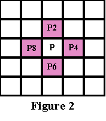

4连接组件的定义：

一组黑色像素P是4连通分量，如果对于P中的每对像素p i和p j，存在像素p 1，...，p j的序列，使得：

a）序列中的所有像素在集合P中，即，是黑色的

b）在序列中相邻的每2个像素是4个相邻像素

4连接模式的示例：

以下图表是4连接的模式示例：

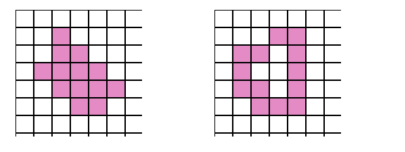

8连接

我们什么时候可以说一组给定的黑色像素是8连接的？

首先，我们必须定义8邻居（也称为间接邻居）的概念：

8邻居的定义：

如果Q和P共享边缘或顶点，则像素Q是给定像素P的8相邻像素（或简称为相邻像素）。

给定像素P的8个邻居构成该像素的Moore邻域。

8连接组件的定义：

如果对于P中的每对像素p 1和p 1，存在像素p 1，...，p j的序列，则一组黑色像素P

8连接分量（或简称为连通分量），使得：

a）序列中的所有像素在集合P中，即，是黑色的

b）在序列中相邻的每2个像素是8个相邻像素

注意

所有4连接的模式是8连接的，即4连接的模式是8连接的模式的集合的子集。

另一方面，8连接的模式可以不是4连接。

8连接模式示例：

下图是8连接但不是4连接的模式示例：

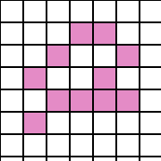

 

不是8连接的模式示例：

下图是不是8连接的模式的示例，即由多个连接的组件组成（下图中有3个连接的组件）：

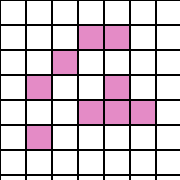

 

**Contour Tracing Algorithms**

接下来是四个最常见的轮廓跟踪算法。前两者，即：方形跟踪算法和摩尔相邻跟踪容易实现，因此频繁地用于跟踪给定模式的轮廓。不幸的是，这两种算法都有一些弱点，导致它们由于其特殊的连接性而无法跟踪大类模式的轮廓。

以下算法将忽略模式中存在的任何“孔”。例如，如果给定如下图1的模式，由算法跟踪的轮廓将类似于图2中所示的轮廓（蓝色像素表示轮廓）。这在一些应用中可以是可接受的，但是在其它应用中，例如字符识别，我们也希望追踪图案的内部以捕获识别特定字符的任何孔。 （下面的图3显示了图案的“完整”轮廓）

因此，应该使用“孔搜索”算法首先提取给定模式中的孔，然后对每个孔应用轮廓跟踪算法以提取完整的轮廓。

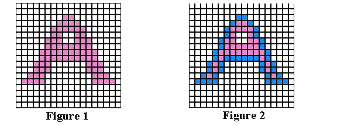

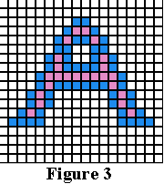

**Square Tracing Algorithm**

**Idea:**

方形跟踪算法背后的想法非常简单;这可能归因于该算法是提取二进制模式的轮廓的第一次尝试之一的事实。

要了解它是如何工作的，你需要一点想象力...

给定数字模式，即一组黑色像素，在白色像素的背景上，即网格;找到一个黑色像素，并将其声明为您的“开始”像素。 （可以以多种方式来定位“开始”像素;我们将从网格的左下角开始，从底部向上逐个扫描每一列像素，从最左边的列开始向右移动 - 直到我们遇到黑色像素，我们将该像素声明为我们的“开始”像素。）

现在，假设你是一个bug（瓢虫）站在起始像素，如下面的图1。为了提取图案的轮廓，您必须执行以下操作：

每次你发现自己站在一个黑色像素，左转，和

每次你发现自己站在一个白色的像素，右转，

直到再次遇到开始像素。

你走过的黑色像素将是图案的轮廓。

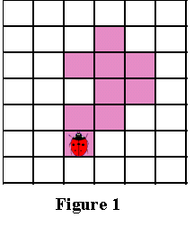

在方形跟踪算法中重要的是“方向感”。 你所做的左右转动与你当前的位置有关，这取决于你输入你所处的像素的方式。 因此，重要的是跟踪您当前的方向，以使正确的动作。

**Algorithm:**

以下是方形跟踪算法的形式描述：

输入：正方形细分，T，包含黑色单元的连通分量P.

输出：边界象素即轮廓的序列B（b1，b2，...，bk）。

 

Begin 

Set B to be empty.

From bottom to top and left to right scan the cells of T until a black pixel, s, of P is found.

Insert s in B.

Set the current pixel, p, to be the starting pixel, s.

Turn left i.e. visit the left adjacent pixel of p.

Update p i.e. set it to be the current pixel.

While p not equal to s do

 

​       If the current pixel p is black 

insert p in B and turn left (visit the left adjacent pixel of p).

Update p i.e. set it to be the current pixel.

​       else 

turn right (visit the right adjacent pixel of p).

Update p i.e. set it to be the current pixel.

end While

End 

注意：在上述算法中左和右的概念不是相对于页面或读者解释的，而是相对于在执行扫描期间进入“当前”像素的方向。

 

**Demonstration**

下面是一个动画演示如何方形跟踪算法继续跟踪给定模式的轮廓。 记住，你是一个Bug

（瓢虫）走过像素; 注意你的方向如何向左或向右转变。 根据您在像素上的当前定位，即当前方向，进行左右转弯。

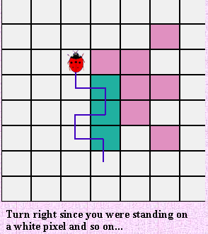

**Analysis**

事实证明，方形跟踪算法的性能非常有限。 换句话说，它不能提取在现实生活中经常出现的大家族模式的轮廓。

这主要归因于左和右转，这倾向于错过相对于给定像素“对角地”位于的像素。

我们将检查不同连接的不同模式，并了解为什么方形跟踪算法失败。 此外，我们将研究如何提高算法的性能，并使其至少适用于具有特殊类型连接的模式。

 

**停止标准**

方形跟踪算法的一个弱点在于停止标准的选择。 换句话说，算法何时终止？

在方形跟踪算法的原始描述中，停止标准第二次访问开始像素。 结果是，如果算法取决于该标准，则该算法将不能对大量模式进行轮廓描绘。

接下来是一个动画演示，说明正方形跟踪算法如何由于停止标准的不良选择而无法提取模式的轮廓：

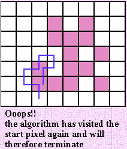

 

如您所见，改进停止标准将是提高方形跟踪算法的整体性能的良好开端。现有停止标准有两种有效的替代方案：

a）在访问开始像素n次后停止，其中n至少为2，或

b）在以第一次输入起始像素相同的方式第二次输入起始像素后停止。该标准由Jacob Eliosoff提出，因此我们将其称为Jacob的停止标准。

改变停止标准通常将提高方形跟踪算法的性能，但不允许它克服它对于特殊类型的连接的模式的其它弱点。

 

 方形跟踪算法无法跟踪未连接的8连接模式族的轮廓

以下是一个动画演示如何方形跟踪算法（使用Jacob的停止标准）无法提取未连接的8连接模式的轮廓：

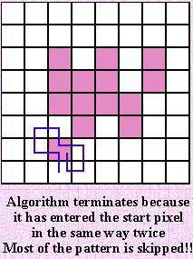

 

**方形跟踪算法是完全无用的吗？**

如果你已经阅读了上面的分析，你必须认为方形跟踪算法无法提取大多数模式的轮廓。 事实证明，存在一个特殊的模式族，它们通过方形跟踪算法完全和正确地跟踪轮廓。

设P是网格上的一组4连接的黑色像素。 使网格的白色像素，即背景像素W也是4连接的。 事实证明，给定这种条件的模式及其背景，我们可以证明方形跟踪算法（使用雅各布的停止标准）将总是成功提取模式的轮廓。

以下是当图案和背景像素都是4连接时的证明，如果我们使用Jacob的停止标准，则正方形跟踪算法将正确地提取图案的轮廓。

 

**证明**

给定：图案P，使得图案像素（即黑色像素）和背景像素（即白色像素W）都是4连接的。

**第一次观察**

由于白色像素组W被假定为4连接，这意味着该图案不能具有任何“孔”。

（非正式地，“空洞”是在给定图案中被黑色像素完全包围的白色像素的组）。

图案中任何“孔”的存在将导致从白色像素的其余部分断开一组白色像素，并且因此使得白色像素的集合不是4连接的。

下面的图2和图3演示了可能出现在4连接模式中的2种“孔”：

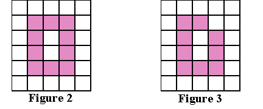

**第二次观察**

模式的任何两个黑色像素必须共享一侧。

假设2个黑色像素只共享一个顶点，那么，为了满足模式的4连通性，应该有一个链接这2个像素的路径，使得该路径中的每2个相邻像素是4连接的。 但这将给我们一个类似于上面图3中的模式。 换句话说，这将导致白色像素变得断开。

下面的图4示出了满足以下假设的典型图案：背景和图案像素是4连接的，即没有“孔”，并且每2个黑色像素共享一侧：

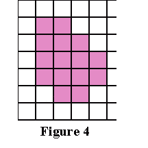

描绘这种模式的有用方法是：

首先，考虑图案的边界像素，即轮廓。 然后，如果我们认为每个边界像素具有每个单位长度的4个边，我们将看到这些边中的一些与相邻的白色像素共享。 我们称这些边缘，即与白色像素，边界边缘共享的边缘。

这些边界边缘可以被视为多边形的边缘。 下面的图5通过显示对应于上面图4中的模式的多边形来演示这个想法：

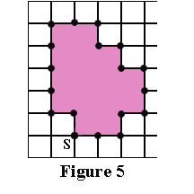

如果我们看看在这种模式中可能出现的边界像素的所有可能的“配置”，我们将看到在图6和图7中显示了2个基本情况。

边界像素可以是这些情况的多个或不同的定位，即这两种情况的旋转。

边界边缘用蓝色标记为E1，E2，E3和E4。

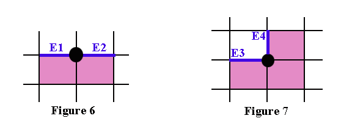

**第三次观察**

对于上述两种情况，无论你选择哪个像素作为起始像素，无论你输入什么方向，正方形跟踪算法都不会“回溯”，不会“经过”边界边缘两次（除非它是跟踪的第二次的边界），永远不会错过边界边缘...试试吧！

2个概念需要澄清：

a）当它在追踪整个边界之前向后去访问已经访问的像素时，算法“回溯”

b）对于每个边界边缘，有2种方式“通过”它，即“in”或“out”（其中“in”表示朝向对应多边形的内部，“out”表示朝向多边形的外部） 。

此外，当平方算法通过边界边缘之一“入”时，它将通过下一个边界边“走出”，即正方形跟踪算法不可能以同样方式经过两个连续的边界。

 

**最终观察**

对于任何给定模式，存在偶数边界边界。

如果你看看上面图5的多边形，你会看到：

如果你想从顶点S开始，在图上标记，并沿着边界边缘，直到你再次到达S;你会看到在过程中会传递一个偶数边界。将每个边界边缘视为给定方向上的“步长”。然后，对于右边的每个“步骤”，如果你想回到原来的位置，应该有一个相应的“步骤”到左边。这同样适用于垂直“步骤”。因此，“步骤”应该是匹配对，这解释了为什么在任何这样的模式中将存在偶数个边界边缘。

 

因此，当正方形跟踪算法第二次进入（起始像素的）起始边界边缘时，它将按照它在第一次进入时的相同方向进行。

其原因是因为有2种方式经过边界边缘，并且由于算法在连续边界边缘的“in”和“out”之间交替，并且由于存在偶数个边界边缘，所以算法将去通过开始边界边缘第二次以与第一次相同的方式。

 

 

结论

给定4连接的模式和背景，正方形跟踪算法将跟踪模式的整个边界，即轮廓，并且将在跟踪边界一次之后停止，即它将不再跟踪它，因为当它到达开始边界边缘一秒时间，它将以与第一次相同的方式输入它。

因此，使用Jacob的停止标准的方形跟踪算法将正确地提取任何模式的轮廓，只要模式和其背景是4连接的。

 

**Moore-Neighbor Tracing**

**Idea：**

Moore-Neighbor跟踪的想法很简单; 但在我们解释它之前，我们需要定义一个重要的概念：一个像素的Moore邻域。

Moore Neighborhood

像素的Moore邻域P是与该像素共享顶点或边缘的8个像素的集合。 这些像素是下面图1所示的像素P1，P2，P3，P4，P5，P6，P7和P8。

摩尔邻域（也称为8邻域或间接邻域）是文献中经常出现的一个重要概念。

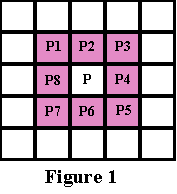

现在我们准备介绍Moore-Neighbor跟踪的想法...

给定数字模式，即一组黑色像素，在白色像素的背景上，即网格;找到一个黑色像素，并将其声明为您的“开始”像素。 （可以以多种方式来定位“开始”像素;我们将从网格的左下角开始，从底部向上逐个扫描每一列像素，从最左边的列开始向右移动 - 直到我们遇到黑色像素，我们将该像素声明为我们的“开始”像素。）

 

现在，假设你是一个bug（瓢虫）站在起始像素，如下面的图2。在不失一般性的情况下，我们将通过以顺时针方向绕过图案来提取轮廓。 （无论你选择哪个方向，只要你坚持你的选择在整个算法）。

一般的想法是：每次你打黑色像素，P，回溯，即回到你以前站在白色像素，然后，沿顺时针方向绕过像素P，访问其摩尔邻域中的每个像素，直到你击中一个黑色像素。该算法在第二次访问开始像素时终止。

你走过的黑色像素将是图案的轮廓。

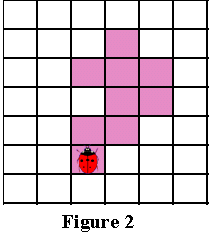

**Algorithm**

以下是对Moore-Neighbor跟踪算法的形式描述：

输入：正方形细分，T，包含黑色单元的连通分量P.

输出：边界象素即轮廓的序列B（b1，b2，...，bk）。

 

将M（a）定义为像素a的Moore邻域。

令p表示当前边界像素。

令c表示考虑中的当前像素，即c在M（p）中。

Begin 

Set B to be empty.

From bottom to top and left to right scan the cells of T until a black pixel, s, of P is found.

Insert s in B.

Set the current boundary point p to s i.e. p=s

Backtrack i.e. move to the pixel from which s was entered.

Set c to be the next clockwise pixel in M(p).

While c not equal to s do

 

​       If c is black 

insert c in B

set p=c

backtrack (move the current pixel c to the pixel from which p was entered)

​       else 

advance the current pixel c to the next clockwise pixel in M(p)

end While

End

 

**Demonstration**

以下是Moore-Neighbor跟踪如何跟踪给定模式的轮廓的动画演示。

（我们决定以顺时针方向跟踪轮廓）。

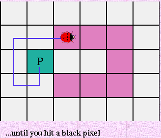

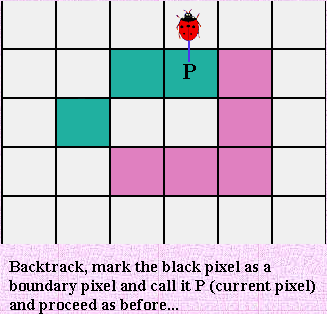

**Analysis**

Moore-Neighbor跟踪的主要弱点在于选择停止标准，换句话说，算法何时终止？

在Moore-Neigbor跟踪中使用的算法的原始描述中，停止标准第二次访问开始像素。 与正方形跟踪算法的情况一样，如果要依赖于该标准，则Moore-Neighbor跟踪将无法对大量模式进行轮廓跟踪。

接下来是一个动画演示，说明Moore-Neighbor跟踪由于停止标准的错误选择而无法提取模式的轮廓：

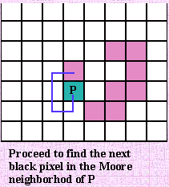

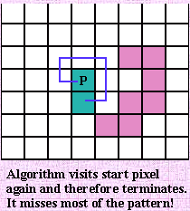

如您所见，改进停止标准将是提高Moore-Neighbor跟踪的整体性能的良好开端。现有停止标准有两种有效的替代方案：

a）在访问开始像素n次后停止，其中n至少为2，OR

b）在以第一次输入起始像素相同的方式第二次输入起始像素后停止。该标准由Jacob Eliosoff提出，因此我们将其称为Jacob的停止标准。

 

使用Jacob的停止标准将极大地提高Moore-Neighbor跟踪的性能，使其成为提取任何模式的轮廓的最佳算法，而不管其连接性如何。

其原因主要是由于该算法检查边界像素的整个Moore邻域以便找到下一个边界像素的事实。不像方形跟踪算法，它使左或右转弯和错过“对角线”像素; Moore-Neighbor跟踪将始终能够提取任何连接组件的外边界。其原因是：对于任何8连接（或简单连接）的模式，下一边界像素位于当前边界像素的Moore邻域内。由于摩尔邻近跟踪继续检查当前边界像素的Moore邻域中的每个像素，因此它必然检测下一个边界像素。

当Moore-Neighbor跟踪以与第一次相同的方式访问开始像素第二次时，这意味着它已经跟踪了模式的完整外轮廓，如果没有终止，它将再次跟踪相同的轮廓。这个结果还有待证明...

 

Radial Sweep

径向扫描算法是已经在一些文献中解释的轮廓跟踪算法。不像它的花哨的名字，背后的想法是非常简单的。事实上，径向扫描算法与Moore-Neighbor Tracing相同。所以你必须问：“为什么我们在这里提到它？好...

Moore-Neighbor跟踪在某个方向上搜索当前边界像素的Moore邻域（我们选择顺时针），直到找到一个黑色像素。然后它将该像素声明为当前边界像素，并如前所述地继续。

径向扫描算法执行完全相同的事情。另一方面，它提供了一种有趣的方法来找到给定边界像素的Moore邻域中的下一个黑色像素。

该方法背后的想法如下：

每次定位一个新的边界像素，使其成为当前像素P，并绘制一条连接P到前一个边界像素的假想线段。然后，围绕P顺时针旋转段，直到它击中P的摩尔邻域中的黑色像素。旋转片段等同于检查P的Moore邻域中的每个像素。

 

我们提供了以下动画演示，以解释径向扫描算法如何工作，以及它与Moore-Neighbor跟踪有多相似。

http://www.imageprocessingplace.com/downloads_V3/root_downloads/tutorials/contour_tracing_Abeer_George_Ghuneim/ray.html

 

所以...径向扫描算法何时终止？

让我们检查当使用以下停止标准时算法的行为...

停止标准1

让径向扫描算法在它第二次访问开始像素时终止。

以下是一个动画演示，解释为什么更改停止标准是一个好主意。

http://www.imageprocessingplace.com/downloads_V3/root_downloads/tutorials/contour_tracing_Abeer_George_Ghuneim/ray.html

 

值得一提的是，径向扫描算法的性能与Moore-Neighbor跟踪的性能相同，当在两者中使用该停止标准时。

 

在方形跟踪算法和Moore-Neighbor跟踪中，我们发现使用Jacob的停止标准（由Jacob Eliosoff提出）大大提高了两种算法的性能。

雅各布的停止标准要求算法在它第一次访问开始像素的同一方向第二次访问开始像素时终止。

不幸的是，我们将不能在径向扫描算法中使用Jacob的停止标准。其原因是径向扫描算法没有定义其进入边界像素的“方向”的概念的事实。换句话说，在算法中输入边界像素的“方向”不清楚（也不是很难定义）。

因此，我们将建议另一个停止标准，它不依赖于您输入某个像素的方向，并将提高径向扫描算法的性能...

 

停止标准2

假设每当通过算法找到新的边界像素P i时，其被插入边界像素序列中：P 1，P 2，P 3，...，P i;并被声明为当前边界像素。

（假设P1是起始像素）。

这意味着我们知道每个当前边界像素P i的先前边界像素P i-1。

（对于起始像素，我们假设P0是虚拟像素 - 不等于网格上的任何像素，其在边界像素序列中在开始像素之前）。

 

考虑到上述假设，我们可以定义我们的停止标准：

当以下情况时，

a）当前边界像素Pi先前已经作为边界像素序列中的像素Pj（其中j <i）出现，

和

b）P i-1 = P j-1。

 

换句话说，当算法第二次访问边界像素P时，算法终止，假设第二次在P（在边界像素序列中）之前的边界像素是P之前的相同像素，当P首次访问。

 

如果满足该停止标准并且算法没有终止，径向扫描算法将继续进行第二次跟踪相同的边界。

使用这个停止标准的径向扫描算法的性能类似于使用Jacob的停止标准的Moore-Neighbor跟踪的性能。

 

**Theo Pavlidis' Algorithm**