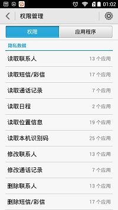
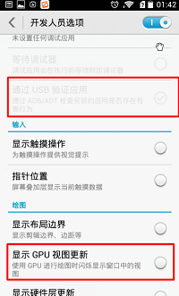
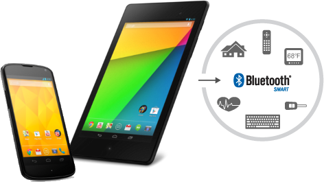
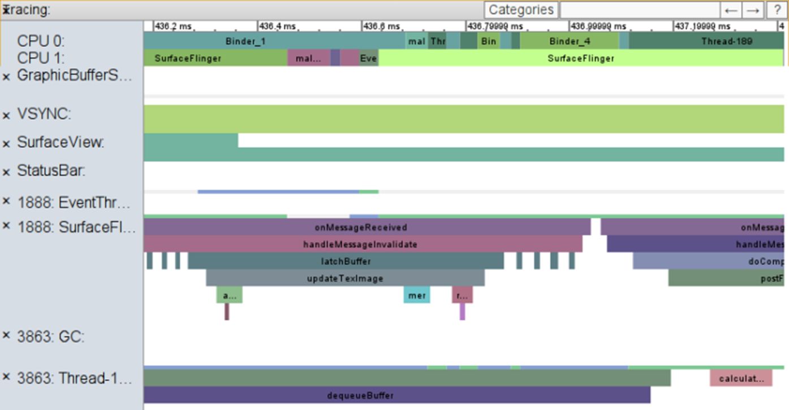
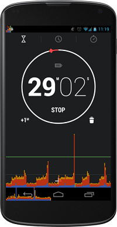
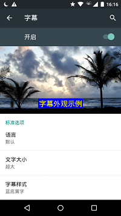
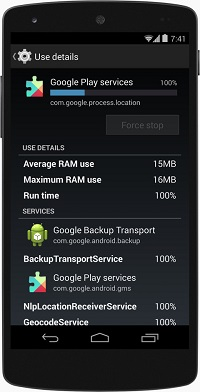
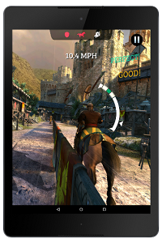
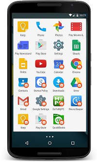

**Android****发展史（Android各版本特性-技术篇）**

原文链接：https://blog.csdn.net/u012964796/article/details/50664794

文章整理了Android 0.x,Android 1.x, Android 2.x,Android 3.x,Android 4.x,Android 5.x,Android 6.x相关技术更新的内容

之前已经整理了“Android发展史（知识篇）”，上次“知识篇”主要收集的是Android相关发展历程和各个版本新特性的描述，其中并未涉及到技术内容。这篇文章主要是收集Android各版本技术相关的内容。

**1 Android 0.x**

AndroidBeta（阿童木）：2008年8月18日发布（内测版） 

主要更新如下： 
 （1）添加一些新的开发工具，例如Eclipse layout布局支持预览，支持编辑9-patch图像等；

**2 Android 1.x**

**1 Android1.0**

发条机器人： 2008年9月23日发布（内测版） 
 首款Android 设备the T-Mobile G1搭载Androd1.0，内置了Android Market beta。

**2 Android1.5**

Cupcake（纸杯蛋糕）：2009年4月30日发布。

**3 Android1.6[1]**

Donut（甜甜圈）：2009年9月15日发布。 

(1) 全新的拍照接口；

(2) 支持OpenCore2媒体引擎；

(3) 新增面向视觉或听觉困难人群的易用性插件。

**3 Android 2.x**

**1 Android2.0/2.1**

Éclair(松饼)：2009年10月26日发布。[1] 

 (1) 新的浏览器的用户接口和支持HTML5

**2 Android2.2/2.2.1**

Froyo（冻酸奶） ：2010年5月20日发布。[1] 

**3 Android2.3.x[1]**

Gingerbread（姜饼） ：2010年12月7日发布。 

(1) 增加了新的垃圾回收和优化处理事件；

(2) 原生代码可直接存取输入和感应器事件、EGL/OpenGLES、OpenSL ES；

(3) 新的管理窗口和生命周期的框架；

(4) 宽频编码，提供了新的音频效果器；

(5) 支持前置摄像头、SIP/VOIP和NFC（近场通讯）[2] 
 NFC可以在不接触的情况下实现数据交换通讯，可以很好的代替RFID SIM卡实现手机支付等扩展功能，当然Android2.3提示这需要硬件的支持，新增包在android.nfc包含NfcAdapter,NdefMessage,NdefRecord等类，类似蓝牙的处理方式，使用该API需要声明权限 

**4 Android 3.x****（蜂巢）**

**4.1 Android3.0**

Honeycomb（蜂巢）：2011年2月2日发布。[1]

**4.2 Android3.1**

Honeycomb（蜂巢） ：2011年5月11日布发布。[1]

(1) 将Android手机系统跟平板系统再次合并从而方便开发者；

**4.3 Android3.2**

Honeycomb（蜂巢）：2011年7月13日发布。[1]

**5 Android4.x**

**1 Android 4.0**

Ice Cream Sandwich（冰激凌三明治）：2011年10月19日在香港发布。[1]

**2 Android4.1**

(1) 可以自定义独立的不需要任何权限的服务；

(2) 具有更好的内存管理，在系统调用onLowMemory()函数前，会先调用ComponentCallbacks2；

(3) 新添acquireUnstableContentProviderClient()对于不同app之间交互带来便捷；

(4) 使用Intent.ACTION_CHANGE_LIVE_WALLPAPER支持应用设置动态壁纸；

(5) 可以为每个Activity设置android:parentActivityName，这样的话，点击action bar的返回按钮将返回到android:parentActivityName所声明的父Activity;

(6) 支持低水平的视频的解码和编码；

**3 Android4.2**

(1)  尽可能使用GPU进行脚本渲染 

(2)Fragments中可以添加子Fragments

(3)Google Now现可允许用户使用Gamail作为新的数据来源，如改进后的航班追踪功能、酒店和餐厅预订功能以及音乐和电影推荐功能等

(4) 改善平板电脑用户体验，特别是在状态栏，导航栏以及通知栏上下功夫。在不同尺寸的屏幕上，将状态栏放在顶部，在下拉状态栏的同时，顺带出通知栏和快速设置栏目。导航栏将放在屏幕底部；扩展通知栏，允许用户直接打开应用

(5)安全方面改善：[4] 
 <1>应用安装校验，应用在安装进手机前，系统会弹框让用户选择安装与否； 
 <2>在发出会扣取高额费用的短信前，系统会新启一个通知让用户选择发送与否； 
 <3>用户可以配置VPN网络，假如配置了VPN，那么用户只能访问该网络中的资源，这样可以防止传送资源到其他网络； 
 <4>分组显示权限，方便用户管理与查看 
  
 <5>强化初始化脚本，支持”nofollow”HTML标签Nofollow 讲解链接 
 <6>ContentProvider的默认属性由“export”改变为“false”，这样可以减少其他应用的表面攻击； 
 <7>加密方面，由原来的“SecureRandom”和“Cipher.RSA”改为“OpenSSL”

(6) 在开发者选项中添加新的栏目： 
 <1>增加提交错误报告； 
 <2>电源键菜单错误报告； 
  
 <3>通过USB验证应用； 
 <4>显示GPU视图更新； 
  
 <5>强制启用4X MSAA； 
 <6>模拟辅助显示设备； 
 <7>启动OpenGl跟踪； 
 

**4 Android4.3**

（1）支持OpenGL ES 3.0；

（2）增强蓝牙连接功能，支持Android设备使用蓝牙技术连接其他拥有蓝牙功能的设备和传感器； 
 

（3）支持开放的图像压缩格式VP8；

（4）增强系统栈打印日志功能，从现在开始，可以收集硬件模块、内核功能、Dalvik虚拟机等相关的垃圾回收，信息加载等信息； 
 

（5）对设备中的app可查看GPU性能分析 
  

（6）StrictMode增加对URLS的警告，当一个app使用file:// URI对另一个app文件输出时就会警告，建议使用FileProvider

**5 Android4.4**

（1）  透明的系统UI样式[5] 

（2）增强对通知内容的获取，监听通知的服务可以获取通知的文本、图标、图片、进度、计时器等；[5]

（3）改进WebView,更好的支持HTML5，CSS3以及JavaScript,支持使用Chrome开发工具远程调式移动设备中WebView 的内容；[5]

（4）Android SDK支持屏幕录像。这对于开发者来说无疑是个福音，然而手机设备还是没内置这个功能的。屏幕录像windows dos下操作方法: [5] 
 第一步：adb shell screenrecord + 存储路径，例如：adb shell screenrecord /sdcard/aaa.mp4 
  
 再按CTRL+C 即退出录像 
 

（5）支持使用IR blasters新API编辑出来的app可以通过发射红外线远程控制近场的电视、调谐器、交换器以及其他电子设备；[5]

（6）新增ART模式 
  
 Android 5.0以上默认是使用ART模式，而部分Android4.4深度定制系统，并不提供这个模式，比如小米系统。

（7）无障碍设置中新增字幕栏目， 
 正常app中将不会显示无障碍的设置，只有特定开发无障碍支持的app才会显示这个效果 
 

（8）开发者选项中新增进程状态 
   
 如果服务运行时间超过自己预定时间或者程序内存评价使用率过高，那么说明这个程序很可能有bug. [5]

**6 Android 5.x**

Lollipop（棒棒糖）：2014 年 10 月 15 日发布。 

（1）Material design 
 Material design算是Android 系统风格的里程碑，其3D UI风格新颖，贴近人机交互；[6]

（2）系统由以往的Dalvik模式改为采用ART（Android Runtime）模式，实现ahead-of-time (AOT)静态编译与just-in-time (JIT)动态编译交互进行；[6]

（3）支持Khronos OpenGL ES 3.1，给游戏以及其他app提供高性能的屏幕展示；[6] 
 

（4）托管配置 [6] [7] 
 Android 5.0 提供了用于在企业环境内运行应用的新功能。如果用户具有现有的个人帐户，则设备管理员可以启动托管配置流程来向设备添加一个共存但单独的“托管配置文件”。与托管配置文件关联的应用将与非托管应用一起出现在用户的启动器、“最近用过”屏幕以及通知中。 
 启动器可以通过向图标绘图添加一个工作标记，使托管应用更加惹人注目 
  
 （5）支持互作用复合传感器、倾斜探测器传感器、心率传感器[6] 
 互作用复合传感器能够探测特别的手势，例如唤醒手势、筛选手势、浏览手势

（6）支持64位系统； 
 开发时记得要考虑兼容64位系统的手机。

（7）限制只有签名一样的两个App才能自定义一样的权限名字，如果签名不一样，那么第二个安装包将安装不上。在5.0以前，允许签名不一样的两个App自定义不一样的权限名字，但是系统只会把这个权限指定给第一个app；

**7 Android 6.x**

Marshmallow（棉花糖）：2015年9月30日 

 （1）新增运行时权限概念[8] 
 Android6.0或以上版本，用户可以完全控制应用权限。当用户安装一个app时，系统默认给app授权部分基础权限，其他敏感权限，需要开发者自己注意，当涉及敏感权限时，开发者需要手动请求系统授予权限，系统这时会弹框给用户，倘若用户拒绝，如果没有保护，app将直接崩溃，倘若有保护，app也无法使用相关功能。

（2）新增瞌睡模式和待机模式 
 瞌睡模式：当不碰手机，手机自动关闭屏幕后，过一会，手机将进入瞌睡模式。在瞌睡模式下，设备只会定期的唤醒，然后继续执行等待中的任务接着又进入瞌睡； 
 待机模式：假如用户一段时间不触碰手机，设备将进入待机模式。在这个模式下，系统会认为所有app是闲置的，这时系统会关闭网络，并且暂停app之前正在执行的任务。

（3）移除对Apache HTTP client的支持，建议使用HttpURLConnection。如果还是想用Apache HTTP client， 
 那么需要在build.gradle中添加

android {

  useLibrary 'org.apache.http.legacy'

}

（4）使用BoringSSL加密库取代OpenSSL支持库；

（5）为了保护用户数据安全，使用代码WifiInfo.getMacAddress()和BluetoothAdapter.getAddress()将得“02:00:00:00:00:00”；

（6）移除浏览器标签相关API；

（7）Android Keystore provider不再支持DSA，但是仍然支持ECDSA

 

参考文献：

[1] android 文档链接 

[2]android 2.3 文档链接 

[3]Jelly Bean介绍 文档链接 

[4] Jelly Bean介绍 文档链接 

[5] KitKat 介绍 文档链接 

[6] Lollipop 介绍 文档链接 

[7] Android 5.0 API新增和改进 文档链接 

[8] Marshmallow 介绍 文档链接

 