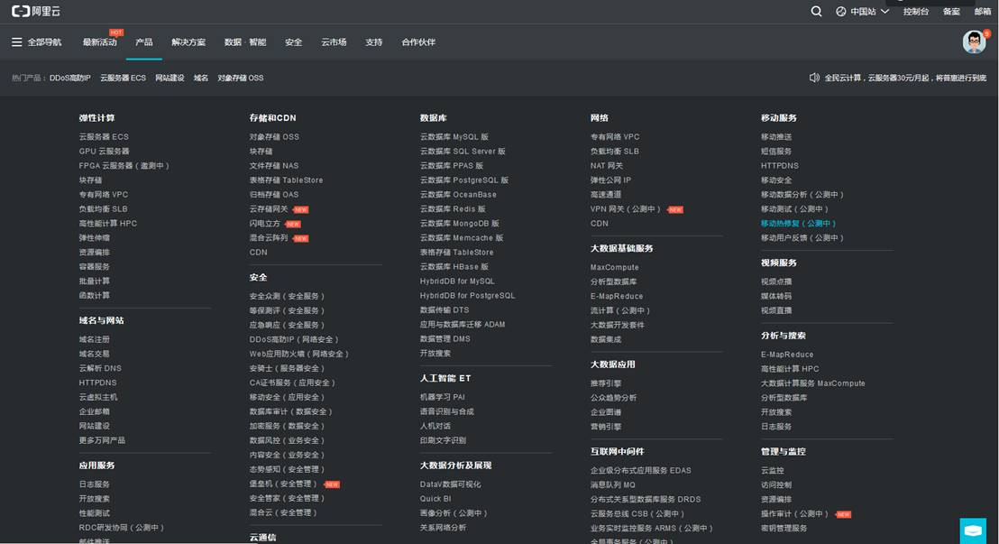
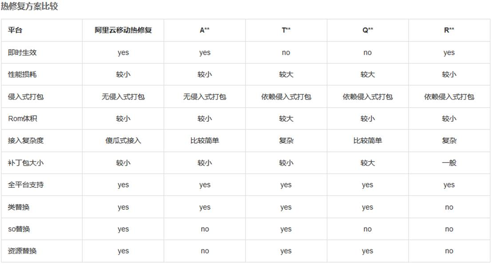
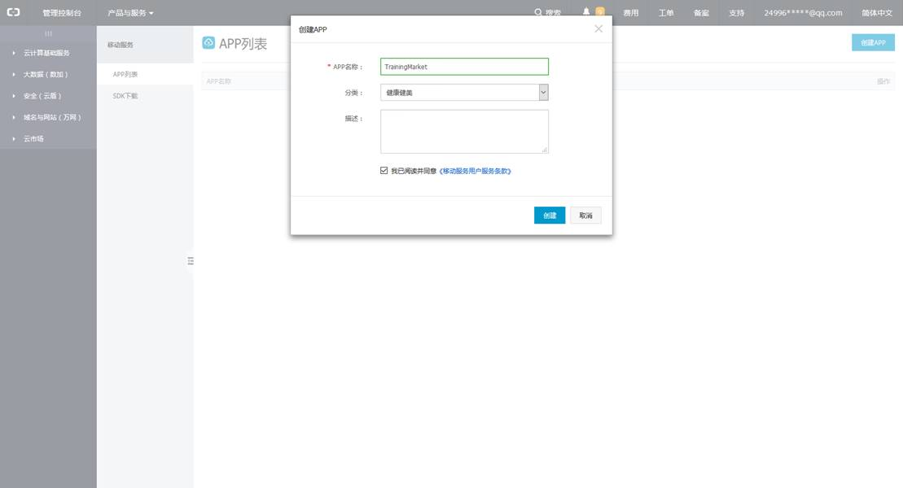
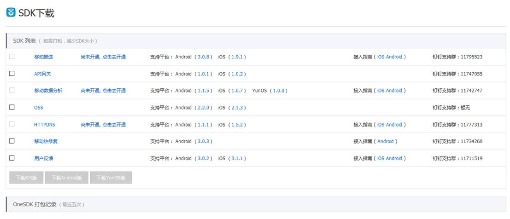
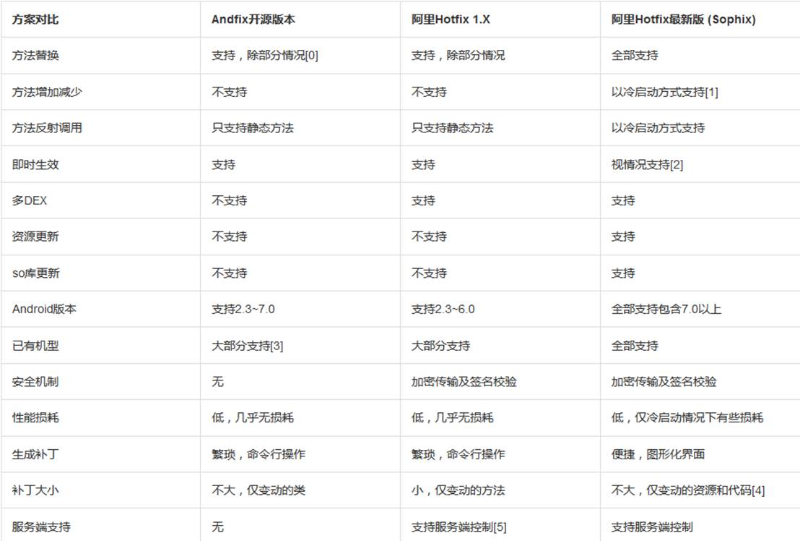

Sophix移动热修复方案初探：

**接入方法：**

\1.    注册阿里云账号。注册地址：https://account.aliyun.com/register/register.htm

\2.    阿里云官网[https://cn.aliyun.com/](https://cn.aliyun.com/?spm=5176.doc51415.2.2.cItq1r) 选择产品->移动服务->移动热修复方案



**热修复方案比较：**



 

开发过程中要注意的一些名词：

1.AppKey：app在移动推送中的唯一标示。推送SDK初始化和调用openapi推送时需要，从推送控制台APP列表页的应用证书中获取。


2.AppSecret：app的秘钥。推送SDK初始化时需要，从推送控制台APP列表页的应用证书中获取。


3.RSA密钥： RSA密钥是保存在客户端本地用于解密patch包过程中使用的解密密钥。（推荐使用chrome浏览器下载）

4.accessKeyld和accessKeySecret：阿里云用户使用云产品的openapi接口验权时需要，从阿里云官网控制台获取https://ak-console.aliyun.com/#/accesskey


 

**快速接入指南：**

**1****．创建应用**

- 登录移动热修复控制台：https://hotfix.console.aliyun.com/，点击右上角创建App，跳转到MHub     App管理控制台，或者直接访问MHub控制台：[https://mhub.console.aliyun.com/](https://mhub.console.aliyun.com)。
- 在MHub控制台点击右上角创建App，填入App名称、分类和描述。



**2.****快速接入**

**2.1 Android SDK****及工具下载**

下载客户端SDK集成，地址[https://mhub.console.aliyun.com/#/download](https://mhub.console.aliyun.com/?spm=5176.doc51415.2.3.9BFAH4#/download)





 

**2.2****集成准备->android studio集成方式**

gradle远程仓库依赖, 打开项目找到app的build.gradle文件，添加如下配置：

添加maven仓库地址：

```
repositories {
   maven {
       url "http://maven.aliyun.com/nexus/content/repositories/releases"
    }
}
```

 

添加gradle坐标版本依赖：

```
compile 'com.aliyun.ams:alicloud-android-hotfix:3.0.3'
```

传递性依赖utdid这个sdk, 所以不需要重复依赖utdid.但是另一方面其它阿里系SDK也可能依赖了utdid这个SDK, 如果编译期间报utdid重复, 所以此时进行如下处理即可, 关闭传递性依赖:

```
compile ('com.aliyun.ams:alicloud-android-hotfix:3.0.3') {
    exclude(module:'alicloud-android-utdid')
}
```

 

权限：

```
<uses-permission android:name="android.permission.INTERNET" />
<uses-permission android:name="android.permission.ACCESS_NETWORK_STATE" />
<uses-permission android:name="android.permission.ACCESS_WIFI_STATE" />
<uses-permission android:name="android.permission.READ_EXTERNAL_STORAGE"/>
```

 

Androidmanifest.xml:

在AndroidManifest.xml中间的application节点下添加如下配置：对应的value中的值分别改为通过平台HotFix服务申请得到的App Secret和RSA密钥

```
<meta-data
    android:name="com.taobao.android.hotfix.IDSECRET"
    android:value="App ID" />
<meta-data
    android:name="com.taobao.android.hotfix.APPSECRET"
    android:value="App Secret" />
<meta-data
    android:name="com.taobao.android.hotfix.RSASECRET"
    android:value="RSA密钥" />
```

 

混淆配置：

```
#基线包使用，生成mapping.txt
-printmapping mapping.txt
#生成的mapping.txt在app/buidl/outputs/mapping/release路径下，移动到/app路径下
#修复后的项目使用，保证混淆结果一致
#-applymapping mapping.txt
#hotfix
-keep class com.taobao.sophix.**{*;}
-keep class com.ta.utdid2.device.**{*;}
#防止inline
-dontoptimize
```

 

**2.3 SDK****接口使用说明**

**2.3.1** **接入范例：**

initialize的调用应该尽可能的早，必须在Application.attachBaseContext()或者Application.onCreate()的最开始进行SDK初始化操作，否则极有可能导致崩溃。而查询服务器是否有可用补丁的操作可以在后面的任意地方。

阿里官方例程：

```
// initialize最好放在attachBaseContext最前面
SophixManager.getInstance().setContext(this)
        .setAppVersion(appVersion)
        .setAesKey(null)
        .setEnableDebug(true)
        .setPatchLoadStatusStub(new PatchLoadStatusListener() {
            @Override
            public void onLoad(final int mode, final int code, final String info, final int handlePatchVersion) {
                // 补丁加载回调通知
                if (code == PatchStatus.CODE_LOAD_SUCCESS) {
                    // 表明补丁加载成功
                } else if (code == PatchStatus.CODE_LOAD_RELAUNCH) {
                    // 表明新补丁生效需要重启. 开发者可提示用户或者强制重启;
                    // 建议: 用户可以监听进入后台事件, 然后应用自杀
                } else if (code == PatchStatus.CODE_LOAD_FAIL) {
                    // 内部引擎异常, 推荐此时清空本地补丁, 防止失败补丁重复加载
                    // SophixManager.getInstance().cleanPatches();
                } else {
                    // 其它错误信息, 查看PatchStatus类说明
                }
            }
        }).initialize();
// queryAndLoadNewPatch不可放在attachBaseContext 中，否则无网络权限，建议放在后面任意时刻，如onCreate中
SophixManager.getInstance().queryAndLoadNewPatch();
```

 

**2.3.2****接口说明**

#### 2.3.2.1 initialize方法

1）initialize(): **<****必选****>**

该方法主要做些必要的初始化工作以及如果本地有补丁的话会加载补丁, 但不会自动请求补丁。因此需要自行调用queryAndLoadNewPatch方法拉取补丁。这个方法调用需要尽可能的早, 推荐在Application的onCreate方法中调用, initialize()方法调用之前你需要先调用如下几个方法, 方法调用说明如下:

2）setContext(this): **<****必选****>** Application上下文context

3）setAppVersion(appVersion): **<****必选****>** 应用的版本号

4）setEnableDebug(true/false): **<****可选>** 默认为false, 是否调试模式, 调试模式下会输出日志以及不进行补丁签名校验. 线下调试此参数可以设置为true, 查看日志过滤TAG:Sophix, 同时强制不对补丁进行签名校验, 所有就算补丁未签名或者签名失败也发现可以加载成功. 但是正式发布该参数必须为false, false会对补丁做签名校验, 否则就可能存在安全漏洞风险

5）setEnableFixWhenJit(): **<****可选****>** 默认情况下会在Android N以后的版本发现jit后跳过，这会使得部分7.0以上设备不进行修复。而如果想要此时不跳过，需要打开这个选项进行配置。打开后，需要做对Application进行改造。要尽可能避免Application类与和它同包名的类互相访问，如果确实需要访问，接口应设为public权限，[详见常见问题文档](https://help.aliyun.com/knowledge_detail/55422.html)，也可寻求群里技术支持解决。Android 7.0后带来的jit问题很隐蔽，只有频繁使用的app会由系统进行jit，该接口可以彻底解决Android N带来的jit问题。

6）setAesKey(aesKey): **<****可选****>** 用户自定义aes秘钥, 会对补丁包采用对称加密。这个参数值必须是16位数字或字母的组合，是和补丁工具设置里面AES Key保持完全一致, 补丁才能正确被解密进而加载。此时平台无感知这个秘钥, 所以不用担心阿里云移动平台会利用你们的补丁做一些非法的事情。

7）setPatchLoadStatusStub(new PatchLoadStatusListener()): **<****可选****>** 设置patch加载状态监听器, 该方法参数需要实现PatchLoadStatusListener接口, 接口说明见1.3.2.2说明

8）setUnsupportedModel(modelName, sdkVersionInt):**<****可选****>** 把不支持的设备加入黑名单，加入后不会进行热修复。modelName为该机型上Build.MODEL的值，这个值也可以通过adb shell getprop | grep ro.product.model取得。sdkVersionInt就是该机型的Android版本，也就是Build.VERSION.SDK_INT，若设为0，则对应该机型所有安卓版本。

#### 2.3.2.2 queryAndLoadNewPatch方法

该方法主要用于查询服务器是否有新的可用补丁. SDK内部限制连续两次queryAndLoadNewPatch()方法调用不能短于3s, 否则的话就会报code:19的错误码. 如果查询到可用的话, 首先下载补丁到本地, 然后

应用原本没有补丁, 那么如果当前应用的补丁是热补丁, 那么会立刻加载(不管是冷补丁还是热补丁). 如果当前应用的补丁是冷补丁, 那么需要重启生效.

**应用已经存在一个补丁****,** **首先会把之前的补丁文件删除****,** **然后不立刻加载****,** **而是等待下次应用重启再加载该补丁**

补丁在后台发布之后, 并不会主动下行推送到客户端, 需要手动调用queryAndLoadNewPatch方法查询后台补丁是否可用.

只会下载补丁版本号比当前应用存在的补丁版本号高的补丁, 比如当前应用已经下载了补丁版本号为5的补丁, 那么只有后台发布的补丁版本号>5才会重新下载.

同时1.4.0以上版本服务后台上线了“一键清除”补丁的功能, 所以如果后台点击了“一键清除”那么这个方法将会返回code:18的状态码. 此时本地补丁将会被强制清除, 同时不清除本地补丁版本号

#### 2.3.2.3 killProcessSafely方法

可以在PatchLoadStatusListener监听到CODE_LOAD_RELAUNCH后在合适的时机，调用此方法杀死进程。注意，不可以直接Process.killProcess(Process.myPid())来杀进程，这样会扰乱Sophix的内部状态。因此如果需要杀死进程，建议使用这个方法，它在内部做一些适当处理后才杀死本进程。

#### 2.3.2.4 cleanPatches()方法

清空本地补丁

#### 2.3.2.5 PatchLoadStatusListener接口

该接口需要自行实现并传入initialize方法中, 补丁加载状态会回调给该接口, 参数说明如下:

- mode: 补丁模式, 0:正常请求模式     1:扫码模式 2:本地补丁模式
- code: 补丁加载状态码,     详情查看PatchStatusCode类说明
- info: 补丁加载详细说明,     详情查看PatchStatusCode类说明
- handlePatchVersion: 当前处理的补丁版本号, 0:无 -1:本地补丁     其它:后台补丁

这里列举几个常见的code码说明, **详情查看SDK中PatchStatus类的代码，其中有具体说明**

- code: 1 补丁加载成功
- code: 6 服务端没有最新可用的补丁
- code: 11 RSASECRET错误，官网中的密钥是否正确请检查
- code: 12 当前应用已经存在一个旧补丁, 应用重启尝试加载新补丁
- code: 13 补丁加载失败, 导致的原因很多种,     比如UnsatisfiedLinkError等异常, 此时应该严格检查logcat异常日志
- code: 16 APPSECRET错误，官网中的密钥是否正确请检查
- code: 18 一键清除补丁
- code: 19 连续两次queryAndLoadNewPatch()方法调用不能短于3s

**2.4** **版本管理说明：**

说明一：patch是针对客户端具体某个版本的，patch和具体版本绑定

eg. 应用当前版本号是1.1.0, 那么只能在后台查询到1.1.0版本对应发布的补丁, 而查询不到之前1.0.0旧版本发布的补丁.

说明二：针对某个具体版本发布的新补丁, 必须包含所有的bugfix, 而不能依赖补丁递增修复的方式, 因为应用仅可能加载一个补丁

eg. 针对1.0.0版本在后台发布了一个补丁版本号为1的补丁修复了bug1, 然后发现此时针对这个版本补丁1修复的不完全, 代码还有bug2, 在后台重新发布一个补丁版本号为2的补丁, 那么此时补丁2就必须同时包含bug1和bug2的修复才行, 而不是只包含bug2的修复(bug1就没被修复了)

阿里官方示例：（根据自己的需求修改）

https://github.com/aliyun/alicloud-android-demo/tree/master/hotfix_android_demo?spm=5176.doc53241.2.1.bNAlrs