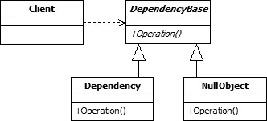

# Null object pattern

引用自https://en.wikipedia.org/wiki/Null_object_pattern

在面向对象的计算机编程中，空对象是没有引用值或具有定义的中立（“空”）行为的对象。 空对象设计模式描述了此类对象的用途及其行为（或缺少行为）。 它最初在[*Pattern Languages of Program Design* ](https://en.wikipedia.org/wiki/Pattern_Languages_of_Programs#Publications)丛书中出版。

## 模式架构



# 动机

在大多数的面向对象编程语言中，如Java或者C#，引用可能会为null。在调用任何方法之前，需要对检查引用以确保其不会为null，因为方法的调用通常不能通过null引用调用。

Objective-C语言采用了另一种方法来解决此问题，并且在向nil发送消息时不执行任何操作； 如果期望返回值，则将nil（对于对象），0（对于数值），NO（对于BOOL值）或struct（对于结构类型）及其所有成员初始化为null / 0 / NO / zero-initialized 返回struct。（ ["Working with Objects (Working with nil)"](https://developer.apple.com/library/ios/documentation/Cocoa/Conceptual/ProgrammingWithObjectiveC/WorkingwithObjects/WorkingwithObjects.html#//apple_ref/doc/uid/TP40011210-CH4-SW22)）（感兴趣的可以深入研究这方面的知识）

# 描述

通过使用一个实现预期接口的对象（其方法体为空）代替null引用来传达一个对象的缺失。这种方法的优势是空对象是可预测的且没有任何副作用：不做任何事情。

例如，一个函数可以检索文件夹中的文件列表，并对每个文件执行一些操作。在文件夹为空的情况下，一种响应可能是引发异常或返回空引用而不是列表。因此，期望得到列表的代码必须在继续之前验证它实际上是否已经包含一个列表，这会使设计复杂化。

通过返回一个空对象（如一个空列表），则无需验证返回值是否是一个列表。调用函数可以向往常一样简单地迭代列表，但是实际上什么都没有做。但是，仍然可以检查返回值是否为空对象（空列表），并根据需要作出不同的反应。

空对象设计模式描述了系统中空对象的使用和它们的行为：

* 空对象模式处理空对象；
* 替代对象的null检查，定义了null行为或什么都不做的行为；
* 这些空对象还可以用于提供默认的行为，以防止数据不可用；
* 这种方式优于默认的实现的优点是：空对象非常容易预测，并且没有副作用-它什么也不做；
* 如果资源不可用于测试，则空对象还模式还可以用作测试的存根


# 示例

给定二进制树，节点数据结构如下所示：

```javascript
class node {
	node left;
	node right;
}
```

一个统计数的大小的递归函数如下：

```javascript
function tree_size(node) {
	return 1 + tree_size(node.left) + tree_size(node.right);
}
```

由于子节点可能不存在，所以必须修改程序添加no-existence或者null检查：

```javascript
function tree_size(node) {
	set sum = 1
	if node.left exist {
		sum = sum + tree_size(node.left)
	}
	if node.right exist {
		sum = sum + tree_size(node.right)
	}
	
	return sum
}
```

上面的过程将边界检查和正常的逻辑混在一起使得过程变得很复杂，而且也变得难以阅读。使用空对象模式，可以为空节点创建一个特殊的处理过程：

```javascript
function tree_size(node) {
	return 1 + tree_size(node.left) + tree_size(node.right)
}
```

```javascript
function tree_size(null_node) {
	return 0
}
```

这就将正常的逻辑和特殊情况的处理过程分开，使代码变得更加易于阅读。

# 和其他设计模式的关系

空对象模式可以被认为是一种特殊的状态模式或者策略模式。

空对象模式并不是典型的设计模式，但是在Martin Fowler的Refactoring（https://archive.org/details/isbn_9780201485677）和Joshua Kerievsky的Refactoring To Patterns中作为插入空对象重构中提到。

罗伯特·塞西尔·马丁（Robert Cecil Martin）的敏捷软件开发：原理，模式和实践[5]第17章专门讨论该模式。

# 不同语言中使用

## c++

静态语言中对象的引用阐述了空对象模式是如何变成更加复杂的模式：

```c++

class Animal {
 public:
  virtual ~Animal() = default;

  virtual void MakeSound() const = 0;
};

class Dog : public Animal {
 public:
  virtual void MakeSound() const override { std::cout << "woof!" << std::endl; }
};

class NullAnimal : public Animal {
 public:
  virtual void MakeSound() const override {}
};
```

这里的想法是，在某些情况下需要使用指向Animal对象的指针或引用，但是没有合适的对象可用。在符合标准的C ++中，空引用是不允许的。但是空的Animal *指针是可以的，并且可以用作占位符，但不能用于直接的分发：如果a是空指针，则a-> MakeSound（）是未定义的行为。

空对象模式通过提供一个特殊的NullAnimal类来解决此问题，该类可以实例化绑定到Animal指针或引用。

必须为每个要具有null对象的类层次结构创建特殊的null类，因为对于某些与Animal层次结构无关的Widget基类，当需要一个null对象时，NullAnimal是没有用的。

请注意，NOT having a null class at all is an important feature，这与“任何东西都是引用”的语言（例如Java和C＃）形成对比。在C ++中，函数或方法的设计可以明确声明是否允许使用null。

```c++
// Function which requires an |Animal| instance, and will not accept null.
void DoSomething(const Animal& animal) {
  // |animal| may never be null here.
}

// Function which may accept an |Animal| instance or null.
void DoSomething(const Animal* animal) {
  // |animal| may be null.
}
```

## Java

```java
public interface Animal {
	void makeSound() ;
}

public class Dog implements Animal {
	public void makeSound() {
		System.out.println("woof!");
	}
}

public class NullAnimal implements Animal {
	public void makeSound() {
                // silence...
	}
}
```

这段代码展示了上面c++代码的Java实现版本。

与c++一样，在需要引用Animal对象但没有合适的可用对象时，可以实例化null类。一个空的Animal对象是可以的（Animal myAnimal = null;），并且可以用作占位符，但是不能用于调用方法。在此示例中，myAnimal.makeSound()将会抛出NullPointerException()。因此，需要额外的代码来对空对象进行检查。

空对象模式通过提供一个特殊的NullAnimal类来解决了此问题，该类可以实例化为Aniaml类型的对象。和c++语言一样，必须为每个需要空队形的类层次结构创建特殊的空类，因为如果需要的是不实现Animal接口的空对象，则NullAniaml是没有用的。

# 使用之前的注意事项

* 这种模式应该谨慎使用，因为它会使得errors/bugs看起来像正常的程序执行。
* 应当注意不要仅仅为了避免空检查和使代码易读而实现该模式-例如，当提供的对象确实为null时需要执行不同的逻辑时。在大多是具有引用类型的语言中，常见的模式是将引用与单个值（null或者nil）进行比较。

# NullObject的使用示例

* 创建一个抽象类（或者接口）去指定各种功能。下面的例子中使用shape接口。注意在shape接口中添加了一个isNull()方法。这个方法可以很好地识别和控制定义的空对象。所有的实体类的该方法返回false，空对象的该方法返回true。时

  ```java
  /*
   * Copyright (c) 2019-2020 ,Chase Dream Ltd. All Rights Reserved.
   */
  
  package com.chasedream.test.patterns.nullobject;
  
  /**
   * @author Zhang Dezhou
   * @Description
   * @date 2020/5/23 15:16
   */
  public interface Shape {
      /**
       * Calculate this shape area.
       *
       * @return shape's area
       */
      double area();
  
      /**
       * Calculate shape perimeter
       *
       * @return shape's perimeter
       */
      double perimeter();
  
      /**
       * Draw the shape.
       */
      void draw();
  
      /**
       * nice to have method to indicate null object
       *
       * @return true if the object is null
       */
      boolean isNull();
  }
  ```

* 创建一个继承这个类或者实现这个接口的实体类。每一个实体类将会定义一个特殊的功能函数的版本。下面定义形状的三个实体类型：Circle, Rectangle和Triangle。这些实体类将定义不同的形状类型。下面是Circle实体类型的代码：

  ```java
  /*
   * Copyright (c) 2019-2020 ,Chase Dream Ltd. All Rights Reserved.
   */
  
  package com.chasedream.test.patterns.nullobject;
  
  /**
   * @author Zhang Dezhou
   * @Description
   * @date 2020/5/23 15:41
   */
  public class Circle implements Shape {
      /**
       * Circle radius.
       */
      private final double radius;
  
      public Circle() {
          this(1.0d);
      }
  
      public Circle(double radius) {
          this.radius = radius;
      }
  
      @Override
      public double area() {
          // Area = π r^2
          return Math.PI * Math.pow(radius, 2);
      }
  
      @Override
      public double perimeter() {
          // Perimeter = 2πr
          return 2 * Math.PI * radius;
      }
  
      @Override
      public void draw() {
          System.out.println("Drawing Circle with area: " + area() + " and perimeter: " + perimeter());
      }
  
      @Override
      public boolean isNull() {
          return false;
      }
  }
  ```

  下面是Rectangle代码：

  ```java
  /*
   * Copyright (c) 2019-2020 ,Chase Dream Ltd. All Rights Reserved.
   */
  
  package com.chasedream.test.patterns.nullobject;
  
  /**
   * @author Zhang Dezhou
   * @Description
   * @date 2020/5/23 15:44
   */
  public class Rectangle implements Shape {
      /**
       * Rectangle's width
       */
      private final double width;
      /**
       * Rectangle's height
       */
      private final double height;
  
      public Rectangle() {
          this(1.0d, 1.0d);
      }
  
      public Rectangle(double width, double length) {
          this.width = width;
          this.height = length;
      }
  
      @Override
      public double area() {
          // A = w * l
          return width * height;
      }
  
      @Override
      public double perimeter() {
          // P = 2(w + l)
          return 2 * (width + height);
      }
  
      @Override
      public void draw() {
          System.out.println("Drawing Rectangle with area: " + area() + " and perimeter: " + perimeter());
      }
  
      @Override
      public boolean isNull() {
          return false;
      }
  }
  ```

  下面是Triangle的代码：

  ```java
  /*
   * Copyright (c) 2019-2020 ,Chase Dream Ltd. All Rights Reserved.
   */
  
  package com.chasedream.test.patterns.nullobject;
  
  /**
   * @author Zhang Dezhou
   * @Description
   * @date 2020/5/23 15:46
   */
  public class Triangle implements Shape {
      /**
       * Three side's length.
       */
      private final double a;
      private final double b;
      private final double c;
  
      public Triangle() {
          this(1.0d, 1.0d, 1.0d);
      }
  
      public Triangle(double a, double b, double c) {
          this.a = a;
          this.b = b;
          this.c = c;
      }
  
      @Override
      public double area() {
          // Using Heron's formula:
          // Area = SquareRoot(s * (s - a) * (s - b) * (s - c))
          // where s = (a + b + c) / 2, or 1/2 of the perimeter of the triangle
          double s = (a + b + c) / 2;
          return Math.sqrt(s * (s - a) * (s - b) * (s - c));
      }
  
      @Override
      public double perimeter() {
          // P = a + b + c
          return a + b + c;
      }
  
      @Override
      public void draw() {
          System.out.println("Drawing Triangle with area: " + area() + " and perimeter: " + perimeter());
      }
  
      @Override
      public boolean isNull() {
          return false;
      }
  }
  ```

* 现在，最重要的步骤是创建一个继承自抽象类或实现接口的空对象并定义空的行为。空行为就好像是当数据不可获取时的一个默认的行为。

  ```java
  /*
   * Copyright (c) 2019-2020 ,Chase Dream Ltd. All Rights Reserved.
   */
  
  package com.chasedream.test.patterns.nullobject;
  
  /**
   * @author Zhang Dezhou
   * @Description
   * @date 2020/5/23 15:49
   */
  public class NullShape implements Shape {
      @Override
      public double area() {
          return 0.0d;
      }
  
      @Override
      public double perimeter() {
          return 0.0d;
      }
  
      @Override
      public void draw() {
          System.out.println("Null object can't be draw");
      }
  
      @Override
      public boolean isNull() {
          return true;
      }
  }
  ```

* 现在，我们可以定义一个Factory类去创建各种形状的类型对象。工厂模式可以查看这篇文章（[Strategy vs Factory Design Pattern in Java](https://dzone.com/articles/strategy-vs-factory-design-pattern-in-java)），下面是ShapeFactory的代码：

  ```java
  /*
   * Copyright (c) 2019-2020 ,Chase Dream Ltd. All Rights Reserved.
   */
  
  package com.chasedream.test.patterns.nullobject;
  
  /**
   * @author Zhang Dezhou
   * @Description
   * @date 2020/5/23 15:52
   */
  public class ShapeFactory {
      public static Shape createShape(String shapeType) {
          Shape shape = null;
          if ("Circle".equalsIgnoreCase(shapeType)) {
              shape = new Circle();
          } else if ("Rectangle".equalsIgnoreCase(shapeType)) {
              shape = new Rectangle();
          } else if ("Triangle".equalsIgnoreCase(shapeType)) {
              shape = new Triangle();
          } else {
              shape = new NullShape();
          }
          return shape;
      }
  }
  ```

  为了使得示例能够简单易懂，示例中的各种shape对象并没有接受参数，而是调用各个形状的默认构造方法。

* 最后，创建一个Main类去执行和测试这些代码

  ```java
  /*
   * Copyright (c) 2019-2020 ,Chase Dream Ltd. All Rights Reserved.
   */
  
  package com.chasedream.test.patterns.nullobject;
  
  /**
   * @author Zhang Dezhou
   * @Description
   * @date 2020/5/23 15:56
   */
  public class ShapeMain {
      public static void main(String[] args) {
          String[] shapeTypes = new String[]{"Circle", null, "Triangle", "Pentagon", "Rectangle", "Trapezoid"};
          for (String shapeType : shapeTypes) {
              Shape shape = ShapeFactory.createShape(shapeType);
              // no null-check required since shape factory always creates shape objects
              System.out.println("Shape area: " + shape.area());
              System.out.println("Shape Perimeter: " + shape.perimeter());
              shape.draw();
              System.out.println();
          }
      }
  }
  ```

* 下面是代码的输出

  ```
  Shape area: 3.141592653589793
  Shape Perimeter: 6.283185307179586
  Drawing Circle with area: 3.141592653589793 and perimeter: 6.283185307179586
  
  Shape area: 0.0
  Shape Perimeter: 0.0
  Null object can't be draw
  
  Shape area: 0.4330127018922193
  Shape Perimeter: 3.0
  Drawing Triangle with area: 0.4330127018922193 and perimeter: 3.0
  
  Shape area: 0.0
  Shape Perimeter: 0.0
  Null object can't be draw
  
  Shape area: 1.0
  Shape Perimeter: 4.0
  Drawing Rectangle with area: 1.0 and perimeter: 4.0
  
  Shape area: 0.0
  Shape Perimeter: 0.0
  Null object can't be draw
  ```

* 在Java8中，我们有java.util.Optional类去处理空引用。这个类最初源自Guava API


# Optional

该类的目的是提供一种表示可选值的类型级别的解决方案，而不是使用空引用。 要获得有关使用Optional的更深入的知识，请参考Oracle的文章 [Tired of Null Pointer Exceptions? Consider Using Java SE 8's](http://www.oracle.com/technetwork/articles/java/java8-optional-2175753.html).

接下来将会展示一些java.util.Optional中有用的接口。有些静态方法可以用于创建空的Optional对象

* Optional.empty()：创建一个空的Optional对象

  ```java
  @Test
  public void optionalEmptyTest() {
      Optional<Shape> empty = Optional.empty();
      assertFalse(empty.isPresent());
  }
  ```

* Optional.of()：创建一个非空的Optional对象，如果我们确定要使一个对象成为Optional对象，可以使用此API。如果使用null调用此API，将会抛出NullPointerExeption

  ```java
  @Test
  public void optionalOfTest() {
  	Shape shape = ShapeFactory.createShape("Circle");   
      Optional<Shape> nonEmpty = Optional.of(shape);
    	assertTrue(nonEmpty.isPresent());
  }
  @Test(expected = NullPointerException.class)
  public void optionalOfWithNullTest() {
    	Shape shape = null;
    	Optional.of(shape);
  }
  ```

* Optional.ofNullable()：如果我们不确定我们的对象是否为null，可以使用此API

  ```java
  @Test
  public void optionalOfNullableTest() {
  	Shape shape1 = ShapeFactory.createShape("Circle");   
      Optional<Shape> nonEmpty = Optional.ofNullable(shape1);
    	assertTrue(nonEmpty.isPresent());
    	Shape shape2 = null;
      Optional<Shape> empty = Optional.ofNullable(shape2);
    	assertFalse(empty.isPresent());
  }
  ```

## 额外的API

* isPresent()：当且仅当Optional封装的对象not-empty（not null）时返回true

  ```java
  @Test
  public void optionalIsPresentTest() {
  	Shape shape = ShapeFactory.createShape("Circle");   
      Optional<Shape> nonEmpty = Optional.of(shape);
    	assertTrue(nonEmpty.isPresent());
      Optional<Shape> empty = Optional.empty();
    	assertFalse(empty.isPresent());
  }
  ```

* ifPresent()：如示例中所示，当存在相关对象时，能够运行该封装对象的相关的代码

  ```java
  @Test
  public void optionalIfPresentTest() {
  	Shape shape = ShapeFactory.createShape("Circle");   
      Optional<Shape> nonEmpty = Optional.of(shape);
    	nonEmpty.ifPresent(circle -> circle.draw());
      Optional<Shape> empty = Optional.empty();
    	empty.ifPresent(circle -> circle.draw());
  }
  ```

* get()：如果封装对象不为null，则返回该值。否则，将会抛出NoSuchElementException异常

  ```java
  @Test
  public void optionalGetTest() {
  	Shape shape = ShapeFactory.createShape("Circle");   
      Optional<Shape> nonEmpty = Optional.ofNullable(shape);
    	assertNotNull(nonEmpty.get());
  }
  
  @Test(expected = NoSuchElementException.class)
  public void optionalGetWithNullTest() {
    	Shape shape = null;
      Optional<Shape> empty = Optional.ofNullable(shape);
    	empty.get();
  }
  ```

* orElse()：用于检索Optional实例中的封装对象。如果存在则返回该封装对象；如果不存在则返回默认的参数。

  ```java
  @Test
  public void optionalOrElseTest() {
   	Shape shape = ShapeFactory.createShape("Rectangle");
  	Shape shape1 = ShapeFactory.createShape("Circle");   
      Optional<Shape> nonEmpty = Optional.of(shape1);
    	assertEquals(shape1, nonEmpty.orElse(shape));
      
      Optional<Shape> empty = Optional.empty();
    	empty.ifPresent(circle -> circle.draw());
    	assertEquals(shape, empty.orElse(shape));
  }
  ```

* orElseGet()：和orElse优点类似。唯一的区别就是，当待检索的封装对象不存在时该接口提供一个功能接口，执行并返回该调用的返回值

  ```java
  @Test
  public void optionalOrElseGetTest() {
      Shape shape = ShapeFactory.createShape("Rectangle");
      Shape shape1 = ShapeFactory.createShape("Circle");   
      Optional<Shape> nonEmpty = Optional.of(shape1);
      assertEquals(shape1, nonEmpty.orElseGet(() -> 			ShapeFactory.createShape("Rectangle")));
      
      Optional<Shape> empty = Optional.empty();
      empty.ifPresent(circle -> circle.draw());
      // comparing the area of the shape since orElseGet will create another instance of rectangle
      assertEquals(shape.area(), empty.orElseGet(() -> ShapeFactory.createShape("Rectangle")).area(), 0.001d);
  }
  ```

* orElseThrow()：和orElse类似，唯一的区别就是当对象不存在时，该接口爬出一个给定的异常

  ```java
  @Test(expected = IllegalArgumentException.class)
  public void optionalOrElseThrowWithNullTest() {
    	Shape shape = null;
    	Optional<Shape> empty = Optional.ofNullable(shape);
    	empty.orElseThrow(IllegalArgumentException::new);
  }
  ```

现在，我们使用Optional实现ShapeFactory,Main，如下所示：

```java
/*
 * Copyright (c) 2019-2020 ,Chase Dream Ltd. All Rights Reserved.
 */

package com.chasedream.test.patterns.nullobject;

import java.util.Optional;

/**
 * @author Zhang Dezhou
 * @Description
 * @date 2020/5/23 16:32
 */
public class ShapeFactoryJava8 {
    public static Optional<Shape> createShape(String shapeType) {
        Shape shape = null;
        if ("Circle".equalsIgnoreCase(shapeType)) {
            shape = new Circle();
        } else if ("Rectangle".equalsIgnoreCase(shapeType)) {
            shape = new Rectangle();
        } else if ("Triangle".equalsIgnoreCase(shapeType)) {
            shape = new Triangle();
        } else {
            // no need to have NullShape anymore
            shape = null;
        }
        // using ofNullable because shape may be not null.
        return Optional.ofNullable(shape);
    }
}
```

Main类执行和测试的代码如下：

```java
/*
 * Copyright (c) 2019-2020 ,Chase Dream Ltd. All Rights Reserved.
 */

package com.chasedream.test.patterns.nullobject;

import java.util.Arrays;
import java.util.Optional;

/**
 * @author Zhang Dezhou
 * @Description
 * @date 2020/5/23 16:33
 */
public class ShapeMainJava8 {
    public static void main(String[] args) {
        String[] shapeTypes = new String[]{"Circle", null, "Triangle", "Pentagon", "Rectangle", "Trapezoid"};
        Arrays.asList(shapeTypes).stream().forEach(shapeType -> {
            Optional<Shape> optionalShape = ShapeFactoryJava8.createShape(shapeType);
            optionalShape.ifPresent((shape) -> {
                // null-check is done by ifPresent of Optional
                System.out.println("Shape area: " + shape.area());
                System.out.println("Shape Perimeter: " + shape.perimeter());
                shape.draw();
                System.out.println();
            });
        });
    }
}
```

下面是输出：

```
Shape area: 3.141592653589793
Shape Perimeter: 6.283185307179586
Drawing Circle with area: 3.141592653589793 and perimeter: 6.283185307179586
Shape area: 0.4330127018922193
Shape Perimeter: 3.0
Drawing Triangle with area: 0.4330127018922193 and perimeter: 3.0
Shape area: 1.0
Shape Perimeter: 4.0
Drawing Rectangle with area: 1.0 and perimeter: 4.0
```