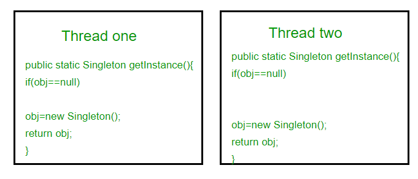

# 概念

单例设计模式是GOF设计模式一部分，其被划分到了创建型模式类别中。在这篇文章中，我们将深入地探索单例设计模式的使用。就其模型而言，单例设计模式是最简单的设计模式；但是从使用的复杂性来说，其又是最具有争议的设计模式。

单例设计模式限制了一个类实例化其多个对象。它不过是定义类的一种方式。这种类的定义方式是在程序或项目的完整执行过程中仅创建一个实例。它被用在只需要一个类的单个实例就可以控制整个执行过程中的一些动作。被定义为单例的类在任何情况下都不应该有多个实例。单例常被用于日志记录，驱动程序对象，缓存和线程池，数据库连接等。

单例设计模式：


实现单例必须遵循的原则：

1. 只允许有一个实例，且必须自己创建自己的实例

   通过从类的内部提供类的实例，防止外部类或者子类创建其实例。将类的构造函数设置成私有，阻止其他类访问其构造函数。（将在最后介绍通过反射、序列化或者克隆破坏单例以及相应的解决方法）

2. 实例必须全局可访问，必须能够给所有其他对象提供这一实例

```java
//A singleton class should have public visibility 
//so that complete application can use 
public class GFG { 
    
  //static instance of class globally accessible 
  public static GFG instance = new GFG(); 
  private GFG() { 
    // private constructor so that class 
    //cannot be instantiated from outside 
    //this class 
  } 
} 
```


# 介绍

**意图：**保证一个类仅有一个实例，并提供一个访问它的全局访问点。

**主要解决：**一个全局使用的类频繁地创建与销毁。

**何时使用：**当您想控制实例数目，节省系统资源的时候。

**如何解决：**判断系统是否已经有这个单例，如果有则返回，如果没有则创建。

**关键代码：**构造函数是私有的。

**应用实例：**

- 1、一个班级只有一个班主任。
- 2、Windows 是多进程多线程的，在操作一个文件的时候，就不可避免地出现多个进程或线程同时操作一个文件的现象，所以所有文件的处理必须通过唯一的实例来进行。
- 3、一些设备管理器常常设计为单例模式，比如一个电脑有两台打印机，在输出的时候就要处理不能两台打印机打印同一个文件。

**优点：**

- 1、在内存里只有一个实例，减少了内存的开销，尤其是频繁的创建和销毁实例（比如管理学院首页页面缓存）。
- 2、避免对资源的多重占用（比如写文件操作）。

**缺点：**没有接口，不能继承，与单一职责原则冲突，一个类应该只关心内部逻辑，而不关心外面怎么样来实例化。

**使用场景：**

- 1、要求生产唯一序列号。
- 2、WEB 中的计数器，不用每次刷新都在数据库里加一次，用单例先缓存起来。
- 3、创建的一个对象需要消耗的资源过多，比如 I/O 与数据库的连接等。

**注意事项：**getInstance() 方法中需要使用同步锁 synchronized (Singleton.class) 防止多线程同时进入造成 instance 被多次实例化。

# 实现

单例的实例化方式总结起来有两种：

1. Early initialization

   这个方法中，不管这个类是否被使用，都会被实例化。

   优点：简单，在类加载的时候就实例化该类的对象

   缺点：不管该类后面是否被使用，都会初始化该类的实例对象

2. Lazy initialization（惰性加载）

   这个方法中，在使用该类的时候初始化该类的实例。这样可以避免在不需要该类对象的时候实例化该类。

通常，当我们创建单例时，会只用Lazy初始化的方式。下面我们通过一个简单的例子来说明单例的实现过程。

## 简单实例

我们创建一个SingleObject类，其有它的私有构造函数和本身的一个静态实例。

SingleObject提供了一个静态方法，供外界获取它的静态实例。SingletonPatternDemo是我们的演示类，使用SingleObject来获取SingleObejct对象。


步骤1：创建一个SingleObject类

> SingleObject.java
>
> ```java
> public class SingleObject {
> 	// 创建SingleObject的一个对象
> 	private static SingleObject instance = new SingleObject();
> 	
> 	// 构造函数私有化，避免外部调用者实例化
> 	private SingleObject() {
> 	}
> 	
> 	// 提供给外部调用者获取该类的实例对象的唯一途径
> 	public static SingleObject getInstance() {
> 		return instance;
> 	}
> 	
> 	public void showMessage() {
> 		System.out.println("Hello world!");
> 	}
> }
> ```

步骤2：从singleton类获取唯一的对象

> SingletonPatternDemo.java
>
> ```java
> public class SingletonPatternDemo {
> 	public static void main(String[] args) {
> 		// 不合法的构造函数
>         // 编译时错误：构造函数DingleObject() 是不可见的
>         // SingleObject object = SingleObject.getInstance();
>         
>         // 获取唯一可用的对象
>         SingleObject object = SingleObject.getInstance();
>         
>         // 显示消息
>         object.showMessage();
> 	}
> }
> ```

步骤3：程序输出，输出结果

```
hello world!
```

## 单例的几种实现方式

### 懒汉式-线程不安全

```java
class Singleton {
    private static Singleton obj;
    
    private Singleton() {}
    
    public static Singleton getInstance() {
        if (obj == null) {
            obj = new Singleton()；
        }
        
        return obj;
    }
}
```

* 是否Lazy初始化：是

* 是否多线程安全：否

* 实现难度：易

* 描述：

  这种方式是最基本的实现方式，我们定义了一个方法getInstance的static方法，这样我们便可以不需要实例化该对象调用该方法。getInstance方法第一次调用时，便创建了一个单例对象，在紧接着的后面的调用则直接返回该对象，而无需再次创建该对象的新实例。在我们调用getInstance方法之前该obj对象并没有创建。

  这个方法的主要问题是非线程安全的，考虑到下面的执行序列：

  

  两个线程创建了两个Singleton的实例对象（<font color=red>原因见问题6</font>）

  这种方式lazy loading很明显，不要求线程安全，在多线程不能正常工作。

  

### 懒汉式-线程安全

```java
// Thread Synchronized Java implementation of singleton design pattern
class Singleton {
    private static Single obj;
    
    private Sington() {}
    
    // Only one thread can execute this at a time
    public static synchronized Singleton getInstance() {
        if (obj == null) {
            obj = new Singleton();
        }
        
        return obj;
    }
}
```

* 是否Lazy初始化：是

* 是否多线程安全：是

* 实现难度：易

* 描述：这里使用synchronized关键字保证同一时刻只有一个线程可以执行getInstance。

  主要的缺点就是使用synchronized修饰之后，频繁地调用getInstance会影响效率。

### 饿汉式-线程安全

```java
// Static initializer based Java implementation of Single design pattern
class Singleton {
    private static Singleton obj = new Singleton();
    
    private Singleton() {}
    
    public static Singleton getInstance() {
        return obj;
    }
}
```

* 是否Lazy初始化：否

* 是否多线程安全：是

* 实现难度：易

* 描述：这种方式比较常用，但是容易产生垃圾对象。

  优点：没有加锁，执行效率会更高。

  缺点：类加载时就初始化，浪费内存。

  它是基于classloader机制避免了多线程的同步问题，不过，instance在类转载的时候就实例化，虽然导致类装载的原因有很多，在单例模式中大多是调用getInstance方法，但是也不能确定有其他方式（或者其他的静态方式）导致类装载，这时候初始化instance显然没有达到lazy loading的效果。

### 双重检查锁-线程安全

* JDK版本：JDK1.5及以上

* 是否Lazy初始化：是
* 是否多线程安全：是
* 实现难度：较复杂
* 描述：

# 应用


# 相关知识点

1. 破坏单例有哪几种方式？

2. 反射破坏单例

3. 序列化破坏单例

4. 克隆破坏单例

5. 如何防止反射、序列化和克隆的方式破坏单例模式

6. 懒汉式不加synchronized关键字产生线程安全问题的原因?

   看下面这段代码，请问最终的输出是什么？为什么？：

   ```java
   /*
    * Copyright (c) 2019-2020 ,Chase Dream Ltd. All Rights Reserved.
    */
   
   package com.chasedream.test.patterns.singleton;
   
   import cn.chasedream.classtest.Test;
   import com.chasedream.utils.Out;
   
   /**
    * Singleton demo.
    *
    * @author Zhang Dezhou
    * @date 2020/7/12 14:57
    */
   public class SingletonDemo {
     static Test obj;
   
     /**
      * Entrance of program.
      *
      * @param args execution parameters
      */
     public static void main(String[] args) {
       obj = new Test(); // （1）
       Test test = obj;
   
       Out.println("test:" + System.identityHashCode(test) + " obj:" + System.identityHashCode(obj));
       obj = new Test(); // （2）
       Out.println("test:" + System.identityHashCode(test) + " obj:" + System.identityHashCode(obj));
     }
   }
   ```

   输出：

   ```
   test:460141958 obj:460141958
   test:460141958 obj:1163157884
   ```

   这个问题的主要考察点：

   * （1）处的new和（2）处的new后，obj最终指向的对象地址是否有变化？为什么？
   * 为什么（2）处new完之后test的指向并没有发生变化？Test test = obj这一步发生了什么？
   * 对象的赋值是引用赋值还是值赋值？

   进一步的，试分析下面两段输出产生的原因？

   ````java
   /*
    * Copyright (c) 2019-2020 ,Chase Dream Ltd. All Rights Reserved.
    */
   
   package com.chasedream.test.patterns.singleton;
   
   import com.chasedream.utils.Out;
   
   /**
    * @author Zhang Dezhou @Description
    * @date 2020/7/12 14:55
    */
   public class LazyModeSingleton {
     private static LazyModeSingleton obj;
     private int value;
   
     private LazyModeSingleton() {}
   
     public static LazyModeSingleton getInstance(int time) {
       if (obj == null) {
         try {
           Thread.sleep(time);
         } catch (InterruptedException e) {
           e.printStackTrace();
         }
         obj = new LazyModeSingleton();
   
         Out.println(
             "thread:" + Thread.currentThread().getName() + ", obj:" + System.identityHashCode(obj));
       }
       return obj;
     }
   
     public void showMessage(int time) {
       try {
         Thread.sleep(time);
       } catch (InterruptedException e) {
         e.printStackTrace();
       }
       Out.println(
           "thread:"
               + Thread.currentThread().getName()
               + " value:"
               + value
               + " obj:"
               + System.identityHashCode(obj)
               + " this:"
               + System.identityHashCode(this));
     }
   
     public void setValue(int value) {
       this.value = value;
     }
   }
   ````

   ```java
   /*
    * Copyright (c) 2019-2020 ,Chase Dream Ltd. All Rights Reserved.
    */
   
   package com.chasedream.test.patterns.singleton;
   
   /**
    * Singleton demo.
    *
    * @author Zhang Dezhou @Description
    * @date 2020/7/12 14:57
    */
   public class SingletonDemo {
     /**
      * Entrance of program.
      *
      * @param args execution parameters
      */
     public static void main(String[] args) {
       Thread t1 = new Thread(() -> {
           LazyModeSingleton obj1 = LazyModeSingleton.getInstance(1000);
           obj1.setValue(10);
           obj1.showMessage(0);
           obj1.showMessage(3000);
       }, "thread1");
       t1.start();
   
       Thread t2 = new Thread(() -> {
           LazyModeSingleton obj2 = LazyModeSingleton.getInstance(2000);
           obj2.setValue(20);
           obj2.showMessage(0);
       }, "thread2");
       t2.start();
     }
   }
   ```

   输出1：

   ```
   thread:thread1, obj:966186071
   thread:thread1 value:10 obj:966186071 this:966186071
   thread:thread2, obj:422057313
   thread:thread2 value:20 obj:422057313 this:422057313
   thread:thread1 value:10 obj:422057313 this:966186071
   ```

   我们来看一个现象，当我们通过如下方式调用时：

   ```java
   Thread t1 = new Thread(() -> {
       LazyModeSingleton obj1 = LazyModeSingleton.getInstance(0);
       obj1.setValue(10);
       obj1.showMessage(0);
       obj1.showMessage(3000);
   }, "thread1");
   t1.start();
   
   Thread t2 = new Thread(() -> {
       LazyModeSingleton obj2 = LazyModeSingleton.getInstance(0);
       obj2.setValue(20);
       obj2.showMessage(0);
   }, "thread2");
   t2.start();
   ```

   输出2：

   ```
   thread:thread1, obj:1430746659
   thread:thread2, obj:1430746659
   thread:thread2 value:20 obj:1430746659 this:1430746659
   thread:thread1 value:10 obj:1430746659 this:1430746659
   thread:thread1 value:20 obj:1430746659 this:1430746659
   ```

   

