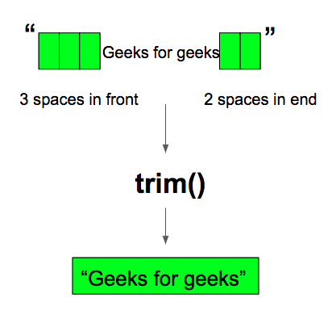

# String

## trim()

官方文档介绍：

```
Returns a string whose value is this string, with all leading and trailing space removed, where space is defined as any character whose codepoint is less than or equal to 'U+0020' (the space character).
返回字符串的副本，移除任何前导空白和尾部空白。其中空格定义为任何代码点<='\u0020'（空格字符）的字符

If this String object represents an empty character sequence, or the first and last characters of character sequence represented by this String object both have codes that are not space (as defined above), then a reference to this String object is returned.
如果此 String 对象表示一个空字符序列，或者此 String 对象表示的字符序列的第一个和最后一个字符的代码都大于 '\u0020'（空格字符），则返回对此 String 对象的引用。

Otherwise, if all characters in this string are space (as defined above), then a String object representing an empty string is returned.
否则，若字符串中没有代码大于 '\u0020' 的字符，则创建并返回一个表示空字符串的新 String 对象。

Otherwise, let k be the index of the first character in the string whose code is not a space (as defined above) and let m be the index of the last character in the string whose code is not a space (as defined above). A String object is returned, representing the substring of this string that begins with the character at index k and ends with the character at index m-that is, the result of this.substring(k, m + 1).
否则，假定 k 为字符串中代码大于 '\u0020' 的第一个字符的索引，m 为字符串中代码大于 '\u0020' 的最后一个字符的索引。创建一个新的 String 对象，它表示此字符串中从索引 k 处的字符开始，到索引 m 处的字符结束的子字符串，即 this.substring(k, m+1) 的结果。

This method may be used to trim space (as defined above) from the beginning and end of a string.
这个方法可以用于去除string中首尾的空格

Returns:
a string whose value is this string, with all leading and trailing space removed, or this string if it has no leading or trailing space.
```

### 作用

去除输入字符串的首尾空字符

### 使用（来源于GeeksForGeeks）

https://www.geeksforgeeks.org/java-string-trim-method-example/

The **java lang.string.trim()**is a built-in function that eliminates leading and trailing spaces. The Unicode value of space character is ‘\u0020’. The trim() method in java checks this Unicode value before and after the string, if it exists then removes the spaces and returns the omitted string.



**Syntax:**

```
public String trim()  
The method accepts no parameters. 
```

**Returns:**
It returns the omitted string with no leading and trailing spaces.

**Example:**

To show the working of **string trim()** function.

```java
// Java program to demonstrate working 
// of java string trim() method 
   
class Gfg { 
    // driver code 
    public static void main(String args[]) 
    {
        // trims the trailing and leading spaces  
        String s = " geeks for geeks has all java functions to read  ";  
        System.out.println(s.trim());   

        // trims the leading spaces  
        s = " Chetna loves reading books";  
        System.out.println(s.trim());  
    } 
} 
```

**Output:**

```
geeks for geeks has all java functions to read
Chetna loves reading books
```

### 源码分析

#### 源码实现

```java
public String trim() {
    int len = value.length;
    int st = 0;
    char[] val = value;    /* avoid getfield opcode */

    // 从头向后找到第一个大于' '的字符
    while ((st < len) && (val[st] <= ' ')) {
        st++;
    }
    
    // 从尾向前找到第一个大于' '的字符
    while ((st < len) && (val[len - 1] <= ' ')) {
        len--;
    }
    // 调用substring方法获取指定位置的字符串
    return ((st > 0) || (len < value.length)) ? substring(st, len) : this;
}
```

#### /* avoid getfield opcode */ 含义

这段注释的含义从字面上来看是避免getField操作，getFiled的含义在《深入理解Java虚拟机》中有介绍：


这边的含义是获取指定String的实例域，并将其压入栈顶

测试代码：

```java
package cn.chasedream.memory;

import cn.chasedream.utils.Out;

/**
 * @author Zhang Dezhou
 * @Description
 * @date 2020/1/12 16:18
 */
public class ValueCopy {
    private final char[] value;

    private ValueCopy(char[] value) {
        this.value = value;
    }

    public static void main(String[] args) {
        char[] chars = {'a', 'b', '0', '\n'};
        ValueCopy vc = new ValueCopy(chars);
    }

    private void testCommonGet() {
        Out.print(value[0]);
        Out.print(value[1]);
        Out.print(value[2]);
    }

    private void testAvoidGetField() {
        char[] b = value;
        Out.print(b[0]);
        Out.print(b[1]);
        Out.print(b[2]);
    }
}
```

```java
// 字节码
// class version 52.0 (52)
// access flags 0x21
public class cn/chasedream/memory/ValueCopy {

  // compiled from: ValueCopy.java

  // access flags 0x12
  private final [C value

  // access flags 0x2
  private <init>([C)V
   L0
    LINENUMBER 13 L0
    ALOAD 0
    INVOKESPECIAL java/lang/Object.<init> ()V
   L1
    LINENUMBER 14 L1
    ALOAD 0
    ALOAD 1
    PUTFIELD cn/chasedream/memory/ValueCopy.value : [C
   L2
    LINENUMBER 15 L2
    RETURN
   L3
    LOCALVARIABLE this Lcn/chasedream/memory/ValueCopy; L0 L3 0
    LOCALVARIABLE value [C L0 L3 1
    MAXSTACK = 2
    MAXLOCALS = 2

  // access flags 0x9
  public static main([Ljava/lang/String;)V
   L0
    LINENUMBER 18 L0
    ICONST_4
    NEWARRAY T_CHAR
    DUP
    ICONST_0
    BIPUSH 97
    CASTORE
    DUP
    ICONST_1
    BIPUSH 98
    CASTORE
    DUP
    ICONST_2
    BIPUSH 48
    CASTORE
    DUP
    ICONST_3
    BIPUSH 10
    CASTORE
    ASTORE 1
   L1
    LINENUMBER 19 L1
    NEW cn/chasedream/memory/ValueCopy
    DUP
    ALOAD 1
    INVOKESPECIAL cn/chasedream/memory/ValueCopy.<init> ([C)V
    ASTORE 2
   L2
    LINENUMBER 20 L2
    RETURN
   L3
    LOCALVARIABLE args [Ljava/lang/String; L0 L3 0
    LOCALVARIABLE chars [C L1 L3 1
    LOCALVARIABLE vc Lcn/chasedream/memory/ValueCopy; L2 L3 2
    MAXSTACK = 4
    MAXLOCALS = 3

  // access flags 0x2
  private testCommonGet()V
   L0
    LINENUMBER 23 L0
    ALOAD 0
    GETFIELD cn/chasedream/memory/ValueCopy.value : [C
    ICONST_0
    CALOAD
    INVOKESTATIC cn/chasedream/utils/Out.print (C)V
   L1
    LINENUMBER 24 L1
    ALOAD 0
    GETFIELD cn/chasedream/memory/ValueCopy.value : [C
    ICONST_1
    CALOAD
    INVOKESTATIC cn/chasedream/utils/Out.print (C)V
   L2
    LINENUMBER 25 L2
    ALOAD 0
    GETFIELD cn/chasedream/memory/ValueCopy.value : [C
    ICONST_2
    CALOAD
    INVOKESTATIC cn/chasedream/utils/Out.print (C)V
   L3
    LINENUMBER 26 L3
    RETURN
   L4
    LOCALVARIABLE this Lcn/chasedream/memory/ValueCopy; L0 L4 0
    MAXSTACK = 2
    MAXLOCALS = 1

  // access flags 0x2
  private testAvoidGetField()V
   L0
    LINENUMBER 29 L0
    ALOAD 0
    GETFIELD cn/chasedream/memory/ValueCopy.value : [C
    ASTORE 1
   L1
    LINENUMBER 30 L1
    ALOAD 1
    ICONST_0
    CALOAD
    INVOKESTATIC cn/chasedream/utils/Out.print (C)V
   L2
    LINENUMBER 31 L2
    ALOAD 1
    ICONST_1
    CALOAD
    INVOKESTATIC cn/chasedream/utils/Out.print (C)V
   L3
    LINENUMBER 32 L3
    ALOAD 1
    ICONST_2
    CALOAD
    INVOKESTATIC cn/chasedream/utils/Out.print (C)V
   L4
    LINENUMBER 33 L4
    RETURN
   L5
    LOCALVARIABLE this Lcn/chasedream/memory/ValueCopy; L0 L5 0
    LOCALVARIABLE b [C L1 L5 1
    MAXSTACK = 2
    MAXLOCALS = 2
}
```

从上面的字节码可以看到，通过testCommonGet方法访问实例域会不断地执行getField操作去，而通过testAvoidGetField方法getFied方法只会执行一次，就是一开始的char[] b = value操作时。

因此如果方法中需要大量引用实例域变量的时候，使用方法中的局部变量代替引用可以减少getfield操作的次数，提高性能。

## substring()

### 源码分析

```java
public String substring(int beginIndex, int endIndex) {
    // 数组越界检查
    if (beginIndex < 0) {
        throw new StringIndexOutOfBoundsException(beginIndex);
    }
    if (endIndex > value.length) {
        throw new StringIndexOutOfBoundsException(endIndex);
    }
    
    // 获取的长度检查
    int subLen = endIndex - beginIndex;
    if (subLen < 0) {
        throw new StringIndexOutOfBoundsException(subLen);
    }
    // 若获取的就是(0，len), 则直接返回当前对象；否则创建一个新的String对象
    return ((beginIndex == 0) && (endIndex == value.length)) ? this
        : new String(value, beginIndex, subLen);
}
```


## String(char value[], int offset, int count)

### 源码分析

```java
public String(char value[], int offset, int count) {
    // 偏移量检查
    if (offset < 0) {
        throw new StringIndexOutOfBoundsException(offset);
    }
    // 长度检查
    if (count <= 0) {
        // 长度为负数
        if (count < 0) {
            throw new StringIndexOutOfBoundsException(count);
        }
        // 长度等于0且偏移量等于当前value的长度，则将当前value置为空字符
        if (offset <= value.length) {
            this.value = "".value;
            return;
        }
    }
    // Note: offset or count might be near -1>>>1.
    if (offset > value.length - count) {
        throw new StringIndexOutOfBoundsException(offset + count);
    }
    
    // 通过Arrays.copyOfRange将value指向新的地址
    this.value = Arrays.copyOfRange(value, offset, offset+count);
}
```


# Arrays

## copyOfRange

### 源码分析

```java
public static char[] copyOfRange(char[] original, int from, int to) {
    int newLength = to - from;
    if (newLength < 0)
        throw new IllegalArgumentException(from + " > " + to);
    // 开辟新的数组空间
    char[] copy = new char[newLength];
    // 调用System.arraycopy给新开辟的数组进行赋值
    System.arraycopy(original, from, copy, 0,
                     Math.min(original.length - from, newLength));
    return copy;
}
```

# System

## arraycopy

### 源码分析

```java
// java层代码，最终调用到native层
public static native void arraycopy(Object src,  int  srcPos, Object dest, int destPos, int length);
```

```c
// c实现代码
```

# Map

## HashMap


### keySet()


## WeakHashMap

# List

## ArrayList

## LinkeList

# Set

## TreeSet


