[TOC]


# Java基础

## 面向对象的特征

继承、封装和多态，以及最新归进来的抽象

1.继承：继承了某对象，将拥有该对象的方法和属性，并且可以拓展自己的属性和方法，可以增加代码的重用性、拓展和修改；

2.封装：即不需要关心内部的实现；

3.多态：能够去重写继承对象的方法，例如Tostring（）方法，也可以说成是父对象提供的一个接口，然后让各子类来根据实际情况进行完善

（这里插一句：重写展现的是父类与子类之间的多态，而重载展现的是同一类的多态，详见“重写和重载的区别”）

4.抽象：抽象的特性是每一位半编程人员必须掌握的技术。

## 面向对象的设计原则

### 基本的五大原则：SOLID

https://www.youtube.com/watch?v=v-2yFMzxqwU，2009年Gotham Ruby Conference中Duke University的Sandi Metz女士对SOLID Object-Oriented Design的主题演讲：

Rigid：every change causes a cascade of related changes.

In rigid app , everything is connected to everything else.

Fragile: distant and apperently unrelated code breaks after every change

fragility is a lot like rigidity, the difference between fragile app and rigid app is fragile apps are rigid but you can't tell by looking

Immobile: cannot reuse your code

Viscous: behaving badly is the most attractive alternative

<font color=red>Dependencies are killing you and the key point of S.M speech is to talk about how to design can save.</font>

SOLID, this is an acronym that is made by Robert Martin.

Single Responsibility: there should never be more than one reason for a class to change.

Open/Closed: a module should be open for extension but colsed for modificaton.

Liskov Substitution: subclasses should be substitutable for their base classes

Interface segregation: many client specific interfaces are better than one general purpose interface.

Dependency inversion: depend upon abstractions. Don not depend upon concretions.

Common theme is they're about managing the dependencies in our  application.These pricinples are strategies that you can apply to  lead you a place where your application has minimal entanglements with each other so that you can change things.

<font color=red>**Design is all about Dependencies**</font>

To avoid dependencies, our code should be:

* loosely coupled
* highly cohensive
* easily composable
* context indenpendent


Is it DRY?

Does it have one responsibility?

Does everything in it change at the same rate?

Does it depend on things that change less often the it does?

#### 单一职责原则（Single responsibility principle

> **定义**
>
> SRP: there should never be more than one reason for a class to change.
>
> 应该有且仅有一个原因引起类的变更。即一个类，最好只负责一件事情，只有一个引起它变化的原因。

> **问题的由来**
>
> （引用自：https://blog.csdn.net/zhengzhb/article/details/7278174）
>
> 问题由来：
>
> 类T负责两个不同的职责：职责P1，职责P2。当由于职责P1需求发生改变而需要修改类T时，有可能会导致原本运行正常的职责P2功能发生故障。
>
> 解决方案：
>
> 遵循单一职责原则。分别建立两个类T1、T2，使T1完成职责P1功能，T2完成职责P2功能。这样，当修改类T1时，不会使职责P2发生故障风险；同理，当修改T2时，也不会使职责P1发生故障风险。
>
> 说到单一职责原则，很多人都会不屑一顾。因为它太简单了。稍有经验的程序员即使从来没有读过设计模式、从来没有听说过单一职责原则，在设计软件时也会自觉的遵守这一重要原则，因为这是常识。在软件编程中，谁也不希望因为修改了一个功能导致其他的功能发生故障。而避免出现这一问题的方法便是遵循单一职责原则。虽然单一职责原则如此简单，并且被认为是常识，但是即便是经验丰富的程序员写出的程序，也会有违背这一原则的代码存在。为什么会出现这种现象呢？因为有职责扩散。所谓职责扩散，就是因为某种原因，职责P被分化为粒度更细的职责P1和P2。
>
>  比如：类T只负责一个职责P，这样设计是符合单一职责原则的。后来由于某种原因，也许是需求变更了，也许是程序的设计者境界提高了，需要将职责P细分为粒度更细的职责P1，P2，这时如果要使程序遵循单一职责原则，需要将类T也分解为两个类T1和T2，分别负责P1、P2两个职责。但是在程序已经写好的情况下，这样做简直太费时间了。所以，简单的修改类T，用它来负责两个职责是一个比较不错的选择，虽然这样做有悖于单一职责原则。（这样做的风险在于职责扩散的不确定性，因为我们不会想到这个职责P，在未来可能会扩散为P1，P2，P3，P4……Pn。所以记住，在职责扩散到我们无法控制的程度之前，立刻对代码进行重构。）

举例说明，用一个类描述动物呼吸这个场景：

```java
class Animal{
	public void breathe(String animal){
		System.out.println(animal+"呼吸空气");
	}
}
public class Client{
	public static void main(String[] args){
		Animal animal = new Animal();
		animal.breathe("牛");
		animal.breathe("羊");
		animal.breathe("猪");
	}
}
```

运行结果：

```
牛呼吸空气
羊呼吸空气
猪呼吸空气
```

程序上线后，发现问题了，并不是所有的动物都呼吸空气的，比如鱼就是呼吸水的。修改时如果遵循单一职责原则，需要将Animal类细分为陆生动物类Terrestrial，水生动物Aquatic，代码如下：

```java
class Terrestrial{
	public void breathe(String animal){
		System.out.println(animal+"呼吸空气");
	}
}
class Aquatic{
	public void breathe(String animal){
		System.out.println(animal+"呼吸水");
	}
}

public class Client{
	public static void main(String[] args){
		Terrestrial terrestrial = new Terrestrial();
		terrestrial.breathe("牛");
		terrestrial.breathe("羊");
		terrestrial.breathe("猪");
		
        Aquatic aquatic = new Aquatic();
        aquatic.breathe("鱼");
	}
}
```


运行结果：

```
牛呼吸空气
羊呼吸空气
猪呼吸空气
鱼呼吸水
```

我们会发现如果这样修改花销是很大的，除了将原来的类分解之外，还需要修改客户端。而直接修改类Animal来达成目的虽然违背了单一职责原则，但花销却小的多，代码如下：

```java
class Animal{
	public void breathe(String animal){
		if("鱼".equals(animal)){
			System.out.println(animal+"呼吸水");
		}else{
			System.out.println(animal+"呼吸空气");
		}
	}
}

public class Client{
	public static void main(String[] args){
		Animal animal = new Animal();
		animal.breathe("牛");
		animal.breathe("羊");
		animal.breathe("猪");
		animal.breathe("鱼");
	}
}
```

可以看到，这种修改方式要简单的多。但是却存在着隐患：有一天需要将鱼分为呼吸淡水的鱼和呼吸海水的鱼，则又需要修改Animal类的breathe方法，而对原有代码的修改会对调用“猪”“牛”“羊”等相关功能带来风险，也许某一天你会发现程序运行的结果变为“牛呼吸水”了。这种修改方式直接在代码级别上违背了单一职责原则，虽然修改起来最简单，但隐患却是最大的。还有一种修改方式：

```java
class Animal{
	public void breathe(String animal){
		System.out.println(animal+"呼吸空气");
	}
	public void breathe2(String animal){
		System.out.println(animal+"呼吸水");
	}
}
public class Client{
	public static void main(String[] args){
		Animal animal = new Animal();
		animal.breathe("牛");
		animal.breathe("羊");
		animal.breathe("猪");
		animal.breathe2("鱼");
	}
}
```


可以看到，这种修改方式没有改动原来的方法，而是在类中新加了一个方法，这样虽然也违背了单一职责原则，但在方法级别上却是符合单一职责原则的，因为它并没有动原来方法的代码。这三种方式各有优缺点，那么在实际编程中，采用哪一中呢？其实这真的比较难说，需要根据实际情况来确定。我的原则是：只有逻辑足够简单，才可以在代码级别上违反单一职责原则；只有类中方法数量足够少，才可以在方法级别上违反单一职责原则；

例如本文所举的这个例子，它太简单了，它只有一个方法，所以，无论是在代码级别上违反单一职责原则，还是在方法级别上违反，都不会造成太大的影响。实际应用中的类都要复杂的多，一旦发生职责扩散而需要修改类时，除非这个类本身非常简单，否则还是遵循单一职责原则的好。

遵循单一职责原的优点有：

* 可以降低类的复杂度，一个类只负责一项职责，其逻辑肯定要比负责多项职责简单的多；
* 提高类的可读性，提高系统的可维护性；
* 变更引起的风险降低，变更是必然的，如果单一职责原则遵守的好，当修改一个功能时，可以显著降低对其他功能的影响

需要说明的一点是单一职责原则不只是面向对象编程思想所特有的，只要是模块化的程序设计，都适用单一职责原则。

#### 开放关闭原则（Open-closed principle）

Classes, methods or functions should be Open for extension (new functionality) and Closed for modification.

#### 里式替换原则（Liskov substitution principle）

> 定义（是什么）：
>
> 

> 使用场景（产生的原因）：

#### 接口隔离原则（Interface segregation principle）:

#### 依赖倒置（Dependency inversion principle）:

### 新增

#### 迪米特法则

#### DRY

Don't repeat yourself.不要写重复的代码

如果一个相同的代码块出现在相同的地方，则需要考虑其是否可以单独作为一个方法存在；或者你是在多处使用一个硬编码的值，则需要考虑将其作为public final 常量。这样做的好处是便于维护。

#### Encapsulate What Changes

#### Favor Composition over Inheritance

有两种常用的能够重用已经编写的代码：继承和组合，它们都有其各自的优缺点。但是，一般来说，如果可能的话，通常更倾向于组合而不是继承。

组合相对于继承来说显得更加灵活。

#### Programming for Interface not implementation

程序应该面向接口编程而不是面向具体实现编程。这样当有新的实现的时候，使用接口编程将会变得非常灵活。

具体来说，你应该在变量，方法的返回值和参数上使用接口类型，例如使用基类类型来存储对象而不是子类类型。如：

````java
// Good
List numbers = getNumbers(); 
// Bad
ArrayList numbers = getNumbers();
````

#### Delegation principles


## Java中面向对象的6个概念

根源：https://raygun.com/blog/oop-concepts-java/


### [Abstraction](https://raygun.com/blog/oop-concepts-java/#abstraction)

抽象旨在向用户隐藏复杂的实现，仅向他们展现他们所关心的相关信息。 例如，如果您想开车，则无需了解其内部工作原理。 Java类也是如此。 您可以使用抽象类或接口隐藏内部实现的细节。 在抽象级别上，您只需要定义方法签名（名称和参数列表），并让每个类以自己的方式实现它们。

抽象的特性：

* Hides the underlying complexity of data（隐藏数据的复杂性）
* Helps avoid repetitive code（代码的复用）
* Presents only the signature of internal functionality（只显示内部功能的方法签名）
* Gives flexibility to programmers to change the implementation of the abstract behaviour（编程人员可以灵活地改变抽象行为的内部实现）
* Partial abstraction (0-100%) can be achieved with abstract classes（抽象内中可以有抽象方法，也可以由普通方法；抽象类中可以没有抽象方法，一个类中如果有任意一个方法声明为抽象方法，那么包含这个方法的类必须声明为抽象类；子类必须完全实现父类的抽象方法，可以不重写父类的普通方法；这也就是所谓的部分抽象）
* Total abstraction (100%) can be achieved with interfaces（实现接口的类必须完全实现接口中声明的普通方法，默认public abstract修饰，即所谓的100%抽象；在Java1.8中接口中引入了默认方法，由default进行修饰，默认是public修饰的）

### [Encapsulation](https://raygun.com/blog/oop-concepts-java/#encapsulation)

封装使得我们能够保护存储在类中的数据免受系统范围（system-wide）的访问。顾名思义，他可以像生活中的胶囊一样保护类的内部内容。我们可以通过将字段（类变量）保持私有并为每个字段提供公共的getter和setter方法来实现Java中的封装。Java Bean是完全封装的类的示例。

封装的特性：

- Restricts direct access to data members (fields) of a class.（严格限制访问类的成员变量）
- Fields are set to private（成员被设置为private属性）
- Each field has a getter and setter method（每一个成员都有对应的getter和setter方法）
- Getter methods return the field（getter方法返回成员对应的成员变量）
- Setter methods let us change the value of the field（setter方法让我们能够设置成员变量）

### [Inheritance](https://raygun.com/blog/oop-concepts-java/#inheritance)

继承使得创建一个子类继承父类的成员和方法成为可能。子类可以覆盖父类的方法和值，但这不是必须的。子类可以在父类的基础上增加新的数据和功能。父类通常又叫做超类或基类，子类通常又叫做子类或派生类。Java中使用extends关键字在代码中实现继承的原理。

继承的特性：

- A class (child class) can extend another class (parent class) by inheriting its features.（一个类可以通过extends关键字继承自另外一个类）
- Implements the DRY (Don’t Repeat Yourself) programming principle.（实现了DRY原则）
- Improves code reusability.（提高了代码的复用性）
- Multilevel inheritance is allowed in Java (a child class can have its own child class as well).（Java中多层继承是允许的，子类也可以有其自己的子类）
- Multiple inheritances are not allowed in Java (a class can’t extend more than one class).（Java中不允许多重继承，即extends后面不能紧跟多个类）

### [Polymorphism](https://raygun.com/blog/oop-concepts-java/#polymorphism)

多态是指以不同的方式执行特定的动作的能力。在Java中，多态可以采用两种形式：方法重载和方法重写。

当类中存在具有相同名称的各种方法时，此时会发生方法重载；调用它们时，将根据其参数的数量，顺序和类型来区分它们。

当子类覆盖其父类的方法时，将发生方法覆盖。

多态的特性：

- The same method name is used several times.（同一个方法名出现多次）
- Different methods of the same name can be called from the object.（对象可以调用相同名称的不同方法）
- <font color=red>**All Java objects can be considered polymorphic (at the minimum, they are of their own type and instances of the Object class)**</font>.（所有的Java的对象都可以被视为多态的，至少它们是Object的示例）
- Example of <font color=red>**static polymorphism**</font> in Java is method overloading.（Java中静态多态的示例是方法重载）
- Example of <font color=red>**dynamic polymorphism**</font> in Java is method overriding.（Java中动态多态的示例是方法重载）

### [Association](https://raygun.com/blog/oop-concepts-java/#association)

来自：https://www.geeksforgeeks.org/association-composition-aggregation-java/

除了上面的几个OOP原则之外，还有另外三个其他的概念（关联、聚合和组合），可以在程序设计时加以使用。聚合是一种特殊的关联形式，而组合是一种特殊的聚合形式。


关联只是意味着两个不相关的类之间建立关系的行为。例如，当您在同一个类中声明两个不同类型的字段（例如Car和Bicycle）并使它们彼此交互时，就执行了关联。

关联的特性：

- Two separate classes are associated through their objects.（两个单独的类通过它们的对象关联）
- The two classes are unrelated, each can exist without the other one.（两个类没有相关性，每一个类都可以脱离另外一个单独存在）
- Can be a one-to-one, one-to-many, many-to-one, or many-to-many relationship.（可以一对一，一对多，多对一或多对多的关系）

例：

```java
// Java program to illustrate the 
// concept of Association
import java.io.*;

// class bank
class Bank 
{
    private String name;

    // bank name
    Bank(String name)
    {
        this.name = name;
    }

    public String getBankName()
    {
        return this.name;
    }
} 

// employee class 
class Employee
{
    private String name;

    // employee name 
    Employee(String name) 
    {
        this.name = name;
    }

    public String getEmployeeName()
    {
        return this.name;
    } 
}

// Association between both the 
// classes in main method
class Association 
{
    public static void main (String[] args) 
    {
        Bank bank = new Bank("Axis");
        Employee emp = new Employee("Neha");

        System.out.println(emp.getEmployeeName() + 
               " is employee of " + bank.getBankName());
    }
}
```

输出：

```
Neha is employee of Axis
```

上面的示例中两个单独的类Bank和Empolyee通过它们的对象相关联。Bank可以有许多empolyees，所以这是一对多的关系。


### [Aggregation](https://raygun.com/blog/oop-concepts-java/#aggregation)

聚合是一种较严格的关联关系。当您通过对象关联的两个类之间 存在单向的对应关系（one-way（HAS-A）），此时两者非关系便是聚合关系。 聚合关系通常是描述“has-a”/“whole-part”的关系的。聚合类包含着其他类的引用，其之间存在所有权的关系，所引用的每个类均被视为聚合类的一部分。

之所以存在所有权，是因为在聚合关系中不能够存在循环引用的问题。如果A包含B的引用，而B又包含A的引用，则无法确定明确的所有权关系；这时候两者非关系仅仅是关联关系。

例如，假设Student类存储了学校中各个学生的信息。现在假定存在Subject类，其中包含有关特定科目的信息（如历史，地理）。如果将Student类定义为含有Subject对象，则可以说Student对象具有Subject对象。“Subject”对象构成“Student”对象的一部分-毕竟，没有学生一个科目也不学。因此，Student对象拥有Subject对象。

聚合的特性：

- One-directional association.（单向关联关系，例如，部门可以有学生，但反过来不行）
- Represents a HAS-A relationship between two classes.（表示两个类之间存在HAS-A的关系）
- Only one class is dependent on the other.（只有一个类依赖于其他类）
-  **both the entries can survive individually**（两个都可以单独存在而不会影响另外一个实体）


例如：

```java
// Java program to illustrate
//the concept of Aggregation.
import java.io.*;
import java.util.*;

// student class
class Student 
{
    String name;
    int id ;
    String dept;

    Student(String name, int id, String dept) 
    {

        this.name = name;
        this.id = id;
        this.dept = dept;

    }
}

/* Department class contains list of student
Objects. It is associated with student
class through its Object(s). */
class Department 
{

    String name;
    private List<Student> students;
    Department(String name, List<Student> students) 
    {

        this.name = name;
        this.students = students;

    }

    public List<Student> getStudents() 
    {
        return students;
    }
}

/* Institute class contains list of Department
Objects. It is asoociated with Department
class through its Object(s).*/
class Institute 
{

    String instituteName;
    private List<Department> departments;

    Institute(String instituteName, List<Department> departments)
    {
        this.instituteName = instituteName;
        this.departments = departments;
    }

    // count total students of all departments
    // in a given institute 
    public int getTotalStudentsInInstitute()
    {
        int noOfStudents = 0;
        List<Student> students; 
        for(Department dept : departments)
        {
            students = dept.getStudents();
            for(Student s : students)
            {
                noOfStudents++;
            }
        }
        return noOfStudents;
    }

} 

// main method
class GFG
{
    public static void main (String[] args) 
    {
        Student s1 = new Student("Mia", 1, "CSE");
        Student s2 = new Student("Priya", 2, "CSE");
        Student s3 = new Student("John", 1, "EE");
        Student s4 = new Student("Rahul", 2, "EE");

        // making a List of 
        // CSE Students.
        List <Student> cse_students = new ArrayList<Student>();
        cse_students.add(s1);
        cse_students.add(s2);

        // making a List of 
        // EE Students
        List <Student> ee_students = new ArrayList<Student>();
        ee_students.add(s3);
        ee_students.add(s4);

        Department CSE = new Department("CSE", cse_students);
        Department EE = new Department("EE", ee_students);

        List <Department> departments = new ArrayList<Department>();
        departments.add(CSE);
        departments.add(EE);

        // creating an instance of Institute.
        Institute institute = new Institute("BITS", departments);

        System.out.print("Total students in institute: ");
        System.out.print(institute.getTotalStudentsInInstitute());
    }
}
```

输出：

```
Total students in institute: 4
```

在此示例中，存在一个机构拥有 CSE，EE等部门。 每个部门都有学生。 因此，我们创建一个Institute类，该类拥有Department(s)对象的引用。 这意味着Institute类通过其对象与Department类相关联。 并且Department类还引用了Student类的一个或多个对象（即对象列表），这意味着它通过其对象与Student类相关联。
它代表一种Has-A关系。


<font color=red>**通过聚合可以实现代码的复用**</font>

### [Composition](https://raygun.com/blog/oop-concepts-java/#composition)


组合是一种较严格的聚合关系。关联的两个类相互高度依赖，且不能单独存在时，两者之间的关系就是组合关系。例如，以Car和Engine为例，如果没有Engine，Car就无法运行；而Engine脱离了Car也无法工作。对象之间的这种关系也称为part-of关系。

组合的特性：

- A restricted form of aggregation（有限制的聚合的关系）
- Represents a PART-OF relationship between two classes（代表一种oart-of的关系，即一个类是另一个类的一部分）
- Both classes are dependent on each other（实例是相互依赖的）
- If one class ceases to exist, the other can’t survive alone（如果一个类不存在了，那么另一个也不能存活）

以**Library**为例：

```java
// Java program to illustrate 
// the concept of Composition
import java.io.*;
import java.util.*;

// class book
class Book 
{

    public String title;
    public String author;

    Book(String title, String author)
    {

        this.title = title;
        this.author = author;
    }
}

// Libary class contains 
// list of books.
class Library 
{

    // reference to refer to list of books.
    private final List<Book> books;

    Library (List<Book> books)
    {
        this.books = books; 
    }

    public List<Book> getTotalBooksInLibrary(){

       return books;  
    }

}

// main method
class GFG 
{
    public static void main (String[] args) 
    {

        // Creating the Objects of Book class.
        Book b1 = new Book("EffectiveJ Java", "Joshua Bloch");
        Book b2 = new Book("Thinking in Java", "Bruce Eckel");
        Book b3 = new Book("Java: The Complete Reference", "Herbert Schildt");

        // Creating the list which contains the 
        // no. of books.
        List<Book> books = new ArrayList<Book>();
        books.add(b1);
        books.add(b2);
        books.add(b3);

        Library library = new Library(books);

        List<Book> bks = library.getTotalBooksInLibrary();
        for(Book bk : bks){

            System.out.println("Title : " + bk.title + " and "
            +" Author : " + bk.author);
        }
    }
}
```

输出：

```
Title : EffectiveJ Java and  Author : Joshua Bloch
Title : Thinking in Java and  Author : Bruce Eckel
Title : Java: The Complete Reference and  Author : Herbert Schildt
```

上面的示例中，图书馆可以拥有同一主题或者不同主题的书籍。所以，如果图书馆被销毁，则该特定图书馆中的所有书籍都会被销毁。也就是说，没有图书馆就不可能存在书籍。

### Aggregation vs Composition（聚合vs组合）

聚合和组合的比较：

1. 依赖：聚合代表被关联的一方可以独立于关联一方而存在的关系，比如说，银行和雇员，将银行对象删除后，雇员对象仍然存在。然后，组合代表着被关联的一方不能独立于一方而存在的关系，比如，人没有心脏就无法生存，心脏也是相对人而言的，没有人，也就没有心脏这么一说。
2. 关系类型：聚合是has-a关系，组合是part-of关系。
3. 关联类型：组合是一种强关联关系，聚合是一种弱关联关系。

例：

```java
// Java program to illustrate the
// difference between Aggregation
// Composition.

import java.io.*;

// Engine class which will 
// be used by car. so 'Car'
// class will have a field 
// of Engine type.
class Engine 
{
    // starting an engine.
    public void work()
    {
        System.out.println("Engine of car has been started ");
    }

}

// Engine class
final class Car 
{
    // For a car to move, 
    // it need to have a engine.
    private final Engine engine; // Composition
    //private Engine engine;     // Aggregation

    Car(Engine engine)
    {
        this.engine = engine;
    }

    // car start moving by starting engine
    public void move() 
    {
        //if(engine != null)
        {
            engine.work();
            System.out.println("Car is moving ");
        }
    }
}

class GFG 
{
    public static void main (String[] args) 
    {
        // making an engine by creating 
        // an instance of Engine class.
        Engine engine = new Engine();

        // Making a car with engine.
        // so we are passing a engine 
        // instance as an argument while
        // creating instace of Car.
        Car car = new Car(engine);
        car.move();
    }
}
```

输出：

```
Engine of car has been started 
Car is moving 
```

在聚合关系的代码实现中，汽车通过引擎对象来实现部分功能，但是，引擎不是总存在汽车的内部，引擎可以换，并且可以从汽车中卸下来，这也是为什么聚合关系中，引擎对象是非final的。

## Java中面向对象的特征

### 类

#### 内部类

> 内部类的定义：

灵魂之问

1. 为什么需要内部类
2. 内部类的特性

### 接口

### 抽象类


### Enum

### 之间的关系


## 重写和重载的区别 

### 重写(Override)

在任何面向对象的编程语言中，Oerriding是一个重要的特性，其允许直接子类/间接子类提供其父类或超类的某个方法的特殊实现。当子类中的方法和超类中方法具有：相同的方法名，相同的方法参数或签名，相同的返回值（或者是父类返回值的子类）；那么子类中的这个方法就被称作覆写了父类的方法。


方法重写是Java实现运行时多态的一种方式。具体执行哪个类里面的方法将由其调用的对象决定。 如果使用父类的对象来调用该方法，则将执行父类中的方法，但是如果使用子类的对象来调用该方法，则将执行子类中的方法。 换句话说，确定要执行哪个重写方法的是被引用对象的类型（而不是引用变量的类型）所决定的。

重写是子类对父类的允许访问的方法的实现过程进行重新编写, 返回值和形参都不能改变。**即外壳不变，核心重写！**

重写的好处在于子类可以根据需要，定义特定于自己的行为。 也就是说子类能够根据需要实现父类的方法。

重写方法不能抛出新的检查异常或者比被重写方法申明更加宽泛的异常。例如： 父类的一个方法申明了一个检查异常 IOException，但是在重写这个方法的时候不能抛出 Exception 异常，因为 Exception 是 IOException 的父类，只能抛出 IOException 的子类异常。

在面向对象原则里，重写意味着可以重写任何现有方法。

```java
// A Simple Java program to demonstrate 
// method overriding in java 
  
// Base Class 
class Parent { 
    void show() 
    { 
        System.out.println("Parent's show()"); 
    } 
} 
  
// Inherited class 
class Child extends Parent { 
    // This method overrides show() of Parent 
    @Override
    void show() 
    { 
        System.out.println("Child's show()"); 
    } 
} 
  
// Driver class 
class Main { 
    public static void main(String[] args) 
    { 
        // If a Parent type reference refers 
        // to a Parent object, then Parent's 
        // show is called 
        Parent obj1 = new Parent(); 
        obj1.show(); 
  
        // If a Parent type reference refers 
        // to a Child object Child's show() 
        // is called. This is called RUN TIME 
        // POLYMORPHISM. 
        Parent obj2 = new Child(); 
        obj2.show(); 
    } 
} 
```

**Output:**

```
Parent's show()
Child's show()
```

#### 方法的重写规则

1. 重写和访问修饰符

   重写的方法相比于被重写方法的访问修饰符可以更广，但是不能更窄。例如父类中的一个protected修饰的实例方法，其子类中重写的方法访问修饰符可以用public修饰，但是不能用private修饰。如果这样做的话，会产生编译错误。

   ```java
   // A Simple Java program to demonstrate 
   // Overriding and Access-Modifiers 
     
   class Parent { 
       // private methods are not overridden 
       private void m1() 
       { 
           System.out.println("From parent m1()"); 
       } 
     
       protected void m2() 
       { 
           System.out.println("From parent m2()"); 
       } 
   } 
     
   class Child extends Parent { 
       // new m1() method 
       // unique to Child class 
       private void m1() 
       { 
           System.out.println("From child m1()"); 
       } 
     
       // overriding method 
       // with more accessibility 
       @Override
       public void m2() 
       { 
           System.out.println("From child m2()"); 
       } 
   } 
     
   // Driver class 
   class Main { 
       public static void main(String[] args) 
       { 
           Parent obj1 = new Parent(); 
           obj1.m2(); 
           Parent obj2 = new Child(); 
           obj2.m2(); 
       } 
   }
   ```

   **Output:**

   ```
   From parent m2()
   From child m2()
   ```

2. fianl关键字修饰的方法不能够被重写 

   如果我们不想让一个方法被重写，可以将其申明为final。可以查看 [Using final with Inheritance](https://www.geeksforgeeks.org/using-final-with-inheritance-in-java/)

   ```java
   // A Java program to demonstrate that 
   // final methods cannot be overridden 
     
   class Parent { 
       // Can't be overridden 
       final void show() {} 
   } 
     
   class Child extends Parent { 
       // This would produce error 
       void show() {} 
   } 
   ```

   **Output:**

   ```
   13: error: show() in Child cannot override show() in Parent
       void show() {  }
            ^
     overridden method is final
   ```

3. 静态方法不能够被重写（方法重写-voerride vs 方法隐藏-hide）

   当子类中定义了和基类中具有相同签名的静态方法时，此行为被称为方法隐藏。

   下面的表格中总结了基类和子类中具有相同方法签名的声明为静态和非静态时会出现的结果：

   |                          |   SUPERCLASS INSTANCE METHOD   |    SUPERCLASS STATIC METHOD    |
   | :----------------------: | :----------------------------: | :----------------------------: |
   | SUBCLASS INSTANCE METHOD |           Overrides            | Generates a compile-time error |
   |  SUBCLASS STATIC METHOD  | Generates a compile-time error |             Hides              |

   ```java
   // Java program to show that 
   // if the static method is redefined by 
   // a derived class, then it is not 
   // overriding, it is hiding 
     
   class Parent { 
       // Static method in base class 
       // which will be hidden in subclass 
       static void m1() 
       { 
           System.out.println("From parent "
                              + "static m1()"); 
       } 
     
       // Non-static method which will 
       // be overridden in derived class 
       void m2() 
       { 
           System.out.println("From parent "
                              + "non-static(instance) m2()"); 
       } 
   } 
     
   class Child extends Parent { 
       // This method hides m1() in Parent 
       static void m1() 
       { 
           System.out.println("From child static m1()"); 
       } 
     
       // This method overrides m2() in Parent 
       @Override
       public void m2() 
       { 
           System.out.println("From child "
                              + "non-static(instance) m2()"); 
       } 
   } 
     
   // Driver class 
   class Main { 
       public static void main(String[] args) 
       { 
           Parent obj1 = new Child(); 
     
           // As per overriding rules this 
           // should call to class Child static 
           // overridden method. Since static 
           // method can not be overridden, it 
           // calls Parent's m1() 
           obj1.m1(); 
     
           // Here overriding works 
           // and Child's m2() is called 
           obj1.m2(); 
       } 
   } 
   ```

   **Output:**

   ```
   From parent static m1()
   From child non-static(instance) m2()
   ```

   强化说明：

   我们可以在子类中声明和父类相同的静态方法，但是这并不认为是重写，因为这并不是运行时多态。因此答案是“不能”。

   如果任何子类定义了一个和父类具有相同签名的静态方法，那么子类中的静态方法将会隐藏父类中的静态方法。

   ```java
   /* Java program to show that if static method is redefined by 
      a derived class, then it is not overriding. */
     
   // Superclass 
   class Base { 
         
       // Static method in base class which will be hidden in subclass  
       public static void display() { 
           System.out.println("Static or class method from Base"); 
       } 
         
        // Non-static method which will be overridden in derived class  
        public void print()  { 
            System.out.println("Non-static or Instance method from Base"); 
       } 
   } 
     
   // Subclass 
   class Derived extends Base { 
         
       // This method hides display() in Base  
       public static void display() { 
            System.out.println("Static or class method from Derived"); 
       } 
         
       // This method overrides print() in Base  
       public void print() { 
            System.out.println("Non-static or Instance method from Derived"); 
      } 
   } 
     
   // Driver class 
   public class Test { 
       public static void main(String args[ ])  { 
          Base obj1 = new Derived(); 
            
          // As per overriding rules this should call to class Derive's static  
          // overridden method. Since static method can not be overridden, it  
          // calls Base's display()  
          obj1.display();   
            
          // Here overriding works and Derive's print() is called  
          obj1.print();      
       } 
   } 
   ```

   Output:

   ```
   Static or class method from Base
   Non-static or Instance method from Derived
   ```

   下面是针对Java中static方法重写的一些重要的点：

   1）对于类（静态）方法，方法的调用是针对类，而不是针对具体的某个实例对象。这意味着方法的调用是在编译时决定的。

   2）对于实例（非静态）方法，方法的调用发生在具体的实例对象上。这意味着方法的调用是在运行时决定的。

   3）实例方法不能重写static方法，并且static方法不能隐藏实例方法。例如，以下程序有两个编译错误。

   ```java
   /* Java program to show that if static methods are redefined by 
      a derived class, then it is not overriding but hidding. */
     
   // Superclass 
   class Base { 
         
       // Static method in base class which will be hidden in subclass  
       public static void display() { 
           System.out.println("Static or class method from Base"); 
       } 
         
        // Non-static method which will be overridden in derived class  
        public void print()  { 
            System.out.println("Non-static or Instance method from Base"); 
       } 
   } 
     
   // Subclass 
   class Derived extends Base { 
         
       // Static is removed here (Causes Compiler Error)  
       public void display() { 
           System.out.println("Non-static method from Derived"); 
       } 
         
       // Static is added here (Causes Compiler Error)  
       public static void print() { 
           System.out.println("Static method from Derived"); 
      } 
   } 
   ```

   4）在子类中，我们可以重载继承自父类的方法。这种方法的重载既不会隐藏父类的方法又不会重写父类的方法-这是一个新的方法，子类独有的方法。

4. private修饰的方法不能被重写

   私有方法不能够被重写，因为它们是编译时绑定的。因此我们甚至无法覆盖子类中的私有方法

5. 重写方法的返回值必须和子类相同或者是父类返回值得派生类

   从Java 5.0及以后，子类重写父类的方法可以返回不同的返回值，但是子类的返回值类型必须是父类返回值的派生类。这种现象又被称作[**covariant return type**](https://www.geeksforgeeks.org/covariant-return-types-java/)。

6. 从子类调用重写方法：我们可以使用[super 关键字](http://quiz.geeksforgeeks.org/super-keyword/)在重写方法中调用父类方法。

   ```java
   // A Java program to demonstrate that overridden 
   // method can be called from sub-class 
     
   // Base Class 
   class Parent { 
       void show() 
       { 
           System.out.println("Parent's show()"); 
       } 
   } 
     
   // Inherited class 
   class Child extends Parent { 
       // This method overrides show() of Parent 
       @Override
       void show() 
       { 
           super.show(); 
           System.out.println("Child's show()"); 
       } 
   } 
     
   // Driver class 
   class Main { 
       public static void main(String[] args) 
       { 
           Parent obj = new Child(); 
           obj.show(); 
       } 
   } 
   ```

   **Output:**

   ```
   Parent's show()
   Child's show()
   ```

7. 构造函数不能够重写

   我们不能覆盖构造函数，因为父类和子类永远不能具有相同名称的构造函数（构造函数名称必须始终与类名称相同）。

8. 重写的异常处理，下面是重写时和异常相关的两条原则

   * 原则1：如果被重写的超类方法没有抛出任何异常，则子类的重写方法只能抛出 [unchecked exception](https://www.geeksforgeeks.org/checked-vs-unchecked-exceptions-in-java/)，抛出checked异常会导致编译时错误。

     ```java
     /* Java program to demonstrate overriding when  
       superclass method does not declare an exception 
     */
       
     class Parent { 
         void m1() 
         { 
             System.out.println("From parent m1()"); 
         } 
       
         void m2() 
         { 
             System.out.println("From parent  m2()"); 
         } 
     } 
       
     class Child extends Parent { 
         @Override
         // no issue while throwing unchecked exception 
         void m1() throws ArithmeticException 
         { 
             System.out.println("From child m1()"); 
         } 
       
         @Override
         // compile-time error 
         // issue while throwin checked exception 
         void m2() throws Exception 
         { 
             System.out.println("From child m2"); 
         } 
     } 
     ```

     **Output:**

     ```
     error: m2() in Child cannot override m2() in Parent
         void m2() throws Exception{ System.out.println("From child m2");}
              ^
       overridden method does not throw Exception
     ```

   * 原则2：如果被重写的超类方法抛出了异常，则子类重写的方法只能抛出相同的异常或者子类异常。 在Exception层次结构中抛出父异常将导致编译时错误。如果子类重写方法未引发任何异常，也没有问题。

     ```java
     // Java program to demonstrate overriding when 
     // superclass method does declare an exception 
       
     class Parent { 
         void m1() throws RuntimeException 
         { 
             System.out.println("From parent m1()"); 
         } 
     } 
       
     class Child1 extends Parent { 
         @Override
         // no issue while throwing same exception 
         void m1() throws RuntimeException 
         { 
             System.out.println("From child1 m1()"); 
         } 
     } 
     class Child2 extends Parent { 
         @Override
         // no issue while throwing subclass exception 
         void m1() throws ArithmeticException 
         { 
             System.out.println("From child2 m1()"); 
         } 
     } 
     class Child3 extends Parent { 
         @Override
         // no issue while not throwing any exception 
         void m1() 
         { 
             System.out.println("From child3 m1()"); 
         } 
     } 
     class Child4 extends Parent { 
         @Override
         // compile-time error 
         // issue while throwing parent exception 
         void m1() throws Exception 
         { 
             System.out.println("From child4 m1()"); 
         } 
     } 
     ```

     **Output:**

     ```
     error: m1() in Child4 cannot override m1() in Parent
         void m1() throws Exception
              ^
       overridden method does not throw Exception
     ```

9. 抽象方法的重写

   接口或抽象类中的抽象方法应在派生的具体类中重写，否则将引发编译时错误。

10. **synchronized/strictfp**方法的重写

    带有方法的synced / strictfp修饰符的存在对覆盖规则没有影响，即，synchronized / strictfp方法可能会覆盖非sync / strictfp方法，反之亦然。

#### 注意

1. 在c++中，我们需要virtual关键字去达到重写或者运行时多态的目的。在Java中的方法默认是virtual的。

2. 可以有多级方法重写

   ```java
   // A Java program to demonstrate 
   // multi-level overriding 
     
   // Base Class 
   class Parent { 
       void show() 
       { 
           System.out.println("Parent's show()"); 
       } 
   } 
     
   // Inherited class 
   class Child extends Parent { 
       // This method overrides show() of Parent 
       void show() { System.out.println("Child's show()"); } 
   } 
     
   // Inherited class 
   class GrandChild extends Child { 
       // This method overrides show() of Parent 
       void show() 
       { 
           System.out.println("GrandChild's show()"); 
       } 
   } 
     
   // Driver class 
   class Main { 
       public static void main(String[] args) 
       { 
           Parent obj1 = new GrandChild(); 
           obj1.show(); 
       } 
   } 
   ```

   **Output:**

   ```
   GrandChild's show()
   ```

3. 重写vs重载

   * 重载是同样的方法名拥有不同的方法签名。重写是同样的方法名，同样的方法签名但是通过继承连接不同的类

     

   * 重载是编译时多态的例子，而重写是运行时多态的一个例子

#### 为什么需要方法重写？

如前所述，重写允许Java支持运行时多态。多态于面向对象编程至关重要，原因之一是：多态性允许基类指定对其所有的子类通用的方法，同时允许子类根据需要对某些或者所有的方法的进行各自的内部实现。重写是Java实现多态性的“one interface， mutiple methods”方面的另一种方式。

Dynamic Method Dispatch是面向对象设计带来的最强大的机制之一，它影响了代码的重用性和健壮性。

重写方法使我们可以调用任何派生类的方法，甚至不知道派生类的对象的类型。

#### 总结

- 访问权限不能比父类中被重写的方法的访问权限更低。例如：如果父类的一个方法被声明为 public，那么在子类中重写该方法就不能声明为 protected。
- 声明为 final 的方法不能被重写。
- 声明为 static 的方法不能被重写，但是能够被再次声明。
- 返回类型与被重写方法的返回类型可以不相同，但是必须是父类返回值的派生类（java5 及更早版本返回类型要一样，java7 及更高版本可以不同）。
- 参数列表必须完全与被重写方法的相同。
- 父类的成员方法只能被它的子类重写。
- 子类和父类在同一个包中，那么子类可以重写父类所有方法，除了声明为 private 和 final 的方法。
- 子类和父类不在同一个包中，那么子类只能够重写父类的声明为 public 和 protected 的非 final 方法。
- 重写的方法能够抛出任何非强制异常，无论被重写的方法是否抛出异常。但是，重写的方法不能抛出新的强制性异常，或者比被重写方法声明的更广泛的强制性异常，反之则可以。
- 构造方法不能被重写。
- 如果不能继承一个方法，则不能重写这个方法。

### 重载(Overload)

重载(overloading) 是在一个类里面，方法名字相同，而方法签名不同（输入参数的个数或者输入参数的类型）；返回类型可以相同也可以不同。

重载和编译时多态相关。

```java
// Java program to demonstrate working of method 
// overloading in Java. 
  
public class Sum { 
  
    // Overloaded sum(). This sum takes two int parameters 
    public int sum(int x, int y) 
    { 
        return (x + y); 
    } 
  
    // Overloaded sum(). This sum takes three int parameters 
    public int sum(int x, int y, int z) 
    { 
        return (x + y + z); 
    } 
  
    // Overloaded sum(). This sum takes two double parameters 
    public double sum(double x, double y) 
    { 
        return (x + y); 
    } 
  
    // Driver code 
    public static void main(String args[]) 
    { 
        Sum s = new Sum(); 
        System.out.println(s.sum(10, 20)); 
        System.out.println(s.sum(10, 20, 30)); 
        System.out.println(s.sum(10.5, 20.5)); 
    } 
} 
```

Output :

```
30
60
31.0
```

#### 相关的问题：

* Q.当传入的实际参数类型和方法参数类型不匹配时会怎样。

  编译器蚕蛹以下步骤：

  1. 类型转换，但转换为同一系列中的更高类型（就范围而言）。
  2. 将类型转换为下一个更高的类型族（假设如果没有长数据类型可用于int数据类型，则它将搜索float数据类型）。

  让我们来看一个具体的示例，用来理解这些概念

  ```java
  class Demo { 
      public void show(int x) 
      { 
          System.out.println("In int" + x); 
      } 
      public void show(String s) 
      { 
          System.out.println("In String" + s); 
      } 
      public void show(byte b) 
      { 
          System.out.println("In byte" + b); 
      } 
  } 
  class UseDemo { 
      public static void main(String[] args) 
      { 
          byte a = 25; 
          Demo obj = new Demo(); 
          obj.show(a); // it will go to byte argument 
          obj.show("hello"); // String 
          obj.show(250); // Int 
          // Since char is 
          // not available, so the datatype 
          // higher than char in terms of 
          // range is int. 
          obj.show('A'); 
          obj.show("A"); // String 
          // since float datatype 
          // is not available and so it's higher 
          // datatype, so at this step their 
          // will be an error.
          obj.show(7.5); 
      } 
  } 
  ```

* 优势是什么？

  我们不必为执行相同操作的函数创建和记住不同的名称。 例如，在我们的代码中，如果Java不支持重载，则必须创建方法名称，例如sum1，sum2，…或sum2Int，sum3Int，…等。

* 能否根据返回值进行方法重载么？

  我们不能够根据返回值进行方法重载。这种行为就和C++中的一致。看下面这段代码

  ```java
  public class Main { 
      public int foo() { return 10; } 
    
      // compiler error: foo() is already defined 
      public char foo() { return 'a'; } 
    
      public static void main(String args[]) 
      { 
      } 
  } 
  ```

  然而，下面的情况是允许的：

  ```java
  // Java program to demonstrate the working of method 
  // overloading in static methods 
  public class Main { 
    
      public static int foo(int a) { return 10; } 
      public static char foo(int a, int b) { return 'a'; } 
    
      public static void main(String args[]) 
      { 
          System.out.println(foo(1)); 
          System.out.println(foo(1, 2)); 
      } 
  } 
  ```

  Output:

  ```
  10
  a
  ```

  ```java
  // Java program to demonstrate working of method 
  // overloading in  methods 
  class A { 
      public int foo(int a) { return 10; } 
    
      public char foo(int a, int b) { return 'a'; } 
  } 
    
  public class Main { 
    
      public static void main(String args[]) 
      { 
          A a = new A(); 
          System.out.println(a.foo(1)); 
          System.out.println(a.foo(1, 2)); 
      } 
  } 
  ```

  Output:

  ```
  10
  a
  ```

* 静态方法可以重载么？

  静态方法时可以重载的。我们可以有两个甚至更多的同名，但是入参不相同的方法。例如，参考下面的Java程序。

  ```java
  // filename Test.java 
  public class Test { 
      public static void foo() { 
          System.out.println("Test.foo() called "); 
      } 
      public static void foo(int a) {  
          System.out.println("Test.foo(int) called "); 
      } 
      public static void main(String args[]) 
      {  
          Test.foo(); 
          Test.foo(10); 
      } 
  } 
  ```

  Output:

  ```
  Test.foo() called 
  Test.foo(int) called 
  ```

* 我们可以仅仅通过static关键字的有无来进行方法的重载么？

  Java中我们不能重载两个仅static有无的方法（参数列表完全一致），看下面的代码；这个行为和C++是一致的。

  ```java
  // filename Test.java 
  public class Test { 
      public static void foo() { 
          System.out.println("Test.foo() called "); 
      } 
      public void foo() { // Compiler Error: cannot redefine foo() 
          System.out.println("Test.foo(int) called "); 
      } 
      public static void main(String args[]) {  
          Test.foo(); 
      } 
  } 
  ```

  Output: Compiler Error, cannot redefine foo()

* 是否可以重载main()方法。

  和其他的static方法一样，我们可以重载Java中的main()方法。

  ```java
  // A Java program with overloaded main() 
  import java.io.*; 
    
  public class Test { 
    
      // Normal main() 
      public static void main(String[] args) 
      { 
          System.out.println("Hi Geek (from main)"); 
          Test.main("Geek"); 
      } 
    
      // Overloaded main methods 
      public static void main(String arg1) 
      { 
          System.out.println("Hi, " + arg1); 
          Test.main("Dear Geek", "My Geek"); 
      } 
      public static void main(String arg1, String arg2) 
      { 
          System.out.println("Hi, " + arg1 + ", " + arg2); 
      } 
  } 
  ```

  Output :

  ```
  Hi Geek (from main)
  Hi, Geek
  Hi, Dear Geek, My Geek
  ```

  重要的点：

  Java中main方法并不是另类的方法。除了main()方法可以像其他任何方法一样被重载之外；JVM始终会查找该方法签名来启动程序。

  * 普通的main方法充当JVM开始执行程序的入口
  * 我们可以重载Java中的main方法。但是，当我们运行您的程序时，该程序不会执行重载的main方法，我们只需要从实际的main方法中调用重载的main方法即可。

* Java是否支持运算符重载？

  和C++不同，Java不允许用户自定义重载运算符。Java内部重载了运算符，例如，+被重载以进行拼接

* 重写和重载的区别

  * 重载是相同的名称的函数具有不同的方法签名。重写是相同的函数，相同的签名，但是通过继承连接起来的不同的类

    

  * 重载是编译时多态的一个示例，而重写是运行时多态的一个示例。

#### **方法的重载规则**

- 被重载的方法必须改变参数列表(参数个数或类型不一样)；
- 被重载的方法可以改变返回类型；
- 被重载的方法可以改变访问修饰符；
- 被重载的方法可以声明新的或更广的检查异常；
- 方法能够在同一个类中或者在一个子类中被重载。
- 无法以返回值类型作为重载函数的区分标准。

#### 实例

Overloading.java 文件代码：

```java
public class Overloading {
    public int test(){
        System.out.println("test1");
        return 1;
    }
 
    public void test(int a){
        System.out.println("test2");
    }   
 
    //以下两个参数类型顺序不同
    public String test(int a,String s){
        System.out.println("test3");
        return "returntest3";
    }   
 
    public String test(String s,int a){
        System.out.println("test4");
        return "returntest4";
    }   
 
    public static void main(String[] args){
        Overloading o = new Overloading();
        System.out.println(o.test());
        o.test(1);
        System.out.println(o.test(1,"test3"));
        System.out.println(o.test("test4",1));
    }
}
```

### 重写与重载之间的区别

| 区别点   | 重载方法 | 重写方法                                       |
| :------- | :------- | :--------------------------------------------- |
| 参数列表 | 必须修改 | 一定不能修改                                   |
| 返回类型 | 可以修改 | 一定不能修改                                   |
| 异常     | 可以修改 | 可以减少或删除，一定不能抛出新的或者更广的异常 |
| 访问     | 可以修改 | 一定不能做更严格的限制（可以降低限制）         |

### 总结

方法的重写(Overriding)和重载(Overloading)是java多态性的不同表现，重写是父类与子类之间多态性的一种表现，重载可以理解成多态的具体表现形式。

- (1)方法重载是一个类中定义了多个方法名相同,而他们的参数的数量不同或数量相同而类型和次序不同,则称为方法的重载(Overloading)。
- (2)方法重写是在子类存在方法与父类的方法的名字相同,而且参数的个数与类型一样,返回值也一样的方法,就称为重写(Overriding)。
- (3)方法重载是一个类的多态性表现,而方法重写是子类与父类的一种多态性表现。

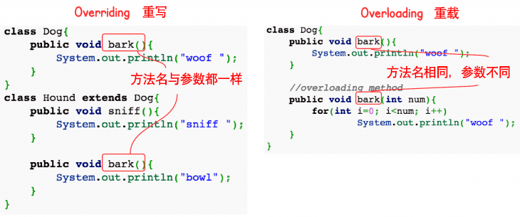

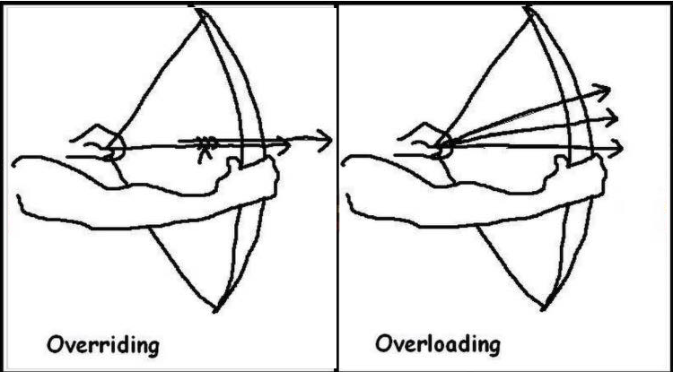

## Java中的保留字段

### 访问权限控制符

### 字段修饰符

#### static

#### final

#### volatile

## final, finally, finalize 的区别

1.final

final修饰类：不能被继承，没有子类。且final类中的方法默认是final的；设计时，如果确定这个类不需要有子类，类的实现细节不允许改变，并且确信这个类不会被扩展，那就设计为final类。

final修饰变量（静态变量，实例变量，局部变量）：表示常量，只能被赋值一次，赋值后值不再改变；

final修饰方法：不能被子类的方法覆盖，但可以被继承；

2.finally

https://www.ibm.com/developerworks/cn/java/j-lo-finally/?lnk=hm

异常处理时提供finally块来执行任何清除操作。不管有没有异常被抛出、捕获，finally块都会被执行（除了特别的情况，如调用System.exit(0)）。

try块中的内容是在无异常时执行到结束。

catch块中的内容，是在try块内容发生catch所声明的异常时，跳转到catch块中执行。

finally块则是无论异常是否发生，都会执行finally块的内容，所以在代码逻辑中有需要无论发生什么都必须执行的代码，就可以放在finally块中。

3.finalize:

finalize是方法名。java技术允许使用finalize（）方法在垃圾收集器将对象从内存中清除出去之前做必要的清理工作。这个方法是由垃圾收集器在确定这个对象没有被引用时对这个对象调用的。它是在object类中定义的，因此所有的类都继承了它。子类覆盖finalize（）方法以整理系统资源或者被执行其他清理工作。finalize（）方法是在垃圾收集器删除对象之前对这个对象调用的。

最新的jdk版本中不再提供该方法。

## Object类中有哪些方法（注意和新版本中的Object方法进行比较）

构造方法：Object（）

判断对象是否相等：hashcoe（），equals（Object）

线程相关：wait...，notify（）

复制对象：clone（）

垃圾回收：finalize（）

对象本身相关内容：toString（）

getClass（） 

​     

**equals:**

​	== 和equal的区别：==表示变量值完全相同（对于基础类型，地址中存储的是值，引用类型则存储指向实际对象的地址）；equals表示的是对象的内容完全相同，此处的内容多指对象的特性/属性。

​	查阅源码，我们可以看到，Object的equals内部也是用==判断是否相等（https://blog.csdn.net/striverli/article/details/52997927）

**hashcode:**

​	java约定，重写equals方法必须重写hashcode方法

​	同一对象调用hashcode，返回的hashcode是相同的，前提是equals没有被修改，同一对象执行到不同时刻，返回的hashcode无需一致

​	<font color=red>**即严格的数学逻辑表示为： 两个对象相等 <=> equals()相等 => hashCode()相等。因此，重写equlas()方法必须重写hashCode()方法，以保证此逻辑严格成立，同时可以推理出：hasCode()不相等 => equals（）不相等 <=> 两个对象不相等。**</font>

​	哈希码方便集合中对象的查找，通过预先计算对象的哈希码，然后通过哈希算法计算出其在Set中存放的位置，直接判断此位置上是否已有此对象即可：

​     一、当我们向一个set、HashMap、HashSet、HashTable集合中添加某个元素，集合会首先调用该对象的hashCode方法，

​     这样就可以直接定位它所存储的位置，若该处没有其他元素，则直接保存。

​     若该处已经有元素存在，就调用equals方法来匹配这两个元素是否相同，相同则不存，不同则散列到其他位置

​     二、hashCode重要么？

​     对于List集合、数组而言，他就是一个累赘，不重要；但是对于HashMap、HashSet、HashTable而言，它变得异常重要

**toString:**：

​	由对象的类型和其哈希码唯一确定，同一类型但不相等的两个对象分别调用toString（）

**wait（...），notify，notifyAll:**

​	wait（）：Causes the current thread to wait until another thread invokes the [notify()](https://docs.oracle.com/javase/8/docs/api/java/lang/Object.html#notify--) method or the [notifyAll()](https://docs.oracle.com/javase/8/docs/api/java/lang/Object.html#notifyAll--) method for this object.

​	wait（long）/wait（long，int）：等待超时

​	wait和notify一般都是配对使用，且只能在同步代码块中才能使用，因为要对持有锁的线程操作

​	1、wait(...)方法调用后当前线程将立即阻塞，且释放其所持有的同步代码块中的锁，直到被唤醒或超时或打断后且重新获取到锁后才能继续执行；

​	2、notify()/notifyAll()方法调用后，其所在线程不会立即释放所持有的锁，直到其所在同步代码块中的代码执行完毕，此时释放锁，因此，如果其同步代码块后还有代码，其执行则依赖于JVM的线程调度。

​	sleep和wait的区别就是：调用sleep方法的线程不会释放对象锁，而调用wait方法会释放对象锁

## 为什么wait，notify这些会放在object中（java面试高频问题之一）

   简单来说是因为锁，Sychronized锁可以是任意对象，让当前线程等待某个对象的锁，当然应该通过这个对象来操作。而不是用当前线程来操作，因为当前线程可能会等待多个线程的锁，如果通过线程来操作，就非常复杂。

  本质上：这些个方法在操作同步线程时，都必须要标识它们操作线程的锁，同一个锁上的被等待线程，可以被同一个锁上的notify唤醒，不可以对不同锁中的线程进行唤醒->等待和唤醒必须是同一个锁

   概括为：

   1.这些方法用于同步中

   2.这些方法时必须要标识所属的同步的锁

   3.锁可以是任意对象，所以任意对象调用的方法一定是定义在Object类中

## java的单例模式

​     懒汉式，饿汉式、静态内部类加载、双重检查锁(能够手写直接跑通)

·    **请写出5种常见到的runtime exception**

​       Nullpointer exception ,arrayoutofboundsexception, classcastexception,illegalearguementsexception,unsupportedoperationexception

·    **int** **和** **Integer** 有什么区别，**Integer**的值缓存范围

​     base：

​     int是基本数据类型，integaer是int的包装类；integer必须实例化之后才能引用，而int不需要；integer实际是对象的引用，指向new之后的integer对象，而int直接存储改值；integer默认是null，而int默认是0

​     advance：

·    **包装类，装箱和拆箱**

​     Integer i = 5；//编译器自动装箱，实际调用Integer.Valueof(5)

​     int j = i；

## String、StringBuilder、StringBuffer

​     执行速度上：StringBuilder > StringBuffer > String

​     String一旦创建对象之后是不可更改的，Java中对String的操作实际上是一个不断创建新的对象并且回收旧的对象的过程，所以执行速度会慢

​     而StringBuilder和StringBuffer的对象是变量，对变量的操作就是直接对该对象进行更改，而不进行创建和回收操作，所以执行速度会快很多

​     线程安全上：

​     StringBuilder是线程不安全的，而StringBuffer是线程安全的；因为StringBuffer中很多方法可以带有Synchronized关键字，所以可以保证线程安全；正因为加了synchronized关键字，所以效率会有所降低；在单线程的情况下，还是建议使用速度比较快的stringbuilder。

### 灵魂之问

1. new String(byte[]) 之后干了哪些事情?

2. 分析下面代码片段，试问图片能不能正确保存？

   ```JAVA
   private void methodA() {
       String data = "..." // 接收到的网络图片数据，经过Base64编码后形成的字符串
       byte[] decode = Base64.decode(data, Base64.DEFAULT);
       // 假设此处只能获取到decode后的byte[], 但是methodB的参数又只能是String，通过如下调用会存在什么问题，图片能不能正确保存
       methodB(new String(decode););
   }
   
   private void methodB(String str) {
       OutputStream os = ...; // os打开的文件名称格式正确
       os.write(str.getBytes());
   }
   ```

3. （插一个Android的问题）Android中的String.java中为什么所有的构造方法都没有具体实现，都是简单地抛出了一个异常？其具体的实现在哪里？

   ```java
   /**
        * Initializes a newly created {@code String} object so that it represents
        * the same sequence of characters as the argument; in other words, the
        * newly created string is a copy of the argument string. Unless an
        * explicit copy of {@code original} is needed, use of this constructor is
        * unnecessary since Strings are immutable.
        *
        * @param  original
        *         A {@code String}
        */
   public String(String original) {
       // Android-changed: Constructor unsupported as all calls are intercepted by the runtime.
       throw new UnsupportedOperationException("Use StringFactory instead.");
   }
   ```

   我们看到上面的一句注释：// Android-changed: Constructor unsupported as all calls are intercepted by the runtime.

   请你说明String构造函数是怎样被runtime拦截的？或者说说runtime拦截一个类的构造方法的原理？

## **抽象类和接口有什么区别**

​    相似：都不能被实例化，都可以包含抽象方法，实现接口或继承抽象类的普通子类必须实现这些方法

​     区别：

​     一个类可以实现多个接口，而最多只能继承一个直接父类，包括抽象类；接口中所有方法都是抽象的，不能有具体实现，而抽象类可以有普通方法的具体实现，接口中的方法必须为public修饰

**java10.0**中更改了一些特性，接口中可以有方法的具体实现


应用场景：

   当涉及到公共方法的具体实现时，可以使用抽象类，将这些公共方法写到抽象类中，也就是说抽象方法可以实现代码复用

   当涉及到多重继承的时候，这时，接口的优势就发挥了，这种情况下可以使用接口；简单来说，抽象类是对根源的概括，而接口是对动作的概括，以男女为例来说，他们的抽象类是人，而人的动作包括吃饭...，可以定义成接口；即关注事物的本质的时候，用抽象类，关注一个操作的时候，用接口

  使用的时候就需要考虑周全，抽象类的代价较高，要编写出所有子类的共性；接口则会弱化很多，关注的是动作。

## 说说反射的用途及实现

概念：反射机制是在运行状态中，对于任意一个类，都能够知道这个类的所有属性和方法

## 说说自定义注解的场景及实现

## HTTP请求的GET与POST方式的区别


同时，可见性方面，Get请求，请求的数据会被附加在URL之后，以?分割URL和传输数据，多个参数是用&连接，所有的非ASCII编码字符都要编码之后进行传输；而POST请求会把请求数据放置在HTTP请求包的包体中。

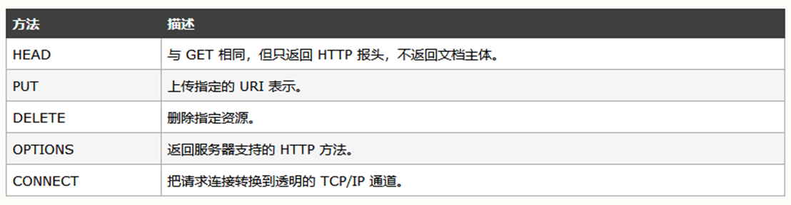

## 列出自己常用的JDK包

  java.lang:语言包，该包中主要包含的类有：

  1.Object类：所有类的父类，其中定义的方法其他类都可以使用

  2.数据类型包装类：简单数据类型的包装类，Integer，Float，Boolean等

  3.数学类Math：提供常量和数学函数，包括E和PI常数及abs(),sin(),cos(),min(),max(),random()等方法，这些常量和方法都是静态的

  4.字符串类String和StringBuffer类

  5.系统和运行时类：System类提供一个独立于具体系统资源的编程界面；Runtime类可以直接访问运行时资源

  6.操作类：Class和Classloafder类，Class提供了对象运行时的若干信息，Classloader是一个抽象类，它提供了将类名转换成文件名并在文件系统中查找并装载该文件的方法

  7.线程类：Thread类。Java是一个多线程环境，主要有Thread，ThreadDeath，ThreadGroup，Runnnable

  8.错误和异常处理类：Throwable（所有错误和异常处理的父类），Exception（处理异常，需要用户捕获处理）和Error（处理硬件错误，不要用户捕获处理）

  9.进程类Process：支持系统进程，当Runtime执行系统命令时，会建立处理系统进程的Process

 

java.util:

实用包提供了各种实用功能的类，主要包括日期类、数据结构类和随机数类等。

1.日期类：包括Date（获取日期和时间）、Calendar（抽象类，日历类）和GregorianCalendar（Calendar类的子类）类。

2.数据结构类：包括链表类LinkedList、向量类Vector、栈类Stack和散列表类Hashtable等。

3.随机数类Random：封装了Math类中的random方法，并提供了更多的辅助功能。

 

[java.io](http://java.io/):

[java.io](http://java.io/)提供了系统输入输出类和接口，只要包括输入流类InputStream和输出流OutputStream就可以实现文件的输入输出、管道的数据传输以及网络数据传输的功能

 

[java.net](http://java.net/):

[java.net](http://java.net/)提供了实现网络应用程序的类，主要包括用于实现Socket通信的Socket类，此外还提供了便于处理URL的类

## MVC设计思想

概念：

MVC是一种框架模式，而不是一种设计模式，框架通常是实现代码重用，而设计模式往往是设计上的重用，架构则介于两者之间，部分代码重用，部分设计重用。

model（业务数据）：通常情况下处理的任务最多。比如对数据库的操作，模型返回的数据是和将要显示的格式无关，这样的数据能为多个视图提供数据，减少了代码的重复性

view（视图）：与用户交互的界面

control（控制器）：控制器接收用户的输入并调用模型和视图去完成用户需求


大体工作流程：用户触发事件时，view层会发送指令到Controller层，接着Controller去通知model层更新释放数据 ，model层更新释放完数据直接显示在view层上。

之所以设计MVC，我想是为了实现model层和view层的代码分离，从而使一个程序可以表现出不同的形式，Controlller则是为了保证model和view之间的同步

 

但是有时候，有些逻辑实现要在view层，有时会跨越controller层，直接和model进行交互，这些在view里实现的业务逻辑不能被其他view重用。这就是MVC和MVP最主要的区别

 

优点：MVC 式的出现不仅实现了功能模块和显示模块的分离，同时它还提高了应用系统的可维护性、可扩展性、可移植性和组件的可复用性

1：耦合性低

　　视图层和业务层分离，这样就允许更改视图层代码而不用重新编译模型和控制器代码,[例如，改写jsp,html,css,javascirpt的代码，并不需要重启服务器]同样，一个应用的业务流程或者业务规则的改变只需要改动MVC的模型层即可[例如，换表名查询，更改一些查询的条件，或者使用动态sql还是静态的sql，只用更改model即可]。因为模型与控制器和视图相分离，所以很容易改变应用程序的数据层和业务规则。

2：重用性高

　　随着技术的不断进步，需要用越来越多的方式来访问应用程序。MVC模式允许使用各种不同样式的视图来访问同一个服务器端的代码，因为多个视图能共享一个模型，它包括任何WEB(HTTP)浏览器或者无线浏览器(wap)，比如，用户可以通过电脑也可通过手机来订购某样产品，虽然订购的方式不一样，但处理订购产品的方式是一样的。由于模型返回的数据没有进行格式化，所以同样的构件能被不同的界面使用。[例如，模型层实现了同样的分页，不同的视图层可以用一万种不同的显示方法，例如百度搜索下面的分页和谷歌搜索下面的分页]MVC使开发和维护用户接口的技术含量降低。

3：部署快

　　使用MVC模式使开发时间得到相当大的缩减，它使程序员(Java开发人员)集中精力于业务逻辑，界面程序员(HTML和JSP开发人员)集中精力于表现形式上。[例如，前端后端可以分工作业，效率高，方便多开发人员间的分工]

4：可维护性高

　　分离视图层和业务逻辑层也使得WEB应用更易于维护和修改。[例如：如果想改业务逻辑，只用改业务逻辑，如果想改视图，只用改视图，如果想增加功能，只需要增加即可，分层最大的好处就是容易后期维护降低维护成本，和增加新的功能，提高代码重用性，从而提高开发效率]

5：有利软件工程化管理

　　由于不同的层各司其职，每一层不同的应用具有某些相同的特征，有利于通过工程化、工具化管理程序代码。控制器也提供了一个好处，就是可以使用控制器来联接不同的模型和视图去完成用户的需求，这样控制器可以为构造应用程序提供强有力的手段。给定一些可重用的模型和视图，控制器可以根据用户的需求选择模型进行处理，然后选择视图将处理结果显示给用户。[因为控制器重点在于分配，更好的结合视图和模型]

 

缺点：

1：没有明确的定义

　　完全理解MVC并不是很容易。使用MVC需要精心的计划，由于它的内部原理比较复杂，所以需要花费一些时间去思考。同时由于模型和视图要严格的分离，这样也给调试应用程序带来了一定的困难。每个构件在使用之前都需要经过彻底的测试。

2：不适合小型，中等规模的应用程序

　　花费大量时间将MVC应用到规模并不是很大的应用程序通常会得不偿失。[这个是最明显的缺点，例如我们仅仅需要到数据库查信息，如果不分层设计我们可以直接从视图型层到模型去访问，效率上会有所提高，如果以代码的复杂性为代价，多了一层，代码量大大增加，在这个时候就降低了开发效率]

3：增加系统结构和实现的复杂性

　　对于简单的界面，严格遵循MVC，使模型、视图与控制器分离，会增加结构的复杂性，并可能产生过多的更新操作，降低运行效率。

4：视图与控制器间的过于紧密的连接

　　视图与控制器是相互分离，但却是联系紧密的部件，视图没有控制器的存在，其应用是很有限的，反之亦然，这样就妨碍了他们的独立重用。[例如，不可能总是在jsp页面中直接访问模型，一般放在逻辑控制层进行处理，servlet]

5：视图对模型数据的低效率访问

　　依据模型操作接口的不同，视图可能需要多次调用才能获得足够的显示数据。对未变化数据的不必要的频繁访问，也将损害操作性能。[例如，页面的有一部分数据我并没有更新，但是提交到模型层照样会去获得返回显示 ]

 

6：一般高级的界面工具或构造器不支持模式

　　改造这些工具以适应MVC需要和建立分离的部件的代价是很高的，会造成MVC使用的困难。

总结：

　　优点：分层，结构清晰，耦合性低，大型项目代码的复用性得到极大的提高，开发人员分工明确，提高了开发的效率，维护方便，降低了维护成本。

　　缺点：简单的小型项目，使用MVC设计反而会降低开发效率，层和层虽然相互分离，但是之间关联性太强，没有做到独立的重用。

## MVP设计思想

   view层和modle层不再相互可知，完全解耦，取而代之的是Presenter层充当桥梁的作用

​    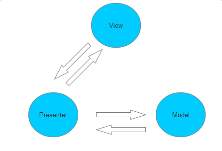

   动手实现https://www.jianshu.com/p/8586f5042579

https://blog.csdn.net/github_33304260/article/details/53161277

https://blog.csdn.net/jdsjlzx/article/details/51174396

## MVVM设计思想

​     

 

## 什么是Java序列化和反序列化，如何实现Java序列化？或者请解释Serializable 接口的作用

  概念：Serializable接口，以及相关的东西，全部都在java io里面

  序列化：把对象转换为字节序列的过程

  反序列化：把字节序列恢复为对象的过程

 

  什么情况下需要序列化：

  1.需要把内存中的对象保存到一个文件中的时候

  2.想用套接字在网络上传输对象的时候

  3.想用RMI（Remote method invocation）传输对象的时候

 

  如何实现序列化：

  对象实现Serializable接口，调用ObjectOutputStream.writeObject()

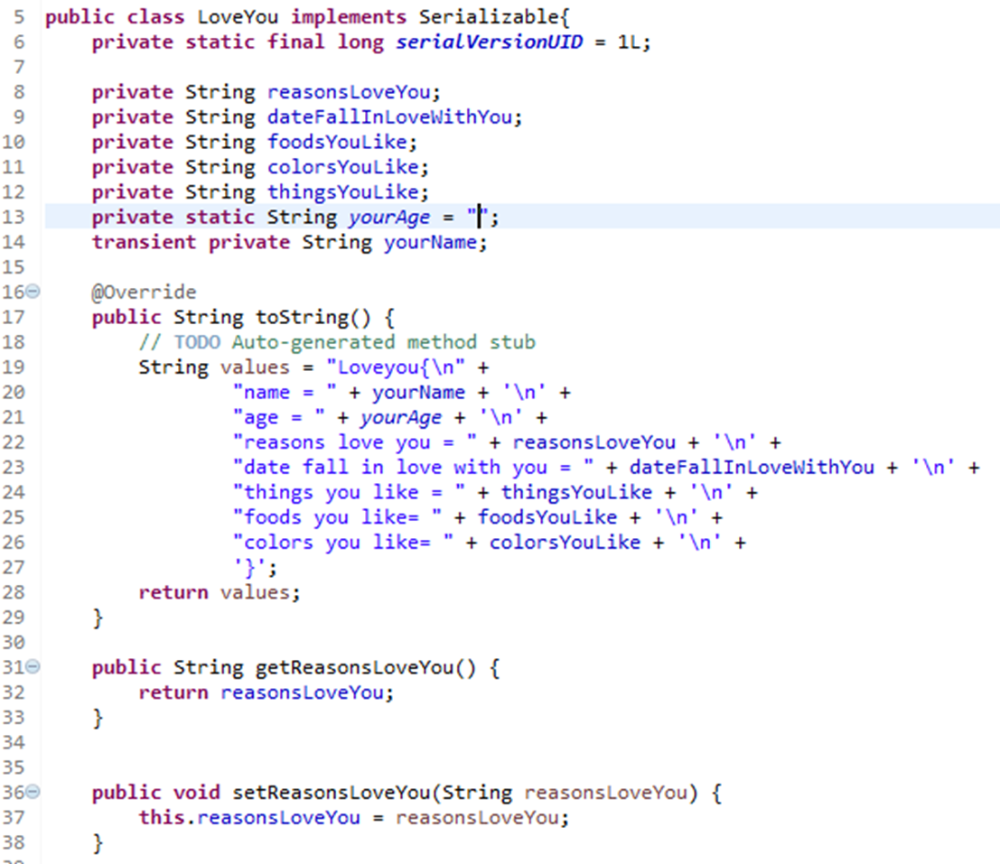

 

下面是程序执行入口：

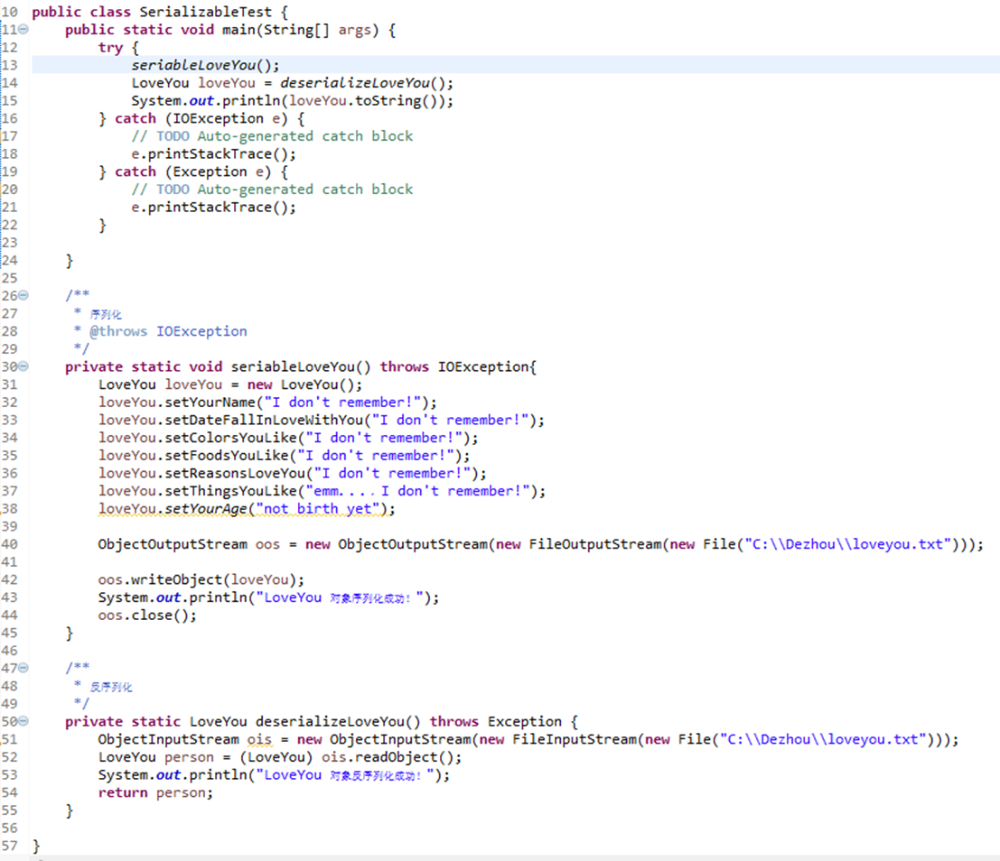

 

执行结果：

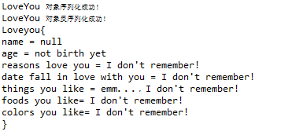

 

上面的几行代码：

1.实现对象的序列化和反序列化

2.transient关键字修饰的属性，不会被序列化，可以看到设置的name为null（前提是我们实现的是Serializable接口，若实现的是Externalizable接口另当别论）

3.我们预先定义的静态变量也被序列化了？

 

验证静态变量能不能被序列化，我们先进行序列化，然后将main方法中的第十三行注释掉，并修改LoveYou类中的第十三行修改为：**private** **static** String *yourAge* = "birth last year";

重新执行代码，结果输出：

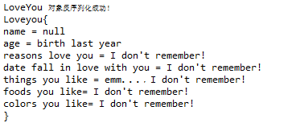

我们的对象age变为"birth last year"（去年出生的)，并不是序列化时的"not birth yet"(还没有出生),所以static属性，不能序列化

  

***serialVersionUID\******的作用和用法\***

 

现在如果我们将这一行注释掉，然后执行代码，会报如下错误：


因为我们一开始指定了serialVersionUID = 1L，序列化之后再将这行注释掉，执行代码，java会自动给我们这个id赋值，这个值是根据model的属性相关计算出来的，这个计算的值对类有较强的敏感性，此时，两个id不匹配，就会抛出异常，原因就是序列化和反序列化的ID版本号不同导致的

为了跨不同java编译器实现的一致性，建议序列化的时候一定要给这个serialVersionUID赋值，而且如果我们不赋值，编辑器会提示黄色警告，让我们加上这个值。

那么我们给这个值赋值为多少呢？简单的1L就行了，这样可以确保代码一致时反序列化成功。

 

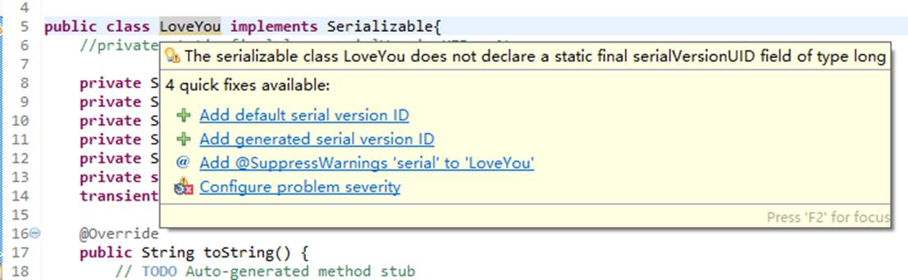

 

注意点：

可序列化的所有子类本身必须都是可序列化的

## RMI（远程方法调用）

https://blog.csdn.net/lmy86263/article/details/72594760

## Java的平台无关性如何体现出来的

不同平台有着对应的java运行环境，我们编写的代码，在任意一个平台上执行生成的字节码（.class文件）都可以放在其他任意一个支持java运行环境的平台上直接运行。然后字节码由虚拟机负责解释执行，java虚拟机将字节码翻译成本地计算机的机器码，然后将机器码交给本地操作系统运行。

字节码是一种中间代码，这也就是为什么java语言能够一次编译，处处运行，也就是java跨平台的原因。

<font color=red>**详细的相关知识可以查看《Java设计原理》-字节码**</font>

## JDK和JRE的区别

一、JDK

JDK(Java Development Kit) 是整个JAVA的核心，包括了Java运行环境（Java Runtime Envirnment），一堆Java工具（javac/java/jdb等）和Java基础的类库（即Java API 包括rt.jar）。

JDK是java开发工具包，在目录下面有 六个文件夹、一个src类库源码压缩包、和其他几个声明文件。其中，真正在运行java时起作用的 是以下四个文件夹：bin、include、lib、 jre。有这样一个关系，JDK包含JRE，而JRE包 含JVM。

bin:最主要的是编译器(javac.exe)

include:java和JVM交互用的头文件

lib：类库

jre:java运行环境

（注意：这里的bin、lib文件夹和jre里的bin、lib是 不同的）

\3. 总的来说JDK是用于java程序的开发,而jre则是只能运行class而没有编译的功能。

 

二、JRE

JRE（Java Runtime Environment，Java运行环境），包含JVM标准实现及Java核心类库，光有JVM还不行，因为在解释class的时候JVM需要调用解释所需要的类库lib。

JRE是Java运行环境，并不是一个开发环境，所以没有包含任何开发工具（如编译器和调试器）

（jre里有运行.class的java.exe）

JRE 是运行Java 程序必不可少的（除非用其他一些编译环境编译成.exe可执行文件……），JRE的 地位就象一台PC机一样，我们写好的Win64应用程序需要操作系统帮 我们运行，同样的，我们编写的Java程序也必须要JRE才能运行。

 

三、JVM

JVM（Java Virtual Machine），即java虚拟机, java运行时的环境，JVM是一种用于计算设备的规范，它是一个虚构出来的计算机，是通过在实际的计算机上仿真模拟各种计算机功能来实现的。针对java用户，也就是拥有可运行的.class文件包（jar或者war）的用户。里面主要包含了jvm和java运行时基本类库（rt.jar）。rt.jar可以理解为：它就是java源码编译成的jar包。Java虚拟机在执行字节码时，把字节码解释成具体平台上的机器指令执行。这就是Java的能够“一次编译，到处运行”的原因。

 

四、JDK、JRE、JVM三者的联系与区别

1.三者联系：JVM不能单独搞定class的执行，解释class的时候JVM需要调用解释所需要的类库lib。在JDK下面的jre目录里面有两个文件夹bin和lib,在这里可以认为bin里的就是jvm，lib中则是jvm工作所需要的类库，而jvm和 lib和起来就称为jre。JVM+Lib=JRE。总体来说就是，我们利用JDK（调用JAVA API）开发了属于我们自己的JAVA程序后，通过JDK中的编译程序（javac）将我们的文本java文件编译成JAVA字节码，在JRE上运行这些JAVA字节码，JVM解析这些字节码，映射到CPU指令集或OS的系统调用。

 

2.三者区别：

a.JDK和JRE区别：在bin文件夹下会发现，JDK有javac.exe而JRE里面没有，javac指令是用来将java文件编译成class文件的，这是开发者需要的，而用户（只需要运行的人）是不需要的。JDK还有jar.exe, javadoc.exe等等用于开发的可执行指令文件。这也证实了一个是开发环境，一个是运行环境。

b.JRE和JVM区别：JVM并不代表就可以执行class了，JVM执行.class还需要JRE下的lib类库的支持，尤其是rt.jar。

## Java 8有哪些新特性

## Arraylist与LinkedList默认空间是多少；

## Arraylist与LinkedList区别与各自的优势List 和 Map 区别；

## Arraylist与LinkedList在频繁的get操作上的耗时主要在什么地方（结合源码分析）；

通过大量的数据测试可发现其执行时间会相差千倍左右。

## 不同的场景下的选择是什么？即什么时候用数组，什么时候用ArrayList，什么时候用LinkedList？

## 谈谈HashMap，哈希表解决hash冲突的方法；

## 为什么要重写hashcode()和equals()以及他们之间的区别与关系；

## Object的hashcode()是怎么计算的？

## 若hashcode方法永远返回1或者一个常量会产生什么结果？

## Java Collections和Arrays的sort方法默认的排序方法是什么；

## 引用计数法与GC Root可达性分析法区别；

## 浅拷贝和深拷贝的区别；

## String s="abc"和String s=new String("abc")区别；

## HashSet方法里面的hashcode存在哪，如果重写equals不重写hashcode会怎么样？

## 反射的作用与实现原理；

## Java中的回调机制；

## 模板方法模式；

## 开闭原则说一下；

## 发布/订阅使用场景；

## KMP算法（一种改进的字符串匹配算法）；

## JMM里边的原子性、可见性、有序性是如何体现出来的，JMM中内存屏障是什么意思，

## 怎么解决Hash冲突；（开放地址法、链地址法、再哈希法、建立公共溢出区等）

## 写出一个必然会产生死锁的伪代码；

## Spring IoC涉及到的设计模式；（工厂模式、单利模式。。）

## toString()方法什么情况下需要重写；

## 判断对象相等时，什么情况下只需要重写 equals()，什么情况下需要重写 equals(),hashcode()？

## Set内存放的元素为什么不可以重复，内部是如何保证和实现的？

## 如何保证分布式缓存的一致性(分布式缓存一致性hash算法?)？分布式session实现？

## Java 8流式迭代的好处？

## 项目中用到的JDK的哪些特性？

## 说一下TreeMap的实现原理？红黑树的性质？红黑树遍历方式有哪些？如果key冲突如何解决？setColor()方法在什么时候用？什么时候会进行旋转和颜色转换？

## Spring的bean的创建时机？依赖注入的时机？

## ArrayList和LinkList的删除一个元素的时间复杂度；（ArrayList是O(N)，LinkList是O(1)）；

## CopyOnWriteArrayList是什么；

## 序列化和反序列化底层如何实现的（ObjectOutputStream 、ObjectInputStream、 readObject writeObject）；

## 如何调试多线程的程序；

## 一个线程连着调用start两次会出现什么情况？（由于状态只有就绪、阻塞、执行，状态是无法由执行转化为执行的，所以会报不合法的状态！）

## HashMap在什么时候时间复杂度是O（1），什么时候是O（n），什么时候又是O（logn）；

## wait方法能不能被重写？（wait是final类型的，不可以被重写，不仅如此，notify和notifyall都是final类型的），wait能不能被中断；

## 一个Controller调用两个Service，这两Service又都分别调用两个Dao，问其中用到了几个数据库连接池的连接？

## 为什么JVM调优经常会将-Xms和-Xmx参数设置成一样；

## Java线程池的核心属性以及处理流程；

## Java内存模型，方法区存什么；

## CMS垃圾回收过程；

## Full GC次数太多了，如何优化；

## 直接内存如何管理的；

## Java线程池的几个参数的意义和实现机制；

## Java线程池使用无界任务队列和有界任务队列的优劣对比；

## CountDownLatch和CyclicBarrier的区别；

## Java中有哪些同步方案（重量级锁、显式锁、并发容器、并发同步器、CAS、volatile、AQS等）

## 如果你的项目出现了内存泄露，怎么监控这个问题呢；

## 标记清除和标记整理的区别和优缺点，为何标记整理会发生stop the world；

## 线程池，如何根据CPU的核数来设计线程大小，如果是计算机密集型的呢，如果是IO密集型的呢？

## 让你设计一个cache如何设计；

## String中hashcode是怎么实现的；

## JDK中哪些实现了单例模式？

## 多个线程同时读写，读线程的数量远远⼤于写线程，你认为应该如何解决并发的问题？你会选择加什么样的锁？

## 线程池内的线程如果全部忙，提交⼀个新的任务，会发⽣什么？队列全部塞满了之后，还是忙，再提交会发⽣什么？

## synchronized关键字锁住的是什么东西？在字节码中是怎么表示的？在内存中的对象上表现为什么？

## wait/notify/notifyAll⽅法需不需要被包含在synchronized块中？这是为什么？

## ExecutorService你一般是怎么⽤的？是每个Service放一个还是个项目放一个？有什么好处？

## 乐观悲观锁的设计，如何保证原子性，解决的问题；

## char和double的字节，以及在内存的分布是怎样；

## 对象内存布局，然后讲下对象的死亡过程？

## 对象头，详细讲下；

## sync原理详细，sync内抛异常会怎样，死锁吗？还是释放掉？怎么排查死锁？死锁会怎样？有没有什么更好的替代方案？

## 详细讲一下集合，HashSet源码，HashMap源码，如果要线程安全需要怎么做？

## 多线程是解决什么问题的？线程池解决什么问题？

## 线程池，如何设计的，里面的参数有多少种，里面的工作队列和线程队列是怎样的结构，如果给你，怎样设计线程池？

## AQS原理，ReentranLock源码，设计原理，整体过程。

## 继续聊多线程源码，sync原理，然后一个场景设计题；

## float f = 1.4f;double d = 1.4d; 与 float f = 1.5f;double d = 1.5d; 是否为true，内存是怎样的；

## split的源码，split("a|b|c");得出多少个数组；

## 把所有认识熟用的JUC( java.util.concurrent(简称JUC)包)下的类写出来，讲下使用，然后讲下原生的线程操作;

## 开闭原则，解析工厂方法模式，建造者模式，区别。手撸出来。

## 讲下JVM的大页模式，JVM内存模型;

## 什么是敏捷开发，防御性编程，并行编程。Team Leader的思考;

## 逃逸分析是什么，作用是什么，用途是什么;

## 怎么认为一个类是线程安全？线程安全的定义是什么？Java有多少个关键字进行同步？为什么这样设计？（聊了一大堆，一堆为什么）；

## 两个线程设计题。记得一个是：t1,t2,t3，让t1，t2执行完才执行t3，原生实现。

## 写个后缀表达式，为什么要设计后缀表达式，有什么好处？然后写下中缀。

## 我看你做过性能优化，比如你怎么分析项目里面的OOM的，内存泄露呢？详细说思路;

## 说下多线程，我们什么时候需要分析线程数，怎么分析，分析什么因素;

## 抽象方法和类方法的区别，static的抽象方法可以吗？

## 说下Java的克隆体系;

## 涉及OOM、JVM优化、源码问题、数据库优化、多线程等问题;

## CPU高？什么情况CPU高？解决什么问题？

## 你有遇到过临界区问题吗？有遇到过吗？你在项目遇到这个问题是怎样解决的？

## Java的多态怎么实现;

## 解释一下自旋;

## 解释一下信号量;

## 什么情况下会触发类加载；

## Java内存抖动严重，优化的思路；

## 灵魂之问

1. Java中枚举类是怎样工作的？和普通的类有什么区别？什么是整数枚举模式和字符串枚举模式，枚举还可以有哪些模式（即还可以用来干什么）？

   分析下面代码：

   ```java
   public class EnumTest {
       public static void main(String[] args) {
           System.out.println(Answer.YES); //
           System.out.println(Answer.NO); // 输出是什么，内部发生了什么，可从字节码角度分析
       }
   }
   
   enum Answer {
       YES {
           @Override
           public String toString() {
               return "yes";
           }
       },
       NO,
       MAYBE
   }
   ```

   再来看下一段代码，对上面的作了简化

   ```java
   public enum ComparisonResult {
       ORDERED_ASCENDING;
       ORDERED_SAME,
       ORDERED_DESCENDING
   }
   
   // 在内存中这三个值是如何存储的，从上面的代码可看出没什么输出是string字符串，而不是整型0,1,2之类的数
   ```

2. 看下面的代码，分析执行结果，并解释具体原理，能够从字节码的角度深入分析？为什么这样设计？

   ```java
   public class Increment {
   	public static void main(String[] args) {
   		increase1();
           increase2();
   	}
       
       private void increase1() {
           int count = 0;
           for (int i = 0; i < 100; i++) {
               count = count++;
           }
           
           System.out.println(count);
       }
       
       private void increase2() {
           int count = 0;
           for (int i = 0; i < 100; i++) {
               count++;
           }
           
           System.out.println(count);
       }
   }
   ```

3. Java中的多态是否违背了里式替换原则？

4. 字段修饰符

   * static 修饰的字段具有什么特性
* final修饰的字段具有什么特性
   * static fianal修饰的字段具有什么特性？不可变的含义是什么，值不可变还是地址不可变？
* volidate修饰的字段有什么特性？一般什么场景需要用到？
  
5. 抽象和封装的区别（What‘s the difference between abstraction and encapsulation?）

   http://java67.blogspot.com/2012/08/difference-between-abstraction-and-encapsulation-java-oops.html

   

# Java高级特性


## 泛型

Java中的泛型和c++中的templates有些类似。允许诸如Integer,  String以及用户自定义的类型作为方法，类以及接口的参数。例如, HashSet,ArrayList, HashMap等能够很好地支持泛型。我们通过泛型使用任何类型。

### 泛型类

和c++类似，在泛型类的创建过程中我们使用<>去指定参数类型。我们使用以下语法去创建泛型类对象。

```java
// To create an instance of generic class 
BaseType <Type> obj = new BaseType <Type>()

Note: In Parameter type we can not use primitives like 
      'int','char' or 'double'.
```

```java
// A Simple Java program to show working of user defined 
// Generic classes 
   
// We use < > to specify Parameter type 
class Test<T> 
{ 
    // An object of type T is declared 
    T obj; 
    Test(T obj) {  this.obj = obj;  }  // constructor 
    public T getObject()  { return this.obj; } 
} 
   
// Driver class to test above 
class Main 
{ 
    public static void main (String[] args) 
    { 
        // instance of Integer type 
        Test <Integer> iObj = new Test<Integer>(15); 
        System.out.println(iObj.getObject()); 
   
        // instance of String type 
        Test <String> sObj = 
                          new Test<String>("GeeksForGeeks"); 
        System.out.println(sObj.getObject()); 
    } 
}
```

输出：

```
15
GeeksForGeeks
```

我们也可以使用多个参数作为泛型类的参数

```java
// A Simple Java program to show multiple 
// type parameters in Java Generics 
  
// We use < > to specify Parameter type 
class Test<T, U> 
{ 
    T obj1;  // An object of type T 
    U obj2;  // An object of type U 
  
    // constructor 
    Test(T obj1, U obj2) 
    { 
        this.obj1 = obj1; 
        this.obj2 = obj2; 
    } 
  
    // To print objects of T and U 
    public void print() 
    { 
        System.out.println(obj1); 
        System.out.println(obj2); 
    } 
} 
  
// Driver class to test above 
class Main 
{ 
    public static void main (String[] args) 
    { 
        Test <String, Integer> obj = 
            new Test<String, Integer>("GfG", 15); 
  
        obj.print(); 
    } 
}
```

输出：

```
GfG
15
```

### 泛型函数

我们还可以根据传递给泛型方法的参数类型编写可供不同类型的参数调用的泛型函数，编译器会处理每个方法。

```java
// A Simple Java program to show working of user defined 
// Generic functions 
   
class Test 
{ 
    // A Generic method example 
    static <T> void genericDisplay (T element) 
    { 
        System.out.println(element.getClass().getName() + 
                           " = " + element); 
    } 
   
    // Driver method 
    public static void main(String[] args) 
    { 
         // Calling generic method with Integer argument 
        genericDisplay(11); 
   
        // Calling generic method with String argument 
        genericDisplay("GeeksForGeeks"); 
   
        // Calling generic method with double argument 
        genericDisplay(1.0); 
    } 
}
```

输出：

```
java.lang.Integer = 11
java.lang.String = GeeksForGeeks
java.lang.Double = 1.0
```

### 泛型的好处

使用泛型编写的代码有着如下的优势：

1. 代码复用：对于一些方法/类/接口我们只需要写一次，就可以用于任何我们想要的类型
2. 类型安全：使用泛型可以使得错误能够在编译时期就得到发现，而不是在运行时期（在编译时时期就知道代码的问题总是好过运行时因问题而导致运行失败）。假设你想创建一个ArrayList保存学生的姓名，如果你在程序中错误地将整型对象add进去而不是string对象，这种情况编译器是允许的；但是，当我们在运行时从ArrayList中遍历数据的时候，就会引发问题。

```java
// A Simple Java program to demonstrate that NOT using 
// generics can cause run time exceptions 
import java.util.*; 
  
class Test 
{ 
    public static void main(String[] args) 
    { 
        // Creatinga an ArrayList without any type specified 
        ArrayList al = new ArrayList(); 
  
        al.add("Sachin"); 
        al.add("Rahul"); 
        al.add(10); // Compiler allows this 
  
        String s1 = (String)al.get(0); 
        String s2 = (String)al.get(1); 
  
        // Causes Runtime Exception 
        String s3 = (String)al.get(2); 
    } 
} 
```

输出：

```
Exception in thread "main" java.lang.ClassCastException: 
   java.lang.Integer cannot be cast to java.lang.String
	at Test.main(Test.java:19)
```

> 泛型是如何解决这个问题的？
>
> 在定义ArrayList的时候，我们可以指定list只能接受String对象
>
> ```java
> // Using generics converts run time exceptions into  
> // compile time exception. 
> import java.util.*; 
>   
> class Test 
> { 
>     public static void main(String[] args) 
>     { 
>         // Creating a an ArrayList with String specified 
>         ArrayList <String> al = new ArrayList<String> (); 
>   
>         al.add("Sachin"); 
>         al.add("Rahul"); 
>   
>         // Now Compiler doesn't allow this 
>         al.add(10);  
>   
>         String s1 = (String)al.get(0); 
>         String s2 = (String)al.get(1); 
>         String s3 = (String)al.get(2); 
>     } 
> } 
> ```
>
> 输出：
>
> ```
> 15: error: no suitable method found for add(int)
>         al.add(10); 
>           ^
> ```

3. 省去了单个的类型转换：如果我们不使用泛型，在上面的例子中我们每次遍历ArrayList时，必须做类型转换。每次遍历操作都进行类型转换是一件很让人头疼的事情。如果我们已经知道我们的ArrayList只能存放string数据，那么我们就不需要每次都进行类型转换了。

```java
// We don't need to typecast individual members of ArrayList 
import java.util.*; 
  
class Test 
{ 
    public static void main(String[] args) 
    { 
        // Creating a an ArrayList with String specified 
        ArrayList <String> al = new ArrayList<String> (); 
  
        al.add("Sachin"); 
        al.add("Rahul"); 
  
        // Typecasting is not needed  
        String s1 = al.get(0); 
        String s2 = al.get(1); 
    } 
} 
```

4. 实现泛型算法：通过使用泛型，我们可以实现适用于不同类型对象的算法，并且它们同样是线程安全的。

## Optional

### 定义

> 概念

> 常见的使用场景

> 异常处理

## Java IO

### IO

### NIO

### 字节流

### 字符流


# 常见的异常

## 异常体系

### 什么是异常？

异常是指在程序的执行期间发生的意外事件，该事件会破坏程序指令的正常流程。

### Error vs Exception

> Error: Error表示严重的问题，即正常应用不应该去捕获
>
> Exception: Exception表示正常的应用可以尝试去捕获。

### Exception 层级

所有Exception和Error类型都是Throwable类的子类，Throwable类是层次结构的基类。其中一个分支以Exception为首。 此类用于用户程序应捕获的异常条件。 NullPointerException是此类异常其中的一个示例。Java运行时系统（JVM）使用另一个分支Error来指示与运行时环境本身（JRE）有关的错误。 StackOverflowError是此类错误的一个示例。


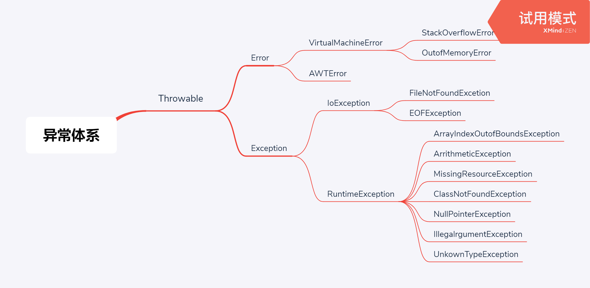

对于checked和unchecked exception的比较，可以看Java基础-常见异常

### JVM怎样处理异常

**默认的异常处理**：无论何时，在一个方法的内部发生了异常，该方法会创建一个称为“异常对象”的对象，并将其交给JVM。异常对象包含异常的名称和描述，UI及发生异常的程序的当前状态。创建异常对象并交由JVM这一过程称为抛出异常。可能存在异常发生那一刻之前的方法调用列表，这一有序的方法列表称为调用栈。现在，异常发生时刻将会经过一下过程：

* JVM搜索调用栈以查找可以处理该异常的代码块的方法。该代码块称为异常处理程序。
* JVM从发生异常的方法开始搜索，然后以与调用顺序相反的顺序遍历调用栈。
* 如果找到合适的处理程序，则将发生的异常传递给它。合适的处理程序意味着抛出的异常对象类型与其可处理的异常对象类型匹配。
* 如果JVM搜索了该调用栈上的所有方法后并没有找到合适的处理异常处理程序，则JVM会将异常对象转交给默认的异常处理程序，该默认的异常处理程序也是JVM的一部分。默认的异常处理程序以以下格式打印异常信息，并终止程序运行。

```
Exception in thread "xxx" Name of Exception : Description
... ...... ..  // Call Stack
```

下面这幅图可以帮助理解这一过程：


示例：

```java
// Java program to demonstrate how exception is thrown. 
class ThrowsExecp{ 
      
    public static void main(String args[]){ 
          
        String str = null; 
        System.out.println(str.length()); 
          
    } 
} 
```

输出：

```
Exception in thread "main" java.lang.NullPointerException
    at ThrowsExecp.main(File.java:8)
```

让我们来看一个示例展示JVM是如何在调用栈上查找合适的异常处理程序的。

```java
// Java program to demonstrate exception is thrown 
// how the runTime system searches th call stack 
// to find appropriate exception handler. 
class ExceptionThrown 
{ 
    // It throws the Exception(ArithmeticException). 
    // Appropriate Exception handler is not found within this method. 
    static int divideByZero(int a, int b){ 
          
        // this statement will cause ArithmeticException(/ by zero) 
        int i = a/b;  
          
        return i; 
    } 
      
    // The runTime System searches the appropriate Exception handler 
    // in this method also but couldn't have found. So looking forward 
    // on the call stack. 
    static int computeDivision(int a, int b) { 
          
        int res =0; 
          
        try
        { 
          res = divideByZero(a,b); 
        } 
        // doesn't matches with ArithmeticException 
        catch(NumberFormatException ex) 
        { 
           System.out.println("NumberFormatException is occured");  
        } 
        return res; 
    } 
      
    // In this method found appropriate Exception handler. 
    // i.e. matching catch block. 
    public static void main(String args[]){ 
          
        int a = 1; 
        int b = 0; 
          
        try
        { 
            int i = computeDivision(a,b); 
          
        } 
          
        // matching ArithmeticException 
        catch(ArithmeticException ex) 
        { 
            // getMessage will print description of exception(here / by zero) 
            System.out.println(ex.getMessage()); 
        } 
    } 
} 
```

输出：

```
/ by zero.
```

### 编程人员怎样处理异常

**自定义异常处理**：java的异常处理通过5个关键词进行管理：try,catch,throw,throws以及finally。简单来讲，下面是它们的工作方式：

* 您认为可能会发生异常的程序语句包含在try块中，如果try块发生异常，则将引发该异常；

* 您的代码可以捕获该异常（使用catch块）并处理以某种合适的方法处理它。

* 系统产生的异常由JVM自动抛出。想要手动抛出一个异常，使用关键字throw。一个方法中抛出的任何异常都必须由throws语句发起。

* 在try语句之后必须要执行的任何代码都放在finally块中。

详细的分析请看：Java基础-常见异常-try,catch,finally控制流

### 需要try-catch语句（自定义异常处理）

看下面这段代码：

```java
// java program to demonstrate  
// need of try-catch clause 
  
class GFG { 
    public static void main (String[] args) { 
          
        // array of size 4. 
        int[] arr = new int[4]; 
       
        // this statement causes an exception 
        int i = arr[4]; 
          
        // the following statement will never execute 
        System.out.println("Hi, I want to execute"); 
    } 
} 
```

输出：

```
Exception in thread "main" java.lang.ArrayIndexOutOfBoundsException: 4
    at GFG.main(GFG.java:9)
```

**解释：**上面的示例中，数组的大小正如实例中所给的那样。你可访问的元素下标只能是0-3.但是你试图去访问下标为4的元素，这就是引发异常的原因。在这种情况下，JVM会终止程序的运行。System.out.println("Hi, I want to execute")将永远不会执行。如果想要执行它，我们必须使用try-catch处理异常。因此，为了继续让程序正常进行，我们需要try-catch语句。

### 怎样使用try-catch语句

```java
try {
// block of code to monitor for errors
// the code you think can raise an exception
}
catch (ExceptionType1 exOb) {
// exception handler for ExceptionType1
}
catch (ExceptionType2 exOb) {
// exception handler for ExceptionType2
}
// optional
finally {
// block of code to be executed after try block ends
}
```

**需要记住的点**

* 一个方法中，可能存在多个可能引发异常的语句因此将所有这些可能发生异常的语句放到自己的try块中，并未每个语句自己的catch块中提供单独的异常处理程序。
* 如果try块中发生异常，则该异常由与该异常关联的异常处理程序处理。要关联异常处理程序，我们需要在其后放置catch块。可以有多个异常处理程序。每一个catch块都是一个异常处理程序，用于处理与其参数对应类型的异常。参数中指定的异常类型声明其可以处理的异常类型，并且其必须是Throwable的派生类。
* 对于每个try块，可以有0个或多个catch块，但只能有一个finally块。
* finally块是可选的。无论try块中是否发生异常，其总是会被执行。如果发生异常，它将在try和catch块之后执行。Java中的finally块通常用于放置重要的代码，例如清理工作：关闭文件或者关闭连接

**总结**

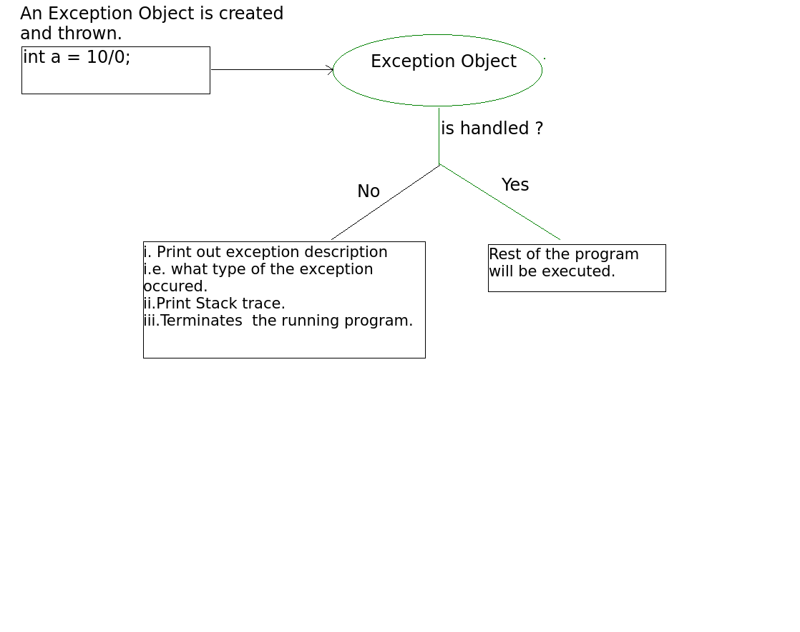

引用：

https://www.geeksforgeeks.org/exceptions-in-java/

https://docs.oracle.com/javase/tutorial/essential/exceptions/definition.html

## OOM (OutOfMemoryError Exception)

Java中，所有的对象都存储在堆内存中（特殊情况除外，这种特殊情况将在这一章节的结束时介绍）。它们使用new操作符进行分配。OOM异常如下：

```
Exception in thread "main" java.lang.OutOfMemoryError: Java heap space
```

通常，当Java虚拟机由于内存不足而无法分配对象，并且垃圾回收器无法再提供更多内存时，将引发此错误。这段话又引出了两个问题：

> Java虚拟机的默认内存是多大？由什么参数控制？
>
> 垃圾回收器的默认内存？其无法提供更多的内存是指什么区的内存，年轻代，老年代？

**OutOfMemoryError** 通常意味着你做错了什么，要么将长时间持有一个对象，要么试图以此处理太多的数据。有时，它也会是一些你无法控制的问题，例如缓存字符串的三方库，亦或者应用服务器在部署后没有及时清理。有时，它压根就和堆上的对象无关。

当本地方法库中的代码分配的内存无法得到满足（如交换空间不足），此时也会抛出**java.lang.OutOfMemoryError** 。让我们了解会引发OOM的不同情况。

### 症状或根本原因？

为了找出原因，异常信息的末尾会包含详细的信息。让我们来检查所有错误。

#### 1、Error1-Java heap space

由于过度使用finalizers的程序而导致此错误。如果一个类具有finalize方法，则此类型的对象在垃圾回收时不会被立即回收。而是，在垃圾回收之后，这类对象会排队进入队列等待finalization，这个时间是由系统决定的。

原因分析：

> 1、finalizers是由一个服务于finalization队列的守护线程执行的; 如果finallizer线程的速度跟不上finalization queue，这样java heap迟早会被填满，因而OOM异常便会发生。
>
> 2、配置参数导致，即指定的heap大小（或默认的大小）不能满足应用的开销
>
> 3、请求创建一个超大对象，通常是一个大数组。
>
> 4、超出预期的访问量/数据量，通常是上游系统请求流量飙升，常见于各类促销/秒杀活动，可以结合业务流量指标排查是否有尖状峰值。
>
> 5、内存泄漏（Memory Leak），大量对象引用没有释放，JVM 无法对其自动回收，常见于使用了 File 等资源没有回收。

```java
// Java program to illustrate 
// Heap error 
import java.util.*; 
  
public class Heap { 
    static List<String> list = new ArrayList<String>(); 
  
public static void main(String args[]) throws Exception 
    { 
        Integer[] array = new Integer[10000 * 10000]; 
    } 
} 
```

当你执行上面的代码时，你可能想着应该不会有什么问题。结果是，随着执行时间的推移，在不断使用泄漏代码的情况下，“缓存”结果最终会占用大量Java堆空间，并当泄漏的内存填满堆区域中的所有可用内存且GC无法将其清理时，将会抛出OOM异常。

**Prevention**：检查如何监视尚未完成的finalize对象（Monitor the Objects pending finalization）

解决方案：

> 针对大部分情况，通常只需要通过 `-Xmx` 参数调高 JVM 堆内存空间即可。如果仍然没有解决，可以参考以下情况做进一步处理：
>
> 1、如果是超大对象，可以检查其合理性，比如是否一次性查询了数据库全部结果，而没有做结果数限制。
>
> 2、如果是业务峰值压力，可以考虑添加机器资源，或者做限流降级。
>
> 3、如果是内存泄漏，需要找到持有的对象，修改代码设计，比如关闭没有释放的连接。

#### 2、Error 2-  GC Overhead limit exceeded

此错误表示GC一直在运行，并且Java程序的执行进度非常缓慢。进行GC之后，如果Java进程花费了98%的时间用于GC，并且回复的可用内存不到2%，且连续执行了5（编译期确定的常量）次GC，则会抛出OOM。

通常抛出此异常因为Java堆中可分配的可用空间很少无法容纳新来的数据量。

```java
// Java program to illustrate 
// GC Overhead limit exceeded 
import java.util.*; 
  
public class Wrapper { 
public static void main(String args[]) throws Exception 
    { 
        Map m = new HashMap(); 
        m = System.getProperties(); 
        Random r = new Random(); 
        while (true) { 
            m.put(r.nextInt(), "randomValue"); 
        } 
    } 
} 
```

用**java -Xmx100m -XX:+UseParallelGC Wrapper**命令运行上面这段程序，会得到下面的输出：

```
Exception in thread "main" java.lang.OutOfMemoryError: GC overhead limit exceeded
    at java.lang.Integer.valueOf(Integer.java:832)
    at Wrapper.main(error.java:9)
```

**Prevention :** 增加堆空间的大小，并用下面的命令参数将其关闭 **-XX:-UseGCOverheadLimit.**

#### 3、Error3- Permgen space

Java内存被分为了不同的区域。所有区域的大小，包括permgen区域，在JVM启动时会被设置。如果你自己不对其进行修改，JVM启动时会加载默认的大小。

OOM：PermGen space 错误表明Permanent Generation's 区域的内存空间被耗尽。

```java
// Java program to illustrate 
// Permgen Space error 
import javassist.ClassPool; 
  
public class Permgen { 
    static ClassPool classPool = ClassPool.getDefault(); 
  
public static void main(String args[]) throws Exception 
    { 
        for (int i = 0; i < 1000000000; i++) { 
            Class c = classPool.makeClass(com.saket.demo.Permgen" + i).toClass(); 
            System.out.println(c.getName()); 
        } 
    } 
} 
```

上面的代码中，在运行时迭代产生一系列class。产生Class的复杂性右Javassist库关心。

运行上面的代码会不断地创建新的类并将其加载进Permgen空间直到Permgen的空间耗尽，此时便会抛出OOM：Permgen space is thrown.

> 永久代存储对象主要包括以下几类：
>
> 1、加载/缓存到内存中的 class 定义，包括类的名称，字段，方法和字节码；
>
> 2、常量池；
>
> 3、对象数组/类型数组所关联的 class；
>
> 4、JIT 编译器优化后的 class 信息。
>
> PermGen 的使用量与加载到内存的 class 的数量/大小正相关。

解决方案：

> 根据 Permgen space 报错的时机，可以采用不同的解决方案，如下所示：
>
> 1)、程序启动报错，修改 `-XX:MaxPermSize` 启动参数，调大永久代空间。
>
> ```
> java -XX:MaxPermSize=512m com.saket.demo.Permgen
> ```
>
> 2)、应用重新部署时报错，很可能是没有应用没有重启，导致加载了多份 class 信息，只需重启 JVM 即可解决。
>
> 3)、运行时报错，应用程序可能会动态创建大量 class，而这些 class 的生命周期很短暂，但是 JVM 默认不会卸载 class，可以设置 `-XX:+CMSClassUnloadingEnabled` 和 `-XX:+UseConcMarkSweepGC`这两个参数允许 JVM 卸载 class。
>
> 如果上述方法无法解决，可以通过 jmap 命令 dump 内存对象 `jmap-dump:format=b,file=dump.hprof` ，然后利用 Eclipse MAT https://www.eclipse.org/mat 功能逐一分析开销最大的 classloader 和重复 class。

#### 4、Error4-Metaspace

metaspace的大小由MaxMetaSpaceSize控制。当加载类需要的metadata超过MaxMetaSpaceSize就会抛出此异常。

```java
// Java program to illustrate 
// Metaspace error 
import java.util.*; 
  
public class Metaspace { 
    static javassist.ClassPool cp = javassist.ClassPool.getDefault(); 
  
public static void main(String args[]) throws Exception 
    { 
        for (int i = 0; i < 100000; i++) { 
            Class c = cp.makeClass("com.saket.demo.Metaspace" + i).toClass(); 
        } 
    } 
} 
```

这段代码和上面Error3非常像，是因为在Java8中用Metaspace取代了PermGen，至于取代的原因，会在这节末尾总结。

上面这段代码持续生成新的类，并将其定义加载到Metaspace中，直到该空间被完全利用后，抛出java.lang.OutOfMemoryError：Metaspace为止。

解决方案：

> 此问题类似于上面的Error3，可参考其解决方案

#### 5、Error 5 - **Requested array size exceeds VM limit **

 这个错误表明应用试图去分配一个超过heap大小的数组。例如，应用尝试去分配1024MB的数组，但是heap的最大空间为512MB，此时便会抛出此类型的OOM

```JAVA
// Java program to illustrate 
// Requested array size 
// exceeds VM limit error 
import java.util.*; 
  
public class GFG { 
    static List<String> list = new ArrayList<String>(); 
  
public static void main(String args[]) throws Exception 
    { 
        Integer[] array = new Integer[10000 * 10000]; 
    } 
} 
```

OOM:Requested array size exceeds VM limit可能会在下面的情况下出现：

* 你创建的数组很大，介于平台之间和Integer.MAX_INT之间
* 您故意尝试分配大于2 ^ 31-1元素的数组以试验极限。

此问题比较罕见，通常需要检查业务是否确实需要创建这么大的数组。

#### 6、**Error 6 – Request size bytes for reason. Out of swap space?** 

当从native heap中分配内存失败或者native heap资源接近枯竭会触发该异常。该错误指示失败的请求的大小（以字节为单位）以及请求内存的原因。

原因分析：

> OOM：Out of swape space error通常有操作系统层面引起，例如：
>
> 1、操作系统配置的交换空间不足
>
> 2、系统上的另一个进程正在消耗所有的内存资源。
>
> 3、地址空间不足；
>
> 4、物理内存已耗光；
>
> 5、应用程序的本地内存泄漏（native leak），例如不断申请本地内存，却不释放。
>
> 6、执行 `jmap-histo:live` 命令，强制执行 Full GC；如果几次执行后内存明显下降，则基本确认为 Direct ByteBuffer 问题。

解决方案：

> 预防措施：发生此异常时，虚拟机会调用fatal级别的错误处理机制（会产生fatal错误日志文件，其中包含消息崩溃时的线程，进程和系统的有用信息）。在native heap资源耗尽的情况下，日志中的堆内存和内存映射信息可能会有用。
>
> 1、升级地址空间为 64 bit；
>
> 2、使用 Arthas 检查是否为 Inflater/Deflater 解压缩问题，如果是，则显式调用 end 方法。
>
> 3、Direct ByteBuffer 问题可以通过启动参数 `-XX:MaxDirectMemorySize` 调低阈值。
>
> 4、升级服务器配置/隔离部署，避免争用。

#### 7、**Error 7 : reason stack_trace_with_native_method** 

每当抛出此错误消息（原因为stack_trace_with_native_method）时，就会打印堆栈跟踪信息，其中最上面的帧是native方法，那么这表明native方法分配失败。 该消息与上一条消息之间的区别在于，该条错误消息是在Java native interface（JNI）或native方法中检测到的而不是在JVM代码中。

```java
// Java program to illustrate 
// new native thread error 
import java.util.*; 
  
public class GFG { 
public static void main(String args[]) throws Exception 
    { 
        while (true) { 
            new Thread(new Runnable() 
            { 
                public void run() 
                { 
                    try
                    { 
                        Thread.sleep(1000000000); 
        } 
        catch (InterruptedException e) 
        { 
        } 
    } 
            }).start(); 
   } 
  } 
} 
```

#### 8、Unable to create new native thread

此错误和错误7有些类似。每个 Java 线程都需要占用一定的内存空间，当 JVM 向底层操作系统请求创建一个新的 native 线程时，如果没有足够的资源分配就会报此类错误。

原因分析

> JVM 向 OS 请求创建 native 线程失败，就会抛出 `Unableto createnewnativethread`，常见的原因包括以下几类：
>
> 1、线程数超过操作系统最大线程数 ulimit 限制；
>
> 2、线程数超过 kernel.pid_max（只能重启）；
>
> 3、native 内存不足；
>
> 该问题发生的常见过程主要包括以下几步：
>
> 1、JVM 内部的应用程序请求创建一个新的 Java 线程；
>
> 2、JVM native 方法代理了该次请求，并向操作系统请求创建一个 native 线程；
>
> 3、操作系统尝试创建一个新的 native 线程，并为其分配内存；
>
> 4、如果操作系统的虚拟内存已耗尽，或是受到 32 位进程的地址空间限制，操作系统就会拒绝本次 native 内存分配；
>
> 5、JVM 将抛出 `java.lang.OutOfMemoryError:Unableto createnewnativethread` 错误。

解决方案

> 1、升级配置，为机器提供更多的内存；
>
> 2、降低 Java Heap Space 大小；
>
> 3、修复应用程序的线程泄漏问题；
>
> 4、限制线程池大小；
>
> 5、使用 -Xss 参数减少线程栈的大小；
>
> 6、调高 OS 层面的线程最大数：执行 `ulimia-a` 查看最大线程数限制，使用 `ulimit-u xxx` 调整最大线程数限制。
>
> ulimit -a .... 省略部分内容 ..... max user processes (-u) 16384

#### 9、Kill process or sacrifice child

有一种内核作业（Kernel Job）名为 Out of Memory Killer，它会在可用内存极低的情况下“杀死”（kill）某些进程。OOM Killer 会对所有进程进行打分，然后将评分较低的进程“杀死”，具体的评分规则可以参考 Surviving the Linux OOM Killer。

不同于其他的 OOM 错误， `Killprocessorsacrifice child` 错误不是由 JVM 层面触发的，而是由操作系统层面触发的。

原因分析

> 默认情况下，Linux 内核允许进程申请的内存总量大于系统可用内存，通过这种“错峰复用”的方式可以更有效的利用系统资源。
>
> 然而，这种方式也会无可避免地带来一定的“超卖”风险。例如某些进程持续占用系统内存，然后导致其他进程没有可用内存。此时，系统将自动激活 OOM Killer，寻找评分低的进程，并将其“杀死”，释放内存资源。

解决方案

> 1、升级服务器配置/隔离部署，避免争用。
>
> 2、OOM Killer 调优。

#### 10、Direct buffer memory

Java 允许应用程序通过 Direct ByteBuffer 直接访问堆外内存，许多高性能程序通过 Direct ByteBuffer 结合内存映射文件（Memory Mapped File）实现高速 IO。

原因分析

> Direct ByteBuffer 的默认大小为 64 MB，一旦使用超出限制，就会抛出 `Directbuffer memory` 错误。

解决方案

> 1、Java 只能通过 ByteBuffer.allocateDirect 方法使用 Direct ByteBuffer，因此，可以通过 Arthas 等在线诊断工具拦截该方法进行排查。
>
> 2、检查是否直接或间接使用了 NIO，如 netty，jetty 等。
>
> 3、通过启动参数 `-XX:MaxDirectMemorySize` 调整 Direct ByteBuffer 的上限值。
>
> 4、检查 JVM 参数是否有 `-XX:+DisableExplicitGC` 选项，如果有就去掉，因为该参数会使 `System.gc()` 失效。
>
> 5、检查堆外内存使用代码，确认是否存在内存泄漏；或者通过反射调用 `sun.misc.Cleaner` 的 `clean()`方法来主动释放被 Direct ByteBuffer 持有的内存空间。
>
> 6、内存容量确实不足，升级配置。

## Exception、Error、运行时异常与一般异常有何异同

从上面的分析可以知道所有的异常都是由Throwable类，下一层分解为两个分支：Error和Exceprion。

**Error**层次结构描述了java运行时系统的内部错误和资源耗尽错误。大多数错误与代码编写者执行的操作无关，而表示代码运行时 JVM（Java 虚拟机）出现的问题。应用程序不应该抛出这种类型的对象。

**Exceprion**这个层次结构又分解为连个分支：一个分支派生于RuntimeException；另一个分支包含其他异常。划分两个分支的规则是：由程序错误导致的异常属于RuntimeException；而程序本身没有没有问题，但由于像I/O错误这类异常导致的异常属于其他异常。

**RuntimeException（运行时异常）：**

IndexOutOfBoundsException(下标越界异常)

NullPointerException(空指针异常)

NumberFormatException （String转换为指定的数字类型异常）

ArithmeticException -（算术运算异常 如除数为0）

ArrayStoreException - （向数组中存放与声明类型不兼容对象异常）

SecurityException -（安全异常）

**IOException**（其他异常）:

FileNotFoundException（文件未找到异常。）

IOException（操作输入流和输出流时可能出现的异常。）

EOFException （文件已结束异常）

**unchecked exception**（非检查异常）

包括运行时异常（RuntimeException）和派生于Error类的异常。对于运行时异常，java编译器不要求必须进行异常捕获处理或者抛出声明，由程序员自行决定。

**checked exception**（检查异常，编译异常，必须要处理的异常）

也称非运行时异常（运行时异常以外的异常就是非运行时异常），java编译器强制程序员必须进行捕获处理（try...catch/throws），比如常见的IOExeption和SQLException。对于非运行时异常如果不进行捕获或者抛出声明处理，编译都不会通过。

异常的处理：

1.抛出异常：

```java
import java.io.FileNotFoundException;

/*
* @date 2018.08.26
* @author Mr. Zhang Dezhou
*/
public class ExceptionHandle {
    public static void main(String[] args) {
        ExceptionHandle eh = new ExceptionHandle();
        try {
            eh.test();
        } catch (FileNotFoundException e){
            e.printStackTrace(); // 此处打印堆栈信息，工程项目中不建议打印堆栈
        }
    }

    private void test() throws FileNotFoundException {
        method1();
    }

    private void method1() throws FileNotFoundException {
        method2();
    }

    private void method2() throws FileNotFoundException {
        throw new FileNotFoundException();
    }
}
```


2.捕获异常：try...catch...finally，finally块的语句在try或catch中的return语句执行之后返回之前执行且finally里的修改语句可能影响也可能不影响try或catch中return已经确定的返回值，若finally里也有return语句则覆盖try或catch中的return语句直接返回。


 


## 常见的敏感异常

| 异常名称                                    | 存在的风险                                         |
| ------------------------------------------- | -------------------------------------------------- |
| java.io.FileNotFoundException               | 泄露文件系统结构和文件名列举                       |
| java.util.jar.JarException                  | 泄露文件系统结构                                   |
| java.util.MissingResourceException          | 资源列举                                           |
| java.security.acl.NotOwnerException         | 所有人列举                                         |
| java.util.ConcurrentModificationException   | 可能提供线程不安全的代码信息                       |
| javax.naming.InsufficientResourcesException | 服务器资源不足***（可能有利于DoS攻击）***          |
| java.net.BindException                      | 当不信任客户端能够选择服务器端口时造成开放端口列举 |
| java.lang.OutOfMemoryError                  | ***DoS***                                          |
| java.lang.StackOverflowError                | ***DoS***                                          |
| java.sql.SQLException                       | 数据库结构，用户名列举                             |


# **常见的集合**

## 集合体系

https://www.geeksforgeeks.org/collections-in-java-2/?ref=lbp（contributed by  **Dharmesh Singh**）

集合将一组单个对象表示为一个单个单元，Java提供的Collection框架定义了一系列类和接口，这些类和接口可以将一组对象表示成一个单元。

Collection(java.util.Colection)和Map(java.util.Map)接口是java集合的两个最顶层接口

### **引入Collection框架的原因**

在Collection Framework出现之前（JDK1.2之前），java对象分组的标准方法是通过Array，Vectors或者Vectors，亦或者HashTables,这个集合没有公共的接口。访问这些数据结构是非常令编程人员苦恼的，因为每种都有各自不同访问该成员的方法（和语法）

```java
// Java program to show why collection framework was needed 
import java.io.*; 
import java.util.*; 
  
class Test 
{ 
    public static void main (String[] args) 
    { 
        // Creating instances of array, vector and hashtable 
        int arr[] = new int[] {1, 2, 3, 4}; 
        Vector<Integer> v = new Vector(); 
        Hashtable<Integer, String> h = new Hashtable(); 
        v.addElement(1); 
        v.addElement(2); 
        h.put(1,"geeks"); 
        h.put(2,"4geeks"); 
  
        // Array instance creation requires [], while Vector 
        // and hastable require () 
        // Vector element insertion requires addElement(), but 
        // hashtable element insertion requires put() 
  
        // Accessing first element of array, vector and hashtable 
        System.out.println(arr[0]); 
        System.out.println(v.elementAt(0)); 
        System.out.println(h.get(1)); 
  
        // Array elements are accessed using [], vector elements 
        // using elementAt() and hashtable elements using get() 
    } 
} 
```

Output:

```
1
1
geeks
```

正如我们看到的一样，这些集合（Array, Vector ,hashTable）都没有实现一个标准的数据访问接口。这对于编程人员编写能够在多种数据集合下都能工作良好的算法是非常困难的。另外一个缺点是‘Vector’的大多数方法都是final的，这就意味着我们不能通过extends继承Vector去实现类似Vector的集合。

Java开发者决定去实现一个公共的接口去解决上面的问题，因此Collection Framework框架出现在了JDK1.2中。

同时对遗留的Vector和Hashtables做出了修改，以让其能够兼容Collection Framework。

### Collection Framework的优势

1. 不变的API：API具有一组基本的接口，像Collection，Set，List或Map.实现这些接口的所有类（ArrayList，LinkedList，Vector等）都有一些通用的方法集。
2.  减少编程的工作量：编程人员不必再考虑Collection的设计，并可以在程序中专注于Collection的最佳使用。
3. 提高程序的速度和质量：通过提供的有用的数据结构和高性能的算法实现，从而提高程序的性能表现。

### Collection Framework层级结构图

```xml
             Collection                Map
         /     /    \      \            |
        /      /      \     \           |
     Set    List    Queue  Dequeue   SortedMap
     /
    /
 SortedSet 
            Core Interfaces in Collections

Note that this diagram only shows core interfaces.  
```

Collection和Map下的具体实现类

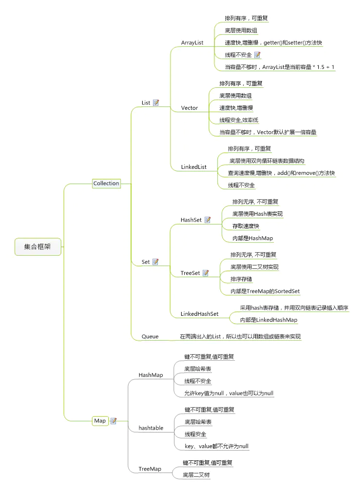

## Enumeration，Iterator， ListIteratoor

Iterator存在于Collection框架中，用来遍历其中的元素。有三种类型的iterator

### Enumertion

用于获取旧集合（Vector，Hashtable）元素的接口。枚举是JDK 1.0中出现的第一个迭代器，其余的在JDK 1.2中被包含进来，同时伴随着更多的功能。枚举还用于指定SequenceInputStream的输入流。我们可在任何vector对象上调用其elements()方法得到Enumerationd对象。

```java
// Here "v" is an Vector class object. e is of
// type Enumeration interface and refers to "v"
Enumeration e = v.elements();
```

Enumeration接口有两个方法

```java
public interface Enumeration<E> {
    /**
     * Tests if this enumeration contains more elements.
     *
     * @return  <code>true</code> if and only if this enumeration object
     *           contains at least one more element to provide;
     *          <code>false</code> otherwise.
     */
    boolean hasMoreElements();

    /**
     * Returns the next element of this enumeration if this enumeration
     * object has at least one more element to provide.
     *
     * @return     the next element of this enumeration.
     * @exception  NoSuchElementException  if no more elements exist.
     */
    E nextElement();
}
```

下面的代码片段展示如何使用Enumeration接口遍历vector的元素。

```java
// Java program to demonstrate Enumeration 
import java.util.Enumeration; 
import java.util.Vector; 
  
public class Test 
{ 
    public static void main(String[] args) 
    { 
        // Create a vector and print its contents 
        Vector v = new Vector(); 
        for (int i = 0; i < 10; i++) 
            v.addElement(i); 
        System.out.println(v); 
  
        // At beginning e(cursor) will point to 
        // index just before the first element in v 
        Enumeration e = v.elements(); 
  
        // Checking the next element availability 
        while (e.hasMoreElements()) 
        { 
            // moving cursor to next element 
            int i = (Integer)e.nextElement(); 
  
            System.out.print(i + " "); 
        } 
    } 
} 
```

输出：

```
[0, 1, 2, 3, 4, 5, 6, 7, 8, 9]
0 1 2 3 4 5 6 7 8 9 
```

Enumeration的限制：

* Enumeration只用于老的类（Vector， HashTable），因此其不具有通用性
* 使用Enumeration没有remove操作
* 只能进行正向迭代

### Iterator

iterator是一个通用的迭代器，使用iterator可以操作任意的Collection对象。通过iterator我们可以进行读取和移除操作。在Enumeration的基础上增加了额外的移除元素的能力。

每当我们想要访问实现Collection框架接口的集合（Set,List, Queue, Deque, 以及实现了Map接口的集合）中的元素，我们必须使用Iterator。Iterator是collection框架中唯一可获得的cursor.

通过调用集合框架中的iterator()接口获取Iterator对象：

```java
// Here "c" is any Collection object. itr is of
// type Iterator interface and refers to "c"
Iterator itr = c.iterator();
```

Iterator的接口定义如下:

```java
public interface Iterator<E> {
    /**
     * Returns {@code true} if the iteration has more elements.
     * (In other words, returns {@code true} if {@link #next} would
     * return an element rather than throwing an exception.)
     *
     * @return {@code true} if the iteration has more elements
     */
    boolean hasNext();

    /**
     * Returns the next element in the iteration.
     *
     * @return the next element in the iteration
     * @throws NoSuchElementException if the iteration has no more elements
     */
    E next();

    /**
     * Removes from the underlying collection the last element returned
     * by this iterator (optional operation).  This method can be called
     * only once per call to {@link #next}.  The behavior of an iterator
     * is unspecified if the underlying collection is modified while the
     * iteration is in progress in any way other than by calling this
     * method.
     *
     * @implSpec
     * The default implementation throws an instance of
     * {@link UnsupportedOperationException} and performs no other action.
     *
     * @throws UnsupportedOperationException if the {@code remove}
     *         operation is not supported by this iterator
     *
     * @throws IllegalStateException if the {@code next} method has not
     *         yet been called, or the {@code remove} method has already
     *         been called after the last call to the {@code next}
     *         method
     */
    default void remove() {
        throw new UnsupportedOperationException("remove");
    }

    /**
     * Performs the given action for each remaining element until all elements
     * have been processed or the action throws an exception.  Actions are
     * performed in the order of iteration, if that order is specified.
     * Exceptions thrown by the action are relayed to the caller.
     *
     * @implSpec
     * <p>The default implementation behaves as if:
     * <pre>{@code
     *     while (hasNext())
     *         action.accept(next());
     * }</pre>
     *
     * @param action The action to be performed for each element
     * @throws NullPointerException if the specified action is null
     * @since 1.8
     */
    default void forEachRemaining(Consumer<? super E> action) {
        Objects.requireNonNull(action);
        while (hasNext())
            action.accept(next());
    }
}
```

remove() 方法会抛出两个种类的异常：

- *UnsupportedOperationException :* 该iterator不支持remove操作，通常是实现类中没有实现此方法。
- *IllegalStateException :* If the next method has not yet been called, or the remove method has already been called after the last call to the next method

```java
// Java program to demonstrate Iterator 
import java.util.ArrayList; 
import java.util.Iterator; 
  
public class Test 
{ 
    public static void main(String[] args) 
    { 
        ArrayList al = new ArrayList(); 
  
        for (int i = 0; i < 10; i++) 
            al.add(i); 
  
        System.out.println(al); 
  
        // at beginning itr(cursor) will point to 
        // index just before the first element in al 
        Iterator itr = al.iterator(); 
  
        // checking the next element availabilty 
        while (itr.hasNext()) 
        { 
            //  moving cursor to next element 
            int i = (Integer)itr.next(); 
  
            // getting even elements one by one 
            System.out.print(i + " "); 
  
            // Removing odd elements 
            if (i % 2 != 0) 
               itr.remove();  
        } 
        System.out.println();  
        System.out.println(al); 
    } 
} 
```

输出：

```
[0, 1, 2, 3, 4, 5, 6, 7, 8, 9]
0 1 2 3 4 5 6 7 8 9 
[0, 2, 4, 6, 8]
```

Iterator的限制：

* 只能正向迭代
* 不支持通过iterator替换和增加元素

### ListIterator

只适用于实现了List接口的集合，如arraylist， linkedlist等。其可以进行双向迭代。

ListIterator必须使用在当我们想要枚举list元素的时候。其相比iterator有着更多的功能。

通过调用List接口中的listIterator() 方法获取ListIterator对象。

```java
// Here "l" is any List object, ltr is of type
// ListIterator interface and refers to "l"
ListIterator ltr = l.listIterator();
```

ListIterator继承自Iterator接口。所有Iterator接口中的三个方法同样适用于Listiterator；除此之外其还有额外的6个方法。

```java
// Forward direction

// Returns true if the iteration has more elements
public boolean hasNext();

// same as next() method of Iterator
public Object next();

// Returns the next element index 
// or list size if the list iterator
// is at the end of the list
public int nextIndex();

// Backward direction

// Returns true if the iteration has more elements
// while traversing backward
public boolean hasPrevious();

// Returns the previous element in the iteration
// and can throws NoSuchElementException
// if no more element present
public Object previous();

// Returns the previous element index 
//  or -1 if the list iterator is at the 
// beginning of the list
public int previousIndex();

// Other Methods
 
// same as remove() method of Iterator
public void remove();

// Replaces the last element returned by 
// next() or previous() with the specified element 
public void set(Object obj);

// Inserts the specified element into the list at
// position before the element that would be returned 
// by next(),
public void add(Object obj);
```

可以清晰的看到从Iterator继承过来的三个方法和Iterator做着同样的事情。hasPrevious() 方法，pervious操作和hasNext()以及next()有着类似的功能。

set()方法可以抛出四个异常：

- *UnsupportedOperationException* – if the set operation is not supported by this list iterator
- *ClassCastException :* If the class of the specified element prevents it from being added to this list
- *IllegalArgumentException :* If some aspect of the specified element prevents it from being added to this list
- *IllegalStateException :* If neither next nor previous have been called, or remove or add have been called after the last call to next or previous

add()方法会抛出三个异常

- *UnsupportedOperationException :* If the add method is not supported by this list iterator
- *ClassCastException :* If the class of the specified element prevents it from being added to this list
- *IllegalArgumentException :* If some aspect of this element prevents it from being added to this list

```java
// Java program to demonstrate ListIterator 
import java.util.ArrayList; 
import java.util.ListIterator; 
  
public class Test 
{ 
    public static void main(String[] args) 
    { 
        ArrayList al = new ArrayList(); 
        for (int i = 0; i < 10; i++) 
            al.add(i); 
  
        System.out.println(al); 
  
        // at beginning ltr(cursor) will point to 
        // index just before the first element in al 
        ListIterator ltr = al.listIterator(); 
  
        // checking the next element availabilty 
        while (ltr.hasNext()) 
        { 
            //  moving cursor to next element 
            int i = (Integer)ltr.next(); 
  
            // getting even elements one by one 
            System.out.print(i + " "); 
  
            // Changing even numbers to odd and 
            // adding modified number again in  
            // iterator 
            if (i%2==0) 
            { 
                i++;  // Change to odd 
                ltr.set(i);  // set method to change value 
                ltr.add(i);  // to add 
            } 
        } 
        System.out.println(); 
        System.out.println(al); 
    } 
}
```

输出：

```
[0, 1, 2, 3, 4, 5, 6, 7, 8, 9]
0 1 2 3 4 5 6 7 8 9 
[1, 1, 1, 3, 3, 3, 5, 5, 5, 7, 7, 7, 9, 9, 9]
```

ListIterator的限制：

这是一个强大的迭代器，但是只适用于List接口的实现类，所以其并不是通用的迭代器。

### 重要的相同点

1：在最开始的时候，iterator的引用都将指向集合中第一个元素索引之前

2：我们不能创建Enumeration， Iterator，ListIterator对象，因为它们都是接口，不能够实例化。我们使用elements(), iterator(), listIterator()得到对应的对象。这些方法有着类似的内部类分别继承对应的接口。通过下面的代码片段可以得到验证：

```java
// Java program to demonstrate iterators references 
import java.util.Enumeration; 
import java.util.Iterator; 
import java.util.ListIterator; 
import java.util.Vector; 
  
public class Test 
{ 
    public static void main(String[] args) 
    { 
        Vector v = new Vector(); 
  
        // Create three iterators 
        Enumeration e = v.elements(); 
        Iterator  itr = v.iterator(); 
        ListIterator ltr = v.listIterator(); 
  
        // Print class names of iterators 
        System.out.println(e.getClass().getName()); 
        System.out.println(itr.getClass().getName()); 
        System.out.println(ltr.getClass().getName()); 
    } 
} 
```

输出：

```
java.util.Vector$1
java.util.Vector$Itr
java.util.Vector$ListItr
```

引用类名称中的$符号证明使用了内部类的概念并创建了这些类对象。

## ArrayList

ArrayList是集合框架的一部分，处于java.util包下。它给我们提供了动态数组。尽管它可能比标准的数组慢，但是在程序需要对数组进行许多操作时确很有用。

* ArrayList继承自AbstractList类并实现了List接口
* ArrayList一开始会初始化一个大小，然而这个大小会随着集合元素的增加或减少而变化
* ArrayList允许我们随机访问list
* ArrayList不能用于存储原始数据类型，像int，char等等。针对这些情况，我们需要一个包装类
* Java中的ArrayList可以看做和c++中的vector类似


最基本的ArrayList可以有构造器和方法组成。下面列出了一系列构造器和方法，同时还列出了一些使用方法

### ArrayList构造器

1. ArrayList(): 用于构造一个空的list
2. ArrayList(Collection c): 从集合c中构造一个list
3. ArrayList(int capacity): 指定初始容量的list

下面是创建一个带泛型的ArrayList

```java
// Creating generic integer ArrayList
ArrayList<Integer> arrli = new ArrayList<Integer>();
```

```java
// Java program to demonstrate working of ArrayList in Java 
import java.io.*; 
import java.util.*; 
  
class arrayli 
{ 
    public static void main(String[] args) 
                       throws IOException 
    { 
        // size of ArrayList 
        int n = 5; 
  
        //declaring ArrayList with initial size n 
        ArrayList<Integer> arrli = new ArrayList<Integer>(n); 
  
        // Appending the new element at the end of the list 
        for (int i=1; i<=n; i++) 
            arrli.add(i); 
  
        // Printing elements 
        System.out.println(arrli); 
  
        // Remove element at index 3 
        arrli.remove(3); 
  
        // Displaying ArrayList after deletion 
        System.out.println(arrli); 
  
        // Printing elements one by one 
        for (int i=0; i<arrli.size(); i++) 
            System.out.print(arrli.get(i)+" "); 
    } 
} 
```

输出：

```
[1, 2, 3, 4, 5]
[1, 2, 3, 5]
1 2 3 5 
```

### ArrayList中的方法

1. [forEach(Consumer<? super E> action):](https://www.geeksforgeeks.org/arraylist-foreach-method-in-java/) Performs the given action for each element of the Iterable until all elements have been processed or the action throws an exception.
2. [retainAll(Collection<?> c):](https://www.geeksforgeeks.org/arraylist-retainall-method-in-java/) Retains only the elements in this list that are contained in the specified collection.
3. [removeIf(Predicate<? super E> filter):](https://www.geeksforgeeks.org/arraylist-removeif-method-in-java/) Removes all of the elements of this collection that satisfy the given predicate.
4. [contains(Object o):](https://www.geeksforgeeks.org/arraylist-contains-java/) Returns true if this list contains the specified element.
5. [remove(int index):](https://www.geeksforgeeks.org/arraylist-linkedlist-remove-methods-java-examples/) Removes the element at the specified position in this list.
6. [remove(Object o):](https://www.geeksforgeeks.org/arraylist-linkedlist-remove-methods-java-examples/) Removes the first occurrence of the specified element from this list, if it is present.
7. [get(int index):](https://www.geeksforgeeks.org/arraylist-get-method-java-examples/) Returns the element at the specified position in this list.
8. [subList(int fromIndex, int toIndex):](https://www.geeksforgeeks.org/arraylist-sublist-method-in-java-with-examples/) Returns a view of the portion of this list between the specified fromIndex, inclusive, and toIndex, exclusive.
9. [spliterator():](https://www.geeksforgeeks.org/arraylist-spliterator-method-in-java/) Creates a late-binding and fail-fast Spliterator over the elements in this list.
10. [set(int index, E element):](https://www.geeksforgeeks.org/arraylist-set-method-in-java-with-examples/) Replaces the element at the specified position in this list with the specified element.
11. [size():](https://www.geeksforgeeks.org/arraylist-size-method-in-java-with-examples/) Returns the number of elements in this list.
12. [removeAll(Collection<?> c):](https://www.geeksforgeeks.org/arraylist-removeall-method-in-java-with-examples/) Removes from this list all of its elements that are contained in the specified collection.
13. [ensureCapacity(int minCapacity):](https://www.geeksforgeeks.org/arraylist-ensurecapacity-method-in-java-with-examples/) Increases the capacity of this ArrayList instance, if necessary, to ensure that it can hold at least the number of elements specified by the minimum capacity argument.
14. [listIterator():](https://www.geeksforgeeks.org/arraylist-listiterator-method-in-java-with-examples/) Returns a list iterator over the elements in this list (in proper sequence).
15. [listIterator(int index):](https://www.geeksforgeeks.org/arraylist-listiterator-method-in-java-with-examples/) Returns a list iterator over the elements in this list (in proper sequence), starting at the specified position in the list.
16. [isEmpty():](https://www.geeksforgeeks.org/arraylist-isempty-java-example/) Returns true if this list contains no elements.
17. [removeRange(int fromIndex, int toIndex):](https://www.geeksforgeeks.org/arraylist-removerange-java-examples/) Removes from this list all of the elements whose index is between fromIndex, inclusive, and toIndex, exclusive.
18. [void clear():](https://www.geeksforgeeks.org/arraylist-clear-java-examples/) This method is used to remove all the elements from any list.
19. [void add(int index, Object element):](https://www.geeksforgeeks.org/java-util-arraylist-add-method-java/) This method is used to insert a specific element at a specific position index in a list.
20. [void trimToSize():](https://www.geeksforgeeks.org/arraylist-trimtosize-java-example/) This method is used to trim the capacity of the instance of the ArrayLis to the list’s current size.
21. [int indexOf(Object O):](https://www.geeksforgeeks.org/java-util-arraylist-indexof-java/) The
    index the first occurrence of a specific element is either returned, or -1 in case the element is not in the list.
22. [int lastIndexOf(Object O):](https://www.geeksforgeeks.org/arraylist-lastindexof-java-example/) The index the last occurrence of a specific element is either returned, or -1 in case the element is not in the list.
23. [Object clone():](https://www.geeksforgeeks.org/clone-method-in-java-2/) This method is used to return a shallow copy of an ArrayList.
24. [Object[\] toArray():](https://www.geeksforgeeks.org/arraylist-array-conversion-java-toarray-methods/) This method is used to return an array containing all of the elements in the list in correct order.
25. [Object[\] toArray(Object[] O)](https://www.geeksforgeeks.org/arraylist-array-conversion-java-toarray-methods/): It is also used to return an array containing all of the elements in this list in the correct order same as the previous method.
26. [boolean addAll(Collection C):](https://www.geeksforgeeks.org/java-util-arraylist-addall-method-java/) This method is used to append all the elements from a specific collection to the end of the mentioned list, in such a order that the values are returned by the specified collection’s iterator.
27. [boolean add(Object o):](https://www.geeksforgeeks.org/java-util-arraylist-add-method-java/) This method is used to append a specificd element to the end of a list.
28. [boolean addAll(int index, Collection C):](https://www.geeksforgeeks.org/java-util-arraylist-addall-method-java/) Used to insert all of the elements starting at the specified position from a specific collection into the mentioned list.

### ArrayList源码分析

见Java源码分析-List-ArrayList

## LinkedList

链表是一个线性的数据结构，其中元素并不是按物理地址连续存储的；每个元素节点中的数据域和地址域分开存储。元素之间使用指针和地址进行链接。每个元素称为一个节点Node。由于其动态性以及插入和删除的简便性，在某些方面要优于array。当然，它也有一些缺点，如无法直接访问节点，当我们需要访问某个节点时，我们需要从头开始，然后挨个链接到下一个节点以找到我们想要访问的那个节点。

为了将元素存储在链表中，我们使用双端链表；其拥有线性数据结构，同时继承自一个抽象类以及实现List和Deque接口。

Java中，LinkedList类实现了List接口。LinkedList类同时包含各种构造函数以及方法。

### LinekdList构造函数

1. LinkedList()：用于创建一个空的链表
2. LinkedList(Collection c)：用于创建一个包含指定集合中所有元素的有序list

```java
// Java code for Linked List implementation 
  
import java.util.*; 
  
public class Test 
{ 
    public static void main(String args[]) 
    { 
        // Creating object of class linked list 
        LinkedList<String> object = new LinkedList<String>(); 
  
        // Adding elements to the linked list 
        object.add("A"); 
        object.add("B"); 
        object.addLast("C"); 
        object.addFirst("D"); 
        object.add(2, "E"); 
        object.add("F"); 
        object.add("G"); 
        System.out.println("Linked list : " + object); 
  
        // Removing elements from the linked list 
        object.remove("B"); 
        object.remove(3); 
        object.removeFirst(); 
        object.removeLast(); 
        System.out.println("Linked list after deletion: " + object); 
  
        // Finding elements in the linked list 
        boolean status = object.contains("E"); 
  
        if(status) 
            System.out.println("List contains the element 'E' "); 
        else
            System.out.println("List doesn't contain the element 'E'"); 
  
        // Number of elements in the linked list 
        int size = object.size(); 
        System.out.println("Size of linked list = " + size); 
  
        // Get and set elements from linked list 
        Object element = object.get(2); 
        System.out.println("Element returned by get() : " + element); 
        object.set(2, "Y"); 
        System.out.println("Linked list after change : " + object); 
    } 
} 
```

输出：

```
Linked list : [D, A, E, B, C, F, G]
Linked list after deletion: [A, E, F]
List contains the element 'E' 
Size of linked list = 3
Element returned by get() : F
Linked list after change : [A, E, Y]
```

### LinkedList() 方法

1. **[add(int index, E element):](https://www.geeksforgeeks.org/java-util-linkedlist-add-method-in-java/)** 在list中的指定位置插入指定的元素。
2. **[add(E e):](https://www.geeksforgeeks.org/java-util-linkedlist-add-method-in-java/)** 在list末尾插入指定元素。
3. **[addAll(int index, Collection c):](https://www.geeksforgeeks.org/java-util-linkedlist-addall-method-in-java/)** 将指定集合中的所以元素插入到list中的指定位置。
4. **[addAll(Collection c):](https://www.geeksforgeeks.org/java-util-linkedlist-addall-method-in-java/)** 将指定集合中的所有元素以其iterator返回的顺序追加到list中的末尾
5. **[addFirst(E e):](https://www.geeksforgeeks.org/linkedlist-addfirst-method-in-java/)** 将指定元素插入到list的开始处。
6. **[addLast(E e):](https://www.geeksforgeeks.org/linkedlist-addlast-method-in-java/)** 在list末尾插入指定元素。
7. **[clear():](https://www.geeksforgeeks.org/linkedlist-clear-method-in-java/)** 移除list中的所有元素.
8. **[clone():](https://www.geeksforgeeks.org/linkedlist-clone-method-in-java/)** 返回当前list的一份浅拷贝的数据.
9. **[contains(Object o):](https://www.geeksforgeeks.org/linkedlist-contains-method-in-java/)** This method returns true if this list contains the specified element.
10. **descendingIterator():** This method returns an iterator over the elements in this deque in reverse sequential order.
11. **[element():](https://www.geeksforgeeks.org/linkedlist-element-method-in-java-with- examples/)** This method retrieves, but does not remove, the head (first element) of this list.
12. **[get(int index)](https://www.geeksforgeeks.org/linkedlist-get-method-in-java/):** This method returns the element at the specified position in this list.
13. **[getFirst():](https://www.geeksforgeeks.org/java-util-linkedlist-get-getfirst-getlast-java/)** This method returns the first element in this list.
14. **[getLast():](https://www.geeksforgeeks.org/linkedlist-getlast-method-in-java/)** This method returns the last element in this list.
15. **[indexOf(Object o):](https://www.geeksforgeeks.org/linkedlist-indexof-method-in-java/)** This method returns the index of the first occurrence of the specified element in this list, or -1 if this list does not contain the element.
16. **[lastIndexOf(Object o):](https://www.geeksforgeeks.org/linkedlist-lastindexof-method-in-java/)** This method returns the index of the last occurrence of the specified element in this list, or -1 if this list does not contain the element.
17. **[listIterator(int index):](https://www.geeksforgeeks.org/linkedlist-listiterator-method-in-java/)** This method returns a list-iterator of the elements in this list (in proper sequence), starting at the specified position in the list.
18. **[offer(E e):](https://www.geeksforgeeks.org/java-util-linkedlist-offer-offerfirst-offerlast-java/)** This method Adds the specified element as the tail (last element) of this list.
19. **[offerFirst(E e):](https://www.geeksforgeeks.org/java-util-linkedlist-offer-offerfirst-offerlast-java/)** This method Inserts the specified element at the front of this list.
20. **[offerLast(E e):](https://www.geeksforgeeks.org/java-util-linkedlist-offer-offerfirst-offerlast-java/)** This method Inserts the specified element at the end of this list.
21. **peek():** This method retrieves, but does not remove, the head (first element) of this list.
22. **peekFirst():** This method retrieves, but does not remove, the first element of this list, or returns null if this list is empty.
23. **peekLast():** This method retrieves, but does not remove, the last element of this list, or returns null if this list is empty.
24. **[poll():](https://www.geeksforgeeks.org/java-util-linkedlist-poll-pollfirst-polllast- examples-java/)** This method retrieves and removes the head (first element) of this list.
25. **[pollFirst():](https://www.geeksforgeeks.org/java-util-linkedlist-poll-pollfirst-polllast- examples-java/)** This method retrieves and removes the first element of this list, or returns null if this list is empty.
26. **[pollLast():](https://www.geeksforgeeks.org/java-util-linkedlist-poll-pollfirst-polllast- examples-java/)** This method retrieves and removes the last element of this list, or returns null if this list is empty.
27. **[pop():](https://www.geeksforgeeks.org/linkedlist-pop-method-in-java/)** This method Pops an element from the stack represented by this list.
28. **[push(E e):](https://www.geeksforgeeks.org/linkedlist-push-method-in-java/)** This method Pushes an element onto the stack represented by this list.
29. **[remove():](https://www.geeksforgeeks.org/linkedlist-remove-method-in-java/)** This method retrieves and removes the head (first element) of this list.
30. **[remove(int index):](https://www.geeksforgeeks.org/linkedlist-remove-method-in-java/)** This method removes the element at the specified position in this list.
31. **remove(Object o):** This method removes the first occurrence of the specified element from this list, if it is present.
32. **[removeFirst():](https://www.geeksforgeeks.org/linkedlist-removefirst-method-in-java/)** This method removes and returns the first element from this list.
33. **[removeFirstOccurrence(Object o):](https://www.geeksforgeeks.org/linkedlist-removefirstoccurrence-method-in- java/)** This method removes the first occurrence of the specified element in this list (when traversing the list from head to tail).
34. **removeLast():** This method removes and returns the last element from this list.
35. **removeLastOccurrence(Object o):** This method removes the last occurrence of the specified element in this list (when traversing the list from head to tail).
36. **[set(int index, E element)](https://www.geeksforgeeks.org/linkedlist-set-method-in-java/):** This method replaces the element at the specified position in this list with the specified element.
37. **[size():](https://www.geeksforgeeks.org/linkedlist-size-method-in-java/)** This method returns the number of elements in this list.
38. **[spliterator():](https://www.geeksforgeeks.org/linkedlist-spliterator-method-in-java/)** This method Creates a late-binding and fail-fast Spliterator over the elements in this list.
39. **toArray():** This method returns an array containing all of the elements in this list in proper sequence (from first to last element).
40. **toArray(T[] a):** This method returns an array containing all of the elements in this list in proper sequence (from first to last element); the runtime type of the returned array is that of the specified array.

### LinkedList源码分析

见Java源码分析-List-LinkedList

## Queue

Queue接口位于java.util包下，并继承自Collection接口。Queue集合同于存储待处理数据并提供各种操作，如插入，删除等等。其是一系列有序的对象列表，插入元素只限于在列表的尾部，删除元素只限于在列表的开头。它遵循FIFO（First-In-First-Out）原理。Java中最常见的Queue接口的具体声明实体类为PriorityQueue以及LinkedList。需要注意的是这两个都不是线程安全的。*PriorityBlockingQueue*是线程安全的。队列的一些重要特性如下：

* 队列通常是在队列的尾部插入数据，在队列的头部进行删除，遵循FIFO
* Java中的Queue支持所有的Collection接口中的所有操作，包括插入，删除等等
* LinkedList，ArrayBlockingQueue以及PriorityQueue是最常用的几个实现类
* 对BlockingQueue进行任何空指针的相关操作，将会抛出NPE
* BlockingQueue是线程安全的
* java.util中的可用队列是“无界”队列
* java.util.concurrent包中可用的队列是有界队列
* 除Deque之外，所有的队列支持在队列尾删除元素，在队列头部插入元素；Deque两端都支持插入和删除

### Queue中方的方法

1. **add()-** T此方法用于在队列尾部添加元素。 更具体地说，如果使用链表，则在链表的最后，或者在实施优先队列的情况下，根据优先级。
2. **peek()-** This method is used to view the head of queue without removing it. It returns Null if the queue is empty.
3. **element()-** This method is similar to peek(). It throws *NoSuchElementException* when the queue is empty.
4. **remove()-** This method removes and returns the head of the queue. It throws *NoSuchElementException* when the queue is empty.
5. **poll()-** This method removes and returns the head of the queue. It returns null if the queue is empty.
6. **size()-** This method return the no. of elements in the queue.


由于其是Collection的子类，所以其继承了Collection的所有方法，size(), isEmpty(), contains()等

下面是简单的示例用于展示这些方法;

```java
// Java orogram to demonstrate working of Queue 
// interface in Java 
import java.util.LinkedList; 
import java.util.Queue; 
  
public class QueueExample 
{ 
  public static void main(String[] args) 
  { 
    Queue<Integer> q = new LinkedList<>(); 
  
    // Adds elements {0, 1, 2, 3, 4} to queue 
    for (int i=0; i<5; i++) 
     q.add(i); 
  
    // Display contents of the queue. 
    System.out.println("Elements of queue-"+q); 
  
    // To remove the head of queue. 
    int removedele = q.remove(); 
    System.out.println("removed element-" + removedele); 
  
    System.out.println(q); 
  
    // To view the head of queue 
    int head = q.peek(); 
    System.out.println("head of queue-" + head); 
  
    // Rest all methods of collection interface, 
    // Like size and contains can be used with this 
    // implementation. 
    int size = q.size(); 
    System.out.println("Size of queue-" + size); 
  } 
} 
```

输出：

```
Elements of queue-[0, 1, 2, 3, 4]
removed element-0
[1, 2, 3, 4]
head of queue-1
Size of queue-4
```

更多的队列相关知识请看Java基础篇-常见的集合-Queue

## TreeSet

TreeSet是SortedSet接口的一个重要实现，其使用Tree结构来存储数据。不管是否显示指定比较器，元素的顺序都可以使用其自然序进行排列。也可以在创建的时候指定比较器，这取决于使用何种构造函数。TreeSet实现NavigableSet接口，同时继承AbstractSet抽象类

TreeSet的一些重要的特性:

1. TreeSet实现SortedSet接口，所以不允许重复的value
2. TreeSet中对象以升序的方式进行存储
3. 元素并不是保持插入时的顺序，而是按照key值进行排序
4. TreeSet中不允许插入Heterogeneous objects（异构对象）
5. 由于其快速的访问以及检索速度，TreeSet用来存储大量有序信息是一个不错的选择
6. TreeSet是基于自平衡搜索二叉树实现的，类似于红黑树。因此像add，remove，search操作或非O（Logn）的时间。像打印n个元素之类的操作耗费O（n）的时间

### TreeSet构造函数

1. **TreeSet t = new TreeSet();**
   This will create empty TreeSet object in which elements will get stored in default natural sorting order.
2. **TreeSet t = new TreeSet(Comparator comp);**
   This constructor is used when external specification of sorting order of elements is needed.
3. **TreeSet t = new TreeSet(Collection col);**
   This constructor is used when any conversion is needed from any Collection object to TreeSet object.
4. **TreeSet t = new TreeSet(SortedSet s)**;
   This constructor is used to convert SortedSet object to TreeSet Object.

### TreeSet的同步

TreeSet的实现不是线程同步的，即当多个线程同时访问treeset，并且至少有一个线程需要对set进行修改，那么必须在外部对set的访问进行同步操作。需要使用对set进行封装的且支持同步的set对象。如果没有这样的对象，那么需要使用Collection.synchronizedSortedSet方法将set包裹起来。最好在set创建的时候就进行此操作，以避免一些异常的不同步的操作;

```java
TreeSet ts = new TreeSet();
Set syncSet = Collections.synchronziedSet(ts); 
```

下面的代码片段展示了TreeSet的基本操作：

```java
// Java program to demonstrate insertions in TreeSet 
import java.util.*; 
  
class TreeSetDemo { 
    public static void main(String[] args) 
    { 
        TreeSet<String> ts1 = new TreeSet<String>(); 
  
        // Elements are added using add() method 
        ts1.add("A"); 
        ts1.add("B"); 
        ts1.add("C"); 
  
        // Duplicates will not get insert 
        ts1.add("C"); 
  
        // Elements get stored in default natural 
        // Sorting Order(Ascending) 
        System.out.println(ts1); 
    } 
} 
```

输出：

```
[A, B, C]
```

在对TreeSet进行插入和删除元素操作时，逆序牢记两点：

* 第一：插入null到TreeSet会抛出NullPointerException，因为当插入null时，会和TreeSet中已经存在的其他元素进行compare，但是null并不能和任何对象进行比较。
* 第二：如果我们使用默认的自然排序规则，则强制对象必须是同质的并且具有可比性，否则将会抛出**RuntimeException:***ClassCastException

```java
// Java code to illustrate StringBuffer 
// class does not implements 
// Comparable interface. 
import java.util.*; 
class TreeSetDemo { 
  
    public static void main(String[] args) 
    { 
        TreeSet<StringBuffer> ts = new TreeSet<StringBuffer>(); 
  
        // Elements are added using add() method 
        ts.add(new StringBuffer("A")); 
        ts.add(new StringBuffer("Z")); 
        ts.add(new StringBuffer("L")); 
        ts.add(new StringBuffer("B")); 
        ts.add(new StringBuffer("O")); 
  
        // We will get RunTimeException :ClassCastException 
        // As StringBuffer does not implements Comparable interface 
        System.out.println(ts); 
    } 
} 
```

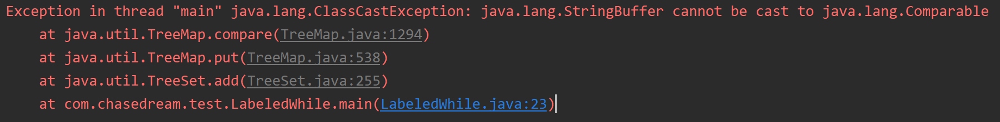

### 注意

1. 当且仅当相应的类实现Comparable接口时，该对象才被认为是可比较的。
2. String类以及所有的包装类都实现了Comparable接口但是StringBuffer并没有实现Comparable接口。因此在上面的代码中我们遇到了ClassCastException
3. 对于一个空的tree-set，当试图将null作为第一值插入时，从JDK 7之后会得到一个NPE。从JDK 1.7开始，TreeSet完全不接受null作为值。然而自JDK6之前，null是允许作为第一个值的。但是后面再试图插入更多的值时，我们便会遇到NPE

因此，这被视为一个bug并在JDK7中被修复了。

### TreeSet中的方法

TreeSet实现了SortedSet接口，所以其Collection，Set和SortedSet中的所有方法的能力。下面是TreeSet中的方法。

1. 1. [void add(Object o):](https://www.geeksforgeeks.org/treeset-add-method-in-java/) This method will add specified element according to some sorting order in TreeSet. Duplicate entires will not get added.
   2. [boolean addAll(Collection c):](https://www.geeksforgeeks.org/treeset-addall-method-in-java/) This method will add all elements of specified Collection to the set. Elements in Collection should be homogeneous otherwise ClassCastException will be thrown. Duplicate Entries of Collection will not be added to TreeSet.
   3. [void clear():](https://www.geeksforgeeks.org/treeset-clear-method-in-java/) This method will remove all the elements.
   4. [boolean contains(Object o):](https://www.geeksforgeeks.org/treeset-contains-method-in-java/) This method will return true if given element is present in TreeSet else it will return false.
   5. [Object first():](https://www.geeksforgeeks.org/treeset-first-method-in-java/) This method will return first element in TreeSet if TreeSet is not null else it will throw NoSuchElementException.
   6. [Object last():](https://www.geeksforgeeks.org/treeset-last-method-in-java/) This method will return last element in TreeSet if TreeSet is not null else it will throw NoSuchElementException.
   7. [SortedSet headSet(Object toElement):](https://www.geeksforgeeks.org/treeset-headset-method-in-java/) This method will return elements of TreeSet which are less than the specified element.
   8. [SortedSet tailSet(Object fromElement):](https://www.geeksforgeeks.org/treeset-tailset-method-in-java/) This method will return elements of TreeSet which are greater than or equal to the specified element.
   9. [SortedSet subSet(Object fromElement, Object toElement):](https://www.geeksforgeeks.org/treeset-subset-method-in-java/) This method will return elements ranging from fromElement to toElement. fromElement is inclusive and toElement is exclusive.
   10. [boolean isEmpty():](https://www.geeksforgeeks.org/treeset-isempty-method-in-java/) This method is used to return true if this set contains no elements or is empty and false for the opposite case.
   11. [Object clone():](https://www.geeksforgeeks.org/treeset-clone-method-in-java/) The method is used to return a shallow copy of the set, which is just a simple copied set.
   12. [int size():](https://www.geeksforgeeks.org/treeset-size-method-in-java/) This method is used to return the size of the set or the number of elements present in the set.
   13. [boolean remove(Object o):](https://www.geeksforgeeks.org/treeset-remove-method-in-java/) This method is used to return a specific element from the set.
   14. [Iterator iterator():](https://www.geeksforgeeks.org/treeset-iterator-method-in-java/) Returns an iterator for iterating over the elements of the set.
   15. [Comparator comparator()](https://www.geeksforgeeks.org/treeset-comparator-method-in-java/): This method will return Comparator used to sort elements in TreeSet or it will return null if default natural sorting order is used.
   16. **[ceiling(E e):](https://www.geeksforgeeks.org/treeset-ceiling-method-in-java-with-examples/)** This method returns the least element in this set greater than or equal to the given element, or null if there is no such element.
   17. **descendingIterator():** This method returns an iterator over the elements in this set in descending order.
   18. **descendingSet():** This method returns a reverse order view of the elements contained in this set.
   19. **floor(E e):** This method returns the greatest element in this set less than or equal to the given element, or null if there is no such element.
   20. **higher(E e):** This method returns the least element in this set strictly greater than the given element, or null if there is no such element.
   21. **lower(E e):** This method returns the greatest element in this set strictly less than the given element, or null if there is no such element.
   22. **pollFirst():** This method retrieves and removes the first (lowest) element, or returns null if this set is empty.
   23. **pollLast():** This method retrieves and removes the last (highest) element, or returns null if this set is empty.
   24. **spliterator():** This method creates a late-binding and fail-fast Spliterator over the elements in this set.

2. ### TreeSet源码分析

3. 见Java源码分析-Set-TreeSet

## HashMap

早在JDK1.2，HashMap就作为Collection的一部分存在。它提供了对Map接口的基本实现。其通过key-value键值对的形式存储。为了访问数据，必须先知道其key值。HashMap之所以称为HashMap是因为它使用了一项称为哈希的技术。哈希散列是将一个大字符串转换为代表相同字符串的小字符串的技术。更小的值更加有利于索引和更快的查找。HashSet的内部也是用了HashMap。其内部使用了一个链表来存储键值对。

### HashMap中的一些重要特性

* HashMap存在于java.util包中
* HashMap继承自抽象类AbstractMap（其提供了Map的不完全实现）
* 同时其还实现了Cloneable接口和Serializable接口。上面定义的K和V分别表示Key和Value
* HashMap不允许存在重复的key值，但是允许存在重读的value。这就意味着一个Key不能有多个value与之对应，但是多个key可以对应同一个value值。
* HashMap允许null作为key，但是由于其key值不允许重复，所以只能存在一个null; 可以有多个value为null
* HashMap不保证元素的顺序；尤其是，其不保证其顺序是一直不变的。它与HashTable大致相似，但不是线程安全的。

### HashMap内部结构

HashMap内部包含一个Node节点的数组，且node节点是有下面四个字段组成的一个Node类：

```java
final int hash;
final K key;
V value;
Node<K,V> next;
```

节点数组的定义如下:

```java
Node<K, V>[] table;
```

可以看到，节点包含对其自身对象的引用，所以其是一个链表。

HashMap结构：


Node结构：


### HashMap性能

HashMap性能取决于两个参数：

1. Initial Capacity
2. Load Factor

如前所属，Capacity是存储区的容量，而Initial Capacity是创建HashMap实例时的容量。Load Factor是进行rehashing时的一个措施。Rehashing增加存储容量的一个过程。在HashMap中，扩容时容量会被乘以2。负载因子也是衡量在重新散列之前允许填充HashMap的哪一部分的度量(即从新散列到哪一部分)。当HashMap中的元素增加时，当前容量和负载因子的乘积会增加，即完成了一次rehash。如果初始容量设置的很大，那么rehash将永远不会被执行。但是如果容量一直保持在很高的位置，那么会增加迭代的复杂度。因此为了挺高性能，在初始值设定必须慎重考虑。设置初始值时应该考虑预估的可能大小。最通常的，优先选用0.75作为负载因子的大小，这是在时间和空间上的一个很好的解决方案。负载因子的值介于0和1之间。

### 同步的HashMap

前面所讲HashMap是非同步的，如多个线程可以同时对一个HashMap进行访问。如果多个线程同时访问HshMap并且至少一个线程对其进行了结构上的操作，则必须在外部进行同步操作。可通过对封装的map某些对象来完成同步。如果不存在这样的对象，则可以将其用Collections.synchronizedMap()包裹以使HashMap得到同步，同时还需要避免一些意外的非同步访问，如下所示：

```java
Map m = Collections.synchronizedMap(new HashMap(...));
```

这样，map就是同步的了。

如果在创建迭代器之后进行了任何的修改操作（除了通过迭代器的remove方法进行的任何形式的修改），便会很快碰到错误，且抛出ConcurrentModificationException异常。

### HashMap构造器

HashMap提供了四个构造器，且每个构造方法的访问权限控制符都是public

1. HashMap():默认的构造函数，初始化HashMap的大小为16，以及负载因子为0.75

   ```java
   /**
    * Constructs an empty <tt>HashMap</tt> with the default initial capacity
    * (16) and the default load factor (0.75).
    */
   public HashMap() {
       this.loadFactor = DEFAULT_LOAD_FACTOR; // all other fields defaulted
   }
   ```

   

2. HashMap(int initialCapcity):指定初始化创建的map容量，使用默认的负载因子0.75

   ```java
    /**
        * Constructs an empty <tt>HashMap</tt> with the specified initial
        * capacity and the default load factor (0.75).
        *
        * @param  initialCapacity the initial capacity.
        * @throws IllegalArgumentException if the initial capacity is negative.
        */
   public HashMap(int initialCapacity) {
       this(initialCapacity, DEFAULT_LOAD_FACTOR);
   }
   ```

3. HashMap(int intialCapcity, float loadFactor):使用指定的初始大小和负载因子创建一个空的HashMap

   ```java
   /**
        * Constructs an empty <tt>HashMap</tt> with the specified initial
        * capacity and load factor.
        *
        * @param  initialCapacity the initial capacity
        * @param  loadFactor      the load factor
        * @throws IllegalArgumentException if the initial capacity is negative
        *         or the load factor is nonpositive
        */
   public HashMap(int initialCapacity, float loadFactor) {
       if (initialCapacity < 0)
           throw new IllegalArgumentException("Illegal initial capacity: " +
                                              initialCapacity);
       if (initialCapacity > MAXIMUM_CAPACITY)
           initialCapacity = MAXIMUM_CAPACITY;
       if (loadFactor <= 0 || Float.isNaN(loadFactor))
           throw new IllegalArgumentException("Illegal load factor: " +
                                              loadFactor);
       this.loadFactor = loadFactor;
       this.threshold = tableSizeFor(initialCapacity);
   }
   ```

   

4. HashMap(Map map): 使用同样的map创建一个HashMap实例

   ```java
   /**
        * Constructs a new <tt>HashMap</tt> with the same mappings as the
        * specified <tt>Map</tt>.  The <tt>HashMap</tt> is created with
        * default load factor (0.75) and an initial capacity sufficient to
        * hold the mappings in the specified <tt>Map</tt>.
        *
        * @param   m the map whose mappings are to be placed in this map
        * @throws  NullPointerException if the specified map is null
        */
   public HashMap(Map<? extends K, ? extends V> m) {
       this.loadFactor = DEFAULT_LOAD_FACTOR;
       putMapEntries(m, false);
   }
   ```

示例：

```java
// Java program to illustrate 
// Java.util.HashMap 
  
import java.util.HashMap; 
import java.util.Map; 
  
public class GFG { 
    public static void main(String[] args) 
    { 
  
        HashMap<String, Integer> map 
            = new HashMap<>(); 
  
        print(map); 
        map.put("vishal", 10); 
        map.put("sachin", 30); 
        map.put("vaibhav", 20); 
  
        System.out.println("Size of map is:- "
                           + map.size()); 
  
        print(map); 
        if (map.containsKey("vishal")) { 
            Integer a = map.get("vishal"); 
            System.out.println("value for key"
                               + " \"vishal\" is:- "
                               + a); 
        } 
  
        map.clear(); 
        print(map); 
    } 
  
    public static void print(Map<String, Integer> map) 
    { 
        if (map.isEmpty()) { 
            System.out.println("map is empty"); 
        } 
  
        else { 
            System.out.println(map); 
        } 
    } 
} 
```

输出：

```
map is empty
Size of map is:- 3
{vaibhav=20, vishal=10, sachin=30}
value for key "vishal" is:- 10
map is empty
```

### HashMap复杂度

对于一些基本的操作其提供常量的时间复杂度，例如get和put方法；只要hash函数能够得到正确的编写并且将其正确散列到bucket中。对HashMap的迭代取决于HashMap的容量以及键值对的数量。基本上，其和capacity+size成正比。Capacity是HashMap中bucket的数量，所以一开始把capacity设的过高并不是一个好主意。

### HashMap方法

1. **[void clear():](https://www.geeksforgeeks.org/hashmap-clear-method-in-java/)** Used to remove all mappings from a map.
2. **[boolean containsKey(Object key):](https://www.geeksforgeeks.org/hashmap-containskey-method-in-java/)** Used to return True if for a specified key, mapping is present in the map.
3. **[boolean containsValue(Object value):](https://www.geeksforgeeks.org/hashmap-containsvalue-method-in-java/)** Used to return true if one or more key is mapped to a specified value.
4. **[Object clone():](https://www.geeksforgeeks.org/hashmap-clone-method-in-java/)** It is used to return a shallow copy of the mentioned hash map.
5. **[boolean isEmpty():](https://www.geeksforgeeks.org/hashmap-isempty-method-in-java/)** Used to check whether the map is empty or not. Returns true if the map is empty.
6. **[Set entrySet():](https://www.geeksforgeeks.org/hashmap-entryset-method-in-java/)** It is used to return a set view of the hash map.
7. **[Object get(Object key):](https://www.geeksforgeeks.org/hashmap-get-method-in-java/)** It is used to retrieve or fetch the value mapped by a particular key.
8. **[Set keySet():](https://www.geeksforgeeks.org/hashmap-keyset-method-in-java/)** It is used to return a set view of the keys.
9. **[int size():](https://www.geeksforgeeks.org/hashmap-size-method-in-java/)** It is used to return the size of a map.
10. **[Object put(Object key, Object value):](https://www.geeksforgeeks.org/hashmap-put-method-in-java/)** It is used to insert a particular mapping of key-value pair into a map.
11. **[putAll(Map M):](https://www.geeksforgeeks.org/hashmap-putall-method-in-java/)** It is used to copy all of the elements from one map into another.
12. **[Object remove(Object key):](https://www.geeksforgeeks.org/hashmap-remove-method-in-java/)** It is used to remove the values for any particular key in the Map.
13. **[Collection values():](https://www.geeksforgeeks.org/hashmap-values-method-in-java/)** It is used to return a Collection view of the values in the HashMap.
14. **[compute(K key, BiFunction remappingFunction)](https://www.geeksforgeeks.org/hashmap-compute-method-in-java-with-examples/):** This method Attempts to compute a mapping for the specified key and its current mapped value (or null if there is no current mapping).
15. **[computeIfAbsent(K key, Function mappingFunction)](https://www.geeksforgeeks.org/hashmap-computeifabsent-method-in-java-with-examples/):** This method If the specified key is not already associated with a value (or is mapped to null), attempts to compute its value using the given mapping function and enters it into this map unless null.
16. **computeIfPresent(K key, BiFunction remappingFunction):** This method If the value for the specified key is present and non-null, attempts to compute a new mapping given the key and its current mapped value.
17. **forEach(BiConsumer action):** This method Performs the given action for each entry in this map until all entries have been processed or the action throws an exception.
18. **getOrDefault(Object key, V defaultValue):** This method returns the value to which the specified key is mapped, or defaultValue if this map contains no mapping for the key.
19. **merge(K key, V value, BiFunction remappingFunction):** This method If the specified key is not already associated with a value or is associated with null, associates it with the given non-null value.
20. **putIfAbsent(K key, V value):** This method If the specified key is not already associated with a value (or is mapped to null) associates it with the given value and returns null, else returns the current value.
21. **replace(K key, V value):** This method replaces the entry for the specified key only if it is currently mapped to some value.
22. **replace(K key, V oldValue, V newValue):** This method replaces the entry for the specified key only if currently mapped to the specified value.
23. **replaceAll(BiFunction function):** This method replaces each entry’s value with the result of invoking the given function on that entry until all entries have been processed or the function throws an exception.

### HashMap源码分析

见Java源码分析-Map-HashMap

## WeakHashMap

Hash table based implementation of the Map interface, with weak keys. An entry in a WeakHashMap will automatically be removed when its key is no longer in ordinary use. More precisely, the presence of a mapping for a given key will not prevent the key from being discarded by the garbage collector, that is, made finalizable, finalized, and then reclaimed. When a key has been discarded its entry is effectively removed from the map, so this class behaves somewhat differently from other Map implementations.

### WeakHashMap的一些重要特性

* value和key都可以为null
* 不是线程安全的
* <font color=red>This class is intended primarily for use with key objects whose equals methods test for object identity using the == operator.</font>

### WeakHashMap构造函数

1. **WeakHashMap():** 使用默认的 initial capacity-(16) and load factor (0.75)创建一个空的WeakHashMap
2. **WeakHashMap(int initialCapacity):** 使用给定的initial capacity和默认的load factor (0.75)创建一个空的WeakHashMap.
3. **WeakHashMap(int initialCapacity, float loadFactor):** 使用给定的 initial capacity和给定的 load factor创建一个空的WeakHashMap.
4. **WeakHashMap(Map m):** This constructor is used to create a new WeakHashMap with the same mappings as the specified map.

### WeakHashMap中的方法

1. [void clear():](https://www.geeksforgeeks.org/weakhashmap-clear-method-in-java/) 

   The method removes all of the mappings from this map. The map will be empty after this call returns.

   ```
   Syntax: public void clear().
   Returns: NA.
   Exception: NA.
   ```

2. [boolean containsValue(Object value):](https://www.geeksforgeeks.org/weakhashmap-containsvalue-method-in-java/) 

   this method returns true if this map maps one or more keys to the specified value.

   ```
   Syntax: public boolean containsValue(Object value).
   Returns: true if this map maps one or more keys to the specified value.
   Exception: NA
   ```

3. [boolean containsKey(Object key):](https://www.geeksforgeeks.org/weakhashmap-containskey-method-in-java/) 

   This method returns true if this map contains a mapping for the specified key.

   ```
   Syntax: public boolean containsKey(Object key).
   Returns: true if there is a mapping for key; false otherwise.
   Exception: NA
   ```

4. [put(K key, V value):](https://www.geeksforgeeks.org/weakhashmap-put-method-in-java/) 

   Associates the specified value with the specified key in this map. If the map previously contained a mapping for this key, the old value is replaced.

   ```
   Syntax: public put(K key, V value).
   Returns: the previous value associated with key, 
   or null if there was no mapping for key. 
   (A null return can also indicate that the 
   map previously associated null with key.)
   Exception: NA
   ```

5. [boolean isEmpty():](https://www.geeksforgeeks.org/weakhashmap-isempty-method-in-java-with-examples/) 

   Returns true if this map contains no key-value mappings. This result is a snapshot, and may not reflect unprocessed entries that will be removed before next attempted access because they are no longer referenced.

   ```
   Syntax: public boolean isEmpty()
   Returns: true if this map contains no key-value mappings.
   Exceptions: NA
   ```

   ```java
   // Java code illustrating clear(), containsValue() 
   // containsKey() and isEmpty() method 
     
   import java.util.Map; 
   import java.util.WeakHashMap; 
     
   class WeakHashMapdemo 
   { 
       public static void main(String[] arg) 
       { 
           Map<Number, String> weak = new WeakHashMap<Number, String>(); 
           weak.put(1, "geeks"); 
           weak.put(2, "for"); 
           weak.put(3, "geeks"); 
             
           // Checking weak map 
           System.out.println("our weak map: " + weak); 
             
           // Checking if "for" exist 
           if(weak.containsValue("for")) 
               System.out.println("for exist"); 
             
           // Checking if 1 exist as a key in map 
           if(weak.containsKey(1)) 
               System.out.println("1 exist"); 
             
           // Removing all data 
           weak.clear(); 
             
           // Checking whether map is empty or not 
           if(weak.isEmpty()) 
               System.out.println("empty map: " + weak); 
       } 
   } 
   ```

   **Output:**

   ```
   our weak map: {3=geeks, 2=for, 1=geeks}
   for exist
   1 exist
   empty map: {}
   ```

6. [Set entrySet():](https://www.geeksforgeeks.org/weakhashmap-entryset-method-in-java/) 

   Returns a Set view of the mappings contained in this map. The set is backed by the map, so changes to the map are reflected in the set, and vice-versa. If the map is modified while an iteration over the set is in progress (except through the iterator's own remove operation, or through the setValue operation on a map entry returned by the iterator) the results of the iteration are undefined. The set supports element removal, which removes the corresponding mapping from the map, via the Iterator.remove, Set.remove, removeAll, retainAll and clear operations. It does not support the add or addAll operations.

   ```
   Syntax: public Set entrySet()
   Returns: a set view of the mappings contained in this map.
   Exception: NA
   ```

7. [Set keySet():](https://www.geeksforgeeks.org/weakhashmap-keyset-method-in-java/) 

   Returns a Set view of the keys contained in this map. The set is backed by the map, so changes to the map are reflected in the set, and vice-versa. If the map is modified while an iteration over the set is in progress (except through the iterator's own remove operation), the results of the iteration are undefined. The set supports element removal, which removes the corresponding mapping from the map, via the Iterator.remove, Set.remove, removeAll, retainAll, and clear operations. It does not support the add or addAll operations.

   ```
   Syntax: public Set keySet().
   Returns: a set view of the keys contained in this map
   Exception: NA
   ```

8. [Collection values():](https://www.geeksforgeeks.org/weakhashmap-values-method-in-java/) 

   Returns a Collection view of the values contained in this map. The collection is backed by the map, so changes to the map are reflected in the collection, and vice-versa. If the map is modified while an iteration over the collection is in progress (except through the iterator's own remove operation), the results of the iteration are undefined. The collection supports element removal, which removes the corresponding mapping from the map, via the Iterator.remove, Collection.remove, removeAll, retainAll and clear operations. It does not support the add or addAll operations.

   ```
   Syntax: public Collection values().
   Returns: a collection view of the values contained in this map
   Exception: NA
   ```

   ```java
   // Java code illustrating entrySet(), keySet() and Values() 
     
   import java.util.Collection; 
   import java.util.Map; 
   import java.util.Set; 
   import java.util.WeakHashMap; 
     
   class WeakHashMapdemo 
   { 
       public static void main(String[] arg) 
       { 
           Map<Number, String> weak = new WeakHashMap<Number, String>(); 
           weak.put(1, "geeks"); 
           weak.put(2, "for"); 
           weak.put(3, "geeks"); 
             
           Set set1 = weak.entrySet(); 
             
           // Checking set 
           System.out.println(set1); 
             
           // Creating set for key 
           Set keySet = weak.keySet(); 
             
           // Checking keySet 
           System.out.println("key set: " + keySet ); 
             
           Collection value = weak.values(); 
             
           // Checking values of map 
           System.out.println("values: " + value); 
       } 
   } 
   ```

   **Output:**

   ```
   [3=geeks, 2=for, 1=geeks]
   key set: [3, 2, 1]
   values: [geeks, for, geeks]
   ```

9. [void putAll(Map m):](https://www.geeksforgeeks.org/weakhashmap-putall-method-in-java/) 

   Copies all of the mappings from the specified map to this map. These mappings will replace any mappings that this map had for any of the keys currently in the specified map.

   

   ```
   Syntax: public void putAll(Map m)
   Returns: NA
   Exception: 
   NullPointerException - if the specified map is null.
   ```

10. [V get(Object key):](https://www.geeksforgeeks.org/weakhashmap-get-method-in-java/) 

    Returns the value to which the specified key is mapped, or null if this map contains no mapping for the key.

    ```
    Syntax: public V get(Object key)
    Returns: the value to which the specified 
    key is mapped, or null if this map contains no mapping for the key
    Exception: NA
    ```

11. [V remove(Object key):](https://www.geeksforgeeks.org/weakhashmap-remove-method-in-java/) 

    Removes the mapping for a key from this weak hash map if it is present. More formally, if this map contains a mapping from key k to value v such that (key==null ? k==null : key.equals(k)), that mapping is removed.

    ```
    Syntax: public V remove(Object key)
    Returns: the previous value associated with key, or 
    null if there was no mapping for key
    Exception: NA.
    ```

12. [int size():](https://www.geeksforgeeks.org/weakhashmap-size-method-in-java/) 

    Returns the number of key-value mappings in this map. This result is a snapshot, and may not reflect unprocessed entries that will be removed before next attempted access because they are no longer referenced.

    ```
    Syntax: public int size()
    Returns: the number of key-value mappings in this map.
    Exception: NA
    ```

    ```java
    // Java code remove(), putAll() 
    // get() and size() method 
      
    import java.util.Collection; 
    import java.util.Map; 
    import java.util.Set; 
    import java.util.WeakHashMap; 
      
    class WeakHashMapdemo 
    { 
        public static void main(String[] arg) 
        { 
            Map<Number, String> weak = new WeakHashMap<Number, String>(); 
            weak.put(1, "geeks"); 
            weak.put(2, "for"); 
            weak.put(3, "geeks"); 
              
            Map<Number, String> weak1 = new WeakHashMap<Number, String>(); 
            weak1.putAll(weak); 
              
            // getting value of key 2 
            System.out.println(weak1.get(2)); 
              
            // size of map 
            System.out.println("Size of map is: " + weak1.size()); 
              
            // removing 2nd element 
            weak1.remove(2); 
              
            // size after removing key and value pair 
            System.out.println("Size after removing: " + weak1.size()); 
        } 
    } 
    ```

    **Output:**

    ```
    for
    Size of map is: 3
    Size after removing: 2
    ```

1. 

### WeakHashMap源码剖析

见Java源码分析-Map-WeakHashMap

## Deprecate集合

Java集合框架的更新迭代至今，其中Vector，Stack，HashTable已经废弃，不建议使用

### Vector

Vector 是**矢量队列**，它是JDK1.0版本添加的类。继承于AbstractList，实现了List, RandomAccess, Cloneable这些接口。
Vector 继承了AbstractList，实现了List；所以，**它是一个队列，支持相关的添加、删除、修改、遍历等功能**。
Vector 实现了RandmoAccess接口，即**提供了随机访问功能**。RandmoAccess是java中用来被List实现，为List提供快速访问功能的。在Vector中，我们即可以通过元素的序号快速获取元素对象；这就是快速随机访问。
Vector 实现了Cloneable接口，即实现clone()函数。它能被克隆。

和ArrayList不同，**Vector中的操作是线程安全的**；

其实ArrayListhe和Vector在用法上完全相同.但由于Vector是一个古老的集合.(从jdk1.0就有了),那时候java还没有提供系统的集合框架,所以在Vector里提供了一些方法名很长的方法.例如:addElement(Object obj),实际上这个方法和add(Object obj)没什么区别.

**从jdk1.2以后,Java提供了系统的集合框架,就将Vector改为实现List接口,作为List的实现之一**,从而导致Vector里有一些重复的方法.

Vector里有一些功能重复的方法,这些方法中方法名更短的是属于后来新增的方法.更长的是原先vector的方法.而后来ArrayList是作为List的主要实现类.看过的Java思想编程中也提到了Vector有很多缺点.尽量少用Vector实现类.

### Stack

public class Stack<E>**extends Vector**

由于Vector是通过数组实现的，这就意味着，Stack也是通过数组实现的，而非链表。

Stack类表示后进先出（LIFO）的对象堆栈。它通过五个操作对类Vector进行了扩展 ，允许将向量视为堆栈。它提供了通常的push和pop操作，以及取堆栈顶点的peek方法、测试堆栈是否为空的empty方法、在堆栈中查找项并确定到堆栈顶距离的search方法。

首次创建堆栈时，它不包含项。

**Deque** **接口及其实现提供了 LIFO 堆栈操作的更完整和更一致的 set，应该优先使用此 set，而非此类**。例如：

Deque<Integer> stack = new ArrayDeque<Integer>();

### 结论

**这两个都是jdk1.0的过时API,应该避免使用.因此不再对其源码进行解析学习.**

**jdk1.5新增了很多多线程情况下使用的集合类.位于java.util.concurrent.**

**如果你说,Vector是同步的,你要在多线程使用.那你应该使用java.util.concurrent.CopyOnWriteArrayList等而不是Vector.**

**如果你要使用Stack做类似的业务.那么非线程的你可以选择linkedList,多线程情况你可以选择java.util.concurrent.ConcurrentLinkedDeque 或者java.util.concurrent.ConcurrentLinkedQueue**

**多线程情况下,应尽量使用java.util.concurrent包下的类.**

## 集合视图

### 概念

Java集合中，我们可以通过视图（View）获得其他实现的了Collection和Map接口的对象。例如，我们在使用Map类的keySet方法获得一个Set集合对象。初看起来，这个方法创建了一个新的set集合，然后将所有的键都填进去，然后返回这个集合。但是，情况并非如此，keySet返回一个实现Set接口的类对象，这个类的方法对原来的Map对象进行操作。这个集合就称为视图（view）。（详细的原理见Java源码分析-Map-HashMap-keyset）

### 轻量级集合包装器

（1）. ArraylList.asList方法

在Arrays类中有一个静态方法--asList方法，这个方法作用是：将普通的Java数组包装成一个List集合。例如：

```java
String []strings = new String[10];
strings[0] = "geeks";
strings[1] = "for";
strings[2] = "geeks";
List<String> stringList = Arrays.asList(strings);
```

返回的对象不是一个ArrayList对象。它就是一个视图对象，这个对象带有底层数组的get和set方法。
那这个视图对象与普通的List或者ArrayList对象有什么区别吗？
在这里，视图对象不能操作所有改变数组大小的方法(比如说，add方法和remove方法)，在调用这些方法的时候，程序会抛出一个UnsupportedOperationException异常；但是普通的List对象能够正常的调用改变数组大小的方法。

（2）. Collections.nCopies方法

与Arrays.asList方法类似的另一个方法那就是在Collection中的nCopies方法。例如：

```java
List<String> stringList = Collections.nCopies(100, "geeks");
```

上面的代码将创建一个包含100个"geeks"字符串的List集合对象。这样的操作优势在于存储代价很小，因为这个对象不能修改大小。这就是视图技术的一种巧妙应用。

### 子范围

在Java中，我们还可以给 很多的集合建立**子范围视图**。例如，假设有一个集合对象list，我们想要从中取出第10个~第19个元素。可以使用subList方法来获得一个List集合对象的子范围视图。例如：

```java
List<String> list = new ArrayList<>();
for (int i = 0; i < 20; i++) {
    list.add("" + i);
}
System.out.println(list);
//获取第10个~第19个
List<String> list2 = list.subList(9, 20);

System.out.println(list2);
System.out.println(list);
//清空自子范围视图之后，原来的List集合对象相应位置的数据也会被自动清空的
list2.clear();
System.out.println(list2);
System.out.println(list);
```

### 只读视图

Collections还有几个方法，用于产生集合的不可修改视图。这些视图对现有的集合增加了一个运行时的检查。如果发现对集合进行修改的话(这里不仅仅是改变数组的大小，并且包括set之类的方法)，就会抛出一个异常，同时这个集合将保持未修改的状态。
可以使用如下8种方法来获得不可修改的视图：

1. Collections.unmodifiableCollection

2. Collections.unmodifiableList

3. Collections.unmodifiableSet
4. Collections.unmodifiableSortedSet

5. Collections.unmodifiableNavigableSet

6. Collections.unmodifiableMap

7. Collections.unmodifiableSortedMap

8. Collections.unmodifiableNavigableMap

每个方法都定义于一个接口。例如，Collections.unmodifiableList方法定义于List接口，与ArrayList、LinkedList或者任何实现了List接口的其他类一起协同工作。
例如，假设想要查看某个集合的内容，但是又能避免这个集合会被修改的情况，就可以进行下列的操作：

```java
LinkedList<String> list = new LinkedList<>();
list.add("geeks");
list.add("for geeks");
List<String> list2 = Collections.unmodifiableList(list);
//是不能被修改的
//list2.set(0, "geek");
```

Collections.unmodifiableList方法将返回一个List集合的对象(视图对象)，我们可以从这个视图对象中取得内容，但是不能修改，因为在个视图对象中，所有修改类型的方法已经被重新定义为一个抛出UnsupportOperationException的异常，而不是将方法的调用传递给底层集合对象(这里底层集合对象指的就是当前List集合对象的实际类型对象，这种调用方式是由于Java的多态性导致的)。
但是我们这里需要注意的是，不可更改的视图对象并不是指集合本身不可修改，我们仍然可以通过集合原来的引用来(犹如上面例子中的list)对集合进行修改。同时，如果原来的引用修改了集合，那么视图对象的内容也是跟着变化的。

### 同步视图

如果多个线程访问集合，就确保集合不会被意外的破坏。例如，如果一个线程视图将元素添加到Hash表中，同时另一个线程正在对Hash表进行再散列，这种操作的结果是灾难性的。
但是我们使用视图机制来确保常规集合的线程安全，而不是实现线程安全的集合类。例如，Collections类的静态方法synchronizedMap方法可以将任何一个映射表转换成为具有同步访问方法的Map：

```java
Map<String, String> map = Collections.synchrizedMap(new HashMap<String, String>());
```

现在，就可以自由的使用多线程来访问map对象了。像get和put这类方法都是同步操作的，即在另一个线程中调用另一个方法之前，刚才的方法调用必须彻底执行完毕。

### 受查视图

受查视图时用来对泛型类型发生问题时，提供调试的支持

```java
List<String> list = new ArrayList<>();
List list2 = list;
//程序运行到这里是不会报错的，但是如果后面访问这里元素，
//并且试图强制转换为String类型的变量才会抛出一个ClassCastException的异常
list2.add(10);
//这里会抛出ClassCastException异常
//String string = (String) list2.get(0);
```

例如，上面的例子，先创建了一个List<String>类型的对象，再将它的泛型类型擦除，变成了List类型，由于泛型类型被擦除，原来的泛型类型就会被Object代替，所以我们在list2中添加一个整数(Integer)类型是不会有问题的，同时程序运行到add方法那里也不会报错的。也就是说，程序的编译时和运行时的错误，我们都成功的越过去了。但是在将添加进去的那个元素强制转成为String类型，就会抛出ClassCastException的异常。如果我们使用受查视图的话，例如：

```java
List<String> list3 = Collections.checkedList(list, String.class);
List list4 = list3;
//程序运行到这里就会抛出一个ClassCastException的异常
list4.add(10);
```

虽然在编译时，程序是没有报错的，但是程序一旦运行到add方法那里直接会抛出一个ClassCastException的异常。也就是说，通过受查视图，可以逃避编译时的检查，但是躲不过运行时的检查！

## List 和 Set 区别

相同点：都用于存储对象，并提供方便的Api来插入，删除和检索元素，以及支持迭代

List代表的是有序的，可重复的集合，之前插入的任何元素都会比之后插入的任何元素小；而Set代表的是无序的，不可重复的集合，如果在Set中插入重复项，则会替换旧值

Set使用equals方法来检查存储在Set中的元素的唯一性，而SortedSet使用campareTo来实现自然排序

java中List接口的实现包括ArrayList，Vector，LinkedList；Set接口的实现包括HashSet（快速查询的Set），TreeSet（保存次序的Set，底层为树结构，可以从Set中提取有序的序列）和LinkedHashSet（具有HashSet的查询速度，且内部使用链表维护元素的顺序（插入的次序））

## Set和hashCode以及equals方法的联系

  往Set中add对象时，会调用Hashset中的add方法，然后会调用map的put方法，再调用putVal方法，具体干了什么，我们可以通过阅读源码，一目了然（位于java.util包中的HashMap.class中的第625行开始）：

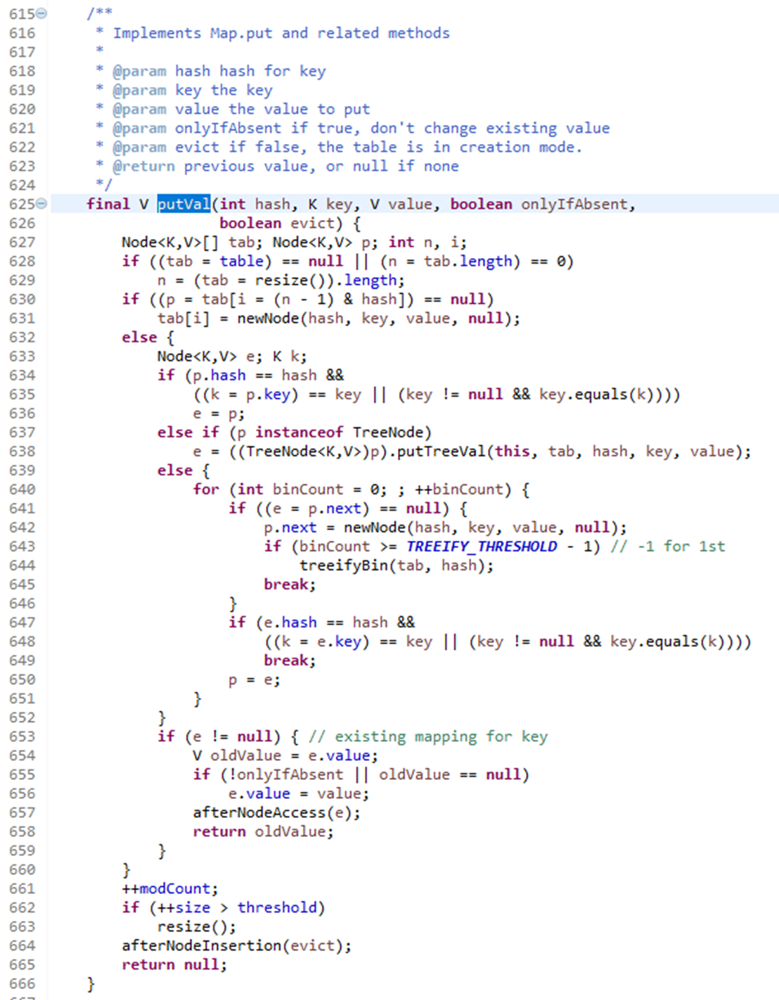

## List 和 Map 区别

这个问题可以衍生为Collection和Map的区别：

1.Collection类型者，每个位置只有一个元素

2.Map类型者，持有key-value pair

Map代表有映射关系的集合，每个元素都包含一对键对象和值对象，查看源码，可以看到Map没有继承任何接口

 

执行效率是Map的一个大问题。看看get()要做哪些事，就会明白为什么在ArrayList中搜索“键”是相当慢的。而这正是HashMap提高速 度的地方。HashMap使用了特殊的值，称为“散列码”(hash code)，来取代对键的缓慢搜索。“散列码”是“相对唯一”用以代表对象的int值，它是通过将该对象的某些信息进行转换而生成的。所有Java对象都 能产生散列码，因为hashCode()是定义在基类Object中的方法。

 

HashMap就是使用对象的hashCode()进行快速查询的。此方法能够显着提高性能。

 

Map : 维护“键值对”的关联性，使你可以通过“键”查找“值”

 

HashMap：Map基于散列表的实现。插入和查询“键值对”的开销是固定的。可以通过构造器设置容量capacity和负载因子load factor，以调整容器的性能。

 

LinkedHashMap： 类似于HashMap，但是迭代遍历它时，取得“键值对”的顺序是其插入次序，或者是最近最少使用(LRU)的次序。只比HashMap慢一点。而在迭代访问时发而更快，因为它使用链表维护内部次序。

 

TreeMap ： 基于红黑树数据结构的实现。查看“键”或“键值对”时，它们会被排序(次序由Comparabel或Comparator决定)。TreeMap的特点在 于，你得到的结果是经过排序的。TreeMap是唯一的带有subMap()方法的Map，它可以返回一个子树。

 

WeakHashMao ：弱键(weak key)Map，Map中使用的对象也被允许释放: 这是为解决特殊问题设计的。如果没有map之外的引用指向某个“键”，则此“键”可以被垃圾收集器回收。

 

IdentifyHashMap： : 使用==代替equals()对“键”作比较的hash map。专为解决特殊问题而设计。


 

**各自旗下的子类关系**

​    **Collection**

   --List：将以特定次序存储元素。所以取出来的顺序可能和放入顺序不同。

​      --ArrayList / LinkedList / Vector

   --Set ： 不能含有重复的元素

​      --HashSet / TreeSet

   **Map**

   --HashMap

   --HashTable

   --TreeMap


 


 

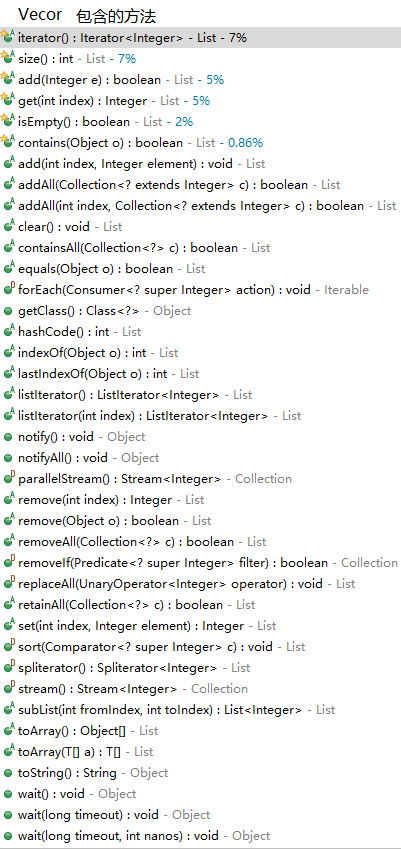

**其他特征**

List，Set，Map将持有对象一律视为Object型别。

 

Collection、List、Set、Map都是接口，不能实例化。

继承自它们的 ArrayList, Vector, HashTable, HashMap是具象class，这些才可被实例化。

vector容器确切知道它所持有的对象隶属什么型别。vector不进行边界检查。

 

**List****、Set、Map总结**

\1. 如果涉及到堆栈，队列等操作，应该考虑用List，对于需要快速插入，删除元素，应该使用LinkedList，如果需要快速随机访问元素，应该使用ArrayList。

\2. 如果程序在单线程环境中，或者访问仅仅在一个线程中进行，考虑非同步的类，其效率较高，如果多个线程可能同时操作一个类，应该使用同步的类。

\3. 在除需要排序时使用TreeSet,TreeMap外,都应使用HashSet,HashMap,因为他们 的效率更高。

\4. 要特别注意对哈希表的操作，作为key的对象要正确复写equals和hashCode方法。

\5. 容器类仅能持有对象引用（指向对象的指针），而不是将对象信息copy一份至数列某位置。一旦将对象置入容器内，便损失了该对象的型别信息。

\6. 尽量返回接口而非实际的类型，如返回List而非ArrayList，这样如果以后需要将ArrayList换成LinkedList时，客户端代码不用改变。这就是针对抽象编程。

**注意：**

1、Collection没有get()方法来取得某个元素。只能通过iterator()遍历元素。

2、Set和Collection拥有一模一样的接口。

3、List，可以通过get()方法来一次取出一个元素。使用数字来选择一堆对象中的一个，get(0)...。(add/get)

4、一般使用ArrayList。用LinkedList构造堆栈stack、队列queue。

5、Map用 put(k,v) / get(k)，还可以使用containsKey()/containsValue()来检查其中是否含有某个key/value。

   HashMap会利用对象的hashCode来快速找到key。

6、Map中元素，可以将key序列、value序列单独抽取出来。

使用keySet()抽取key序列，将map中的所有keys生成一个Set。

使用values()抽取value序列，将map中的所有values生成一个Collection。

为什么一个生成Set，一个生成Collection？那是因为，key总是独一无二的，value允许重复。

## Arraylist 与 LinkedList 区别

  ArrayList：代表长度可改变的数组，可以对元素进行随机访问，但是想向其中插入和删除的速度慢

  LinkedList：实现中采用链表数据结构，插入和删除速度快，访问速度慢

   

*使用LinkedList实现堆栈、队列和双向队列？

堆栈：先进后出

队列：先进先出

只需重新封装一下LinkedList中的addFirst和addLast方法即可


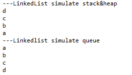

## ArrayList 与 Vector 区别

1.ArrayList不是线程安全的，而vector是线程安全的，这一点可以阅读Vector的源码可以看到大部分的方法都加了synchronized关键字修饰（位于java.util包中的Vector.class）：

 

\2. ArrayList和Vector都采用线性连续存储空间，当存储空间不足的时候，ArrayList默认增加原来的50%(2*0.75?)，Vector默认增加为原来的一倍；

 

3.Vector可以设置capacityIncrement，而ArrayList不可以，从字面理解就是capacity容量，Increment增加，容量增长的参数。

 

阅读源码比较：

ArrayList：


Vector：


 

**从构造函数上看不出太大的差别，可以对比他们的add方法就可以看出明显的差别了。**

## HashMap 和 Hashtable 的区别

虽然HashMap和HashTable都是基于散列表的数据结构，并且都实现了Map接口，但是它们的主要区别是HashMap不是线程安全的，而HashTable是线程安全的。这意味着你不能在没有同步的情况下在多线程Java应用程序中使用HashMap。另一个区别是HashMap允许一个空键和空值，但是Hashtable不允许空键或值。而且，HashTable的线程安全性是使用内部同步实现的，这使得它比HashMap慢。

 

HashMap和Hashtable都实现了Map接口，但它们之间有一些重要的区别，在决定是使用Java的HashMap还是Hashtable之前，需要记住一些重要的区别。其中一些是线程安全，同步和高速的。以下是这些差异：

1.HashMap类大致等同于Hashtable，不同之处在于它是非同步的并且允许空值。 （HashMap允许空值作为键和值，而Hashtable不允许空值）。

\2. HashMap和Hashtable的主要区别之一是HashMap是非同步的，而Hashtable是同步的，这意味着Hashtable是线程安全的，可以在多个线程之间共享，但HashMap不能在没有正确同步的情况下在多个线程之间共享。 Java 5引入了ConcurrentHashMap，它是Hashtable的一个替代方案，并提供比Java中的Hashtable更好的可伸缩性。

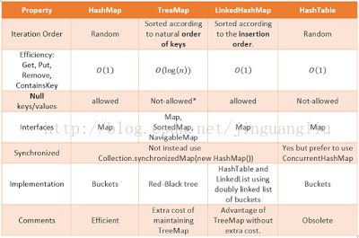

\3. HashMap和Hashtable的另一个显着区别是，HashMap中的迭代器是一个快速迭代器，而Hashtable的枚举器不是，并且如果任何其他线程通过添加或删除元素，而非通过Iterator自身的remove()修改映射，则抛出ConcurrentModificationException。但是，这不是一个有保证的行为，并将尽最大努力由JVM完成。这也是Java中的Enumeration和Iterator之间的一个重要区别。

\4. Hashtable和HashMap之间的一个更显着的区别是，由于线程安全和同步，如果在单线程环境中使用Hashtable比HashMap慢得多。所以，如果你不需要同步，HashMap只能被一个线程使用，那么它比Java中的Hashtable要好。

 

\5. HashMap不能保证Map的顺序会随着时间的推移保持不变。

 

HashMap和Hashtable：关于一些重要术语的注释

1）同步意味着只有一个线程可以在一个时间点修改一个哈希表。基本上，这意味着在对Hashtable执行更新之前，任何线程都必须获取对象上的锁，而其他人将等待锁释放。

 

2）故障安全（fail-safe）与迭代器的上下文有关。如果在集合对象上创建了Iterator或ListIterator，并且某个其他线程尝试修改集合对象的“结构”，则将引发并发修改异常。其他线程可能调用“set”方法，因为它不会“结构性”地修改集合。但是，如果在调用“set”之前，集合已经在结构上进行了修改，则会抛出“IllegalArgumentException”异常。

3）结构性修改是指删除或插入可以有效改变映射结构的元素。HashMap可以被同步

 

Map m = Collections.synchronizeMap(hashMap);

 

总之，Java中的Hashtable和HashMap之间有很大的不同。**考虑到线程的安全性和速度，只能选择使用Hashtable，如果你绝对需要线程安全，并且运行Java 5及以上版本，可以考虑在Java中使用ConcurrentHashMap。**

## HashSet 和 HashMap 区别


**HashMap**是实现Map<K,V>接口的一个实体类，它对键值做了一对一的映射关系，当然里面键值不能重复。Map 接口提供三种collection 视图，允许以键集、值集或键-值映射关系集的形式查看某个映射的内容。映射顺序 定义为迭代器在映射的 collection 视图上返回其元素的顺序。某些映射实现可明确保证其顺序，如 TreeMap 类；另一些映射实现则不保证顺序，如 HashMap 类。

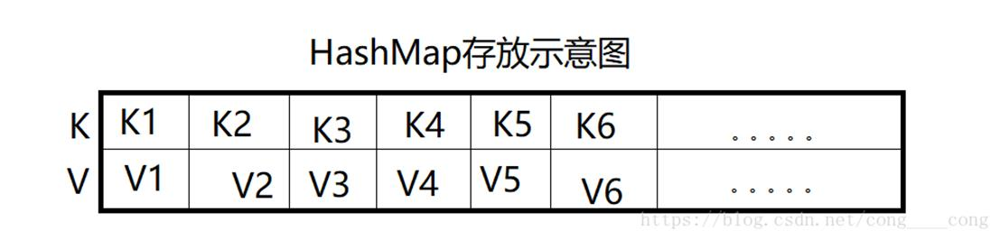

**HashSet**是实现Set<E>接口的一个实体类，数据是以哈希表的形式存放的，里面的不能包含重复数据。Set接口是一种一个不包含重复元素的 collection。

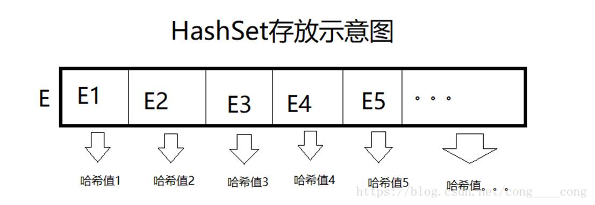

 

**两者之间的的区别？**

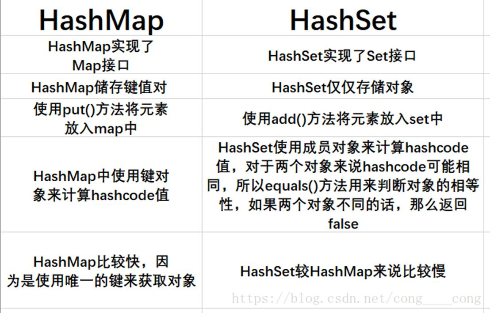

## HashMap 和 ConcurrentHashMap 的区别

为什么要引入ConcurrentHashMap？

ConcurentHashMap是怎样保证线程安全的？

HashMap和ConcurrentHashMap使用上要注意什么，它们有哪些是有明显区别的？

## HashMap 的工作原理及代码实现，什么时候用到红黑树


## 多线程情况下HashMap死循环的问题

[**https://blog.csdn.net/zhousenshan/article/details/52895874**](https://blog.csdn.net/zhousenshan/article/details/52895874)

[**https://www.cnblogs.com/dongguacai/p/5599100.html**](https://www.cnblogs.com/dongguacai/p/5599100.html)

## HashMap出现Hash DOS攻击的问题

## ConcurrentHashMap 的工作原理及代码实现，如何统计所有的元素个数

[**https://blog.csdn.net/helei810304/article/details/79786606**](https://blog.csdn.net/helei810304/article/details/79786606)

## 手写简单的HashMap

[**https://blog.csdn.net/it_lihongmin/article/details/76377229**](https://blog.csdn.net/it_lihongmin/article/details/76377229)

## 看过哪些Java集合类的源码

## 总结

|                 | 单线程                                                       | 并发                                                         |
| --------------- | ------------------------------------------------------------ | ------------------------------------------------------------ |
| Lists           | `ArrayList`——基于泛型数组 <br>`LinkedList`——不推荐使用 <br> `Vector`——已废弃（deprecated） | `CopyOnWriteArrayList`——几乎不更新，常用来遍历               |
| Queues / deques | `ArrayDeque`——基于泛型数组 <br>`Stack`——已废弃（deprecated）<br> `PriorityQueue`——读取操作的内容已排序 | `ArrayBlockingQueue`——带边界的阻塞式队列 <br>`ConcurrentLinkedDeque / ConcurrentLinkedQueue`——无边界的链表队列（CAS）<br> `DelayQueue`——元素带有延迟的队列<br> `LinkedBlockingDeque / LinkedBlockingQueue`——链表队列（带锁），可设定是否带边界 `LinkedTransferQueue`——可将元素<br>`transfer`进行w/o存储<br> `PriorityBlockingQueue`——并发`PriorityQueue`<br> `SynchronousQueue`——使用`Queue`接口进行`Exchanger` |
| Maps            | `HashMap`——通用Map<br/> `EnumMap`——键使用`enum` <br/>`Hashtable`——已废弃（deprecated）<br/> `IdentityHashMap`——键使用`==`进行比较<br/> `LinkedHashMap`——保持插入顺序 <br/>`TreeMap`——键已排序 <br/>`WeakHashMap`——适用于缓存（cache） | `ConcurrentHashMap`——通用并发<br>Map `ConcurrentSkipListMap`——已排序的并发Map |
| Sets            | `HashSet`——通用set <br>`EnumSet`——`enum` Set <br>`BitSet`——比特或密集的整数Set <br>`LinkedHashSet`——保持插入顺序 <br>`TreeSet`——排序Set |                                                              |


 ## 集合互操作

set，list，map， array

list<->set,set<->array, list<->array, map->list

sort：

set按插入顺序，set按

list排序

map按key/value排序

array排序

### List, Set

```java
/**
* list to set
*
* @param list need to be converted list.
* @param <E>  element type
* @return converted set
*/
public static <E> Set<E> toSet(List<E> list) {
    return new HashSet<>(list);
}

/**
 * set to list
 *
 * @param set need to be converted set
 * @param <E> element type
 * @return converted list
 */
public static <E> List<E> toList(Set<E> set) {
    return new ArrayList<>(set);
}
```

### Map按key/value排序

```java
/**
 * Before JDK 1.7 ,we can sorted according to value like this
 * @param map the map need to be sorted.
 * @param <K> key type
 * @param <V> value type
 * @return the map after sorted.
 */
/*public static <K, V extends Comparable<? super V>> Map<K, V> sortByValue(Map<K, V> map) {
	List<Map.Entry<K, V>> list = new LinkedList<>(map.entrySet());
	Collections.sort(list, Comparator.comparing(Map.Entry::getValue));

	Map<K, V> result = new LinkedHashMap<>();
	for (Map.Entry<K, V> entry : list) {
		result.put(entry.getKey(), entry.getValue());
	}
	return result;
}*/

/**
 * After JDK 1.8(also include) ,we can sorted map according to value with Stream.
 *
 * @param map the map need to be sorted.
 * @param <K> key type
 * @param <V> value type
 * @return the map after sorted.
 */
public static <K, V extends Comparable<? super V>> Map<K, V> sortByValue(Map<K, V> map) {
	Map<K, V> result = new LinkedHashMap<>();
	Stream<Map.Entry<K, V>> st = map.entrySet().stream();

	// from low to high.
	st.sorted(Map.Entry.comparingByValue()).forEach(e -> result.put(e.getKey(), e.getValue()));

	return result;
}

/**
 * After JDK 1.8(also include) ,we can sorted map according to key with Stream.
 *
 * @param map the map need to be sorted.
 * @param <K> key type
 * @param <V> value type
 * @return the map after sorted.
 */
public static <K extends Comparable<? super K>, V> Map<K, V> sortByKey(Map<K, V> map) {
	Map<K, V> result = new LinkedHashMap<>();
	Stream<Map.Entry<K, V>> st = map.entrySet().stream();

	// st.sorted(Map.Entry.comparingByKey()).forEachOrdered(e -> result.put(e.getKey(), e.getValue()))
	// from high to low.
	// st.sorted(Map.Entry.<K, V>comparingByKey().reversed()).forEach(e -> result.put(e.getKey(), e.getValue()))
	// form low to high.
	st.sorted(Map.Entry.comparingByKey()).forEach(e -> result.put(e.getKey(), e.getValue()));

	return result;
}

Map<String, Integer> map = new HashMap<>(16);
List<Map.Entry<String, Integer>> list = new ArrayList<>(map.entrySet());
// before JDK 1.7
// 按key排序
Collections.sort(list, Comparator.comparing(Map.Entry::getKey));
// 按value排序
Collections.sort(list,Comparator.comparing(Map.Entry::getValue));
Collections.sort(list, ((o1, o2) -> o1.getValue().compareTo(o2.getValue()) == 0 ?
                        o1.getKey().compareTo(o2.getKey()) : o1.getValue().compareTo(o2.getValue())));

// access after sorted
for (Map.Entry<String, Integer> entry : list) {
    ...
}
```

### List<int[]> 转int [] []

```java
List<int[]> list = new ArrayList<>();
int[][] = list.toArray(new int[0][]);
```

### List, Array

https://segmentfault.com/a/1190000018436946

https://www.jianshu.com/p/7eee157f74fc

https://blog.csdn.net/qq_34626859/article/details/91355067

掌握基本的操作，引用类型，基本数据类型

掌握j几种转换方法的异同，以及每种转换方法背后的实现原理，如List.toArray(),List.toArray(T[] a);

### Set, Array

https://segmentfault.com/a/1190000018436946

## **灵魂之问**

### Collection和Map中的是否可以存储null的问题

1. Collection中有哪些是不能存储null值的，以及不能为null的原因？
2. Map中哪些（key/value）可以为null，哪些不可以为null，以及不能为null的原因？（试着从源试码角度回答）

### HashMap扩容机制

1. 什么情况下回触发扩容机制?
2. 每次扩容的大小？
3. 负载因子大小的选取，为什么源码会选用0.75作为默认的负载因子？
4. 什么是rehashing？

### WeakHashMap

1. WeakHashMap什么时候会进行对象清理？

2. expungeStaleEntries中做了什么操作？

3. 怎样理解JDK源码中对WeakHashMap类头中的一开始的说明：

   ```
   Hash table based implementation of the Map interface, with weak keys. An entry in a WeakHashMap will automatically be removed when its key is no longer in ordinary use. More precisely, the presence of a mapping for a given key will not prevent the key from being discarded by the garbage collector, that is, made finalizable, finalized, and then reclaimed. When a key has been discarded its entry is effectively removed from the map, so this class behaves somewhat differently from other Map implementations.
   ```

   > 怎么理解weak keys?
   >
   > 怎么理解ordinary use？
   >
   > An entry... automaticlly be removed ....中，自动删除的过程是怎样的？
   >
   > key什么情况下会被判定为可以会被GC回收？
   >
   > key值被discarded掉后，entry是怎样被remove掉的？
   >
   > 怎样理解"This class(WeakHashMap) is intended primarily for use with key objects whose equals methods test for object identity using the == operator."这句话？

4. 

### TreeSet

1. 什么是Heterogeneous objects（异构对象），TreeSet中是否允许插入Heterogeneous objects？（从源码角度给出答案）

### Queue

1. java.util包下的队列和java.util.concurrent包下的队列有什么区别？其有界和无界有着什么含义？

### List

1. 分析下面的代码片段，并给出结果？

   ```java
   LinkedList<String> list = new LinkedList<>();
   list.add("geeks");
   list.add("for geeks");
   List<String> list2 = Collections.unmodifiableList(list);
   
   System.out.println(list.equals(list2));
   System.out.println(list == list2);
   ```

2. List转数组是的长度问题（最佳长度是多少）？为什么

   toArray(T[] a)的参数长度是零长度的数组有更好的性能，其数组容量大小是length的影响：

   * = 0，动态创建与size相同的数组，性能最好
   * 大于0但小于size， 重新创建大小等于size的数组，增加GC负担
   * 等于size，在高并发的情况下，数组创建完成后，size正在变大的情况下，负面影响同上
   * 大于size，空间浪费，且在size处插入null值，存在NPE隐患

   详细的分析请见Java源码分析-List

### 集合中存储的数据是存放的引用还是一个新的对象

看如下代码片段：

```java
static class Person {
	private String name;
	private int id;
	
	Person(String name, int id) {
		this.name = name;
		this.id = id;
	}
    
    @Override
    public void equal(object obj) {
        
    }
    
    @Override
    public void hashCode() {
        ...
    }
    
    public void setName(String name) {
        this.name = name;
    }
}

Map<Person, Integer> map = new HashMap<>();
Person person = new Person("zhangsan", 1);

map.put(person, 1);
System.out.println(map.get(person));

person.setName("lisi");
System.out.println(map.get(person));

person.setName("zhangsan");
System.out.println(map.get(person));
```

1. Person正确重写equal和hashCode
2. Person没有重写equal和hashCode


# **设计模式**

https://www.geeksforgeeks.org/design-patterns-set-1-introduction/?ref=rp

## 常见的设计模式

## 设计模式的的六大原则及其含义

## 常见的单例模式以及各种实现方式的优缺点，哪一种最好，手写常见的单利模式

## 设计模式在实际场景中的应用

## Spring中用到了哪些设计模式

## MyBatis中用到了哪些设计模式

## 你项目中有使用哪些设计模式

## 说说常用开源框架中设计模式使用分析

## 动态代理很重要！！！


 

# **锁机制**

## 线程安全问题，什么是线程安全，如何保证线程安全

定义：当多个线程访问同一个类（对象或方法）的时候，该类都能表现出正常的行为（与自己预想的结果一致），那我们就可以说这个类是线程安全的。

 

概念：

如果你的代码所在的进程中有多个线程在同时运行，而这些线程可能会同时运行这段代码。如果每次运行结果和单线程运行的结果是一样的，而且其他的变量的值也和预期的是一样的，就是线程安全的。

或者说:一个类或者程序所提供的接口对于线程来说是原子操作或者多个线程之间的切换不会导致该接口的执行结果存在二义性,也就是说我们不用考虑同步的问题。

线程安全问题都是由全局变量及静态变量引起的。

若每个线程中对全局变量、静态变量只有读操作，而无写操作，一般来说，这个全局变量是线程安全的；若有多个线程同时执行写操作，一般都需要考虑线程同步，否则的话就可能影响线程安全。

 

安全性：

比如一个 ArrayList 类，在添加一个元素的时候，它可能会有两步来完成：1. 在 Items[Size] 的位置存放此元素；2. 增大 Size 的值。在单线程运行的情况下，如果 Size = 0，添加一个元素后，此元素在位置 0，而且 Size=1；而如果是在多线程情况下，比如有两个线程，线程 A 先将元素存放在位置 0。但是此时 CPU 调度线程A暂停，线程 B 得到运行的机会。线程B也向此 ArrayList 添加元素，因为此时 Size 仍然等于 0 （注意，我们假设的是添加一个元素是要两个步骤哦，而线程A仅仅完成了步骤1），所以线程B也将元素存放在位置0。然后线程A和线程B都继续运行，都增加 Size 的值。那好，我们来看看 ArrayList 的情况，元素实际上只有一个，存放在位置 0，而 Size 却等于 2。这就是“线程不安全”了。安全性：

线程安全性不是一个非真即假的命题。 Vector 的方法都是同步的，并且 Vector 明确地设计为在多线程环境中工作。但是它的线程安全性是有限制的，即在某些方法之间有状态依赖(类似地，如果在迭代过程中 Vector 被其他线程修改，那么由 Vector.iterator() 返回的 iterator会抛出ConcurrentModifiicationException)。对于 Java 类中常见的线程安全性级别，没有一种分类系统可被广泛接受，不过重要的是在编写类时尽量记录下它们的线程安全行为。Bloch 给出了描述五类线程安全性的分类方法：不可变、线程安全、有条件线程安全、线程兼容和线程对立。只要明确地记录下线程安全特性，那么您是否使用这种系统都没关系。这种系统有其局限性 -- 各类之间的界线不是百分之百地明确，而且有些情况它没照顾到 -- 但是这套系统是一个很好的起点。这种分类系统的核心是调用者是否可以或者必须用外部同步包围操作(或者一系列操作)。下面几节分别描述了线程安全性的这五种类别。不可变不可变的对象一定是线程安全的，并且永远也不需要额外的同步[1] 。因为一个不可变的对象只要构建正确，其外部可见状态永远也不会改变，永远也不会看到它处于不一致的状态。Java 类库中大多数基本数值类如 Integer 、 String 和 BigInteger 都是不可变的。需要注意的是，对于Integer，该类不提供add方法，加法是使用+来直接操作。而+操作是不具线程安全的。这是提供原子操作类AtomicInteger的原。线程安全线程安全的对象具有在上面“线程安全”一节中描述的属性 -- 由类的规格说明所规定的约束在对象被多个线程访问时仍然有效，不管运行时环境如何排线程都不需要任何额外的同步。这种线程安全性保证是很严格的 -- 许多类，如 Hashtable 或者 Vector 都不能满足这种严格的定义。

有条件的有条件的线程安全类对于单独的操作可以是线程安全的，但是某些操作序列可能需要外部同步。条件线程安全的最常见的例子是遍历由 Hashtable 或者 Vector 或者返回的迭代器 -- 由这些类返回的 fail-fast 迭代器假定在迭代器进行遍历的时候底层集合不会有变化。为了保证其他线程不会在遍历的时候改变集合，进行迭代的线程应该确保它是独占性地访问集合以实现遍历的完整性。通常，独占性的访问是由对锁的同步保证的 -- 并且类的文档应该说明是哪个锁(通常是对象的内部监视器(intrinsic monitor))。如果对一个有条件线程安全类进行记录，那么您应该不仅要记录它是有条件线程安全的，而且还要记录必须防止哪些操作序列的并发访问。用户可以合理地假设其他操作序列不需要任何额外的同步。线程兼容线程兼容类不是线程安全的，但是可以通过正确使用同步而在并发环境中安全地使用。这可能意味着用一个 synchronized 块包围每一个方法调用，或者创建一个包装器对象，其中每一个方法都是同步的(就像 Collections.synchronizedList() 一样)。也可能意味着用 synchronized 块包围某些操作序列。为了最大程度地利用线程兼容类，如果所有调用都使用同一个块，那么就不应该要求调用者对该块同步。这样做会使线程兼容的对象作为变量实例包含在其他线程安全的对象中，从而可以利用其所有者对象的同步。许多常见的类是线程兼容的，如集合类 ArrayList 和 HashMap 、 java.text.SimpleDateFormat 、或者 JDBC 类 Connection 和 ResultSet 。线程对立线程对立类是那些不管是否调用了外部同步都不能在并发使用时安全地呈现的类。线程对立很少见，当类修改静态数据，而静态数据会影响在其他线程中执行的其他类的行为，这时通常会出现线程对立。线程对立类的一个例子是调用 System.setOut() 的类。

 

## 多线程编程中的三个核心概念

### 原子性

这一点，跟数据库事务的原子性概念差不多，即一个操作（有可能包含有多个子操作）要么全部执行（生效），要么全部都不执行（都不生效）。

关于原子性，一个非常经典的例子就是银行转账问题：比如A和B同时向C转账10万元。如果转账操作不具有原子性，A在向C转账时，读取了C的余额为20万，然后加上转账的10万，计算出此时应该有30万，但还未来及将30万写回C的账户，此时B的转账请求过来了，B发现C的余额为20万，然后将其加10万并写回。然后A的转账操作继续——将30万写回C的余额。这种情况下C的最终余额为30万，而非预期的40万。

### 可见性

可见性是指，当多个线程并发访问共享变量时，一个线程对共享变量的修改，其它线程能够立即看到。可见性问题是好多人忽略或者理解错误的一点。

CPU从主内存中读数据的效率相对来说不高，现在主流的计算机中，都有几级缓存。每个线程读取共享变量时，都会将该变量加载进其对应CPU的高速缓存里，修改该变量后，CPU会立即更新该缓存，但并不一定会立即将其写回主内存（实际上写回主内存的时间不可预期）。此时其它线程（尤其是不在同一个CPU上执行的线程）访问该变量时，从主内存中读到的就是旧的数据，而非第一个线程更新后的数据。

这一点是操作系统或者说是硬件层面的机制，所以很多应用开发人员经常会忽略。

### 顺序性

顺序性指的是，程序执行的顺序按照代码的先后顺序执行。

以下面这段代码为例

| 1  2  3  4 | boolean started = false; // 语句1  long counter = 0L; // 语句2  counter = 1; // 语句3  started = true; // 语句4 |
| ---------- | ------------------------------------------------------------ |
|            |                                                              |

从代码顺序上看，上面四条语句应该依次执行，但实际上JVM真正在执行这段代码时，并不保证它们一定完全按照此顺序执行。

处理器为了提高程序整体的执行效率，可能会对代码进行优化，其中的一项优化方式就是调整代码顺序，按照更高效的顺序执行代码。

讲到这里，有人要着急了——什么，CPU不按照我的代码顺序执行代码，那怎么保证得到我们想要的效果呢？实际上，大家大可放心，CPU虽然并不保证完全按照代码顺序执行，但它会保证程序最终的执行结果和代码顺序执行时的结果一致。

## Java如何解决多线程并发问题

### Java如何保证原子性

#### 锁和同步

常用的保证Java操作原子性的工具是锁和同步方法（或者同步代码块）。使用锁，可以保证同一时间只有一个线程能拿到锁，也就保证了同一时间只有一个线程能执行申请锁和释放锁之间的代码。

| 1  2  3  4  5  6  7  8  9 | public void testLock  ()  {  lock.lock();  try{  int j = i;  i = j + 1;  } finally  {  lock.unlock();  }  } |
| ------------------------- | ------------------------------------------------------------ |
|                           |                                                              |

与锁类似的是同步方法或者同步代码块。使用非静态同步方法时，锁住的是当前实例；使用静态同步方法时，锁住的是该类的Class对象；使用静态代码块时，锁住的是synchronized关键字后面括号内的对象。下面是同步代码块示例

| 1  2  3  4  5  6 | public void testLock  ()  {  synchronized (anyObject){  int j = i;  i = j + 1;  }  } |
| ---------------- | ------------------------------------------------------------ |
|                  |                                                              |

无论使用锁还是synchronized，本质都是一样，通过锁来实现资源的排它性，从而实际目标代码段同一时间只会被一个线程执行，进而保证了目标代码段的原子性。这是一种以牺牲性能为代价的方法。

#### CAS（compare and swap）

基础类型变量自增（i++）是一种常被新手误以为是原子操作而实际不是的操作。Java中提供了对应的原子操作类来实现该操作，并保证原子性，其本质是利用了CPU级别的CAS指令。由于是CPU级别的指令，其开销比需要操作系统参与的锁的开销小。AtomicInteger使用方法如下。

| 1  2  3  4  5  6  7  8 | AtomicInteger atomicInteger = new  AtomicInteger();  for(int b = 0;  b < numThreads; b++) {  new Thread(() -> {  for(int a = 0;  a < iteration; a++) {  atomicInteger.incrementAndGet();  }  }).start();  } |
| ---------------------- | ------------------------------------------------------------ |
|                        |                                                              |

### Java如何保证可见性

Java提供了volatile关键字来保证可见性。当使用volatile修饰某个变量时，它会保证对该变量的修改会立即被更新到内存中，并且将其它缓存中对该变量的缓存设置成无效，因此其它线程需要读取该值时必须从主内存中读取，从而得到最新的值。

### Java如何保证顺序性

上文讲过编译器和处理器对指令进行重新排序时，会保证重新排序后的执行结果和代码顺序执行的结果一致，所以重新排序过程并不会影响单线程程序的执行，却可能影响多线程程序并发执行的正确性。

Java中可通过volatile在一定程序上保证顺序性，另外还可以通过synchronized和锁来保证顺序性。

synchronized和锁保证顺序性的原理和保证原子性一样，都是通过保证同一时间只会有一个线程执行目标代码段来实现的。

除了从应用层面保证目标代码段执行的顺序性外，JVM还通过被称为happens-before原则隐式地保证顺序性。两个操作的执行顺序只要可以通过happens-before推导出来，则JVM会保证其顺序性，反之JVM对其顺序性不作任何保证，可对其进行任意必要的重新排序以获取高效率。

### happens-before原则（先行发生原则）

- 传递规则：如果操作1在操作2前面，而操作2在操作3前面，则操作1肯定会在操作3前发生。该规则说明了happens-before原则具有传递性
- 锁定规则：一个unlock操作肯定会在后面对同一个锁的lock操作前发生。这个很好理解，锁只有被释放了才会被再次获取
- volatile变量规则：对一个被volatile修饰的写操作先发生于后面对该变量的读操作
- 程序次序规则：一个线程内，按照代码顺序执行
- 线程启动规则：Thread对象的start()方法先发生于此线程的其它动作
- 线程终结原则：线程的终止检测后发生于线程中其它的所有操作
- 线程中断规则： 对线程interrupt()方法的调用先发生于对该中断异常的获取
- 对象终结规则：一个对象构造先于它的finalize发生

## volatile适用场景

volatile适用于不需要保证原子性，但却需要保证可见性的场景。一种典型的使用场景是用它修饰用于停止线程的状态标记。如下所示

| 1  2  3  4  5  6  7  8  9  10  11  12  13 | boolean isRunning = false;  public void start  ()  {  new Thread( () -> {  while(isRunning) {  someOperation();  }  }).start();  }  public void stop  ()  {  isRunning = false;  } |
| ----------------------------------------- | ------------------------------------------------------------ |
|                                           |                                                              |

在这种实现方式下，即使其它线程通过调用stop()方法将isRunning设置为false，循环也不一定会立即结束。可以通过volatile关键字，保证while循环及时得到isRunning最新的状态从而及时停止循环，结束线程。

## 线程安全十万个为什么

问：平时项目中使用锁和synchronized比较多，而很少使用volatile，难道就没有保证可见性？

答：锁和synchronized即可以保证原子性，也可以保证可见性。都是通过保证同一时间只有一个线程执行目标代码段来实现的。

问：锁和synchronized为何能保证可见性？

答：根据[JDK 7的Java doc](http://docs.oracle.com/javase/7/docs/api/java/util/concurrent/package-summary.html#MemoryVisibility)中对concurrent包的说明，一个线程的写结果保证对另外线程的读操作可见，只要该写操作可以由happen-before原则推断出在读操作之前发生。

The results of a write by one thread are guaranteed to be **visible** to a read by another thread only if the write operation happens-before the read operation. The synchronized and volatile constructs, as well as the Thread.start() and Thread.join() methods, can form happens-before relationships.

问：既然锁和synchronized即可保证原子性也可保证可见性，为何还需要volatile？

答：synchronized和锁需要通过操作系统来仲裁谁获得锁，开销比较高，而volatile开销小很多。因此在只需要保证可见性的条件下，使用volatile的性能要比使用锁和synchronized高得多。

问：既然锁和synchronized可以保证原子性，为什么还需要AtomicInteger这种的类来保证原子操作？

答：锁和synchronized需要通过操作系统来仲裁谁获得锁，开销比较高，而AtomicInteger是通过CPU级的CAS操作来保证原子性，开销比较小。所以使用AtomicInteger的目的还是为了提高性能。

问：还有没有别的办法保证线程安全

答：有。尽可能避免引起非线程安全的条件——共享变量。如果能从设计上避免共享变量的使用，即可避免非线程安全的发生，也就无须通过锁或者synchronized以及volatile解决原子性、可见性和顺序性的问题。

问：synchronized即可修饰非静态方式，也可修饰静态方法，还可修饰代码块，有何区别

答：synchronized修饰非静态同步方法时，锁住的是当前实例；synchronized修饰静态同步方法时，锁住的是该类的Class对象；synchronized修饰静态代码块时，锁住的是synchronized关键字后面括号内的对象。

·    **重入锁的概念，重入锁为什么可以防止死锁**

**不可重入锁**

所谓不可重入锁，即若当前线程执行某个方法已经获取了该锁，那么在方法中尝试再次获取锁时，就会获取不到被阻塞。我们尝试设计一个不可重入锁：


使用该锁：

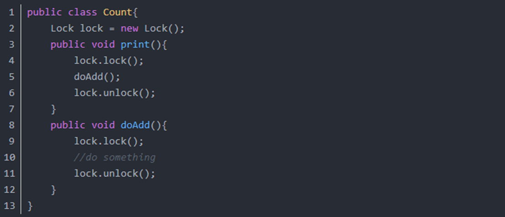

当前线程执行print()方法首先获取lock，接下来执行doAdd()方法就无法执行doAdd()中的逻辑，必须先释放锁。这个例子很好的说明了不可重入锁。

 

**可重入锁**

接下来，我们设计一种可重入锁


所谓可重入，意味着线程可以进入它已经拥有的锁的同步代码块儿。

 

第一个线程执行print()方法，得到了锁，使lockedBy等于当前线程，也就是说，执行的这个方法的线程获得了这个锁，执行add()方法时，同样要先获得锁，因不满足while循环的条件，也就是不等待，继续进行，将此时的lockedCount变量，也就是当前获得锁的数量加一，当释放了所有的锁，才执行notify()。如果在执行这个方法时，有第二个线程想要执行这个方法，因为lockedBy不等于第二个线程，导致这个线程进入了循环，也就是等待，不断执行wait()方法。只有当第一个线程释放了所有的锁，执行了notify()方法，第二个线程才得以跳出循环，继续执行。

 

可重入锁的概念和设计思想大体如此!

java中常用的可重入锁

synchronized

 

java.util.concurrent.locks.ReentrantLock

 

顺便记录下java中实现原子操作的类

Java.util.concurrent.atomic常用方法描述？

AtomicIntegerFieldUpdater:原子更新整型的字段的更新器

AtomicLongFieldUpdater：原子更新长整型字段的更新器

AtomicStampedReference:原子更新带有版本号的引用类型。该类将整型数值与引用关联起来，可用于原子的更新数据和数据的版本号，可以解决使用CAS进行原子更新时可能出现的ABA问题。

AtomicReference ：原子更新引用类型

AtomicReferenceFieldUpdater ：原子更新引用类型里的字段

AtomicMarkableReference：原子更新带有标记位的引用类型。可以原子更新一个布尔类型的标记位和应用类型

AtomicIntegerArray ：原子更新整型数组里的元素

AtomicLongArray :原子更新长整型数组里的元素

AtomicReferenceArray : 原子更新引用类型数组的元素

AtomicBooleanArray ：原子更新布尔类型数组的元素

AtomicBoolean ：原子更新布尔类型

AtomicInteger： 原子更新整型

AtomicLong: 原子更新长整型

 

·    **产生死锁的四个条件（互斥、请求与保持、不剥夺、循环等待）**

**死锁产生的四个必要条件**

互斥条件：资源是独占的且排他使用，进程互斥使用资源，即任意时刻一个资源只能给一个进程使用，其他进程若申请一个资源，而该资源被另一进程占有时，则申请者等待直到资源被占有者释放。

不可剥夺条件：进程所获得的资源在未使用完毕之前，不被其他进程强行剥夺，而只能由获得该资源的进程资源释放。

请求和保持条件：进程每次申请它所需要的一部分资源，在申请新的资源的同时，继续占用已分配到的资源。

循环等待条件：在发生死锁时必然存在一个进程等待队列{P1,P2,…,Pn},其中P1等待P2占有的资源，P2等待P3占有的资源，…，Pn等待P1占有的资源，形成一个进程等待环路，环路中每一个进程所占有的资源同时被另一个申请，也就是前一个进程占有后一个进程所深情地资源。

以上给出了导致死锁的四个必要条件，只要系统发生死锁则以上四个条件至少有一个成立。事实上循环等待的成立蕴含了前三个条件的成立，似乎没有必要列出然而考虑这些条件对死锁的预防是有利的，因为可以通过破坏四个条件中的任何一个来预防死锁的发生。

**死锁预防**

我们可以通过破坏死锁产生的4个必要条件来 预防死锁，由于资源互斥是资源使用的固有特性是无法改变的。

 

破坏“不可剥夺”条件：一个进程不能获得所需要的全部资源时便处于等待状态，等待期间他占有的资源将被隐式的释放重新加入到 系统的资源列表中，可以被其他的进程使用，而等待的进程只有重新获得自己原有的资源以及新申请的资源才可以重新启动，执行。

破坏”请求与保持条件“：第一种方法静态分配即每个进程在开始执行时就申请他所需要的全部资源。第二种是动态分配即每个进程在申请所需要的资源时他本身不占用系统资源。

破坏“循环等待”条件：采用资源有序分配其基本思想是将系统中的所有资源顺序编号，将紧缺的，稀少的采用较大的编号，在申请资源时必须按照编号的顺序进行，一个进程只有获得较小编号的进程才能申请较大编号的进程。

**死锁避免**

死锁避免的基本思想：系统对进程发出的每一个系统能够满足的资源申请进行动态检查，并根据检查结果决定是否分配资源，如果分配后系统可能发生死锁，则不予分配，否则予以分配，这是一种保证系统不进入死锁状态的动态策略。

如果操作系统能保证所有进程在有限时间内得到需要的全部资源，则系统处于安全状态否则系统是不安全的。

 

安全状态是指：如果系统存在 由所有的安全序列{P1，P2，…Pn},则系统处于安全状态。一个进程序列是安全的，如果对其中每一个进程Pi(i >=1 && i <= n)他以后尚需要的资源不超过系统当前剩余资源量与所有进程Pj(j < i)当前占有资源量之和，系统处于安全状态则不会发生死锁。

不安全状态：如果不存在任何一个安全序列，则系统处于不安全状态。他们之间的对对应关系如下图所示：


下面我们来通过一个例子对安全状态和不安全状态进行更深的了解


如上图所示系统处于安全状态，系统剩余3个资源，可以把其中的2个分配给P3，此时P3已经获得了所有的资源，执行完毕后还能还给系统4个资源，此时系统剩余5个资源所以满足（P2所需的资源不超过系统当前剩余量与P3当前占有资源量之和），同理P1也可以在P2执行完毕后获得自己需要的资源。

如果P1提出再申请一个资源的要求，系统从剩余的资源中分配一个给进程P1，此时系统剩余2个资源，新的状态图如下：那么是否仍是安全序列呢那我们来分析一下

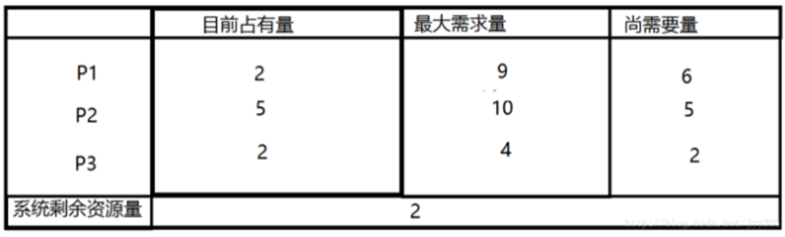

系统当前剩余2个资源，分配给P3后P3执行完毕还给系统4个资源，但是P2需要5个资源，P1需要6个资源，他们都无法获得资源执行完成，因此找不到一个安全序列。此时系统转到了不安全状态。

·    **如何检查死锁（通过****jConsole****检查死锁）**

Java中当我们的开发涉及到多线程的时候，这个时候就很容易遇到死锁问题，刚开始遇到死锁问题的时候，我们很容易觉得莫名其妙，而且定位问题也很困难。

 

因为涉及到java多线程的时候，有的问题会特别复杂，而且就算我们知道问题出现是因为死锁了，我们也很难弄清楚为什么发生死锁，那么当我们遇到了死锁问题，我们应该如何来检测和查看死锁呢？

 

Java中jdk 给我们提供了很便利的工具，帮助我们定位和分析死锁问题：

 

1、死锁产生原因：当两个或者多个线程互相持有一定资源，并互相等待其他线程释放资源而形成的一种僵局，就是死锁。

 

2、构建一个死锁的场景：


可以看到运行时，一个线程持有A资源，希望使用B资源，而另一个线程持有B资源，希望使用A 资源，然后就陷入了相互等待的僵局，这样就形成了死锁。

3、Jconsole查看死锁

 

进入java安装的位置，输入Jconsole，然后弹出界面（或者进入安装目录/java/jdk1.70_80/bin/，点击Jconsole.exe）：

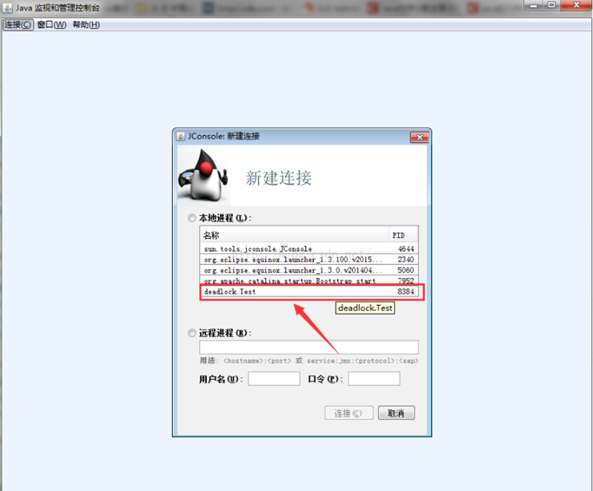

然后点击进入：

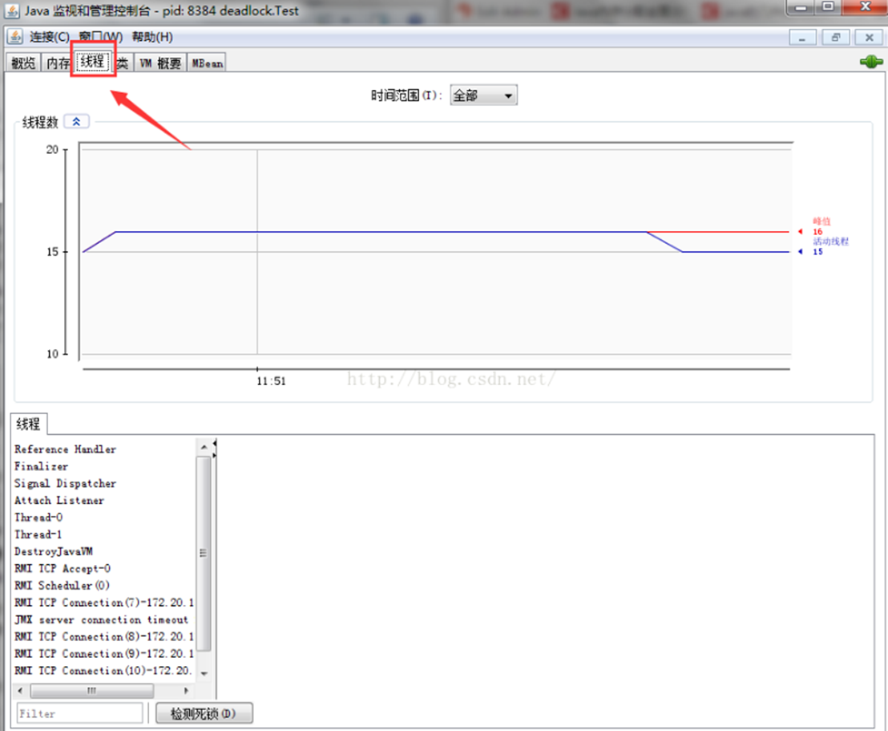

然后点击检测死锁：


然后可以看到造成死锁的两个线程，以及死锁原因：

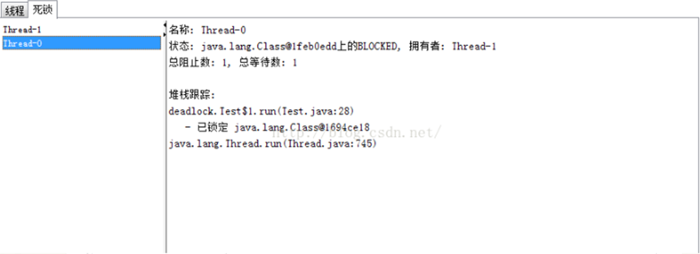

Thread-0：持有java.lang.Class@1694ce18，需要java.lang.Class@1feb0edd，但是java.lang.Class@1feb0edd却被Thread-1持有，然后陷入等待。


Thread-1：持有java.lang.Class@1feb0edd，需要java.lang.Class@1694ce18，但是java.lang.Class@1694ce18却被Thread-0持有，然后陷入等待。

 

4、Jstack查看死锁：

 

同样，也是进入jdk安装目录的bin下面，输入jps，先查看我们要检测死锁的进程：


然后可以看到进程Test的进程号：8384，然后执行：Jstack -l 8384

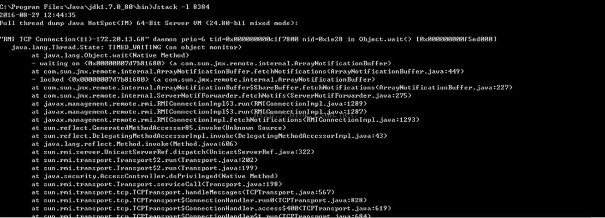

查看死锁信息：


·    **volatile** **实现原理（禁止指令重排、刷新内存）**

Java语言提供了volatile，在某些情况下比锁要更加方便。如果一个字段被声明成volatile，Java线程内存模型确保所有线程看到这个变量的值是一致的。如果一个变量使用volatile，则它比使用synchronized的成本更加低，因为它不会引起线程上下文的切换和调度。Java语言规范对volatile的定义如下：

*Java**编程语言允许线程访问共享变量，为了确保共享变量能被准确和一致地更新，线程应该确保通过排他锁单独获得这个变量。*

上面比较绕口，通俗点讲就是说一个变量如果用volatile修饰了，则Java可以确保所有线程看到这个变量的值是一致的，如果某个线程对volatile修饰的共享变量进行更新，那么其他线程可以立马看到这个更新，这就是所谓的线程可见性。

在了解volatile实现原理之前，我们先来看下与其实现原理相关的CPU术语与说明。表2-1是CPU术语的定义。

表2-1　CPU的术语定义

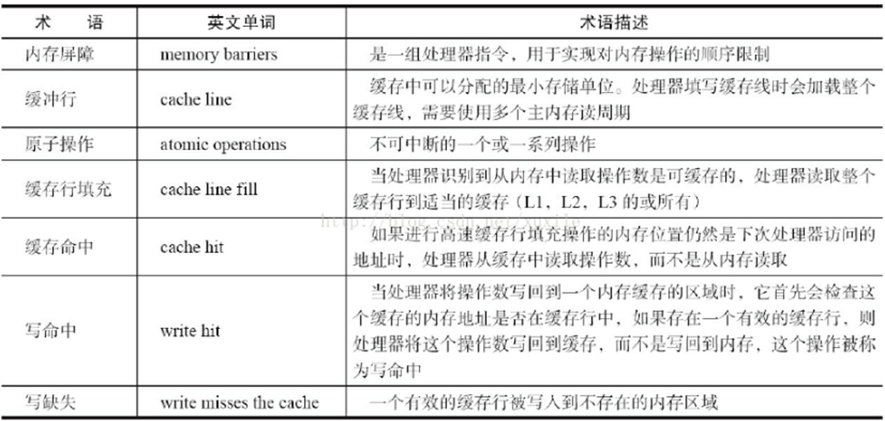

内存模型相关概念

理解volatile其实还是有点儿难度的，它与Java的内存模型有关，所以在理解volatile之前我们需要先了解有关Java内存模型的概念，这里只做初步的介绍，后续LZ会详细介绍Java内存模型。

操作系统语义

计算机在运行程序时，每条指令都是在CPU中执行的，在执行过程中势必会涉及到数据的读写。我们知道程序运行的数据是存储在主存中，这时就会有一个问题，读写主存中的数据没有CPU中执行指令的速度快，如果任何的交互都需要与主存打交道则会大大影响效率，所以就有了CPU高速缓存。CPU高速缓存为某个CPU独有，只与在该CPU运行的线程有关。

有了CPU高速缓存虽然解决了效率问题，但是它会带来一个新的问题：数据一致性。在程序运行中，会将运行所需要的数据复制一份到CPU高速缓存中，在进行运算时CPU不再也主存打交道，而是直接从高速缓存中读写数据，只有当运行结束后才会将数据刷新到主存中。举一个简单的例子：

| 1    | i++i++ |
| ---- | ------ |
|      |        |

当线程运行这段代码时，首先会从主存中读取i( i = 1)，然后复制一份到CPU高速缓存中，然后CPU执行 + 1 （2）的操作，然后将数据（2）写入到告诉缓存中，最后刷新到主存中。其实这样做在单线程中是没有问题的，有问题的是在多线程中。如下：

假如有两个线程A、B都执行这个操作（i++），按照我们正常的逻辑思维主存中的i值应该=3，但事实是这样么？分析如下：

两个线程从主存中读取i的值（1）到各自的高速缓存中，然后线程A执行+1操作并将结果写入高速缓存中，最后写入主存中，此时主存i==2,线程B做同样的操作，主存中的i仍然=2。所以最终结果为2并不是3。这种现象就是缓存一致性问题。

解决缓存一致性方案有两种：

1.通过在总线加LOCK#锁的方式

2.通过缓存一致性协议

但是方案1存在一个问题，它是采用一种独占的方式来实现的，即总线加LOCK#锁的话，只能有一个CPU能够运行，其他CPU都得阻塞，效率较为低下。

第二种方案，缓存一致性协议（MESI协议）它确保每个缓存中使用的共享变量的副本是一致的。其核心思想如下：当某个CPU在写数据时，如果发现操作的变量是共享变量，则会通知其他CPU告知该变量的缓存行是无效的，因此其他CPU在读取该变量时，发现其无效会重新从主存中加载数据。

[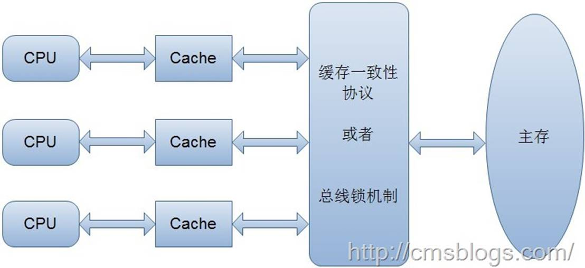](http://cmsblogs.qiniudn.com/wp-content/uploads/2017/02/212219343783699-1.jpg /o /212219343783699/ /t _blank)

Java内存模型

上面从操作系统层次阐述了如何保证数据一致性，下面我们来看一下Java内存模型，稍微研究一下Java内存模型为我们提供了哪些保证以及在Java中提供了哪些方法和机制来让我们在进行多线程编程时能够保证程序执行的正确性。

在并发编程中我们一般都会遇到这三个基本概念：原子性、可见性、有序性。我们稍微看下volatile

原子性

原子性：即一个操作或者多个操作 要么全部执行并且执行的过程不会被任何因素打断，要么就都不执行。

原子性就像数据库里面的事务一样，他们是一个团队，同生共死。其实理解原子性非常简单，我们看下面一个简单的例子即可：

| 1  2  3  4 | i  = 0;      ---1  j  = i ;      ---2  i++;        ---3  i  = j + 1;  ---4 |
| ---------- | ------------------------------------------------------------ |
|            |                                                              |

上面四个操作，有哪个几个是原子操作，那几个不是？如果不是很理解，可能会认为都是原子性操作，其实只有1才是原子操作，其余均不是。

1—在Java中，对基本数据类型的变量和赋值操作都是原子性操作；

2—包含了两个操作：读取i，将i值赋值给j

3—包含了三个操作：读取i值、i + 1 、将+1结果赋值给i；

4—同三一样

在单线程环境下我们可以认为整个步骤都是原子性操作，但是在多线程环境下则不同，Java只保证了基本数据类型的变量和赋值操作才是原子性的（注：在32位的JDK环境下，对64位数据的读取不是原子性操作*，如long、double）。要想在多线程环境下保证原子性，则可以通过锁、synchronized来确保。

volatile是无法保证复合操作的原子性

可见性

可见性是指当多个线程访问同一个变量时，一个线程修改了这个变量的值，其他线程能够立即看得到修改的值。

在上面已经分析了，在多线程环境下，一个线程对共享变量的操作对其他线程是不可见的。

Java提供了volatile来保证可见性。

当一个变量被volatile修饰后，表示着线程本地内存无效，当一个线程修改共享变量后他会立即被更新到主内存中，当其他线程读取共享变量时，它会直接从主内存中读取。

当然，synchronize和锁都可以保证可见性。

有序性

有序性：即程序执行的顺序按照代码的先后顺序执行。

在Java内存模型中，为了效率是允许编译器和处理器对指令进行重排序，当然重排序它不会影响单线程的运行结果，但是对多线程会有影响。

Java提供volatile来保证一定的有序性。最著名的例子就是单例模式里面的DCL（双重检查锁）。这里LZ就不再阐述了。

剖析volatile原理

JMM比较庞大，不是上面一点点就能够阐述的。上面简单地介绍都是为了volatile做铺垫的。

volatile可以保证线程可见性且提供了一定的有序性，但是无法保证原子性。在JVM底层volatile是采用“内存屏障”来实现的。

上面那段话，有两层语义

1.保证可见性、不保证原子性

2.禁止指令重排序

第一层语义就不做介绍了，下面重点介绍指令重排序。

在执行程序时为了提高性能，编译器和处理器通常会对指令做重排序：

1.编译器重排序。编译器在不改变单线程程序语义的前提下，可以重新安排语句的执行顺序；

2.处理器重排序。如果不存在数据依赖性，处理器可以改变语句对应机器指令的执行顺序；

指令重排序对单线程没有什么影响，他不会影响程序的运行结果，但是会影响多线程的正确性。既然指令重排序会影响到多线程执行的正确性，那么我们就需要禁止重排序。那么JVM是如何禁止重排序的呢？这个问题稍后回答，我们先看另一个原则happens-before，happen-before原则保证了程序的“有序性”，它规定如果两个操作的执行顺序无法从happens-before原则中推到出来，那么他们就不能保证有序性，可以随意进行重排序。其定义如下：

1.同一个线程中的，前面的操作 happen-before 后续的操作。（即单线程内按代码顺序执行。但是，在不影响在单线程环境执行结果的前提下，编译器和处理器可以进行重排序，这是合法的。换句话说，这一是规则无法保证编译重排和指令重排）。

2.监视器上的解锁操作 happen-before 其后续的加锁操作。（Synchronized 规则）

3.对volatile变量的写操作 happen-before 后续的读操作。（volatile 规则）

4.线程的start() 方法 happen-before 该线程所有的后续操作。（线程启动规则）

5.线程所有的操作 happen-before 其他线程在该线程上调用 join 返回成功后的操作。

6.如果 a happen-before b，b happen-before c，则a happen-before c（传递性）。

我们着重看第三点volatile规则：对volatile变量的写操作 happen-before 后续的读操作。为了实现volatile内存语义，JMM会重排序，其规则如下：

对happen-before原则有了稍微的了解，我们再来回答这个问题JVM是如何禁止重排序的？

[](http://cmsblogs.qiniudn.com/wp-content/uploads/2017/02/20170104-volatile-1.jpg /o /20170104-volatile/ /t _blank)

观察加入volatile关键字和没有加入volatile关键字时所生成的汇编代码发现，加入volatile关键字时，会多出一个lock前缀指令。lock前缀指令其实就相当于一个内存屏障。内存屏障是一组处理指令，用来实现对内存操作的顺序限制。volatile的底层就是通过内存屏障来实现的。下图是完成上述规则所需要的内存屏障：

volatile暂且下分析到这里，JMM体系较为庞大，不是三言两语能够说清楚的，后面会结合JMM再一次对volatile深入分析。

[](http://cmsblogs.qiniudn.com/wp-content/uploads/2017/02/20170104-volatile2-1.jpg /o /20170104-volatile2/ /t _blank)

总结

volatile看起来简单，但是要想理解它还是比较难的，这里只是对其进行基本的了解。volatile相对于synchronized稍微轻量些，在某些场合它可以替代synchronized，但是又不能完全取代synchronized，只有在某些场合才能够使用volatile。使用它必须满足如下两个条件：

1.对变量的写操作不依赖当前值；

2.该变量没有包含在具有其他变量的不变式中。

volatile经常用于两个两个场景：状态标记两、double check

//----------补充解释：

volatile是如何来保证可见性的呢？让我们在X86处理器下通过工具获取JIT编译器生成的汇编指令来查看对volatile进行写操作时，CPU会做什么事情。

Java代码如下。

instance = new Singleton(); // instance是volatile变量

转变成汇编代码，如下。

0x01a3de1d: movb $0×0,0×1104800(%esi);

0x01a3de24: lock addl $0×0,(%esp);

有volatile变量修饰的共享变量进行写操作的时候会多出第二行汇编代码，通过查IA-32架构软件开发者手册可知，Lock前缀的指令在多核处理器下会引发了两件事情。

1）将当前处理器缓存行的数据写回到系统内存。

2）这个写回内存的操作会使在其他CPU里缓存了该内存地址的数据无效。

为了提高处理速度，处理器不直接和内存进行通信，而是先将系统内存的数据读到内部缓存（L1，L2或其他）后再进行操作，但操作完不知道何时会写到内存。如果对声明了volatile的变量进行写操作，JVM就会向处理器发送一条Lock前缀的指令，将这个变量所在缓存行的数据写回到系统内存。但是，就算写回到内存，如果其他处理器缓存的值还是旧的，再执行计算操作就会有问题。所以，在多处理器下，为了保证各个处理器的缓存是一致的，就会实现缓存一致性协议，每个处理器通过嗅探在总线上传播的数据来检查自己缓存的值是不是过期了，当处理器发现自己缓存行对应的内存地址被修改，就会将当前处理器的缓存行设置成无效状态，当处理器对这个数据进行修改操作的时候，会重新从系统内存中把数据读到处理器缓存里。

下面来具体讲解volatile的两条实现原则。

1）Lock前缀指令会引起处理器缓存回写到内存。Lock前缀指令导致在执行指令期间，声言处理器的LOCK#信号。在多处理器环境中，LOCK#信号确保在声言该信号期间，处理器可以独占任何共享内存[2]。但是，在最近的处理器里，LOCK＃信号一般不锁总线，而是锁缓存，毕竟锁总线开销的比较大。在8.1.4节有详细说明锁定操作对处理器缓存的影响，对于Intel486和Pentium处理器，在锁操作时，总是在总线上声言LOCK#信号。但在P6和目前的处理器中，如果访问的内存区域已经缓存在处理器内部，则不会声言LOCK#信号。相反，它会锁定这块内存区域的缓存并回写到内存，并使用缓存一致性机制来确保修改的原子性，此操作被称为“缓存锁定”，缓存一致性机制会阻止同时修改由两个以上处理器缓存的内存区域数据。

2）一个处理器的缓存回写到内存会导致其他处理器的缓存无效。IA-32处理器和Intel 64处理器使用MESI（修改、独占、共享、无效）控制协议去维护内部缓存和其他处理器缓存的一致性。在多核处理器系统中进行操作的时候，IA-32和Intel 64处理器能嗅探其他处理器访问系统内存和它们的内部缓存。处理器使用嗅探技术保证它的内部缓存、系统内存和其他处理器的缓存的数据在总线上保持一致。例如，在Pentium和P6 family处理器中，如果通过嗅探一个处理器来检测其他处理器打算写内存地址，而这个地址当前处于共享状态，那么正在嗅探的处理器将使它的缓存行无效，在下次访问相同内存地址时，强制执行缓存行填充。

·    **synchronized** **实现原理（对象监视器）**

synchronized可以保证方法或者代码块在运行时，同一时刻只有一个方法可以进入到临界区，同时它还可以保证共享变量的内存可见性

Java中每一个对象都可以作为锁，这是synchronized实现同步的基础：

1.普通同步方法，锁是当前实例对象

2.静态同步方法，锁是当前类的class对象

3.同步方法块，锁是括号里面的对象

当一个线程访问同步代码块时，它首先是需要得到锁才能执行同步代码，当退出或者抛出异常时必须要释放锁，那么它是如何来实现这个机制的呢？我们先看一段简单的代码：

| 1  2  3  4  5  6  7  8  9  10  11 | public  class SynchronizedTest {    public  synchronized void test1(){       }       public  void test2(){      synchronized  (this){         }    }  } |
| --------------------------------- | ------------------------------------------------------------ |
|                                   |                                                              |

利用javap工具查看生成的class文件信息来分析Synchronize的实现

从上面可以看出，同步代码块是使用monitorenter和monitorexit指令实现的，同步方法（在这看不出来需要看JVM底层实现）依靠的是方法修饰符上的ACC_SYNCHRONIZED实现。

同步代码块：monitorenter指令插入到同步代码块的开始位置，monitorexit指令插入到同步代码块的结束位置，JVM需要保证每一个monitorenter都有一个monitorexit与之相对应。任何对象都有一个monitor与之相关联，当且一个monitor被持有之后，他将处于锁定状态。线程执行到monitorenter指令时，将会尝试获取对象所对应的monitor所有权，即尝试获取对象的锁；

同步方法：synchronized方法则会被翻译成普通的方法调用和返回指令如:invokevirtual、areturn指令，在VM字节码层面并没有任何特别的指令来实现被synchronized修饰的方法，而是在Class文件的方法表中将该方法的access_flags字段中的synchronized标志位置1，表示该方法是同步方法并使用调用该方法的对象或该方法所属的Class在JVM的内部对象表示Klass做为锁对象。(摘自：[http://www.cnblogs.com/javaminer/p/3889023.html](http://www.cnblogs.com/javaminer/p/3889023.html /t _blank))

下面我们来继续分析，但是在深入之前我们需要了解两个重要的概念：Java对象头，Monitor。

**Java****对象头、monitor**

Java对象头和monitor是实现synchronized的基础！下面就这两个概念来做详细介绍。

**Java****对象头**

synchronized用的锁是存在Java对象头里的，那么什么是Java对象头呢？Hotspot虚拟机的对象头主要包括两部分数据：Mark Word（标记字段）、Klass Pointer（类型指针）。其中Klass Point是是对象指向它的类元数据的指针，虚拟机通过这个指针来确定这个对象是哪个类的实例，Mark Word用于存储对象自身的运行时数据，它是实现轻量级锁和偏向锁的关键，所以下面将重点阐述

Mark Word。

Mark Word用于存储对象自身的运行时数据，如哈希码（HashCode）、GC分代年龄、锁状态标志、线程持有的锁、偏向线程 ID、偏向时间戳等等。Java对象头一般占有两个机器码（在32位虚拟机中，1个机器码等于4字节，也就是32bit），但是如果对象是数组类型，则需要三个机器码，因为JVM虚拟机可以通过Java对象的元数据信息确定Java对象的大小，但是无法从数组的元数据来确认数组的大小，所以用一块来记录数组长度。下图是Java对象头的存储结构（32位虚拟机）：

对象头信息是与对象自身定义的数据无关的额外存储成本，但是考虑到虚拟机的空间效率，Mark Word被设计成一个非固定的数据结构以便在极小的空间内存存储尽量多的数据，它会根据对象的状态复用自己的存储空间，也就是说，Mark Word会随着程序的运行发生变化，变化状态如下（32位虚拟机）：

简单介绍了Java对象头，我们下面再看Monitor。

**Monitor**

什么是Monitor？我们可以把它理解为一个同步工具，也可以描述为一种同步机制，它通常被描述为一个对象。

与一切皆对象一样，所有的Java对象是天生的Monitor，每一个Java对象都有成为Monitor的潜质，因为在Java的设计中 ，每一个Java对象自打娘胎里出来就带了一把看不见的锁，它叫做内部锁或者Monitor锁。

Monitor 是线程私有的数据结构，每一个线程都有一个可用monitor record列表，同时还有一个全局的可用列表。每一个被锁住的对象都会和一个monitor关联（对象头的MarkWord中的LockWord指向monitor的起始地址），同时monitor中有一个Owner字段存放拥有该锁的线程的唯一标识，表示该锁被这个线程占用。其结构如下：

Owner：初始时为NULL表示当前没有任何线程拥有该monitor record，当线程成功拥有该锁后保存线程唯一标识，当锁被释放时又设置为NULL；

EntryQ:关联一个系统互斥锁（semaphore），阻塞所有试图锁住monitor record失败的线程。

RcThis:表示blocked或waiting在该monitor record上的所有线程的个数。

Nest:用来实现重入锁的计数。

HashCode:保存从对象头拷贝过来的HashCode值（可能还包含GC age）。

Candidate:用来避免不必要的阻塞或等待线程唤醒，因为每一次只有一个线程能够成功拥有锁，如果每次前一个释放锁的线程唤醒所有正在阻塞或等待的线程，会引起不必要的上下文切换（从阻塞到就绪然后因为竞争锁失败又被阻塞）从而导致性能严重下降。Candidate只有两种可能的值0表示没有需要唤醒的线程1表示要唤醒一个继任线程来竞争锁。

摘自：[Java](http://blog.csdn.net/u012465296/article/details/53022317 /t _blank)[中](http://blog.csdn.net/u012465296/article/details/53022317 /t _blank)[synchronized](http://blog.csdn.net/u012465296/article/details/53022317 /t _blank)[的实现原理与应用）](http://blog.csdn.net/u012465296/article/details/53022317 /t _blank)

我们知道synchronized是重量级锁，效率不怎么滴，同时这个观念也一直存在我们脑海里，不过在jdk 1.6中对synchronize的实现进行了各种优化，使得它显得不是那么重了，那么JVM采用了那些优化手段呢？

**锁优化**

jdk1.6对锁的实现引入了大量的优化，如自旋锁、适应性自旋锁、锁消除、锁粗化、偏向锁、轻量级锁等技术来减少锁操作的开销。

锁主要存在四中状态，依次是：无锁状态、偏向锁状态、轻量级锁状态、重量级锁状态，他们会随着竞争的激烈而逐渐升级。注意锁可以升级不可降级，这种策略是为了提高获得锁和释放锁的效率。

**自旋锁**

线程的阻塞和唤醒需要CPU从用户态转为核心态，频繁的阻塞和唤醒对CPU来说是一件负担很重的工作，势必会给系统的并发性能带来很大的压力。同时我们发现在许多应用上面，对象锁的锁状态只会持续很短一段时间，为了这一段很短的时间频繁地阻塞和唤醒线程是非常不值得的。所以引入自旋锁。

何谓自旋锁？

所谓自旋锁，就是让该线程等待一段时间，不会被立即挂起，看持有锁的线程是否会很快释放锁。怎么等待呢？执行一段无意义的循环即可（自旋）。

自旋等待不能替代阻塞，先不说对处理器数量的要求（多核，貌似现在没有单核的处理器了），虽然它可以避免线程切换带来的开销，但是它占用了处理器的时间。如果持有锁的线程很快就释放了锁，那么自旋的效率就非常好，反之，自旋的线程就会白白消耗掉处理的资源，它不会做任何有意义的工作，典型的占着茅坑不拉屎，这样反而会带来性能上的浪费。所以说，自旋等待的时间（自旋的次数）必须要有一个限度，如果自旋超过了定义的时间仍然没有获取到锁，则应该被挂起。

自旋锁在JDK 1.4.2中引入，默认关闭，但是可以使用-XX:+UseSpinning开开启，在JDK1.6中默认开启。同时自旋的默认次数为10次，可以通过参数-XX:PreBlockSpin来调整；

如果通过参数-XX:preBlockSpin来调整自旋锁的自旋次数，会带来诸多不便。假如我将参数调整为10，但是系统很多线程都是等你刚刚退出的时候就释放了锁（假如你多自旋一两次就可以获取锁），你是不是很尴尬。于是JDK1.6引入自适应的自旋锁，让虚拟机会变得越来越聪明。

**适应自旋锁**

JDK 1.6引入了更加聪明的自旋锁，即自适应自旋锁。所谓自适应就意味着自旋的次数不再是固定的，它是由前一次在同一个锁上的自旋时间及锁的拥有者的状态来决定。它怎么做呢？线程如果自旋成功了，那么下次自旋的次数会更加多，因为虚拟机认为既然上次成功了，那么此次自旋也很有可能会再次成功，那么它就会允许自旋等待持续的次数更多。反之，如果对于某个锁，很少有自旋能够成功的，那么在以后要或者这个锁的时候自旋的次数会减少甚至省略掉自旋过程，以免浪费处理器资源。

有了自适应自旋锁，随着程序运行和性能监控信息的不断完善，虚拟机对程序锁的状况预测会越来越准确，虚拟机会变得越来越聪明。

**锁消除**

为了保证数据的完整性，我们在进行操作时需要对这部分操作进行同步控制，但是在有些情况下，JVM检测到不可能存在共享数据竞争，这是JVM会对这些同步锁进行锁消除。锁消除的依据是逃逸分析的数据支持。

如果不存在竞争，为什么还需要加锁呢？所以锁消除可以节省毫无意义的请求锁的时间。变量是否逃逸，对于虚拟机来说需要使用数据流分析来确定，但是对于我们程序员来说这还不清楚么？我们会在明明知道不存在数据竞争的代码块前加上同步吗？但是有时候程序并不是我们所想的那样？我们虽然没有显示使用锁，但是我们在使用一些JDK的内置API时，如StringBuffer、Vector、HashTable等，这个时候会存在隐形的加锁操作。比如StringBuffer的append()方法，Vector的add()方法：

| 1  2  3  4  5  6  7  8 | public  void vectorTest(){     Vector<String>  vector = new Vector<String>();     for(int  i = 0 ; i < 10 ; i++){       vector.add(i  + "");     }        System.out.println(vector);   } |
| ---------------------- | ------------------------------------------------------------ |
|                        |                                                              |

在运行这段代码时，JVM可以明显检测到变量vector没有逃逸出方法vectorTest()之外，所以JVM可以大胆地将vector内部的加锁操作消除。

**锁粗化**

我们知道在使用同步锁的时候，需要让同步块的作用范围尽可能小—仅在共享数据的实际作用域中才进行同步，这样做的目的是为了使需要同步的操作数量尽可能缩小，如果存在锁竞争，那么等待锁的线程也能尽快拿到锁。

在大多数的情况下，上述观点是正确的，LZ也一直坚持着这个观点。但是如果一系列的连续加锁解锁操作，可能会导致不必要的性能损耗，所以引入锁粗话的概念。

锁粗话概念比较好理解，就是将多个连续的加锁、解锁操作连接在一起，扩展成一个范围更大的锁。如上面实例：vector每次add的时候都需要加锁操作，JVM检测到对同一个对象（vector）连续加锁、解锁操作，会合并一个更大范围的加锁、解锁操作，即加锁解锁操作会移到for循环之外。

**轻量级锁**

引入轻量级锁的主要目的是在多没有多线程竞争的前提下，减少传统的重量级锁使用操作系统互斥量产生的性能消耗。当关闭偏向锁功能或者多个线程竞争偏向锁导致偏向锁升级为轻量级锁，则会尝试获取轻量级锁，其步骤如下：

获取锁

1.判断当前对象是否处于无锁状态（hashcode、0、01），若是，则JVM首先将在当前线程的栈帧中建立一个名为锁记录（Lock Record）的空间，用于存储锁对象目前的Mark Word的拷贝（官方把这份拷贝加了一个Displaced前缀，即Displaced Mark Word）；否则执行步骤（3）；

2.JVM利用CAS操作尝试将对象的Mark Word更新为指向Lock Record的指正，如果成功表示竞争到锁，则将锁标志位变成00（表示此对象处于轻量级锁状态），执行同步操作；如果失败则执行步骤（3）；

3.判断当前对象的Mark Word是否指向当前线程的栈帧，如果是则表示当前线程已经持有当前对象的锁，则直接执行同步代码块；否则只能说明该锁对象已经被其他线程抢占了，这时轻量级锁需要膨胀为重量级锁，锁标志位变成10，后面等待的线程将会进入阻塞状态；

释放锁

轻量级锁的释放也是通过CAS操作来进行的，主要步骤如下：

1.取出在获取轻量级锁保存在Displaced Mark Word中的数据；

2.用CAS操作将取出的数据替换当前对象的Mark Word中，如果成功，则说明释放锁成功，否则执行（3）；

3.如果CAS操作替换失败，说明有其他线程尝试获取该锁，则需要在释放锁的同时需要唤醒被挂起的线程。

对于轻量级锁，其性能提升的依据是“对于绝大部分的锁，在整个生命周期内都是不会存在竞争的”，如果打破这个依据则除了互斥的开销外，还有额外的CAS操作，因此在有多线程竞争的情况下，轻量级锁比重量级锁更慢；

 

下图是轻量级锁的获取和释放过程

**偏向锁**

引入偏向锁主要目的是：为了在无多线程竞争的情况下尽量减少不必要的轻量级锁执行路径。上面提到了轻量级锁的加锁解锁操作是需要依赖多次CAS原子指令的。那么偏向锁是如何来减少不必要的CAS操作呢？我们可以查看Mark work的结构就明白了。只需要检查是否为偏向锁、锁标识为以及ThreadID即可，处理流程如下：

获取锁

1.检测Mark Word是否为可偏向状态，即是否为偏向锁1，锁标识位为01；

2.若为可偏向状态，则测试线程ID是否为当前线程ID，如果是，则执行步骤（5），否则执行步骤（3）；

3.如果线程ID不为当前线程ID，则通过CAS操作竞争锁，竞争成功，则将Mark Word的线程ID替换为当前线程ID，否则执行线程（4）；

4.通过CAS竞争锁失败，证明当前存在多线程竞争情况，当到达全局安全点，获得偏向锁的线程被挂起，偏向锁升级为轻量级锁，然后被阻塞在安全点的线程继续往下执行同步代码块；

5.执行同步代码块

**释放锁**

偏向锁的释放采用了一种只有竞争才会释放锁的机制，线程是不会主动去释放偏向锁，需要等待其他线程来竞争。偏向锁的撤销需要等待全局安全点（这个时间点是上没有正在执行的代码）。其步骤如下：

1.暂停拥有偏向锁的线程，判断锁对象石是否还处于被锁定状态；

2.撤销偏向锁，恢复到无锁状态（01）或者轻量级锁的状态；

 

下图是偏向锁的获取和释放流程

**重量级锁**

重量级锁通过对象内部的监视器（monitor）实现，其中monitor的本质是依赖于底层操作系统的Mutex Lock实现，操作系统实现线程之间的切换需要从用户态到内核态的切换，切换成本非常高。

·    **synchronized** **与** **lock** **的区别**

技术点：

1、线程与进程：

在开始之前先把进程与线程进行区分一下，一个程序最少需要一个进程，而一个进程最少需要一个线程。关系是线程–>进程–>程序的大致组成结构。所以线程是程序执行流的最小单位，而进程是系统进行资源分配和调度的一个独立单位。以下我们所有讨论的都是建立在线程基础之上。

2、Thread的几个重要方法：

我们先了解一下Thread的几个重要方法。a、start()方法，调用该方法开始执行该线程；b、stop()方法，调用该方法强制结束该线程执行；c、join方法，调用该方法等待该线程结束。d、sleep()方法，调用该方法该线程进入等待。e、run()方法，调用该方法直接执行线程的run()方法，但是线程调用start()方法时也会运行run()方法，区别就是一个是由线程调度运行run()方法，一个是直接调用了线程中的run()方法！！

看到这里，可能有些人就会问啦，那wait()和notify()呢？要注意，其实wait()与notify()方法是Object的方法，不是Thread的方法！！同时，wait()与notify()会配合使用，分别表示线程挂起和线程恢复。

这里还有一个很常见的问题，顺带提一下：wait()与sleep()的区别，简单来说wait()会释放对象锁而sleep()不会释放对象锁。这些问题有很多的资料，不再赘述。

3、线程状态：


线程总共有5大状态，通过上面第二个知识点的介绍，理解起来就简单了。

- 新建状态：新建线程对象，并没有调用start()方法之前
- 就绪状态：调用start()方法之后线程就进入就绪状态，但是并不是说只要调用start()方法线程就马上变为当前线程，在变为当前线程之前都是为就绪状态。值得一提的是，线程在睡眠和挂起中恢复的时候也会进入就绪状态哦。
- 运行状态：线程被设置为当前线程，开始执行run()方法。就是线程进入运行状态
- 阻塞状态：线程被暂停，比如说调用sleep()方法后线程就进入阻塞状态
- 死亡状态：线程执行结束

4、锁类型

- 可重入锁：在执行对象中所有同步方法不用再次获得锁
- 可中断锁：在等待获取锁过程中可中断
- 公平锁：     按等待获取锁的线程的等待时间进行获取，等待时间长的具有优先获取锁权利
- 读写锁：对资源读取和写入的时候拆分为2部分处理，读的时候可以多线程一起读，写的时候必须同步地写

 

**synchronized****与Lock的区别**

1、我把两者的区别分类到了一个表中，方便大家对比：

 

| 类别     | synchronized                                                 | Lock                                                         |
| -------- | ------------------------------------------------------------ | ------------------------------------------------------------ |
| 存在层次 | Java的关键字，在jvm层面上                                    | 是一个类                                                     |
| 锁的释放 | 1、以获取锁的线程执行完同步代码，释放锁 2、线程执行发生异常，jvm会让线程释放锁 | 在finally中必须释放锁，不然容易造成线程死锁                  |
| 锁的获取 | 假设A线程获得锁，B线程等待。如果A线程阻塞，B线程会一直等待   | 分情况而定，Lock有多个锁获取的方式，具体下面会说道，大致就是可以尝试获得锁，线程可以不用一直等待 |
| 锁状态   | 无法判断                                                     | 可以判断                                                     |
| 锁类型   | 可重入 不可中断 非公平                                       | 可重入 可判断 可公平（两者皆可）                             |
| 性能     | 少量同步                                                     | 大量同步                                                     |

 

或许，看到这里还对LOCK所知甚少，那么接下来，我们进入LOCK的深入学习。

Lock详细介绍与Demo

以下是Lock接口的源码，笔者修剪之后的结果：


从Lock接口中我们可以从方法的功能从注释中看出：

- lock()：获取锁，如果锁被暂用则一直等待
- unlock():释放锁
- tryLock(): 注意返回类型是boolean，如果获取锁的时候锁被占用就返回false，否则返回true
- tryLock(long time, TimeUnit unit)：比起tryLock()就是给了一个时间期限，保证等待参数时间
- lockInterruptibly()：用该锁的获得方式，如果线程在获取锁的阶段进入了等待，那么可以中断此线程，先去做别的事

通过 以上的解释，大致可以解释在上个部分中“锁类型(lockInterruptibly())”，“锁状态(tryLock())”等问题，还有就是前面子所获取的过程我所写的“大致就是可以尝试获得锁，线程可以不会一直等待”用了“可以”的原因。

下面是Lock一般使用的例子，注意ReentrantLock是Lock接口的实现。

lock()：


tryLock():

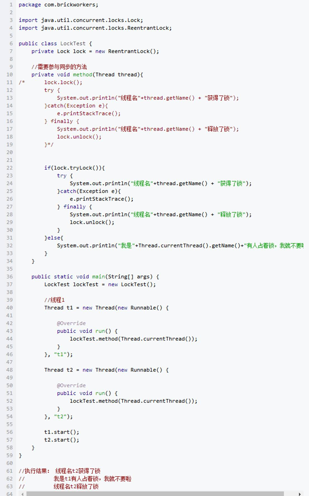

看到这里相信大家也都会使用如何使用Lock了吧，关于tryLock(long time, TimeUnit unit)和lockInterruptibly()不再赘述。前者主要存在一个等待时间，在测试代码中写入一个等待时间，后者主要是等待中断，会抛出一个中断异常，常用度不高，喜欢探究可以自己深入研究。

前面比较重提到“公平锁”，在这里可以提一下ReentrantLock对于平衡锁的定义，在源码中有这么两段：

 

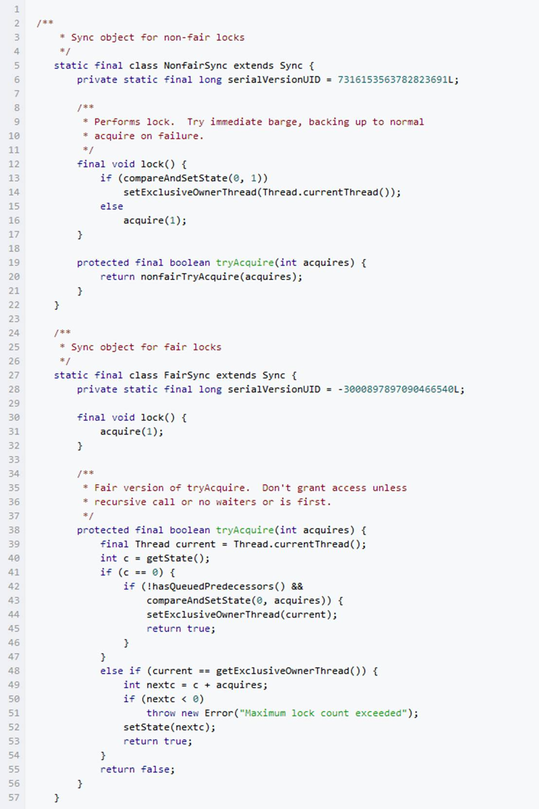

从以上源码可以看出在Lock中可以自己控制锁是否公平，而且，默认的是非公平锁，以下是ReentrantLock的构造函数：

 

 

1、两种锁的底层实现方式： 

synchronized：我们知道java是用字节码指令来控制程序（这里不包括热点代码编译成机器码）。在字节指令中，存在有synchronized所包含的代码块，那么会形成2段流程的执行。 


我们点击查看SyncDemo.java的源码SyncDemo.class，可以看到如下： 

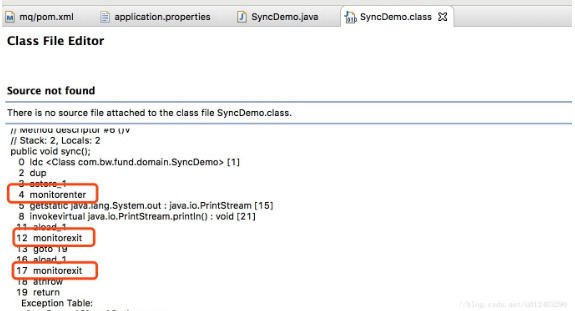

如上就是这段代码段字节码指令，没你想的那么难吧。言归正传，我们可以清晰段看到，其实synchronized映射成字节码指令就是增加来两个指令：monitorenter和monitorexit。当一条线程进行执行的遇到monitorenter指令的时候，它会去尝试获得锁，如果获得锁那么锁计数+1（为什么会加一呢，因为它是一个可重入锁，所以需要用这个锁计数判断锁的情况），如果没有获得锁，那么阻塞。当它遇到monitorexit的时候，锁计数器-1，当计数器为0，那么就释放锁。

那么有的朋友看到这里就疑惑了，那图上有2个monitorexit呀？马上回答这个问题：上面我以前写的文章也有表述过，synchronized锁释放有两种机制，一种就是执行完释放；另外一种就是发送异常，虚拟机释放。图中第二个monitorexit就是发生异常时执行的流程，这就是我开头说的“会有2个流程存在“。而且，从图中我们也可以看到在第13行，有一个goto指令，也就是说如果正常运行结束会跳转到19行执行。

这下，你对synchronized是不是了解的很清晰了呢。接下来我们再聊一聊Lock。

Lock：Lock实现和synchronized不一样，后者是一种悲观锁，它胆子很小，它很怕有人和它抢吃的，所以它每次吃东西前都把自己关起来。而Lock呢底层其实是CAS乐观锁的体现，它无所谓，别人抢了它吃的，它重新去拿吃的就好啦，所以它很乐观。具体底层怎么实现，博主不在细述，有机会的话，我会对concurrent包下面的机制好好和大家说说，如果面试问起，你就说底层主要靠volatile和CAS操作实现的。

现在，才是我真正想在这篇博文后面加的，我要说的是：尽可能去使用synchronized而不要去使用LOCK

什么概念呢？我和大家打个比方：你叫jdk，你生了一个孩子叫synchronized，后来呢，你领养了一个孩子叫LOCK。起初，LOCK刚来到新家的时候，它很乖，很懂事，各个方面都表现的比synchronized好。你很开心，但是你内心深处又有一点淡淡的忧伤，你不希望你自己亲生的孩子竟然还不如一个领养的孩子乖巧。这个时候，你对亲生的孩子教育更加深刻了，你想证明，你的亲生孩子synchronized并不会比领养的孩子LOCK差。（博主只是打个比方）

那如何教育呢？ 

在jdk1.6~jdk1.7的时候，也就是synchronized16、7岁的时候，你作为爸爸，你给他优化了，具体优化在哪里呢：

1、线程自旋和适应性自旋 

我们知道，java’线程其实是映射在内核之上的，线程的挂起和恢复会极大的影响开销。并且jdk官方人员发现，很多线程在等待锁的时候，在很短的一段时间就获得了锁，所以它们在线程等待的时候，并不需要把线程挂起，而是让他无目的的循环，一般设置10次。这样就避免了线程切换的开销，极大的提升了性能。 

而适应性自旋，是赋予了自旋一种学习能力，它并不固定自旋10次一下。他可以根据它前面线程的自旋情况，从而调整它的自旋，甚至是不经过自旋而直接挂起。

2、锁消除 

什么叫锁消除呢？就是把不必要的同步在编译阶段进行移除。 

那么有的小伙伴又迷糊了，我自己写的代码我会不知道这里要不要加锁？我加了锁就是表示这边会有同步呀？ 

并不是这样，这里所说的锁消除并不一定指代是你写的代码的锁消除，我打一个比方： 

在jdk1.5以前，我们的String字符串拼接操作其实底层是StringBuffer来实现的（这个大家可以用我前面介绍的方法，写一个简单的demo，然后查看class文件中的字节码指令就清楚了），而在jdk1.5之后，那么是用StringBuilder来拼接的。我们考虑前面的情况，比如如下代码：

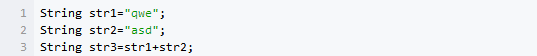

底层实现会变成这样：


我们知道，StringBuffer是一个线程安全的类，也就是说两个append方法都会同步，通过指针逃逸分析（就是变量不会外泄），我们发现在这段代码并不存在线程安全问题，这个时候就会把这个同步锁消除。

3、锁粗化 

在用synchronized的时候，我们都讲究为了避免大开销，尽量同步代码块要小。那么为什么还要加粗呢？ 

我们继续以上面的字符串拼接为例，我们知道在这一段代码中，每一个append都需要同步一次，那么我可以把锁粗化到第一个append和最后一个append（这里不要去纠结前面的锁消除，我只是打个比方）

4、轻量级锁

5、偏向锁

·    **AQS****同步队列**

·    **CAS****无锁的概念、乐观锁和悲观锁**https://blog.csdn.net/mmoren/article/details/79185862

·    **常见的原子操作类**

**概述**

java.util.concurrent.atomic包一共提供了13个类，属于4中类型的原子更新方式：原子更新基本数据类型、原子更新数组、原子更新引用、原子更新属性。

 

原子更新基本类型

\>java.util.concurrent.atomic包提供了以下3个类：

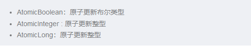

以上三个类提供的方法几乎一样，下面只分析AtomicInteger：

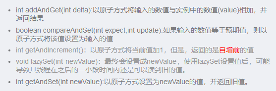

**通过getAndIncrement方法来看看实现原理：**

public final int getAndIncrement() {

​    for (;;) {

​      int current = get();//先取得AtomicInteger存储的数组

​      int next = current + 1;//对当前数组加1

​      if (compareAndSet(current, next))//CAS操作更新，先检查当前数值是否等于current，如果是则将AtomicInteger的当前数组更新成next；如果不是，则返回false，重新循环更新

​        return current;//返回更新前的值

​    }

  }

  

  public final boolean compareAndSet(int expect, int update) {

​    return unsafe.compareAndSwapInt(this, valueOffset, expect, update);

  }

  

如何原子的更新其他的基本类型？

由于java.util.concurrent.atomic包的类都是使用Unsafe实现的，先看一下Unsafe的源码：

 

public native boolean compareAndSwapObject(Object obj, long offset,Object expect, Object update);

 

public native boolean compareAndSwapLong(Object obj, long offset,long expect, long update);

 

public native boolean compareAndSwapInt(Object obj, long offset,int expect, int update);

 

通过Unsafe源码分析可知，只提供了3中CAS操作，分别是compareAndSwapObject、compareAndSwapLong、compareAndSwapInt

 

我们在看一下AtomicBoolean类的实现：

 

  public final boolean compareAndSet(boolean expect, boolean update) {

​    int e = expect ? 1 : 0;//转换成int类型

​    int u = update ? 1 : 0;//转换成int类型

​    return unsafe.compareAndSwapInt(this, valueOffset, e, u);

  }

 

通过以上代码可以发现，AtomicBoolean先把boolean类型的参数转换成int类型，然后再调用Unsafe的compareAndSwapInt来进行CAS操作。因此，对于char、float、double类型的变量也可以用类似的思路实现。

 

**原子更新数组**

java.util.concurrent.atomic包提供了3个原子更新数组的类：

 

- AtomicIntegerArray:原子更新整型数组里的元素
- AtomicLongArray：原子更新长整型数组里的元素
- AtomicReferenceArray：原子更新引用类型数组里的元素

 

AtomicInter常用方法如下：

 

- addAndGet(int i,int delta):以原子方式将输入值与数组中索引i的元素相加。

 

- boolean compareAndSet(int i,int     expect,int update)：如果当前值等于预期值，则以原子方式将数组位置i的元素设置成update值

public class Test {

   static int[] value = new int[]{1,2};

   static AtomicIntegerArray ai = new AtomicIntegerArray(value);

   

   public static void main(String[] args){

​     ai.getAndSet(0, 3);

​     System.out.println(ai.get(0));

​     System.out.println(value[0]);

   }

}

输出结果为：

3

1

 

**原子更新引用类型**

如果要原子更新多个变量，需要使用原子更新引用类型提供的类。java.util.concurrent.atomic包提供了3个类：

 

- AtomicReference：原子更新引用类型
- AtomicReferenceFieldUpdater：原子更新引用类型里的字段
- AtomicMarkableReference：原子更新带有标记为的引用类型。可以原子更新一个布尔类型的标记位和引用类型。构造方法是AtomicMarkableReference(V initialRef,boolean initialMark)
- AtomicReference示例如下：

 

public class AtomicReferenceTest {

  static class User{

​    private String name;

​    private int old;

​    public User(String name,int old){

​      this.name=name;

​      this.old=old;

​    }

​    public String getName() {

​      return name;

​    }

​    public int getOld() {

​      return old;

​    }

 

  }

  public static AtomicReference<AtomicReferenceTest.User> atomicReference=new AtomicReference<AtomicReferenceTest.User>();

  public static void main(String[] args){

​    AtomicReferenceTest.User user = new User("Tom", 15);

​    atomicReference.set(user);

​    User updateUser = new User("Jack",16);

atomicReference.compareAndSet(user, updateUser);

​    System.out.println(atomicReference.get().getName());

​    System.out.println(atomicReference.get().getOld());

  }

}

输出结果：

jack

16

 

**原子更新字段类**

如果需要原子更新某个类的字段时，需要使用原子更新字段类，java.util.concurrent.atomic提供了3个类：

 

- AtomicIntegerFieldUpdater：原子更新整型的字段的更新器
- AtomicLongFieldUpdater：原子更新长整型的字段的更新器
- AtomicStampedReference：原子更新带有版本号的引用类型。该类型将整数值与引用关联起来，可用于原子的更新数据和数据的版本号，可以解决使用CAS进行原子更新时可能出现的ABA问题

原子更新类的字段，需要两步：

 

- 第一步：因为原子更新字段类都是抽象类，每次使用的时候必须使用静态方法newUpdater()创建一个更新器，并且需要设置想要更新的类和属性。
- 第二步：更新类的字段必须使用 public volatile修饰

AtomicIntegerFieldUpdater示例如下：

 

public class AtomicIntegerFieldUpdaterTest {

  static class User{

​    private String name;

​    private int old;

​    public User(String name,int old){

​      this.name=name;

​      this.old=old;

​    }

​    public String getName() {

​      return name;

​    }

​    public int getOld() {

​      return old;

​    }

 

  }

  private static AtomicIntegerFieldUpdater<User> aifu = AtomicIntegerFieldUpdater.newUpdater(User.class,"old");

  public static void main(String[] args){

​    User user = new User("Tom", 15);

​    System.out.println(aifu.getAndIncrement(user));//old加1，但是仍然会输出15

​    System.out.println(aifu.get(user));//16

  }

}

 

输入结果如下;

15

16

·    **什么是****ABA****问题，出现****ABA****问题****JDK****是如何解决的**

**wikipedia** **解释：**https://en.wikipedia.org/wiki/ABA_problem

多线程计算过程中，ABA问题往往发生在同步中，当一块地址被读了两次，且两次读到的值都相同，“两次指相同”表明“什么都没有改变”。然而，在这两次读数据的过程中，另外一个线程也执行了，同时可以修改同一块地址中的值，然后再修改回原来的值；这样就会给第一个线程一个假象认为“什么都没有改变”

 

因此ABA问题发生在多线程交错访问共享数据的时候，下面是一个会产生ABA问题的过程：

- 线程P1从共享内存中读取值A
- P1被抢占，此时允许线程P2去执行
- P2修改共享内存中的值A为B，然后又在抢占之前修改回原来的A
- P1又一次开始执行，发现共享内存中的值没有发生变化然后继续它的执行

 

 

**什么是ABA问题？**

ABA问题大多出现在多线程或多进程中。问题描述：

假设两个线程T1和T2访问同一个变量V，当T1访问变量V时，读取到V的值为A；此时线程T1被抢占了，T2开始执行，T2先将变量V的值从A变成了B，然后又将变量V从B变回了A；此时T1又抢占了主动权，继续执行，它发现变量V的值还是A，以为没有发生变化，所以就继续执行了。这个过程中，变量V从A变为B，再由B变为A就被形象地称为ABA问题了。

 

上面的描述看上去并不会导致什么问题。T1中的判断V的值是A就不应该有问题的，无论是开始的A，还是ABA后面的A，判断的结果应该是一样的才对。

 

不容易看出问题的主要还是因为：“值是一样的”等同于“没有发生变化”（就算被改回去了，那也是变化）的认知。毕竟在大多数程序代码中，我们只需要知道值是不是一样的，并不关心它在之前的过程中有没有发生变化；所以，当我需要知道之前的过程中“有没有发生变化”的时候，ABA就是问题了。

 

**现实中的ABA问题：**

警匪剧看多了人应该可以快速反应到发生了什么。应用到ABA问题，首先，这里的A和B并不表示被掉的包这个实物，而是掉包过程中的状态的变化。假设一个装有10000W箱子（别管它有多大）放在一个房间里，10分钟后再进去拿出来赎人去。但是，有个贼在这10分钟内进去（别管他是怎么进去的）用一个同样大小的空箱子，把我的箱子掉包了。当我再进去看的时候，发现箱子还在，自然也就以为没有问题了的，就继续拿着桌子上的箱子去赎人了（别管重量对不对）。现在只要知道这里有问题就行了，拿着没钱的箱子去赎人还没有问题么？

 

这里的变量V就是桌子上是否有箱子的状态。A，是桌子上有箱子的状态；B是箱子在掉包过程中，离开桌子，桌子上没有箱子的状态；最后一个A也是桌子上有箱子的状态。但是箱子里面的东西是什么就不不知道了。

 

**程序世界的ABA问题**

（看表面的问题，你爸爸不再是你爸爸的问题）

在运用CAS（Compare and swap/compare and set）做Lock-Free操作中有一个经典的ABA问题：

CAS是一个原子操作，用于多线程环境下的同步，通过比较内存中的内容和给定的指，只有当两者相同时（说明其未被修改），才会修改内存中的内容。

 

 

线程1准备用CAS将变量的值由A替换为B，在此之前，线程2将变量的值由A替换为C，又由C替换为A，然后线程1执行CAS时发现变量的值仍然为A，所以CAS成功。但实际上这时的现场已经和最初不同了，尽管CAS成功，但可能存在潜藏的问题，下面的链表替换问题虽然不是太准确，但是能大体上阐明这个过程的变化：

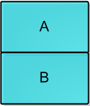

现有一个用单向链表实现的堆栈，栈顶为A，这时线程T1已经知道A.next为B，然后希望用CAS将栈顶替换为B：

head.compareAndSet(A,B);

在T1执行上面这条指令之前，线程T2介入，将A、B出栈，再pushD、C、A，此时堆栈结构如下图，而对象B此时处于游离状态：


此时轮到线程T1执行CAS操作，检测发现栈顶仍为A，所以CAS成功，栈顶变为B，但实际上B.next为null，所以此时的情况变为：

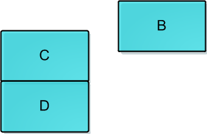

其中堆栈中只有B一个元素，C和D组成的链表不再存在于堆栈中，平白无故就把C、D丢掉了。

 

以上就是由于ABA问题带来的隐患，各种乐观锁的实现中通常都会用版本戳version来对记录或对象标记，避免并发操作带来的问题，在Java中，AtomicStampedReference也实现了这个作用，它通过包装[E,Integer]的元组来对对象标记版本戳stamp，从而避免ABA问题，例如下面的代码分别用AtomicInteger和AtomicStampedReference来对初始值为100的原子整型变量进行更新，AtomicInteger会成功执行CAS操作，而加上版本戳的AtomicStampedReference对于ABA问题会执行CAS失败：

 

**解决方法：**

用AtomicStampedReference/AtomicMarkableReference解决ABA问题

atomicStamreference是使用pair的int stamp作为计数器使用（动过几次），AtomicMarkableReference的pair使用的是boolean mark（有没有被动过）

 

·    **乐观锁的业务场景及实现方式**

乐观锁通常应用与读取频繁的场景，如果出现大量的写入操作，数据发生冲突的可能性就会加大，为了保证数据的一致性，应用层需要不断地重新获取数据，这样就会增加大量的查询操作，降低了系统的吞吐量。

乐观锁，使用版本标识来确定读到的数据与提交时的数据是否一致。提交后修改版本标识，不一致时可以采取丢弃和再次尝试的策略。

记录1，id,status1,status2,stauts3,version，表示有三个不同的状态，以及数据当前的版本

操作1：update table set status1=1,status2=0,status3=0 where id=111; 

操作2：update table set status1=0,status2=1,status3=0 where id=111;

操作3：update table set status1=0,status2=0,status3=1 where id=111;

没有任何控制的情况下，顺序执行3个操作，最后前两个操作会被直接覆盖。

加上version字段，每一次的操作都会更新version，提交时如果version不匹配，停止本次提交，可以尝试下一次的提交，以保证拿到的是操作1提交后的结果。

这是一种经典的乐观锁实现。

另外，java中的compareandswap即cas，解决多线程并行情况下使用锁造成性能损耗的一种机制。

CAS操作包含三个操作数，内存位置（V）,预期原值（A）和新值（B）。如果内存位置的值与预期原值相匹配，那么处理器会西东将该位置值更新为新值。否则，处理器不做任何操作。

记录2: id，stauts，status 包含3种状态值 1，2，3操作，update status＝3 where id＝111 and status＝1；

即 如果内存值为1，预期值为1，则修改新值。对于没有执行的操作则丢弃。

https://www.cnblogs.com/qjjazry/p/6581568.html

·    **Java 8****并法包下常见的并发类**

https://blog.csdn.net/lh87522/article/details/45973373

·    **偏向锁、轻量级锁、重量级锁、自旋锁的概念**

·    **可参考：《**[Java多线程编程核心技术](http://mp.weixin.qq.com/s?__biz=MzI1NDQ3MjQxNA==&mid=2247484881&idx=2&sn=b0ecf85cd7c9e543c84e7a9859c20a26&chksm=e9c5fc60deb27576a6a9c453dabc585f43d9f29fd8a8f37ed0e7cc2f012c86b23fbd21763a39&scene=21%23wechat_redirect)**》**


 ## 灵魂之问

1. 什么是data race？

   > 两个线程分别对一个非volatile修饰的变量进行访问的时候，且其中至少有一个是写操作，且这两个操作之间没有happen-before关系
   >
   > 为什么是非volatile修饰的变量？volatile修饰的变量会不会存在data race的情况，为什么？
   >
   > 为什么至少有一个是写操作？
   >
   > happens-before关系是什么？举例说明！
   >
   > 我们通常需要避免data race，但是有些场景下通过data race可以带来效率的提升，且能够产生正确的结果，请举几个允许data race存在的场景？
   >
   > > 实现对象缓存、sloppy counter、slapshot-at-the begining算法等

#  **数据结构**


## 树（二叉查找树、平衡二叉树、红黑树、B树、B+树）

## 深度有限算法、广度优先算法

## 克鲁斯卡尔算法、普林母算法、迪克拉斯算法

## 什么是一致性Hash及其原理、Hash环问题

## 常见的排序算法和查找算法：快排、折半查找、堆排序等

## 广义表


 ## 灵魂之问

1. 解释一下线性结构和非线性结构？它们的区别是什么？二维/多维数组是哪一种？为什么->重点考察二维数组/多维数组为什么是线性结构

   这一问题看似简单，实则有些复杂，涉及到的知识点比较深，能够让面试官满意的回答不多。

   > 1）什么是线性结构/非线性结构？
   >
   > a)索引和元素的对应关系？怎样访问每个元素？如下面的例子：
   >
   > ```java
   > int[] arr = new int[n]; // n是一个>0的有意义的整数
   > int b = arr[k]; // 0 <= k < n
   > ```
   >
   > 解释b是怎么被赋值的？即程序是怎么取到数组第k个元素的值，可从字节码进行分析。
   >
   > b)存储方面的设计，即在物理内存上怎么存储？（对上面的问题作了通用性的概括，可举例说明，如一维数组、队列、栈...）

   > 2）二维/多维数组为什么是非线性结构？
   >
   > 也需要和上面的回答一样，从索引和元素的对应关系和存储方面的设计、元素的访问这几个方面进行回答

# **进程和线程**

## 线程和进程的概念

### 多道程序设计

多道程序设计技术之前，多个程序串行执行，因此为了CPU的利用率，并且提高系统效率，引入多道程序设计概念；多道程序设计允许多个程序同时进入内存并执行，为了描述这样的执行过程引入了进程的概念

(下面几个问题摘自知乎:https://zhuanlan.zhihu.com/p/31444793)

**1、什么是多道程序系统？**

多道程序系统是在计算机内存中同时存放几道相互独立的程序，使它们在管理程序控制之下，相互穿插的运行 **(系统由一个程序转而运行另一个程序时需要使用中断机构中断正在运行的程序)** 。 两个或两个以上程序在计算机系统中同处于开始和结束之间的状态，这就称为多道程序系统。其技术运行的特征：多道、宏观上**并行**、微观上**串行**。

**2、在多道程序设计系统中，如何理解“内存中的多个程序的执行过程交织在一起，大家都在走走停停”这样一个现象？**

答：在多道程序设计系统中，内存中存放多个程序，它们以交替的方式使用CPU。因此，从宏观上看，这些程序都开始了自己的工作。但由于CPU只有一个，**在任何时刻CPU只能执行一个进程程序**。所以这些进程程序的执行过程是交织在一起的。也就是说，从微观上看，每一个进程一会儿在向前走，一会儿又停步不前，处于一种“走走停停”的状态之中。

3、**什么是“多道程序设计”技术？它对操作系统的形成起到什么作用？**

答：所谓“多道程序设计”技术，即是通过软件的手段，允许在计算机内存中同时存放几道相互独立的作业程序，让它们对系统中的资源进行“共享”和“竞争”，以使系统中的各种资源尽可能地满负荷工作，从而提高整个计算机系统的使用效率。基于这种考虑，计算机科学家开始把CPU、存储器、外部设备以及各种软件都视为计算机系统的“资源”，并逐步设计出一种软件来管理这些资源，不仅使它们能够得到合理地使用，而且还要高效地使用。具有这种功能的软件就是“操作系统”。所以，“多道程序设计”的出现，加快了操作系统的诞生。

4、**为什么说批处理多道系统能极大地提高计算机系统的工作效率？**
　　① 多道作业并行工作，减少了处理器的空闲时间。
　　② 作业调度可以合理选择装入主存储器中的作业，充分利用计算机系统的资源。
　　③ 作业执行过程中不再访问低速设备，而直接访问高速的磁盘设备，缩短执行时间。
　　④ 作业成批输入，减少了从操作到作业的交接时间。

#### Multiprogramming, multitasking, multithreading and multiprocessing的区别

(https://www.geeksforgeeks.org/difference-between-multitasking-multithreading-and-multiprocessing/)

1. **Multiprogramming –** A computer running more than one program at a time (like running Excel and Firefox simultaneously).
2. **Multiprocessing –** A computer using more than one CPU at a time.
3. **Multitasking –** Tasks sharing a common resource (like 1 CPU).
4. **Multithreading** is an extension of multitasking.

##### 1. Multi programming –

In a modern computing system, there are usually several concurrent application processes which want to execute. Now it is the responsibility of the Operating System to manage all the processes effectively and efficiently.
One of the most important aspects of an Operating System is to multi program.
In a computer system, there are multiple processes waiting to be executed, i.e. they are waiting when the CPU will be allocated to them and they begin their execution. These processes are also known as jobs. Now the main memory is too small to accommodate all of these processes or jobs into it. Thus, these processes are initially kept in an area called job pool. This job pool consists of all those processes awaiting allocation of main memory and CPU.
CPU selects one job out of all these waiting jobs, brings it from the job pool to main memory and starts executing it. The processor executes one job until it is interrupted by some external factor or it goes for an I/O task.

**Non-multi programmed system’s working –**

- In a non multi programmed system, As soon as one job leaves the CPU and goes for some other task (say I/O ), the CPU becomes idle. The CPU keeps waiting and waiting until this job (which was executing earlier) comes back and resumes its execution with the CPU. So CPU remains free for all this while.
- Now it has a drawback that the CPU remains idle for a very long period of time. Also, other jobs which are waiting to be executed might not get a chance to execute because the CPU is still allocated to the earlier job.
  This poses a very serious problem that even though other jobs are ready to execute, CPU is not allocated to them as the CPU is allocated to a job which is not even utilizing it (as it is busy in I/O tasks).
- It cannot happen that one job is using the CPU for say 1 hour while the others have been waiting in the queue for 5 hours. To avoid situations like this and come up with efficient utilization of CPU, the concept of multi programming came up.

The main idea of multi programming is to maximize the CPU time.
**Multi programmed system’s working –**

- In a multi-programmed system, as soon as one job goes for an I/O task, the Operating System interrupts that job, chooses another job from the job pool (waiting queue), gives CPU to this new job and starts its execution. The previous job keeps doing its I/O operation while this new job does CPU bound tasks. Now say the second job also goes for an I/O task, the CPU chooses a third job and starts executing it. As soon as a job completes its I/O operation and comes back for CPU tasks, the CPU is allocated to it.
- In this way, no CPU time is wasted by the system waiting for the I/O task to be completed.
  Therefore, the ultimate goal of multi programming is to keep the CPU busy as long as there are processes ready to execute. This way, multiple programs can be executed on a single processor by executing a part of a program at one time, a part of another program after this, then a part of another program and so on, hence executing multiple programs. Hence, the CPU never remains idle.

In the image below, program A runs for some time and then goes to waiting state. In the mean time program B begins its execution. So the CPU does not waste its resources and gives program B an opportunity to run.

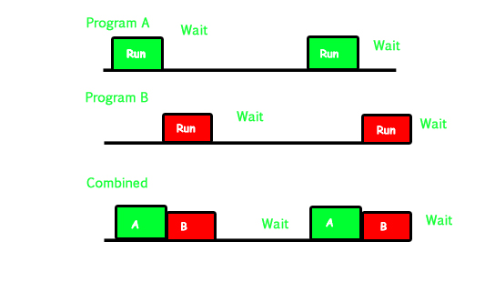

##### **2. Multiprocessing –**

In a uni-processor system, only one process executes at a time.
Multiprocessing is the use of two or more CPUs (processors) within a single Computer system. The term also refers to the ability of a system to support more than one processor within a single computer system. Now since there are multiple processors available, multiple processes can be executed at a time. These multi processors share the computer bus, sometimes the clock, memory and peripheral devices also.

**Multi processing system’s working –**

- With the help of multiprocessing, many processes can be executed simultaneously. Say processes P1, P2, P3 and P4 are waiting for execution. Now in a single processor system, firstly one process will execute, then the other, then the other and so on.
- But with multiprocessing, each process can be assigned to a different processor for its execution. If its a dual-core processor (2 processors), two processes can be executed simultaneously and thus will be two times faster, similarly a quad core processor will be four times as fast as a single processor.

**Why use multi processing –**

- The main advantage of multiprocessor system is to get more work done in a shorter period of time. These types of systems are used when very high speed is required to process a large volume of data. Multi processing systems can save money in comparison to single processor systems because the processors can share peripherals and power supplies.
- It also provides increased reliability in the sense that if one processor fails, the work does not halt, it only slows down. e.g. if we have 10 processors and 1 fails, then the work does not halt, rather the remaining 9 processors can share the work of the 10th processor. Thus the whole system runs only 10 percent slower, rather than failing altogether.


Multiprocessing refers to the hardware (i.e., the CPU units) rather than the software (i.e., running processes). If the underlying hardware provides more than one processor then that is multiprocessing. It is the ability of the system to leverage multiple processors’ computing power.

**Difference between Multi programming and Multi processing –**

- A System can be both multi programmed by having multiple programs running at the same time and multiprocessing by having more than one physical processor. The difference between multiprocessing and multi programming is that Multiprocessing is basically executing multiple processes at the same time on multiple processors, whereas multi programming is keeping several programs in main memory and executing them concurrently using a single CPU only.
- Multiprocessing occurs by means of parallel processing whereas Multi programming occurs by switching from one process to other (phenomenon called as context switching).

##### **3. Multitasking –**

As the name itself suggests, multi tasking refers to execution of multiple tasks (say processes, programs, threads etc.) at a time. In the modern operating systems, we are able to play MP3 music, edit documents in Microsoft Word, surf the Google Chrome all simultaneously, this is accomplished by means of multi tasking.

Multitasking is a logical extension of multi programming. The major way in which multitasking differs from multi programming is that multi programming works solely on the concept of context switching whereas multitasking is based on time sharing alongside the concept of context switching.

**Multi tasking system’s working –**

- In a time sharing system, each process is assigned some specific quantum of time for which a process is meant to execute. Say there are 4 processes P1, P2, P3, P4 ready to execute. So each of them are assigned some time quantum for which they will execute e.g time quantum of 5 nanoseconds (5 ns). As one process begins execution (say P2), it executes for that quantum of time (5 ns). After 5 ns the CPU starts the execution of the other process (say P3) for the specified quantum of time.
- Thus the CPU makes the processes to share time slices between them and execute accordingly. As soon as time quantum of one process expires, another process begins its execution.
- Here also basically a context switch is occurring but it is occurring so fast that the user is able to interact with each program separately while it is running. This way, the user is given the illusion that multiple processes/ tasks are executing simultaneously. But actually only one process/ task is executing at a particular instant of time. In multitasking, time sharing is best manifested because each running process takes only a fair quantum of the CPU time.

In a more general sense, multitasking refers to having multiple programs, processes, tasks, threads running at the same time. This term is used in modern operating systems when multiple tasks share a common processing resource (e.g., CPU and Memory).


- As depicted in the above image, At any time the CPU is executing only one task while other tasks are waiting for their turn. The illusion of parallelism is achieved when the CPU is reassigned to another task. i.e all the three tasks A, B and C are appearing to occur simultaneously because of time sharing.
- So for multitasking to take place, firstly there should be multiprogramming i.e. presence of multiple programs ready for execution. And secondly the concept of time sharing.

##### **4. Multi threading –**

A thread is a basic unit of CPU utilization. Multi threading is an execution model that allows a single process to have multiple code segments (i.e., threads) running concurrently within the “context” of that process.
e.g. VLC media player, where one thread is used for opening the VLC media player, one thread for playing a particular song and another thread for adding new songs to the playlist.

Multi threading is the ability of a process to manage its use by more than one user at a time and to manage multiple requests by the same user without having to have multiple copies of the program.

**Multi threading system’s working –**

**Example 1 –**

- Say there is a web server which processes client requests. Now if it executes as a single threaded process, then it will not be able to process multiple requests at a time. Firstly one client will make its request and finish its execution and only then, the server will be able to process another client request. This is really costly, time consuming and tiring task. To avoid this, multi threading can be made use of.
- Now, whenever a new client request comes in, the web server simply creates a new thread for processing this request and resumes its execution to hear more client requests. So the web server has the task of listening to new client requests and creating threads for each individual request. Each newly created thread processes one client request, thus reducing the burden on web server.

**Example 2 –**

- We can think of threads as child processes that share the parent process resources but execute independently. Now take the case of a GUI. Say we are performing a calculation on the GUI (which is taking very long time to finish). Now we can not interact with the rest of the GUI until this command finishes its execution. To be able to interact with the rest of the GUI, this command of calculation should be assigned to a separate thread. So at this point of time, 2 threads will be executing i.e. one for calculation, and one for the rest of the GUI. Hence here in a single process, we used multiple threads for multiple functionality.

The image below completely describes the VLC player example:


**Advantages of Multi threading –**

- Benefits of Multi threading include increased responsiveness. Since there are multiple threads in a program, so if one thread is taking too long to execute or if it gets blocked, the rest of the threads keep executing without any problem. Thus the whole program remains responsive to the user by means of remaining threads.
- Another advantage of multi threading is that it is less costly. Creating brand new processes and allocating resources is a time consuming task, but since threads share resources of the parent process, creating threads and switching between them is comparatively easy. Hence multi threading is the need of modern Operating Systems.

### **进程** 

* 表示

  是什么：进程的基本概念，狭义，广义，其包含哪些组成部分（内存层面）

  为什么：进程的由来，即为什么会出现进程的概念

  怎样做：进程可以用来做什么

* 多任务和进程管理

* 进程间通信

#### 表示

是什么？

> 进程的基本概念
>
> 进程的概念主要有两点：
>
> 第一，进程是一个实体。每一个进程都有它自己的地址空间，一般情况下，包括文本区域（text region）、数据区域（data region）和堆栈（stack region）。文本区域存储处理器执行的代码；数据区域存储变量和进程执行期间使用的动态分配的内存；堆栈区域存储着活动过程调用的指令和本地变量。
>
> 第二，进程是一个“执行中的程序”（一个程序的执行过程）。程序是一个没有生命的实体，只有处理器赋予程序生命时（操作系统执行之），它才能成为一个活动的实体，我们称其为进程。
>
> **狭义定义**：进程是正在运行的程序的实例（an instance of a computer program that is being executed）。
>
> **广义定义**：进程是一个具有一定独立功能的程序关于某个数据集合的一次运行活动。它是操作系统动态执行的基本单元，在传统的操作系统中，进程既是基本的分配单元，也是基本的执行单元。
>
> **从内存层面**来看，其主要包含哪些部分:
>
> 文本段，数据段，堆栈空间

为什么？

> 进程的由来：
>
> 进程是操作系统中最基本、重要的概念。是多道程序系统出现后，为了刻画系统内部出现的动态情况，描述系统内部各道程序的活动规律引进的一个概念,所有多道程序设计操作系统都建立在进程的基础上。

怎样做？

> 每一个程序都有一个主方法，主方法开始执行时，该方法所属的进程也就开始执行；
>
> 进程可以用来做什么：
>
> 进程的出现很大程度上提高了CPU的利用率，同时提高了工作效率；相比串行CPU而言，节省了程序无休止的等待时间，让任务得以并行操作。

#### 多任务和进程管理

多任务


进程管理

### 程序

程序是指令和数据的有序集合，其本身没有任何运行的含义，是一个静态的概念。而进程是程序在处理机上的一次执行过程，它是一个动态的概念。

程序可以作为一种软件资料长期存在，而进程是有一定生命期的。程序是永久的，进程是暂时的。

进程更能真实地描述并发，而程序不能；

进程是由进程控制块、程序段、数据段三部分组成;

进程具有创建其他进程的功能，而程序没有。

同一程序同时运行于若干个数据集合上，它将属于若干个不同的进程，也就是说同一程序可以对应多个进程。

在传统的操作系统中，程序并不能独立运行，作为资源分配和独立运行的基本单元都是进程。

 

进程有利于资源的管理和保护，然而进程有着以下问题：

1.进程切换的代价、开销比较大

2.一个进程中也需要执行多个程序，实现不同功能

3.进程有时候性能比较低

因此有了线程的概念。

### 进程和线程关系

通常在一个进程中可以包含若干个线程，它们可以利用进程所拥有的资源，在引入线程的操作系统中，通常都是把进程作为分配资源的基本单位，而把线程作为独立运行和独立调度的基本单位，由于线程比进程更小，基本上不拥有系统资源，故对它的调度所付出的开销就会小得多，能更高效的提高系统内多个程序间并发执行的程度。进程有自己独立的地址空间，而线程没有，线程必须依赖于进程而存在

线程属性

1.有标识符ID

2.有状态及状态转换，所以需要提供一些状态转换操作

3.不运行时需要保存上下文环境，所以需要程序计数器等寄存器

4.有自己的栈和栈指针

5.共享所在进程的地址空间和其它资源

### 进程与线程区别

定义方面：进程是程序在某个数据集合上的一次运行活动；线程是进程中的一个执行路径。（进程可以创建多个线程）

角色方面：在支持线程机制的系统中，进程是系统资源分配的单位，线程是CPU调度的单位。

资源共享方面：进程之间不能共享资源，而线程共享所在进程的地址空间和其它资源。同时线程还有自己的栈和栈指针，程序计数器等寄存器。

独立性方面：进程有自己独立的地址空间，而线程没有，线程必须依赖于进程而存在。

 

开销方面：进程切换的开销较大，线程相对较小。（前面也提到过，引入线程也出于了开销的考虑。）

当下推出的通用操作系统都引入了线程，以便进一步提高系统的并发性，并把它视为现代操作系统的一个重要指标。


 

Thread and Process are two closely related terms in multi-threading. The main difference between the two terms is that the threads are a part of a process, i.e. a process may contain one or more threads, but a thread cannot contain a process.

In programming, there are two basic units of execution: processes and threads. They both execute a series of instructions. Both are initiated by a program or the operating system. This article helps to differentiate between the two units.

A process is an instance of a program that is being executed. It contains the program code and its current activity. Depending on the operating system, a process may be made up of multiple threads of execution that execute instructions concurrently. A program is a collection of instructions; a process is the actual execution of those instructions.

A process has a self-contained execution environment. It has a complete set of private basic run-time resources; in particular, each process has its own memory space. Processes are often considered similar to other programs or applications. However, the running of a single application may in fact be a set of cooperating processes. To facilitate communication between the processes, most operating systems use Inter Process Communication (IPC) resources, such as pipes and sockets. The IPC resources can also be used for communication between processes on different systems. Most applications in a virtual machine run as a single process. However, it can create additional processes using a process builder object.

## 并行和并发的概念

一、

并行：多个处理器或者是多核处理器同事处理多个不同的任务，指物理上的同时发生；

并发：一个处理器同时处理多个任务，指逻辑上的同时发生；

二、

并行(parallel)：指在同一时刻，有多条指令在多个处理器上同时执行。就好像两个人各拿一把铁锨在挖坑，一小时后，每人一个大坑。所以无论从微观还是从宏观来看，二者都是一起执行的。 


并发(concurrency)：指在同一时刻只能有一条指令执行，但多个进程指令被快速的轮换执行，使得在宏观上具有多个进程同时执行的效果，但在微观上并不是同时执行的，只是把时间分成若干段，使多个进程快速交替的执行。这就好像两个人用同一把铁锨，轮流挖坑，一小时后，两个人各挖一个小一点的坑，要想挖两个大一点得坑，一定会用两个小时。

 

并行在多处理器系统中存在，而并发可以在单处理器和多处理器系统中都存在，并发能够在单处理器系统中存在是因为并发是并行的假象，并行要求程序能够同时执行多个操作，而并发只是要求程序假装同时执行多个操作（每个小时间片执行一个操作，多个操作快速切换执行）。 

 

三、

当有多个线程在操作时,如果系统只有一个CPU,则它根本不可能真正同时进行一个以上的线程,它只能把CPU运行时间划分成若干个时间段,再将时间段分配给各个线程执行,在一个时间段的线程代码运行时,其它线程处于挂起状态.这种方式我们称之为并发(Concurrent)。

当系统有一个以上CPU时,则线程的操作有可能非并发.当一个CPU执行一个线程时,另一个CPU可以执行另一个线程,两个线程互不抢占CPU资源,可以同时进行,这种方式我们称之为并行(Parallel)。 

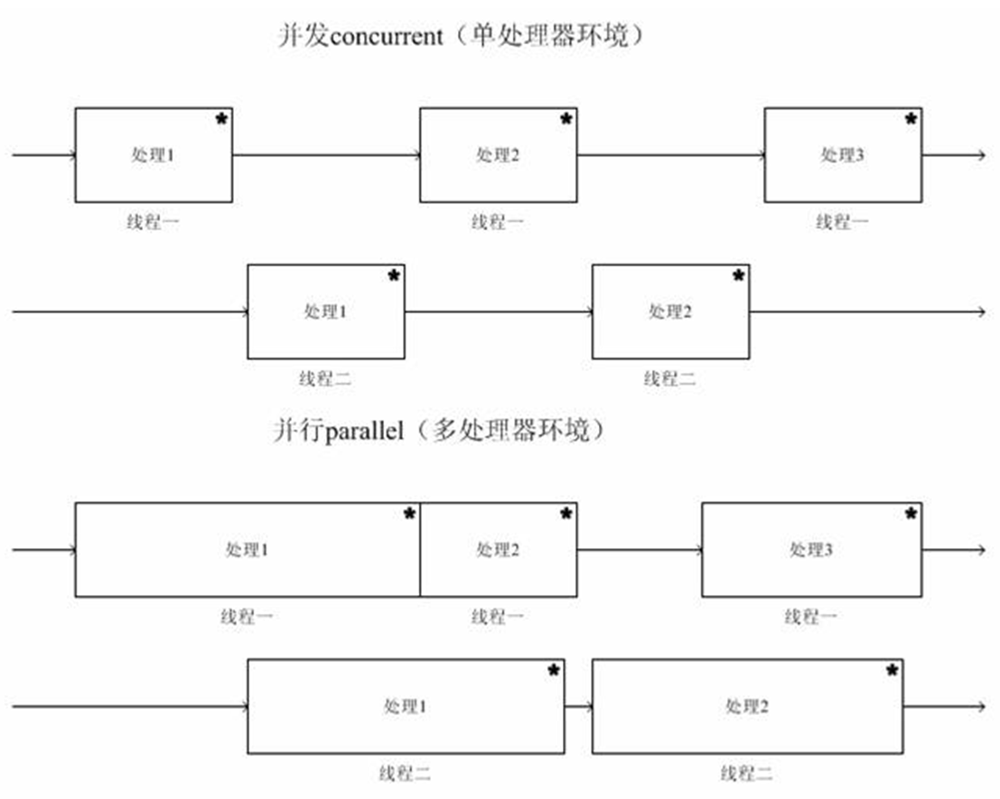

## 创建线程的方式及实现

### 1.继承Thread类创建线程类

调用run只是相当于调用了一个方法，而没有启动新的线程，还会按照顺序执行相应的代码。

调用start会启动一个新的线程，运行重写的run代码。 


### 2.通过Runnable接口创建线程类

（1）定义runnable接口的实现类，并重写该接口的run()方法。

（2）创建Runnable实现类的实例，并以此实例作为Thread的target来创建Thread对象，该Thread对象才是真正的线程对象

（3）调用线程对象的start()方法来启动线程。


### 3.通过Callable和Future创建线程（沒怎么用过）

（1）创建Callable接口的实现类，并实现call()方法，该call()方法将作为线程执行体，并且有返回值。

（2）创建Callable实现类的实例，使用FutureTask类来包装Callable对象，该FutureTask对象封装了该Callback对象的call()方法的返回值；

（3）使用FutureTask对象作为Thread对象的target创建并启动新线程；

（4）调用FutureTask对象的get()方法来获得子线程执行结束后的返回值。

## 进程间通信的方式以及代码实现

（1）管道（Pipe）：管道可用于具有亲缘关系进程间的通信，允许一个进程和另一个与它有共同祖先的进程之间进行通信。

（2）命名管道（named pipe）：命名管道克服了管道没有名字的限制，除具有管道所具有的功能外，它还允许无亲缘关系进程间的通信。

（3）信号（Signal）：信号是比较复杂的通信方式，用于通知接受进程有某种事件发生，除了用于进程间通信外，进程还可以发送 信号给进程本身。

（4）消息（Message）队列：消息队列是消息的链接表，包括Posix消息队列system V消息队列。

（5）共享内存：使得多个进程可以访问同一块内存空间，是最快的可用IPC形式。是针对其他通信机制运行效率较低而设计的。

（6）内存映射（mapped memory）：内存映射允许任何多个进程间通信，每一个使用该机制的进程通过把一个共享的文件映射到自己的进程地址空间来实现它。

（7）信号量（semaphore）：主要作为进程间以及同一进程不同线程之间的同步手段。

（8）套接口（Socket）：更为一般的进程间通信机制，可用于不同机器之间的进程间通信。

https://blog.csdn.net/truong/article/details/39228249/

### 用于进程间通讯(IPC)的四种不同技术:

\1. 消息传递(管道,FIFO,posix和system v消息队列)

\2. 同步(互斥锁,条件变量,读写锁,文件和记录锁,Posix和System V信号灯)

\3. 共享内存区(匿名共享内存区,有名Posix共享内存区,有名System V共享内存区)

\4. 过程调用(Solaris门,Sun RPC)

消息队列和过程调用往往单独使用,也就是说它们通常提供了自己的同步机制.相反,共享内存区通常需要由应用程序提供的某种同步形式才能 正常工作.解决某个特定问题应使用哪种IPC不存在简单的判定,应该逐渐熟悉各种IPC形式提供的机制,然后根据特定应用的要求比较它们的特性.

 

### 必须考虑的四个前提:

\1. 联网的还是非联网的.IPC适用于单台主机上的进程或线程间的.如果应用程序有可能分布到多台主机上,那就要考虑使用套接字代替IPC,从而简化以后向联 网的应用程序转移的工作.

\2. 可移植性.

\3. 性能,在具体的开发环境下运行测试程序,比较几种IPC的性能差异.

\4. 实时调度.如果需要这一特性,而且所用的系统也支持posix实时调度选项,那就考虑使用Posix的消息传递和同步函数.

 

### 各种 IPC之间的一些主要差异:

\1. 管道和FIFO是字节流,没有消息边界.Posix消息和System V消息则有从发送者向接受者维护的记录边界(eg:TCP是没有记录边界的字节流,UDP则提供具有记录边界的消息).

\2. 当有一个消息放置到一个空队列中时,Posix消息队列可向一个进程发送一个信号,或者启动一个新的线程.System V则不提供类似的通知形式.

\3. 管道和FIFO的数据字节是先进先出的.Posix消息和System V消息具有由发送者赋予的优先级.从一个Posix消息队列读出时,首先返回的总是优先级最高的消息.从一个System V消息队列读出时,读出者可以要求想要的任意优先级的消息.

\4. 在众多的消息传递技术—管道,FIFO,Posix消息队列和System V消息队列—中,可从一个信号处理程序中调用的函数只有read和write(适用于管道和FIFO).

 

### 比较不同形式的消息传递时,我 们感兴趣的有两种测量尺度:

\1. 带宽(bandwidth):数据通过IPC通道转移的速度.为测量该值,我们从一个进程向另一个进程发送大量数据(几百万字节).我们还给不同大小的 I/O操作(例如管道和FIFO的write和read操作)测量该值,期待发现带宽随每个I/O操作的数据量的增长而增长的规律.

\2. 延迟(latency):一个小的IPC消息从一个进程到令一个进程再返回来所花的时间.我们测量的是只有一个1个字节的消息从一个进程到令一个进程再回 来的时间(往返时间)

 

在现实世界中,带宽告诉我们大块数据通过一个IPC通道发送出去需花多长时间,然而IPC也用于传递小的控制信 息,系统处理这些小消息所需的时间就由延迟提供.这两个数都很重要.

 # 多线程

## 线程池


## 说说 CountDownLatch、CyclicBarrier 原理和区别

## 说说 Semaphore 原理

## 说说 Exchanger 原理

## ThreadLocal 原理分析，ThreadLocal为什么会出现OOM，出现的深层次原理

## 讲讲线程池的实现原理


一个线程从被提交（submit）到执行共经历以下流程：

 

线程池判断核心线程池里是的线程是否都在执行任务，如果不是，则创建一个新的工作线程来执行任务。如果核心线程池里的线程都在执行任务，则进入下一个流程

线程池判断工作队列是否已满。如果工作队列没有满，则将新提交的任务储存在这个工作队列里。如果工作队列满了，则进入下一个流程。

线程池判断其内部线程是否都处于工作状态。如果没有，则创建一个新的工作线程来执行任务。如果已满了，则交给饱和策略来处理这个任务。

线程池在执行excute方法时，主要有以下四种情况


 

1 如果当前运行的线程少于corePoolSize，则创建新线程来执行任务（需要获得全局锁）

2 如果运行的线程等于或多于corePoolSize ,则将任务加入BlockingQueue

3 如果无法将任务加入BlockingQueue(队列已满)，则创建新的线程来处理任务（需要获得全局锁）

4 如果创建新线程将使当前运行的线程超出maxiumPoolSize，任务将被拒绝，并调用RejectedExecutionHandler.rejectedExecution()方法。

 

线程池采取上述的流程进行设计是为了减少获取全局锁的次数。在线程池完成预热（当前运行的线程数大于或等于corePoolSize）之后，几乎所有的excute方法调用都执行步骤2。

 

Execute方法

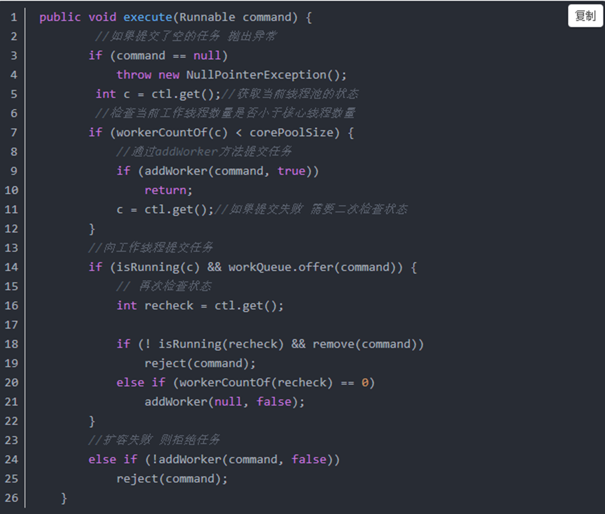

从源码中可以看到提交任务的这一过程基本与第二个图的四个流程是一致的，需要检查的是当前工作线程的数量与核心线程数量的关系，来决定提交任务的方式或者是拒绝任务提交。而具体任务的提交工作是在addWorker方法中。在这里面看到了recheck这样的变量，这是在执行了一些动作失败后再次检查线程池的状态，因为在这期间可能有线程池关闭获得线程池饱和等状态的改变。

 

**addWorker****方法**

 

这个方法是任务提交的一个核心方法。在里面完成了状态检查、新建任务、执行任务等一系列动作。它有两个参数，第一个参数是提交的任务，第二个参数是一个标识符，标识在检查工作线程数量的时候是应该与corePoolSize对比还是应该maximumPoolSize对比。

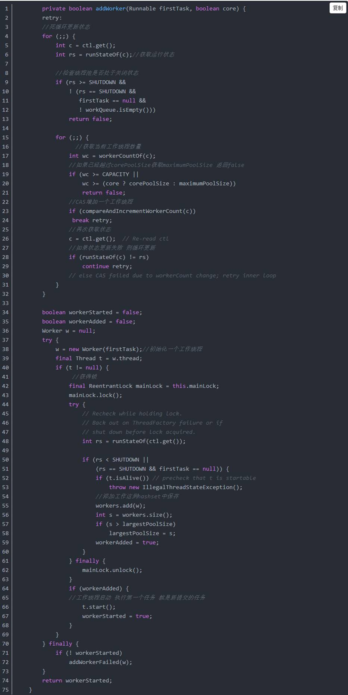

这个方法可以分为两个阶段来看，第一个阶段是判断是否有必要新增一个工作线程，如果有则利用CAS更新工作线程的数量；第二部分是将提交的任务封装成一个工作线程Worker然后加入到线程池的容器中，开始执行新提交的任务。这个Worker在执行完任务后，还会循环地获取工作队列里的任务来执行。下面来看一下Worker的构造方法就能更好地理解上面的代码了

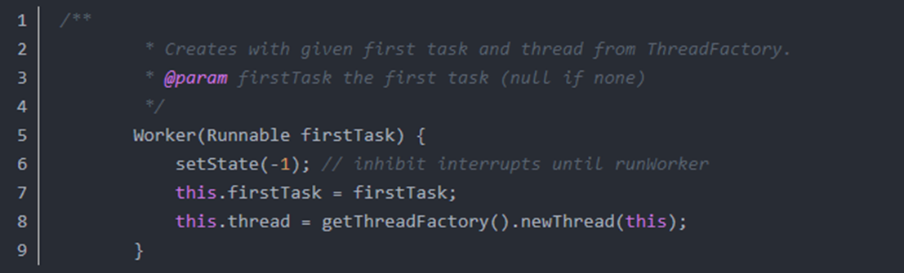

 

**runWorker****方法**

在addWorker方法快要结束的地方，调用了t.start()方法，我们知道它实际执行的就是Worker对象的run()方法，而worker的run()方法是这样定义的：


它实际上是将自己委托给线程池的runWorker方法

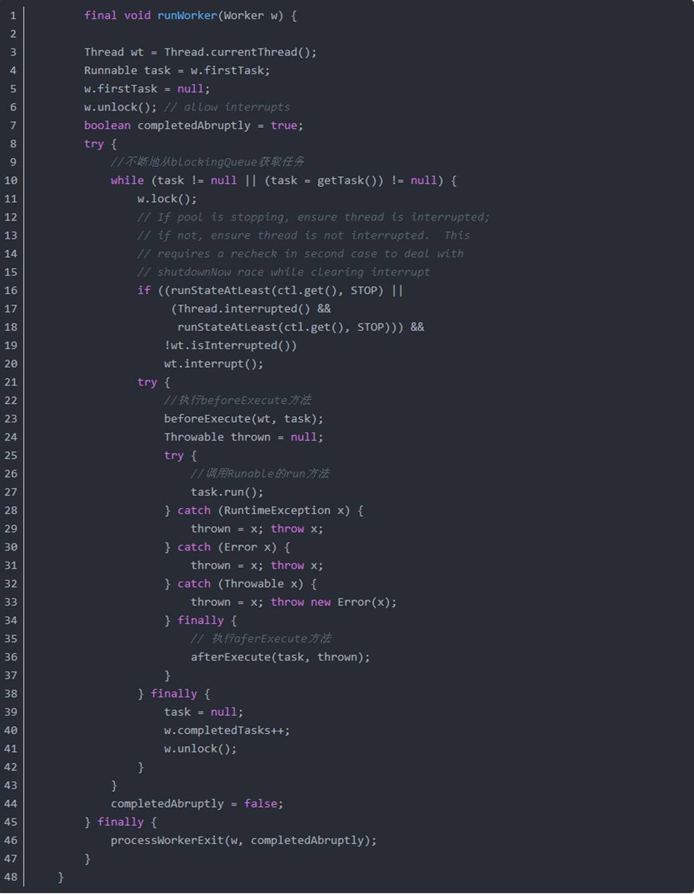

这个方法呢也比较好理解，它在不断执行我们提交的任务的run方法。而这个任务可能是我们新提交的，也有可能是从等待队列中获取的。这样就实现了线程池的完成逻辑。

### 线程池的几种实现方式

**（**[**https://blog.csdn.net/w2393040183/article/details/52177572**](https://blog.csdn.net/w2393040183/article/details/52177572)**）**

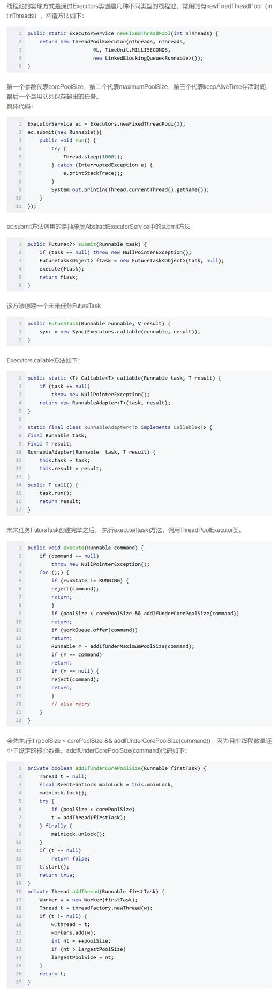

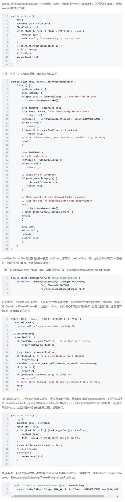

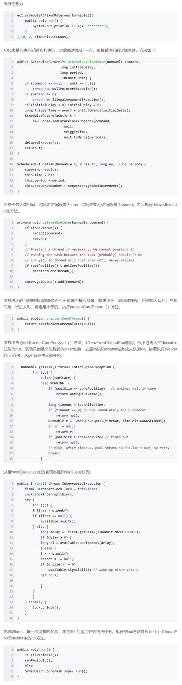

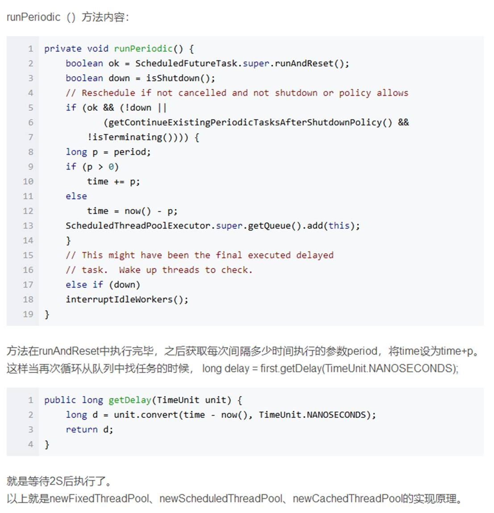

## 线程的生命周期，状态是如何转移的


1、线程的生命周期：新建（New）、就绪（Runnable）、运行（Running）、阻塞（Blocked）和死亡（Dead）5种状态。

2、当线程对象调用了start（）方法之后，该线程处于就绪状态，Java虚拟机会为其创建方法调用栈和程序计数器，处于这个状态中的线程并没有开始运行，只是表示该线程可以运行了。至于该线程何时开始运行，取决于JVM里线程调度器的调度。

3、启动线程使用start（）方法，而不是run（）方法。

4、只能对处于新建状态的线程调用start（），否则将引发IllegalThreadStateException异常。

5、所有现代的桌面和服务器操作系统都采用抢占式调度策略，只有当一个线程调用了它的sleep（）方法或yield（）方法后才会放弃所占用的资源。

6、线程从阻塞状态只能进入就绪状态，无法进入运行状态。

7、程序会以如下三种方式结束，结束后就处于死亡状态。

（1）run（）或call（）方法执行完成，线程正常结束。

（2）线程抛出一个未捕获的Exception或Error。

（3）直接调用该线程的stop（）方法来结束该线程——该方法容易导致死锁，通常不推荐使用。

8、isAlive（）方法测试某个线程是否已经死亡。

 

（1）New：创建线程对象后，该线程处于新建状态，此时它不能运行，和其他Java对象一样，仅仅有Java虚拟机为其分配了内存，没有表现出任何线程的动态特征；

（2）Runnable：线程对象调用了start（）方法后，该线程就进入了就绪状态（也称可运行状态）。处于就绪状态的线程位于可运行池中，此时它只是具备了运行的条件，能否获得CPU的使用权开始运行，还需要等待系统的调度；

（3）Runing：处于就绪状态的线程获得了CPU使用权，开始执行run（）方法中的线程执行体，则线程处于运行状态。当一个线程启动后，它不能一直处于运行状态（除非它的线程执行体足够短，瞬间结束），当使用完系统分配的时间后，系统就会剥脱该线程占用的CPU资源，让其他线程获得执行的机会。只有处于就绪状态的线程才可能转换到运行状态。

（4）Blocked：一个正在执行的线程在某些特殊情况下，如执行耗时的输入/输出操作时，会放弃CPU的使用权，进入阻塞状态。线程进入阻塞状态后，就不能进入排队队列。只有当引用阻塞的原因，被消除后，线程才可以进入就绪状态。

——当线程试图获取某个对象的同步锁时，如果该锁被其他线程所持有，则当前线程进入阻塞状态，如果想从阻塞状态进入就绪状态必须得获取到其他线程所持有的锁。

——当线程调用了一个阻塞式的IO方法时，该线程就会进入阻塞状态，如果想进入就绪状态就必须要等到这个阻塞的IO方法返回。

——当线程调用了某个对象的wait（）方法时，也会使线程进入阻塞状态，notify（）方法唤醒。

——调用了Thread的sleep（long millis）。线程睡眠时间到了会自动进入阻塞状态。

——一个线程调用了另一个线程的join（）方法时，当前线程进入阻塞状态。等新加入的线程运行结束后会结束阻塞状态，进入就绪状态。

线程从阻塞状态只能进入就绪状态，而不能直接进入运行状态，即结束阻塞的线程需要重新进入可运行池中，等待系统的调度。

（5）Terminated：线程的run（）方法正常执行完毕或者线程抛出一个未捕获的异常（Exception）、错误（Error），线程就进入死亡状态。一旦进入死亡状态，线程将不再拥有运行的资格，也不能转换为其他状态。

·    **可参考：《**[**Java****多线程编程核心技术**](http://mp.weixin.qq.com/s?__biz=MzI1NDQ3MjQxNA==&mid=2247484881&idx=2&sn=b0ecf85cd7c9e543c84e7a9859c20a26&chksm=e9c5fc60deb27576a6a9c453dabc585f43d9f29fd8a8f37ed0e7cc2f012c86b23fbd21763a39&scene=21%23wechat_redirect)**》**


## AtomicInteger底层实现原理；

## synchronized与ReentraLock哪个是公平锁；

## CAS机制会出现什么问题；

## 用过并发包下边的哪些类；

## 一个线程连着调用start两次会出现什么情况？

## wait方法能不能被重写，wait能不能被中断；

## 线程池的实现？四种线程池？重要参数及原理？任务拒接策略有哪几种？

## 线程状态以及API怎么操作会发生这种转换；

## 常用的避免死锁方法；

## 灵魂之问

1. Thread join方法的作用？请解释其实现原理？

# **Jvm**

## Java对象存储空间的特殊情况？

这也引出了一个经典的面试题：Java中对象实例和数组元素是否都在堆上分配空间？

## Java 8 中使用metaspace代替PermGen的原因？


## Jvm中的几个概念：native heap，metaspace，newgen,oldgen...

## JVM运行时内存区域划分

https://blog.csdn.net/Zz110753/article/details/70170339

## 内存溢出OOM和堆栈溢出SOE的示例及原因、如何排查与解决

https://blog.csdn.net/BabyNiu411/article/details/44195465

https://blog.csdn.net/pbuzhidaol/article/details/72871898

## 如何判断对象是否可以回收或存活

## 常见的GC回收算法及其含义

## 常见的JVM性能监控和故障处理工具类：jps、jstat、jmap、jinfo、jconsole等

## JVM如何设置参数

## JVM性能调优

## 类加载器、双亲委派模型、一个类的生命周期、类是如何加载到JVM中的

## java的初始化块、静态初始化块、构造函数的执行顺序

https://www.cnblogs.com/BlackStorm/p/5699965.html

​     所有的静态初始化块都优先执行，其次才是非静态的初始化块和构造函数，它们的执行顺序是：

​     1.父类的静态初始化块

​     2.子类的静态初始化块

​     3.父类的初始化块

​     4.父类的构造函数

​     5.子类的初始化块

​     6.子类的构造函数

​     静态初始化块的优先级最高，也就是最先执行，并且仅在类第一次被加载时执行；

​     非静态初始化块和构造函数后执行，并且在每次生成对象时执行一次；

​     非静态初始化块的代码会在类构造函数之前执行。因此若要使用，应当养成把初始化块写在构造函数之前的习惯，便于调试；

​     静态初始化块既可以用于初始化静态成员变量，也可以执行初始化代码；

​     非静态初始化块可以针对多个重载构造函数进行代码复用。

## java类的加载过程

## 类加载的过程：加载、验证、准备、解析、初始化

## 强引用、软引用、弱引用、虚引用

·    Java内存模型JMM

- Minor GC与Full     GC分别在什么时候发生？什么时候触发Full GC;

- GC收集器有哪些？CMS收集器与G1收集器的特点。

- Java在什么时候会出现内存泄漏；

- Java中的大对象如何进行存储；

- rt.jar被什么类加载器加载，什么时间加载；

## 自己写的类被什么加载，什么时间加载；

## 自己写的两个不同的类是被同一个类加载器加载的吗？为什么？

## 为什么新生代内存需要有两个Survivor区？

## 几种常用的内存调试工具：jmap、jstack、jconsole；

## 类加载的五个过程：加载、验证、准备、解析、初始化；

## G1停顿吗，CMS回收步骤，CMS为什么会停顿，停顿时间；

- 栈主要存的数据是什么，堆呢？

- 堆分为哪几块，比如说新生代老生代，那么新生代又分为什么？

- 软引用和弱引用的使用场景（软引用可以实现缓存，弱引用可以用来在回调函数中防止内存泄露）；

## Java字节码

### 字节码的查看工具


### 常用的字节码指令的含义


### 字节码怎么看

#### 一段简单的打印代码


#### 一段四则运算代码


#### 一段包含List操作的代码


#### 一段包含泛型的代码

## 灵魂之问

* 简要讲一下GC的原理？

  Java是在c++的基础之上发展而来的，其显著的特点之一就是垃圾回收器，使得编程人员能够五香像c++中那样每次new完对象后都要手动释放内存。既然Java是在c++的基础上发展而来，那么Java中的内存管理在某些方面势必和c++有些相似之处，讲讲两者在内存管理方面的相似之处，且Java在内存管理方面做了哪些优化 ？
  
* <font color=red>**High-performance garbage-collected implementations can have bounded pauses to support systems programming and real-time applications.**</font>怎么理解这句话？

# **网络IO**

## BIO、NIO、AIO的概念

## 什么是长连接和短连接

## Http1.0和2.0相比有什么区别，可参考《[Http 2.0](http://mp.weixin.qq.com/s?__biz=MzI1NDQ3MjQxNA==&mid=2247484611&idx=1&sn=66c875392eedff8150633ddcd5d83e7a&chksm=e9c5fd72deb274648a607b9bc39bac34adadd768577b77354f6dc85422691605e210b69eeb7b&scene=21%23wechat_redirect)》

## Https的基本概念

## 三次握手和四次挥手、为什么挥手需要四次

## 从游览器中输入URL到页面加载的发生了什么？可参考《[从输入](http://mp.weixin.qq.com/s?__biz=MzI1NDQ3MjQxNA==&mid=2247483724&idx=1&sn=e58dd30d124971c795584e8673d6cc71&chksm=e9c5f8fddeb271ebebbb6c350ed1abc252f1f26b4f35c4ce36e10bde9659a37520feabed2290&scene=21%23wechat_redirect)[URL](http://mp.weixin.qq.com/s?__biz=MzI1NDQ3MjQxNA==&mid=2247483724&idx=1&sn=e58dd30d124971c795584e8673d6cc71&chksm=e9c5f8fddeb271ebebbb6c350ed1abc252f1f26b4f35c4ce36e10bde9659a37520feabed2290&scene=21%23wechat_redirect)[到页面加载发生了什么](http://mp.weixin.qq.com/s?__biz=MzI1NDQ3MjQxNA==&mid=2247483724&idx=1&sn=e58dd30d124971c795584e8673d6cc71&chksm=e9c5f8fddeb271ebebbb6c350ed1abc252f1f26b4f35c4ce36e10bde9659a37520feabed2290&scene=21%23wechat_redirect)》

## 数据链路层是做什么的?

## 数据链路层的流量控制？

## 网络模型的分层、IP和Mac地址在那个层、TCP和HTTP分别在那个层；

## TCP滑动窗口；

## TCP为什么可靠；

## TCP的同传，拆包与组装包是什么意思；

## Https和Http有什么区别；

## Http 为什么是无状态的；

## TCP三次握手，为什么不是三次，为什么不是四次；

## TCP的拥塞控制、流量控制详细说明？

## Http1.0和Http2.0的区别；

## 两个不同ip地址的计算机之间如何通信；

## 地址解析协议ARP；

## OSI七层模型分别对应着五层模型的哪一部分；

## TCP三次握手数据丢失了怎么办？那如果后面又找到了呢？

## HTTP1.0和HTTP1.1的区别；

## DHCP如何实现分配IP的； 发现阶段（DHCP客户端在网络中广播发送DHCP DISCOVER请求报文，发现DHCP服务器，请求IP地址租约）、提供阶段（DHCP服务器通过DHCP OFFER报文向DHCP客户端提供IP地址预分配）、选择阶段（DHCP客户端通过DHCP REQUEST报文确认选择第一个DHCP服务器为它提供IP地址自动分配服务）和确认阶段（被选择的DHCP服务器通过DHCP ACK报文把在DHCP OFFER报文中准备的IP地址租约给对应DHCP客户端）。

## OSI七层模型，每层都说下自己的理解和知道的，说的越多越好；

## HTTP、TCP、UDP的区别和联系；

## TCP和UDP各自的优势，知道哪些使用UDP协议的成功案例；

## TCP和UDP各用了底层什么协议；

## 单个UDP报文最大容量；

## 单个TCP报文最大容量；

## TCP报头格式、UDP报头格式；

## Server遭遇SYN Flood应当怎么处理；

## Web开发中如何防范XSS？

## 拆包和粘包的问题，如何解决，如果我们的包没有固定长度的话，我们的应用程序应该如何解决；

## 讲下请求头细节？

## Http和Https？Http1.0,1.1,2.0，讲下长连接和短连接？Https是怎样的？如果我篡改了公钥呢？怎么防止？

## Get和Post，讲下区别，要我模拟出抓包来。

## 详细讲下Cookie和Session，Token，OAuth2.0协议;

## 拥塞算法知道吗？哪些，分别怎样？

## 学过计算机网络是吧？socket熟悉吗？对它的读写缓冲区有理解吗？怎么的？那滑动窗口是怎样的？为什么这样设计？

## 再聊下Http的Http basic authentication;

## Https的过程;


# Questions

## 1.为什么等待和通知是在 Object 类而不是 Thread 中声明的？

一个棘手的 Java 问题，如果 Java编程语言不是你设计的，你怎么能回答这个问题呢。Java编程的常识和深入了解有助于回答这种棘手的 Java 核心方面的面试问题。

**为什么 wait，notify 和 notifyAll 是在 Object 类中定义的而不是在 Thread 类中定义**

这个问题的好在它能反映了面试者对等待通知机制的了解, 以及他对此主题的理解是否明确。就像为什么 Java 中不支持多继承或者为什么 String 在 Java 中是 final 的问题一样，这个问题也可能有多个答案。

为什么在 Object 类中定义 wait 和 notify 方法，每个人都能说出一些理由。从我的面试经验来看, wait 和 nofity 仍然是大多数Java 程序员最困惑的，特别是2到3年的开发人员，如果他们要求使用 wait 和 notify, 他们会很困惑。因此，如果你去参加 Java 面试，请确保对 wait 和 notify 机制有充分的了解，并且可以轻松地使用 wait 来编写代码，并通过生产者-消费者问题或实现阻塞队列等了解通知的机制。

为什么等待和通知需要从同步块或方法中调用, 以及 Java 中的 wait，sleep 和 yield 方法之间的差异，如果你还没有读过，你会觉得有趣。为何 wait，notify 和 notifyAll 属于 Object 类? 为什么它们不应该在 Thread 类中? 以下是我认为有意义的一些想法：

**1) wait 和 notify 不仅仅是普通方法或同步工具，更重要的是它们是 Java 中两个线程之间的通信机制。**对语言设计者而言, 如果不能通过 Java 关键字(例如 synchronized)实现通信此机制，同时又要确保这个机制对每个对象可用, 那么 Object 类则是的正确声明位置。记住同步和等待通知是两个不同的领域，不要把它们看成是相同的或相关的。同步是提供互斥并确保 Java 类的线程安全，而 wait 和 notify 是两个线程之间的通信机制。

**2) 每个对象都可上锁，这是在 Object 类而不是 Thread 类中声明 wait 和 notify 的另一个原因。**

**3) 在 Java 中为了进入代码的临界区，线程需要锁定并等待锁定**，他们不知道哪些线程持有锁，而只是知道锁被某个线程持有， 并且他们应该等待取得锁, 而不是去了解哪个线程在同步块内，并请求它们释放锁定。

**4) Java 是基于 Hoare 的监视器的思想。**在Java中，所有对象都有一个监视器。

线程在监视器上等待，为执行等待，我们需要2个参数：

- 一个线程
- 一个监视器(任何对象)

在 Java 设计中，线程不能被指定，它总是运行当前代码的线程。但是，我们可以指定监视器(这是我们称之为等待的对象)。这是一个很好的设计，因为如果我们可以让任何其他线程在所需的监视器上等待，这将导致“入侵”，导致在设计并发程序时会遇到困难。请记住，在 Java 中，所有在另一个线程的执行中侵入的操作都被弃用了(例如 stop 方法)。

## 2.为什么Java中不支持多重继承？

我发现这个 Java 核心问题很难回答，因为你的答案可能不会让面试官满意，在大多数情况下，面试官正在寻找答案中的关键点，如果你提到这些关键点，面试官会很高兴。在 Java 中回答这种棘手问题的关键是准备好相关主题, 以应对后续的各种可能的问题。

这是非常经典的问题，与为什么 String 在 Java 中是不可变的很类似; 这两个问题之间的相似之处在于它们主要是由 Java 创作者的设计决策使然。

**为什么Java不支持多重继承, 可以考虑以下两点:**

**1)第一个原因是围绕钻石形继承问题产生的歧义**，考虑一个类 A 有 foo() 方法, 然后 B 和 C 派生自 A, 并且有自己的 foo() 实现，现在 D 类使用多个继承派生自 B 和C，如果我们只引用 foo(), 编译器将无法决定它应该调用哪个 foo()。这也称为 Diamond 问题，因为这个继承方案的结构类似于菱形，见下图:

```javascript
                A foo()
			   / \   
		foo() B   C foo()               
               \ /                   
            	D foo()
```

即使我们删除钻石的顶部 A 类并允许多重继承，我们也将看到这个问题含糊性的一面。如果你把这个理由告诉面试官，他会问为什么 C++ 可以支持多重继承而 Java不行。嗯，在这种情况下，我会试着向他解释我下面给出的第二个原因，它不是因为技术难度, 而是更多的可维护和更清晰的设计是驱动因素, 虽然这只能由 Java 言语设计师确认，我们只是推测。维基百科链接有一些很好的解释，说明在使用多重继承时，由于钻石问题，不同的语言地址问题是如何产生的。

2)对我来说第二个也是更有说服力的理由是，**多重继承确实使设计复杂化并在转换、构造函数链接等过程中产生问题。**假设你需要多重继承的情况并不多，简单起见，明智的决定是省略它。此外，Java 可以通过使用接口支持单继承来避免这种歧义。由于接口只有方法声明而且没有提供任何实现，因此只有一个特定方法的实现，因此不会有任何歧义。

## 3.为什么Java不支持运算符重载？

另一个类似棘手的Java问题。为什么 C++ 支持运算符重载而 Java 不支持? 有人可能会说+运算符在 Java 中已被重载用于字符串连接，不要被这些论据所欺骗。

与 C++ 不同，Java 不支持运算符重载。Java 不能为程序员提供自由的标准算术运算符重载，例如+， - ，*和/等。如果你以前用过 C++，那么 Java 与 C++ 相比少了很多功能，例如 Java 不支持多重继承，Java中没有指针，Java中没有引用传递。另一个类似的问题是关于 Java 通过引用传递，这主要表现为 Java 是通过值还是引用传参。虽然我不知道背后的真正原因，但我认为以下说法有些道理，为什么 Java 不支持运算符重载。

**1)简单性和清晰性。**清晰性是Java设计者的目标之一。设计者不是只想复制语言，而是希望拥有一种清晰，真正面向对象的语言。添加运算符重载比没有它肯定会使设计更复杂，并且它可能导致更复杂的编译器, 或减慢 JVM，因为它需要做额外的工作来识别运算符的实际含义，并减少优化的机会, 以保证 Java 中运算符的行为。

**2)避免编程错误。**Java 不允许用户定义的运算符重载，因为如果允许程序员进行运算符重载，将为同一运算符赋予多种含义，这将使任何开发人员的学习曲线变得陡峭，事情变得更加混乱。据观察，当语言支持运算符重载时，编程错误会增加，从而增加了开发和交付时间。由于 Java 和 JVM 已经承担了大多数开发人员的责任，如在通过提供垃圾收集器进行内存管理时，因为这个功能增加污染代码的机会, 成为编程错误之源, 因此没有多大意义。

**3)JVM复杂性。**从JVM的角度来看，支持运算符重载使问题变得更加困难。通过更直观，更干净的方式使用方法重载也能实现同样的事情，因此不支持 Java 中的运算符重载是有意义的。与相对简单的 JVM 相比，复杂的 JVM 可能导致 JVM 更慢，并为保证在 Java 中运算符行为的确定性从而减少了优化代码的机会。

**4)让开发工具处理更容易。**这是在 Java 中不支持运算符重载的另一个好处。省略运算符重载使语言更容易处理，这反过来又更容易开发处理语言的工具，例如 IDE 或重构工具。Java 中的重构工具远胜于 C++。

## 4.为什么 String 在 Java 中是不可变的？

我最喜欢的 Java 面试问题，很棘手，但同时也非常有用。一些面试者也常问这个问题，为什么 String 在 Java 中是 final 的。

字符串在 Java 中是不可变的，因为 String 对象缓存在 String 池中。由于缓存的字符串在多个客户之间共享，因此始终存在风险，其中一个客户的操作会影响所有其他客户。例如，如果一段代码将 String “Test” 的值更改为 “TEST”，则所有其他客户也将看到该值。由于 String 对象的缓存性能是很重要的一方面，因此通过使 String 类不可变来避免这种风险。

同时，String 是 final 的，因此没有人可以通过扩展和覆盖行为来破坏 String 类的不变性、缓存、散列值的计算等。String 类不可变的另一个原因可能是由于 HashMap。

由于把字符串作为 HashMap 键很受欢迎。对于键值来说，重要的是它们是不可变的，以便用它们检索存储在 HashMap 中的值对象。由于 HashMap 的工作原理是散列，因此需要具有相同的值才能正常运行。如果在插入后修改了 String 的内容，可变的 String将在插入和检索时生成两个不同的哈希码，可能会丢失 Map 中的值对象。

如果你是印度板球迷，你可能能够与我的下一句话联系起来。字符串是Java的 VVS Laxman，即非常特殊的类。我还没有看到一个没有使用 String 编写的 Java 程序。这就是为什么对 String 的充分理解对于 Java 开发人员来说非常重要。

String 作为数据类型，传输对象和中间人角色的重要性和流行性也使这个问题在 Java 面试中很常见。

为什么 String 在 Java 中是不可变的是 Java 中最常被问到的字符串访问问题之一，它首先讨论了什么是 String，Java 中的 String 如何与 C 和 C++ 中的 String 不同，然后转向在Java中什么是不可变对象，不可变对象有什么好处，为什么要使用它们以及应该使用哪些场景。

这个问题有时也会问：“**为什么 String 在 Java 中是 final 的**”。在类似的说明中，如果你正在准备Java 面试，我建议你看看《Java程序员面试宝典(第4版) 》，这是高级和中级Java程序员的优秀资源。它包含来自所有重要 Java 主题的问题，包括多线程，集合，GC，JVM内部以及 Spring和 Hibernate 框架等。

正如我所说，这个问题可能有很多可能的答案，而 String 类的唯一设计者可以放心地回答它。我在 Joshua Bloch 的 Effective Java 书中期待一些线索，但他也没有提到它。我认为以下几点解释了为什么 String 类在 Java 中是不可变的或 final 的：

**1)想象字符串池没有使字符串不可变，它根本不可能**，因为在字符串池的情况下，一个字符串对象/文字，例如 “Test” 已被许多参考变量引用，因此如果其中任何一个更改了值，其他参数将自动受到影响，即假设

```javascript
String A="Test";String B="Test";
```

现在字符串 B 调用 "Test".toUpperCase(), 将同一个对象改为“TEST”，所以 A 也是 “TEST”，这不是期望的结果。

下图显示了如何在堆内存和字符串池中创建字符串。


**2)字符串已被广泛用作许多 Java 类的参数**，例如，为了打开网络连接，你可以将主机名和端口号作为字符串传递，你可以将数据库 URL 作为字符串传递, 以打开数据库连接，你可以通过将文件名作为参数传递给 File I/O 类来打开 Java 中的任何文件。如果 String 不是不可变的，这将导致严重的安全威胁，我的意思是有人可以访问他有权授权的任何文件，然后可以故意或意外地更改文件名并获得对该文件的访问权限。由于不变性，你无需担心这种威胁。这个原因也说明了，为什么 String 在 Java 中是最终的，通过使 java.lang.String final，Java设计者确保没有人覆盖 String 类的任何行为。

**3)由于 String 是不可变的，它可以安全地共享许多线程，这对于多线程编程非常重要. 并且避免了 Java 中的同步问题，不变性也使得String 实例在 Java 中是线程安全的，这意味着你不需要从外部同步 String 操作。**关于 String 的另一个要点是由截取字符串 SubString 引起的内存泄漏，这不是与线程相关的问题，但也是需要注意的。

**4)为什么 String 在 Java 中是不可变的另一个原因是允许 String 缓存其哈希码，Java 中的不可变 String 缓存其哈希码，并且不会在每次调用 String 的 hashcode 方法时重新计算，这使得它在 Java 中的 HashMap 中使用的 HashMap 键非常快。**简而言之，因为 String 是不可变的，所以没有人可以在创建后更改其内容，这保证了 String 的 hashCode 在多次调用时是相同的。

**5)String 不可变的绝对最重要的原因是它被类加载机制使用，因此具有深刻和基本的安全考虑。**如果 String 是可变的，加载“java.io.Writer” 的请求可能已被更改为加载 “mil.vogoon.DiskErasingWriter”. 安全性和字符串池是使字符串不可变的主要原因。顺便说一句，上面的理由很好回答另一个Java面试问题: “为什么String在Java中是最终的”。要想是不可变的，你必须是最终的，这样你的子类不会破坏不变性。你怎么看？

## 5.为什么 char 数组比 Java 中的 String 更适合存储密码？

另一个基于 String 的棘手 Java 问题，相信我只有很少的 Java 程序员可以正确回答这个问题。这是一个真正艰难的核心Java面试问题，并且需要对 String 的扎实知识才能回答这个问题。

这是最近在 Java 面试中向我的一位朋友询问的问题。他正在接受技术主管职位的面试，并且有超过6年的经验。如果你还没有遇到过这种情况，那么字符数组和字符串可以用来存储文本数据，但是选择一个而不是另一个很难。但正如我的朋友所说，任何与 String 相关的问题都必须对字符串的特殊属性有一些线索，比如不变性，他用它来说服访提问的人。在这里，我们将探讨为什么你应该使用char[]存储密码而不是String的一些原因。

字符串：

**1)**由于字符串在 Java 中是不可变的，如果你将密码存储为纯文本，它将在内存中可用，直到垃圾收集器清除它. 并且为了可重用性，会存在 String 在字符串池中, 它很可能会保留在内存中持续很长时间，从而构成安全威胁。

由于任何有权访问内存转储的人都可以以明文形式找到密码，这是另一个原因，你应该始终使用加密密码而不是纯文本。由于字符串是不可变的，所以不能更改字符串的内容，因为任何更改都会产生新的字符串，而如果你使用char[]，你就可以将所有元素设置为空白或零。因此，在字符数组中存储密码可以明显降低窃取密码的安全风险。

**2)**Java 本身建议使用 JPasswordField 的 getPassword() 方法，该方法返回一个 char[] 和不推荐使用的getTex() 方法，该方法以明文形式返回密码，由于安全原因。应遵循 Java 团队的建议, 坚持标准而不是反对它。

**3)**使用 String 时，总是存在在日志文件或控制台中打印纯文本的风险，但如果使用 Array，则不会打印数组的内容而是打印其内存位置。虽然不是一个真正的原因，但仍然有道理。

```java
String strPassword =“Unknown”;     
char [] charPassword = new char [] {'U'，'n'，'k'，'w'，'o'，'n'};     
System.out.println(“字符密码：”+ strPassword);    
System.out.println(“字符密码：”+ charPassword);
```

输出

```javascript
字符串密码：Unknown字符密码：[C @110b053
```

我还建议使用散列或加密的密码而不是纯文本，并在验证完成后立即从内存中清除它。因此,在Java中,用字符数组用存储密码比字符串是更好的选择。虽然仅使用char[]还不够，还你需要擦除内容才能更安全。

## 6.如何使用双重检查锁定在 Java 中创建线程安全的单例？

这个 Java 问题也常被问: **什么是线程安全的单例，你怎么创建它**。好吧，在Java 5之前的版本, 使用双重检查锁定创建单例 Singleton 时，如果多个线程试图同时创建 Singleton 实例，则可能有多个 Singleton 实例被创建。从 Java 5 开始，使用 Enum 创建线程安全的Singleton很容易。但如果面试官坚持双重检查锁定，那么你必须为他们编写代码。记得使用volatile变量。

### 为什么枚举单例在 Java 中更好

枚举单例是使用一个实例在 Java 中实现单例模式的新方法。虽然Java中的单例模式存在很长时间,但枚举单例是相对较新的概念,在引入Enum作为关键字和功能之后,从Java5开始在实践中。本文与之前关于 Singleton 的内容有些相关, 其中讨论了有关 Singleton 模式的面试中的常见问题, 以及 10 个 Java 枚举示例, 其中我们看到了如何通用枚举可以。这篇文章是关于为什么我们应该使用Eeame作为Java中的单例,它比传统的单例方法相比有什么好处等等。

### Java 枚举和单例模式

Java 中的枚举单例模式是使用枚举在 Java 中实现单例模式。单例模式在 Java 中早有应用, 但使用枚举类型创建单例模式时间却不长. 如果感兴趣, 你可以了解下构建者设计模式和装饰器设计模式。

**1) 枚举单例易于书写**

这是迄今为止最大的优势,如果你在Java 5之前一直在编写单例, 你知道, 即使双检查锁定, 你仍可以有多个实例。虽然这个问题通过 Java 内存模型的改进已经解决了, 从 Java 5 开始的 volatile 类型变量提供了保证, 但是对于许多初学者来说, 编写起来仍然很棘手。与同步双检查锁定相比,枚举单例实在是太简单了。如果你不相信, 那就比较一下下面的传统双检查锁定单例和枚举单例的代码:

### 在 Java 中使用枚举的单例

这是我们通常声明枚举的单例的方式,它可能包含实例变量和实例方法,但为了简单起见,我没有使用任何实例方法,只是要注意,如果你使用的实例方法且该方法能改变对象的状态的话, 则需要确保该方法的线程安全。默认情况下,创建枚举实例是线程安全的,但 Enum 上的任何其他方法是否线程安全都是程序员的责任。

```java
/*** 使用 Java 枚举的单例模式示例*/
public enum EasySingleton{    
    INSTANCE;
}
```

你可以通过EasySingleton.INSTANCE来处理它,这比在单例上调用getInstance()方法容易得多。

### 具有双检查锁定的单例示例

下面的代码是单例模式中双重检查锁定的示例,此处的 getInstance() 方法检查两次,以查看 INSTANCE 是否为空,这就是为什么它被称为双检查锁定模式,请记住,双检查锁定是代理之前Java 5,但Java5内存模型中易失变量的干扰,它应该工作完美。

```java
/*** 单例模式示例,双重锁定检查*/
public class DoubleCheckedLockingSingleton{
    private volatile DoubleCheckedLockingSingleton INSTANCE;     
    private DoubleCheckedLockingSingleton(){}     
    public DoubleCheckedLockingSingleton getInstance(){         
        if(INSTANCE == null){            
            synchronized(DoubleCheckedLockingSingleton.class){                
                //double checking Singleton instance                
                if(INSTANCE == null){                    
                    INSTANCE = new DoubleCheckedLockingSingleton();                
                }            
            }         
        }         
        return INSTANCE;     
    }
}
```

你可以调用DoubleCheckedLockingSingleton.getInstance() 来获取此单例类的访问权限。

现在,只需查看创建延迟加载的线程安全的 Singleton 所需的代码量。使用枚举单例模式, 你可以在一行中具有该模式, 因为创建枚举实例是线程安全的, 并且由 JVM 进行。

人们可能会争辩说,有更好的方法来编写 Singleton 而不是双检查锁定方法, 但每种方法都有自己的优点和缺点, 就像我最喜欢在类加载时创建的静态字段 Singleton, 如下面所示, 但请记住, 这不是一个延迟加载单例:

### 单例模式用静态工厂方法

这是我最喜欢的在 Java 中影响 Singleton 模式的方法之一,因为 Singleton 实例是静态的,并且最后一个变量在类首次加载到内存时初始化,因此实例的创建本质上是线程安全的。

```java
/*** 单例模式示例与静态工厂方法*/
public class Singleton{    
    //initailzed during class loading    
    private static final Singleton INSTANCE = new Singleton();    
	//to prevent creating another instance of Singleton    
	private Singleton(){}    
	public static Singleton getSingleton(){        
        return INSTANCE;    
    }
}
```

你可以调用 Singleton.getSingleton() 来获取此类的访问权限。

**2) 枚举单例自行处理序列化**

传统单例的另一个问题是,一旦实现可序列化接口,它们就不再是 Singleton, 因为 readObject() 方法总是返回一个新实例, 就像 Java 中的构造函数一样。通过使用 readResolve() 方法, 通过在以下示例中替换 Singeton 来避免这种情况:

```java
//readResolve to prevent another instance of Singletonprivate 
Object readResolve(){    
    return INSTANCE;
}
```

如果 Singleton 类保持内部状态, 这将变得更加复杂, 因为你需要标记为 transient(不被序列化),但使用枚举单例, 序列化由 JVM 进行。

**3) 创建枚举实例是线程安全的**

如第 1 点所述,因为 Enum 实例的创建在默认情况下是线程安全的, 你无需担心是否要做双重检查锁定。

总之, 在保证序列化和线程安全的情况下,使用两行代码枚举单例模式是在 Java 5 以后的世界中创建 Singleton 的最佳方式。你仍然可以使用其他流行的方法, 如你觉得更好, 欢迎讨论。

## 7. 编写 Java 程序时, 如何在 Java 中创建死锁并修复它？

经典但核心Java面试问题之一。

如果你没有参与过多线程并发 Java 应用程序的编码，你可能会失败。

### 如何避免 Java 线程死锁？

如何避免 Java 中的死锁？是 Java 面试的热门问题之一, 也是多线程的编程中的重口味之一, 主要在招高级程序员时容易被问到, 且有很多后续问题。尽管问题看起来非常基本, 但大多数 Java 开发人员一旦你开始深入, 就会陷入困境。

### 面试问题总是以“什么是死锁？”开始

当两个或多个线程在等待彼此释放所需的资源(锁定)并陷入无限等待即是死锁。它仅在多任务或多线程的情况下发生。

### 如何检测 Java 中的死锁？

虽然这可以有很多答案, 但我的版本是首先我会看看代码, 如果我看到一个嵌套的同步块，或从一个同步的方法调用其他同步方法, 或试图在不同的对象上获取锁, 如果开发人员不是非常小心，就很容易造成死锁。

另一种方法是在运行应用程序时实际锁定时找到它, 尝试采取线程转储,在 Linux 中,你可以通过kill -3命令执行此操作, 这将打印应用程序日志文件中所有线程的状态, 并且你可以看到哪个线程被锁定在哪个线程对象上。

你可以使用 fastthread.io 网站等工具分析该线程转储, 这些工具允许你上载线程转储并对其进行分析。

另一种方法是使用 jConsole 或 VisualVM, 它将显示哪些线程被锁定以及哪些对象被锁定。

如果你有兴趣了解故障排除工具和分析线程转储的过程, 我建议你看看 Uriah Levy 在多元视觉(PluraIsight)上《分析 Java 线程转储》课程。旨在详细了解 Java 线程转储, 并熟悉其他流行的高级故障排除工具。

### 编写一个将导致死锁的Java程序？

一旦你回答了前面的问题,他们可能会要求你编写代码,这将导致Java死锁。

这是我的版本之一

```java
/** 
* Java 程序通过强制循环等待来创建死锁。 
*/
public class DeadLockDemo {    
    /*     
    * 此方法请求两个锁,第一个字符串,然后整数     
    */     
    public void method1() {        
        synchronized (String.class) {            
            System.out.println("Aquired lock on String.class object");            
            synchronized (Integer.class) {                
                System.out.println("Aquired lock on Integer.class object");            
            }        
        }    
    }    
    /*     
    * 此方法也请求相同的两个锁,但完全     
    * 相反的顺序,即首先整数,然后字符串。     
    * 如果一个线程持有字符串锁,则这会产生潜在的死锁     
    * 和其他持有整数锁,他们等待对方,永远。     
    */     
    public void method2() {        
        synchronized (Integer.class) {            
            System.out.println("Aquired lock on Integer.class object");            
            synchronized (String.class) {                
                System.out.println("Aquired lock on String.class object");            
            }        
        }    
    }
}
```

如果 method1() 和 method2() 都由两个或多个线程调用,则存在死锁的可能性, 因为如果线程 1 在执行 method1() 时在 Sting 对象上获取锁, 线程 2 在执行 method2() 时在 Integer 对象上获取锁, 等待彼此释放 Integer 和 String 上的锁以继续进行一步, 但这永远不会发生。


此图精确演示了我们的程序, 其中一个线程在一个对象上持有锁, 并等待其他线程持有的其他对象锁。

你可以看到, Thread1 需要 Thread2 持有的 Object2 上的锁,而 Thread2 希望获得 Thread1 持有的 Object1 上的锁。由于没有线程愿意放弃, 因此存在死锁, Java 程序被卡住。

其理念是, 你应该知道使用常见并发模式的正确方法, 如果你不熟悉这些模式,那么 Jose Paumard 《应用于并发和多线程的常见 Java 模式》是学习的好起点。

### 如何避免Java中的死锁？

现在面试官来到最后一部分, 在我看来, 最重要的部分之一; 如何修复代码中的死锁？或如何避免Java中的死锁？

如果你仔细查看了上面的代码,那么你可能已经发现死锁的真正原因不是多个线程, 而是它们请求锁的方式, 如果你提供有序访问, 则问题将得到解决。

下面是我的修复版本,它通过避免循环等待，而避免死锁, 而不需要抢占, 这是需要死锁的四个条件之一。

```java
public class DeadLockFixed {    
    /**     
    * 两种方法现在都以相同的顺序请求锁,首先采用整数,然后是 String。     
    * 你也可以做反向,例如,第一个字符串,然后整数,     
    * 只要两种方法都请求锁定,两者都能解决问题     
    * 顺序一致。     
    */    
    public void method1() {        
        synchronized (Integer.class) {            
            System.out.println("Aquired lock on Integer.class object");            
            synchronized (String.class) {                
                System.out.println("Aquired lock on String.class object");            
            }        
        }    
    }    
    
    public void method2() {        
        synchronized (Integer.class) {            
            System.out.println("Aquired lock on Integer.class object");            
            synchronized (String.class) {                
                System.out.println("Aquired lock on String.class object");            
            }        
        }    
    }
}
```

现在没有任何死锁,因为两种方法都按相同的顺序访问 Integer 和 String 类文本上的锁。因此,如果线程 A 在 Integer 对象上获取锁, 则线程 B 不会继续, 直到线程 A 释放 Integer 锁, 即使线程 B 持有 String 锁, 线程 A 也不会被阻止, 因为现在线程 B 不会期望线程 A 释放 Integer 锁以继续。（实用详尽的Java面试题大全，可以在Java知音公众号回复“面试题聚合”）

## 8. 如果你的Serializable类包含一个不可序列化的成员，会发生什么？你是如何解决的？

任何序列化该类的尝试都会因NotSerializableException而失败，但这可以通过在 Java中 为 static 设置瞬态(trancient)变量来轻松解决。

### Java 序列化相关的常见问题

Java 序列化是一个重要概念, 但它很少用作持久性解决方案, 开发人员大多忽略了 Java 序列化 API。根据我的经验, Java 序列化在任何 Java核心内容面试中都是一个相当重要的话题, 在几乎所有的网面试中, 我都遇到过一两个 Java 序列化问题, 我看过一次面试, 在问几个关于序列化的问题之后候选人开始感到不自在, 因为缺乏这方面的经验。

他们不知道如何在 Java 中序列化对象, 或者他们不熟悉任何 Java 示例来解释序列化, 忘记了诸如序列化在 Java 中如何工作, 什么是标记接口, 标记接口的目的是什么, 瞬态变量和可变变量之间的差异, 可序列化接口具有多少种方法, 在 Java 中,Serializable 和 Externalizable 有什么区别, 或者在引入注解之后, 为什么不用 @Serializable 注解或替换 Serializalbe 接口。


在本文中,我们将从初学者和高级别进行提问, 这对新手和具有多年 Java 开发经验的高级开发人员同样有益。

### 关于Java序列化的10个面试问题

大多数商业项目使用数据库或内存映射文件或只是普通文件, 来满足持久性要求, 只有很少的项目依赖于 Java 中的序列化过程。无论如何,这篇文章不是 Java 序列化教程或如何序列化在 Java 的对象, 但有关序列化机制和序列化 API 的面试问题, 这是值得去任何 Java 面试前先看看以免让一些未知的内容惊到自己。

对于那些不熟悉 Java 序列化的人, Java 序列化是用来通过将对象的状态存储到带有.ser扩展名的文件来序列化 Java 中的对象的过程, 并且可以通过这个文件恢复重建 Java对象状态, 这个逆过程称为 deserialization。

### 什么是 Java 序列化

序列化是把对象改成可以存到磁盘或通过网络发送到其他运行中的 Java 虚拟机的二进制格式的过程, 并可以通过反序列化恢复对象状态. Java 序列化API给开发人员提供了一个标准机制, 通过 java.io.Serializable 和 java.io.Externalizable 接口, ObjectInputStream 及ObjectOutputStream 处理对象序列化. Java 程序员可自由选择基于类结构的标准序列化或是他们自定义的二进制格式, 通常认为后者才是最佳实践, 因为序列化的二进制文件格式成为类输出 API的一部分, 可能破坏 Java 中私有和包可见的属性的封装.

### 如何序列化

让 Java 中的类可以序列化很简单. 你的 Java 类只需要实现 java.io.Serializable 接口, JVM 就会把 Object 对象按默认格式序列化. 让一个类是可序列化的需要有意为之. 类可序列会可能为是一个长期代价, 可能会因此而限制你修改或改变其实现. 当你通过实现添加接口来更改类的结构时, 添加或删除任何字段可能会破坏默认序列化, 这可以通过自定义二进制格式使不兼容的可能性最小化, 但仍需要大量的努力来确保向后兼容性。序列化如何限制你更改类的能力的一个示例是 SerialVersionUID。

如果不显式声明 SerialVersionUID, 则 JVM 会根据类结构生成其结构, 该结构依赖于类实现接口和可能更改的其他几个因素。假设你新版本的类文件实现的另一个接口, JVM 将生成一个不同的 SerialVersionUID 的, 当你尝试加载旧版本的程序序列化的旧对象时, 你将获得无效类异常 InvalidClassException。

**问题 1) Java 中的可序列化接口和可外部接口之间的区别是什么？**

这是 Java 序列化访谈中最常问的问题。下面是我的版本 Externalizable 给我们提供 writeExternal() 和 readExternal() 方法, 这让我们灵活地控制 Java 序列化机制, 而不是依赖于 Java 的默认序列化。正确实现 Externalizable 接口可以显著提高应用程序的性能。

**问题 2) 可序列化的方法有多少？****如果没有方法,那么可序列化接口的用途是什么？**

可序列化 Serializalbe 接口存在于java.io包中,构成了 Java 序列化机制的核心。它没有任何方法, 在 Java 中也称为标记接口。当类实现 java.io.Serializable 接口时, 它将在 Java 中变得可序列化, 并指示编译器使用 Java 序列化机制序列化此对象。

**问题 3) 什么是 serialVersionUID ？****如果你不定义这个, 会发生什么？**

我最喜欢的关于Java序列化的问题面试问题之一。serialVersionUID 是一个 private static final long 型 ID, 当它被印在对象上时, 它通常是对象的哈希码,你可以使用 serialver 这个 JDK 工具来查看序列化对象的 serialVersionUID。SerialVerionUID 用于对象的版本控制。也可以在类文件中指定 serialVersionUID。不指定 serialVersionUID的后果是,当你添加或修改类中的任何字段时, 则已序列化类将无法恢复, 因为为新类和旧序列化对象生成的 serialVersionUID 将有所不同。Java 序列化过程依赖于正确的序列化对象恢复状态的, ,并在序列化对象序列版本不匹配的情况下引发 java.io.InvalidClassException 无效类异常,了解有关 serialVersionUID 详细信息,请参阅这篇文章, 需要 FQ。

**问题 4) 序列化时,你希望某些成员不要序列化？****你如何实现它？**

另一个经常被问到的序列化面试问题。这也是一些时候也问, 如什么是瞬态 trasient 变量, 瞬态和静态变量会不会得到序列化等,所以,如果你不希望任何字段是对象的状态的一部分, 然后声明它静态或瞬态根据你的需要, 这样就不会是在 Java 序列化过程中被包含在内。

**问题 5) 如果类中的一个成员未实现可序列化接口, 会发生什么情况？**

关于Java序列化过程的一个简单问题。如果尝试序列化实现可序列化的类的对象,但该对象包含对不可序列化类的引用,则在运行时将引发不可序列化异常 NotSerializableException, 这就是为什么我始终将一个可序列化警报(在我的代码注释部分中), 代码注释最佳实践之一, 指示开发人员记住这一事实, 在可序列化类中添加新字段时要注意。

**问题 6) 如果类是可序列化的, 但其超类不是, 则反序列化后从超级类继承的实例变量的状态如何？**

Java 序列化过程仅在对象层次都是可序列化结构中继续, 即实现 Java 中的可序列化接口, 并且从超级类继承的实例变量的值将通过调用构造函数初始化, 在反序列化过程中不可序列化的超级类。一旦构造函数链接将启动, 就不可能停止, 因此, 即使层次结构中较高的类实现可序列化接口, 也将执行构造函数。正如你从陈述中看到的, 这个序列化面试问题看起来非常棘手和有难度, 但如果你熟悉关键概念, 则并不难。

**问题 7) 是否可以自定义序列化过程, 或者是否可以覆盖 Java 中的默认序列化过程？**

答案是肯定的, 你可以。我们都知道,对于序列化一个对象需调用 ObjectOutputStream.writeObject(saveThisObject), 并用 ObjectInputStream.readObject() 读取对象, 但 Java 虚拟机为你提供的还有一件事, 是定义这两个方法。如果在类中定义这两种方法, 则 JVM 将调用这两种方法, 而不是应用默认序列化机制。你可以在此处通过执行任何类型的预处理或后处理任务来自定义对象序列化和反序列化的行为。

需要注意的重要一点是要声明这些方法为私有方法, 以避免被继承、重写或重载。由于只有 Java 虚拟机可以调用类的私有方法, 你的类的完整性会得到保留, 并且 Java 序列化将正常工作。在我看来, 这是在任何 Java 序列化面试中可以问的最好问题之一, 一个很好的后续问题是, 为什么要为你的对象提供自定义序列化表单？

**问题 8) 假设新类的超级类实现可序列化接口, 如何避免新类被序列化？**

在 Java 序列化中一个棘手的面试问题。如果类的 Super 类已经在 Java 中实现了可序列化接口, 那么它在 Java 中已经可以序列化, 因为你不能取消接口, 它不可能真正使它无法序列化类, 但是有一种方法可以避免新类序列化。为了避免 Java 序列化,你需要在类中实现 writeObject() 和 readObject() 方法, 并且需要从该方法引发不序列化异常NotSerializableException。这是自定义 Java 序列化过程的另一个好处, 如上述序列化面试问题中所述, 并且通常随着面试进度, 它作为后续问题提出。

**问题 9) 在 Java 中的序列化和反序列化过程中使用哪些方法？**

这是很常见的面试问题, 在序列化基本上面试官试图知道: 你是否熟悉 readObject() 的用法、writeObject()、readExternal() 和 writeExternal()。Java 序列化由java.io.ObjectOutputStream类完成。该类是一个筛选器流, 它封装在较低级别的字节流中, 以处理序列化机制。要通过序列化机制存储任何对象, 我们调用 ObjectOutputStream.writeObject(savethisobject), 并反序列化该对象, 我们称之为 ObjectInputStream.readObject()方法。调用以 writeObject() 方法在 java 中触发序列化过程。关于 readObject() 方法, 需要注意的一点很重要一点是, 它用于从持久性读取字节, 并从这些字节创建对象, 并返回一个对象, 该对象需要类型强制转换为正确的类型。

**问题 10) 假设你有一个类,它序列化并存储在持久性中, 然后修改了该类以添加新字段。****如果对已序列化的对象进行反序列化, 会发生什么情况？**

这取决于类是否具有其自己的 serialVersionUID。正如我们从上面的问题知道, 如果我们不提供 serialVersionUID, 则 Java 编译器将生成它, 通常它等于对象的哈希代码。通过添加任何新字段, 有可能为该类新版本生成的新 serialVersionUID 与已序列化的对象不同, 在这种情况下, Java 序列化 API 将引发 java.io.InvalidClassException, 因此建议在代码中拥有自己的 serialVersionUID, 并确保在单个类中始终保持不变。

**11) Java序列化机制中的兼容更改和不兼容更改是什么？**

真正的挑战在于通过添加任何字段、方法或删除任何字段或方法来更改类结构, 方法是使用已序列化的对象。根据 Java 序列化规范, 添加任何字段或方法都面临兼容的更改和更改类层次结构或取消实现的可序列化接口, 有些接口在非兼容更改下。对于兼容和非兼容更改的完整列表, 我建议阅读 Java 序列化规范。

**12) 我们可以通过网络传输一个序列化的对象吗？**

是的 ,你可以通过网络传输序列化对象, 因为 Java 序列化对象仍以字节的形式保留, 字节可以通过网络发送。你还可以将序列化对象存储在磁盘或数据库中作为 Blob。

**13) 在 Java 序列化期间,哪些变量未序列化？**

这个问题问得不同, 但目的还是一样的, Java开发人员是否知道静态和瞬态变量的细节。由于静态变量属于类, 而不是对象, 因此它们不是对象状态的一部分, 因此在 Java 序列化过程中不会保存它们。由于 Java 序列化仅保留对象的状态,而不是对象本身。瞬态变量也不包含在 Java 序列化过程中, 并且不是对象的序列化状态的一部分。在提出这个问题之后,面试官会询问后续内容, 如果你不存储这些变量的值, 那么一旦对这些对象进行反序列化并重新创建这些变量, 这些变量的价值是多少？这是你们要考虑的。

14)序列化对象中的HashMap，HashSet，HashTable等集合不能包含对象自身的引用

## 9. 为什么Java中 wait 方法需要在 synchronized 的方法中调用？

另一个棘手的核心 Java 问题，wait 和 notify。它们是在有 synchronized 标记的方法或 synchronized 块中调用的，因为 wait 和 modify 需要监视对其上调用 wait 或 notify-get 的 Object。

大多数Java开发人员都知道对象类的 wait()，notify() 和 notifyAll()方法必须在Java中的 synchronized 方法或 synchronized 块中调用, 但是我们想过多少次, 为什么在 Java 中 wait, notify 和 notifyAll 来自 synchronized 块或方法?

最近这个问题在Java面试中被问到我的一位朋友，他思索了一下，并回答说: 如果我们不从同步上下文中调用 wait() 或 notify() 方法，我们将在 Java 中收到 IllegalMonitorStateException。

他的回答从实际效果上年是正确的，但面试官对这样的答案不会完全满意，并希望向他解释这个问题。面试结束后 他和我讨论了同样的问题，我认为他应该告诉面试官关于 Java 中 wait()和 notify()之间的竞态条件，如果我们不在同步方法或块中调用它们就可能存在。

让我们看看竞态条件如何在Java程序中发生。它也是流行的线程面试问题之一，并经常在电话和面对面的Java开发人员面试中出现。因此，如果你正在准备Java面试，那么你应该准备这样的问题，并且可以真正帮助你的一本书是《Java程序员面试公式书》的。这是一本罕见的书，涵盖了Java访谈的几乎所有重要主题，例如核心Java，多线程，IO 和 NIO 以及 Spring 和 Hibernate 等框架。你可以在这里查看。


为什么要等待来自 Java中的 synchronized 方法的 wait方法为什么必须从 Java 中的 synchronized 块或方法调用 ？我们主要使用 wait()，notify() 或 notifyAll() 方法用于 Java 中的线程间通信。一个线程在检查条件后正在等待，例如，在经典的生产者 - 消费者问题中，如果缓冲区已满，则生产者线程等待，并且消费者线程通过使用元素在缓冲区中创建空间后通知生产者线程。调用notify()或notifyAll()方法向单个或多个线程发出一个条件已更改的通知，并且一旦通知线程离开 synchronized 块，正在等待的所有线程开始获取正在等待的对象锁定，幸运的线程在重新获取锁之后从 wait() 方法返回并继续进行。

让我们将整个操作分成几步，以查看Java中wait()和notify()方法之间的竞争条件的可能性，我们将使用Produce Consumer 线程示例更好地理解方案：

- Producer 线程测试条件(缓冲区是是否完整)并确认必须等待(找到缓冲区已满)。
- Consumer 线程在使用缓冲区中的元素后设置条件。
- Consumer 线程调用 notify() 方法; 这是不会被听到的，因为 Producer 线程还没有等待。
- Producer 线程调用 wait() 方法并进入等待状态。

因此，由于竞态条件，我们可能会丢失通知，如果我们使用缓冲区或只使用一个元素，生产线程将永远等待，你的程序将挂起。“在java同步中等待 notify 和 notifyall 现在让我们考虑如何解决这个潜在的竞态条件？

这个竞态条件通过使用 Java 提供的 synchronized 关键字和锁定来解决。为了调用 wait()，notify() 或 notifyAll(), 在Java中，我们必须获得对我们调用方法的对象的锁定。由于 Java 中的 wait() 方法在等待之前释放锁定并在从 wait() 返回之前重新获取锁定方法，我们必须使用这个锁来确保检查条件(缓冲区是否已满)和设置条件(从缓冲区获取元素)是原子的，这可以通过在 Java 中使用 synchronized 方法或块来实现。

我不确定这是否是面试官实际期待的，但这个我认为至少有意义，请纠正我如果我错了，请告诉我们是否还有其他令人信服的理由调用 wait()，notify() 或 Java 中的 notifyAll() 方法。

**总结一下，我们用 Java 中的 synchronized 方法或 synchronized 块调用 Java 中的 wait()，notify() 或 notifyAll() 方法来避免：**

1) Java 会抛出 IllegalMonitorStateException，如果我们不调用来自同步上下文的wait()，notify()或者notifyAll()方法。

2) Javac 中 wait 和 notify 方法之间的任何潜在竞争条件。

## 10.你能用Java覆盖静态方法吗？如果我在子类中创建相同的方法是编译时错误？

不，你不能在Java中覆盖静态方法，但在子类中声明一个完全相同的方法不是编译时错误，这称为隐藏在Java中的方法。

你不能覆盖Java中的静态方法，因为方法覆盖基于运行时的动态绑定，静态方法在编译时使用静态绑定进行绑定。虽然可以在子类中声明一个具有相同名称和方法签名的方法，看起来可以在Java中覆盖静态方法，但实际上这是方法隐藏。Java不会在运行时解析方法调用，并且根据用于调用静态方法的 Object 类型，将调用相应的方法。这意味着如果你使用父类的类型来调用静态方法，那么原始静态将从父类中调用，另一方面如果你使用子类的类型来调用静态方法，则会调用来自子类的方法。简而言之，你无法在Java中覆盖静态方法。如果你使用像Eclipse或Netbeans这样的Java IDE，它们将显示警告静态方法应该使用类名而不是使用对象来调用，因为静态方法不能在Java中重写。

```java
/**
* Java program which demonstrate that we can not override static method in Java. 
* Had Static method can be overridden, with Super class type and sub class object 
* static method from sub class would be called in our example, which is not the case. 
*/
public class CanWeOverrideStaticMethod {    
    public static void main(String args[]) {        
        Screen scrn = new ColorScreen();        
        //if we can  override static , this should call method from Child class        
        scrn.show(); 
        //IDE will show warning, static method should be called from classname    
    } 
}

class Screen{     
    /*     
    * public static method which can not be overridden in Java     
    */    
    public static void show(){        
        System.out.printf("Static method from parent class");    
    }
}

class ColorScreen extends Screen{    
    /*     
    * static method of same name and method signature as existed in super     
    * class, this is not method overriding instead this is called     
    * method hiding in Java     
    */    
    public static void show(){        
        System.err.println("Overridden static method in Child Class in Java");    
    }
}
```

输出:

> Static method from parent class

此输出确认你无法覆盖Java中的静态方法，并且静态方法基于类型信息而不是基于Object进行绑定。如果要覆盖静态mehtod，则会调用子类或 ColorScreen 中的方法。这一切都在讨论中我们可以覆盖Java中的静态方法。我们已经确认没有，我们不能覆盖静态方法，我们只能在Java中隐藏静态方法。创建具有相同名称和mehtod签名的静态方法称为Java隐藏方法。IDE将显示警告："静态方法应该使用类名而不是使用对象来调用", 因为静态方法不能在Java中重写。

## 11. Java中的动态绑定和静态绑定的原理？两者之间的区别和联系？


 