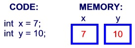
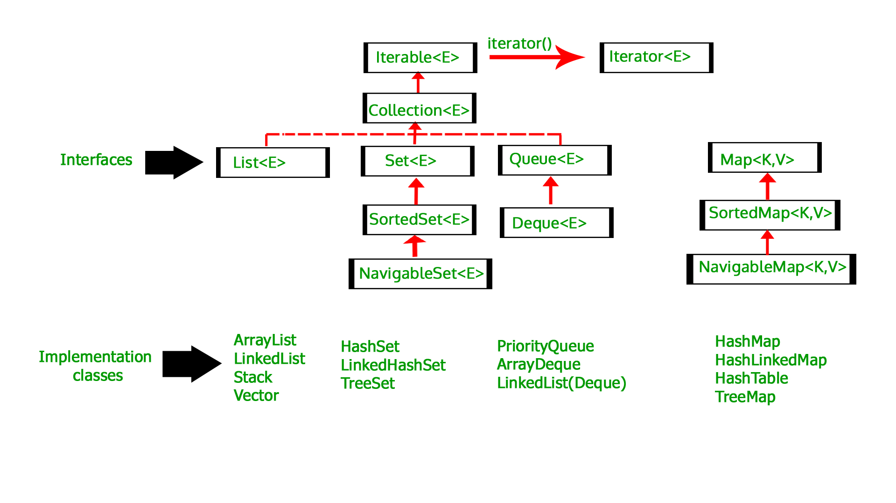
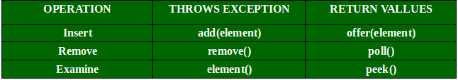

# 一、通用基础知识

## 1.1编程语言能力

### 1.1.1 基本数据类型

https://www.runoob.com/java/java-basic-datatypes.html

变量就是申请内存来存储值。也就是说，当创建变量的时候，需要在内存中申请空间。

内存管理系统根据变量的类型为变量分配存储空间，分配的空间只能用来储存该类型数据。



因此，通过定义不同类型的变量，可以在内存中储存整数、小数或者字符。

Java 的两大数据类型:

- 内置数据类型
- 引用数据类型

#### 内置数据类型

Java语言提供了八种基本类型。六种数字类型（四个整数型，两个浮点型），一种字符类型，还有一种布尔型。

**byte：**

- byte 数据类型是8位、有符号的，以二进制补码表示的整数；
- 最小值是 **-128（-2^7）**；
- 最大值是 **127（2^7-1）**；
- 默认值是 **0**；
- byte 类型用在大型数组中节约空间，主要代替整数，因为 byte 变量占用的空间只有 int 类型的四分之一；
- 例子：byte a = 100，byte b = -50。

**short：**

- short 数据类型是 16 位、有符号的以二进制补码表示的整数
- 最小值是 **-32768（-2^15）**；
- 最大值是 **32767（2^15 - 1）**；
- Short 数据类型也可以像 byte 那样节省空间。一个short变量是int型变量所占空间的二分之一；
- 默认值是 **0**；
- 例子：short s = 1000，short r = -20000。

**int：**

- int 数据类型是32位、有符号的以二进制补码表示的整数；
- 最小值是 **-2,147,483,648（-2^31）**；
- 最大值是 **2,147,483,647（2^31 - 1）**；
- 一般地整型变量默认为 int 类型；
- 默认值是 **0** ；
- 例子：int a = 100000, int b = -200000。

**long：**

- long 数据类型是 64 位、有符号的以二进制补码表示的整数；
- 最小值是 **-9,223,372,036,854,775,808（-2^63）**；
- 最大值是 **9,223,372,036,854,775,807（2^63 -1）**；
- 这种类型主要使用在需要比较大整数的系统上；
- 默认值是 **0L**；
- 例子： long a = 100000L，Long b = -200000L。
  "L"理论上不分大小写，但是若写成"l"容易与数字"1"混淆，不容易分辩。所以最好大写。

**float：**

- float 数据类型是单精度、32位、符合IEEE 754标准的浮点数；
- float 在储存大型浮点数组的时候可节省内存空间；
- 默认值是 **0.0f**；
- 浮点数不能用来表示精确的值，如货币；
- 例子：float f1 = 234.5f。

**double：**

- double 数据类型是双精度、64 位、符合IEEE 754标准的浮点数；
- 浮点数的默认类型为double类型；
- double类型同样不能表示精确的值，如货币；
- 默认值是 **0.0d**；
- 例子：double d1 = 123.4。

**boolean：**

- boolean数据类型表示一位的信息；
- 只有两个取值：true 和 false；
- 这种类型只作为一种标志来记录 true/false 情况；
- 默认值是 **false**；
- 例子：boolean one = true。

**char：**

- char类型是一个单一的 16 位 Unicode 字符；
- 最小值是 **\u0000**（即为0）；
- 最大值是 **\uffff**（即为65,535）；
- char 数据类型可以储存任何字符；
- 例子：char letter = 'A';。

##### 实例

对于数值类型的基本类型的取值范围，我们无需强制去记忆，因为它们的值都已经以常量的形式定义在对应的包装类中了。请看下面的例子：

```java
public class PrimitiveTypeTest {  
    public static void main(String[] args) {  
        // byte  
        System.out.println("基本类型：byte 二进制位数：" + Byte.SIZE);  
        System.out.println("包装类：java.lang.Byte");  
        System.out.println("最小值：Byte.MIN_VALUE=" + Byte.MIN_VALUE);  
        System.out.println("最大值：Byte.MAX_VALUE=" + Byte.MAX_VALUE);  
        System.out.println();  
  
        // short  
        System.out.println("基本类型：short 二进制位数：" + Short.SIZE);  
        System.out.println("包装类：java.lang.Short");  
        System.out.println("最小值：Short.MIN_VALUE=" + Short.MIN_VALUE);  
        System.out.println("最大值：Short.MAX_VALUE=" + Short.MAX_VALUE);  
        System.out.println();  
  
        // int  
        System.out.println("基本类型：int 二进制位数：" + Integer.SIZE);  
        System.out.println("包装类：java.lang.Integer");  
        System.out.println("最小值：Integer.MIN_VALUE=" + Integer.MIN_VALUE);  
        System.out.println("最大值：Integer.MAX_VALUE=" + Integer.MAX_VALUE);  
        System.out.println();  
  
        // long  
        System.out.println("基本类型：long 二进制位数：" + Long.SIZE);  
        System.out.println("包装类：java.lang.Long");  
        System.out.println("最小值：Long.MIN_VALUE=" + Long.MIN_VALUE);  
        System.out.println("最大值：Long.MAX_VALUE=" + Long.MAX_VALUE);  
        System.out.println();  
  
        // float  
        System.out.println("基本类型：float 二进制位数：" + Float.SIZE);  
        System.out.println("包装类：java.lang.Float");  
        System.out.println("最小值：Float.MIN_VALUE=" + Float.MIN_VALUE);  
        System.out.println("最大值：Float.MAX_VALUE=" + Float.MAX_VALUE);  
        System.out.println();  
  
        // double  
        System.out.println("基本类型：double 二进制位数：" + Double.SIZE);  
        System.out.println("包装类：java.lang.Double");  
        System.out.println("最小值：Double.MIN_VALUE=" + Double.MIN_VALUE);  
        System.out.println("最大值：Double.MAX_VALUE=" + Double.MAX_VALUE);  
        System.out.println();  
  
        // char  
        System.out.println("基本类型：char 二进制位数：" + Character.SIZE);  
        System.out.println("包装类：java.lang.Character");  
        // 以数值形式而不是字符形式将Character.MIN_VALUE输出到控制台  
        System.out.println("最小值：Character.MIN_VALUE="  
                + (int) Character.MIN_VALUE);  
        // 以数值形式而不是字符形式将Character.MAX_VALUE输出到控制台  
        System.out.println("最大值：Character.MAX_VALUE="  
                + (int) Character.MAX_VALUE);  
    }  
}
```

编译以上代码输出结果如下所示：

```
基本类型：byte 二进制位数：8
包装类：java.lang.Byte
最小值：Byte.MIN_VALUE=-128
最大值：Byte.MAX_VALUE=127

基本类型：short 二进制位数：16
包装类：java.lang.Short
最小值：Short.MIN_VALUE=-32768
最大值：Short.MAX_VALUE=32767

基本类型：int 二进制位数：32
包装类：java.lang.Integer
最小值：Integer.MIN_VALUE=-2147483648
最大值：Integer.MAX_VALUE=2147483647

基本类型：long 二进制位数：64
包装类：java.lang.Long
最小值：Long.MIN_VALUE=-9223372036854775808
最大值：Long.MAX_VALUE=9223372036854775807

基本类型：float 二进制位数：32
包装类：java.lang.Float
最小值：Float.MIN_VALUE=1.4E-45
最大值：Float.MAX_VALUE=3.4028235E38

基本类型：double 二进制位数：64
包装类：java.lang.Double
最小值：Double.MIN_VALUE=4.9E-324
最大值：Double.MAX_VALUE=1.7976931348623157E308

基本类型：char 二进制位数：16
包装类：java.lang.Character
最小值：Character.MIN_VALUE=0
最大值：Character.MAX_VALUE=65535
```

Float和Double的最小值和最大值都是以科学记数法的形式输出的，结尾的"E+数字"表示E之前的数字要乘以10的多少次方。比如3.14E3就是3.14 × 103 =3140，3.14E-3 就是 3.14 x 10-3 =0.00314。

实际上，JAVA中还存在另外一种基本类型 void，它也有对应的包装类 java.lang.Void，不过我们无法直接对它们进行操作。

##### 类型默认值

下表列出了 Java 各个类型的默认值：

| **数据类型**           | **默认值** |
| :--------------------- | :--------- |
| byte                   | 0          |
| short                  | 0          |
| int                    | 0          |
| long                   | 0L         |
| float                  | 0.0f       |
| double                 | 0.0d       |
| char                   | 'u0000'    |
| String (or any object) | null       |
| boolean                | false      |

实例：

```java
public class Test {
    static boolean bool;
    static byte by;
    static char ch;
    static double d;
    static float f;
    static int i;
    static long l;
    static short sh;
    static String str;
 
    public static void main(String[] args) {
        System.out.println("Bool :" + bool);
        System.out.println("Byte :" + by);
        System.out.println("Character:" + ch);
        System.out.println("Double :" + d);
        System.out.println("Float :" + f);
        System.out.println("Integer :" + i);
        System.out.println("Long :" + l);
        System.out.println("Short :" + sh);
        System.out.println("String :" + str);
    }
}
```

输出：

```
Bool     :false
Byte     :0
Character:
Double   :0.0
Float    :0.0
Integer  :0
Long     :0
Short    :0
String   :null
```

#### 引用类型

- 在Java中，引用类型的变量非常类似于C/C++的指针。引用类型指向一个对象，指向对象的变量是引用变量。这些变量在声明时被指定为一个特定的类型，比如 Employee、Puppy 等。变量一旦声明后，类型就不能被改变了。
- 对象、数组都是引用数据类型。
- 所有引用类型的默认值都是null。
- 一个引用变量可以用来引用任何与之兼容的类型。
- 例子：Site site = new Site("Runoob")。

#### Java 常量

常量在程序运行时是不能被修改的。

在 Java 中使用 final 关键字来修饰常量，声明方式和变量类似：

```
final double PI = 3.1415927;
```

虽然常量名也可以用小写，但为了便于识别，通常使用大写字母表示常量。

字面量可以赋给任何内置类型的变量。例如：

```
byte a = 68;
char a = 'A'
```

byte、int、long、和short都可以用十进制、16进制以及8进制的方式来表示。

当使用常量的时候，前缀 **0** 表示 8 进制，而前缀 **0x** 代表 16 进制, 例如：

```
int decimal = 100;
int octal = 0144;
int hexa =  0x64;
```

和其他语言一样，Java的字符串常量也是包含在两个引号之间的字符序列。下面是字符串型字面量的例子：

```
"Hello World"
"two\nlines"
"\"This is in quotes\""
```

字符串常量和字符常量都可以包含任何Unicode字符。例如：

```
char a = '\u0001';
String a = "\u0001";
```

Java语言支持一些特殊的转义字符序列。

| 符号   | 字符含义                 |
| :----- | :----------------------- |
| \n     | 换行 (0x0a)              |
| \r     | 回车 (0x0d)              |
| \f     | 换页符(0x0c)             |
| \b     | 退格 (0x08)              |
| \0     | 空字符 (0x20)            |
| \s     | 字符串                   |
| \t     | 制表符                   |
| \"     | 双引号                   |
| \'     | 单引号                   |
| \\     | 反斜杠                   |
| \ddd   | 八进制字符 (ddd)         |
| \uxxxx | 16进制Unicode字符 (xxxx) |

#### 自动类型转换

**整型、实型（常量）、字符型数据可以混合运算。运算中，不同类型的数据先转化为同一类型，然后进行运算。**

转换从低级到高级。

```
低  ------------------------------------>  高

byte,short,char—> int —> long—> float —> double 
```

数据类型转换必须满足如下规则：

- 不能对boolean类型进行类型转换。

- 不能把对象类型转换成不相关类的对象。

- 在把容量大的类型转换为容量小的类型时必须使用强制类型转换。

- 转换过程中可能导致溢出或损失精度，例如：

  ```
  int i =128;   
  byte b = (byte)i;
  ```

  因为 byte 类型是 8 位，最大值为127，所以当 int 强制转换为 byte 类型时，值 128 时候就会导致溢出。

- 浮点数到整数的转换是通过舍弃小数得到，而不是四舍五入，例如：

  ```
  (int)23.7 == 23;        
  (int)-45.89f == -45
  ```

##### 自动类型转换

必须满足转换前的数据类型的位数要低于转换后的数据类型，例如: short数据类型的位数为16位，就可以自动转换位数为32的int类型，同样float数据类型的位数为32，可以自动转换为64位的double类型。

##### 实例

```java
public class ZiDongLeiZhuan{
    public static void main(String[] args){
        char c1='a'; // 定义一个char类型
        int i1 = c1; // char自动类型转换为int
        System.out.println("char自动类型转换为int后的值等于"+i1);
        char c2 = 'A'; // 定义一个char类型
        int i2 = c2+1; // char 类型和 int 类型计算
        System.out.println("char类型和int计算后的值等于"+i2);
    }
}
```

运行结果为:

```
char自动类型转换为int后的值等于97
char类型和int计算后的值等于66
```

**解析：**c1 的值为字符 **a** ,查 ASCII 码表可知对应的 int 类型值为 97， A 对应值为 65，所以 **i2=65+1=66**。

#### 强制类型转换

- 条件是转换的数据类型必须是兼容的。
- 格式：(type)value type是要强制类型转换后的数据类型 实例：

##### 实例

```java
public class QiangZhiZhuanHuan{
    public static void main(String[] args){
        int i1 = 123;
        byte b = (byte)i1;//强制类型转换为byte
        System.out.println("int强制类型转换为byte后的值等于"+b);
    }
}
```

运行结果：

```
int强制类型转换为byte后的值等于123
```

##### 隐含强制类型转换

- 整数的默认类型是 int。
- 浮点型不存在这种情况，因为在定义 float 类型时必须在数字后面跟上 F 或者 f。

#### 各种数据溢出后的处理方式

如byte范围为-128-127之间，那么如果赋值语句byte b = (byte)129的结果是多少？

一、强制转换（主要涉及各个类型占几个字节，这里我只简单说一下byte型占一个字节，也就是8位，int型4个字节，32位）；二、在计算机系统中，数值一律用补码来表示（存储）

正数：补码=反码=原码（当然以二进制形式表达）

129 int类型（4个字节）二进制： 00000000 00000000 00000000 10000001

强制转换byte型后，只有一个字节即 10000001（注意这里从二进制角度看，第一位是符号位，即求负数的补码接下来）

只要求出上面原码对应的补码就行了，然后再转换对应的int型数值（因为题干所给的答案都是比较int型）

10000001（原码） 对应的反码为1111 1110 

又补码等于反码+1

即1111 1111 该二进制转换int型刚好是-127（1+2+4+8+16+32+64）

正数原码，反码，补码相同

负数反码除了符号位不变，其他位取反，补码=反码+1；

正向溢出：最小值+余数-1

负向溢出：最大值-余数+1

byte存储范围[-128, 127]

129大于最大值则为正向溢出，结果为 -128 + (129%127) -1 = -127

若为 -129， 则为负向溢出，结果应为 127 - (-129%-128) + 1 = 127

计算机中的加法运算

```
在计算机中，不存在减法运算，只有加法
 
比如： 76-32 的运算，在计算机中就是76+(-32)
 
在二进制的表示中，若为负数，则最高位为1
 
举个例子： char类型的数据，1个字节 ( 1个字节 = 8位的二进制 )
 
76  (正数的原码、反码、补码都是一样的)
原码：0100 1100
反码：0100 1100
补码：0100 1100
 
-32 
原码：1010 0000     负数的原码：最高位(符号位)为1
反码：1101 1111     反码：除了符号位其他取反
补码：1110 0000     补码：反码+1
 
运算时，补码相加
 
  0100 1100
  1110 0000
---------------- +
1 0010 1100
运算完毕，若最高位有进位，则舍弃最高位。
结果： 0010 1100 
 
该结果为补码相加的结果，然后转为反码，再转为原码，再转十进制 （当然正数的原码、反码、补码都是一样）
所以：
补码： 0010 1100 
反码： 0010 1100
原码： 0010 1100
转十进制为 44
 
所以最后计算结果为： 44
 
举个例子：
在java中，int类型的数据在内存中占32个字节。
 
正整数 6 用二进制表示：
0000-0000 0000-0000 0000-0000 0000-0110 
 
负整数 -6 用二进制表示：
 
1. 对应的正数二进制取反
        0000-0000 0000-0000 0000-0000 0000-0110
 
        1111-1111 1111-1111 1111-1111 1111-1001   (取反)
    +   0000-0000 0000-0000 0000-0000 0000-0001   (加1 )
----------------------------------------------------------
        1111-1111 1111-1111 1111-1111 1111-1010   (等于 -6 )
 
当然还有下面这种情况和其他情况：
    因为同一个数据，在不同的位数的系统和不同的计算机语言占用的内存不同。(个人见解，可能有误)
 
1111-1111 1111-1111 1111-1111 1111-1111 1111-1111 1111-1111 1111-1111 1111-1010
————————————————
版权声明：本文为CSDN博主「四大天王之一」的原创文章，遵循 CC 4.0 BY-SA 版权协议，转载请附上原文出处链接及本声明。
原文链接：https://blog.csdn.net/chuxin_mm/article/details/84871774
```


各种包装类创建过程，会不会创建新的对象

#### Java中是否存在大小端的问题

### 1.1.2 switch语句

#### 基本语法

```javas
switch(expression){
    case value :
       //语句
       break; //可选
    case value :
       //语句
       break; //可选
    //你可以有任意数量的case语句
    default : //可选
       //语句
}
```

#### switch case 语句规则

- switch 语句中的变量类型可以是： byte、short、int 或者 char。从 Java SE 7 开始，switch 支持字符串 String 类型，自动装箱类型Character、Byte、Short、Integer ，以及枚举类型；同时 case 标签必须为字符串常量或字面量。
- switch 语句可以拥有多个 case 语句。每个 case 后面跟一个要比较的值和冒号。
- case 语句中的值的数据类型必须与变量的数据类型相同，而且只能是常量或者字面常量。
- 当变量的值与 case 语句的值相等时，那么 case 语句之后的语句开始执行，直到 break 语句出现才会跳出 switch 语句。
- 当遇到 break 语句时，switch 语句终止。程序跳转到 switch 语句后面的语句执行。case 语句不必须要包含 break 语句。如果没有 break 语句出现，程序会继续执行下一条 case 语句，直到出现 break 语句。
- switch 语句可以包含一个 default 分支，该分支一般是 switch 语句的最后一个分支（可以在任何位置，但建议在最后一个）。default 在没有 case 语句的值和变量值相等的时候执行。default 分支不需要 break 语句。

#### 常见的case

**switch case 执行时，一定会先进行匹配，匹配成功返回当前 case 的值，再根据是否有 break，判断是否继续输出，或是跳出判断。**

```java
public class Test {
   public static void main(String args[]){
      //char grade = args[0].charAt(0);
      char grade = 'C';
 
      switch(grade)
      {
         case 'A' :
            System.out.println("优秀"); 
            break;
         case 'B' :
         case 'C' :
            System.out.println("良好");
            break;
         case 'D' :
            System.out.println("及格");
            break;
         case 'F' :
            System.out.println("你需要再努力努力");
            break;
         default :
            System.out.println("未知等级");
      }
      System.out.println("你的等级是 " + grade);
   }
}
```

以上代码编译运行结果如下：

```
良好
你的等级是 C
```

如果 case 语句块中没有 break 语句时，JVM 并不会顺序输出每一个 case 对应的返回值，而是继续匹配，匹配不成功则返回默认 case。

```java
public class Test {
   public static void main(String args[]){
      int i = 5;
      switch(i){
         case 0:
            System.out.println("0");
         case 1:
            System.out.println("1");
         case 2:
            System.out.println("2");
         default:
            System.out.println("default");
      }
   }
}
```

以上代码编译运行结果如下：

```
default
```

如果 case 语句块中没有 break 语句时，匹配成功后，从当前 case 开始，后续所有 case 的值都会输出。	

```java
public class Test {
   public static void main(String args[]){
      int i = 1;
      switch(i){
         case 0:
            System.out.println("0");
         case 1:
            System.out.println("1");
         case 2:
            System.out.println("2");
         default:
            System.out.println("default");
      }
   }
}
```

以上代码编译运行结果如下：

```
1
2
3
```

#### switch case 匹配原理

##### String 匹配原理

##### Enum匹配原理

##### 自动装箱类型匹配原理

##### default 不在最后的匹配过程

从java字节码进行分析

### 1.1.3 index for 与 for each

介绍循环，顺版将几种循环进行总结一下

顺序结构的程序语句只能被执行一次。如果您想要同样的操作执行多次,，就需要使用循环结构。

Java中有三种主要的循环结构：

- **while** 循环
- **do…while** 循环
- **for** 循环

在JDK5中引入了一种主要用于数组的增强型for循环。

#### while 循环

while是最基本的循环，它的结构为：

```java
while (布尔表达式) {
	...
}
// 注意while的循环条件为boolean表达式，切忌使用整型数据或者引用类型之类的非boolean变量或者表达式
```

只要布尔表达式为 true，循环就会一直执行下去。

##### 实例

```java
public class Test {
   public static void main(String args[]) {
      int x = 10;
      while( x < 20 ) {
         System.out.print("value of x : " + x );
         x++;
         System.out.print("\n");
      }
   }
}
```

以上实例编译运行结果如下：

```
value of x : 10
value of x : 11
value of x : 12
value of x : 13
value of x : 14
value of x : 15
value of x : 16
value of x : 17
value of x : 18
value of x : 19
```

#### do…while 循环

对于 while 语句而言，如果不满足条件，则不能进入循环。但有时候我们需要即使不满足条件，也至少执行一次。

do…while 循环和 while 循环相似，不同的是，do…while 循环至少会执行一次。

```java
do {
     //代码语句
} while (布尔表达式);
```

**注意：**布尔表达式在循环体的后面，所以语句块在检测布尔表达式之前已经执行了。 如果布尔表达式的值为 true，则语句块一直执行，直到布尔表达式的值为 false。

##### 实例

```java
public class Test {
   public static void main(String args[]){
      int x = 10;
 
      do{
         System.out.print("value of x : " + x );
         x++;
         System.out.print("\n");
      }while( x < 20 );
   }
}
```

以上实例编译运行结果如下：

```
value of x : 10
value of x : 11
value of x : 12
value of x : 13
value of x : 14
value of x : 15
value of x : 16
value of x : 17
value of x : 18
value of x : 19
```

#### for循环

虽然所有循环结构都可以用 while 或者 do...while表示，但 Java 提供了另一种语句 —— for 循环，使一些循环结构变得更加简单。

for循环执行的次数是在执行前就确定的。语法格式如下：

index for即传统的通过下标索引访问的for循环

```java
for(初始化; 布尔表达式; 更新) {
    //代码语句
}
// 如下所示
for (int i = 0; i < ...; i++) {
	...
}
```

关于 for 循环有以下几点说明：

- 最先执行初始化步骤。可以声明一种类型，但可初始化一个或多个循环控制变量，也可以是空语句。
- 然后，检测布尔表达式的值。如果为 true，循环体被执行。如果为false，循环终止，开始执行循环体后面的语句。
- 执行一次循环后，更新循环控制变量。
- 再次检测布尔表达式。循环执行上面的过程。

##### 实例

```java
public class Test {
   public static void main(String args[]) {
 
      for(int x = 10; x < 20; x = x+1) {
         System.out.print("value of x : " + x );
         System.out.print("\n");
      }
   }
}
```

以上实例编译运行结果如下：

```
value of x : 10
value of x : 11
value of x : 12
value of x : 13
value of x : 14
value of x : 15
value of x : 16
value of x : 17
value of x : 18
value of x : 19
```

#### Java 增强 for 循环

Java5 引入了一种主要用于数组的增强型 for 循环。

Java 增强 for 循环语法格式如下:

```java
for(声明语句 : 表达式)
{
   //代码句子
}
for(T val ： vals) {
	...
}
// 其中，T为引用类型
```

**声明语句：**声明新的局部变量，该变量的类型必须和数组元素的类型匹配。其作用域限定在循环语句块，其值与此时数组元素的值相等。

**表达式：**表达式是要访问的数组名，或者是返回值为数组的方法。

##### 实例

```java
public class Test {
   public static void main(String args[]){
      int [] numbers = {10, 20, 30, 40, 50};
 
      for(int x : numbers ){
         System.out.print( x );
         System.out.print(",");
      }
      System.out.print("\n");
      String [] names ={"James", "Larry", "Tom", "Lacy"};
      for( String name : names ) {
         System.out.print( name );
         System.out.print(",");
      }
   }
}
```

以上实例编译运行结果如下：

```
10,20,30,40,50,
James,Larry,Tom,Lacy,
```

##### <font color="red">for...each和List结合使用可能会出现的问题</font>

最常见的莫过于在使用for each遍历list的同时又对其进行了remove，add之类的操作，这种情况下往往会出现RuntimeException->


解决办法：

使用迭代器进行遍历和remove操作，如下所示

### 1.1.4 Labeled loop

#### break 关键字

break 主要用在循环语句或者 switch 语句中，用来跳出整个语句块。

break 跳出最里层的循环，并且继续执行该循环下面的语句。

##### 语法

break 的用法很简单，就是循环结构中的一条语句：

```java
break;
```

##### 实例

```java
public class Test {
   public static void main(String args[]) {
      int [] numbers = {10, 20, 30, 40, 50};
 
      for(int x : numbers ) {
         // x 等于 30 时跳出循环
         if( x == 30 ) {
            break;
         }
         System.out.print( x );
         System.out.print("\n");
      }
   }
}
```

以上实例编译运行结果如下：

```
10
20
```

#### continue 关键字

continue 适用于任何循环控制结构中。作用是让程序立刻跳转到下一次循环的迭代。

在 for 循环中，continue 语句使程序立即跳转到更新语句。

在 while 或者 do…while 循环中，程序立即跳转到布尔表达式的判断语句。

##### 语法

continue 就是循环体中一条简单的语句：

```
continue;
```

##### 实例

```java
public class Test {
   public static void main(String args[]) {
      int [] numbers = {10, 20, 30, 40, 50};
 
      for(int x : numbers ) {
         if( x == 30 ) {
        continue;
         }
         System.out.print( x );
         System.out.print("\n");
      }
   }
}
```

以上实例编译运行结果如下：

```
10
20
40
50
```

#### label

label后面跟着有冒号的标识符，如

```java
label1:
```

标签起作用的地方刚好是迭代语句之前。“刚好之前”意味着在标签和迭代语句之间置入任何语句都不好。而在迭代之前设置标签的唯一理由是：我么希在嵌套另一个迭代或者开关。这是由于break和continue关键字通常只中断当前循环，但若随标签一起使用，它们就会中断循环，直到标签所在的地方：

```java
label1:
outer-iteration {
	inner-iteration {
	// ...
	break; // (1)中断内部迭代，回到外部迭代
	// ...
	continue; // (2)使代码执行点移到内部迭代的开始处
	// ...
	continue label1; // (3)同时中断内部迭代和外部迭代，直接转到label1处；随后继续从外部迭代开始
	// ...
	break label1; // (4) 中断所有迭代，回到label1处，但是并不重新进入迭代；即完全终止了两个迭代
	}
}
```

下面看Think in java中的一个示例：

https://github.com/BruceEckel/OnJava8-Examples/blob/master/control/LabeledFor.java

```java
public class LabeledFor {
    public static void main(String[] args) {
        int i = 0;
        outer: // Can't have statements here
        for(; true ;) { // infinite loop
            inner: // Can't have statements here
            for(; i < 10; i++) {
                System.out.println("i = " + i);
                if(i == 2) {
                    System.out.println("continue");
                    continue;
                }
                if(i == 3) {
                    System.out.println("break");
                    i++; // Otherwise i never
                    // gets incremented.
                    break;
                }
                if(i == 7) {
                    System.out.println("continue outer");
                    i++; // Otherwise i never
                    // gets incremented.
                    continue outer;
                }
                if(i == 8) {
                    System.out.println("break outer");
                    break outer;
                }
                for(int k = 0; k < 5; k++) {
                    if(k == 3) {
                        System.out.println("continue inner");
                        continue inner;
                    }
                }
            }
        }
        // Can't break or continue to labels here
    }
}
```

输出：

```
i = 0
continue inner
i = 1
continue inner
i = 2
continue
i = 3
break
i = 4
continue inner
i = 5
continue inner
i = 6
continue inner
i = 7
continue outer
i = 8
break outer
```

https://github.com/BruceEckel/OnJava8-Examples/blob/master/control/LabeledWhile.java

```java
public class LabeledWhile {
  public static void main(String[] args) {
    int i = 0;
    outer:
    while(true) {
      System.out.println("Outer while loop");
      while(true) {
        i++;
        System.out.println("i = " + i);
        if(i == 1) {
          System.out.println("continue");
          continue;
        }
        if(i == 3) {
          System.out.println("continue outer");
          continue outer;
        }
        if(i == 5) {
          System.out.println("break");
          break;
        }
        if(i == 7) {
          System.out.println("break outer");
          break outer;
        }
      }
    }
  }
}
```

输出结果

```
Outer while loop
i = 1
continue
i = 2
i = 3
continue outer
Outer while loop
i = 4
i = 5
break
Outer while loop
i = 6
i = 7
break outer
```

想必，通过上面的介绍，能够很容易搞懂输出结果。

label for的规则同样也适用于while：

1）一般的continue会退回最内层循环的开头（顶部），并继续执行

2）带标签的continue会达到标签位置，并重新进入紧接着那个标签后面的循环

3）一般的break会中断跳出当前循环

4）带标签的break会中断并跳出标签所指的循环

要记住的重点是：Java里需要使用标签的唯一理由就是因为有循环嵌套存在，而且想要从多层嵌套中break或continue。

### 1.1.5 异常体系

##### 什么是异常？

异常是指在程序的执行期间发生的意外事件，该事件会破坏程序指令的正常流程。

##### Error vs Exception

> Error: Error表示严重的问题，即正常应用不应该去捕获
>
> Exception: Exception表示正常的应用可以尝试去捕获。

##### Exception 层级

所有Exception和Error类型都是Throwable类的子类，Throwable类是层次结构的基类。其中一个分支以Exception为首。 此类用于用户程序应捕获的异常条件。 NullPointerException是此类异常其中的一个示例。Java运行时系统（JVM）使用另一个分支Error来指示与运行时环境本身（JRE）有关的错误。 StackOverflowError是此类错误的一个示例。


对于checked和unchecked exception的比较，可以看Java基础-常见异常

##### JVM怎样处理异常

**默认的异常处理**：无论何时，在一个方法的内部发生了异常，该方法会创建一个称为“异常对象”的对象，并将其交给JVM。异常对象包含异常的名称和描述，UI及发生异常的程序的当前状态。创建异常对象并交由JVM这一过程称为抛出异常。可能存在异常发生那一刻之前的方法调用列表，这一有序的方法列表称为调用栈。现在，异常发生时刻将会经过一下过程：

* JVM搜索调用栈以查找可以处理该异常的代码块的方法。该代码块称为异常处理程序。
* JVM从发生异常的方法开始搜索，然后以与调用顺序相反的顺序遍历调用栈。
* 如果找到合适的处理程序，则将发生的异常传递给它。合适的处理程序意味着抛出的异常对象类型与其可处理的异常对象类型匹配。
* 如果JVM搜索了该调用栈上的所有方法后并没有找到合适的处理异常处理程序，则JVM会将异常对象转交给默认的异常处理程序，该默认的异常处理程序也是JVM的一部分。默认的异常处理程序以以下格式打印异常信息，并终止程序运行。

```
Exception in thread "xxx" Name of Exception : Description
... ...... ..  // Call Stack
```

下面这幅图可以帮助理解这一过程：


示例：

```java
// Java program to demonstrate how exception is thrown. 
class ThrowsExecp{ 
      
    public static void main(String args[]){ 
          
        String str = null; 
        System.out.println(str.length()); 
          
    } 
} 
```

输出：

```
Exception in thread "main" java.lang.NullPointerException
    at ThrowsExecp.main(File.java:8)
```

让我们来看一个示例展示JVM是如何在调用栈上查找合适的异常处理程序的。

```java
// Java program to demonstrate exception is thrown 
// how the runTime system searches th call stack 
// to find appropriate exception handler. 
class ExceptionThrown 
{ 
    // It throws the Exception(ArithmeticException). 
    // Appropriate Exception handler is not found within this method. 
    static int divideByZero(int a, int b){ 
          
        // this statement will cause ArithmeticException(/ by zero) 
        int i = a/b;  
          
        return i; 
    } 
      
    // The runTime System searches the appropriate Exception handler 
    // in this method also but couldn't have found. So looking forward 
    // on the call stack. 
    static int computeDivision(int a, int b) { 
          
        int res =0; 
          
        try
        { 
          res = divideByZero(a,b); 
        } 
        // doesn't matches with ArithmeticException 
        catch(NumberFormatException ex) 
        { 
           System.out.println("NumberFormatException is occured");  
        } 
        return res; 
    } 
      
    // In this method found appropriate Exception handler. 
    // i.e. matching catch block. 
    public static void main(String args[]){ 
          
        int a = 1; 
        int b = 0; 
          
        try
        { 
            int i = computeDivision(a,b); 
          
        } 
          
        // matching ArithmeticException 
        catch(ArithmeticException ex) 
        { 
            // getMessage will print description of exception(here / by zero) 
            System.out.println(ex.getMessage()); 
        } 
    } 
} 
```

输出：

```
/ by zero.
```

##### 编程人员怎样处理异常

**自定义异常处理**：java的异常处理通过5个关键词进行管理：try,catch,throw,throws以及finally。简单来讲，下面是它们的工作方式：

* 您认为可能会发生异常的程序语句包含在try块中，如果try块发生异常，则将引发该异常；

* 您的代码可以捕获该异常（使用catch块）并处理以某种合适的方法处理它。

* 系统产生的异常由JVM自动抛出。想要手动抛出一个异常，使用关键字throw。一个方法中抛出的任何异常都必须由throws语句发起。

* 在try语句之后必须要执行的任何代码都放在finally块中。

详细的分析请看：Java基础-常见异常-try,catch,finally控制流

##### 需要try-catch语句（自定义异常处理）

看下面这段代码：

```java
// java program to demonstrate  
// need of try-catch clause 
  
class GFG { 
    public static void main (String[] args) { 
          
        // array of size 4. 
        int[] arr = new int[4]; 
       
        // this statement causes an exception 
        int i = arr[4]; 
          
        // the following statement will never execute 
        System.out.println("Hi, I want to execute"); 
    } 
} 
```

输出：

```
Exception in thread "main" java.lang.ArrayIndexOutOfBoundsException: 4
    at GFG.main(GFG.java:9)
```

**解释：**上面的示例中，数组的大小正如实例中所给的那样。你可访问的元素下标只能是0-3.但是你试图去访问下标为4的元素，这就是引发异常的原因。在这种情况下，JVM会终止程序的运行。System.out.println("Hi, I want to execute")将永远不会执行。如果想要执行它，我们必须使用try-catch处理异常。因此，为了继续让程序正常进行，我们需要try-catch语句。

##### 怎样使用try-catch语句

```java
try {
// block of code to monitor for errors
// the code you think can raise an exception
}
catch (ExceptionType1 exOb) {
// exception handler for ExceptionType1
}
catch (ExceptionType2 exOb) {
// exception handler for ExceptionType2
}
// optional
finally {
// block of code to be executed after try block ends
}
```

**需要记住的点**

* 一个方法中，可能存在多个可能引发异常的语句因此将所有这些可能发生异常的语句放到自己的try块中，并未每个语句自己的catch块中提供单独的异常处理程序。
* 如果try块中发生异常，则该异常由与该异常关联的异常处理程序处理。要关联异常处理程序，我们需要在其后放置catch块。可以有福讴歌异常处理程序。每一个catch块都是一个异常处理程序，用于处理与其参数对应类型的异常。参数中指定的异常类型声明其可以处理的异常类型，并且其必须是Throwable的派生类。
* 对于每个try块，可以有0个或多个catch块，但只能有一个finally块。
* finally块是可选的。无论try块中是否发生异常，其总是会被执行。如果发生异常，它将在try和catch块之后执行。Java中的finally块通常用于放置重要的代码，例如清理工作：关闭文件或者关闭连接

**总结**


引用：

https://www.geeksforgeeks.org/exceptions-in-java/

https://docs.oracle.com/javase/tutorial/essential/exceptions/definition.html

更多异常相关知识可看Java基础篇-常见异常

### 1.1.6 集合体系

https://www.geeksforgeeks.org/collections-in-java-2/?ref=lbp（contributed by  **Dharmesh Singh**）

集合将一组单个对象表示为一个单个单元，Java提供的Collection框架定义了一系列类和接口，这些类和接口可以将一组对象表示成一个单元。

Collection(java.util.Colection)和Map(java.util.Map)接口是java集合的两个最顶层接口

##### **引入Collection框架的原因**

在Collection Framework出现之前（JDK1.2之前），java对象分组的标准方法是通过Array，Vectors或者Vectors，亦或者HashTables,这个集合没有公共的接口。访问这些数据结构是非常令编程人员苦恼的，因为每种都有各自不同访问该成员的方法（和语法）

```java
// Java program to show why collection framework was needed 
import java.io.*; 
import java.util.*; 
  
class Test 
{ 
    public static void main (String[] args) 
    { 
        // Creating instances of array, vector and hashtable 
        int arr[] = new int[] {1, 2, 3, 4}; 
        Vector<Integer> v = new Vector(); 
        Hashtable<Integer, String> h = new Hashtable(); 
        v.addElement(1); 
        v.addElement(2); 
        h.put(1,"geeks"); 
        h.put(2,"4geeks"); 
  
        // Array instance creation requires [], while Vector 
        // and hastable require () 
        // Vector element insertion requires addElement(), but 
        // hashtable element insertion requires put() 
  
        // Accessing first element of array, vector and hashtable 
        System.out.println(arr[0]); 
        System.out.println(v.elementAt(0)); 
        System.out.println(h.get(1)); 
  
        // Array elements are accessed using [], vector elements 
        // using elementAt() and hashtable elements using get() 
    } 
} 
```

Output:

```
1
1
geeks
```

正如我们看到的一样，这些集合（Array, Vector ,hashTable）都没有实现一个标准的数据访问接口。这对于编程人员编写能够在多种数据集合下都能工作良好的算法是非常困难的。另外一个缺点是‘Vector’的大多数方法都是final的，这就意味着我们不能通过extends继承Vector去实现类似Vector的集合。

Java开发者决定去实现一个公共的接口去解决上面的问题，因此Collection Framework框架出现在了JDK1.2中。

同时对遗留的Vector和Hashtables做出了修改，以让其能够兼容Collection Framework。

##### Collection Framework的优势

1. 不变的API：API具有一组基本的接口，像Collection，Set，List或Map.实现这些接口的所有类（ArrayList，LinkedList，Vector等）都有一些通用的方法集。
2.  减少编程的工作量：编程人员不必再考虑Collection的设计，并可以在程序中专注于Collection的最佳使用。
3. 提高程序的速度和质量：通过提供的有用的数据结构和高性能的算法实现，从而提高程序的性能表现。

##### Collection Framework层级结构图

```xml
             Collection                Map
         /     /    \      \            |
        /      /      \     \           |
     Set    List    Queue  Dequeue   SortedMap
     /
    /
 SortedSet 
            Core Interfaces in Collections

Note that this diagram only shows core interfaces.  
```

> **Collection** : 集合框架的最顶层接口，具有一些基本方法 ，如 add(), remove(), 
>              contains(), isEmpty(), addAll(), ... 等等.
>
> **Set** : 不允许重复（重复的判断后面在分析源码的时候再具体展开）.实现Set接口的例子有HashSet（基于Hashing）和TreeSet(平衡二叉树)。需要注意的是TreeSet实现SortedSet接口。        
>
> **List** : 可以包含重复的元素且是有序的（插入顺序）。实现List的有LinkedList（基于链表），ArrayList（基于动态数组）
>
> **Queue** : 典型的元素按照FIFO顺序排列，除了一些例外，如PriorityQueue。
>
> **Deque** : 元素可以在两端插入和删除。允许LIFO(后进先出)和FIFO（先进先出）。
>
> **Map** : 包含键-值对的形式。不允许重复。实现Map的有HashMap和TreeMap。   
>
> Set和Map接口之间的不同主要体现在Set只有keys,而Map，有key-value对





更多的集合分析可以查看<Java基础>-常见的集合

### 1.1.7 迭代器

Iterator存在于Collection框架中，用来遍历其中的元素。有三种类型的iterator

#### Enumertion

用于获取旧集合（Vector，Hashtable）元素的接口。枚举是JDK 1.0中出现的第一个迭代器，其余的在JDK 1.2中被包含进来，同时伴随着更多的功能。枚举还用于指定SequenceInputStream的输入流。我们可在任何vector对象上调用其elements()方法得到Enumerationd对象。

```java
// Here "v" is an Vector class object. e is of
// type Enumeration interface and refers to "v"
Enumeration e = v.elements();
```

Enumeration接口有两个方法

```java
public interface Enumeration<E> {
    /**
     * Tests if this enumeration contains more elements.
     *
     * @return  <code>true</code> if and only if this enumeration object
     *           contains at least one more element to provide;
     *          <code>false</code> otherwise.
     */
    boolean hasMoreElements();

    /**
     * Returns the next element of this enumeration if this enumeration
     * object has at least one more element to provide.
     *
     * @return     the next element of this enumeration.
     * @exception  NoSuchElementException  if no more elements exist.
     */
    E nextElement();
}
```

下面的代码片段展示如何使用Enumeration接口遍历vector的元素。

```java
// Java program to demonstrate Enumeration 
import java.util.Enumeration; 
import java.util.Vector; 
  
public class Test 
{ 
    public static void main(String[] args) 
    { 
        // Create a vector and print its contents 
        Vector v = new Vector(); 
        for (int i = 0; i < 10; i++) 
            v.addElement(i); 
        System.out.println(v); 
  
        // At beginning e(cursor) will point to 
        // index just before the first element in v 
        Enumeration e = v.elements(); 
  
        // Checking the next element availability 
        while (e.hasMoreElements()) 
        { 
            // moving cursor to next element 
            int i = (Integer)e.nextElement(); 
  
            System.out.print(i + " "); 
        } 
    } 
} 
```

输出：

```
[0, 1, 2, 3, 4, 5, 6, 7, 8, 9]
0 1 2 3 4 5 6 7 8 9 
```

Enumeration的限制：

* Enumeration只用于老的类（Vector， HashTable），因此其不具有通用性
* 使用Enumeration没有remove操作
* 只能进行正向迭代

#### Iterator

iterator是一个通用的迭代器，使用iterator可以操作任意的Collection对象。通过iterator我们可以进行读取和移除操作。在Enumeration的基础上增加了额外的移除元素的能力。

每当我们想要访问实现Collection框架接口的集合（Set,List, Queue, Deque, 以及实现了Map接口的集合）中的元素，我们必须使用Iterator。Iterator是collection框架中唯一可获得的cursor.

通过调用集合框架中的iterator()接口获取Iterator对象：

```java
// Here "c" is any Collection object. itr is of
// type Iterator interface and refers to "c"
Iterator itr = c.iterator();
```

Iterator的接口定义如下:

```java
public interface Iterator<E> {
    /**
     * Returns {@code true} if the iteration has more elements.
     * (In other words, returns {@code true} if {@link #next} would
     * return an element rather than throwing an exception.)
     *
     * @return {@code true} if the iteration has more elements
     */
    boolean hasNext();

    /**
     * Returns the next element in the iteration.
     *
     * @return the next element in the iteration
     * @throws NoSuchElementException if the iteration has no more elements
     */
    E next();

    /**
     * Removes from the underlying collection the last element returned
     * by this iterator (optional operation).  This method can be called
     * only once per call to {@link #next}.  The behavior of an iterator
     * is unspecified if the underlying collection is modified while the
     * iteration is in progress in any way other than by calling this
     * method.
     *
     * @implSpec
     * The default implementation throws an instance of
     * {@link UnsupportedOperationException} and performs no other action.
     *
     * @throws UnsupportedOperationException if the {@code remove}
     *         operation is not supported by this iterator
     *
     * @throws IllegalStateException if the {@code next} method has not
     *         yet been called, or the {@code remove} method has already
     *         been called after the last call to the {@code next}
     *         method
     */
    default void remove() {
        throw new UnsupportedOperationException("remove");
    }

    /**
     * Performs the given action for each remaining element until all elements
     * have been processed or the action throws an exception.  Actions are
     * performed in the order of iteration, if that order is specified.
     * Exceptions thrown by the action are relayed to the caller.
     *
     * @implSpec
     * <p>The default implementation behaves as if:
     * <pre>{@code
     *     while (hasNext())
     *         action.accept(next());
     * }</pre>
     *
     * @param action The action to be performed for each element
     * @throws NullPointerException if the specified action is null
     * @since 1.8
     */
    default void forEachRemaining(Consumer<? super E> action) {
        Objects.requireNonNull(action);
        while (hasNext())
            action.accept(next());
    }
}
```

remove() 方法会抛出两个种类的异常：

- *UnsupportedOperationException :* 该iterator不支持remove操作，通常是实现类中没有实现此方法。
- *IllegalStateException :* If the next method has not yet been called, or the remove method has already been called after the last call to the next method

```java
// Java program to demonstrate Iterator 
import java.util.ArrayList; 
import java.util.Iterator; 
  
public class Test 
{ 
    public static void main(String[] args) 
    { 
        ArrayList al = new ArrayList(); 
  
        for (int i = 0; i < 10; i++) 
            al.add(i); 
  
        System.out.println(al); 
  
        // at beginning itr(cursor) will point to 
        // index just before the first element in al 
        Iterator itr = al.iterator(); 
  
        // checking the next element availabilty 
        while (itr.hasNext()) 
        { 
            //  moving cursor to next element 
            int i = (Integer)itr.next(); 
  
            // getting even elements one by one 
            System.out.print(i + " "); 
  
            // Removing odd elements 
            if (i % 2 != 0) 
               itr.remove();  
        } 
        System.out.println();  
        System.out.println(al); 
    } 
} 
```

输出：

```
[0, 1, 2, 3, 4, 5, 6, 7, 8, 9]
0 1 2 3 4 5 6 7 8 9 
[0, 2, 4, 6, 8]
```

Iterator的限制：

* 只能正向迭代
* 不支持通过iterator替换和增加元素

#### ListIterator

只适用于实现了List接口的集合，如arraylist， linkedlist等。其可以进行双向迭代。

ListIterator必须使用在当我们想要枚举list元素的时候。其相比iterator有着更多的功能。

通过调用List接口中的listIterator() 方法获取ListIterator对象。

```java
// Here "l" is any List object, ltr is of type
// ListIterator interface and refers to "l"
ListIterator ltr = l.listIterator();
```

ListIterator继承自Iterator接口。所有Iterator接口中的三个方法同样适用于Listiterator；除此之外其还有额外的6个方法。

```java
// Forward direction

// Returns true if the iteration has more elements
public boolean hasNext();

// same as next() method of Iterator
public Object next();

// Returns the next element index 
// or list size if the list iterator
// is at the end of the list
public int nextIndex();

// Backward direction

// Returns true if the iteration has more elements
// while traversing backward
public boolean hasPrevious();

// Returns the previous element in the iteration
// and can throws NoSuchElementException
// if no more element present
public Object previous();

// Returns the previous element index 
//  or -1 if the list iterator is at the 
// beginning of the list
public int previousIndex();

// Other Methods
 
// same as remove() method of Iterator
public void remove();

// Replaces the last element returned by 
// next() or previous() with the specified element 
public void set(Object obj);

// Inserts the specified element into the list at
// position before the element that would be returned 
// by next(),
public void add(Object obj);
```

可以清晰的看到从Iterator继承过来的三个方法和Iterator做着同样的事情。hasPrevious() 方法，pervious操作和hasNext()以及next()有着类似的功能。

set()方法可以抛出四个异常：

- *UnsupportedOperationException* – if the set operation is not supported by this list iterator
- *ClassCastException :* If the class of the specified element prevents it from being added to this list
- *IllegalArgumentException :* If some aspect of the specified element prevents it from being added to this list
- *IllegalStateException :* If neither next nor previous have been called, or remove or add have been called after the last call to next or previous

add()方法会抛出三个异常

- *UnsupportedOperationException :* If the add method is not supported by this list iterator
- *ClassCastException :* If the class of the specified element prevents it from being added to this list
- *IllegalArgumentException :* If some aspect of this element prevents it from being added to this list

```java
// Java program to demonstrate ListIterator 
import java.util.ArrayList; 
import java.util.ListIterator; 
  
public class Test 
{ 
    public static void main(String[] args) 
    { 
        ArrayList al = new ArrayList(); 
        for (int i = 0; i < 10; i++) 
            al.add(i); 
  
        System.out.println(al); 
  
        // at beginning ltr(cursor) will point to 
        // index just before the first element in al 
        ListIterator ltr = al.listIterator(); 
  
        // checking the next element availabilty 
        while (ltr.hasNext()) 
        { 
            //  moving cursor to next element 
            int i = (Integer)ltr.next(); 
  
            // getting even elements one by one 
            System.out.print(i + " "); 
  
            // Changing even numbers to odd and 
            // adding modified number again in  
            // iterator 
            if (i%2==0) 
            { 
                i++;  // Change to odd 
                ltr.set(i);  // set method to change value 
                ltr.add(i);  // to add 
            } 
        } 
        System.out.println(); 
        System.out.println(al); 
    } 
}
```

输出：

```
[0, 1, 2, 3, 4, 5, 6, 7, 8, 9]
0 1 2 3 4 5 6 7 8 9 
[1, 1, 1, 3, 3, 3, 5, 5, 5, 7, 7, 7, 9, 9, 9]
```

ListIterator的限制：

这是一个强大的迭代器，但是只适用于List接口的实现类，所以其并不是通用的迭代器。

#### 重要的相同点

1：在最开始的时候，iterator的引用都将指向集合中第一个元素索引之前

2：我们不能创建Enumeration， Iterator，ListIterator对象，因为它们都是接口，不能够实例化。我们使用elements(), iterator(), listIterator()得到对应的对象。这些方法有着类似的内部类分别继承对应的接口。通过下面的代码片段可以得到验证：

```java
// Java program to demonstrate iterators references 
import java.util.Enumeration; 
import java.util.Iterator; 
import java.util.ListIterator; 
import java.util.Vector; 
  
public class Test 
{ 
    public static void main(String[] args) 
    { 
        Vector v = new Vector(); 
  
        // Create three iterators 
        Enumeration e = v.elements(); 
        Iterator  itr = v.iterator(); 
        ListIterator ltr = v.listIterator(); 
  
        // Print class names of iterators 
        System.out.println(e.getClass().getName()); 
        System.out.println(itr.getClass().getName()); 
        System.out.println(ltr.getClass().getName()); 
    } 
} 
```

输出：

```
java.util.Vector$1
java.util.Vector$Itr
java.util.Vector$ListItr
```

引用类名称中的$符号证明使用了内部类的概念并创建了这些类对象。


### 1.1.8 集合与泛型

#### 泛型

Java中的泛型和c++中的templates有些类似。允许诸如Integer,  String以及用户自定义的类型作为方法，类以及接口的参数。例如, HashSet,ArrayList, HashMap等能够很好地支持泛型。我们通过泛型使用任何类型。

##### 泛型类

和c++类似，在泛型类的创建过程中我们使用<>去指定参数类型。我们使用以下语法去创建泛型类对象。

```java
// To create an instance of generic class 
BaseType <Type> obj = new BaseType <Type>()

Note: In Parameter type we can not use primitives like 
      'int','char' or 'double'.
```

```java
// A Simple Java program to show working of user defined 
// Generic classes 
   
// We use < > to specify Parameter type 
class Test<T> 
{ 
    // An object of type T is declared 
    T obj; 
    Test(T obj) {  this.obj = obj;  }  // constructor 
    public T getObject()  { return this.obj; } 
} 
   
// Driver class to test above 
class Main 
{ 
    public static void main (String[] args) 
    { 
        // instance of Integer type 
        Test <Integer> iObj = new Test<Integer>(15); 
        System.out.println(iObj.getObject()); 
   
        // instance of String type 
        Test <String> sObj = 
                          new Test<String>("GeeksForGeeks"); 
        System.out.println(sObj.getObject()); 
    } 
}
```

输出：

```
15
GeeksForGeeks
```

我们也可以使用多个参数作为泛型类的参数

```java
// A Simple Java program to show multiple 
// type parameters in Java Generics 
  
// We use < > to specify Parameter type 
class Test<T, U> 
{ 
    T obj1;  // An object of type T 
    U obj2;  // An object of type U 
  
    // constructor 
    Test(T obj1, U obj2) 
    { 
        this.obj1 = obj1; 
        this.obj2 = obj2; 
    } 
  
    // To print objects of T and U 
    public void print() 
    { 
        System.out.println(obj1); 
        System.out.println(obj2); 
    } 
} 
  
// Driver class to test above 
class Main 
{ 
    public static void main (String[] args) 
    { 
        Test <String, Integer> obj = 
            new Test<String, Integer>("GfG", 15); 
  
        obj.print(); 
    } 
}
```

输出：

```
GfG
15
```

##### 泛型函数

我们还可以根据传递给泛型方法的参数类型编写可供不同类型的参数调用的泛型函数，编译器会处理每个方法。

```java
// A Simple Java program to show working of user defined 
// Generic functions 
   
class Test 
{ 
    // A Generic method example 
    static <T> void genericDisplay (T element) 
    { 
        System.out.println(element.getClass().getName() + 
                           " = " + element); 
    } 
   
    // Driver method 
    public static void main(String[] args) 
    { 
         // Calling generic method with Integer argument 
        genericDisplay(11); 
   
        // Calling generic method with String argument 
        genericDisplay("GeeksForGeeks"); 
   
        // Calling generic method with double argument 
        genericDisplay(1.0); 
    } 
}
```

输出：

```
java.lang.Integer = 11
java.lang.String = GeeksForGeeks
java.lang.Double = 1.0
```

##### 泛型的好处

使用泛型编写的代码有着如下的优势：

1. 代码复用：对于一些方法/类/接口我们只需要写一次，就可以用于任何我们想要的类型
2. 类型安全：使用泛型可以使得错误能够在编译时期就得到发现，而不是在运行时期（在编译时时期就知道代码的问题总是好过运行时因问题而导致运行失败）。假设你想创建一个ArrayList保存学生的姓名，如果你在程序中错误地将整型对象add进去而不是string对象，这种情况编译器是允许的；但是，当我们在运行时从ArrayList中遍历数据的时候，就会引发问题。

```java
// A Simple Java program to demonstrate that NOT using 
// generics can cause run time exceptions 
import java.util.*; 
  
class Test 
{ 
    public static void main(String[] args) 
    { 
        // Creatinga an ArrayList without any type specified 
        ArrayList al = new ArrayList(); 
  
        al.add("Sachin"); 
        al.add("Rahul"); 
        al.add(10); // Compiler allows this 
  
        String s1 = (String)al.get(0); 
        String s2 = (String)al.get(1); 
  
        // Causes Runtime Exception 
        String s3 = (String)al.get(2); 
    } 
} 
```

输出：

```
Exception in thread "main" java.lang.ClassCastException: 
   java.lang.Integer cannot be cast to java.lang.String
	at Test.main(Test.java:19)
```

> 泛型是如何解决这个问题的？
>
> 在定义ArrayList的时候，我们可以指定list只能接受String对象
>
> ```java
> // Using generics converts run time exceptions into  
> // compile time exception. 
> import java.util.*; 
>   
> class Test 
> { 
>     public static void main(String[] args) 
>     { 
>         // Creating a an ArrayList with String specified 
>         ArrayList <String> al = new ArrayList<String> (); 
>   
>         al.add("Sachin"); 
>         al.add("Rahul"); 
>   
>         // Now Compiler doesn't allow this 
>         al.add(10);  
>   
>         String s1 = (String)al.get(0); 
>         String s2 = (String)al.get(1); 
>         String s3 = (String)al.get(2); 
>     } 
> } 
> ```
>
> 输出：
>
> ```
> 15: error: no suitable method found for add(int)
>         al.add(10); 
>           ^
> ```

3. 省去了单个的类型转换：如果我们不使用泛型，在上面的例子中我们每次遍历ArrayList时，必须做类型转换。每次遍历操作都进行类型转换是一件很让人头疼的事情。如果我们已经知道我们的ArrayList只能存放string数据，那么我们就不需要每次都进行类型转换了。

```java
// We don't need to typecast individual members of ArrayList 
import java.util.*; 
  
class Test 
{ 
    public static void main(String[] args) 
    { 
        // Creating a an ArrayList with String specified 
        ArrayList <String> al = new ArrayList<String> (); 
  
        al.add("Sachin"); 
        al.add("Rahul"); 
  
        // Typecasting is not needed  
        String s1 = al.get(0); 
        String s2 = al.get(1); 
    } 
} 
```

4. 实现通用算法：通过使用泛型，我们可以实现适用于不同类型对象的算法，并且它们同样是线程安全的。

#### 集合中的泛型

通过Java基础篇-常用的集合对集合有了一定的掌握。我们知道所有的集合类都位于java.util包中，集合只能保存对象的引用。集合类吧它所含的元素看成是Object的实例，这样方便也有安全隐患，即多个类型不同的元素放入一个集合中时，会增加集合访问时类型转换的困难，甚至会产生错误。

因此，泛型的引入改善了这种情况，使用泛型来限制集合里的元素的类型，并让集合记住元素的类型。这样以允许编译器检查加入集合的元素类型，避免值类型不一致的错误。


### 1.1.9 LinkedList

链表是一个线性的数据结构，其中元素并不是按物理地址连续存储的；每个元素节点中的数据域和地址域分开存储。元素之间使用指针和地址进行链接。每个元素称为一个节点Node。由于其动态性以及插入和删除的简便性，在某些方面要优于array。当然，它也有一些缺点，如无法直接访问节点，当我们需要访问某个节点时，我们需要从头开始，然后挨个链接到下一个节点以找到我们想要访问的那个节点。

为了将元素存储在链表中，我们使用双端链表；其拥有线性数据结构，同时继承自一个抽象类以及实现List和Deque接口。

Java中，LinkedList类实现了List接口。LinkedList类同时包含各种构造函数以及方法。

#### LinekdList构造函数

1. LinkedList()：用于创建一个空的链表
2. LinkedList(Collection c)：用于创建一个包含指定集合中所有元素的有序list

```java
// Java code for Linked List implementation 
  
import java.util.*; 
  
public class Test 
{ 
    public static void main(String args[]) 
    { 
        // Creating object of class linked list 
        LinkedList<String> object = new LinkedList<String>(); 
  
        // Adding elements to the linked list 
        object.add("A"); 
        object.add("B"); 
        object.addLast("C"); 
        object.addFirst("D"); 
        object.add(2, "E"); 
        object.add("F"); 
        object.add("G"); 
        System.out.println("Linked list : " + object); 
  
        // Removing elements from the linked list 
        object.remove("B"); 
        object.remove(3); 
        object.removeFirst(); 
        object.removeLast(); 
        System.out.println("Linked list after deletion: " + object); 
  
        // Finding elements in the linked list 
        boolean status = object.contains("E"); 
  
        if(status) 
            System.out.println("List contains the element 'E' "); 
        else
            System.out.println("List doesn't contain the element 'E'"); 
  
        // Number of elements in the linked list 
        int size = object.size(); 
        System.out.println("Size of linked list = " + size); 
  
        // Get and set elements from linked list 
        Object element = object.get(2); 
        System.out.println("Element returned by get() : " + element); 
        object.set(2, "Y"); 
        System.out.println("Linked list after change : " + object); 
    } 
} 
```

输出：

```
Linked list : [D, A, E, B, C, F, G]
Linked list after deletion: [A, E, F]
List contains the element 'E' 
Size of linked list = 3
Element returned by get() : F
Linked list after change : [A, E, Y]
```

#### LinkedList() 方法

1. **[add(int index, E element):](https://www.geeksforgeeks.org/java-util-linkedlist-add-method-in-java/)** 在list中的指定位置插入指定的元素。
2. **[add(E e):](https://www.geeksforgeeks.org/java-util-linkedlist-add-method-in-java/)** 在list末尾插入指定元素。
3. **[addAll(int index, Collection c):](https://www.geeksforgeeks.org/java-util-linkedlist-addall-method-in-java/)** 将指定集合中的所以元素插入到list中的指定位置。
4. **[addAll(Collection c):](https://www.geeksforgeeks.org/java-util-linkedlist-addall-method-in-java/)** 将指定集合中的所有元素以其iterator返回的顺序追加到list中的末尾
5. **[addFirst(E e):](https://www.geeksforgeeks.org/linkedlist-addfirst-method-in-java/)** 将指定元素插入到list的开始处。
6. **[addLast(E e):](https://www.geeksforgeeks.org/linkedlist-addlast-method-in-java/)** 在list末尾插入指定元素。
7. **[clear():](https://www.geeksforgeeks.org/linkedlist-clear-method-in-java/)** 移除list中的所有元素.
8. **[clone():](https://www.geeksforgeeks.org/linkedlist-clone-method-in-java/)** 返回当前list的一份浅拷贝的数据.
9. **[contains(Object o):](https://www.geeksforgeeks.org/linkedlist-contains-method-in-java/)** This method returns true if this list contains the specified element.
10. **descendingIterator():** This method returns an iterator over the elements in this deque in reverse sequential order.
11. **[element():](https://www.geeksforgeeks.org/linkedlist-element-method-in-java-with- examples/)** This method retrieves, but does not remove, the head (first element) of this list.
12. **[get(int index)](https://www.geeksforgeeks.org/linkedlist-get-method-in-java/):** This method returns the element at the specified position in this list.
13. **[getFirst():](https://www.geeksforgeeks.org/java-util-linkedlist-get-getfirst-getlast-java/)** This method returns the first element in this list.
14. **[getLast():](https://www.geeksforgeeks.org/linkedlist-getlast-method-in-java/)** This method returns the last element in this list.
15. **[indexOf(Object o):](https://www.geeksforgeeks.org/linkedlist-indexof-method-in-java/)** This method returns the index of the first occurrence of the specified element in this list, or -1 if this list does not contain the element.
16. **[lastIndexOf(Object o):](https://www.geeksforgeeks.org/linkedlist-lastindexof-method-in-java/)** This method returns the index of the last occurrence of the specified element in this list, or -1 if this list does not contain the element.
17. **[listIterator(int index):](https://www.geeksforgeeks.org/linkedlist-listiterator-method-in-java/)** This method returns a list-iterator of the elements in this list (in proper sequence), starting at the specified position in the list.
18. **[offer(E e):](https://www.geeksforgeeks.org/java-util-linkedlist-offer-offerfirst-offerlast-java/)** This method Adds the specified element as the tail (last element) of this list.
19. **[offerFirst(E e):](https://www.geeksforgeeks.org/java-util-linkedlist-offer-offerfirst-offerlast-java/)** This method Inserts the specified element at the front of this list.
20. **[offerLast(E e):](https://www.geeksforgeeks.org/java-util-linkedlist-offer-offerfirst-offerlast-java/)** This method Inserts the specified element at the end of this list.
21. **peek():** This method retrieves, but does not remove, the head (first element) of this list.
22. **peekFirst():** This method retrieves, but does not remove, the first element of this list, or returns null if this list is empty.
23. **peekLast():** This method retrieves, but does not remove, the last element of this list, or returns null if this list is empty.
24. **[poll():](https://www.geeksforgeeks.org/java-util-linkedlist-poll-pollfirst-polllast- examples-java/)** This method retrieves and removes the head (first element) of this list.
25. **[pollFirst():](https://www.geeksforgeeks.org/java-util-linkedlist-poll-pollfirst-polllast- examples-java/)** This method retrieves and removes the first element of this list, or returns null if this list is empty.
26. **[pollLast():](https://www.geeksforgeeks.org/java-util-linkedlist-poll-pollfirst-polllast- examples-java/)** This method retrieves and removes the last element of this list, or returns null if this list is empty.
27. **[pop():](https://www.geeksforgeeks.org/linkedlist-pop-method-in-java/)** This method Pops an element from the stack represented by this list.
28. **[push(E e):](https://www.geeksforgeeks.org/linkedlist-push-method-in-java/)** This method Pushes an element onto the stack represented by this list.
29. **[remove():](https://www.geeksforgeeks.org/linkedlist-remove-method-in-java/)** This method retrieves and removes the head (first element) of this list.
30. **[remove(int index):](https://www.geeksforgeeks.org/linkedlist-remove-method-in-java/)** This method removes the element at the specified position in this list.
31. **remove(Object o):** This method removes the first occurrence of the specified element from this list, if it is present.
32. **[removeFirst():](https://www.geeksforgeeks.org/linkedlist-removefirst-method-in-java/)** This method removes and returns the first element from this list.
33. **[removeFirstOccurrence(Object o):](https://www.geeksforgeeks.org/linkedlist-removefirstoccurrence-method-in- java/)** This method removes the first occurrence of the specified element in this list (when traversing the list from head to tail).
34. **removeLast():** This method removes and returns the last element from this list.
35. **removeLastOccurrence(Object o):** This method removes the last occurrence of the specified element in this list (when traversing the list from head to tail).
36. **[set(int index, E element)](https://www.geeksforgeeks.org/linkedlist-set-method-in-java/):** This method replaces the element at the specified position in this list with the specified element.
37. **[size():](https://www.geeksforgeeks.org/linkedlist-size-method-in-java/)** This method returns the number of elements in this list.
38. **[spliterator():](https://www.geeksforgeeks.org/linkedlist-spliterator-method-in-java/)** This method Creates a late-binding and fail-fast Spliterator over the elements in this list.
39. **toArray():** This method returns an array containing all of the elements in this list in proper sequence (from first to last element).
40. **toArray(T[] a):** This method returns an array containing all of the elements in this list in proper sequence (from first to last element); the runtime type of the returned array is that of the specified array.

### 1.1.10 ArrayList

ArrayList是集合框架的一部分，处于java.util包下。它给我们提供了动态数组。尽管它可能比标准的数组慢，但是在程序需要对数组进行许多操作时确很有用。

* ArrayList继承自AbstractList类并实现了List接口
* ArrayList一开始会初始化一个大小，然而这个大小会随着集合元素的增加或减少而变化
* ArrayList允许我们随机访问list
* ArrayList不能用于存储原始数据类型，像int，char等等。针对这些情况，我们需要一个包装类
* Java中的ArrayList可以看做和c++中的vector类似


最基本的ArrayList可以有构造器和方法组成。下面列出了一系列构造器和方法，同时还列出了一些使用方法

#### ArrayList构造器

1. ArrayList(): 用于构造一个空的list
2. ArrayList(Collection c): 从集合c中构造一个list
3. ArrayList(int capacity): 指定初始容量的list

下面是创建一个带泛型的ArrayList

```java
// Creating generic integer ArrayList
ArrayList<Integer> arrli = new ArrayList<Integer>();
```

```java
// Java program to demonstrate working of ArrayList in Java 
import java.io.*; 
import java.util.*; 
  
class arrayli 
{ 
    public static void main(String[] args) 
                       throws IOException 
    { 
        // size of ArrayList 
        int n = 5; 
  
        //declaring ArrayList with initial size n 
        ArrayList<Integer> arrli = new ArrayList<Integer>(n); 
  
        // Appending the new element at the end of the list 
        for (int i=1; i<=n; i++) 
            arrli.add(i); 
  
        // Printing elements 
        System.out.println(arrli); 
  
        // Remove element at index 3 
        arrli.remove(3); 
  
        // Displaying ArrayList after deletion 
        System.out.println(arrli); 
  
        // Printing elements one by one 
        for (int i=0; i<arrli.size(); i++) 
            System.out.print(arrli.get(i)+" "); 
    } 
} 
```

输出：

```
[1, 2, 3, 4, 5]
[1, 2, 3, 5]
1 2 3 5 
```

#### ArrayList中的方法

1. [forEach(Consumer<? super E> action):](https://www.geeksforgeeks.org/arraylist-foreach-method-in-java/) Performs the given action for each element of the Iterable until all elements have been processed or the action throws an exception.
2. [retainAll(Collection<?> c):](https://www.geeksforgeeks.org/arraylist-retainall-method-in-java/) Retains only the elements in this list that are contained in the specified collection.
3. [removeIf(Predicate<? super E> filter):](https://www.geeksforgeeks.org/arraylist-removeif-method-in-java/) Removes all of the elements of this collection that satisfy the given predicate.
4. [contains(Object o):](https://www.geeksforgeeks.org/arraylist-contains-java/) Returns true if this list contains the specified element.
5. [remove(int index):](https://www.geeksforgeeks.org/arraylist-linkedlist-remove-methods-java-examples/) Removes the element at the specified position in this list.
6. [remove(Object o):](https://www.geeksforgeeks.org/arraylist-linkedlist-remove-methods-java-examples/) Removes the first occurrence of the specified element from this list, if it is present.
7. [get(int index):](https://www.geeksforgeeks.org/arraylist-get-method-java-examples/) Returns the element at the specified position in this list.
8. [subList(int fromIndex, int toIndex):](https://www.geeksforgeeks.org/arraylist-sublist-method-in-java-with-examples/) Returns a view of the portion of this list between the specified fromIndex, inclusive, and toIndex, exclusive.
9. [spliterator():](https://www.geeksforgeeks.org/arraylist-spliterator-method-in-java/) Creates a late-binding and fail-fast Spliterator over the elements in this list.
10. [set(int index, E element):](https://www.geeksforgeeks.org/arraylist-set-method-in-java-with-examples/) Replaces the element at the specified position in this list with the specified element.
11. [size():](https://www.geeksforgeeks.org/arraylist-size-method-in-java-with-examples/) Returns the number of elements in this list.
12. [removeAll(Collection<?> c):](https://www.geeksforgeeks.org/arraylist-removeall-method-in-java-with-examples/) Removes from this list all of its elements that are contained in the specified collection.
13. [ensureCapacity(int minCapacity):](https://www.geeksforgeeks.org/arraylist-ensurecapacity-method-in-java-with-examples/) Increases the capacity of this ArrayList instance, if necessary, to ensure that it can hold at least the number of elements specified by the minimum capacity argument.
14. [listIterator():](https://www.geeksforgeeks.org/arraylist-listiterator-method-in-java-with-examples/) Returns a list iterator over the elements in this list (in proper sequence).
15. [listIterator(int index):](https://www.geeksforgeeks.org/arraylist-listiterator-method-in-java-with-examples/) Returns a list iterator over the elements in this list (in proper sequence), starting at the specified position in the list.
16. [isEmpty():](https://www.geeksforgeeks.org/arraylist-isempty-java-example/) Returns true if this list contains no elements.
17. [removeRange(int fromIndex, int toIndex):](https://www.geeksforgeeks.org/arraylist-removerange-java-examples/) Removes from this list all of the elements whose index is between fromIndex, inclusive, and toIndex, exclusive.
18. [void clear():](https://www.geeksforgeeks.org/arraylist-clear-java-examples/) This method is used to remove all the elements from any list.
19. [void add(int index, Object element):](https://www.geeksforgeeks.org/java-util-arraylist-add-method-java/) This method is used to insert a specific element at a specific position index in a list.
20. [void trimToSize():](https://www.geeksforgeeks.org/arraylist-trimtosize-java-example/) This method is used to trim the capacity of the instance of the ArrayLis to the list’s current size.
21. [int indexOf(Object O):](https://www.geeksforgeeks.org/java-util-arraylist-indexof-java/) The
    index the first occurrence of a specific element is either returned, or -1 in case the element is not in the list.
22. [int lastIndexOf(Object O):](https://www.geeksforgeeks.org/arraylist-lastindexof-java-example/) The index the last occurrence of a specific element is either returned, or -1 in case the element is not in the list.
23. [Object clone():](https://www.geeksforgeeks.org/clone-method-in-java-2/) This method is used to return a shallow copy of an ArrayList.
24. [Object[\] toArray():](https://www.geeksforgeeks.org/arraylist-array-conversion-java-toarray-methods/) This method is used to return an array containing all of the elements in the list in correct order.
25. [Object[\] toArray(Object[] O)](https://www.geeksforgeeks.org/arraylist-array-conversion-java-toarray-methods/): It is also used to return an array containing all of the elements in this list in the correct order same as the previous method.
26. [boolean addAll(Collection C):](https://www.geeksforgeeks.org/java-util-arraylist-addall-method-java/) This method is used to append all the elements from a specific collection to the end of the mentioned list, in such a order that the values are returned by the specified collection’s iterator.
27. [boolean add(Object o):](https://www.geeksforgeeks.org/java-util-arraylist-add-method-java/) This method is used to append a specificd element to the end of a list.
28. [boolean addAll(int index, Collection C):](https://www.geeksforgeeks.org/java-util-arraylist-addall-method-java/) Used to insert all of the elements starting at the specified position from a specific collection into the mentioned list.


### 1.1.11 HashMap

早在JDK1.2，HashMap就作为Collection的一部分存在。它提供了对Map接口的基本实现。其通过key-value键值对的形式存储。为了访问数据，必须先知道其key值。HashMap之所以称为HashMap是因为它使用了一项称为哈希的技术。哈希散列是将一个大字符串转换为代表相同字符串的小字符串的技术。更小的值更加有利于索引和更快的查找。HashSet的内部也是用了HashMap。其内部使用了一个链表来存储键值对。

#### HashMap中的一些重要特性

* HashMap存在于java.util包中
* HashMap继承自抽象类AbstractMap（其提供了Map的不完全实现）
* 同时其还实现了Cloneable接口和Serializable接口。上面定义的K和V分别表示Key和Value
* HashMap不允许存在重复的key值，但是允许存在重读的value。这就意味着一个Key不能有多个value与之对应，但是多个key可以对应同一个value值。
* HashMap允许null作为key，但是由于其key值不允许重复，所以只能存在一个null; 可以有多个value为null
* HashMap不保证元素的顺序；尤其是，其不保证其顺序是一直不变的。它与HashTable大致相似，但不是线程安全的。

#### HashMap内部结构

HashMap内部包含一个Node节点的数组，且node节点是有下面四个字段组成的一个Node类：

```java
final int hash;
final K key;
V value;
Node<K,V> next;
```

节点数组的定义如下:

```java
Node<K, V>[] table;
```

可以看到，节点包含对其自身对象的引用，所以其是一个链表。

HashMap结构：


Node结构：


#### HashMap性能

HashMap性能取决于两个参数：

1. Initial Capacity
2. Load Factor

如前所属，Capacity是存储区的容量，而Initial Capacity是创建HashMap实例时的容量。Load Factor是进行rehashing时的一个措施。Rehashing增加存储容量的一个过程。在HashMap中，扩容时容量会被乘以2。负载因子也是衡量在重新散列之前允许填充HashMap的哪一部分的度量(即从新散列到哪一部分)。当HashMap中的元素增加时，当前容量和负载因子的乘积会增加，即完成了一次rehash。如果初始容量设置的很大，那么rehash将永远不会被执行。但是如果容量一直保持在很高的位置，那么会增加迭代的复杂度。因此为了挺高性能，在初始值设定必须慎重考虑。设置初始值时应该考虑预估的可能大小。最通常的，优先选用0.75作为负载因子的大小，这是在时间和空间上的一个很好的解决方案。负载因子的值介于0和1之间。

#### 同步的HashMap

前面所讲HashMap是非同步的，如多个线程可以同时对一个HashMap进行访问。如果多个线程同时访问HshMap并且至少一个线程对其进行了结构上的操作，则必须在外部进行同步操作。可通过对封装的map某些对象来完成同步。如果不存在这样的对象，则可以将其用Collections.synchronizedMap()包裹以使HashMap得到同步，同时还需要避免一些意外的非同步访问，如下所示：

```java
Map m = Collections.synchronizedMap(new HashMap(...));
```

这样，map就是同步的了。

如果在创建迭代器之后进行了任何的修改操作（除了通过迭代器的remove方法进行的任何形式的修改），便会很快碰到错误，且抛出ConcurrentModificationException异常。

#### HashMap构造器

HashMap提供了四个构造器，且每个构造方法的访问权限控制符都是public

1. HashMap():默认的构造函数，初始化HashMap的大小为16，以及负载因子为0.75

   ```java
   /**
    * Constructs an empty <tt>HashMap</tt> with the default initial capacity
    * (16) and the default load factor (0.75).
    */
   public HashMap() {
       this.loadFactor = DEFAULT_LOAD_FACTOR; // all other fields defaulted
   }
   ```

   

2. HashMap(int initialCapcity):指定初始化创建的map容量，使用默认的负载因子0.75

   ```java
    /**
        * Constructs an empty <tt>HashMap</tt> with the specified initial
        * capacity and the default load factor (0.75).
        *
        * @param  initialCapacity the initial capacity.
        * @throws IllegalArgumentException if the initial capacity is negative.
        */
   public HashMap(int initialCapacity) {
       this(initialCapacity, DEFAULT_LOAD_FACTOR);
   }
   ```

3. HashMap(int intialCapcity, float loadFactor):使用指定的初始大小和负载因子创建一个空的HashMap

   ```java
   /**
        * Constructs an empty <tt>HashMap</tt> with the specified initial
        * capacity and load factor.
        *
        * @param  initialCapacity the initial capacity
        * @param  loadFactor      the load factor
        * @throws IllegalArgumentException if the initial capacity is negative
        *         or the load factor is nonpositive
        */
   public HashMap(int initialCapacity, float loadFactor) {
       if (initialCapacity < 0)
           throw new IllegalArgumentException("Illegal initial capacity: " +
                                              initialCapacity);
       if (initialCapacity > MAXIMUM_CAPACITY)
           initialCapacity = MAXIMUM_CAPACITY;
       if (loadFactor <= 0 || Float.isNaN(loadFactor))
           throw new IllegalArgumentException("Illegal load factor: " +
                                              loadFactor);
       this.loadFactor = loadFactor;
       this.threshold = tableSizeFor(initialCapacity);
   }
   ```

   

4. HashMap(Map map): 使用同样的map创建一个HashMap实例

   ```java
   /**
        * Constructs a new <tt>HashMap</tt> with the same mappings as the
        * specified <tt>Map</tt>.  The <tt>HashMap</tt> is created with
        * default load factor (0.75) and an initial capacity sufficient to
        * hold the mappings in the specified <tt>Map</tt>.
        *
        * @param   m the map whose mappings are to be placed in this map
        * @throws  NullPointerException if the specified map is null
        */
   public HashMap(Map<? extends K, ? extends V> m) {
       this.loadFactor = DEFAULT_LOAD_FACTOR;
       putMapEntries(m, false);
   }
   ```

示例：

```java
// Java program to illustrate 
// Java.util.HashMap 
  
import java.util.HashMap; 
import java.util.Map; 
  
public class GFG { 
    public static void main(String[] args) 
    { 
  
        HashMap<String, Integer> map 
            = new HashMap<>(); 
  
        print(map); 
        map.put("vishal", 10); 
        map.put("sachin", 30); 
        map.put("vaibhav", 20); 
  
        System.out.println("Size of map is:- "
                           + map.size()); 
  
        print(map); 
        if (map.containsKey("vishal")) { 
            Integer a = map.get("vishal"); 
            System.out.println("value for key"
                               + " \"vishal\" is:- "
                               + a); 
        } 
  
        map.clear(); 
        print(map); 
    } 
  
    public static void print(Map<String, Integer> map) 
    { 
        if (map.isEmpty()) { 
            System.out.println("map is empty"); 
        } 
  
        else { 
            System.out.println(map); 
        } 
    } 
} 
```

输出：

```
map is empty
Size of map is:- 3
{vaibhav=20, vishal=10, sachin=30}
value for key "vishal" is:- 10
map is empty
```

#### HashMap复杂度

对于一些基本的操作其提供常量的时间复杂度，例如get和put方法；只要hash函数能够得到正确的编写并且将其正确散列到bucket中。对HashMap的迭代取决于HashMap的容量以及键值对的数量。基本上，其和capacity+size成正比。Capacity是HashMap中bucket的数量，所以一开始把capacity设的过高并不是一个好主意。

#### HashMap方法

1. **[void clear():](https://www.geeksforgeeks.org/hashmap-clear-method-in-java/)** Used to remove all mappings from a map.
2. **[boolean containsKey(Object key):](https://www.geeksforgeeks.org/hashmap-containskey-method-in-java/)** Used to return True if for a specified key, mapping is present in the map.
3. **[boolean containsValue(Object value):](https://www.geeksforgeeks.org/hashmap-containsvalue-method-in-java/)** Used to return true if one or more key is mapped to a specified value.
4. **[Object clone():](https://www.geeksforgeeks.org/hashmap-clone-method-in-java/)** It is used to return a shallow copy of the mentioned hash map.
5. **[boolean isEmpty():](https://www.geeksforgeeks.org/hashmap-isempty-method-in-java/)** Used to check whether the map is empty or not. Returns true if the map is empty.
6. **[Set entrySet():](https://www.geeksforgeeks.org/hashmap-entryset-method-in-java/)** It is used to return a set view of the hash map.
7. **[Object get(Object key):](https://www.geeksforgeeks.org/hashmap-get-method-in-java/)** It is used to retrieve or fetch the value mapped by a particular key.
8. **[Set keySet():](https://www.geeksforgeeks.org/hashmap-keyset-method-in-java/)** It is used to return a set view of the keys.
9. **[int size():](https://www.geeksforgeeks.org/hashmap-size-method-in-java/)** It is used to return the size of a map.
10. **[Object put(Object key, Object value):](https://www.geeksforgeeks.org/hashmap-put-method-in-java/)** It is used to insert a particular mapping of key-value pair into a map.
11. **[putAll(Map M):](https://www.geeksforgeeks.org/hashmap-putall-method-in-java/)** It is used to copy all of the elements from one map into another.
12. **[Object remove(Object key):](https://www.geeksforgeeks.org/hashmap-remove-method-in-java/)** It is used to remove the values for any particular key in the Map.
13. **[Collection values():](https://www.geeksforgeeks.org/hashmap-values-method-in-java/)** It is used to return a Collection view of the values in the HashMap.
14. **[compute(K key, BiFunction remappingFunction)](https://www.geeksforgeeks.org/hashmap-compute-method-in-java-with-examples/):** This method Attempts to compute a mapping for the specified key and its current mapped value (or null if there is no current mapping).
15. **[computeIfAbsent(K key, Function mappingFunction)](https://www.geeksforgeeks.org/hashmap-computeifabsent-method-in-java-with-examples/):** This method If the specified key is not already associated with a value (or is mapped to null), attempts to compute its value using the given mapping function and enters it into this map unless null.
16. **computeIfPresent(K key, BiFunction remappingFunction):** This method If the value for the specified key is present and non-null, attempts to compute a new mapping given the key and its current mapped value.
17. **forEach(BiConsumer action):** This method Performs the given action for each entry in this map until all entries have been processed or the action throws an exception.
18. **getOrDefault(Object key, V defaultValue):** This method returns the value to which the specified key is mapped, or defaultValue if this map contains no mapping for the key.
19. **merge(K key, V value, BiFunction remappingFunction):** This method If the specified key is not already associated with a value or is associated with null, associates it with the given non-null value.
20. **putIfAbsent(K key, V value):** This method If the specified key is not already associated with a value (or is mapped to null) associates it with the given value and returns null, else returns the current value.
21. **replace(K key, V value):** This method replaces the entry for the specified key only if it is currently mapped to some value.
22. **replace(K key, V oldValue, V newValue):** This method replaces the entry for the specified key only if currently mapped to the specified value.
23. **replaceAll(BiFunction function):** This method replaces each entry’s value with the result of invoking the given function on that entry until all entries have been processed or the function throws an exception.

### 1.1.12 TreeSet

TreeSet是SortedSet接口的一个重要实现，其使用Tree结构来存储数据。不管是否显示指定比较器，元素的顺序都可以使用其自然序进行排列。也可以在创建的时候指定比较器，这取决于使用何种构造函数。TreeSet实现NavigableSet接口，同时继承AbstractSet抽象类

TreeSet的一些重要的特性:

1. TreeSet实现SortedSet接口，所以不允许重复的value
2. TreeSet中对象以升序的方式进行存储
3. 元素并不是保持插入时的顺序，而是按照key值进行排序
4. TreeSet中不允许插入Heterogeneous objects（异构对象）
5. 由于其快速的访问以及检索速度，TreeSet用来存储大量有序信息是一个不错的选择
6. TreeSet是基于自平衡搜索二叉树实现的，类似于红黑树。因此像add，remove，search操作或非O（Logn）的时间。像打印n个元素之类的操作耗费O（n）的时间

#### TreeSet构造函数

1. **TreeSet t = new TreeSet();**
   This will create empty TreeSet object in which elements will get stored in default natural sorting order.
2. **TreeSet t = new TreeSet(Comparator comp);**
   This constructor is used when external specification of sorting order of elements is needed.
3. **TreeSet t = new TreeSet(Collection col);**
   This constructor is used when any conversion is needed from any Collection object to TreeSet object.
4. **TreeSet t = new TreeSet(SortedSet s)**;
   This constructor is used to convert SortedSet object to TreeSet Object.

#### TreeSet的同步

TreeSet的实现不是线程同步的，即当多个线程同时访问treeset，并且至少有一个线程需要对set进行修改，那么必须在外部对set的访问进行同步操作。需要使用对set进行封装的且支持同步的set对象。如果没有这样的对象，那么需要使用Collection.synchronizedSortedSet方法将set包裹起来。最好在set创建的时候就进行此操作，以避免一些异常的不同步的操作;

```java
TreeSet ts = new TreeSet();
Set syncSet = Collections.synchronziedSet(ts); 
```

下面的代码片段展示了TreeSet的基本操作：

```java
// Java program to demonstrate insertions in TreeSet 
import java.util.*; 
  
class TreeSetDemo { 
    public static void main(String[] args) 
    { 
        TreeSet<String> ts1 = new TreeSet<String>(); 
  
        // Elements are added using add() method 
        ts1.add("A"); 
        ts1.add("B"); 
        ts1.add("C"); 
  
        // Duplicates will not get insert 
        ts1.add("C"); 
  
        // Elements get stored in default natural 
        // Sorting Order(Ascending) 
        System.out.println(ts1); 
    } 
} 
```

输出：

```
[A, B, C]
```

在对TreeSet进行插入和删除元素操作时，逆序牢记两点：

* 第一：插入null到TreeSet会抛出NullPointerException，因为当插入null时，会和TreeSet中已经存在的其他元素进行compare，但是null并不能和任何对象进行比较。
* 第二：如果我们使用默认的自然排序规则，则强制对象必须是同质的并且具有可比性，否则将会抛出**RuntimeException:***ClassCastException

```java
// Java code to illustrate StringBuffer 
// class does not implements 
// Comparable interface. 
import java.util.*; 
class TreeSetDemo { 
  
    public static void main(String[] args) 
    { 
        TreeSet<StringBuffer> ts = new TreeSet<StringBuffer>(); 
  
        // Elements are added using add() method 
        ts.add(new StringBuffer("A")); 
        ts.add(new StringBuffer("Z")); 
        ts.add(new StringBuffer("L")); 
        ts.add(new StringBuffer("B")); 
        ts.add(new StringBuffer("O")); 
  
        // We will get RunTimeException :ClassCastException 
        // As StringBuffer does not implements Comparable interface 
        System.out.println(ts); 
    } 
} 
```


#### 注意

1. 当且仅当相应的类实现Comparable接口时，该对象才被认为是可比较的。
2. String类以及所有的包装类都实现了Comparable接口但是StringBuffer并没有实现Comparable接口。因此在上面的代码中我们遇到了ClassCastException
3. 对于一个空的tree-set，当试图将null作为第一值插入时，从JDK 7之后会得到一个NPE。从JDK 1.7开始，TreeSet完全不接受null作为值。然而自JDK6之前，null是允许作为第一个值的。但是后面再试图插入更多的值时，我们便会遇到NPE

因此，这被视为一个bug并在JDK7中被修复了。

#### TreeSet中的方法

TreeSet实现了SortedSet接口，所以其Collection，Set和SortedSet中的所有方法的能力。下面是TreeSet中的方法。

1. 1. [void add(Object o):](https://www.geeksforgeeks.org/treeset-add-method-in-java/) This method will add specified element according to some sorting order in TreeSet. Duplicate entires will not get added.
   2. [boolean addAll(Collection c):](https://www.geeksforgeeks.org/treeset-addall-method-in-java/) This method will add all elements of specified Collection to the set. Elements in Collection should be homogeneous otherwise ClassCastException will be thrown. Duplicate Entries of Collection will not be added to TreeSet.
   3. [void clear():](https://www.geeksforgeeks.org/treeset-clear-method-in-java/) This method will remove all the elements.
   4. [boolean contains(Object o):](https://www.geeksforgeeks.org/treeset-contains-method-in-java/) This method will return true if given element is present in TreeSet else it will return false.
   5. [Object first():](https://www.geeksforgeeks.org/treeset-first-method-in-java/) This method will return first element in TreeSet if TreeSet is not null else it will throw NoSuchElementException.
   6. [Object last():](https://www.geeksforgeeks.org/treeset-last-method-in-java/) This method will return last element in TreeSet if TreeSet is not null else it will throw NoSuchElementException.
   7. [SortedSet headSet(Object toElement):](https://www.geeksforgeeks.org/treeset-headset-method-in-java/) This method will return elements of TreeSet which are less than the specified element.
   8. [SortedSet tailSet(Object fromElement):](https://www.geeksforgeeks.org/treeset-tailset-method-in-java/) This method will return elements of TreeSet which are greater than or equal to the specified element.
   9. [SortedSet subSet(Object fromElement, Object toElement):](https://www.geeksforgeeks.org/treeset-subset-method-in-java/) This method will return elements ranging from fromElement to toElement. fromElement is inclusive and toElement is exclusive.
   10. [boolean isEmpty():](https://www.geeksforgeeks.org/treeset-isempty-method-in-java/) This method is used to return true if this set contains no elements or is empty and false for the opposite case.
   11. [Object clone():](https://www.geeksforgeeks.org/treeset-clone-method-in-java/) The method is used to return a shallow copy of the set, which is just a simple copied set.
   12. [int size():](https://www.geeksforgeeks.org/treeset-size-method-in-java/) This method is used to return the size of the set or the number of elements present in the set.
   13. [boolean remove(Object o):](https://www.geeksforgeeks.org/treeset-remove-method-in-java/) This method is used to return a specific element from the set.
   14. [Iterator iterator():](https://www.geeksforgeeks.org/treeset-iterator-method-in-java/) Returns an iterator for iterating over the elements of the set.
   15. [Comparator comparator()](https://www.geeksforgeeks.org/treeset-comparator-method-in-java/): This method will return Comparator used to sort elements in TreeSet or it will return null if default natural sorting order is used.
   16. **[ceiling(E e):](https://www.geeksforgeeks.org/treeset-ceiling-method-in-java-with-examples/)** This method returns the least element in this set greater than or equal to the given element, or null if there is no such element.
   17. **descendingIterator():** This method returns an iterator over the elements in this set in descending order.
   18. **descendingSet():** This method returns a reverse order view of the elements contained in this set.
   19. **floor(E e):** This method returns the greatest element in this set less than or equal to the given element, or null if there is no such element.
   20. **higher(E e):** This method returns the least element in this set strictly greater than the given element, or null if there is no such element.
   21. **lower(E e):** This method returns the greatest element in this set strictly less than the given element, or null if there is no such element.
   22. **pollFirst():** This method retrieves and removes the first (lowest) element, or returns null if this set is empty.
   23. **pollLast():** This method retrieves and removes the last (highest) element, or returns null if this set is empty.
   24. **spliterator():** This method creates a late-binding and fail-fast Spliterator over the elements in this set.

### 1.1.13 Queue

Queue接口位于java.util包下，并继承自Collection接口。Queue集合同于存储待处理数据并提供各种操作，如插入，删除等等。其是一系列有序的对象列表，插入元素只限于在列表的尾部，删除元素只限于在列表的开头。它遵循FIFO（First-In-First-Out）原理。Java中最常见的Queue接口的具体声明实体类为PriorityQueue以及LinkedList。需要注意的是这两个都不是线程安全的。*PriorityBlockingQueue*是线程安全的。队列的一些重要特性如下：

* 队列通常是在队列的尾部插入数据，在队列的头部进行删除，遵循FIFO
* Java中的Queue支持所有的Collection接口中的所有操作，包括插入，删除等等
* LinkedList，ArrayBlockingQueue以及PriorityQueue是最常用的几个实现类
* 对BlockingQueue进行任何空指针的相关操作，将会抛出NPE
* BlockingQueue是线程安全的
* java.util中的可用队列是“无界”队列
* java.util.concurrent包中可用的队列是有界队列
* 除Deque之外，所有的队列支持在队列尾删除元素，在队列头部插入元素；Deque两端都支持插入和删除

#### Queue中方的方法

1. **add()-** T此方法用于在队列尾部添加元素。 更具体地说，如果使用链表，则在链表的最后，或者在实施优先队列的情况下，根据优先级。
2. **peek()-** This method is used to view the head of queue without removing it. It returns Null if the queue is empty.
3. **element()-** This method is similar to peek(). It throws *NoSuchElementException* when the queue is empty.
4. **remove()-** This method removes and returns the head of the queue. It throws *NoSuchElementException* when the queue is empty.
5. **poll()-** This method removes and returns the head of the queue. It returns null if the queue is empty.
6. **size()-** This method return the no. of elements in the queue.



由于其是Collection的子类，所以其继承了Collection的所有方法，size(), isEmpty(), contains()等

下面是简单的示例用于展示这些方法;

```java
// Java orogram to demonstrate working of Queue 
// interface in Java 
import java.util.LinkedList; 
import java.util.Queue; 
  
public class QueueExample 
{ 
  public static void main(String[] args) 
  { 
    Queue<Integer> q = new LinkedList<>(); 
  
    // Adds elements {0, 1, 2, 3, 4} to queue 
    for (int i=0; i<5; i++) 
     q.add(i); 
  
    // Display contents of the queue. 
    System.out.println("Elements of queue-"+q); 
  
    // To remove the head of queue. 
    int removedele = q.remove(); 
    System.out.println("removed element-" + removedele); 
  
    System.out.println(q); 
  
    // To view the head of queue 
    int head = q.peek(); 
    System.out.println("head of queue-" + head); 
  
    // Rest all methods of collection interface, 
    // Like size and contains can be used with this 
    // implementation. 
    int size = q.size(); 
    System.out.println("Size of queue-" + size); 
  } 
} 
```

输出：

```
Elements of queue-[0, 1, 2, 3, 4]
removed element-0
[1, 2, 3, 4]
head of queue-1
Size of queue-4
```

更多的队列相关知识请看Java基础篇-常见的集合-Queue

### 1.1.14 WeakHashMap

Hash table based implementation of the Map interface, with weak keys. An entry in a WeakHashMap will automatically be removed when its key is no longer in ordinary use. More precisely, the presence of a mapping for a given key will not prevent the key from being discarded by the garbage collector, that is, made finalizable, finalized, and then reclaimed. When a key has been discarded its entry is effectively removed from the map, so this class behaves somewhat differently from other Map implementations.

#### WeakHashMap的一些重要特性

* value和key都可以为null
* 不是线程安全的
* <font color=red>This class is intended primarily for use with key objects whose equals methods test for object identity using the == operator.</font>

#### WeakHashMap构造函数

1. **WeakHashMap():** 使用默认的 initial capacity-(16) and load factor (0.75)创建一个空的WeakHashMap
2. **WeakHashMap(int initialCapacity):** 使用给定的initial capacity和默认的load factor (0.75)创建一个空的WeakHashMap.
3. **WeakHashMap(int initialCapacity, float loadFactor):** 使用给定的 initial capacity和给定的 load factor创建一个空的WeakHashMap.
4. **WeakHashMap(Map m):** This constructor is used to create a new WeakHashMap with the same mappings as the specified map.

#### WeakHashMap中的方法

1. [void clear():](https://www.geeksforgeeks.org/weakhashmap-clear-method-in-java/) 

   The method removes all of the mappings from this map. The map will be empty after this call returns.

   ```
   Syntax: public void clear().
   Returns: NA.
   Exception: NA.
   ```

2. [boolean containsValue(Object value):](https://www.geeksforgeeks.org/weakhashmap-containsvalue-method-in-java/) 

   this method returns true if this map maps one or more keys to the specified value.

   ```
   Syntax: public boolean containsValue(Object value).
   Returns: true if this map maps one or more keys to the specified value.
   Exception: NA
   ```

3. [boolean containsKey(Object key):](https://www.geeksforgeeks.org/weakhashmap-containskey-method-in-java/) 

   This method returns true if this map contains a mapping for the specified key.

   ```
   Syntax: public boolean containsKey(Object key).
   Returns: true if there is a mapping for key; false otherwise.
   Exception: NA
   ```

4. [put(K key, V value):](https://www.geeksforgeeks.org/weakhashmap-put-method-in-java/) 

   Associates the specified value with the specified key in this map. If the map previously contained a mapping for this key, the old value is replaced.

   ```
   Syntax: public put(K key, V value).
   Returns: the previous value associated with key, 
   or null if there was no mapping for key. 
   (A null return can also indicate that the 
   map previously associated null with key.)
   Exception: NA
   ```

5. [boolean isEmpty():](https://www.geeksforgeeks.org/weakhashmap-isempty-method-in-java-with-examples/) 

   Returns true if this map contains no key-value mappings. This result is a snapshot, and may not reflect unprocessed entries that will be removed before next attempted access because they are no longer referenced.

   ```
   Syntax: public boolean isEmpty()
   Returns: true if this map contains no key-value mappings.
   Exceptions: NA
   ```

   ```java
   // Java code illustrating clear(), containsValue() 
   // containsKey() and isEmpty() method 
     
   import java.util.Map; 
   import java.util.WeakHashMap; 
     
   class WeakHashMapdemo 
   { 
       public static void main(String[] arg) 
       { 
           Map<Number, String> weak = new WeakHashMap<Number, String>(); 
           weak.put(1, "geeks"); 
           weak.put(2, "for"); 
           weak.put(3, "geeks"); 
             
           // Checking weak map 
           System.out.println("our weak map: " + weak); 
             
           // Checking if "for" exist 
           if(weak.containsValue("for")) 
               System.out.println("for exist"); 
             
           // Checking if 1 exist as a key in map 
           if(weak.containsKey(1)) 
               System.out.println("1 exist"); 
             
           // Removing all data 
           weak.clear(); 
             
           // Checking whether map is empty or not 
           if(weak.isEmpty()) 
               System.out.println("empty map: " + weak); 
       } 
   } 
   ```

   **Output:**

   ```
   our weak map: {3=geeks, 2=for, 1=geeks}
   for exist
   1 exist
   empty map: {}
   ```

6. [Set entrySet():](https://www.geeksforgeeks.org/weakhashmap-entryset-method-in-java/) 

   Returns a Set view of the mappings contained in this map. The set is backed by the map, so changes to the map are reflected in the set, and vice-versa. If the map is modified while an iteration over the set is in progress (except through the iterator's own remove operation, or through the setValue operation on a map entry returned by the iterator) the results of the iteration are undefined. The set supports element removal, which removes the corresponding mapping from the map, via the Iterator.remove, Set.remove, removeAll, retainAll and clear operations. It does not support the add or addAll operations.

   ```
   Syntax: public Set entrySet()
   Returns: a set view of the mappings contained in this map.
   Exception: NA
   ```

7. [Set keySet():](https://www.geeksforgeeks.org/weakhashmap-keyset-method-in-java/) 

   Returns a Set view of the keys contained in this map. The set is backed by the map, so changes to the map are reflected in the set, and vice-versa. If the map is modified while an iteration over the set is in progress (except through the iterator's own remove operation), the results of the iteration are undefined. The set supports element removal, which removes the corresponding mapping from the map, via the Iterator.remove, Set.remove, removeAll, retainAll, and clear operations. It does not support the add or addAll operations.

   ```
   Syntax: public Set keySet().
   Returns: a set view of the keys contained in this map
   Exception: NA
   ```

8. [Collection values():](https://www.geeksforgeeks.org/weakhashmap-values-method-in-java/) 

   Returns a Collection view of the values contained in this map. The collection is backed by the map, so changes to the map are reflected in the collection, and vice-versa. If the map is modified while an iteration over the collection is in progress (except through the iterator's own remove operation), the results of the iteration are undefined. The collection supports element removal, which removes the corresponding mapping from the map, via the Iterator.remove, Collection.remove, removeAll, retainAll and clear operations. It does not support the add or addAll operations.

   ```
   Syntax: public Collection values().
   Returns: a collection view of the values contained in this map
   Exception: NA
   ```

   ```java
   // Java code illustrating entrySet(), keySet() and Values() 
     
   import java.util.Collection; 
   import java.util.Map; 
   import java.util.Set; 
   import java.util.WeakHashMap; 
     
   class WeakHashMapdemo 
   { 
       public static void main(String[] arg) 
       { 
           Map<Number, String> weak = new WeakHashMap<Number, String>(); 
           weak.put(1, "geeks"); 
           weak.put(2, "for"); 
           weak.put(3, "geeks"); 
             
           Set set1 = weak.entrySet(); 
             
           // Checking set 
           System.out.println(set1); 
             
           // Creating set for key 
           Set keySet = weak.keySet(); 
             
           // Checking keySet 
           System.out.println("key set: " + keySet ); 
             
           Collection value = weak.values(); 
             
           // Checking values of map 
           System.out.println("values: " + value); 
       } 
   } 
   ```

   **Output:**

   ```
   [3=geeks, 2=for, 1=geeks]
   key set: [3, 2, 1]
   values: [geeks, for, geeks]
   ```

9. [void putAll(Map m):](https://www.geeksforgeeks.org/weakhashmap-putall-method-in-java/) 

   Copies all of the mappings from the specified map to this map. These mappings will replace any mappings that this map had for any of the keys currently in the specified map.

   

   ```
   Syntax: public void putAll(Map m)
   Returns: NA
   Exception: 
   NullPointerException - if the specified map is null.
   ```

10. [V get(Object key):](https://www.geeksforgeeks.org/weakhashmap-get-method-in-java/) 

    Returns the value to which the specified key is mapped, or null if this map contains no mapping for the key.

    ```
    Syntax: public V get(Object key)
    Returns: the value to which the specified 
    key is mapped, or null if this map contains no mapping for the key
    Exception: NA
    ```

11. [V remove(Object key):](https://www.geeksforgeeks.org/weakhashmap-remove-method-in-java/) 

    Removes the mapping for a key from this weak hash map if it is present. More formally, if this map contains a mapping from key k to value v such that (key==null ? k==null : key.equals(k)), that mapping is removed.

    ```
    Syntax: public V remove(Object key)
    Returns: the previous value associated with key, or 
    null if there was no mapping for key
    Exception: NA.
    ```

12. [int size():](https://www.geeksforgeeks.org/weakhashmap-size-method-in-java/) 

    Returns the number of key-value mappings in this map. This result is a snapshot, and may not reflect unprocessed entries that will be removed before next attempted access because they are no longer referenced.

    ```
    Syntax: public int size()
    Returns: the number of key-value mappings in this map.
    Exception: NA
    ```

    ```java
    // Java code remove(), putAll() 
    // get() and size() method 
      
    import java.util.Collection; 
    import java.util.Map; 
    import java.util.Set; 
    import java.util.WeakHashMap; 
      
    class WeakHashMapdemo 
    { 
        public static void main(String[] arg) 
        { 
            Map<Number, String> weak = new WeakHashMap<Number, String>(); 
            weak.put(1, "geeks"); 
            weak.put(2, "for"); 
            weak.put(3, "geeks"); 
              
            Map<Number, String> weak1 = new WeakHashMap<Number, String>(); 
            weak1.putAll(weak); 
              
            // getting value of key 2 
            System.out.println(weak1.get(2)); 
              
            // size of map 
            System.out.println("Size of map is: " + weak1.size()); 
              
            // removing 2nd element 
            weak1.remove(2); 
              
            // size after removing key and value pair 
            System.out.println("Size after removing: " + weak1.size()); 
        } 
    } 
    ```

    **Output:**

    ```
    for
    Size of map is: 3
    Size after removing: 2
    ```


### 1.1.15 集合只读视图

在Arrays类中有一个静态方法--asList方法，这个方法作用是：将普通的Java数组包装成一个List集合。例如：

```java
String []strings = new String[10];
strings[0] = "geeks";
strings[1] = "for";
strings[2] = "geeks";
List<String> stringList = Arrays.asList(strings);
```

返回的对象不是一个ArrayList对象。它就是一个视图对象，这个对象带有底层数组的get和set方法。
那这个视图对象与普通的List或者ArrayList对象有什么区别吗？
在这里，视图对象不能操作所有改变数组大小的方法(比如说，add方法和remove方法)，在调用这些方法的时候，程序会抛出一个UnsupportedOperationException异常；但是普通的List对象能够正常的调用改变数组大小的方法。

与Arrays.asList方法类似的另一个方法那就是在Collection中的nCopies方法。例如：

```java
List<String> stringList = Collections.nCopies(100, "geeks");
```

上面的代码将创建一个包含100个"geeks"字符串的List集合对象。这样的操作优势在于存储代价很小，因为这个对象不能修改大小。这就是视图技术的一种巧妙应用。

Collections还有几个方法，用于产生集合的不可修改视图。这些视图对现有的集合增加了一个运行时的检查。如果发现对集合进行修改的话(这里不仅仅是改变数组的大小，并且包括set之类的方法)，就会抛出一个异常，同时这个集合将保持未修改的状态。
可以使用如下8种方法来获得不可修改的视图：

1. Collections.unmodifiableCollection

2. Collections.unmodifiableList

3. Collections.unmodifiableSet
4. Collections.unmodifiableSortedSet

5. Collections.unmodifiableNavigableSet

6. Collections.unmodifiableMap

7. Collections.unmodifiableSortedMap

8. Collections.unmodifiableNavigableMap

每个方法都定义于一个接口。例如，Collections.unmodifiableList方法定义于List接口，与ArrayList、LinkedList或者任何实现了List接口的其他类一起协同工作。
例如，假设想要查看某个集合的内容，但是又能避免这个集合会被修改的情况，就可以进行下列的操作：

```java
LinkedList<String> list = new LinkedList<>();
list.add("geeks");
list.add("for geeks");
List<String> list2 = Collections.unmodifiableList(list);
//是不能被修改的
//list2.set(0, "geek");
```

Collections.unmodifiableList方法将返回一个List集合的对象(视图对象)，我们可以从这个视图对象中取得内容，但是不能修改，因为在个视图对象中，所有修改类型的方法已经被重新定义为一个抛出UnsupportOperationException的异常，而不是将方法的调用传递给底层集合对象(这里底层集合对象指的就是当前List集合对象的实际类型对象，这种调用方式是由于Java的多态性导致的)。
但是我们这里需要注意的是，不可更改的视图对象并不是指集合本身不可修改，我们仍然可以通过集合原来的引用来(犹如上面例子中的list)对集合进行修改。同时，如果原来的引用修改了集合，那么视图对象的内容也是跟着变化的。

### 1.1.16 集合同步视图

如果多个线程访问集合，就确保集合不会被意外的破坏。例如，如果一个线程视图将元素添加到Hash表中，同时另一个线程正在对Hash表进行再散列，这种操作的结果是灾难性的。
但是我们使用视图机制来确保常规集合的线程安全，而不是实现线程安全的集合类。例如，Collections类的静态方法synchronizedMap方法可以将任何一个映射表转换成为具有同步访问方法的Map：

```java
Map<String, String> map = Collections.synchrizedMap(new HashMap<String, String>());
```

现在，就可以自由的使用多线程来访问map对象了。像get和put这类方法都是同步操作的，即在另一个线程中调用另一个方法之前，刚才的方法调用必须彻底执行完毕。

### 1.1.17 deprecate集合

Java集合框架的更新迭代至今，其中Vector，Stack，HashTable已经废弃，不建议使用

#### Vector

Vector 是**矢量队列**，它是JDK1.0版本添加的类。继承于AbstractList，实现了List, RandomAccess, Cloneable这些接口。
Vector 继承了AbstractList，实现了List；所以，**它是一个队列，支持相关的添加、删除、修改、遍历等功能**。
Vector 实现了RandmoAccess接口，即**提供了随机访问功能**。RandmoAccess是java中用来被List实现，为List提供快速访问功能的。在Vector中，我们即可以通过元素的序号快速获取元素对象；这就是快速随机访问。
Vector 实现了Cloneable接口，即实现clone()函数。它能被克隆。

和ArrayList不同，**Vector中的操作是线程安全的**；

其实ArrayListhe和Vector在用法上完全相同.但由于Vector是一个古老的集合.(从jdk1.0就有了),那时候java还没有提供系统的集合框架,所以在Vector里提供了一些方法名很长的方法.例如:addElement(Object obj),实际上这个方法和add(Object obj)没什么区别.

**从jdk1.2以后,Java提供了系统的集合框架,就将Vector改为实现List接口,作为List的实现之一**,从而导致Vector里有一些重复的方法.

Vector里有一些功能重复的方法,这些方法中方法名更短的是属于后来新增的方法.更长的是原先vector的方法.而后来ArrayList是作为List的主要实现类.看过的Java思想编程中也提到了Vector有很多缺点.尽量少用Vector实现类.

#### Stack

public class Stack<E>**extends Vector**

由于Vector是通过数组实现的，这就意味着，Stack也是通过数组实现的，而非链表。

Stack类表示后进先出（LIFO）的对象堆栈。它通过五个操作对类Vector进行了扩展 ，允许将向量视为堆栈。它提供了通常的push和pop操作，以及取堆栈顶点的peek方法、测试堆栈是否为空的empty方法、在堆栈中查找项并确定到堆栈顶距离的search方法。

首次创建堆栈时，它不包含项。

**Deque** **接口及其实现提供了 LIFO 堆栈操作的更完整和更一致的 set，应该优先使用此 set，而非此类**。例如：

Deque<Integer> stack = new ArrayDeque<Integer>();

####  结论

**这两个都是jdk1.0的过时API,应该避免使用.因此不再对其源码进行解析学习.**

**jdk1.5新增了很多多线程情况下使用的集合类.位于java.util.concurrent.**

**如果你说,Vector是同步的,你要在多线程使用.那你应该使用java.util.concurrent.CopyOnWriteArrayList等而不是Vector.**

**如果你要使用Stack做类似的业务.那么非线程的你可以选择linkedList,多线程情况你可以选择java.util.concurrent.ConcurrentLinkedDeque 或者java.util.concurrent.ConcurrentLinkedQueue**

**多线程情况下,应尽量使用java.util.concurrent包下的类.**

### 1.1.18 线程体系结构


### 1.1.19 线程状态转换

### 1.1.20 volatile变量

### 1.1.21 Atom对象

### 1.1.22 deprecated线程Api

### 1.1.23 threadlocal对象

### 1.1.24 File对象

### 1.1.25 Input/Output对象

### 1.1.26 字符编码设置

### 1.1.27 NIO

### 1.1.28 正则表达式

### 1.1.29 反射体系结构

### 1.1.30 类初始化过程

### 1.1.31 classLoader层次结构设计

### 1.1.32 有向图/根节点

### 1.1.33 GC原理

### 1.1.34 finalized与Gc

### 1.1.35 Java安全类库

### 1.1.36 SQL注入

### 1.1.37 JDBC

### 1.1.38 Socket

### 1.1.39 URL/URI

### 1.1.40 资源状态错误原理

### 1.1.41 JDK工具

### 1.1.42 泛型集合协变

### 1.1.43 优先级Queue

### 1.1.44 steam与MapReduce

### 1.1.45 Collections/Arrays/Commons

### 1.1.46 线程中断

### 1.1.47 线程/线程组异常默认处理机制

### 1.1.48 Callable/Future

### 1.1.49 线程池/定时器

### 1.1.50 Semaphore/CountDownLatch/CyclicBanire/Exchanger

### 1.1.51 JNI:Java层与C层数据双向访问

### 1.1.52 JNI:Java层与C层数据双向调用

### 1.1.53 JNI库生成/加载

### 1.1.54 SecurityManager

### 1.1.55 Java二进制保护


## 1.1.

## 1.2

## 1.3

## 1.4 重构分析

### 1.4.1 编程规范

### 1.4.2 重构原则

### 1.4.3 模块内代码的坏味道识别

### 1.4.4 组件/服务的坏味道

### 1.4.5 模块内部代码结构的重构方法

### 1.4.6 组件/服务重构方法

### 1.4.7 白盒测试方法

## 1.5 

## 1.6 通用基础算法及数据结构

### 1.6.1 数据结构的基本概念

数据结构是什么？

数据结构是统一的

为什么要数据结构？

怎样设计数据结构？

 

### 1.6.2 数组

### 1.6.3 字符串

### 1.6.4 队列

### 1.6.5 堆

### 1.6.6 栈

### 1.6.7 链表

### 1.6.8 二叉树、二叉查找树

### 1.6.9 平衡树（A-V树、红黑树、skipList、B/B+树）

### 1.6.10 前缀树

### 1.6.11 哈希表

### 1.6.12 图（图的表示、图算法）

### 1.6.13 排序算法

### 1.6.14 查找算法

### 1.6.15 递归的思想

### 1.6.16 分治的思想

### 1.6.17 最优化算法

### 1.6.18 动态规划算法

### 1.6.19最小生成树算法

### 1.6.20最短路径求解算法

   


# 可信科目二-编程知识与应用

## 编程语言知识与应用


## 通用规范理解与应用

## 安全规范理解与应用