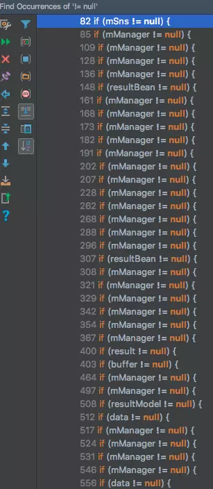
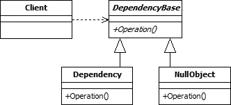

# 1. Math.max/min性能问题

问题由来：

算法题中经常会出现两个数的比较，


# 2. 重写equal和hashcode


首先我们查看equals源码可以发现

来看官方文档中的这样一句话：

```java
* Note that it is generally necessary to override the {@code hashCode}
* method whenever this method is overridden, so as to maintain the
* general contract for the {@code hashCode} method, which states
* that equal objects must have equal hash codes.
* @param   obj   the reference object with which to compare.
* @return  {@code true} if this object is the same as the obj
*          argument; {@code false} otherwise.
* @see     #hashCode()
* @see     java.util.HashMap
*/
public boolean equals(Object obj) {
    return (this == obj);
}
```

可见，Object方法中的equals方法中判断的是对象的内存地址，如果我们创建一个类，不作任何继承，那么其默认是继承自Object对象的；则调用equals方法是调进Object中的euqals方法，那么判断的便是两个对象的内存地址。这里需要注意对象创建在堆内存还是栈内存。

但是往往我们创建新的类时，大多数情况下是需要根据类的某些成员变量判断是否相等的，那么便需要根据我们的需要重写equals方法。根据上面的源码中的说明可知，重写equals方法需要重写hashcode方法，即保证两个对象equals，那么他们的hashcode也是相同的。

equals和hashcode之间的关系应该如下：

>  如果两个对象equals，那么这两个对象的hashcode一定相等；
>
> 如果两个对象不equals,那么这两个对象的hashcode可能相等；
>
> 如果两个对象的hashcode相等，那么这两个对象可能不equals；
>
> 如果两个对象的hashcode不相等，那么这两个对象一定不equals

那么为什么官方要求当两个对象equals，它们的hashcode理论上也一定要相等？即重写equals方法通常需要重写hashcode方法？

如果只是一般的使用，那么我们在重写equals方法的时候不重写hashcode或许不会存在什么问题，但如果该对象需要存放在HashSet之类的散列列表集合里，那么就会带来影响

下面我们通过一个例子说明不重写hashcode会带来的影响

```java
package com.chasedream.overridetest;

/**
 * <p>
 * 类描述:
 * <p>
 * 
 * @author Zhang Dezhou
 * 
 */
public class Model {

    private String name;
    private String age;
    private String otherName;

    /**
     * @param name
     * @param age
     * @param otherName
     */
    public Model(String name, String age, String otherName) {
        super();
        this.name = name;
        this.age = age;
        this.otherName = otherName;
    }

    /**
     * @return the name
     */
    public String getName() {
        return name;
    }

    /**
     * @param name
     * the name to set
     */
    public void setName(String name) {
        this.name = name;
    }

    /**
     * @return the age
     */
    public String getAge() {
        return age;
    }

    /**
     * @param age
     * the age to set
     */
    public void setAge(String age) {
        this.age = age;
    }

    /**
     * @return the otherName
     */
    public String getOtherName() {
        return otherName;
    }

    /**
     * @param otherName
     * the otherName to set
     */
    public void setOtherName(String otherName) {
        this.otherName = otherName;
    }

    @Override
    public int hashCode() {
        
        int a = 7;
        int b = 11;
        // a和b为不相等的int型常量
        int r = a;
        r = r*b + name.hashCode();
        r = r*b + age.hashCode();
        
//        return r;
        return super.hashCode();
    }
    
    @Override
    public boolean equals(Object obj) {
        if (!(obj instanceof Model)) {
            return false;
        }

        Model other = (Model) obj;
        if (name.equals(other.getName()) && age.equals(other.getAge())) {
            return true;
        }

        return false;
    }

    /* (non-Javadoc)
     * @see java.lang.Object#toString()
     */
    @Override
    public String toString() {
        return "Model [name=" + name + ", age=" + age + ", otherName=" + otherName + "]";
    }
}
```

```java
package com.chasedream.overridetest;

import java.util.ArrayList;
import java.util.HashSet;
import java.util.List;
import java.util.Set;

/**
 * <p>
 * 类描述:
 * <p>
 * 
 * @author Zhang Dezhou
 * 
 */
public class EqualsTest {
    public static void main(String[] args) {
        test1();
        test2();
    }
    
    public static void test1() {
        System.out.println("####:test1");
        List<Model> list = new ArrayList<Model>();
        
        Model a = new Model("a", "20", "test");
        Model b = new Model("a","20","abcdef");
        Model c = new Model("a","20","");
        
        list.add(a);
        System.out.println("a-hashCode:" + a.hashCode());
        System.out.println(list);
        if (!list.contains(b)) {
            list.add(b);
            System.out.println("b-hc:" + b.hashCode());
            System.out.println(list);
        }
        
    }
    
    public static void test2() {
        System.out.println("####:test2");
        Set<Model> set = new HashSet<Model>();
        
        Model a = new Model("a", "20", "test");
        Model b = new Model("a","20","abcdef");
        Model c = new Model("a","20","");
        
        set.add(a);
        System.out.println("a-hashCode:" + a.hashCode());
        System.out.println(set);
        if (!set.contains(b)) {
            set.add(b);
            System.out.println("b-hc:" + b.hashCode());
            System.out.println(set);
        }
    }
}
```

打印结果如下：

```
####:test1
a-hashCode:18923308
[Model [name=a, age=20, otherName=test]]
####:test2
a-hashCode:15136722
[Model [name=a, age=20, otherName=test]]
b-hc:26752749
[Model [name=a, age=20, otherName=test], Model [name=a, age=20, otherName=abcdef]]
```

List中能判断出包含了等价的b，但set中认为a和b不相等，set中没有包含b。发现test1()中，ArrayList是根据equals来判断是后包含，而不管hashCode是否不相等。而test2()中，HashSet处理流程则不一样，先判断两个对象的hashCode方法是否一样，如果不一样，立即认为两个对象equals不相等，并不调用equals方法，当hashCode相等时，再根据equals方法判断两个对象是否相等。

下面列出Effective Java中的重写hashcode的方法：

更多的通用规约可见Effective Java第三章

## 计算hashcode，为什么要使用 31

　　看一看 String hashCode 方法的源码：

```java
    /**
     * Returns a hash code for this string. The hash code for a
     * {@code String} object is computed as
     * <blockquote><pre>
     * s[0]*31^(n-1) + s[1]*31^(n-2) + ... + s[n-1]
     * </pre></blockquote>
     * using {@code int} arithmetic, where {@code s[i]} is the
     * <i>i</i>th character of the string, {@code n} is the length of
     * the string, and {@code ^} indicates exponentiation.
     * (The hash value of the empty string is zero.)
     *
     * @return  a hash code value for this object.
     */
    public int hashCode() {
        int h = hash;
        if (h == 0 && value.length > 0) {
            char val[] = value;

            for (int i = 0; i < value.length; i++) {
                h = 31 * h + val[i];
            }
            hash = h;
        }
        return h;
    }
```

　可以从注释看出：空字符串的 hashCode 方法返回是 0。并且注释中也给了个公式，可以了解了解。

　String 源码中也使用的 31， 可能的原因：

>  原因一：更少的乘积结果冲突
>
> 31是质子数中一个“不大不小”的存在，如果你使用的是一个如2的较小质数，那么得出的乘积会在一个很小的范围，很容易造成哈希值的冲突。而如果选择一个100以上的质数，得出的哈希值会超出int的最大范围，这两种都不合适。而如果对超过 50,000 个英文单词（由两个不同版本的 Unix 字典合并而成）进行 hash code 运算，并使用常数 31, 33, 37, 39 和 41 作为乘子，每个常数算出的哈希值冲突数都小于7个（国外大神做的测试），那么这几个数就被作为生成hashCode值得备选乘数了。
>
> 所以从 31,33,37,39 等中间选择了 31 的原因看原因二。

　　

>  原因二：31 可以被 JVM 优化
>
> 　JVM里最有效的计算方式就是进行位运算了：
>
> 　　* 左移 << : 左边的最高位丢弃，右边补全0（把 << 左边的数据*2的移动次幂）。
> 　　* 右移 >> : 把>>左边的数据/2的移动次幂。
> 　　* 无符号右移 >>> : 无论最高位是0还是1，左边补齐0。 　　
>
> ​    所以 ： 31 * i = (i << 5) - i（左边 31*2=62,右边  2*2^5-2=62） - 两边相等，JVM就可以高效的进行计算啦。。。

# 3. Set，List，Map，Array互操作

见Java基础篇-常见集合-集合互操作

# 4. Stream

对Set，list，map，array的处理

# 5. 经典面试题isOdd

## 为什么要用按位运算符代替取模运算符？

## 按位与运算和取模运算，实际的运行时间为什么差不多？

```java
public boolean isOdd(int n) {
    return (n & 1) == 1;
}
```

实际测试：

既然理论上证明按位与运算确实会比取模运算快，那么一定是我们的数据量不够导致执行时间相差无几，那么我们家大数据量至 10 ^20进行测试

```java
public class IsOdd {
    public static void main(String[] args) {
        IsOdd io = new IsOdd();
        long start = System.currentTimeMillis();
        int n = 1000000000;
        int k = 100;
        for (int l = 0; l < k; l++) {
            for (int j = 0; j < n; j++) {
                for (int i = 0; i < n; i++) {
                    io.isOddMod(i);
                }
            }
        }

        Out.println(System.currentTimeMillis() - start);
        start = System.currentTimeMillis();
        for (int l = 0; l < k; l++) {
            for (int j = 0; j < n; j++) {
                for (int i = 0; i < n; i++) {
                    io.isOddBit(i);
                }
            }
        }

        Out.println(System.currentTimeMillis() - start);
    }

    /**
     * 取模运算实现
     *
     * @return
     */
    private boolean isOddMod(int n) {
        return n % 2 == 1;
    }

    /**
     * 位运算实现
     *
     * @return
     */
    private boolean isOddBit(int n) {
        return (n & 1) == 1;
    }
}

```

执行结果如下：

```
64733.0
64247.0

Process finished with exit code 0

```

我们从数据上来看并没有明显的差别，下面我们从理论层面深入分析一下

理论上： 

首先，查看java字节码


其执行的cpu时钟周期的差别

# 6. 自增运算符原理分析

x = y++

x = ++y

x = x++

x = ++x


# 7. 简化if...else...的方法

摘自[Hollis](javascript:void(0);):https://mp.weixin.qq.com/s/3jrKrdGKmTGjgGYSy7xmBg

## **优化方案一：提前return，去除不必要的else**

如果if-else代码块包含return语句，可以考虑通过提前return，把多余else干掉，使代码更加优雅。

**优化前：**

```java
if(condition) {    
    //doSomething
}else {     
    return;
}
```

**优化后：**

```java
if(!condition) {    
    return;
}
//doSomething
```

## **优化方案二：使用条件三目运算符**

使用条件三目运算符可以简化某些if-else,使代码更加简洁，更具有可读性。

**优化前：**

```java
int  price;
if(condition) {    
    price = 80;
}else {    
    price = 100;
}
```

优化后：

```java
int price = condition ? 80 : 100;
```

## **优化方案三：使用枚举**

在某些时候，使用枚举也可以优化if-else逻辑分支，按个人理解，它也可以看作一种**表驱动方法**。

**优化前：**

```java
String OrderStatusDes;
if(orderStatus == 0) {    
    OrderStatusDes = "订单未支付";
}else if (OrderStatus == 1) {    
    OrderStatusDes ="订单已支付";
}else if (OrderStatus == 2 ) {   
    OrderStatusDes ="已发货"; 
}...
```

**优化后：**

先定义一个枚举

```java
public enum OrderStatusEnum {    
    UN_PAID(0,"订单未支付"),PAIDED(1,"订单已支付"),SENDED(2,"已发货"),;
    private int index;    
    private String desc;
    
    public int getIndex() {        
        return index;    
    }
    
    public String getDesc() 
    {        
        return desc;    
    
    }
    
    OrderStatusEnum(int index, String desc) {        
        this.index = index;        
        this.desc =desc;    
    }
    
    OrderStatusEnum of(int orderStatus) 
    {        
        for (OrderStatusEnum temp : OrderStatusEnum.values()) {            
            if (temp.getIndex() == orderStatus) {                
                return temp;            
            }        
        }        
        return null;    
    }
}
```

有了枚举之后，以上if-else逻辑分支，可以优化为一行代码

```java
String OrderStatusDes = OrderStatusEnum.0f(orderStatus).getDesc();
```

## **优化方案四：合并条件表达式**

如果有一系列条件返回一样的结果，可以将它们合并为一个条件表达式，让逻辑更加清晰。

**优化前**

```java
 double getVipDiscount() {        
     if (age < 18) {            
         return 0.8;        
     }        
     if ("深圳".equals(city)) {            
         return 0.8;        
     }        
     
     if(isStudent) {            
         return 0.8;        
     }        
     //do somethig    
 }
```

**优化后**

```java
 double getVipDiscount() {        
     if(age < 18 || "深圳".equals(city) || isStudent) {            
         return 0.8;        
     }        
     //doSomthing    
 }
```

## **优化方案五：使用 Optional**

有时候if-else比较多，是因为非空判断导致的，这时候你可以使用java8的Optional进行优化。

**优化前：**

```java
String str = "jay@huaxiao";if (str != null) {    System.out.println(str);} else {    System.out.println("Null");}
```

**优化后：**

```java
Optional<String> strOptional = Optional.of("jay@huaxiao");strOptional.ifPresentOrElse(System.out::println, () -> System.out.println("Null"));
```

## **优化方案六：表驱动法**

**表驱动法**，又称之为表驱动、表驱动方法。表驱动方法是一种使你可以在表中查找信息，而不必用很多的逻辑语句（if或case）来把它们找出来的方法。以下的demo，把map抽象成表，在map中查找信息，而省去不必要的逻辑语句。

**优化前：**

```java
if (param.equals(value1)) {    
    doAction1(someParams);
} else if (param.equals(value2)) {    
    doAction2(someParams);
} else if (param.equals(value3)) {    
    doAction3(someParams);
}// ...
```

**优化后：**

```java
Map<?, Function<?> action> actionMappings = new HashMap<>(); // 这里泛型 ? 是为方便演示，实际可替换为你需要的类型
// 初始化
actionMappings.put(value1, (someParams) -> { doAction1(someParams)});
actionMappings.put(value2, (someParams) -> { doAction2(someParams)});
actionMappings.put(value3, (someParams) -> { doAction3(someParams)});
// 省略多余逻辑语句
actionMappings.get(param).apply(someParams);
```

## **优化方案七：优化逻辑结构，让正常流程走主干**

**优化前：**

```java
public double getAdjustedCapital() {    
    if(_capital <= 0.0 ) {        
        return 0.0;    
    }    
    if(_intRate > 0 && _duration >0) {        
        return (_income / _duration) *ADJ_FACTOR;    
    }    
    return 0.0;
}
```

**优化后：**

```java
public double getAdjustedCapital() {    
    if(_capital <= 0.0 ) {        
        return 0.0;    
    }    
    if(_intRate <= 0 || _duration <= 0) {        
        return 0.0;    }
    return (_income / _duration) *ADJ_FACTOR;
}
```

将条件反转使异常情况先退出，让正常流程维持在主干流程，可以让代码结构更加清晰。

## **优化方案八：策略模式+工厂方法消除if else**

假设需求为，根据不同勋章类型，处理相对应的勋章服务，优化前有以下代码：

```java
String medalType = "guest";    
if ("guest".equals(medalType)) {        
    System.out.println("嘉宾勋章");     
} else if ("vip".equals(medalType)) {        
    System.out.println("会员勋章");    
} else if ("guard".equals(medalType)) {        
    System.out.println("展示守护勋章");    
}    ...
```

首先，我们把每个条件逻辑代码块，抽象成一个公共的接口，可以得到以下代码：

```java
//勋章接口
public interface IMedalService {    
    void showMedal();    
    String getMedalType();
}
```

我们根据每个逻辑条件，定义相对应的策略实现类，可得以下代码：

```java
//守护勋章策略实现类
public class GuardMedalServiceImpl implements IMedalService {    
    @Override    
    public void showMedal() {        
        System.out.println("展示守护勋章");    
    }    
    @Override    public String getMedalType() {        
        return "guard";    
    }
}

//嘉宾勋章策略实现类
public class GuestMedalServiceImpl implements IMedalService {    
    @Override    
    public void showMedal() {        
        System.out.println("嘉宾勋章");    
    }    
    @Override    
    public String getMedalType() {        
        return "guest";    
    }
}

//VIP勋章策略实现类
public class VipMedalServiceImpl implements IMedalService {    
    @Override    
    public void showMedal() {        
        System.out.println("会员勋章");    
    }    
    @Override    
    public String getMedalType() {        
        return "vip";    
    }
}
```

接下来，我们再定义策略工厂类，用来管理这些勋章实现策略类，如下：

```java
//勋章服务工产类
public class MedalServicesFactory {
    private static final Map<String, IMedalService> map = new HashMap<>();    
    static {        
        map.put("guard", new GuardMedalServiceImpl());        
        map.put("vip", new VipMedalServiceImpl());        
        map.put("guest", new GuestMedalServiceImpl());    
    }    
    public static IMedalService getMedalService(String medalType) {        
        return map.get(medalType);    
    }
}
```

使用了策略+工厂模式之后，代码变得简洁多了，如下：

```java
public class Test {    
    public static void main(String[] args) {        
        String medalType = "guest";        
        IMedalService medalService = MedalServicesFactory.getMedalService(medalType);        
        medalService.showMedal();    
    }
}
```

# 8. 如何优雅地进行判空操作

Java中争对Null的处理方式有很多种，见问题9：高效处理Null的10条建议。该问题主要侧重于如何去除代码中大量的判空操作。

我们在编写程序的过程中，遇到的最多的异常中肯定会有NullPointerException（NPE）。但是NPE的问题往往是很好解决的，当发生NPE时，我们往往会进行如下操作：

```java
if (data != null) {
	// do something...
}
```

一顿操作猛如虎，但不得不说在少量的判空操作的时候，这种方法往往是既简单又高效！

然而，如果遇到一个类中多次使用某个对象，那么可能需要一顿更猛的操作，所以会出现如下宏伟又壮观的场面：



可能你会想，项目中肯定不止一个人会进行这样的操作，然后按下Command+shift+F，真相就在眼前：


## 使用Null object 设计模式去除判空操作

Null Object模式？

```
In object-oriented computer programming, a null object is an object with no referenced value or with defined neutral ("null") behavior. The null object design pattern describes the uses of such objects and their behavior (or lack thereof).
```

NullObject模式的概念首次出现在“程序设计模式语言”系列丛书中。一般的，在面向对象的语言中，对对象的调用之前需要对其进行判空操作，因为在空引用上无法调用所需的方法。



Nullable是空对象的相关操作接口，用于确定对象是否为空，因为在空对象模式中，对象为空会被包装成一个Object，成为Null Object，该对象会对原有对象的所有方法进行空实现。

```java
public interface Nullable {
	boolean isNull();
}
```

这个接口定义了业务对象的行为

```java
public interface DependencyBase extends Nullable {
	void operation();
}
```

这是该对象的真实类，实现了业务行为接口DependencyBase与空对象操作接口Nullable。

```java
public class Dependency implements DependencyBase, Nullable {

    @Override
    public void operation() {
        System.out.print("Test!");
    }

    @Override
    public boolean isNull() {
        return false;
    }    
}
```

这是空对象，对原有对象的行为进行了空实现。

```java
public class NullObject implements DependencyBase{

    @Override
    public void operation() {
        // do nothing
    }

    @Override
    public boolean isNull() {
        return true;
    } 
}
```

在使用时，可以通过工厂调用方式来进行空对象的调用，也可以通过其他如反射的方式对对象进行调用（一般多耗时几毫秒）在此不进行详细叙述。

```java
public class Factory {
    public static DependencyBase get(Nullable dependencyBase){
        if (dependencyBase == null){
            return new NullObject();
        }
        return new Dependency();
    }
}
```

这是一个使用范例，通过这种模式，我们不再需要进行对象的判空操作，而是可以直接使用对象，也不必担心NPE（NullPointerException）的问题。

```java
public class Client {
    public void test(DependencyBase dependencyBase){
        Factory.get(dependencyBase).Operation();
    }
}
```

## 使用Optional

Java8中引入的新的特性Optional可以解决一些场景下的判空操作

```
A container object which may or may not contain a non-null value. If a value is present, isPresent() will return true and get() will return the value.
```

有如下代码，需要获得Test2中的Info信息，但是参数为Test4，我们要一层层的申请，每一层都获得的对象都可能是空，最后的代码看起来就像这样。

```java
public String testSimple(Test4 test) {
    if (test == null) {
        return "";
    }
    if (test.getTest3() == null) {
        return "";
    }
    if (test.getTest3().getTest2() == null) {
        return "";
    }
    if (test.getTest3().getTest2().getInfo() == null) {
        return "";
    }
    return test.getTest3().getTest2().getInfo();
}
```

使用Optional后:

```java
public String testOptional(Test test) {
    return Optional.ofNullable(test).flatMap(Test::getTest3)
        .flatMap(Test3::getTest2)
        .map(Test2::getInfo)
        .orElse("");
}
```

1.Optional.ofNullable(test)，如果test为空，则返回一个单例空Optional对象，如果非空则返回一个Optional包装对象，Optional将test包装；

```java
public static <T> Optional<T> ofNullable(T value) {
    return value == null ? empty() : of(value);
}
```

2.flatMap(Test::getTest3)判断test是否为空，如果为空，继续返回第一步中的单例Optional对象，否则调用Test的getTest3方法；

```java
public<U> Optional<U> flatMap(Function<? super T, Optional<U>> mapper) {
    Objects.requireNonNull(mapper);
    if (!isPresent())
        return empty();
    else {
        return Objects.requireNonNull(mapper.apply(value));
    }
}
```

3.flatMap(Test3::getTest2)同上调用Test3的getTest2方法；

4.map(Test2::getInfo)同flatMap类似，但是flatMap要求Test3::getTest2返回值为Optional类型，而map不需要，flatMap不会多层包装，map返回会再次包装Optional；

```java
public<U> Optional<U> map(Function<? super T, ? extends U> mapper) {
    Objects.requireNonNull(mapper);
    if (!isPresent())
        return empty();
    else {
        return Optional.ofNullable(mapper.apply(value));
    }
}
```

5.orElse("");获得map中的value，不为空则直接返回value，为空则返回传入的参数作为默认值。

```java
public T orElse(T other) {
    return value != null ? value : other;
}
```

# 9. 高效处理Null的10条建议

源自：https://dzone.com/articles/10-tips-to-handle-null-effectively

1. 不要过于复杂化

   就其本身而言，处理null可能是一个复杂的问题，因此我们应使其尽可能整洁和明显。 我在某些代码库中看到的一种非常糟糕的做法是在简单的空检查就足够了的地方使用Objects方法，Optional类，甚至使用Optional的单独方法。 这导致我检查该方法的来源，包含的内容，并想知道此方法与直接比较之间的区别是什么。 当然，您的里程可能会有所不同，但是对我来说，这是我们应该避免的大量开销。

   ```java
   if (Optional.ofNullable(myVariable).isPresent()) // bad
   if (Objects.nonNull(myVariable)) // better, but still bad
   if (myVariable != null) // good
   ```

2. Object方法配合Stream使用

   尽管Objects.isNull和Objects.nonNull并非最适合典型的null检查，但它们非常适合与Stream一起使用。 与之相比，使用它们进行过滤或匹配的行的读取（可以说）要好得多。 实际上，这就是在JDK中引入它们的原因。

   ```java
   myStream.filter(Objects::nonNull)
   myStream.anyMatch(Objects::isNull)
   ```

3. 永远不要传递null作为参数

   这是良好编码的最重要原则之一，但是如果您还不了解它，就应该仔细了解一下。 传递null表示给定参数没有值似乎是一个可行的选择。 但是它有两个很大的缺点：

   * 您需要阅读该函数的实现，并弄清楚它以及可能受影响的每个函数能否正确处理空值。
   * 在更改函数的实现时，您必须始终小心，不要丢掉可能会为其用户处理null的内容。 否则，您必须搜索整个源代码以检查是否在任何地方传递了null。

   通过接受永不传递null的原则，这两个问题将永远消失。 那么带有可选参数的函数呢？ 很简单，只需使用不同的参数集重载函数即可：

   ```java
   void kill() {
       kill(self);
   }
   void kill(Person person) {
       person.setDeathTime(now());
   }
   ```

   顺便说一下，由于这两个缺点在单个类的范围内并不明显，因此在处理私有方法时可以放弃该规则。 只要确保事物从外面是安全的即可。

4. 对公共API参数进行校验

   您和您的团队可能会采用不成功传递null的原则，但是在公开公共API时，您无法控制其用户及其传递给函数的内容。 因此，请务必检查传递给公共API的参数的正确性。 如果您唯一关心的是参数的无效性，请考虑使用Objects类中的requireNonNull函数：

   ```java
   public Foo(Bar bar, Baz baz) {
       this.bar = Objects.requireNonNull(bar, "bar must not be null");
       this.baz = Objects.requireNonNull(baz, "baz must not be null");
   }
   ```

5. 返回值只用Optional封装

   在Java 8之前，通常会在缺少值的情况下将方法返回null。 这天生就是容易出错的，因为开发人员必须经常检查文档，或者如果缺少文档，则需要阅读可能的返回null的基础源代码。 自从JDK 8发布以来，我们有了Optional类，该类专门设计用于指示可能缺少返回值的情况。 开发人员调用以Optional作为返回值的方法时，必须显式处理不存在该值的情况。 因此，在适配时，请使用Optional来包装您的返回类型。

   ```java
   Optional<String> makingYouCheck() {
       // stuff
   }
   
   makingYouCheck().orElseThrow(ScrewYouException::new);
   ```

6. 返回空的集合而不是null

   我们已经知道返回null并不是最佳的做法，且我们可以使用Optional类来指示该值可能丢失。 但是当我们谈论collections时，情况有所不同。 由于集合可以包含任意数量的元素，因此它也可以包含…0个元素！ 在Collections类中甚至有特殊的emptyXxx方法返回此类集合。 因此，我们应该避免返回null或使用Optional使事情复杂化，并且在没有值时返回空集合。

   ```java
   List<String> findSomething() {
       if (someCondition) {
           return Collections.emptyList();
       }
       // stuff
   }
   ```

7. 不要为fields使用Optional

   正如我已经说过的那样，Optional旨在指示缺少的返回值。 它不是且肯定不是为类的字段所设计的。 通过封装，您应该完全控制字段的值，包括null。 另一方面，将字段显式地设置为Optional可能会给您带来奇怪的问题，例如：

   * 您应该如何为此类字段编写构造函数或设置方法？
   * 即使在确定值存在的情况下，您也必须处理Optional。
   * 自动映射器应如何处理这些字段？

   因此，对字段使用直接引用，并仔细分析字段在任何给定点是否可以为空。 如果您的类得到了很好的封装，那么这应该很容易。

8. 使用异常代替返回null

   一个奇怪的场景是：您可能会看到在一些异常情况下会使用null。这是一种固有的容易出错的做法，因为关键错误可以在系统的不同位置被忽略或重新出现，从而使调试变得很痛苦。因此，如果出现问题，请始终抛出异常，而不是返回null。

9. 测试你的代码

   此种建议和各种bug有关，不仅仅是一些非预期的null，而且非常重要。使用类似于生产环境的环境彻底测试代码是防止NPE的好方法。切勿在未确保其正常工作的情况下发布一段代码。没有所谓的“不需要测试的快速，简单的修复程序”。

10. 仔细检查

    每次您认为某个引用不能为空时，请再次确认。 在处理庞大的旧数据库或外部提供程序时，这一点尤其重要。 对于前者，请花一些时间检查您要使用的列是否不包含任何空值，如果包含空值，请检查这些行是否可以将其放入您的系统。 如果是外部供应商，则需要依靠合同，文档，如果不确定，请发送电子邮件或致电某人以确保您的假设正确。 这可能很烦人，尤其是在使用文档记录较差的API时，但涉及到null：安全胜过遗憾！