# Java部分

## Java Class、Interface

 

### 概念

### 创建方式

### 设计这几种类型的原因

### 为什么interface能够多继承（实现）

### 为什么class只能单继承

## Java内部类

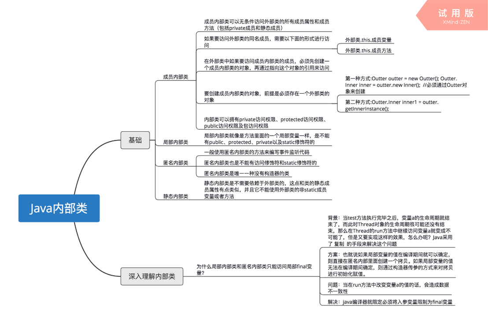

1.静态内部类才可以声明静态方法

2.静态方法不可以使用非静态变量

3.抽象方法不可以有函数体

 

## 关于C++虚类(仅供参考)Java接口描述？

**一、C++多态**

C++的多态包括静态多态和动态多态。静态多态包括函数重载和泛型编程，动态多态包括虚函数。静态多态是指在编译期间就可以确定，动态多态是指在程序运行时才能确定。

**二、虚函数**

1、虚函数为类的非静态成员函数，访问权限一般为public。函数声明时，在返回值前加virtual关键字，函数定义时不需要加virtual。父类定义的虚函数，子类在继承时，可以对虚函数重新定义，当然子类的函数应该与父类虚函数一样，只是函数实现不一样。我们用父类的指针指向子类的实例，然后通过父类的指针可以调用实际子类的成员函数。

2、构造函数不能为虚函数

3、当基类中有虚函数的时候，一般基类的析构函数也要定义为虚析构函数。如果不定义虚析构函数，当删除一个指向派生类对象的指针时，会调用基类的析构函数，派生类的析构函数未被调用，造成内存泄漏。定义虚析构函数后，最底层的派生类的析构函数最先被调用，然后各个基类的析构函数被调用。

**三、纯虚函数**

纯虚函数为虚函数在声明时，函数末尾加=0，纯虚函数没有函数定义，它的子类需要继承所有基类的纯虚函数并且给出定义。纯虚函数的作用就是为派生类提供一个一致的接口。

**四、抽象类**

抽象类就是指含有纯虚函数的类，该类不能创建对象，但是可以声明指针和引用。

**五、虚基类**

1、如果一个派生类有多个直接基类，而这些直接基类又有一个共同的基类，则在最终的派生类中会保留该间接共同基类数据成员的多份同名成员。在引用这些同名的成员时，必须在派生类对象名后增加直接基类名，以避免二义性。

示例：

class A

{

public:

int m_nNum;

};

class B :public A

{…};

class C :public A

{…};

class D :public B,public C 

{};

D d1;

d1.A::m_nNum;

2、C++提供虚基类，使得在继承间接共同基类时只保留一份成员。

示例：

class A

{

public:

int m_nNum;

};

class B :virtual public A

{…};

class C :virtual public A

{…};

class D :public B,public C 

{};

D d1;

d1.m_nNum;

3、在最后的派生类中不仅要负责对直接基类进行初始化，还要负责对虚基类初始化。C++编译系统只执行最后的派生类对虚基类的构造函数的调用，而忽略虚基类的其他派生类（B和C）对虚基类的构造函数的调用，保证了虚基类成员不会被多次初始化。

例如

class D :public B,public C 

{

  D(int n):A(n),B(n),C(n){ }

};

构造的顺序为先构造最上层基类，然后父类谁先继承谁先构造，析构函数的顺序和构造函数顺序相反。

 

### Java Abstract class和Interface

#### Abstract class

概念：

作用：

使用场景：

 

Code Practice:

#### Interface

概念：

作用：

使用场景：

共性：

 

Code Practice:

 

通俗记忆

*(仅限于应付笔试，深入体会仍需通过大量的code以及项目来体会)*

 

 

抽象类可以有构造，但是不能new；

抽象类可以有普通成员变量

接口中可以有变量，但是始终是public static final的

抽象类和接口中都可以有静态方法。

JDK 1.8以前，抽象类的方法默认访问权限为protected

JDK 1.8时，抽象类的方法默认访问权限变为default

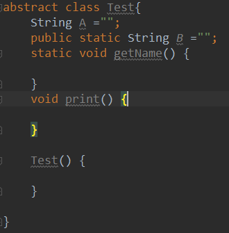

接口中可以有非静态的方法，如default

接口中可以有带方法体的方法，static

接口中的方法默认是public的

**接口** 只能用 **public** 和 **abstract** 修饰。**only public & abstract default, static** strictfp **are permitted** 。

**内部接口** **only public, protected, private, abstract & static are permitted**

 

 

 

 

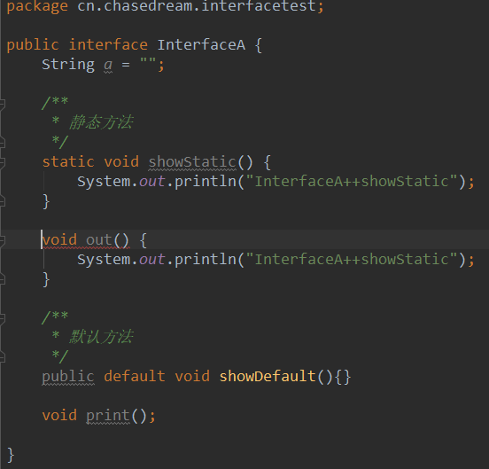

 

### Java1.8的新特性

#### 接口方面

#### 集合方面

#### JVM方面

## 基本数据类型

### byte

基本概念：

占用字节数：1

作用：

内存中的存储方式：

转型规则：

​    向上转型：

### short

基本概念：

占用字节数：2

作用：

内存中的存储方式：

转型规则：

​    向上转型：

​    向下转型：

### int

基本概念：

占用字节数：4

作用：

内存中的存储方式：

转型规则：

​    向上转型：

​    向下转型：

### long

基本概念：

占用字节数：8

作用：

内存中的存储方式：

转型规则：

​    向上转型：

​    向下转型：

​    转型为float原理：

### float

基本概念：

占用字节数：4

作用：

内存中的存储方式：

转型规则：

​    向上转型：

​    向下转型：

### double

基本概念：

占用字节数：8

作用：

内存中的存储方式：

转型规则： 

​    向下转型：

### char

基本概念：

占用字节数：2

作用：

内存中的存储方式：

转型规则：

​    向上转型：

​    向下转型：

### boolean

基本概念：

占用字节数：1

作用：

内存中的存储方式：

转型规则： 

## 引用数据类型

### String(此处以String类型为例)

赋值方式、转型规则，long->float

计算原则

 

数据类型数据范围及初始值对照表

## Java 枚举类型

enum AccountType

{

  SAVING, FIXED, CURRENT;

  private AccountType()

  {

​    System.out.println(“It is a account type”);

  }

}

class EnumOne

{

  public static void main(String[]args)

  {

​    System.out.println(AccountType.FIXED);

  }

}

## Java运算符&操作符

### 运算符优先级

### 自增/自减

概念

注意点

jvm层面分析其原理

### 能够被重载的运算符（c++）(补充)

除了**类属关系运算符****"."**、**成员指针运算符****".\*"**、**作用域运算符****"::"**、**sizeof****运算符**和**三目运算符****"?:"**以外，C++中的所有运算符都可以重载

但是=、()、[]、->这四个不能重载为类的友元函数。

 

## 面向对象的基本原则

### 单一职责

### 开放封闭

### 里式替换

### 依赖倒置

高层模块不应该依赖低层模块，两者都应该依赖抽象

抽象不应该依赖细节

细节应该依赖抽象


依赖倒置原则在java语言中，表现是：

模块间的依赖通过抽象发生，实现类之间不发生直接的依赖关系，其依赖关系是通过接口或抽象类产生的。

接口或抽象类不依赖实现类

实现类依赖接口或抽象类

### 接口隔离

## Java String、StringBuilder、StringBuffer

### String

概念

线程安全：否

源码剖析

Code practice

 

### StringBuillder

概念

线程安全：否

源码剖析

Code practice

 

### StringBuffer

概念

线程安全：是

源码剖析

Code practice

 

通用记忆

（仅限于应付笔试、深入理解仍需通过大量的code实际以及分析读透源码）

例：String s = “welcom” + “to” + “huawei”;如改成“welcom” + “to” + “to”呢？

## 数组

### 概念

(主要体现和其他语言以及结构的区别)

### 存储方式

## 集合

### 集合的继承体系

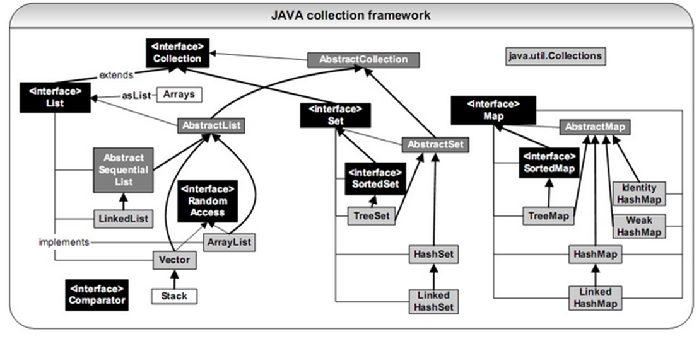

### 集合中的线程安全

## Java队列

优先级队列，LinkedBlockingQueue，ConcurrentLinkedQueue

## Java解决哈希冲突的方法

## 异常

### 异常的体系结构

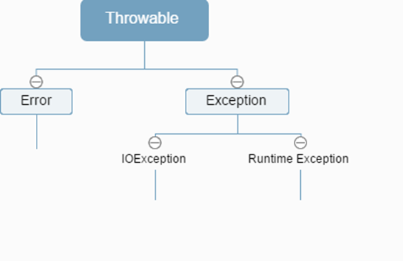 

### 异常的类型

Cheked Exception

UnChecked Exception

### 异常的处理

异常的捕获，异常出触发后的执行顺序

#### try catch

#### finally

## Java编译原理

### 跨平台特性

一个Java源程序文件中定义几个类和接口，则编译该文件后生成几个以.class为后缀的字节码文件

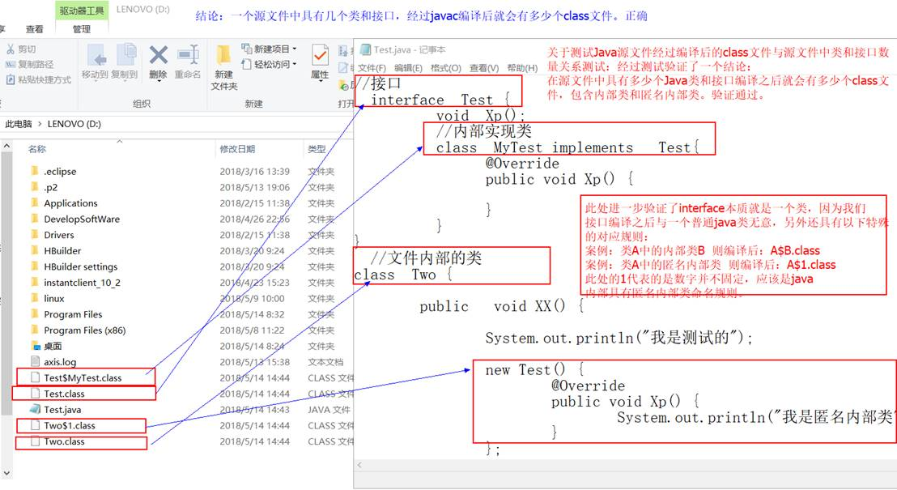

### 编译过程

## Java执行原理

### 类的初始化过程

父类的静态成员初始化>父类的静态代码块>子类的静态成员初始化>子类的静态代码块>父类的代码块>父类的构造方法>子类的代码块>子类的构造方法

静态初始化块

 

Java构造函数相关概念

静态成员初始化

 

子类继承父类，方法的继承、变量的继承

### Java静态分配的过程

### Java类加载器

引导加载器，扩展加载器，系统加载器

引导类加载器（bootstrap class loader）：

它用来加载 Java 的核心库，是用原生代码来实现的，并不继承自 java.lang.ClassLoader。主要负责jdk_home/lib目录下的核心api 或 -Xbootclasspath 选项指定的jar包装入工作（其中的jdk_home是指配置jdk环境变量是java_home的配置路径，一般是jdk/jre所在目录）。

 

扩展类加载器（extensions class loader）：

它用来加载 Java 的扩展库。Java虚拟机的实现会提供一个扩展库目录，扩展类加载器在此目录里面查找并加载 Java 类，主要负责jdk_home/lib/ext目录下的jar包或 -Djava.ext.dirs 指定目录下的jar包装入工作。

 

系统类加载器（system class loader）：

它根据 Java 应用的类路径（CLASSPATH）来加载 Java 类。一般来说，Java 应用的类都是由它来完成加载的。可以通过 ClassLoader.getSystemClassLoader()来获取它。主要负责CLASSPATH/-Djava.class.path所指的目录下的类与jar包装入工作.

## 类与类之间几种常见的关系

**USES-A：**依赖关系，A类会用到B类，这种关系具有偶然性，临时性。但B类的变化会影响A类。这种在代码中的体现为：A类方法中的参数包含了B类。

关联关系：A类会用到B类，这是一种强依赖关系，是长期的并非偶然。在代码中的表现为：A类的成员变量中含有B类。

**HAS-A：**聚合关系，拥有关系，是关联关系的一种特例，是整体和部分的关系。比如鸟群和鸟的关系是聚合关系，鸟群中每个部分都是鸟。

**IS-A：**表示继承。父类与子类，这个就不解释了。

要注意：还有一种关系：组合关系也是关联关系的一种特例，它体现一种contains-a的关系，这种关系比聚合更强，也称为强聚合。它同样体现整体与部分的关系，但这种整体和部分是不可分割的。

 

## Java泛型以及使用泛型的好处

**1，类型安全**。 泛型的主要目标是提高 Java 程序的类型安全。通过知道使用泛型定义的变量的类型限制，编译器可以在一个高得多的程度上验证类型假设。没有泛型，这些假设就只存在于程序员的头脑中（或者如果幸运的话，还存在于代码注释中）。

**2，消除强制类型转换**。 泛型的一个附带好处是，消除源代码中的许多强制类型转换。这使得代码更加可读，并且减少了出错机会。

**3，潜在的性能收益**。 泛型为较大的优化带来可能。在泛型的初始实现中，编译器将强制类型转换（没有泛型的话，程序员会指定这些强制类型转换）插入生成的字节码中。但是更多类型信息可用于编译器这一事实，为未来版本的 JVM 的优化带来可能。由于泛型的实现方式，支持泛型（几乎）不需要 JVM 或类文件更改。所有工作都在编译器中完成，编译器生成类似于没有泛型（和强制类型转换）时所写的代码，只是更能确保类型安全而已。

**所以泛型只是提高了数据传输安全性，并没有改变程序运行的性能**

## JVM

### 概念

### 内存模型

### JVM新生代、老年代

新生代包含哪些部分

引申：进程的区间（https://www.cnblogs.com/liulipeng/archive/2013/09/13/3319675.html）

### JVM对final变量的优化过程

### JVM GC原理

内存溢出，内存配置参数的含义,内存模型有哪些部分，垃圾回收算法

finalize方法执行过程

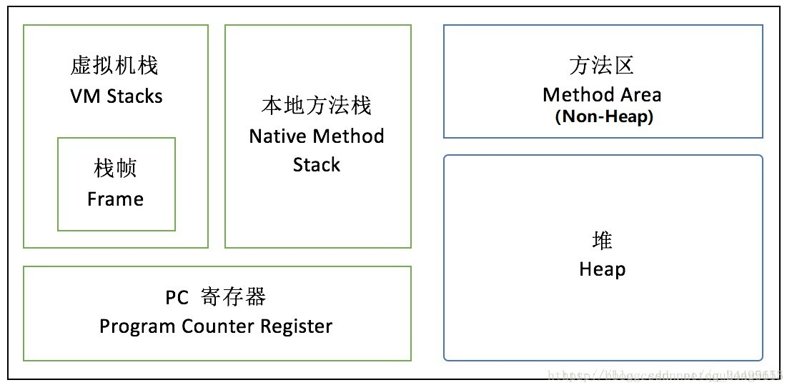

两个最基本的java回收算法：复制算法和标记清理算法

复制算法：两个区域A和B，初始对象在A，继续存活的对象被转移到B。此为新生代最常用的算法

标记清理：一块区域，标记可达对象（可达性分析），然后回收不可达对象，会出现碎片，那么引出

标记-整理算法：多了碎片整理，整理出更大的内存放更大的对象

两个概念：新生代和年老代

新生代：初始对象，生命周期短的

永久代：长时间存在的对象

整个java的垃圾回收是新生代和年老代的协作，这种叫做分代回收。

P.S：**Serial New****收集器是针对新生代的收集器，采用的是复制算法**

**Parallel New****（并行）收集器，新生代采用复制算法，老年代采用标记整理**

**Parallel** **Scavenge****（并行）收集器，针对新生代，采用复制收集算法**

**Serial Old****（串行）收集器，新生代采用复制，老年代采用标记整理**

**Parallel** **Old****（并行）收集器，针对老年代，标记整理**

**CMS****收集器，基于标记清理**

**G1****收集器：整体上是基于标记** **整理** **，局部采用复制**

 

**综上：新生代基本采用复制算法，老年代采用标记整理算法。****cms****采用标记清理。**

 

### Java运行时常量池

 

## Java字符流和字节流，以及其对应能够处理的编码

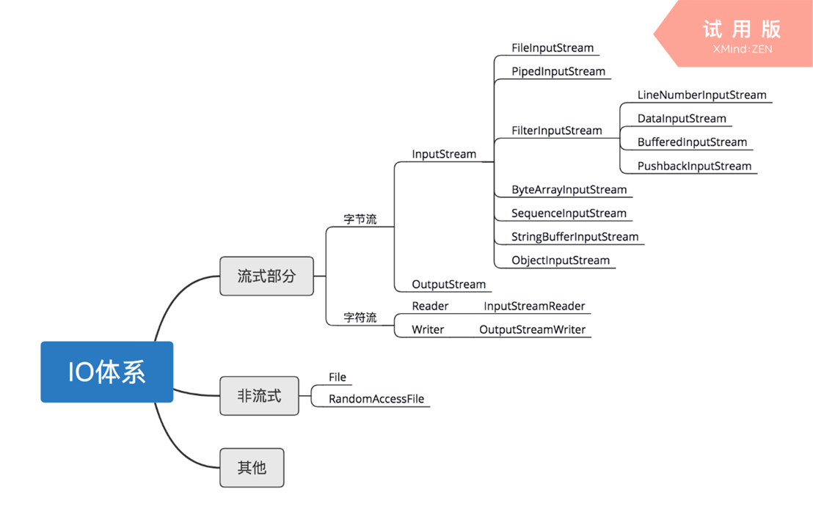

### 字节流

​    概念

​    内置的能够处理字节流的类

​    基本处理原理

 

### 字符流

​    概念

内置的能够处理字符流的类

​    基本处理原理

 

### 字节流和字符流的主要区别

## 线程

### 线程间的通知和唤醒

### 线程的各种状态转换

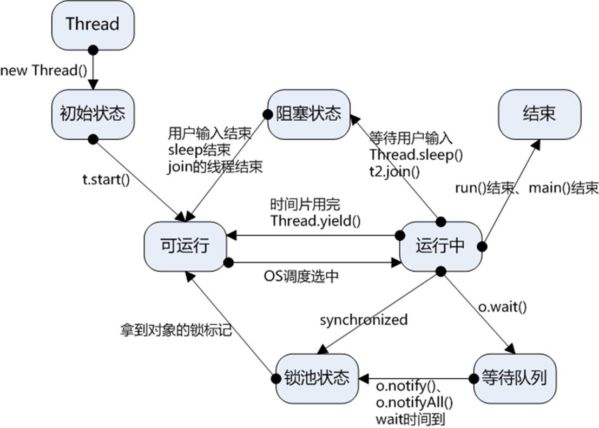

### 线程的停止方法

 

Object.wait/notify/notifyAll

```
Condition.await/signal/signalAll
 
```

### 线程安全的处理方法

 

 

## Java并发

### 锁的种类

1、自旋锁 ,自旋，jvm默认是10次吧，有jvm自己控制。for去争取锁

 

2、阻塞锁 被阻塞的线程，不会争夺锁。

 

3、可重入锁 多次进入改锁的域

 

4、读写锁

 

5、互斥锁 锁本身就是互斥的

 

6、悲观锁 不相信，这里会是安全的，必须全部上锁

 

7、乐观锁 相信，这里是安全的。

 

8、公平锁 有优先级的锁

 

9、非公平锁 无优先级的锁

 

10、偏向锁 无竞争不锁，有竞争挂起，转为轻量锁

 

11、对象锁 锁住对象

 

12、线程锁

 

13、锁粗化 多锁变成一个，自己处理

 

14、轻量级锁 CAS 实现

 

15、锁消除 偏向锁就是锁消除的一种

 

16、锁膨胀 jvm实现，锁粗化

 

17、信号量 使用阻塞锁 实现的一种策略

### 并发框架支持的锁有哪些

```
Copyonwritearraylist、readwritelock、concurrenthashmap等实现技术以及使用场景
CopyOnWriteArrayList适合使用在读操作远远大于写操作的场景里，比如缓存。
ReadWriteLock 当写操作时，其他线程无法读取或写入数据，而当读操作时，其它线程无法写入数据，但却可以读取数据 。适用于 读取远远大于写入的操作。
ConcurrentHashMap是一个线程安全的Hash Table，它的主要功能是提供了一组和HashTable功能相同但是线程安全的方法。ConcurrentHashMap可以做到读取数据不加锁，并且其内部的结构可以让其在进行写操作的时候能够将锁的粒度保持地尽量地小，不用对整个ConcurrentHashMap加锁。
```

### 并发编程同步器

 

## Java正则表达式

网址、身份证号…

## 设计模式

结构型模式是描述如何将类对象结合在一起，形成一个更大的结构，结构模式描述两种不同的东西：类与类的实例。故可以分为类结构模式和对象结构模式。

在GoF设计模式中，结构型模式有：

 

**1.适配器模式 Adapter**

 适配器模式是将一个类的接口转换成客户希望的另外一个接口。适配器模式使得原本由于接口不兼容而不能一起工作的那些类可以一起工作。

 两个成熟的类需要通信，但是接口不同，由于开闭原则，我们不能去修改这两个类的接口，所以就需要一个适配器来完成衔接过程。

**2.桥接模式 Bridge**

 桥接模式将抽象部分与它的实现部分分离，是它们都可以独立地变化。它很好的支持了开闭原则和组合锯和复用原则。实现系统可能有多角度分类，每一种分类都有可能变化，那么就把这些多角度分离出来让他们独立变化，减少他们之间的耦合。

**3.组合模式 Composite**

 组合模式将对象组合成树形结构以表示部分-整体的层次结构，组合模式使得用户对单个对象和组合对象的使用具有一致性。

**4.装饰模式 Decorator**

装饰模式动态地给一个对象添加一些额外的职责，就增加功能来说，它比生成子类更灵活。也可以这样说，装饰模式把复杂类中的核心职责和装饰功能区分开了，这样既简化了复杂类，有去除了相关类中重复的装饰逻辑。 装饰模式没有通过继承原有类来扩展功能，但却达到了一样的目的，而且比继承更加灵活，所以可以说装饰模式是继承关系的一种替代方案。

**5.外观模式 Facade**

 外观模式为子系统中的一组接口提供了同意的界面，外观模式定义了一个高层接口，这个接口使得这一子系统更加容易使用。

 

外观模式中，客户对各个具体的子系统是不了解的，所以对这些子系统进行了封装，对外只提供了用户所明白的单一而简单的接口，用户直接使用这个接口就可以完成操作，而不用去理睬具体的过程，而且子系统的变化不会影响到用户，这样就做到了信息隐蔽。

 

**6.享元模式 Flyweight**

 享元模式为运用共享技术有效的支持大量细粒度的对象。因为它可以通过共享大幅度地减少单个实例的数目，避免了大量非常相似类的开销。.

享元模式是一个类别的多个对象共享这个类别的一个对象，而不是各自再实例化各自的对象。这样就达到了节省内存的目的。

 

**7.代理模式 Proxy**  

为其他对象提供一种代理，并由代理对象控制对原对象的引用，以间接控制对原对象的访问。

 

 

## Java中的修饰符

分类

Java语言提供了很多修饰符，大概分为两类： 

\1. 访问权限修饰符 

\2. 非访问权限修饰符

访问权限修饰符

\1.   public：共有访问。对所有的类都可见。

\2.   protected：保护型访问。对同一个包可见，对不同的包的子类可见。

\3.   default：默认访问权限。只对同一个包可见，注意对不同的包的子类不可见。

\4.   private：私有访问。只对同一个类可见，其余都不见。

 

非访问权限修饰符

\1.   static 修饰符，用来创建类方法和类变量。

\2.   final 修饰符，用来修饰类、方法和变量，final 修饰的类不能够被继承，修饰的方法不能被继承类重新定义，修饰的变量为常量，是不可修改的。

\3.   abstract 修饰符，用来创建抽象类和抽象方法。

\4.   synchronized 用于多线程的同步。

\5.   volatile 修饰的成员变量在每次被线程访问时，都强制从共享内存中重新读取该成员变量的值。而且，当成员变量发生变化时，会强制线程将变化值回写到共享内存。这样在任何时刻，两个不同的线程总是看到某个成员变量的同一个值。

\6.   transient：序列化的对象包含被 transient 修饰的实例变量时，java 虚拟机(JVM)跳过该特定的变量。

类

外部类修饰符

·    public（访问控制符），将一个类声明为公共类，它可以被任何对象访问，一个程序的主类必须是公共类。

·    default（访问控制符），类只对包内可见，包外不可见。

·    abstract（非访问控制符），将一个类声明为抽象类，抽象类不能用来实例化对象，声明抽象类的唯一目的是为了将来对该类进行扩充，抽象类可以包含抽象方法和非抽象方法。。

·    final（非访问控制符），将一个类生命为最终（即非继承类），表示它不能被其他类继承。 

 注意： 

1.protected 和 private 不能修饰外部类，是因为外部类放在包中，只有两种可能，包可见和包不可见。 

\2. final 和 abstract不能同时修饰外部类，因为该类要么能被继承要么不能被继承，二者只能选其一。 

3.不能用static修饰类，因为类加载后才会加载静态成员变量。所以不能用static修饰类和接口，因为类还没加载，无法使用static关键字。

 

内部类修饰符

​    内部类与成员变量地位一直，所以可以public,protected、default和private，同时还可以用static修饰，表示嵌套内部类，不用实例化外部类，即可调用。

方法修饰符

\1.   public（公共控制符），包外包内都可以调用该方法。

\2.   protected（保护访问控制符）指定该方法可以被它的类和子类进行访问。具体细节可参考：http://blog.csdn.net/dawn_after_dark/article/details/74453915

\3.   default(默认权限），指定该方法只对同包可见，对不同包（含不同包的子类）不可见。

\4.   private（私有控制符）指定此方法只能有自己类等方法访问，其他的类不能访问（包括子类），非常严格的控制。

\5.   final ,指定方法已完备，不能再进行继承扩充。

\6.   static，指定不需要实例化就可以激活的一个方法，即在内存中只有一份，通过类名即可调用。

\7.   synchronize，同步修饰符，在多个线程中，该修饰符用于在运行前，对它所属的方法加锁，以防止其他线程的访问，运行结束后解锁。

\8.   native，本地修饰符。指定此方法的方法体是用其他语言在程序外部编写的。

\9.   abstract ,抽象方法是一种没有任何实现的方法，该方法的的具体实现由子类提供。抽象方法不能被声明成 final 和 static。 任何继承抽象类的子类必须实现父类的所有抽象方法，除非该子类也是抽象类。 如果一个类包含若干个抽象方法，那么该类必须声明为抽象类。抽象类可以不包含抽象方法。 抽象方法的声明以分号结尾，例如：public abstract sample();。

 

成员变量修饰符

·    public（公共访问控制符），指定该变量为公共的，它可以被任何对象的方法访问。

·    protected（保护访问控制符）指定该变量可以别被自己的类和子类访问。在子类中可以覆盖此变量。

·    default(默认权限），指定该变量只对同包可见，对不同包（含不同包的子类）不可见。

·    private（私有访问控制符）指定该变量只允许自己的类的方法访问，其他任何类（包括子类）中的方法均不能访问。

·    final，最终修饰符，指定此变量的值不能变。

·    static（静态修饰符）指定变量被所有对象共享，即所有实例都可以使用该变量。变量属于这个类。

·    transient（过度修饰符）指定该变量是系统保留，暂无特别作用的临时性变量。不持久化。

·    volatile（易失修饰符）指定该变量可以同时被几个线程控制和修改，保证两个不同的线程总是看到某个成员变量的同一个值。 

 final 和 static 经常一起使用来创建常量。

 

局部变量修饰符

only final is permitted。 

为什么不能赋予权限修饰符？ 

因为局部变量的生命周期为一个方法的调用期间，所以没必要为其设置权限访问字段，既然你都能访问到这个方法，所以就没必要再为其方法内变量赋予访问权限，因为该变量在方法调用期间已经被加载进了虚拟机栈，换句话说就是肯定能被当前线程访问到，所以设置没意义。 

为什么不能用static修饰 

我们都知道静态变量在方法之前先加载的，所以如果在方法内设置静态变量，可想而知，方法都没加载，你能加载成功方法内的静态变量？

 

接口

接口修饰符

接口修饰符只能用public、default和abstract。 

不能用final、static修饰。

接口默认修饰为abstract。

接口中方法修饰符

only public & abstract are permitted 。 

意思只能用 public abstract修饰，当然如果你什么都不写，默认就是public abstract。 

注意：在Java1.8之后，接口允许定义static 静态方法了！所以也可以用static来修饰！

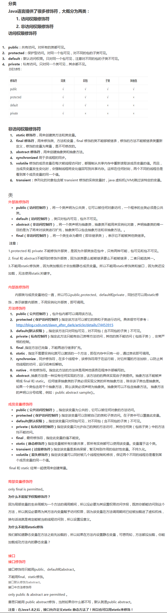

## Java的几种引用方式：强引用、软引用、弱引用、虚引用

四种引用类型

JDK1.2 之前，一个对象只有“已被引用”和"未被引用"两种状态，这将无法描述某些特殊情况下的对象，比如，当内存充足时需要保留，而内存紧张时才需要被抛弃的一类对象。

所以在 JDK.1.2 之后，Java 对引用的概念进行了扩充，将引用分为了：强引用（Strong Reference）、软引用（Soft Reference）、弱引用（Weak Reference）、虚引用（Phantom Reference）4 种，这 4 种引用的强度依次减弱。

**一，强引用**

Object obj = new Object(); //只要obj还指向Object对象，Object对象就不会被回收 obj = null; //手动置null

只要强引用存在，垃圾回收器将永远不会回收被引用的对象，哪怕内存不足时，JVM也会直接抛出OutOfMemoryError，不会去回收。如果想中断强引用与对象之间的联系，可以显示的将强引用赋值为null，这样一来，JVM就可以适时的回收对象了

**二，软引用**

软引用是用来描述一些非必需但仍有用的对象。在内存足够的时候，软引用对象不会被回收，只有在内存不足时，系统则会回收软引用对象，如果回收了软引用对象之后仍然没有足够的内存，才会抛出内存溢出异常。这种特性常常被用来实现缓存技术，比如网页缓存，图片缓存等。

在 JDK1.2 之后，用java.lang.ref.SoftReference类来表示软引用。

**三，弱引用**

弱引用的引用强度比软引用要更弱一些，无论内存是否足够，只要 JVM 开始进行垃圾回收，那些被弱引用关联的对象都会被回收。在 JDK1.2 之后，用 java.lang.ref.WeakReference 来表示弱引用。

**四，虚引用**

虚引用是最弱的一种引用关系，如果一个对象仅持有虚引用，那么它就和没有任何引用一样，它随时可能会被回收，在 JDK1.2 之后，用 PhantomReference 类来表示，通过查看这个类的源码，发现它只有一个构造函数和一个 get() 方法，而且它的 get() 方法仅仅是返回一个null，也就是说将永远无法通过虚引用来获取对象，虚引用必须要和 ReferenceQueue 引用队列一起使用。

 

## Java ThreadLocal

## Java反射

反射具有的功能

## RMI

通信协议：TCP/IP

## Java字符编码二和国际化

## Java Spring概念

## Hibernate  延迟加载

Hibernate pojo的状态

 

## 会话跟踪技术


 

# Android

## 系统架构

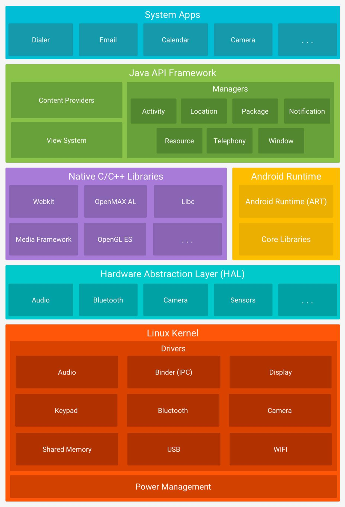

## 四大组件及其生命周期

### Acitivity

#### 生命周期

#### 启动模式

#### 启动方式

#### 不同启动方式下生命周期会走哪些

#### onSaveInstanceState

#### Activity切换过车中的生命周期的跳转

### Service

#### 生命周期

#### 启动方式

#### IntentService

 

### Broadcast Receiver

### Content Provider

## 进程

### 前台进程

### 可见进程

### 后台进程

### 不可见进程

## 设备分辨率

### 屏幕密度

### 不同的View建议显示方式以及其区别

## Handler

### 概念

## Intent

### 概念

 

## 进程间通信

### Socket

### Aidl

### Messenger

### Content Provider

### Shared Preference

## 并发

### AsyncTask

## 动画

### 属性动画

### 帧动画

### 补间动画

## DVM

### 概念

### 和linux进程的区别

 

## ART

## 异常分析

### Force Close

强制关闭的原因： 

 

 1.Error

   OOM(out of memory error)

   StackOverFlowError

 2.RuntimeException

### ANR

## View

### View继承树

### Window

### 渲染

### 控件

 

## 布局

RelativeLayout

LinearLayout

FrameLayout

TableLayout

AbsoluteLayout

ConstraintLayout

## 通知（Notification）

## 自定义组件

### 自定义布局

### 自定义样式

## 通用组件

### MVC

### LayoutInflater

### 日志

### Gradle

### 目录架构

#### AndroidManifest.xml

 

## 框架

## 权限申请

## 数字签名


 

# 算法&数据结构

## 算法结构

一个算法应该具有以下五个重要的特征：

**有穷性**

（Finiteness）

算法的有穷性是指算法必须能在执行有限个步骤之后终止；

**确切性**

(Definiteness)

算法的每一步骤必须有确切的定义；

**输入项**

(Input)

一个算法有0个或多个输入，以刻画运算对象的初始情况，所谓0个输入是指算法本身定出了初始条件；

**输出项**

(Output)

一个算法有一个或多个输出，以反映对输入数据加工后的结果。没有输出的算法是毫无意义的；

**可行性**

(Effectiveness)

算法中执行的任何计算步骤都是可以被分解为基本的可执行的操作步，即每个计算步都可以在有限时间内完成（也称之为有效性）。

 

## 算法复杂度计算

## 查找


各种查找算法的速度：

顺序查找，时间复杂度O(N),

分块查找，时间复杂度O(logN+N/m);

折半查找，时间复杂度O(logN)

哈希查找，时间复杂度O(1)

索引查找

### 二分查找

时间复杂度计算

二分法每次比较会去掉一半的数据，也就是说比较次数为n,数据为m个则2^n>=m,m=log(N),时间复杂度为O(log(N))

二叉树的构建

 

### 深度搜索

### 散列函数

### 线性序列

## 最短路径

Dijkasta

Floyd

## 斐波那契数列

## 线段树

## 快状链表


 

# 计算机系统


 

# Other

## JSP分页代码中的步骤

1、count(*)得到总记录数

2、计算总页数

3、获取所有记录(**个人感觉这一步不需要，可以直接获取指定页数数据**)

4、过滤显示本页数据

 

DBMS:

原子性：事务是一组不可分割的操作单元，这组单元要么同时成功要么同时失败（由DBMS的事务管理子系统来实现）；

一致性：事务前后的数据完整性要保持一致（由DBMS的完整性子系统执行测试任务）；

隔离性:多个用户的事务之间不要相互影响，要相互隔离（由DBMS的并发控制子系统实现）；

持久性:一个事务一旦提交，那么它对数据库产生的影响就是永久的不可逆的，如果后面再回滚或者出异常，都不会影响已提交的事务（由DBMS的恢复管理子系统实现的）

 

## Struts框架

## 无效等价类

 

## Pipe管道通信