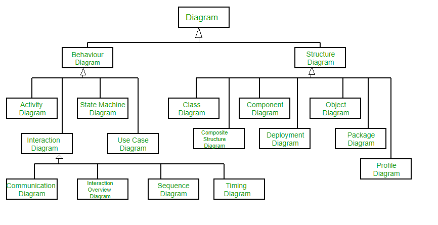

**Unified Modeling Language(UML)**是一个通用建模语言。UML的主要目的是为了定义一个标准的方式，以使得系统的设计能够被可视化。这和其他工程领域中的蓝图十分相似。

UML并不是一个编程语言，而是一种可视化语言。我们使用UML图来描述系统的行为和结构。UML帮助软件工程师，商人以及系统架构师进行建模，设计和分析。对象管理组织（Object Management Group-OMG）在1997年采用统一建模语言作为标准。此后一直由OMG管理。国际化标准组织（ISO）在2005年发布了UML作为批准的标准。多年来，UML进行修订并定期进行审查。

# **我们真的需要UML么？**

* 复杂的应用程序需要来自多个团队的协作和计划，因此需要一种清晰简洁的方法来在他们之间进行沟通；
* 商人不懂代码。因此，UML对于非程序员进行系统的基本要求，功能和流程方面的交流变的至关重要；
* 当团队能够看到系统的流程，用户交互和静态结构时，可以节省大量的时间。

UML和面向对象的设计和分析联系在一起。UML利用元素和元素之间的关联来形成图表。UML中的图可大致分为：

1. 结构图-捕获系统的静态方面或结构。结构图包括：组件图，对象图，类图和部署图
2. 行为图-捕获系统的动态方面或行为。行为图包括：用例图，状态图，活动图和交互图。

下面的一张图根据UML2.2展示了图的层级结构：

# **UML中用到的面向对象的概念**

1. **类-**类定义了蓝图，即对象的结构和功能。
2. **对象-**对象帮助我们分解大型系统并帮助我们模块化系统。模块化有助于将系统划分为易于理解的组件，以便我们可以逐步构建系统。对象是用于描述实体的系统的基本单元（构造块）
3. **继承-**继承是子类继承父类的一种机制
4. **抽象-**一种对用户隐藏具体实现细节的机制
5. **封装-**将数据绑定在一起并保护器不受外界干扰
6. **多态-**一种功能或实体能够以不同形式存在的机制

# **UML2.0中附加功能**

诸如敏捷开发之类的软件开发方法已经被并入，且最初的UML规范的范围也得到了了相应的扩展。

最初UML执行了9中图表。UML2.x将图的数量从9个增加到了13个。添加的四个图分别是：时序图，通信图，交互概述图和复合结构图。UML2.x将状态图（state chart）重新命名为状态机图（state machine diagrams）。UML2.x添加了将软件系统分解为组件和子组件的功能。

# UML优点

* 简化复杂的软件设计，可以实现类似OOP之类的概念，被广泛使用
* 在一些图形图表中，减少了数以千计的解释，可能会减少理解的时间
* 使得交流更加清晰和真实
* 有助于获取整个系统视图
* 对于软件开发人员来说，一旦他们清楚第了解了问题，实现实际的需求变得非常容易

# 结构图

## 类图

UML图用的最广泛的是类图。它是所有面向对象软件系统的构建块。我们使用类图通过显示系统的类，方法和属性来描述系统的静态结构。类图还帮助我们识别不同类或对象之间的关系。

## 复合结构图

我们使用复合结构图来表示类的内部结构及其与系统其它部分的交互点。复合结构图表示部件及其配置之间的关系，这些关系决定了分类器（类，组件或部署点）的行为方式。它们表示利用零件，端口和连接器的结构化分类器的内部结构。我们还可以使用复合结构图为协作建模。它们与类图相似，但与整个类相比，它们详细表示了各个部分。

## 对象图

对象图可以被看做系统中实例及其之间存在关系的快照。由于对象图描述了实例化对象时的行为，因此我们能够研究特定时刻的系统行为。对象图类似于类图，只不过它显示了系统中类的实例。我们使用类图来描述实际的分类器及其关系。另一方面，对象图表示类的特定实例以及他们在某个某个时间点之间的关系。

## 组件图

组件图用于表示系统中物理组件的组织方式。我们使用它们来建模实现细节。组件图描述了软件系统之间的结构关系，并帮助我们理解功能需求是否包含在计划的开发中。当我们设计和构建复杂的系统时，组件图就变得至关重要。系统的组件使用接口相互通信。

## 部署图

部署图用于表示系统硬件及其软件。他告诉我们存在哪些硬件组件以及在其上运行的软件组件。我们将系统架构说明为软件产品在分布式目标上的分布。产品是系统软件生成的信息。它们主要用于在具有不同配置的多台计算机上使用，分发或部署软件时使用。

## 包图

我们使用包图来描述包及其元素的组织方式。包图只是向我们展示了不同包之间的依赖关系以及包的内部组成。软件包可以帮助我们将UML图组织成有意义的组，并使图易于理解。它们主要用于组织类和用例图。

# 行为图

## 状态机图

状态图用于表示某时刻有限实例上系统或系统部分的状态。这是一个行为图，它使用有限的状态来表示行为。状态图也称为**状态机**和**状态图**。这些术语通常可以互换。简单地说，状态图用来对类的动态行为进行建模，以对时间和外部的刺激变化作出响应。

## 活动图

我们使用活动图来说明系统中的控制流。我们还可以使用活动图来表示用例执行过程中所涉及的步骤。我们使用活动图对顺序活动和并发活动进行建模。因此，我们基本上是使用活动图直观地描述工作流，活动图股关注流程的状况及其发生的顺序。我们使用活动图描述或描绘导致特定事件的原因。

## 用例图

用例图用于描述系统或系统一部分的功能。它们被广泛用于说明系统的功能需求及其与外部代理之间的交互。用例基本上是表示可供系统使用的不同方案的图。用例图为我们提供了系统或系统一部分功能的高级视图，而无需深入了解实现细节。

## 序列图

序列图仅按顺序描述对象之间的交互，即这些交互发生的顺序。我们也可以使用事件图或者事件场景这一术语来指代序列图。序列图描述了系统功能中对象的方式和顺序。这些图被商人和软件开发人员广泛用来记录和理解新系统和现有系统的需求。

## 通信图

通信图（在UML1.x中称为协作图）用于显示对象之间交换的顺序消息。通信图主要关注对象及其关系。我们可以使用序列图表示相似的信息，但是通信图以自由形式表示对象和链接。

## 时序图

时序图是序列图的一种特殊形式，用于描述对象在一定时间范围内的行为。我们使用它们来显示时间和持续约束，这些约束控制状态和对象行为的变化。

## 交互概述图

交互概述图对一系列动作进行建模，并帮助我们将复杂的交互简化为更简单的事件。它是活动图和序列图的混合。