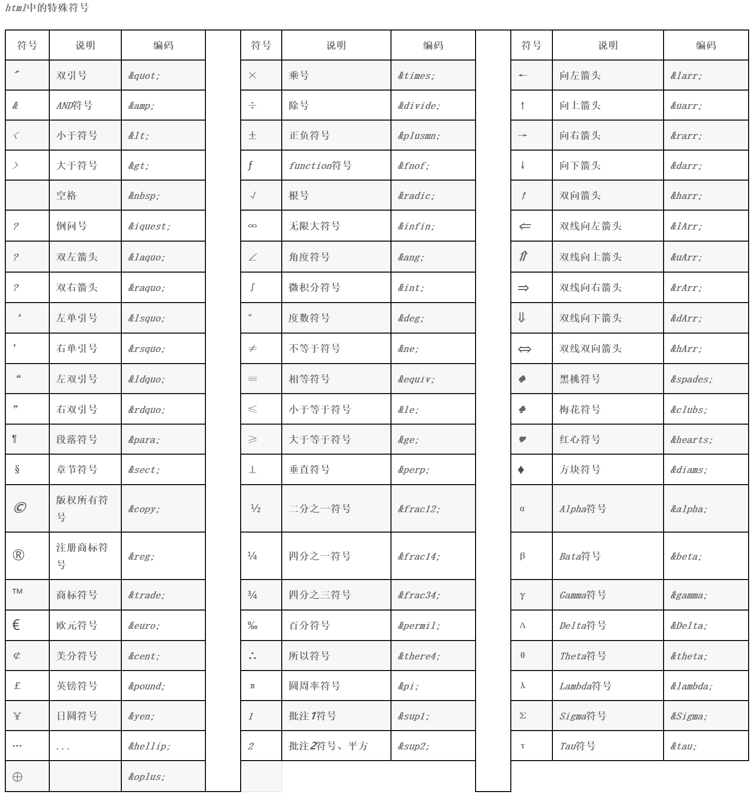

# 一、标题

在想要设置为标题的文字前面加#来表示
 一个#是一级标题，二个#是二级标题，以此类推。支持六级标题。

注：标准语法一般在#后跟个空格再写文字，貌似简书不加空格也行。

示例：

```bash
# 这是一级标题
## 这是二级标题
### 这是三级标题
#### 这是四级标题
##### 这是五级标题
###### 这是六级标题
```

# 二、字体

## 加粗

要加粗的文字左右分别用两个*号包起来

## 斜体

要倾斜的文字左右分别用一个*号包起来

## 斜体加粗

要倾斜和加粗的文字左右分别用三个*号包起来

## 删除线

要加删除线的文字左右分别用两个~~号包起来

示例：

```undefined
**这是加粗的文字**
*这是倾斜的文字*`
***这是斜体加粗的文字***
~~这是加删除线的文字~~
```

效果如下：

**这是加粗的文字**
 *这是倾斜的文字*
 ***这是斜体加粗的文字\***
 ~~这是加删除线的文字~~

------

# 三、引用

在引用的文字前加>即可。引用也可以嵌套，如加两个>>三个>>>
 n个...

示例：

```ruby
>这是引用的内容
>>这是引用的内容
>>>>>>>>>>这是引用的内容
```

效果如下：

> 这是引用的内容
>
> > 这是引用的内容
> >
> > > > > > > > > > 这是引用的内容

# 四、分割线

三个或者三个以上的 - 或者 * 都可以。

示例：

```undefined
---
----
***
*****
```

效果如下：
 可以看到，显示效果是一样的。

------

------

------

------

# 五、图片

语法：

```bash


图片alt就是显示在图片下面的文字，相当于对图片内容的解释。
图片title是图片的标题，当鼠标移到图片上时显示的内容。title可加可不加
```

示例：

```cpp

```

效果如下：


blockchain

**上传本地图片直接点击导航栏的图片标志，选择图片即可**

# 六、超链接

语法：

```csharp
[超链接名](超链接地址 "超链接title")
title可加可不加
```

示例：

```csharp
[简书](http://jianshu.com)
[百度](http://baidu.com)
```

效果如下：

[简书](https://www.jianshu.com/u/1f5ac0cf6a8b)
[百度](http://baidu.com)

注：Markdown本身语法不支持链接在新页面中打开，貌似简书做了处理，是可以的。别的平台可能就不行了，如果想要在新页面中打开的话可以用html语言的a标签代替。

```xml
<a href="超链接地址" target="_blank">超链接名</a>

示例
<a href="https://www.jianshu.com/u/1f5ac0cf6a8b" target="_blank">简书</a>
```

------

# 七、列表

## 无序列表

语法：
 无序列表用 - + * 任何一种都可以

```undefined
- 列表内容
+ 列表内容
* 列表内容

注意：- + * 跟内容之间都要有一个空格
```

效果如下：

- 列表内容

- 列表内容

- 列表内容

## 有序列表

语法：
 数字加点

```undefined
1.列表内容
2.列表内容
3.列表内容

注意：序号跟内容之间要有空格
```

效果如下：

1.列表内容
2.列表内容
3.列表内容

## 列表嵌套

**上一级和下一级之间敲三个空格即可**

- 一级无序列表内容
  - 二级无序列表内容
  - 二级无序列表内容
  - 二级无序列表内容
- 一级无序列表内容
  1. 二级有序列表内容
  2. 二级有序列表内容
  3. 二级有序列表内容

1. 一级有序列表内容
   - 二级无序列表内容
   - 二级无序列表内容
   - 二级无序列表内容
2. 一级有序列表内容
   1. 二级有序列表内容
   2. 二级有序列表内容
   3. 二级有序列表内容

# 八、表格

语法：

```ruby
表头|表头|表头
---|:--:|---:
内容|内容|内容
内容|内容|内容

第二行分割表头和内容。
- 有一个就行，为了对齐，多加了几个
文字默认居左
-两边加：表示文字居中
-右边加：表示文字居右
注：原生的语法两边都要用 | 包起来。此处省略
```

示例：

```ruby
姓名|技能|排行
--|:--:|--:
刘备|哭|大哥
关羽|打|二哥
张飞|骂|三弟
```

效果如下：

| 姓名 | 技能 | 排行 |
| ---- | :--: | ---: |
| 刘备 |  哭  | 大哥 |
| 关羽 |  打  | 二哥 |
| 张飞 |  骂  | 三弟 |

# 九、代码

语法：
 单行代码：代码之间分别用一个反引号包起来

```go
    `代码内容`
```

代码块：代码之间分别用三个反引号包起来，且两边的反引号单独占一行

```go
(```)
  代码...
  代码...
  代码...
(```)
```

> 注：为了防止转译，前后三个反引号处加了小括号，实际是没有的。这里只是用来演示，实际中去掉两边小括号即可。

示例：

单行代码

```go
`create database hero;`
```

代码块

```kotlin
(```)
    function fun(){
         echo "这是一句非常牛逼的代码";
    }
    fun();
(```)
```

效果如下：

单行代码

```
create database hero;
```

代码块

```kotlin
function fun(){
  echo "这是一句非常牛逼的代码";
}
fun();
```

# 十、流程图

~~~php
```flow
st=>start: 开始
op=>operation: My Operation
cond=>condition: Yes or No?
e=>end
st->op->cond
cond(yes)->e
cond(no)->op
&```
~~~

效果如下：

 ```flow
st=>start: 开始
op=>operation: My Operation
cond=>condition: Yes or No?
e=>end
st->op->cond
cond(yes)->e
cond(no)->op
 ```

# 十一、特殊符号

上标的HTML标签的是< sup >，所以如果要打上标的话就用以下格式：

```xml
<sup>xxx</sup>
```

其中xxx表示上标的内容，看个例子：
我现在想写一个公式：n的平方等于n+1，写法如下：

```xml
n<sup>2</sup>=n+1
```

显示效果就是：n<sup>2</sup>=n+1
是不是很简单？

下标的标签是< sub >，同理我们来实现一个例子：a=log2b
 写法如下：

```xml
a=log<sub>2</sub>b
```

还有一些特殊的、键盘上没有的符号也可以打出来，比如注册商标的符号：立白®

```undefined
立白&reg;
```

function符号:ƒ可以轻松得打出函数式：ƒ(x)=x+1

```undefined
&fnof;(x)=x+1
```

根号，不过这个根号不完美，少了上面一横，更像对勾：√5

```undefined
&radic;5
```

角度符号：30°

```undefined
30&deg;
```

以及更多的特殊符号都可以打出，就不一一列举了，想要了解更多特殊符号的打法请查阅下面这个链接：[HTML中的特殊符号](https://link.jianshu.com?t=http://blog.csdn.net/html5_/article/details/21639475)



# 十二 文内跳转


# 十三 字体

### 1.语法

Markdown中通过`font`标签实现字体、字号及颜色配置。语法如下

```
<font face="字体" size="字号" color="颜色">这里是需要突出显示的内容</font>1
```

说明：

- 字体：一般的字体都支持，如 **黑体**、**宋体**、**微软雅黑**、**楷体**、**隶书**等等。
- 字号：取值范围[1-7],默认为3。
- 颜色：支持颜色名(如**red**)、十六进制颜色值(如**#00FFFF**)和rgb颜色值(如**0,255,0**)。

### 2.常用颜色清单

| 序号 | 语法                                      | 实例         | 说明                                     |
| ---- | ----------------------------------------- | ------------ | ---------------------------------------- |
| 1    | `<font color="red">**注意事项**</font>`   | **注意事项** | 一般用来用于强调、注意事项、错误做法等。 |
| 2    | `<font color="green">**正确代码**</font>` | **正确代码** | 一般用来用于强调、注意事项、正确做法等。 |
| 3    | `<font color="cyan">**强调**</font>`      | **强调**     | 一般用来用于强调等。                     |

# 十四 上标、下标

Markdown一个套兼容HTML的语法，所以使用HTML中下标下标的语法即可。
 Markdown Language is a superset of HTML, so you can use html tag **sub,sup** to achieve this.

写法

```xml
H<sub>2</sub>O  CO<sub>2</sub>
爆米<sup>TM</sup>
```

效果

> H<sub>2</sub>O  CO<sub>2</sub>
> 爆米<sup>TM</sup>