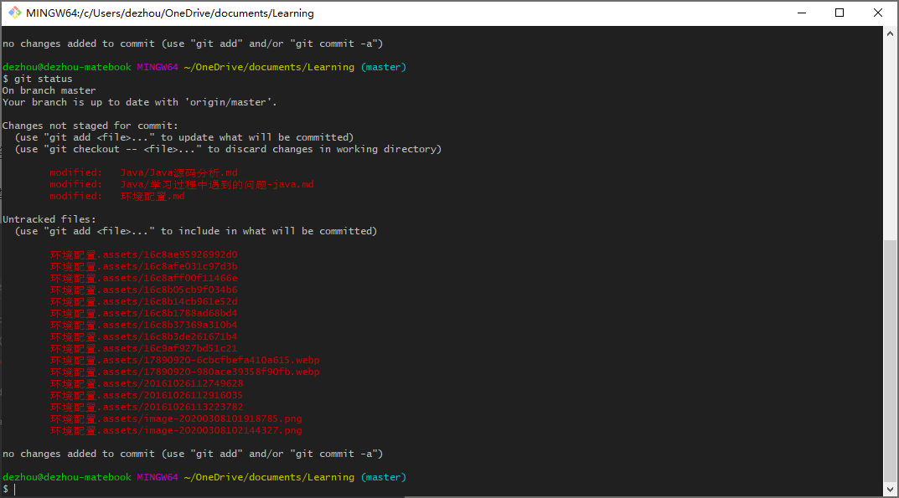
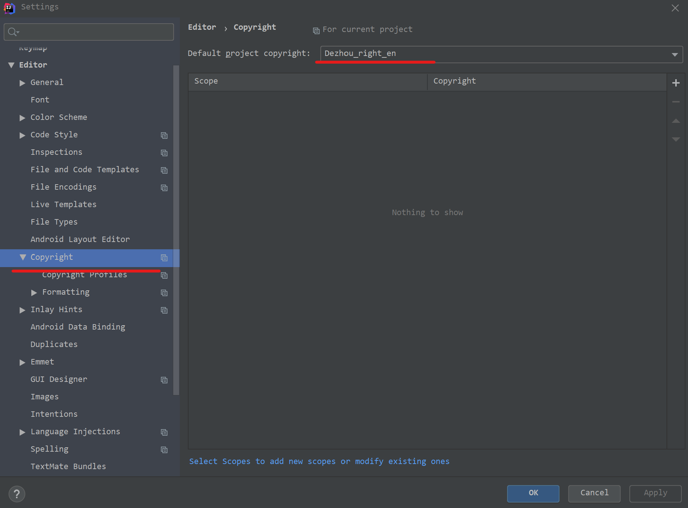
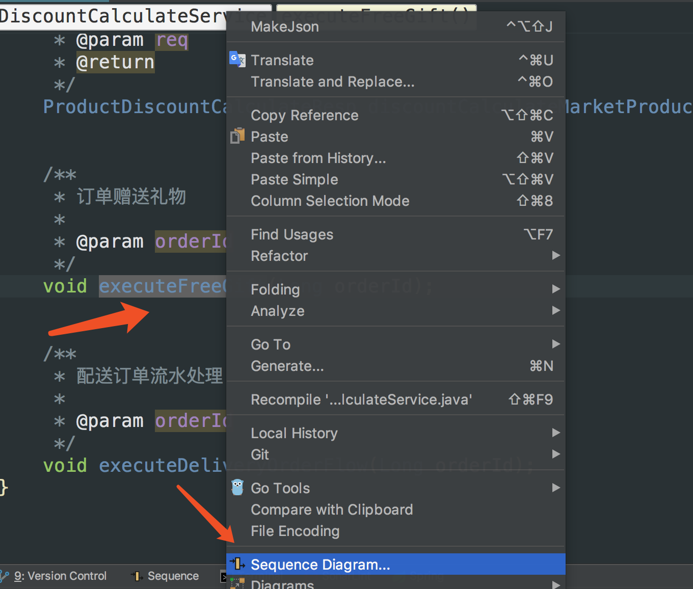
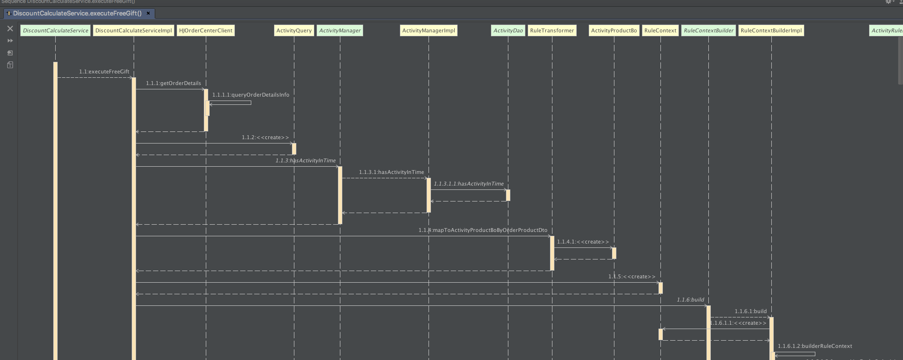
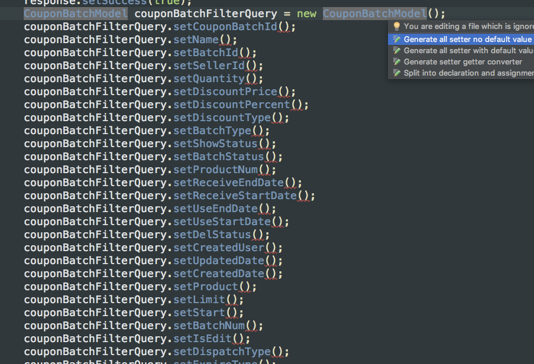

# Git

## git bash中文显示成数字


git config --global core.quotepath false




# Intellij环境配置问题

## Intellij Idea 配置copyright和类头

### copyright

File->Setting->Copyright->Copyright Profiles,点击+号按钮，输入合法的copyright信息，点击validate，合格后，点击apply；

点击上一层的Copyright，Default project copyright，选择刚刚创建的coptright后点击应用。




### 类头信息

Editor下的File and Code Templates，然后点击右侧的Includes，选择File Header进行编辑，编辑的内容如右侧所示，然后点击Apply即可。

```
/**
 * @Description 
 * @author      Zhang Dezhou
 * @date        ${DATE} ${TIME}
 */
```


## 设置自动导包

首先，点击左上角的 “File”，选择 “settings”，或直接按快捷键Ctrl+Alt+s

选择“Editor”-“general”-“auto import”

在右侧将空勾选


## 插件工具

### **1. ignore**

经常使用git的同学对于ignore一定不会陌生，我们可以在该文件中设置一些忽略提交的规则。

通过该插件可以生成各种ignore文件，一键创建git ignore文件的模板，解决了手动去配置的麻烦。


### **2. p3c**

阿里巴巴出品的java代码规范插件

可以扫描整个项目 找到不规范的地方 并且大部分可以自动修复

更多可以查看 [https://github.com/alibaba/p3c/tree/master/idea-plugin](https://links.jianshu.com/go?to=https%3A%2F%2Fgithub.com%2Falibaba%2Fp3c%2Ftree%2Fmaster%2Fidea-plugin)

### **3. GsonFormat**

一键根据json文本生成java类 非常方便


### **4. VisualVM Launcher**

运行java程序的时候启动visualvm，方便查看jvm的情况 比如堆内存大小的分配

某个对象占用了多大的内存，jvm调优必备工具


### 5. 时序图生成工具：SequenceDiagram

有的时候，我们需要梳理业务逻辑或者阅读源码。从中，我们需要了解整个调用链路，反向生成 UML 的时序图是强需求。其中，SequenceDiagram 插件是一个非常棒的插件。

官方详细介绍地址 https://plugins.jetbrains.com/plugin/8286-sequencediagram

比如：你想看某个方法的执行流程，可以选择右键这个方法接口或者方法实现



立即生成时序图



### 6. 快捷键提示工具：Key promoter X

官方详细介绍地址 https://plugins.jetbrains.com/plugin/9792-key-promoter-x

这个插件什么用呢？举个例子，你想看某个方法内部实现的时候，如果你不用快捷键，你会这样鼠标点：


如果你安装了这个插件，你每次这样鼠标点击后，开发工具右下角会提示你，使用快捷键：


安装这个插件后，快捷键用的飞起来。

### 7. CodeGlance 插件

当你的类上千行的时候，在你往下拖拽找对象的时候，是不是感觉挺累的，有个这个插件，可以查看缩略图一样，快速切换到自己需要去的地方，飞翔的感觉。

官方详细介绍地址 https://github.com/Vektah/CodeGlance

安装后显示效果图如下：


### 8. JUnitGenerator V2.0 自动生成单元测试代码

编写单元测试是好的开发者的习惯，但是怎么提高你代码的效率，单元测试代码可否自动生成，这个插件就是帮我们做这事情。

修改JUnitGenerator V2.0 的配置，Settings下的 Other Settings 修改下模版和更新配置


设置成功后，就可以根据方法或者类生成单元测试模版了：


### 9. GenerateAllSetter 插件

当你进行对象之间赋值的时候，有没有觉得好麻烦，能不能有一个更好的办法呢~ 有，只要你选中需要生成set方法的对象，按下快捷键 alt+enter 界面如下：



有没有感觉很厉害， 官方详细介绍地址 https://plugins.jetbrains.com/plugin/9360-generateallsetter

### 10. sonarlint 代码质量管理

找出你的代码隐藏bug或者坏味道

官方详细介绍地址 http://intellij.sonarlint.org

可以选择你要执行的代码类或者项目执行就可以类，下面会列出结果和意见


### 11. CheckStyle

CheckStyle-IDEA

### 12. spellcheck

Grazie

Elixir

### 13.JavaDoc

# Visual Studio 环境配置

## 插件工具

### 设置tab为4空格

### 设置代码列限制线Editor Guidelines

https://marketplace.visualstudio.com/items?itemName=PaulHarrington.EditorGuidelines

### 安装代码规范检查工具Sonar

https://marketplace.visualstudio.com/items?itemName=SonarSource.SonarLintforVisualStudio2019


## Visual Studio+VAssistX自动添加注释，函数头注释，文件头注释

在VAssistX中为C++提供了比较规范注释模板，用这个注释模板为编写的C++代码添加注释是很便捷的选择，操作起来也很简单，具体方法和步骤如下：

### 1.增加函数头注释


之后注释模板中编辑自己需要的注释内容：


编辑好注释模板之后将输入光标定位到需要添加注释的C++函数，然后右键进行添加


右击函数名，然后依次点击“Refacto”–>“Document Method”，这个时候函数头注释就会蹦出来，不过这个注释的格式是默认的，想修改注释格式，可以通过以下方法。

点击 “VAssistX”–>“Visual VAssistX Options”然后选择Suggestions,再点击“Edit VA Snippets”。
在打开的窗口中选择Refactor Document Method，在这就可以更改你的显示样式了。可以参照默认的注释格式来定制自己的注释：

```c++
/*!
*@brief  
*@author %USERNAME%
*@date   $YEAR$年$MONTH$月$DAY$日
*@param[out] 
*@param[in]  $MethodArg$  
*@return     $SymbolType$  
*/
```

### 2.增加文件头注释 

要想在文件头添加注释，需要
把鼠标光标定位到VS编辑器的第一行，点击 “VAssistX”–>“Insert VA Snippet…”—>“File Header Detail”，即可增加文件头注释。默认的注释格式如下，可以通过点击“VAssistX”–>“Visual VAssistX Options”—>“Advanced”—>“Suggestions”—>“Edit VA Snippets”，选择你相应语言的“File Header Detail”修改。

```c++
/********************************************************************
/*!
 * \file client.cpp
 *
 * \author TerryTian
 * \mail tianhaohust@gmail.com
 * \date 九月 2016
 *
 * 
 */
*********************************************************************/
```


# Ubuntu

## Window中删除ubuntu开机启动项

在Win10删除Ubuntu时直接删除分区后，对于启动项(EFI)的处理
 一、
 1、用win+R打开diskpart.exe
 2、输入list disk，查看磁盘状态
 3、根据容量选择win10系统盘：select disk 0
 4、输入list partition，查看分区情况
 5、选择类型为“系统”的分区：select partition 1
 6、输入assign letter=p，将该分区命名为“p”，出现在“我的电脑”中（可以到“我的电脑”中查看，但是即使以管理员权限也不能进入）

二、
 1、以管理员权限打开cmd
 2、此时可以用dos命令操作p盘：cd进入目录，dir查看目录，cd删除文件，rd删除文件夹（空），rd /s /q删除文件夹及文件
 3、下面为执行的命令
 （1）p:
 （2）dir
 （3）cd EFI
 （4）dir（此时能看到一个名为Ubuntu的文件夹）

 （5）rd /s /q ubuntu（注意空格）
 （6）dir（可以看到Ubuntu文件夹已经删除）
 （7）remove letter=p（在diskpart中运行;不再为p盘命名）


## Ubuntu切换阿里源

请注意：Ubuntu 20.04 已于4月23日发布正式版本。
请注意：发现有些软件比如ckermit，仓库里还没有，升级及换源自行斟酌。

### 1 备份原来的源

```
cp -ra /etc/apt/sources.list /etc/apt/sources.list.bak
```

### 2 搞清楚ubuntu的代号

比如：
4.10 Warty Warthog(长疣的疣猪)
5.04 Hoary Hedgehog(灰白的刺猬)
5.10 Breezy Badger(活泼的獾)

6.06(LTS) Dapper Drake(整洁的公鸭)
6.10 Edgy Eft(急躁的水蜥)
7.04 Feisty Fawn(坏脾气的小鹿)
7.10 Gutsy Gibbon(勇敢的长臂猿)

8.04(LTS) Hardy Heron(耐寒的苍鹭)
8.10 Intrepid Ibex (勇敢的野山羊)
9.04 Jaunty Jackalope(得意洋洋的怀俄明野兔)
9.10 Karmic Koala(幸运的考拉)

10.04(LTS) Lucid Lynx(清醒的猞猁)
10.10 Oneiric Ocelot(梦幻的豹猫)
11.04 Natty Narwhal(敏捷的独角鲸)
11.10 Oneiric Ocelot（有梦的虎猫）

12.04(LTS) Precise Pangolin(精准的穿山甲)
12.10 Quantal Quetzal(量子的绿咬鹃)
13.04 Raring Ringtail(铆足了劲的猫熊)
13.10 Saucy Salamander(活泼的蝾螈)

14.04(LTS) Trusty Tahr (可靠的塔尔羊)(LTS)
14.10 Utopic Unicorn(乌托邦独角兽)
15.04 Vivid Vervet (活泼的小猴)
15.10 Wily Werewolf (狡猾的狼人)

16.04(LTS) Xenial Xerus (好客的非洲地松鼠)
16.10 Yakkety Yak（牦牛）
17.04 Zesty Zapus(开心的跳鼠)
17.10 Artful Aardvark(机灵的土豚)

18.04(LTS) Bionic Beaver（仿生海狸）
18.10 Cosmic Cuttlefish（宇宙墨鱼）
19.04 Disco Dingo（舞动的灵犬）
19.10 Eoan Ermine（白貂）

20.04(LTS) Focal Fossa（专注的马达加斯加长尾狸猫）
…
要知道当前系统的代号，可以用以下命令：

```
lsb_release -a
```

### 3 检查阿里源看下这个源存在不存在

http://archive.ubuntu.com/ubuntu/dists/

可以看到，现在已经有了ubuntu 20.04(代号focal)的源。

### 4 然后以下面的为模板进行更换

把’TODO’的地方换成上面的Codename

```
deb http://mirrors.aliyun.com/ubuntu/ TODO main restricted universe multiverse
deb-src http://mirrors.aliyun.com/ubuntu/ TODO main restricted universe multiverse

deb http://mirrors.aliyun.com/ubuntu/ TODO-security main restricted universe multiverse
deb-src http://mirrors.aliyun.com/ubuntu/ TODO-security main restricted universe multiverse

deb http://mirrors.aliyun.com/ubuntu/ TODO-updates main restricted universe multiverse
deb-src http://mirrors.aliyun.com/ubuntu/ TODO-updates main restricted universe multiverse

deb http://mirrors.aliyun.com/ubuntu/ TODO-proposed main restricted universe multiverse
deb-src http://mirrors.aliyun.com/ubuntu/ TODO-proposed main restricted universe multiverse

deb http://mirrors.aliyun.com/ubuntu/ TODO-backports main restricted universe multiverse

deb-src http://mirrors.aliyun.com/ubuntu/ TODO-backports main restricted universe multiverse
```

换好20.04的源以后是这样：

```
deb http://mirrors.aliyun.com/ubuntu/ focal main restricted universe multiverse
deb-src http://mirrors.aliyun.com/ubuntu/ focal main restricted universe multiverse

deb http://mirrors.aliyun.com/ubuntu/ focal-security main restricted universe multiverse
deb-src http://mirrors.aliyun.com/ubuntu/ focal-security main restricted universe multiverse

deb http://mirrors.aliyun.com/ubuntu/ focal-updates main restricted universe multiverse
deb-src http://mirrors.aliyun.com/ubuntu/ focal-updates main restricted universe multiverse

deb http://mirrors.aliyun.com/ubuntu/ focal-proposed main restricted universe multiverse
deb-src http://mirrors.aliyun.com/ubuntu/ focal-proposed main restricted universe multiverse

deb http://mirrors.aliyun.com/ubuntu/ focal-backports main restricted universe multiverse
deb-src http://mirrors.aliyun.com/ubuntu/ focal-backports main restricted universe multiverse
```


然后粘贴到刚才的/etc/apt/sources.list里。

### 5 更新缓存和升级

sudo apt-get update
sudo apt-get upgrade