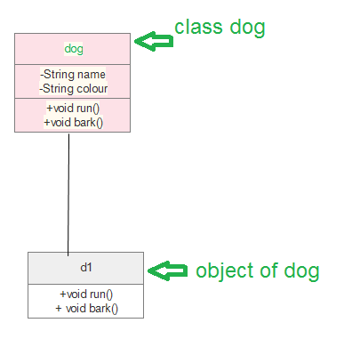
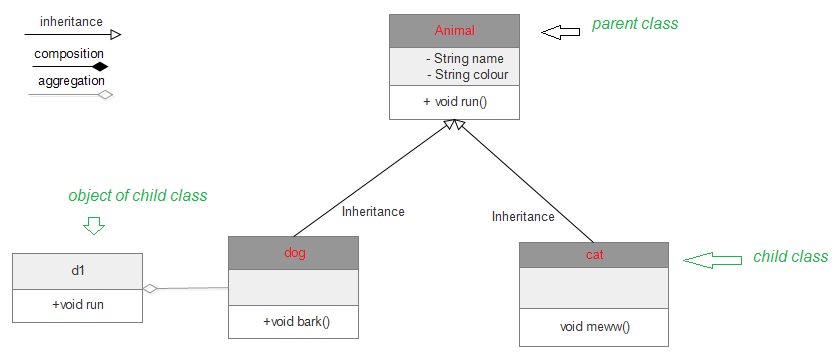
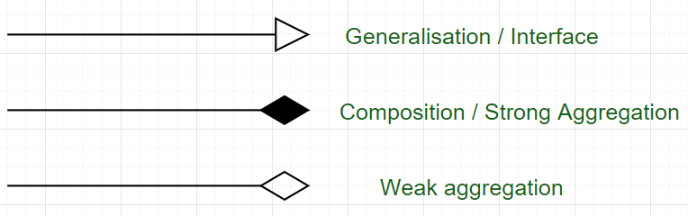

类图是每个面向对象方法的主要构建块。类图可以用来显示类，类之间的关系，接口，类之间的关联和协作关系。由于类是基于OOP的应用程序的构建块，因此类图具有适当的结构来表示类，继承，关系以及OOP在其上下文中具有的所有内容。它描述了各种对象以及它们之间的静态关系。

使用类图的主要目的是：

* 这是一个可以正确描述OOP概念各个方面的UML
* 正确的设计和应用程序分析可以更快，更高效
* 它是部署和组件图的基础

有一些可用的软件，可以在线和离线使用这些软件来绘制这些图，图Edraw max，lucid chart等。在绘制类图时，有几点需要重点关注。这些可以说是其语法：

* 每个类都由一个矩形表示，该矩形具有单个部分，分别是name，attributes以及operation
* 共有三种类型的修饰符，用于确定属性和操作的可见性
  * +表示public可见性（所有可见）
  * #表示protected可见性（同一包中以及派生类）
  * -表示private可见性（只有自己可见）

下面是Animal类（父类）的实例，其有两个子类dog和cat，都继承了父类的属性。



```java
import java.io.*; 
  
class GFG { 
    public static void main(String[] args) 
    { 
        dog d1 = new dog(); 
        d1.bark(); 
        d1.run(); 
        cat c1 = new cat(); 
        c1.meww(); 
    } 
} 
  
class Animal { 
    public void run() 
    { 
        String name; 
        String colour; 
  
        System.out.println("animal is running"); 
    } 
} 
  
class dog extends Animal { 
    public void bark() 
    { 
        System.out.println("wooh!wooh! dog is barking"); 
    } 
    public void run() 
    { 
        System.out.println("dog is running"); 
    } 
} 
  
class cat extends Animal { 
    public void meww() 
    { 
        System.out.println("meww! meww!"); 
    } 
} 
```



类图设计过程：在Edraw max（或者其他可以绘制类图的平台）中有如下步骤：

* 打开一个类图的空白文档
* 从库中选择类图，然后单击创建选项
* 在打开的模板页面中准备类的模型
* 根据要求进行编辑后保存

在创建/编辑模型时，可以有效使用几个图表组件，如下：

* 类{name，attribute，method}
* 对象
* 接口
* 关系{继承，关联，泛化}
* 关联{双向，单向}

类图是在软件工程设计以及商业建模领域被广泛使用的图之一。

箭头准确的含义如下：

