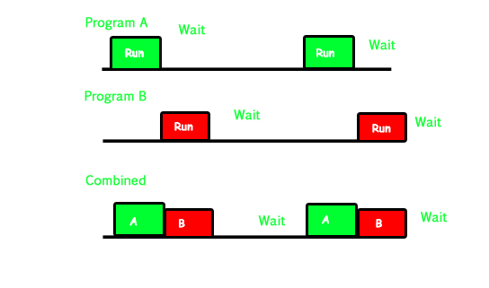

# 进程

## 多道程序设计

多道程序设计技术之前，多个程序串行执行，因此为了CPU的利用率，并且提高系统效率，引入多道程序设计概念；多道程序设计允许多个程序同时进入内存并执行，为了描述这样的执行过程引入了进程的概念

(下面几个问题摘自知乎:https://zhuanlan.zhihu.com/p/31444793)

1. 什么是多道程序系统？

   多道程序系统是在计算机内存中同时存放几道相互独立的程序，使它们在管理程序控制之下，相互穿插的运行 **(系统由一个程序转而运行另一个程序时需要使用中断机构中断正在运行的程序)** 。 两个或两个以上程序在计算机系统中同处于开始和结束之间的状态，这就称为多道程序系统。其技术运行的特征：多道、宏观上**并行**、微观上**串行**。

2. 在多道程序设计系统中，如何理解“内存中的多个程序的执行过程交织在一起，大家都在走走停停”这样一个现象？

   在多道程序设计系统中，内存中存放多个程序，它们以交替的方式使用CPU。因此，从宏观上看，这些程序都开始了自己的工作。但由于CPU只有一个，**在任何时刻CPU只能执行一个进程程序**。所以这些进程程序的执行过程是交织在一起的。也就是说，从微观上看，每一个进程一会儿在向前走，一会儿又停步不前，处于一种“走走停停”的状态之中。

3. 什么是“多道程序设计”技术？它对操作系统的形成起到什么作用？

   所谓“多道程序设计”技术，即是通过软件的手段，允许在计算机内存中同时存放几道相互独立的作业程序，让它们对系统中的资源进行“共享”和“竞争”，以使系统中的各种资源尽可能地满负荷工作，从而提高整个计算机系统的使用效率。基于这种考虑，计算机科学家开始把CPU、存储器、外部设备以及各种软件都视为计算机系统的“资源”，并逐步设计出一种软件来管理这些资源，不仅使它们能够得到合理地使用，而且还要高效地使用。具有这种功能的软件就是“操作系统”。所以，“多道程序设计”的出现，加快了操作系统的诞生。

4. 为什么说批处理多道系统能极大地提高计算机系统的工作效率？

   * 多道作业并行工作，减少了处理器的空闲时间。
   *  作业调度可以合理选择装入主存储器中的作业，充分利用计算机系统的资源。
   * 作业执行过程中不再访问低速设备，而直接访问高速的磁盘设备，缩短执行时间。
   * 作业成批输入，减少了从操作到作业的交接时间。

5. [Multiprogramming, multitasking, multithreading and multiprocessing的区别](https://www.geeksforgeeks.org/difference-between-multitasking-multithreading-and-multiprocessing/)

   ##### 1) Multi programming – A computer running more than one program at a time (like running Excel and Firefox simultaneously).

   In a modern computing system, there are usually several concurrent application processes which want to execute. Now it is the responsibility of the Operating System to manage all the processes effectively and efficiently.
   One of the most important aspects of an Operating System is to multi program.
   In a computer system, there are multiple processes waiting to be executed, i.e. they are waiting when the CPU will be allocated to them and they begin their execution. These processes are also known as jobs. Now the main memory is too small to accommodate all of these processes or jobs into it. Thus, these processes are initially kept in an area called job pool. This job pool consists of all those processes awaiting allocation of main memory and CPU.
   CPU selects one job out of all these waiting jobs, brings it from the job pool to main memory and starts executing it. The processor executes one job until it is interrupted by some external factor or it goes for an I/O task.

   **Non-multi programmed system’s working –**

   - In a non multi programmed system, As soon as one job leaves the CPU and goes for some other task (say I/O ), the CPU becomes idle. The CPU keeps waiting and waiting until this job (which was executing earlier) comes back and resumes its execution with the CPU. So CPU remains free for all this while.
   - Now it has a drawback that the CPU remains idle for a very long period of time. Also, other jobs which are waiting to be executed might not get a chance to execute because the CPU is still allocated to the earlier job.
     This poses a very serious problem that even though other jobs are ready to execute, CPU is not allocated to them as the CPU is allocated to a job which is not even utilizing it (as it is busy in I/O tasks).
   - It cannot happen that one job is using the CPU for say 1 hour while the others have been waiting in the queue for 5 hours. To avoid situations like this and come up with efficient utilization of CPU, the concept of multi programming came up.

   The main idea of multi programming is to maximize the CPU time.
   **Multi programmed system’s working –**

   - In a multi-programmed system, as soon as one job goes for an I/O task, the Operating System interrupts that job, chooses another job from the job pool (waiting queue), gives CPU to this new job and starts its execution. The previous job keeps doing its I/O operation while this new job does CPU bound tasks. Now say the second job also goes for an I/O task, the CPU chooses a third job and starts executing it. As soon as a job completes its I/O operation and comes back for CPU tasks, the CPU is allocated to it.
   - In this way, no CPU time is wasted by the system waiting for the I/O task to be completed.
     Therefore, the ultimate goal of multi programming is to keep the CPU busy as long as there are processes ready to execute. This way, multiple programs can be executed on a single processor by executing a part of a program at one time, a part of another program after this, then a part of another program and so on, hence executing multiple programs. Hence, the CPU never remains idle.

   In the image below, program A runs for some time and then goes to waiting state. In the mean time program B begins its execution. So the CPU does not waste its resources and gives program B an opportunity to run.

   

   ##### **2). Multiprocessing –** A computer using more than one CPU at a time.

   In a uni-processor system, only one process executes at a time.
   Multiprocessing is the use of two or more CPUs (processors) within a single Computer system. The term also refers to the ability of a system to support more than one processor within a single computer system. Now since there are multiple processors available, multiple processes can be executed at a time. These multi processors share the computer bus, sometimes the clock, memory and peripheral devices also.

   **Multi processing system’s working –**

   - With the help of multiprocessing, many processes can be executed simultaneously. Say processes P1, P2, P3 and P4 are waiting for execution. Now in a single processor system, firstly one process will execute, then the other, then the other and so on.
   - But with multiprocessing, each process can be assigned to a different processor for its execution. If its a dual-core processor (2 processors), two processes can be executed simultaneously and thus will be two times faster, similarly a quad core processor will be four times as fast as a single processor.

   **Why use multi processing –**

   - The main advantage of multiprocessor system is to get more work done in a shorter period of time. These types of systems are used when very high speed is required to process a large volume of data. Multi processing systems can save money in comparison to single processor systems because the processors can share peripherals and power supplies.
   - It also provides increased reliability in the sense that if one processor fails, the work does not halt, it only slows down. e.g. if we have 10 processors and 1 fails, then the work does not halt, rather the remaining 9 processors can share the work of the 10th processor. Thus the whole system runs only 10 percent slower, rather than failing altogether.

   

   Multiprocessing refers to the hardware (i.e., the CPU units) rather than the software (i.e., running processes). If the underlying hardware provides more than one processor then that is multiprocessing. It is the ability of the system to leverage multiple processors’ computing power.

   **Difference between Multi programming and Multi processing –**

   - A System can be both multi programmed by having multiple programs running at the same time and multiprocessing by having more than one physical processor. The difference between multiprocessing and multi programming is that Multiprocessing is basically executing multiple processes at the same time on multiple processors, whereas multi programming is keeping several programs in main memory and executing them concurrently using a single CPU only.
   - Multiprocessing occurs by means of parallel processing whereas Multi programming occurs by switching from one process to other (phenomenon called as context switching).

   ##### **3). Multitasking –** Tasks sharing a common resource (like 1 CPU).

   As the name itself suggests, multi tasking refers to execution of multiple tasks (say processes, programs, threads etc.) at a time. In the modern operating systems, we are able to play MP3 music, edit documents in Microsoft Word, surf the Google Chrome all simultaneously, this is accomplished by means of multi tasking.

   Multitasking is a logical extension of multi programming. The major way in which multitasking differs from multi programming is that multi programming works solely on the concept of context switching whereas multitasking is based on time sharing alongside the concept of context switching.

   **Multi tasking system’s working –**

   - In a time sharing system, each process is assigned some specific quantum of time for which a process is meant to execute. Say there are 4 processes P1, P2, P3, P4 ready to execute. So each of them are assigned some time quantum for which they will execute e.g time quantum of 5 nanoseconds (5 ns). As one process begins execution (say P2), it executes for that quantum of time (5 ns). After 5 ns the CPU starts the execution of the other process (say P3) for the specified quantum of time.
   - Thus the CPU makes the processes to share time slices between them and execute accordingly. As soon as time quantum of one process expires, another process begins its execution.
   - Here also basically a context switch is occurring but it is occurring so fast that the user is able to interact with each program separately while it is running. This way, the user is given the illusion that multiple processes/ tasks are executing simultaneously. But actually only one process/ task is executing at a particular instant of time. In multitasking, time sharing is best manifested because each running process takes only a fair quantum of the CPU time.

   In a more general sense, multitasking refers to having multiple programs, processes, tasks, threads running at the same time. This term is used in modern operating systems when multiple tasks share a common processing resource (e.g., CPU and Memory).

   

   - As depicted in the above image, At any time the CPU is executing only one task while other tasks are waiting for their turn. The illusion of parallelism is achieved when the CPU is reassigned to another task. i.e all the three tasks A, B and C are appearing to occur simultaneously because of time sharing.
   - So for multitasking to take place, firstly there should be multiprogramming i.e. presence of multiple programs ready for execution. And secondly the concept of time sharing.

   ##### **4). Multi threading –** is an extension of multitasking.

   A thread is a basic unit of CPU utilization. Multi threading is an execution model that allows a single process to have multiple code segments (i.e., threads) running concurrently within the “context” of that process.
   e.g. VLC media player, where one thread is used for opening the VLC media player, one thread for playing a particular song and another thread for adding new songs to the playlist.

   Multi threading is the ability of a process to manage its use by more than one user at a time and to manage multiple requests by the same user without having to have multiple copies of the program.

   **Multi threading system’s working –**

   **Example 1 –**

   - Say there is a web server which processes client requests. Now if it executes as a single threaded process, then it will not be able to process multiple requests at a time. Firstly one client will make its request and finish its execution and only then, the server will be able to process another client request. This is really costly, time consuming and tiring task. To avoid this, multi threading can be made use of.
   - Now, whenever a new client request comes in, the web server simply creates a new thread for processing this request and resumes its execution to hear more client requests. So the web server has the task of listening to new client requests and creating threads for each individual request. Each newly created thread processes one client request, thus reducing the burden on web server.

   **Example 2 –**

   - We can think of threads as child processes that share the parent process resources but execute independently. Now take the case of a GUI. Say we are performing a calculation on the GUI (which is taking very long time to finish). Now we can not interact with the rest of the GUI until this command finishes its execution. To be able to interact with the rest of the GUI, this command of calculation should be assigned to a separate thread. So at this point of time, 2 threads will be executing i.e. one for calculation, and one for the rest of the GUI. Hence here in a single process, we used multiple threads for multiple functionality.

   The image below completely describes the VLC player example:

   

   **Advantages of Multi threading –**

   - Benefits of Multi threading include increased responsiveness. Since there are multiple threads in a program, so if one thread is taking too long to execute or if it gets blocked, the rest of the threads keep executing without any problem. Thus the whole program remains responsive to the user by means of remaining threads.
   - Another advantage of multi threading is that it is less costly. Creating brand new processes and allocating resources is a time consuming task, but since threads share resources of the parent process, creating threads and switching between them is comparatively easy. Hence multi threading is the need of modern Operating Systems.

## **进程** 

### 基本概念

**狭义定义**：进程是正在运行的程序的实例（an instance of a computer program that is being executed）。

即进程是一个“执行中的程序”（一个程序的执行过程）。程序是一个没有生命的实体，只有处理器赋予程序生命时（操作系统执行之），它才能成为一个活动的实体，我们称其为进程。

**广义定义**：进程是一个具有一定独立功能的程序关于某个数据集合的一次运行活动。它是操作系统动态执行的基本单元，在传统的操作系统中，进程既是基本的分配单元，也是基本的执行单元。

即进程是一个实体。每一个进程都有它自己的地址空间；一般情况下，包括文本区域（text region）、数据区域（data region）和堆栈（stack region）。文本区域存储处理器执行的代码；数据区域存储变量和进程执行期间使用的动态分配的内存；堆栈区域存储着活动过程调用的指令和本地变量。

### 由来

进程是操作系统中最基本、重要的概念。是多道程序系统出现后，为了刻画系统内部出现的动态情况，描述系统内部各道程序的活动规律引进的一个概念,所有多道程序设计操作系统都建立在进程的基础上。

### 作用

进程的出现很大程度上提高了CPU的利用率，同时提高了工作效率；相比串行CPU而言，节省了程序无休止的等待时间，让任务得以并行操作。

## 进程和程序对比

* 程序是指令和数据的有序集合，其本身没有任何运行的含义，是一个静态的概念。而进程是程序在处理机上的一次执行过程，它是一个动态的概念。
* 程序可以作为一种软件资料长期存在，而进程是有一定生命期的。程序是永久的，进程是暂时的。
* 进程更能真实地描述并发，而程序不能；
* 进程是由进程控制块、程序段、数据段三部分组成;
* 进程具有创建其他进程的功能，而程序没有。
* 同一程序同时运行于若干个数据集合上，它将属于若干个不同的进程，也就是说同一程序可以对应多个进程。
* 在传统的操作系统中，程序并不能独立运行，作为资源分配和独立运行的基本单元都是进程。

## 多任务和进程管理

## 进程间通信

当我们在Google的搜索框中键入*[Inter-Process Communication](https://www.google.com/search?q=inter-process+communication&newwindow=1&safe=strict&sxsrf=ALeKk029Lu6EVnwFM7s2hDn5FId4-y_z8A%3A1623481938477&ei=Ul7EYL_KHJq6rQG8sr_wDA&oq=inter-process+communication&gs_lcp=Cgdnd3Mtd2l6EAMyCQgAELADEAcQHjIJCAAQsAMQBxAeMgkIABCwAxAHEB4yCQgAELADEAcQHjIICAAQsAMQywEyCQgAELADEAcQHjIJCAAQsAMQBxAeMgkIABCwAxAHEB4yCQgAELADEAcQHjIJCAAQsAMQBxAeUABYAGCzvwdoAXAAeACAAZoBiAGaAZIBAzAuMZgBAKoBB2d3cy13aXrIAQrAAQE&sclient=gws-wiz&ved=0ahUKEwi_u_fBxZHxAhUaXSsKHTzZD84Q4dUDCA4&uact=5)*(简称IPC)，映入眼帘的文章数不胜数；当您一个一个点进去阅读时，您会发现不同的文章中所介绍的进程间通信方法并不是完全一致。但是当您阅读了10+与IPC相关的文章时，您会发现大家普遍提及的IPC方法有下面几种：

1. 共享内存
2. 消息传递

更多的IPC信息，请参阅[进程间通信](进程间通信.md)。

## 进程的缺点

进程有利于资源的管理和保护，然而进程有着以下问题：

* 进程切换的代价、开销比较大
* 一个进程中也需要执行多个程序，实现不同功能
* 进程有时候性能比较低

因此线程的概念应运而生。
