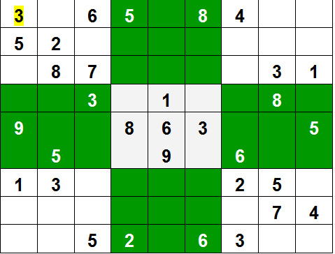

# 回溯

## 概念

Backtracking is an algorithmic-technique for solving problems recursively by trying to build a solution incrementally, one piece at a time, removing those solutions that fail to satisfy the constraints of the problem at any point of time (by time, here, is referred to the time elapsed till reaching any level of the search tree).

For example, consider the SudoKo solving Problem, we try filling digits one by one. Whenever we find that current digit cannot lead to a solution, we remove it (backtrack) and try next digit. This is better than naive approach (generating all possible combinations of digits and then trying every combination one by one) as it drops a set of permutations whenever it backtracks.

  

上面这段解释来自GeeksforGeeks网站上的解释（ https://www.geeksforgeeks.org/backtracking-algorithms/ ）

用通俗的方法解释来说，就是选取一条路往前走，能进则进；不能进则退回来换一条路再试！

## 八皇后问题

我们以经典的八皇后问题来解释回溯算法的执行原理

八皇后问题是一个以国际象棋为背景的问题：如何能够在 8×8 的国际象棋棋盘上放置八个皇后，使得任何一个皇后都无法直接吃掉其他的皇后？为了达到此目的，任两个皇后都不能处于同一条横行、纵行或斜线上。 

  

上图为8皇后的一种解法

给定整数8，返回任意一种8皇后问题的解决方案。

### 示例

```java
输入：8
输出：int[] a = new int[8];
a[i] 表示把第i个皇后放在第i行的列数（注意i的值都是从0开始计算的）,{5, 2, 0, 6, 4, 7, 1, 3}
```

### 问题剖析

任意两个皇后不能互相攻击的限制条件可以转化为如下：[i,  j],[k, l]分别表示两个皇后的坐标

1）任意一行或一列都不能同时出现两个皇后，i != j &&  k != l, 如果以示例中的a[i]来表示，则a[i]中任意位置的值都不能相同。

2）任意对角线上都不能同时存在两个皇后 |i - j| != |k - l|

首先，我们另k = 1，i = 1，a[k] = i，此时a[1] = 1, 表示8*8方格上的第1列-第1行放置皇后，然后另k = 2，放置第二个皇后，需要检查当前a[k]是否和前面的值有冲突，因此代码如下：

```java
伪代码如下:
i = 1, k = 1;
applyQueue(k):
    for i : 8
        a[k] = i; 
        if (a[k] not complict with a value before k) {
            applyQueue(k + 1);
        }

java代码如下:
for (int i = 1; i <= n; i++) {
    a[k] = i;
    if (!isConflict(a, k)) {
        solveQueens(a, k + 1, n);
    }
}
```

这里最重要的是冲突的判定，上面已经介绍了冲突的判定方法，那么我们现在将其通过代码实现：

```java
/**
     * 冲突检查
     * @param a 放置皇后的数组
     * @param k 当前放置第几个皇后
     * @return 是否和前面的有冲突
     */
private boolean isConflict(int[] a, int k) {
    for (int i = 1; i < k; i++) {
        if (a[i] == a[k] || Math.abs(a[i] - a[k]) == k - i) {
            return true;
        }
    }

    return false;
}
```

其中a[i] == a[k]表示第k个皇后和其和已经放置的第i个皇后处于同一行，

Math.abs(a[i] - a[k]) == k - i表示第k个皇后和已经放置的第i个皇后处在同一对角线上

如发现上述两种情况直接返回true，表示冲突

整个放置皇后的问题代码基本已经成型，就剩下我们的递归调用什么时候退出。一趟递归下来，若发生冲突则退回到上一层，上一层a[k] 的放置位置向下移一个，再次检查是否冲突，依次类推，当我们8*8的方格中摆满了8个皇后的时候，就是我们找到了一组可行解，那么这个时候的状态是k = 8，当再次调用递归时，递归的入口处对k进行检查，判断k>8？若大于8则表示当前数组a中是一组可行解，将其记录下来，或者直接退出程序。

下面我们来看完整的代码（java实现）：

```java
package com.chasedream.leetcode.hard;

import com.chasedream.utils.Out;

import java.util.ArrayList;
import java.util.List;

public class SolveNQueens {
    List<List<String>> res = new ArrayList<>();
    boolean isFind = false; // 表示是否已经找到一组结果

    public List<List<String>> solveNQueens(int n) {
        int[] a = new int[n + 1]; // a[i]的值表示第i行a[i]列放置皇后
        solveQueens(a, 1, n);

        return res;
    }

    /**
     * 放置皇后迭代主题
     * @param a 放置皇后的数组
     * @param k 当前放置的是第几个皇后
     * @param n 总共需要放置的皇后数目
     */
    public void solveQueens(int[] a, int k, int n) {
        if (k > n) {
            // isFind = true;
            // 根据数组a生成题目想要的结果
            List<String> temp = new ArrayList<>(); // 存储当前结果，每行为一个String字符串
            for (int i = 1; i <= n; i++) {
                StringBuilder line = new StringBuilder();
                for (int j = 0; j < n; j++) {
                    if (j == a[i] - 1) {
                        line.append("Q");
                    } else {
                        line.append(".");
                    }
                }
                temp.add(line.toString());
            }
            res.add(temp);
        } else {
            for (int i = 1; i <= n; i++) {
                a[k] = i;
                if (!isConflict(a, k)) {
                    solveQueens(a, k + 1, n);
                }

                /*if(isFind) { // 若找到了一组结果，则直接返回结果，不在继续递归
                    break;
                }*/
            }
        }
    }

    /**
     * 冲突检查
     * @param a 放置皇后的数组
     * @param k 当前放置第几个皇后
     * @return 是否和前面的有冲突
     */
    private boolean isConflict(int[] a, int k) {
        for (int i = 1; i < k; i++) {
            if (a[i] == a[k] || Math.abs(a[i] - a[k]) == k - i) {
                return true;
            }
        }

        return false;
    }

    public static void main(String[] args) {
        SolveNQueens solveNQueens = new SolveNQueens();
        List<List<String>> out = solveNQueens.solveNQueens(8);
        Out.println(out.size());
    }
}

```

当k > 8时，我么可以设置标志位表示已经找到了一组可行解，若题目只是要求找到任意一组可行解，那么此时便可通过这个标志位进行控制。

若题目需要找到所有的可行解，则需要在k>8时根据题目的输出要求进行相应的结果保存。如下面的N皇后问题中要求将所有结果通过List进行保存，每个结果还是一个List，每个结果中的每一行是一个String表示这一行的结果。

下面我们通过N皇后问题对8皇后问题进行扩展。

## N皇后问题

solveNQueens.java（源码如上8皇后问题）

通过上面八皇后的问题，我么衍生到n皇后的问题

n 皇后问题研究的是如何将 n 个皇后放置在 n×n 的棋盘上，并且使皇后彼此之间不能相互攻击。

给定一个整数 n，返回所有不同的 n 皇后问题的解决方案。

每一种解法包含一个明确的 n 皇后问题的棋子放置方案，该方案中 'Q' 和 '.' 分别代表了皇后和空位。

### 示例

```
输入: 4
输出: [
 [".Q..",  // 解法 1
  "...Q",
  "Q...",
  "..Q."],

 ["..Q.",  // 解法 2
  "Q...",
  "...Q",
  ".Q.."]
]
解释: 4 皇后问题存在两个不同的解法。
```
