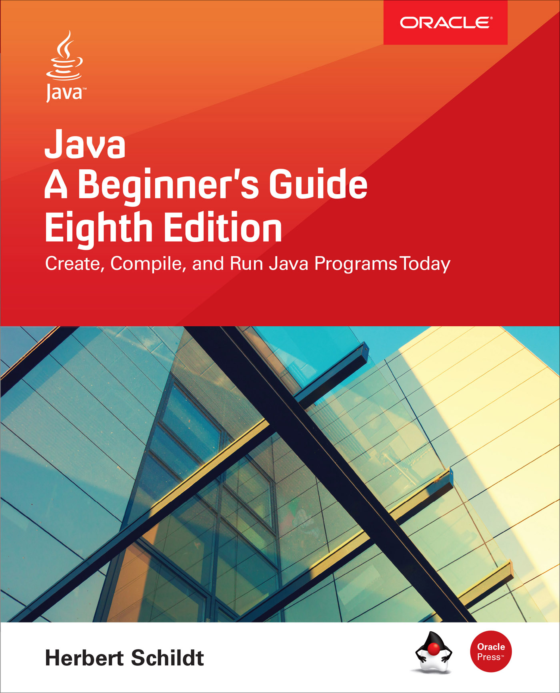

# Java 8初学者指南

## 介绍

本书的目的是教您Java编程的基础知识。它使用循序渐进的方法，其中包含大量的示例，自我测验以及项目。它假设您之前没有任何编程经验。本书从基础开始，如如何编译和运行Java程序。然后讨论构成Java语言核心的关键字，特性和结构。您还会发现一些对Java高级特性的介绍，其中包括多线程编程，泛型，lambda表达式和模块。本书最后介绍了Swing的基础知识。当您学习完本书时，您将会牢牢掌握Java编程的基础知识。

在本书的开篇，有必要声明此书只是一个开端。Java不仅仅是定义语言的元素。Java还包含有助于程序开发的大量的库和工具。成为一个出众的Java编程人员意味着需要掌握这些知识。在学习完本书之后，你将会掌握继续追寻Java其他任何方面的知识。

### Java的发展

只有少数语言从根本上重塑了编程的本质。在这个精英群体中，Java语言因为它的既迅速又广泛的影响脱颖而出。好不夸张地说，1995年Sun Microsystems, Inc.最初发布的Java 1.0引发了一场编程革命。这场革命从根本上将Web转变为高度交互的环境。在这一过程中，Java树立了计算机语言设计的标准。

多年来，Java一种在不断发展、演进，并以其他方式重新定义自己。一些语言在引入新功能方面进展缓慢，Java则与之不同，Java经常处于计算机语言开发的最前沿。原因之一是创新和变革的文化始终围绕着Java。因此，Java经历了多次升级-一些相对较小，另一些则更为重要。

Java第一个重要的更新是版本1.1。Java 1.1添加的功能比你能够想到的那些次要修订版本号所添加的功能来的更为重要。例如，Java 1.1 增加了许多新的库元素，重新定义了事件处理的方式，并重新配置了原始1.0库中的许多功能。

Java的下一个主要版本是Java 2，其中2表示“第二代”。Java 2的出现是一个分水岭，标志着Java“现代化”的开始。Java 2的第一个发行版的版本号是1.2，这看起来有点奇怪。原因是它最初指的是Java库的内部版本号，但是后来泛化为整个发行版本身。在Java 2中，Sun将Java重新打包为J2SE（Java平台标准版），并且将版本号开始应用于该产品。

Java的下一个升级是J2SE 1.3。此版本是对原始Java 2的第一次重大升级。在很大程度上，它增加了现有的功能，并“收紧”了开发环境。J2SE 1.4的发布进一步增强了Java。这个版本包含了几个重要的特性，包括链式异常、基于通道的I/O和assert关键字。

