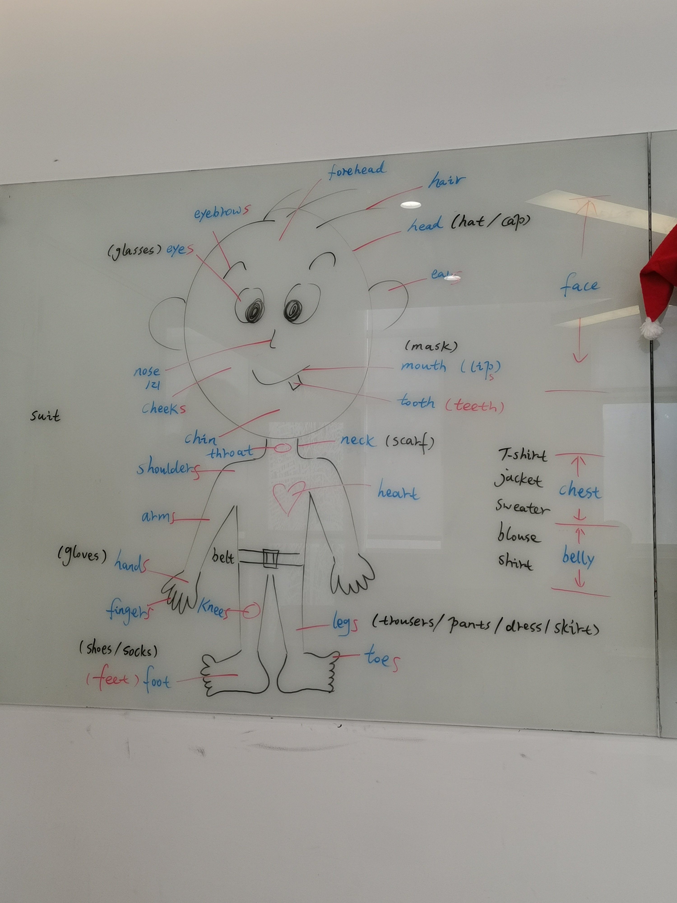
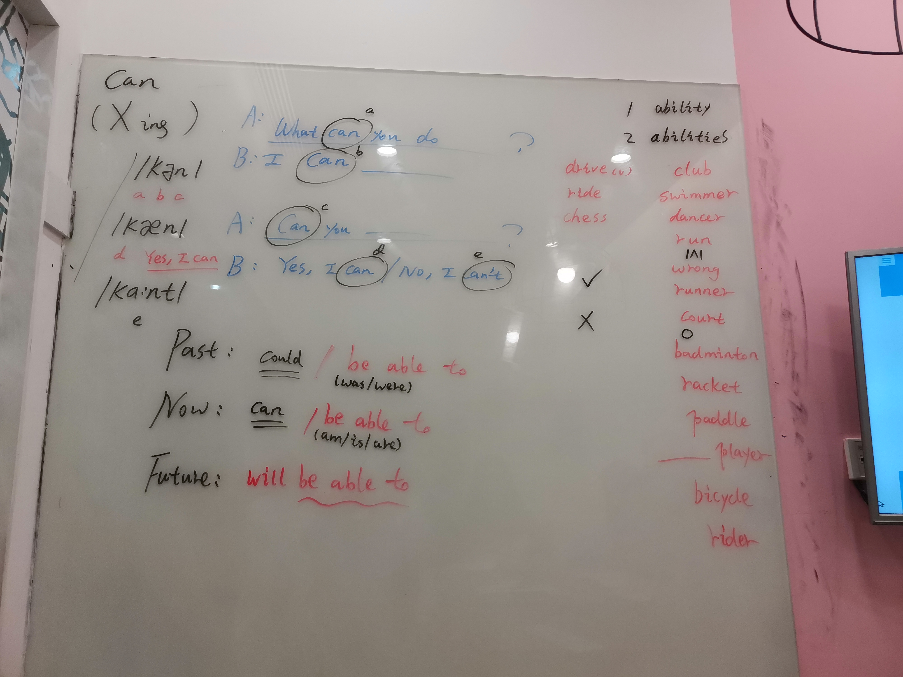
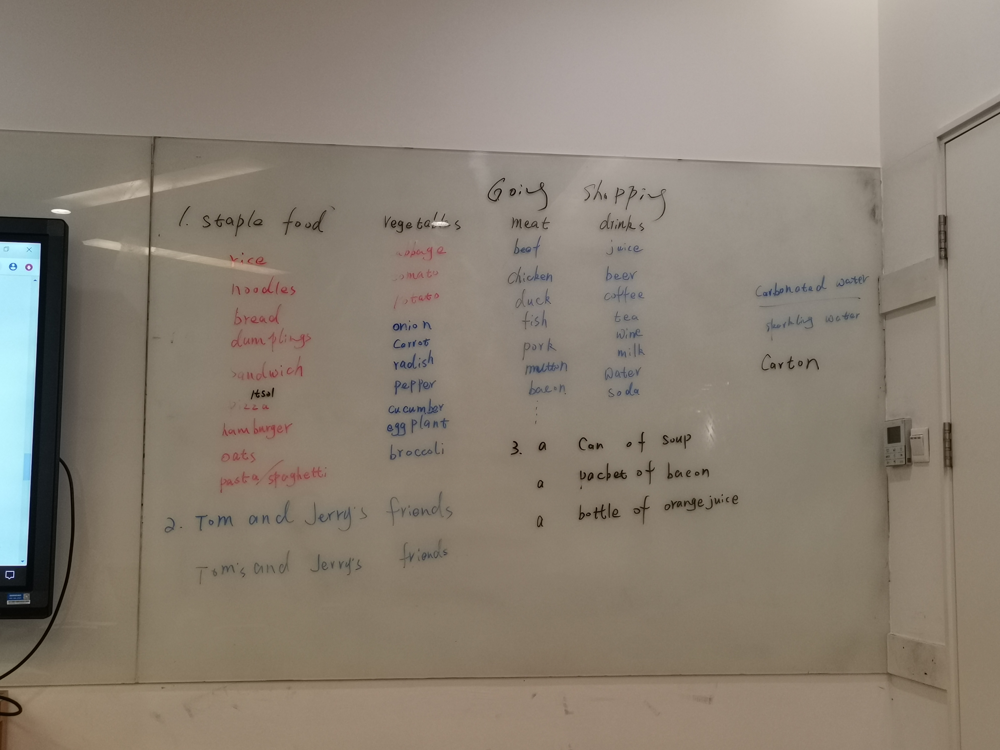
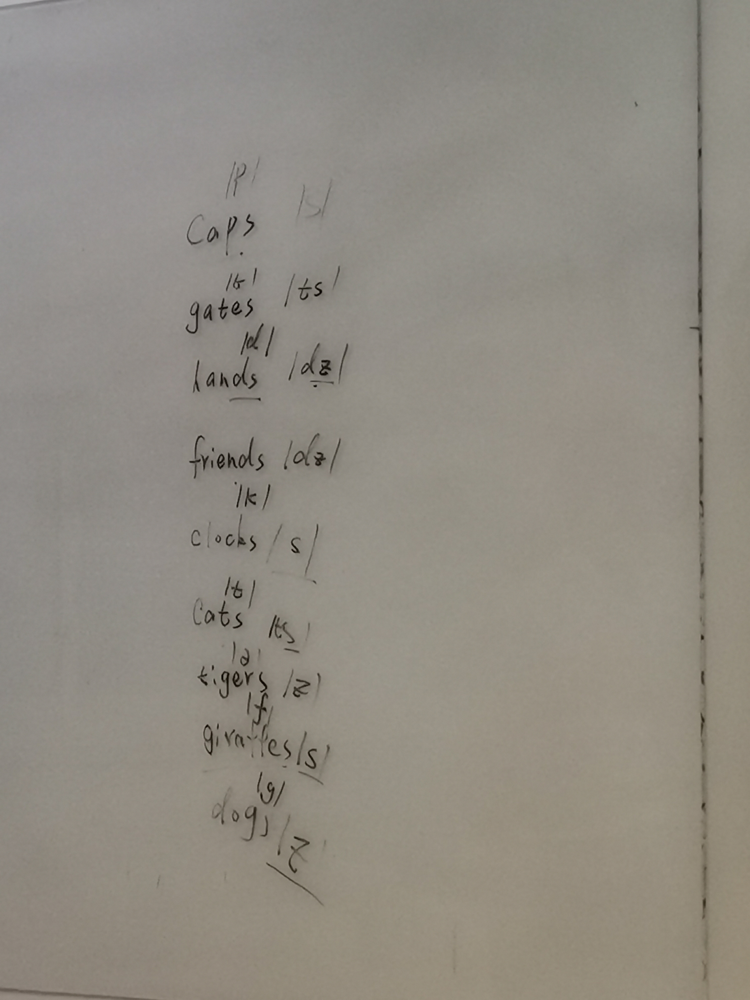

# **互动课程-入门级**

每个level完成进行级别测试

每级完成进行口语测试(PVA)，如2，3两个level完成后进行PVA

私人会话（PL20）需要单独提前24小时预约,每节课20分钟，一次性可订两节课。

每天整点或者半点可定小组会话课程（GL）。

## **level2**

### **F2F-Saying what you have in your home**

simple , modern 房间的风格

tea table, coffe table茶几

toilet、restroom、WC(water closet)、washroom、latrine/ləˈtriːn/茅厕

closet /ˈklɒzɪt/, wardrobe/ˈwɔːdrəʊb/

dining table餐桌、dine用餐、diner用餐的人；dinner晚餐

on the ceiling/ˈsiːlɪŋ/

hang悬挂、hung（be动词）；There is a lamp hung on the ceiling.

bathtub浴缸

floor tile /flɔː(r) taɪl/地砖，slippery/ˈslɪpəri/滑

take a bath

arm chair、wheelchair

refrigerator/rɪˈfrɪdʒəreɪtə/冰箱、fridge/frɪdʒ/

TV stand电视柜

beside table/right stand床头柜

rug小块地毯、carpet满铺地毯、mat地垫-yoga mat瑜伽垫、cushion软垫，坐垫、coaster防烫垫、blanket毛毯

study room

storage room

basement地下室

garage/ˈɡærɑːʒ/车库

yard/garden

balcony/ˈbælkəni/阳台

bookshelf书架

cupboard/ˈkʌbəd/橱柜，壁橱

### Workshop-Describing where you live

newly(adv) decorated(adj) 新装修

city center、downtown市中心

pick a subway(metro)

two-bedroom(adj)

faraway、close to

It is + adj + [nons]

It has + nons

**House agent**

to get ot know about customer(needs,family,job)

give suggestions

yes/more details、no/bye,thank you

**Customer**

tell the agent ...

questions,yes or no

### F2F-Celebrations

celebrations/celebrate for...
Specail day & Festival
do fun things
Mather's day
Christmas
Valentine's day/Double 7th

On February 12th in 2021, it's Spring Festival.
On the second Sunday in June, it's Mother's day.(third...Father's day)

Bellow short paragraph is Chinese New Year Card to Deniel.
Dear/To Deniel,

> Wish you a happy Chinese New Year!
> Good luck in the new year and wish your dreams come to true.
>
> Best Wishes,
> (With love,)
> (Love,)
> (All the best,)
>
> From Charles.

prosperous/ˈprɒspərəs/繁荣的，成功的，兴旺的
Wedding Card
aniversary

### Workshop-The human body

**Head**: hair, forehead, eyebrows, eyes(glasses), ears, nose, cheeks, mouth(lip) ---mask, tooth(teeth), chin, hat, cap

**Neck**: scarf(围巾), throat

**Upper body**: shoulders, chest, heart, arms, hands---glaves, fingers, belt, T-shirt, jacket, sweater, blouse, shirt

**Lower body**: legs, knees, foot(feet), toes, trouser, pants, dress, skirt, suit

### F2F-Talking about abilities

**Can**

/kæn/ ---a, b, c

/kən/ ---d

/kɑːnt/ ---e

> A: What can(a) you do?
>
> B: I can(b) ....
>
> A: Can(c) you ...
>
> B: Yes, I can(d)/No, I can't(e)

**时态**

Post: could/be(was/were) able to

Now: can/be(am/is/are) able to

Future: will be able to

ability/abilities

drive, ride, chess

club, swimmer, dancer, run/rʌn/, wrong, runner, court, badminton, racket/ˈrækɪt/球拍, paddle/ˈpædl/划桨, player, bicycle, rider

### Workshop-Go shopping

**staple food **/ˈsteɪpl/

rice, noodles, bread, dumplings, sandwich, pizza/ˈpiːtsə/, hamburger, oats, pasta/ˈpæstə/, spaghetti/spəˈɡeti/意大利细面

**vegetables**

cabbage, tomato, potato, onion, carrot, radish小萝卜, pepper, cucumber, eggplant茄子, broccoli/ˈbrɒkəli/西兰花, garlic大蒜

**meat**

beaf, chicken, duck, fish, pork, mutton/ˈmʌtn/羊肉, bacon

**drinks**

juice, bear, coffe, tea, wine, milk, water, soda

Tom and Jerry's friends/Tom's and Jerry's friends

a can of soup

a packet of bacon

a bottle of orange juice

carbonated/ˈkɑːbəneɪtɪd/ water 碳酸饮料

sparkling/ˈspɑːklɪŋ/ water 苏打水

carton: a carton of milk 一盒牛奶

### F2F-Talking about free time activities

1.Ask

What arr your hobbies./What do you like to do in your free time?

2.Answer

go the the park, go shopping, play sport, do karaoke/ˌkæriˈəʊki/, exercise, got to restaurants, watch/see movies/films, go running

3.I like shopping

### Talking about weather

### Talking about your fitness routine

### Life club-Talking about your fitness routine

weight training

go for a walk

go running

go jogging

yoga

once  two weeks/every two weeks

every other week每隔一周一次

get back in shape

stay in shape

when the weather is good

I go the gym everyday's 6-7o'clock pm,on the saturay, i go for a jog in the evening after dinner, on the sunday, i climb the zijin moutain.

crabs

easygoing

honest

improve my professional skills

### Workshop-Getting around down

## level3

### Life club-Talking about abilities

the class's most contents is the same as pre-attended class "Talking about abilities".

### Workshop-Error Correction

Review the F2F contents which we learn this week.

There is ...

The table is opposite sofa.

I am not ...

Concurrency 货币

dollar, euro, ruble, rupiah, pound, Thai Baht, Korean wan, Yen

**How much is** 500 euros **in** rupiah?

**How much would** 1000 yuan **be in** rupiah?

**What's** 10000 pounds **in** yen?

How much would you like to exchange?

