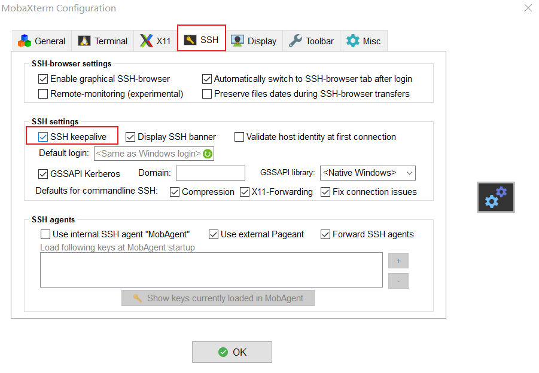
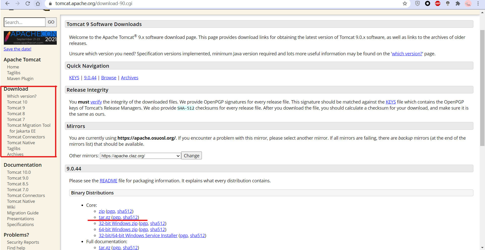
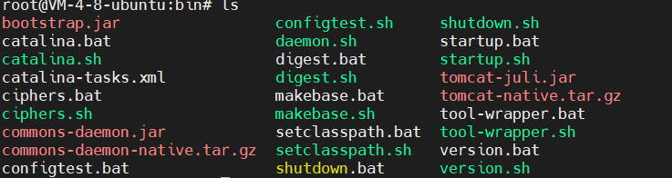
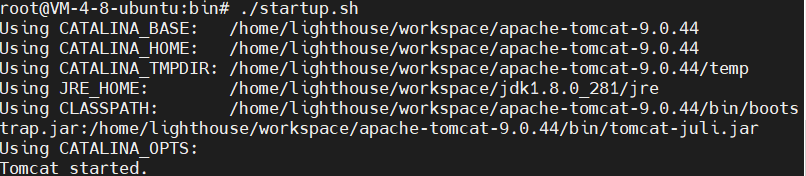
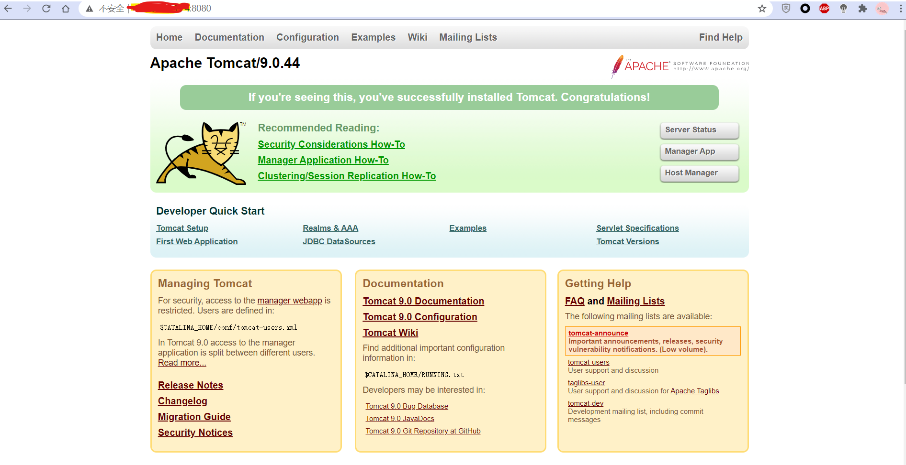
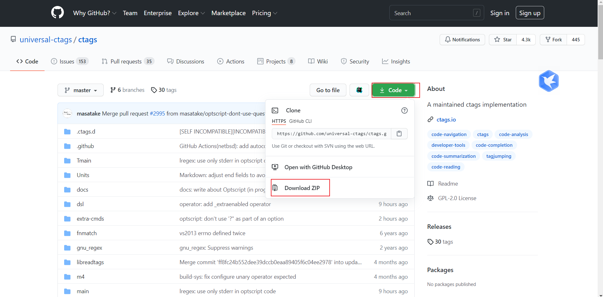
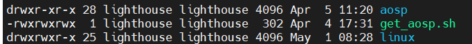
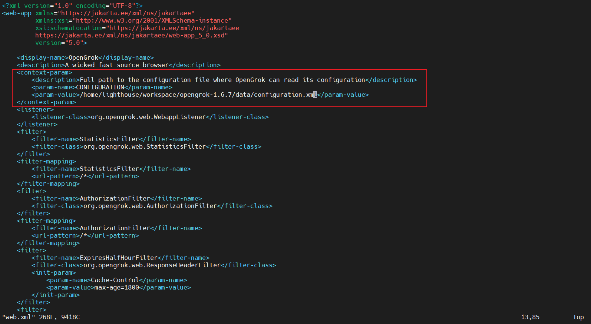

# 常用工具

## **Install JDK 8**

1. 下载[Java 8或者更高版本](https://www.oracle.com/java/technologies/javase/javase-jdk8-downloads.html)

2. 解压软件包至你想安装的位置，如我解压至我自的工作目录workspace下

   > $ cd workspace
   >
   > $ tar zxvf xxx.tar.gz

3. 配置环境变量

   编辑当前用户下的.bashrc文件

   > $ vim ~/.bashrc

   如果你不熟悉vim的使用，可以使用其他任意文本编辑工具，如gedit、sublime之类

   在文件末尾添加上面的环境变量，保存退出

   > export JAVA_HOME={Use the absolute path of the installed Java 8}
   > export JRE_HOME=${JAVA_HOME}/jre
   > export CLASSPATH=.:${JAVA_HOME}/lib:${JRE_HOME}/lib
   >
   > export PATH=${JAVA_HOME}/bin:$PATH

4. 如果想在当前终端立即生效，我们需要执行如下命令

   > $ source ~/.bashrc

5. 检查是否安装成功

   > $ java -version
   >
   > java version "1.8.0_291"
   > Java(TM) SE Runtime Environment (build 1.8.0_291-b10)
   > Java HotSpot(TM) 64-Bit Server VM (build 25.291-b10, mixed mode)

## <a name="Install Java 11">Install JDK 11</a>

在Linux上安装开发工具软件，大家可能会抱着一定要通过apt-get install或者yum install之类的系统级软件包安装命令进行安装，会觉得这样安装给人一种干净，纯粹的感觉。

在这里，和大家说完全没必要；且不说apt-get/yum的源可能没有你想要的软件，花在找源的时间，我们早就把软件包下载完了；而且通过手动下载安装的方式我们想装什么版本就装什么版本，多舒服！

因此，如果你想要的安装包官网推荐了apt-get/yum的安装方式，那么可以直接使用这种方式，省时省力；如果没有，那么我们直接手动下载安装包解压、配置一气呵成。

1. 下载[Java 11或者更高版本](https://www.oracle.com/java/technologies/javase-jdk11-downloads.html)

2. 解压软件包至你想安装的位置，如我解压至我自的工作目录workspace下

   > $ cd workspace
   >
   > $ tar zxvf xxx.tar.gz

3. 配置环境变量

   编辑当前用户下的.bashrc文件

   > $ vim ~/.bashrc

   如果你不熟悉vim的使用，可以使用其他任意文本编辑工具，如gedit、sublime之类

   在文件末尾添加上面的环境变量，保存退出

   > export JAVA_HOME={Use the absolute path of the installed Java 11}
   > export JRE_HOME=${JAVA_HOME}/jre
   > export CLASSPATH=.:${JAVA_HOME}/lib:${JRE_HOME}/lib
   >
   > export PATH=${JAVA_HOME}/bin:$PATH

4. 如果想在当前终端立即生效，我们需要执行如下命令

   > $ source ~/.bashrc

5. 检查是否安装成功

   > $ java -version
   >
   > java version "11.0.11" 2021-04-20 LTS
   > Java(TM) SE Runtime Environment 18.9 (build 11.0.11+9-LTS-194)
   > Java HotSpot(TM) 64-Bit Server VM 18.9 (build 11.0.11+9-LTS-194, mixed mode)

## Install Mobaxterm

### 安装

1. [下载](https://mobaxterm.mobatek.net/download.html)，目前该软件至支持window
2. 解压压缩包至指定目录，双击MobaXterm.exe即可
3. 右键MobaXterm.exe，可将其添加至任务栏，方便后面的使用

### 问题

1. 远程连接经常中断

   * 打开mobaxterm，点击settings

     

   * 选中SSH tab页，勾选keep alive

     

## <a name="Install pip">Install Pip</a>

本指导是参见[官网](https://pip.pypa.io/en/stable/installing/)

1. 检查pip是否已经安装

   > $ python -m pip --version
   > pip X.Y.Z from .../site-packages/pip (python X.Y)

   如果没有安装会提示相应的提示，进行后续几步

2. 下载pip安装脚本

   > curl https://bootstrap.pypa.io/get-pip.py -o get-pip.py

3. 执行安装脚本

   > python get-pip.py

4. 更新

   python -m pip install --upgrade pip

5. pip安装requirements

   pip install -r requirements.txt

## Install Mkdocs

### 安装

> pip3 install mkdocs

使用系统默认的镜像安装会出现很多报错问题，如下：

> Retrying (Retry(total=4, connect=None, read=None, redirect=None, status=None)) after connection broken by 'ProxyError('Cannot connect to proxy.', OSError(0, 'Error'))': /simple/lunr/  

由于mkdocs安装过程中又会依赖其他的包，所以一个个手动下载不太现实。因此需要替换pip的安装镜像。

找到pip3的congfig文件，pip.conf；我的文件位于~/.config/pip目录中

编辑该文件，修改为如下

> [global]
> index-url = http://mirrors.aliyun.com/pypi/simple/
> [install]
> trusted-host=mirrors.aliyun.com

这样便可以将pip的安装镜像替换为阿里镜像

再执行#pip3 install mkdocs，便可安装成功

### 问题

安装完成后，发现直接再终端输入mkdocs显示：

> bash: mkdocs：未找到命令

这是因为mkdocs没有添加至P系统环境变量导致

添加mkdocs至习系统环境变量

在~/.bashrc文件末尾添加export PATH=/home/dezhou/.local/bin:$PATH，保存退出

终端执行souce ~/.bashrc

再次执行mkdocs，显示如下表明成功

> Usage: mkdocs [OPTIONS] COMMAND [ARGS]...
>
>   MkDocs - Project documentation with Markdown.
>
> Options:
>   -V, --version  Show the version and exit.
>   -q, --quiet    Silence warnings
>   -v, --verbose  Enable verbose output
>   -h, --help     Show this message and exit.
>
> Commands:
>   build      Build the MkDocs documentation
>   gh-deploy  Deploy your documentation to GitHub Pages
>   new        Create a new MkDocs project
>   serve      Run the builtin development server

## Install Nodejs

### 安装

#### Repository安装

* 安装npm

  > sudo apt-get install npm

  系统默认的repository下载下来的版本可能比较老，出现和nodejs版本不匹配的情况，如下：

  > npm WARN npm npm does not support Node.js v10.21.0
  > npm WARN npm You should probably upgrade to a newer version of node as we
  > npm WARN npm can't make any promises that npm will work with this version.
  > npm WARN npm Supported releases of Node.js are the latest release of 4, 6, 7, 8, 9.
  > npm WARN npm You can find the latest version at https://nodejs.org/

  这时候我们需要更新npm为最新版本

* 安装nodejs管理器

  > sudo npm install -g n
  >
  > https://www.jianshu.com/p/a927bcecdbc0

* 安装nodejs

  > 查看稳定版本
  >
  > ~$: n --stable
  >
  > 14.16.0
  >
  > 安装14.16.0
  >
  > ~$: n 14.16.0

  等待安装完成

* 设置环境变量

  找到node的安装位置，我刚刚安装的位置是/usr/local/n/versions/node/14.16.0/

  在~/.bashrc文件的最后一行添加如下一行，保存退出，重新打开终端，或者source ~/.bashrc

  > export PATH=/usr/local/n/versions/node/14.16.0/bin:$PATH

* 查看版本号

  > ~$ node --version
  > v14.16.0
  > ~$ npm --version
  > 6.14.11

#### 手动下载安装

### 安装package.json中的依赖

#### 安装所有模块

npm install 

#### 安装dependencies中的模块

npm install --dependencies

#### 安装devDependencies中模块

npm install --devDependencies

## <a name="Install tomcat">Install Tomcat</a>

### 安装tomcat

1. 去官网下载tomcat。

   

   点击你要下载的tomcat版本。

2. 解压

   > $ tar -xf apache-tomcat-9.0.44.tar.gz

   移动tomcat文件到/opt/tomcat9目录下(或自己合适的目录)

   > $ sudo mv apache-tomcat-9.0.44 /opt/tomcat9

3. 配置tomcat

   bin目录下的startup.sh和shutdown.sh文件。
   进入tomcat的bin目录。

   > cd /opt/tomcat9/apache-tomcat-9.0.44/bin && ls

   可以看到文件目录以下：

   

   * 编辑startup.sh文件

     > $ sudo gedit startup.sh

     在exec "$PRGDIR"/"$EXECUTABLE" start "$@"前面加上以下内容

     > export JAVA_HOME={Use the absolute path of the installed Java}
     > export JRE_HOME=${JAVA_HOME}/jre
     > export CLASSPATH=.:${JAVA_HOME}/lib:${JRE_HOME}/lib
     > export PATH=${JAVA_HOME}/bin:$PATH 
     > export TOMCAT_HOME={Use the absolute path of the installed Tomcat}

     注意，JAVA_HOME要更改为你电脑i的JDK所在目录。保存，退出。

   * 编辑shutdown.sh文件。

     > $ sudo gedit shutdown.sh

     在exec "$PRGDIR"/"$EXECUTABLE" stop "$@" 前面加上以下内容：

     > export JAVA_HOME={Use the absolute path of the installed Java}
     > export JRE_HOME=${JAVA_HOME}/jre
     > export CLASSPATH=.:${JAVA_HOME}/lib:${JRE_HOME}/lib
     > export PATH=${JAVA_HOME}/bin:$PATH 
     > export TOMCAT_HOME={Use the absolute path of the installed Tomcat}

     配置环境变量

     > export CATALINA_HOME={Use the absolute path of the installed Tomcat}
     > export PATH=${CATALINA_HOME}/lib:${CATALINA_HOME}/bin:$PATH

4. 启动

   > $ sudo ./startup.sh

   终端输出以下：

   

   在chrome输入ip:8080，可以看到以下界面。

   

   说明tomcat已经配置成功。如出现访问不了的情况，大多数情况是云服务器的防火墙8080端口没开启，可到对应的云服务器（我的是轻量级云服务器）中去开放8080端口后即可访问。

5. 关闭tomcat

   > $ sudo ./shutdown.sh

启动tomcat。

### 创建tomcat系统服务

1. 进入/etc/systemd/system目录，

2. 使用如下命令创建tomcat.service文件

   ```sh
   $ touch tomcat.service
   ```

3. 编辑tomcat.service，拷贝如下内容后保存退出

   ```
   [Unit]
   Description=Tomcat
   Wants=network.target
   After=network.target
   
   [Service]
   Type=forking
   
   User=tomcat
   Group=tomcat
   
   Environment=JAVA_HOME={Use the absolute path of the installed Java}
   Environment='JAVA_OPTS=-Djava.awt.headless=true'
   Environment=CATALINA_BASE={Use the absolute path of the installed Tomcat}
   Environment=CATALINA_HOME={Use the absolute path of the installed Tomcat}
   Environment=CATALINA_PID={Use the absolute path of the installed Tomcat}/temp/tomcat.pid
   Environment='CATALINA_OPTS=-Xms512M -Xmx1G -Djava.net.preferIPv4Stack=true'
   
   ExecStart={Use the absolute path of the installed Tomcat}/bin/startup.sh
   ExecStop={Use the absolute path of the installed Tomcat}/bin/shutdown.sh
   
   [Install]
   WantedBy=multi-user.target
   ```

## Install OpenGrok

本指导是参照openGrok[官方文档](https://github.com/oracle/opengrok/wiki/How-to-setup-OpenGrok)进行的安装，如需安装其他特定版本，可自行在网络上搜索对应版本的安装指导！

### 准备工作

1. 下载[Java 11或者更高版本](https://www.oracle.com/java/technologies/javase-jdk11-downloads.html)

2. 下载OpenGrok[二进制文件]( https://github.com/OpenGrok/OpenGrok/releases)，下载.tar.gz文件而不是source code压缩包

3. 下载[ctags](https://github.com/universal-ctags/ctags)
   如果网络速度良好的情况下，建议直接通过git clone的方式进行下载

   > $ git clone https://github.com/universal-ctags/ctags.git

   如果git clone的速度很慢，那么可点击下载压缩包，如下图所示

   

   ctags的安装需要注意以下几点

   * 避免使用Exuberant ctags，它们将不再维护，并且OpenGrok不能与其很好地运行
   * 在Linux发行版上时，请避免使用来自snap的ctags软件包，因为它采用了安全性限制，并且在建立索引时会失败
   * 在Windows上使用Chocolatey的ctags可以正常工作

   [Exuberant Ctags](http://ctags.sourceforge.net/) 和[Universal Ctags](https://ctags.io/)的详细区别可阅读其官网

4. 下载 [GlassFish](https://glassfish.dev.java.net/) 或者 [Tomcat](http://tomcat.apache.org/) 10.0 以及更高版本

   * 需要使用Java指定的兼容版本

5. 安装最新的浏览器客户端

6. python 3.6及以上

### 安装

1. 安装Java 11，见<a href="#Install Java 11">Install JDK 11</a>

2. 安装Tomcat 10，见<a href="#Install tomcat">Install tomcat</a>

3. 安装ctags

   * 进入ctags目录

     > $ cd ctags

   * 执行autogen.sh

     > $ ./autogen.sh

   * 执行configure

     > $ ./configure

     通过--prefix=/where/you/want可指定安装目录，如./configure --prefix=/opt，将会安装到/opt目录下；如果什么都不指定，默认安装到/usr/local目录下

   * make&make install

     > $ make
     > $ make install

     如果提示Permission Denied，可切换至超级用户后在安装，或者使用sudo make install，输入您的超级用户密码回车即可

   * 检查安装

     > $ ctags --version
     >
     > Universal Ctags 5.9.0, Copyright (C) 2015 Universal Ctags Team
     > Universal Ctags is derived from Exuberant Ctags.
     > Exuberant Ctags 5.8, Copyright (C) 1996-2009 Darren Hiebert
     >   Compiled: Apr  5 2021, 13:17:03
     >   URL: https://ctags.io/
     >   Optional compiled features: +wildcards, +regex, +iconv, +option-directory, +xpath, +json, +interactive, +sandbox, +yaml, +packcc

4. 安装OpenGrok

   * 解压下载的openGrok压缩包

     > $ cd workspace // 进入你的软件安装目录，我这里的软件都安装在我的workspace目录中
     >
     > $ tar zxvf opengrok-X.Y.Z.tar.gz

   * 安装管理工具（可选）

     > $ cd opengrok-x.x.x/tools
     >
     > $ python3 -m pip install opengrok-tools.tar.gz

     过程中可能提示pip3或者pip没有安装，可参见<a href="#Install pip">Install pip</a>
     
   * 环境配置

     > export OPENGROK_TOMCAT_BASE=/{your work dir}/apache-tomcat-10.0.5
     > export OPENGROK_INSTANCE_BASE=/{your work dir}/opengrok-1.6.7
     > export IGNORE_PATTERNS="-i f:*.o -i f:*.out -i f:*.so -i f:*.class -i f:*.swp -i f:*.cache -i f:*.gitignore -i f:*.gitmodules -i f:*.project -i f:*.classpath -i f:*.log.* -i f:*.jar -i d:.git -i d:.settings -i d:.repo -i f:*.img -i f:*.jpg -i f:*.png -i f:*.zip"

     其中IGNORE_PATTERNS是可选项，用于过滤那些你不想建立索引的文件或者目录

   * 建立索引

     > java -jar "/{opengrok installed dir}/opengrok-1.6.7/lib/opengrok.jar" -W "/{opengrok installed dir}/opengrok-1.6.7/data/configuration.xml" -P -S -v -s "/{opengrok project dir to be index}" -d "/{opengrok installed dir}/opengrok-1.6.7/data" -i f:*.o -i f:*.out -i f:*.so -i f:*.class -i f:*.swp -i f:*.cache -i f:*.gitignore -i f:*.gitmodules -i f:*.project -i f:*.classpath -i f:*.log.* -i f:*.jar -i d:.git -i d:.settings -i d:.repo -i f:*.img -i f:*.jpg -i f:*.png -i f:*.zip  -i d:.intermediates

     以我的机器为例

     linux：

     > java -jar "/home/lighthouse/softwares/opengrok-1.7.2/lib/opengrok.jar" -W "/home/lighthouse/softwares/opengrok-1.7.2/data/configuration.xml" -P -S -v -s "/home/lighthouse/workspace/opensource" -d "/home/lighthouse/softwares/opengrok-1.7.2/data" -i f:*.o -i f:*.out -i f:*.so -i f:*.class -i f:*.swp -i f:*.cache -i f:*.gitignore -i f:*.gitmodules -i f:*.project -i f:*.classpath -i f:*.log.* -i f:*.jar -i d:.git -i d:.settings -i d:.repo -i f:*.img -i f:*.jpg -i f:*.png -i f:*.zip -i d:.intermediates -i f:.gz -i f:.bz2 -i f:.apk -i d:test

     windows：
     
     > java -jar "D:\Programs\opengrok-1.7.2\lib\opengrok.jar" -W "D:\Programs\opengrok-1.7.2\data\configuration.xml" -P -S -v -s "E:\Codes\openSource\aosp" -d "D:\Programs\opengrok-1.7.2\data" -i f:*.o -i f:*.out -i f:*.so -i f:*.class -i f:*.swp -i f:*.cache -i f:*.gitignore -i f:*.gitmodules -i f:*.project -i f:*.classpath -i f:*.log.* -i f:*.jar -i d:.git -i d:.settings -i d:.repo -i f:*.img -i f:*.jpg -i f:*.png -i f:*.zip -i d:.intermediates -i f:.gz -i f:.bz2 -i f:.apk -i d:test
     
     其中/home/{username}/workspace/openSource路径为我需要建立索引的目录，里面放置了一些开源代码，如下所示：
     
     

5. 部署

   索引建立完成后，会在opengrok的安装目录中创建data目录，这里面存放着我们刚刚建立的索引

   通过以下命令进行部署：

   > $ opengrok-deploy /home/{username}/workspace/opengrok-1.6.7/lib/source.war /home/{username}/workspace/{apache dir}/webapps

6. 访问

   等待上面的索引建立完成后，我们在浏览器中输入localhost:8080/source，会出现如下界面

   

   出现这种现象的原因是因为我们没有修改apache下webapps中的configuration

   > $ cd /{apache installed dir}/webapps/source/WEB-INF/

   修改web.xml中第一个CONFIGURATION的值为你自己的opengrok中data目录下的configuration.xml绝对路径

   

7. 再次访问localhost:8080/source，成功出现索引页面

## Install Sphinx

pip安装sphnix

pip3 install sphinx sphinx-autobuild


1.sphinx-quickstart

按照提示输入对应的项目名，作者，版本号等信息

2.make html

编译生成html文档

