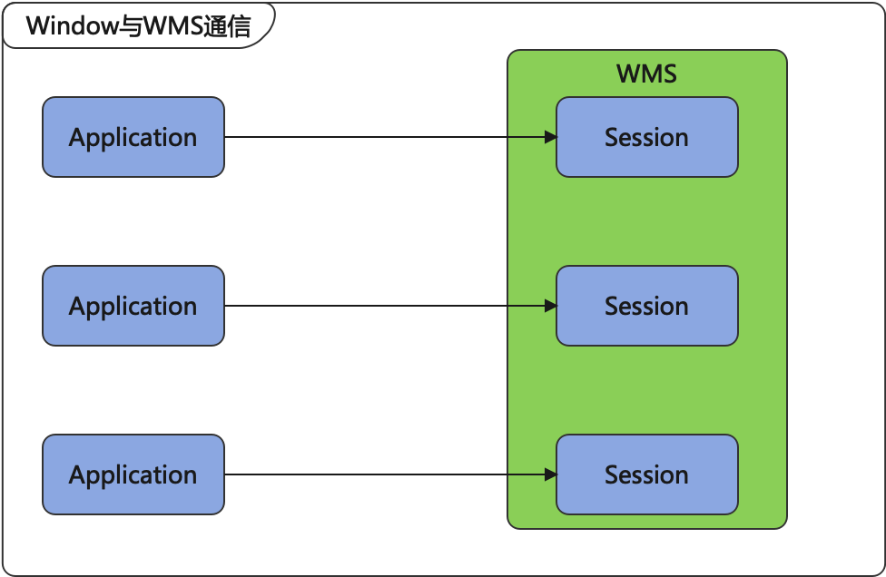
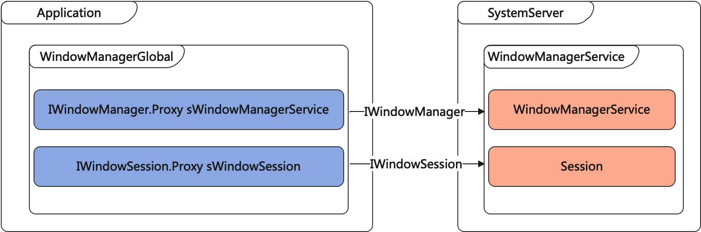
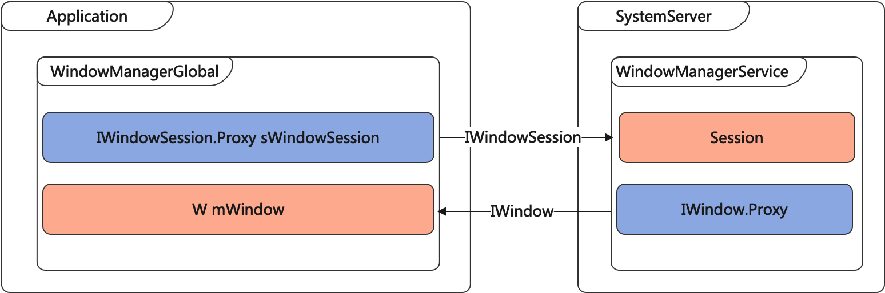

# WindowManagerService

## 概览

WindowManagerService（简称为WMS）窗口管理服务。WMS涉及的范围很广，当我们通过搜索『WindowManagerService』关键字搜索整个framework代码时，我们会发现其和ActivityManagerService（AMS）、InputManagerService、SurfaceFlinger关系比较密切。下面我们初步分析WMS的创建，以及应用进程中的WindowManager和WMS通信。

## 理解WMS相关知识

### WMS的来源

#### 在SystemServer中进行创建

我们搜索framework源码可以发现WMS是在SystemServer进程中启动的，而SystemServer进程是Android系统启动的时候进行初始化的（Android系统的启动流程后续有时间再进行系统的分析）。下面我们先简单看一下SystemServer的入口函数`main()`

[点击查看SystemServer源码](https://android-opengrok.bangnimang.net/android-10.0.0_r47/xref/frameworks/base/services/java/com/android/server/SystemServer.java?r=359a9d99)

```java
public class SystemServer {
    /**
     * The main entry point from zygote.
     */
    public static void main(String[] args) {
        new SystemServer().run();
    }
}
```

我们看到`main()`方法中创建了一个SystemServer对象，同时调用了其中的`run()`方法，我们着重关注507-520行的这段代码，如下：

```java
private void run() {
    ......
    mSystemServiceManager = new SystemServiceManager(mSystemContext);  // 代码 1

    // Start services.
    try {
      traceBeginAndSlog("StartServices");
      startBootstrapServices();                              // 代码 2
      startCoreServices();                                   // 代码 3
      startOtherServices();                                  // 代码 4
      SystemServerInitThreadPool.shutdown();
    } catch (Throwable ex) {
      Slog.e("System", "******************************************");
      Slog.e("System", "************ Failure starting system services", ex);
      throw ex;
    } finally {
      traceEnd();
    }
}
```

* 代码1处，创建了一个 SystemServiceManager 对象，用于创建各种系统服务并管理他们的生命周期
* 代码2处，调用 `startBootstrapServices()` 启动 ActivityManagerService、PackageManagerService 等服务进程
* 代码3处，调用 `startCoreServices()` 启动BatteryService、WebViewUpdateService 等服务进程
* 代码4处，调用 `startOtherServices()` 启动 WindowManagerService、InputManagerService 等服务进程

查看源码，我们会发现`startOtherServices()`这个方法占据了将近1500行（SystemServer总共2300行）。我们重点关注WMS相关的部分，如下：

```java
private void startOtherServices() {
  	final Context context = mSystemContext;
  	WindowManagerService wm = null;
  	InputManagerService inputManager = null;

  	......
    try {
      // 代码 1
      traceBeginAndSlog("StartInputManagerService");
      inputManager = new InputManagerService(context);
      traceEnd();

      // 代码 2
      traceBeginAndSlog("StartWindowManagerService");
      // WMS needs sensor service ready
      ConcurrentUtils.waitForFutureNoInterrupt(mSensorServiceStart, START_SENSOR_SERVICE);
      mSensorServiceStart = null;
      wm = WindowManagerService.main(context, inputManager, !mFirstBoot, mOnlyCore, new PhoneWindowManager(), mActivityManagerService.mActivityTaskManager);
      ServiceManager.addService(Context.WINDOW_SERVICE, wm, /* allowIsolated= */ false, DUMP_FLAG_PRIORITY_CRITICAL | DUMP_FLAG_PROTO);
      ServiceManager.addService(Context.INPUT_SERVICE, inputManager, /* allowIsolated= */ false, DUMP_FLAG_PRIORITY_CRITICAL);
      traceEnd();

      // 代码 3
      traceBeginAndSlog("SetWindowManagerService");
      mActivityManagerService.setWindowManager(wm);
      traceEnd();
      
      // 代码 4
      traceBeginAndSlog("WindowManagerServiceOnInitReady");
      wm.onInitReady();
      traceEnd();

      // 代码 5
      traceBeginAndSlog("StartInputManager");
      inputManager.setWindowManagerCallbacks(wm.getInputManagerCallback());
      inputManager.start();
      traceEnd();
      ......
    } catch (RuntimeException e) {
      Slog.e("System", "******************************************");
      Slog.e("System", "************ Failure starting core service", e);
    }
  	......
    // 代码 6
    traceBeginAndSlog("MakeDisplayReady");
    try {
      wm.displayReady();
    } catch (Throwable e) {
      reportWtf("making display ready", e);
    }
    traceEnd();
    ......
    // 代码 7
    traceBeginAndSlog("MakeWindowManagerServiceReady");
    try {
      wm.systemReady();
    } catch (Throwable e) {
      reportWtf("making Window Manager Service ready", e);
    }
    traceEnd();

    if (safeMode) {
      mActivityManagerService.showSafeModeOverlay();
    }
    // 代码 8
    // Update the configuration for this context by hand, because we're going
    // to start using it before the config change done in wm.systemReady() will
    // propagate to it.
    final Configuration config = wm.computeNewConfiguration(DEFAULT_DISPLAY);
    DisplayMetrics metrics = new DisplayMetrics();
    WindowManager w = (WindowManager)context.getSystemService(Context.WINDOW_SERVICE);
    w.getDefaultDisplay().getMetrics(metrics);
    context.getResources().updateConfiguration(config, metrics);
    ......
}
```

- 代码1处，创建了 InputManagerService 对象，InputManagerService 主要用于接收系统的输入事件，包括按键、触摸等
- 代码2处，调用 `WindowManagerService.main()` 方法创建 WindowManagerService 对象，并将 WindowManagerService 和 InputManagerService 对象添加到 ServiceManager 中
- 代码3处，为 ActivityManagerService 对象设置 WindowManagerService 对象
- 代码4处，通知WMS初始化完成；注意：此处区别于低版本，此步骤在低版本中是直接放在WMS的构造函数中的。通过新增加的onInitReady的描述来看（Called after all entities (such as the {@link ActivityManagerService}) have been set up and  associated with the {@link WindowManagerService}），此处老版本上可能存在一个bug。
- 代码5处，为 InputManagerService 设置 WindowManagerService 对象的 InputManagerCallback ，并启动 InputManagerService 对象
- 代码6处，调用 WMS 的 `displayReady()` 方法初始化显示信息
- 代码7处，调用 WMS 的 `systemReady()` 方法通知 WMS 系统的初始化工作完成
- 代码8处，为 Context 中的 WindowManagerImpl 实例对象设置 DisplayMetrics 对象，并更新当前 Context 的 Resources 中的 Configuration 和 DisplayMetircs 属性

#### WMS构造函数

上面的代码中，我们可以看到WMS是通过其中的`main()`方法创建的，下面我们简单看一下这段代码：

```java
public class WindowManagerService extends IWindowManager.Stub implements Watchdog.Monitor, WindowManagerPolicy.WindowManagerFuncs {
    private static WindowManagerService sInstance;
    static WindowManagerService getInstance() {
        return sInstance;
    }
		public static WindowManagerService main(final Context context, final InputManagerService im, final boolean showBootMsgs, final boolean onlyCore, WindowManagerPolicy policy, ActivityTaskManagerService atm) {
			return main(context, im, showBootMsgs, onlyCore, policy, atm, SurfaceControl.Transaction::new);
    }
  
    /**
     * Creates and returns an instance of the WindowManagerService. This call allows the caller
     * to override the {@link TransactionFactory} to stub functionality under test.
     */
		@VisibleForTesting
		public static WindowManagerService main(final Context context, final InputManagerService im, final boolean showBootMsgs, final boolean onlyCore, WindowManagerPolicy policy, ActivityTaskManagerService atm, TransactionFactory transactionFactory) {
			DisplayThread.getHandler().runWithScissors(() ->
				sInstance = new WindowManagerService(context, im, showBootMsgs, onlyCore, policy, atm, transactionFactory), 0);
			return sInstance;
		}
}
```

* 我们看到在 `main()` 方法中，在 DisplayThread 线程中通过 WMS 的构造方法创建一个 WMS 实例对象

* DisplayThread 线程是一个系统前台线程，用于执行一些延时要非常小的关于显示的操作，一般只会在 WindowManager、DisplayManager 和 InputManager 中使用，代码也比较简单，如下所示：

  ```java
  /**
   * Shared singleton foreground thread for the system.  This is a thread for
   * operations that affect what's on the display, which needs to have a minimum
   * of latency.  This thread should pretty much only be used by the WindowManager,
   * DisplayManager, and InputManager to perform quick operations in real time.
   */
  public final class DisplayThread extends ServiceThread {
      private static DisplayThread sInstance;
      private static Handler sHandler;
  
      private DisplayThread() {
          // DisplayThread runs important stuff, but these are not as important as things running in
          // AnimationThread. Thus, set the priority to one lower.
          super("android.display", Process.THREAD_PRIORITY_DISPLAY + 1, false /*allowIo*/);
      }
  
      private static void ensureThreadLocked() {
          if (sInstance == null) {
              sInstance = new DisplayThread();
              sInstance.start();
            	sInstance.getLooper().setTraceTag(Trace.TRACE_TAG_ACTIVITY_MANAGER);
              sHandler = new Handler(sInstance.getLooper());
          }
      }
  
      public static DisplayThread get() {
          synchronized (DisplayThread.class) {
              ensureThreadLocked();
              return sInstance;
          }
      }
  
      public static Handler getHandler() {
          synchronized (DisplayThread.class) {
              ensureThreadLocked();
              return sHandler;
          }
      }
  }
  ```

下面我们接着上面的`main`方法继续分析，上面的代码中调了WMS的构造方法创建了WMS的实例对象；我们看一下WMS的一些重要的成员属性和构造方法，如下：

```java
public class WindowManagerService extends IWindowManager.Stub implements Watchdog.Monitor, WindowManagerPolicy.WindowManagerFuncs {
		@VisibleForTesting
    WindowManagerPolicy mPolicy;
  
  	/**
		 * All currently active sessions with clients.
		 */
    final ArraySet<Session> mSessions = new ArraySet<>();
  
  	/** Mapping from an IWindow IBinder to the server's Window object. */
    final WindowHashMap mWindowMap = new WindowHashMap();
 		
  	/**
		 * List of app window tokens that are waiting for replacing windows. If the
     * replacement doesn't come in time the stale windows needs to be disposed of.
     */
		final ArrayList<AppWindowToken> mWindowReplacementTimeouts = new ArrayList<>();

    final H mH = new H();

    final InputManagerService mInputManager;

    final WindowAnimator mAnimator;

    private WindowManagerService(Context context, InputManagerService inputManager, boolean showBootMsgs, boolean onlyCore, WindowManagerPolicy policy, ActivityTaskManagerService atm, TransactionFactory transactionFactory) {
        ......
        // 代码 1
        mInputManager = inputManager; // Must be before createDisplayContentLocked.
        // 代码 2 
        mPolicy = policy;

        ......
        // 代码 3
        mAnimator = new WindowAnimator(this);
    }
}
```

* 代码1 处，保存 SystemServer 中传入的 InputManagerService 实例对象，输入事件最终要分发给具有焦点的窗口，而 WMS 是窗口的管理者。`mInputManager` 用于管理每个窗口的输入事件通道，并向通道上派发事件
* 代码2 处，`mPolicy` 对象是 WMS 中非常重要的一个对象，是 WindowManagerPolicy 类型的，WindowManagerPolicy（简称 WMP） 是一个接口，具体的实现类是 `PhoneWindowManager`。WMS 的许多操作都是需要 WMP 规定的，比如：多个窗口的上下顺序，监听屏幕旋转的状态，预处理一些系统按键事件（例如HOME、BACK键等的默认行为就是在这里实现的）
* 代码3 处，创建一个 `WindowAnimator` 对象，用于管理所有窗口的动画

### WMS中的一些重要概念

除了上面的成员属性之外，还有一些非常重要的概念

#### Session

当我们对Window体系有了初步的了解之后，我们会知道ViewRootImpl和WMS之间的通信就是通过Session对象完成的。

Session继承自`IWindowSession.Stub`，每一个应用进程都有一个唯一的Session对象与WMS通信，如下所示：



上面的mSessions成员属性，保存着每个客户端的Session。

```java
public class WindowManagerService extends IWindowManager.Stub implements Watchdog.Monitor, WindowManagerPolicy.WindowManagerFuncs {
    /**
     * All currently active sessions with clients.
     */
    final ArraySet<Session> mSessions = new ArraySet<>();

    ......

    @Override
    public IWindowSession openSession(IWindowSessionCallback callback) {
      return new Session(this, callback);
    }
}
```

```java
public class Session extends IWindowSession.Stub implements IBinder.DeathRecipient {
    final WindowManagerService mService;
    private int mNumWindow = 0; // 代码 1
    ......

    // 代码 2
    public Session(WindowManagerService service, IWindowSessionCallback callback) {
        mService = service;
        ......
    }

    void windowAddedLocked(String packageName) {
        mPackageName = packageName;
        mRelayoutTag = "relayoutWindow: " + mPackageName;
        if (mSurfaceSession == null) {
            if (WindowManagerService.localLOGV) Slog.v(
                TAG_WM, "First window added to " + this + ", creating SurfaceSession");
            mSurfaceSession = new SurfaceSession();
            if (SHOW_TRANSACTIONS) Slog.i(
                    TAG_WM, "  NEW SURFACE SESSION " + mSurfaceSession);
            // 代码 3
            mService.mSessions.add(this);
            if (mLastReportedAnimatorScale != mService.getCurrentAnimatorScale()) {
                mService.dispatchNewAnimatorScaleLocked(this);
            }
        }
        mNumWindow++;
    }

    void windowRemovedLocked() {
        mNumWindow--;
        killSessionLocked();
    }

    private void killSessionLocked() {
        if (mNumWindow > 0 || !mClientDead) {
            return;
        }
        // 代码 4
        mService.mSessions.remove(this);
        ......
    }
}
```

* 代码 1 处，`mNumWindow` 变量记录着此 Session 中共有多少个 Window
* 代码 2 处的 `Session` 的构造方法中，`mService` 保存着 WMS 的实例对象
* 代码 3 处，将此 `Session` 对象添加进 WMS 的 `mSessions` 中
* 代码 4 处，将此 `Session` 对象从 WMS 的 `mSessions` 队列中移除

#### WindowState

WindowState是WMS中的一个重要概念，在WMS中一个WindowState对象对应一个应用进程中的Window对象。在我们对Window体系有了初步了解后，在调用`WindowManagerGlobal.addView`方法时，会经过一系列调用，最终走到了`WindowManagerService.addWindow`中。

在`WindowManagerService.addWindow`中，会创建一个与Window对象对应的WindowState对象并调用`WindowState.attach`方法，紧接着将该WindowState对象添加到WMS的mWindowMap中。

```java
public class WindowManagerService extends IWindowManager.Stub implements Watchdog.Monitor, WindowManagerPolicy.WindowManagerFuncs {
  	/** Mapping from an IWindow IBinder to the server's Window object. */
    final WindowHashMap mWindowMap = new WindowHashMap();

    public int addWindow(Session session, IWindow client, int seq, LayoutParams attrs, int viewVisibility, int displayId, Rect outFrame, Rect outContentInsets, Rect outStableInsets, Rect outOutsets, DisplayCutout.ParcelableWrapper outDisplayCutout, InputChannel outInputChannel, InsetsState outInsetsState) {
				synchronized (mGlobalLock) {
            ......

            final WindowState win = new WindowState(this, session, client, token, parentWindow, appOp[0], seq, attrs, viewVisibility, session.mUid, session.mCanAddInternalSystemWindow);
            ......
            win.attach();
            mWindowMap.put(client.asBinder(), win);
            ......
            win.mToken.addWindow(win);
        }
    }
}
```

```java
class WindowState extends WindowContainer<WindowState> implements WindowManagerPolicy.WindowState {
    final WindowManagerPolicy mPolicy;
    final Context mContext;
    final Session mSession;
    final IWindow mClient;

    WindowState(WindowManagerService service, Session s, IWindow c, WindowToken token,
           WindowState parentWindow, int appOp, int seq, WindowManager.LayoutParams a,
           int viewVisibility, int ownerId, boolean ownerCanAddInternalSystemWindow, 
           PowerManagerWrapper powerManagerWrapper) {
        super(service); // 保存了WMS对象
        mSession = s;
        mClient = c;
        mAppOp = appOp;
        mToken = token;
        mAppToken = mToken.asAppWindowToken();

        ......
    }

    void attach() {
        if (localLOGV) Slog.v(TAG, "Attaching " + this + " token=" + mToken);
        mSession.windowAddedLocked(mAttrs.packageName);
    }
    
    ......
}
```

在WindowState中保存了WMS对象（`super(service)`）、WMP对象、Session对象和IWindow对象，IWindow对象就是与此WindowState对象相对应的在应用进程中的Window对象。

#### WindowToken

1. 在 WMS 中，一个 WindowToken 就代表着一个应用组件，应用组件包括：Activity、InputMethod 等。在 WMS 中，会将属于同一 WindowToken 的做统一处理，比如在对窗口进行 ZOrder 排序时，会将属于同一 WindowToken 的排在一起。
2. WindowToken 也具有令牌的作用。应用组件在创建 Window 时都需要提供一个有效的 WindowToken 以表明自己的身份，并且窗口的类型必须与所持有的 WindowToken 类型保持一致。如果是系统类型的窗口，可以不用提供 WindowToken，WMS 会自动为该系统窗口隐式的创建 WindowToken，但是要求应用必须具有创建该系统类型窗口的权限

在概念上有了初步了解后，我们看一下WMS中`addWindowToken`代码：

```java
@Override
public void addWindowToken(IBinder binder, int type, int displayId) {
		if (!checkCallingPermission(MANAGE_APP_TOKENS, "addWindowToken()")) {
				throw new SecurityException("Requires MANAGE_APP_TOKENS permission");
		}
  
		synchronized (mGlobalLock) {
        final DisplayContent dc = getDisplayContentOrCreate(displayId, null /* token */);
        if (dc == null) {
						Slog.w(TAG_WM, "addWindowToken: Attempted to add token: " + binder
		                + " for non-exiting displayId=" + displayId);
						return;
				}
  			// 代码 1
				WindowToken token = dc.getWindowToken(binder);
      	// 代码 2
				if (token != null) {
						Slog.w(TAG_WM, "addWindowToken: Attempted to add binder token: " + binder
		                + " for already created window token: " + token
                    + " displayId=" + displayId);
						return;
				}
      	// 代码 3
				if (type == TYPE_WALLPAPER) {
						new WallpaperWindowToken(this, binder, true, dc,
										true /* ownerCanManageAppTokens */);
				} else {
						new WindowToken(this, binder, type, true, dc, true /* ownerCanManageAppTokens */);
				}
		}
} 
```

* 代码 1 处，从 DisplayContent 中取一个 WindowToken 对象。从这儿可以看出每一个 WindowToken 又具体是属于每个 DisplayContent 对象的，DisplayContent 对象可以理解为一块屏幕的对应。
* 代码 2 处，若该 IBinder 对象对应的 WindowToken 不为空，则返回，可见 一个 IBinder 对象只能创建一个对应的 WindowToken 对象。
* 代码 3 处，根据 Window 的 type 类型创建对应的 WindowToken 对象。

AppWindowToken 是 WindowToken 的子类，与 WindowToken 不同的是，AppWindowToken 只可以用于 Activity 中的 Window 的 WindowToken。

#### DisplayContent

DisplayContent 是 Android 4.2 中支持 WiFi Display 多屏幕显示提出的一个概念，一个 DisplayContent 对象就代表着一块屏幕信息，一个 DisplayContent 对象用一个整型变量作为其 ID，系统默认屏幕所对应的 DisplayContent 对象 ID 是 Display.DEFAULT_DISPLAY。

属于同一个 DisplayContent 对象的 Window 对象会被绘制到同一块屏幕上，在添加窗口时可以指定对应的 DisplayContent 的 id，从而指定被添加到哪个 DisplayContent 上面。

DisplayContent 对象是由 DisplayManagerService 统一管理的，在此只做概念性的介绍，详细的关于 DisplayContent 和 DisplayManagerService 知识请查阅相关文档和资料。

## WMS与WindowManager的通信

在初步了解Window体系后，我们知道ViewRootImpl是连接WindowManager和WMS的桥梁，因此他们之间的通信是通过ViewRootImpl完成的。

### ViewRootImpl的成员变量

在 ViewRootImpl 中有两个个非常重要的成员变量：`mWindowSession` 和 `mWindow`，这两个变量都是用于 ViewRootImpl 和 WMS 通信使用的。

```java
public final class ViewRootImpl implements ViewParent, View.AttachInfo.Callbacks, ThreadedRenderer.DrawCallbacks {
    ......
    final IWindowSession mWindowSession;
    final W mWindow;
    ......

    public ViewRootImpl(Context context, Display display) {
        mContext = context;
        // 代码 1，通过 WindowManagerGlobal.getWindowSession() 方法得到一个 IWindowSession 对象
        mWindowSession = WindowManagerGlobal.getWindowSession();   
        ......
        // 代码 2，通过 W 构造方法直接创建一个新的 W 对象
        mWindow = new W(this);                                     
        ......
    }
    ......
}
```

#### IWindowSession

IWindowSession 是一个 AIDL 接口，其服务端进程是 WMS，客户端进程是应用进程，IWindowSession 的创建是在 WindowManagerGlobal 中，如下所示：

```java
public final class WindowManagerGlobal {

  	private static IWindowManager sWindowManagerService;
 	 	private static IWindowSession sWindowSession;
 	  ......
    @UnsupportedAppUsage
    public static IWindowManager getWindowManagerService() {
        synchronized (WindowManagerGlobal.class) {
            if (sWindowManagerService == null) {
                  sWindowManagerService = IWindowManager.Stub.asInterface(
                  		ServiceManager.getService("window"));
                  try {
                      if (sWindowManagerService != null) {
                        	ValueAnimator.setDurationScale(
                          		sWindowManagerService.getCurrentAnimatorScale());
                      }
                  } catch (RemoteException e) {
                      throw e.rethrowFromSystemServer();
                  }
            	}
            	return sWindowManagerService;
          }
  	}

  	@UnsupportedAppUsage
    public static IWindowSession getWindowSession() {
        synchronized (WindowManagerGlobal.class) {
            if (sWindowSession == null) {
                try {
                  // Emulate the legacy behavior.  The global instance of InputMethodManager
                  // was instantiated here.
                  // TODO(b/116157766): Remove this hack after cleaning up @UnsupportedAppUsage            
                  InputMethodManager.ensureDefaultInstanceForDefaultDisplayIfNecessary();
                  IWindowManager windowManager = getWindowManagerService();
                  sWindowSession = windowManager.openSession(
                      new IWindowSessionCallback.Stub() {
                        @Override
                        public void onAnimatorScaleChanged(float scale) {
                          	ValueAnimator.setDurationScale(scale);
                        }
                      }),
                } catch (RemoteException e) {
                  	throw e.rethrowFromSystemServer();
                }
            }
            return sWindowSession;
        }
  	}
  ......
}
```

* 从 `getWindowSession()` 方法中我们可以看出，IWindowSession 对象的创建依赖于 IWindowManager 对象

* IWindowManager 也是一个 AIDL 接口，通过 `getWindowManagerService()` 方法得到其对象，在 `getWindowManagerService()` 方法中，可以看到是典型的 Android 中 Binder 通信得到服务端在客户端进程中的代理对象的方式，远程端的对象即是 WMS，WMS 实现了 IWindowManager 接口

  ```java
  public class WindowManagerService extends IWindowManager.Stub implements Watchdog.Monitor, WindowManagerPolicy.WindowManagerFuncs {
      ......
  }
  ```

* 在 `getWindowSession()` 方法中，我们可以看到是调用了 IWindowManager 的 `openSession` 方法，其实际的实现是在 WMS 中，WMS 中的 `openSession` 方法如下所示

  ```java
  public class WindowManagerService extends IWindowManager.Stub implements Watchdog.Monitor, WindowManagerPolicy.WindowManagerFuncs {
      ......
  
      @Override
      public IWindowSession openSession(IWindowSessionCallback callback) {
        return new Session(this, callback);
      }
  }
  ```

> 可以看到，ViewRootImpl 中的 IWindowSession 对象实际对应着 WMS 中的 Session 对象。

WindowManagerGlobal 和 WMS 实现的是单方向的通信，都是通过如下图所示的 Binder 方式进行进程间通信：



#### W

W 类是 ViewRootImpl 的一个内部类，实现了 IWindow 接口，IWindow 也是一个 AIDL 接口，可以猜想到，IWindow 接口是供 WMS 使用的，WSM 通过调用 IWindow 一些方法，通过 Binder 通信的方式，最后执行到了 W 中对应的方法中。

比如在 `ViewRootImpl#setView` 方法中，有如下代码，在代码 1 处通过 mWindowSession 调用 addToDisplay 方法时，会将 mWindow 传入，最后传给 WMS，这样 WMS 便得到了一个 W 对象的实例对象。

```java
public final class ViewRootImpl implements ViewParent, View.AttachInfo.Callbacks, ThreadedRenderer.DrawCallbacks {

    public void setView(View view, WindowManager.LayoutParams attrs, View panelParentView {
        synchronized (this) {
            if (mView == null) {

                ......

                int res; /* = WindowManagerImpl.ADD_OKAY; */

                // Schedule the first layout -before- adding to the window
                // manager, to make sure we do the relayout before receiving
                // any other events from the system.
                requestLayout();
                if ((mWindowAttributes.inputFeatures
                        & WindowManager.LayoutParams.INPUT_FEATURE_NO_INPUT_CHANNEL) == 0) {
                    mInputChannel = new InputChannel();
                }
                mForceDecorViewVisibility = (mWindowAttributes.privateFlags
                        & PRIVATE_FLAG_FORCE_DECOR_VIEW_VISIBILITY) != 0;
                try {
                    mOrigWindowType = mWindowAttributes.type;
                    mAttachInfo.mRecomputeGlobalAttributes = true;
                    collectViewAttributes();
                    // 代码 1
                    res = mWindowSession.addToDisplay(mWindow, mSeq, mWindowAttributes,
                            getHostVisibility(), mDisplay.getDisplayId(), mTmpFrame,
                            mAttachInfo.mContentInsets, mAttachInfo.mStableInsets,
                            mAttachInfo.mOutsets, mAttachInfo.mDisplayCutout, mInputChannel, mTempInsets);
                } catch (RemoteException e) {
                    mAdded = false;
                    mView = null;
                    mAttachInfo.mRootView = null;
                    mInputChannel = null;
                    mFallbackEventHandler.setView(null);
                    unscheduleTraversals();
                    setAccessibilityFocus(null, null);
                    throw new RuntimeException("Adding window failed", e);
                } finally {
                    if (restore) {
                        attrs.restore();
                    }
                }

                ......

            }
        }
    }
}
```

从上面代码可以看到，在 ViewRootImpl 中不仅实现了从 ViewRootImpl 向 WMS 的通信，也实现了从 WMS 向 ViewRootImpl 的通信，如下图所示:

