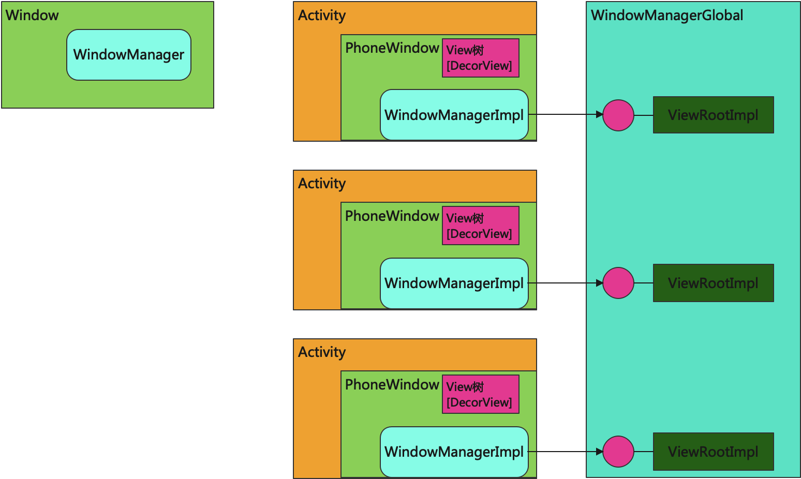
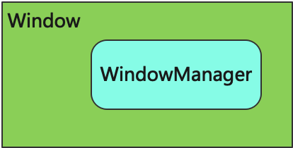
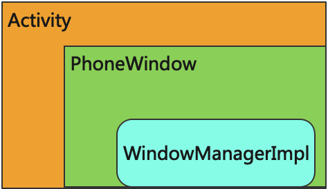
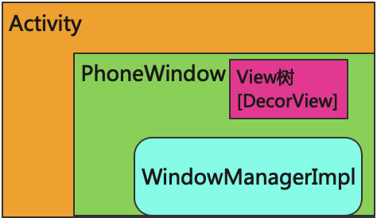
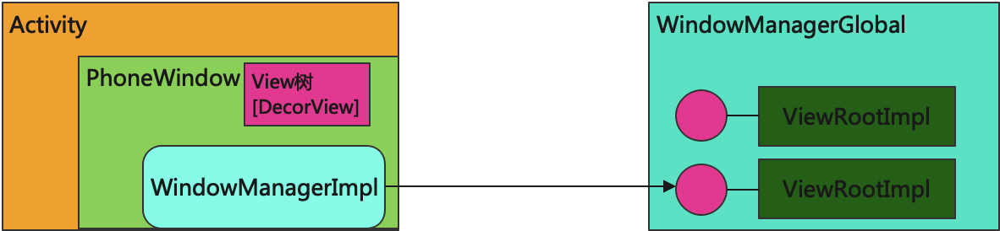

# Window机制

## 概念

`Acitivty`作为`Android`几个重要的组件之一，是我们学习`Android`时接触的比较靠前的知识点，承担着UI和交互的控制逻辑；`View`也会经常遇到，从XML布局的编写到Activity中UI的展示；然而，相比之下，`Window`在我们平时开发的时候用到的并不是特别多。

先撇开负责的源码和难懂的概念，我们现在谈的`Window`都是单纯地指Window这个类，所以我们先看`Window`这个类，由简单到复杂。

我们先理解几个概念：

* 每个`Window`都有自己唯一的一个`WindowManager`，`WindowManager`负责维护它所在的`Window`里面的内容
* 在`Android`平台上`Window`的具体实现是`PhoneWindow`、对应它的`WindowManager`是`WindowManagerImpl`
* `WindowManagerImpl`维护`PhoneWindow`中的`DecorView`及其子`View`所组成的`View`树
* 一个`Activity`有且只有一个`PhoneWindow`实例，一个`Dialog`同样有且只有一个`PhoneWindow`实例

我们来看下面这张图：



图中，一个`Window`都有一个`WindowManager`负责管理它的内容。`PhoneWindow`的内容交给`WindowManagerImpl`管理，这里的『内容』指的是`DecorView`及其子`View`所组成的View树。

当`WindowManagerImpl`管理`View`树时，会给这个`View`树分配一个`ViewRootImpl`，`ViewRootImpl`则是负责与其他服务通信并指导`View`树的绘制工作。

`Activity`有`PhoneWindow`对象，`Dialog`同样也有自己的`PhoneWindow`对象。

## Window与WindowManager

虽然在 Android 平台上`PhoneWindow`是`Window`的唯一实现，但是并不建议直接跳过`Window`看`PhoneWindow`；毕竟实现类和抽象类之间还是会有着千丝万缕的关系。 我们看`Window`的代码，会发现它有一个`WindowManager`对象。这个`WindowManager`就负责管理当前`Window`对象的内容。

// frameworks/base/core/java/android/view/Window.java

```java
public abstract class Window {
    ...
    private WindowManager mWindowManager;
    ...

    public void setWindowManager(WindowManager wm, IBinder appToken, String appName,
            boolean hardwareAccelerated) {
        mAppToken = appToken;
        mAppName = appName;
        mHardwareAccelerated = hardwareAccelerated;
        if (wm == null) {
            wm = (WindowManager)mContext.getSystemService(Context.WINDOW_SERVICE);
        }
        mWindowManager = ((WindowManagerImpl)wm).createLocalWindowManager(this);
    }
}
```

当`PhoneWindow`内部需要获取`WindowManager`对象时，可通过`Window`中暴露的`getWindowManager`方法获取。



## Activity与PhoneWindow

接下来再看看`Window`的实现`PhoneWindow`。这里将主要介绍`Actitity`启动过程中，`PhoneWinow`的创建流程、`WindowManagerImpl`的绑定、`DecorView`的创建以及`ViewRootImpl`的分配。

### 创建PhoneWindow

首先一起看一下`PhoneWindow`是何时创建的。在`Activity` 启动时 `ActivityThread` 会调用 `performLaunchActivity()`方法创建一个`Activity`实例，紧接着会调用它的 `attach` 方法。

// frameworks/base/core/java/android/app/ActivityThread.java

```java
/**  Core implementation of activity launch. */
private Activity performLaunchActivity(ActivityClientRecord r, Intent customIntent) {
    ...
    Activity activity = null;
    try {
        java.lang.ClassLoader cl = appContext.getClassLoader();
        activity = mInstrumentation.newActivity(
                cl, component.getClassName(), r.intent);
        ...
    } catch (Exception e) {
        ...
    }

    try {
        Application app = r.packageInfo.makeApplication(false, mInstrumentation);
      	...
        if (activity != null) {
            ...
            activity.attach(appContext, this, getInstrumentation(), r.token,
                    r.ident, app, r.intent, r.activityInfo, title, r.parent,
                    r.embeddedID, r.lastNonConfigurationInstances, config,
                    r.referrer, r.voiceInteractor, window, r.configCallback,
                    r.assistToken, r.shareableActivityToken);
            ...
        }
    } catch (SuperNotCalledException e) {
        throw e;
    } catch (Exception e) {
        ...
    }

    return activity;
}
```

在 `Activity` 的 `attach` 方法当中，`PhoneWindow`被创建并赋值给 `Activity` 的成员变量`mWindow`，紧接着会为`PhoneWindow`设置一个`WindowManager`。

// frameworks/base/core/java/android/app/Activity.java

```java
final void attach(Context context, ActivityThread aThread,
        Instrumentation instr, IBinder token, int ident,
        Application application, Intent intent, ActivityInfo info,
        CharSequence title, Activity parent, String id,
        NonConfigurationInstances lastNonConfigurationInstances,
        Configuration config, String referrer, IVoiceInteractor voiceInteractor,
        Window window, ActivityConfigCallback activityConfigCallback, IBinder assistToken) {
    	...
      //创建PhoneWindow对象
      mWindow = new PhoneWindow(this, window, activityConfigCallback);
    	...
      //为PhoneWindow设置WindowManager
      mWindow.setWindowManager(
      				(WindowManager)context.getSystemService(Context.WINDOW_SERVICE),
      				mToken, mComponent.flattenToString(),
      				(info.flags & ActivityInfo.FLAG_HARDWARE_ACCELERATED) != 0);

    	mWindowManager = mWindow.getWindowManager();
}
```

// frameworks/base/core/java/android/view/Window.java

```java
public void setWindowManager(WindowManager wm, IBinder appToken, String appName,
        boolean hardwareAccelerated) {
    ...
    if (wm == null) {
        wm = (WindowManager)mContext.getSystemService(Context.WINDOW_SERVICE);
    }
    //创建WindowManagerImpl实例，并赋值给Window的成员变量mWindowManager
    mWindowManager = ((WindowManagerImpl)wm).createLocalWindowManager(this);
}
```

// frameworks/base/core/java/android/view/WindowManagerImpl.java

```java
public WindowManagerImpl createLocalWindowManager(Window parentWindow) {
    return new WindowManagerImpl(mContext, parentWindow, mWindowContextToken);
}
```

可以看到`Activity`并不是天生就有`PhoneWindow`的，只是在启动过程中`Activity`的`attch()`方法被调用，然后才会给`Activity`创建`PhoneWindow`对象，并在`PhoneWindow`创建后紧接着给它新建一个`WindowManagerImpl`。

`attch()`完成后,`Activity` 就是这个样子了。



### 创建DecorView

当`PhoneWindow`及其内容管理者`WindowManagerImpl`创建好了以后，就需要关心管理者所管理的`View`树是何时创建了。也就是`DecorView`何时创建，这一点大部分读者都比较熟悉，在 Activity 中调用 `setContentView()`时，`DecorView`会被创建。

// frameworks/base/core/java/android/app/Activity.java

```java
/**
 * Set the activity content from a layout resource.  The resource will be
 * inflated, adding all top-level views to the activity.
 *
 * @param layoutResID Resource ID to be inflated.
 *
 * @see #setContentView(android.view.View)
 * @see #setContentView(android.view.View, android.view.ViewGroup.LayoutParams)
 */
public void setContentView(@LayoutRes int layoutResID) {
    getWindow().setContentView(layoutResID);
    initWindowDecorActionBar();
}
```

上述的 `getWindow().setContentView(layoutResID)`实际调用的就是`PhoneWindow`的`setContentView`方法。其源码如下：

// frameworks/base/core/java/com/android/internal/policy/PhoneWindow.java

```java
@Override
public void setContentView(int layoutResID) {
    // Note: FEATURE_CONTENT_TRANSITIONS may be set in the process of installing the window
    // decor, when theme attributes and the like are crystalized. Do not check the feature
    // before this happens.
    if (mContentParent == null) {
      //创建DecorView
      installDecor();
    } else if (!hasFeature(FEATURE_CONTENT_TRANSITIONS)) {
      mContentParent.removeAllViews();
    }
    ...
}

private void installDecor() {
  mForceDecorInstall = false;
  if (mDecor == null) {
    //创建DecorView并赋值给PhoneWindow的成员变量mDecor
    mDecor = generateDecor(-1);
    ...
  }
  ...
}

protected DecorView generateDecor(int featureId) {
  // System process doesn't have application context and in that case we need to directly use
  // the context we have. Otherwise we want the application context, so we don't cling to the
  // activity.
  Context context;
  if (mUseDecorContext) {
    Context applicationContext = getContext().getApplicationContext();
    if (applicationContext == null) {
      context = getContext();
    } else {
      context = new DecorContext(applicationContext, this);
      if (mTheme != -1) {
        context.setTheme(mTheme);
      }
    }
  } else {
    context = getContext();
  }
  //新建DecorView对象，并将PhoneWindow实例传入其中
  return new DecorView(context, featureId, this, getAttributes());
}
```

完成`setContent`后，`PhoneWindow`也有自己的`DecorView`了。不过到目前为止，虽然`Activity`有`PhoneWindow`，有`PhoneWindow`也有`WindowManagerImpl`和`DecorView`（或`View`树）了，此时的 `Activity`仍然不会在界面上显示任何东西。

要在界面上显示`View`树，必须要通知`WindowManagerServices`才可以,这个通知工作在是在`ViewRootImpl`之中完成，然而目前还未曾创建`ViewRootImpl`。



### 创建ViewRootImpl

上面讲到在`View`树显示到界面之前，需要有一个`ViewRootImpl`负责指导它的绘制显示工作。那这个`ViewRootImpl`是何时创建并与`View`树关联的呢？

一句话简要概况：当`WindowManagerImpl`决定管理`View`树时，会给它关联一个`ViewRootImpl`实例。

从代码层面来说就是`WindowManagerImpl`调用`addView`方法将`View`树添加到`View`列表中时。
先看一下`WindowManagerImpl`的`addView`方法：

// frameworks/base/core/java/android/view/WindowManagerImpl.java

```java
//单例 WindowManagerGlobal
private final WindowManagerGlobal mGlobal = WindowManagerGlobal.getInstance();

@Override
public void addView(@NonNull View view, @NonNull ViewGroup.LayoutParams params) {
    applyTokens(params);
    mGlobal.addView(view, params, mContext.getDisplayNoVerify(), mParentWindow, mContext.getUserId());
}
```

可以看到所有的`WindowManagerImpl`对`View`的管理都是交给一个唯一的`WindowManagerGlobal`了。所以，我们需要再看看`WindowManagerGlobal`的`addView`方法：

// frameworks/base/core/java/android/view/WindowManagerGlobal.java

```java
private static IWindowSession sWindowSession;

private final ArrayList<View> mViews = new ArrayList<View>();
@UnsupportedAppUsage
private final ArrayList<ViewRootImpl> mRoots = new ArrayList<ViewRootImpl>();
@UnsupportedAppUsage
private final ArrayList<WindowManager.LayoutParams> mParams =
  new ArrayList<WindowManager.LayoutParams>();

public void addView(View view, ViewGroup.LayoutParams params,
				Display display, Window parentWindow) {
  	...
    final WindowManager.LayoutParams wparams = (WindowManager.LayoutParams) params;
  	...
    ViewRootImpl root;
  	View panelParentView = null;

    synchronized (mLock) {
      	...
        // 创建ViewRootImpl实例
        root = new ViewRootImpl(view.getContext(), display);
        // 给View设置属性
        view.setLayoutParams(wparams);

        mViews.add(view);
        mRoots.add(root);
        mParams.add(wparams);
        //将ViewRootImp于View进行绑定
        // do this last because it fires off messages to start doing things
          try {
            	root.setView(view, wparams, panelParentView, userId);
          } catch (RuntimeException e) {
              ...
          }
    }
}
```

可以看到当`WindowManagerGlobal`的`addView`方法被调用时，`ViewRootImpl`被创建并将其与`View`树进行绑定。`ViewRootImpl`与`View`树进行绑定后，`Activity`看起来就是这个样子了。



看到这里我们可能会有一个疑问，那就是这个Activity何时会让`WindowManagerImpl`执行`addView`操作呢？
为了解决这个问题？我们需要再回到`Activity`的启动流程，观察`ActivityThread`的`handleResumeActivity`方法：

// frameworks/base/core/java/android/app/ActivityThread.java

```java
@Override
public void handleResumeActivity(ActivityClientRecord r, boolean finalStateRequest,
         boolean isForward, String reason) {
  	...
    // TODO Push resumeArgs into the activity for consideration
    // skip below steps for double-resume and r.mFinish = true case.
    // 内部会调用Activity的onResume方法
    if (!performResumeActivity(r, finalStateRequest, reason)) {
        return;
    }

    final Activity a = r.activity;

    final int forwardBit = isForward
      			? WindowManager.LayoutParams.SOFT_INPUT_IS_FORWARD_NAVIGATION : 0;

    // If the window hasn't yet been added to the window manager,
    // and this guy didn't finish itself or start another activity,
    // then go ahead and add the window.
    boolean willBeVisible = !a.mStartedActivity;
    if (!willBeVisible) {
        willBeVisible = ActivityClient.getInstance().willActivityBeVisible(
          			a.getActivityToken());
     }
    //从willBeVisible的注释中可以了解到当窗口没有被添加到WindowManager中时willBeVisible为true
    if (r.window == null && !a.mFinished && willBeVisible) {
        r.window = r.activity.getWindow();
        View decor = r.window.getDecorView();
        decor.setVisibility(View.INVISIBLE);
        ViewManager wm = a.getWindowManager();
        WindowManager.LayoutParams l = r.window.getAttributes();
        a.mDecor = decor;
        //窗口类型设置
        l.type = WindowManager.LayoutParams.TYPE_BASE_APPLICATION;
				...
        if (a.mVisibleFromClient) {
            if (!a.mWindowAdded) {
                a.mWindowAdded = true;
                //WindowManagerImpl将View添加到自己的管理队列中
                wm.addView(decor, l);
            } else {
              	// The activity will get a callback for this {@link LayoutParams} change
                // earlier. However, at that time the decor will not be set (this is set
                // in this method), so no action will be taken. This call ensures the
                // callback occurs with the decor set.
              	a.onWindowAttributesChanged(l);
            }
      	}
    }
  	...
}
```

阅读完`handleResumeActivity`方法后，`WindowManagerImpl`的`addView`方法正是在此方法中完成的。

流程有点长，先小结一下之前的内容： 

1) 在`Activity`的启动过程中，`ActivityThread`会创建一个`Activity`实例。 
2) 在`Activity`实例创建完成后，紧接着执行`Activity#attach()`方法。 
3) 在`Activity#attach()`方法之内`PhoneWindow`被创建，并同时创建一个`WindowManagerImpl`负责维护`PhoneWindow`内的内容。 
4) 在`Activity#onCreate()`中调用`setContent()`方法，这个方法内部创建一个`DecorView`实例作为`PhoneWindow`的内容。 
5) 在`ActivityThread#handleResumeActivity()`方法中`WindowManagerImpl#addView`被调用，`WindowManagerImpl`决定管理`DecorView`，并创建一个`ViewRootImpl`实例,将`ViewRootImpl`与`View`树进行关联，这样`ViewRootImpl`就可以指挥`View`树的具体**工作**。

`ViewRootImpl`指挥`View`树的这些**工作**包含：`View`树的显示、测量绘制、同步刷新以及事件分发。由于涉及的篇幅较长，后续可单独进行分析。

## ViewRootImpl与View

刚刚我们交代了`ViewRootImpl`的创建时机，同时也讲到`View`树的显示、测量绘制、同步刷新以及事件分发这些工作与`ViewRootImpl`联系紧密。

`ViewRootImpl`再看看它的具体实现：

// frameworks/base/core/java/android/view/ViewRootImpl.java

```java
final IWindowSession mWindowSession;
final W mWindow;
Choreographer mChoreographer;

WindowInputEventReceiver mInputEventReceiver;

public ViewRootImpl(Context context, Display display) {
  	this(context, display, WindowManagerGlobal.getWindowSession(),
       			false /* useSfChoreographer */);
}

public ViewRootImpl(@UiContext Context context, Display display, IWindowSession session) {
  	this(context, display, session, false /* useSfChoreographer */);
}

public ViewRootImpl(@UiContext Context context, Display display, IWindowSession session,
                    boolean useSfChoreographer) {
  	...
    mWindowSession = session;
  	...
    mWindow = new W(this);
    mChoreographer = useSfChoreographer
            ? Choreographer.getSfInstance() : Choreographer.getInstance();
    ...
}

/**
 * We have one child
 */
public void setView(View view, WindowManager.LayoutParams attrs, View panelParentView) {
  	setView(view, attrs, panelParentView, UserHandle.myUserId());
}

/**
 * We have one child
 */
public void setView(View view, WindowManager.LayoutParams attrs, View panelParentView,
        int userId) {
  	synchronized (this) {
        if (mView == null) {
            mView = view;
            ......
            // Schedule the first layout -before- adding to the window
            // manager, to make sure we do the relayout before receiving
            // any other events from the system.
            // WMS添加窗口之前，进行一次测量布局工作，这样才能保证各类系统事件与View位置对应关系的准确性
            requestLayout();
          	...
            //通过mWindowSession通知WMS添加并显示窗口
            res = mWindowSession.addToDisplayAsUser(mWindow, mWindowAttributes,
                    getHostVisibility(), mDisplay.getDisplayId(), userId,
                    mInsetsController.getRequestedVisibilities(), inputChannel, mTempInsets,
                    mTempControls);
            ......
            if (inputChannel != null) {
                //初始化事件接收器，
                mInputEventReceiver = new WindowInputEventReceiver(mInputChannel,
                        Looper.myLooper());
                ...
            }
            //将当前ViewRootImpl实例赋值给DecorView的mParent变量
            //众View之父，由此而来
            view.assignParent(this);
          	...
        }
		}
}
```

`ViewRootImpl`中有`mIWindowSession`、`mWindow`、`mChoreographer`、`mInputEventReceiver`三个比较重要的变量。

### mIWindowSession与mWindow

`mIWindowSession`、`mWindow`为`Binder`对象，用于APP端与`WMS`之间的相互通信。细心的读者可能会发现，在`ViewRootImpl`对象创建后紧接着有一个`ViewRootImpl`的`setView`操作。不难发现，在`ViewRootImpl#setView`中使用了`IWindowSession.addToDisplayAsUser`来通知`WMS`添加并显示窗口。

### mChoreographer

对于部分同学来说`Choreographer`可能并不陌生，我们通常叫做“编舞者”。无论是系统同步刷新、`View`的`requestLayout`还是界面帧率监控，都能看到`Choreographer`的身影。 `Choreographer`内容很多。我们可以去看看[《Choreographer原理》](https://link.zhihu.com/?target=http%3A//gityuan.com/2017/02/25/choreographer/)、[《Android 怎么就不卡了呢之Choreographer》](https://link.zhihu.com/?target=https%3A//juejin.cn/post/6844903818044375053%23heading-16)或者[《你真的了解16.6ms刷新机制吗？》](https://link.zhihu.com/?target=https%3A//juejin.cn/post/6844903849833005069)

### mInputEventReceiver

最后一点要讲的就是`WindowInputEventReceiver`在事件分发事件中的作用。可能一谈到事件分发，部分同学就会想到`View`的事件分发，可是`View`的事件是谁传给它的呢？我们可以看看[《Input系统—事件处理全过程》](https://link.zhihu.com/?target=http%3A//gityuan.com/2016/12/31/input-ipc/)，如果觉得此片文章难度较大，可以先看看[《原来Android触控机制竟是这样的？》](https://link.zhihu.com/?target=https%3A//www.jianshu.com/p/b7cef3b3e703)。

## 总结

无论是`Activity`还是`PopupWindow`，又或者`Dialog`。这些对象需要显示到界面，都是通过调用`WindowManagerImpl#addView`来间接完成，它们所显示的内容实际就是`View`树，这个`View`树我们称之为“窗口”。`addView`时，会生成一个`ViewRootImpl`与`View`树进行关联，`ViewRootImpl`内部则通过`WindowSession`来与`WMS`进行通讯最终完成显示。另一方面，`WMS`通过一个`ViewRootImpl$W`实例（`mWindow`）代理，将`WMS`端的事件传递到`ViewRootImpl`，最终交给`View`树。
