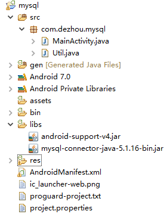

android 远程访问访问mysql数据库，使用非root用户连接

对数据库的操作放到线程中执行（新版Android在主线程不可以进行网络访问）

mysql> use mysql;

mysql> GRANT ALL ON *.* TO usrname@'%' IDENTIFIED BY 'password' WITH GRANT OPTION;

\#这句话的意思 ，允许任何IP地址（上面的 % 就是这个意思）的电脑 用admin帐户 和密码（admin）来访问这个MySQL Server  

\#必须加类似这样的帐户，才可以远程登陆。 root帐户是无法远程登陆的，只可以本地登陆 

工程结构：

***将\******mysql-connector-java-5.1.16-bin.jar\******放到\******libs\******目录中，没有就新建\***

示例：

MainActivity.java：

**package** com.dezhou.mysql;

 

**import** java.sql.Connection; 

**import** java.sql.SQLException; 

 

**import** android.app.Activity; 

**import** android.os.Bundle; 

**import** android.view.View; 

 

**public** **class** MainActivity **extends** Activity { 

 

  //private static final String REMOTE_IP = "192.168.1.104"; 

  //private static final String URL = "jdbc:mysql://" + REMOTE_IP + "/dezhou";

  **private** **static** **final** String *URL* = "jdbc:mysql://192.168.1.104:3306/dezhou";

  //private static final String URL = "http://192.168.1.104:3306/dezhou";

  **private** **static** **final** String *USER* = "dezhou"; 

  **private** **static** **final** String *PASSWORD* = "dezhou"; 

 

  **private** Connection conn; 

 

  @Override 

  **public** **void** onCreate(Bundle savedInstanceState) { 

​    **super**.onCreate(savedInstanceState); 

​    setContentView(R.layout.*main*); 

  } 

 

  **public** **void** onConn(View view) { 

   **new** Thread() {

 

​      @Override

​      **public** **void** run() {

​        conn = Util.*openConnection*(*URL*, *USER*, *PASSWORD*); 

​        **if**(**null** != conn)

​          {

​           System.*out*.println("----Database Connect success!----\n");

​          }**else**

​          {

​           System.*out*.println("----Database Connect failed!----\n");

​          }

​      }

​    }.start();

  } 

 

  **public** **void** onInsert(View view) { 

   **new** Thread(){

​    

​    @Override

​    **public** **void** run() {

​      String sql = "insert into user values(3, 'david2')"; 

​       Util.*execSQL*(conn, sql); 

​    }

   }.start();

  } 

 

  **public** **void** onDelete(View view) { 

   **new** Thread(){

​    @Override

​    **public** **void** run() {

​      String sql = "delete from user where name='dezhou'"; 

​       Util.*execSQL*(conn, sql); 

​    }

   }.start();  

  } 

 

  **public** **void** onUpdate(View view) { 

   **new** Thread(){

​    @Override

​    **public** **void** run() {

​       String sql = "update user set name='dezhou' where name='david2'"; 

​       Util.*execSQL*(conn, sql); 

​    }

   }.start(); 

  } 

 

  **public** **void** onQuery(View view){ 

   **new** Thread() {

 

​      @Override

​      **public** **void** run() {

​        System.*out*.println("All users info:"); 

​        Util.*query*(conn, "select * from user");

​      }

​    }.start();    

  } 

 

  @Override 

  **protected** **void** onDestroy() { 

​    **super**.onDestroy(); 

​    **if** (conn != **null**) { 

​      **try** { 

​        conn.close(); 

​      } **catch** (SQLException e) { 

​        conn = **null**; 

​      } **finally** { 

​        conn = **null**; 

​      } 

​    } 

  } 

} 

 

Util.java:

**package** com.dezhou.mysql;

 

**import** java.sql.Connection; 

**import** java.sql.DriverManager; 

**import** java.sql.ResultSet; 

**import** java.sql.SQLException; 

**import** java.sql.Statement; 

 

**public** **class** Util { 

 

  **public** **static** Connection openConnection(String url, String user, 

​      String password) { 

​    Connection conn = **null**; 

​    **try** { 

​      **final** String DRIVER_NAME = "com.mysql.jdbc.Driver"; 

​      Class.*forName*(DRIVER_NAME).newInstance(); 

​       conn = DriverManager.*getConnection*(url, user, password); 

​    } **catch** (ClassNotFoundException e) { 

​      conn = **null**; 

​    } **catch** (SQLException e) { 

​      conn = **null**; 

​    } **catch** (Exception e) {

​     System.*out*.print("Error loading Mysql Driver!"); 

​      e.printStackTrace(); 

​    }

 

​    **return** conn; 

  } 

 

  **public** **static** **void** query(Connection conn, String sql) { 

 

​    **if** (conn == **null**) { 

​     System.*out*.println("----Database Connection error!----\n");

​      **return**; 

​    } 

 

​    Statement statement = **null**; 

​    ResultSet result = **null**; 

 

​    **try** { 

​      statement = conn.createStatement(); 

​      **if**(**null** != statement)

​      {

​       //System.out.println("----Statement is not null!----\n");

​       result = statement.executeQuery(sql); 

​        **if** (result != **null** && result.first()) { 

​         //System.out.println("----Result is not e!----\n");

​          **int** idColumnIndex = result.findColumn("id"); 

​          **int** nameColumnIndex = result.findColumn("name"); 

​          System.*out*.println("id \t\t" + "name"); 

​          **while** (!result.isAfterLast()) { 

​            System.*out*.print(result.getString(idColumnIndex) + "  \t\t"); 

​            System.*out*.println(result.getString(nameColumnIndex)); 

​            result.next(); 

​          } 

​        }**else**

​        {

​         System.*out*.println("----Result is null!----\n");

​        }

​      }**else**

​      {

​       System.*out*.println("----Statement is null!----\n");

​       }

​    } **catch** (SQLException e) { 

​      e.printStackTrace(); 

​    } **finally** { 

​      **try** { 

​        **if** (result != **null**) { 

​          result.close(); 

​          result = **null**; 

​        } 

​        **if** (statement != **null**) { 

​          statement.close(); 

​          statement = **null**; 

​        } 

 

​      } **catch** (SQLException sqle) { 

 

​      } 

​    } 

  } 

 

  **public** **static** **boolean** execSQL(Connection conn, String sql) { 

​    **boolean** execResult = **false**; 

​    **if** (conn == **null**) { 

​     System.*out*.println("----Database Connection error, now conn is null!----\n");

​      **return** execResult; 

​    } 

 

​    Statement statement = **null**; 

 

​    **try** { 

​      statement = conn.createStatement(); 

​      **if** (statement != **null**) { 

​        execResult = statement.execute(sql); 

​      } 

​    } **catch** (SQLException e) { 

​      execResult = **false**; 

​    } 

 

​    **return** execResult; 

  } 

} 

 

Main.xml:

<?xml version=*"1.0"* encoding=*"utf-8"*?>

<LinearLayout xmlns:android=*"http://schemas.android.com/apk/res/android"* 

  android:layout_width=*"fill_parent"* 

  android:layout_height=*"fill_parent"* 

  android:orientation=*"vertical"* > 

 

  <Button 

​    android:layout_width=*"fill_parent"* 

​    android:layout_height=*"wrap_content"* 

​    android:layout_marginBottom=*"10dip"* 

​    android:onClick=*"onConn"* 

​    android:text=*"connect mysql"* /> 

 

  <Button 

​    android:layout_width=*"fill_parent"* 

​    android:layout_height=*"wrap_content"* 

​    android:layout_marginBottom=*"10dip"* 

​    android:onClick=*"onInsert"* 

​    android:text=*"insert data"* /> 

 

  <Button 

​    android:layout_width=*"fill_parent"* 

​    android:layout_height=*"wrap_content"* 

​    android:layout_marginBottom=*"10dip"* 

​    android:onClick=*"onDelete"* 

​    android:text=*"delete data"* /> 

 

  <Button 

​    android:layout_width=*"fill_parent"* 

​    android:layout_height=*"wrap_content"* 

​    android:layout_marginBottom=*"10dip"* 

​    android:onClick=*"onUpdate"* 

​    android:text=*"update data"* /> 

 

  <Button 

​    android:layout_width=*"fill_parent"* 

​    android:layout_height=*"wrap_content"* 

​    android:onClick=*"onQuery"* 

​    android:text=*"query data"* /> 

 

</LinearLayout>

 

AndroidManifest.xml：***增加网络访问权限\***

<?xml version=*"1.0"* encoding=*"utf-8"*?>

<manifest xmlns:android=*"http://schemas.android.com/apk/res/android"*

  package=*"com.dezhou.mysql"*

  android:versionCode=*"1"*

  android:versionName=*"1.0"* >

 

  <uses-sdk

​    android:minSdkVersion=*"8"*

​    android:targetSdkVersion=*"18"* />

  <uses-permission android:name=*"android.permission.INTERNET"*/>

 

  <application

​    android:allowBackup=*"true"*

​    android:icon=*"@drawable/ic_launcher"*

​    android:label=*"@string/app_name"*

​    android:theme=*"@style/AppTheme"* >

​    <activity

​      android:name=*"com.dezhou.mysql.MainActivity"*

​      android:label=*"@string/app_name"* >

​      <intent-filter>

​        <action android:name=*"android.intent.action.MAIN"* />

 

​        <category android:name=*"android.intent.category.LAUNCHER"* />

​      </intent-filter>

​    </activity>

  </application>

 

</manifest>

 