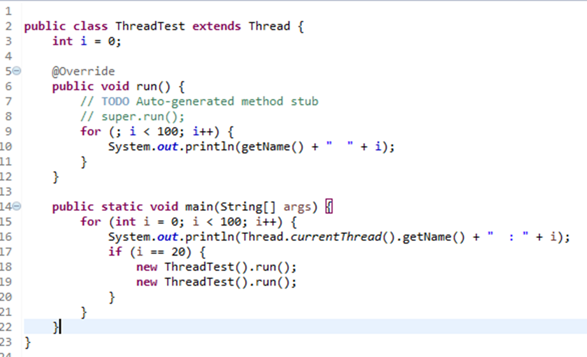
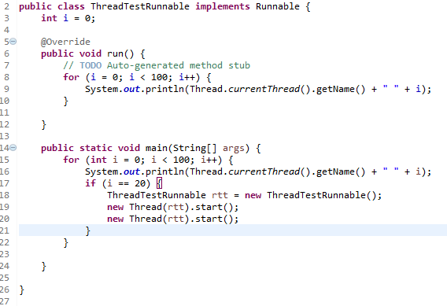

# 线程

## 创建线程的方式及实现

### 1.继承Thread类创建线程类

调用run只是相当于调用了一个方法，而没有启动新的线程，还会按照顺序执行相应的代码。

调用start会启动一个新的线程，运行重写的run代码。 

### 2.通过Runnable接口创建线程类

（1）定义runnable接口的实现类，并重写该接口的run()方法。

（2）创建Runnable实现类的实例，并以此实例作为Thread的target来创建Thread对象，该Thread对象才是真正的线程对象

（3）调用线程对象的start()方法来启动线程。

### 3.通过Callable和Future创建线程（沒怎么用过）

（1）创建Callable接口的实现类，并实现call()方法，该call()方法将作为线程执行体，并且有返回值。

（2）创建Callable实现类的实例，使用FutureTask类来包装Callable对象，该FutureTask对象封装了该Callback对象的call()方法的返回值；

（3）使用FutureTask对象作为Thread对象的target创建并启动新线程；

（4）调用FutureTask对象的get()方法来获得子线程执行结束后的返回值。