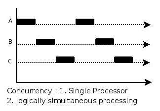

# 进程和线程

## 两者的关系

通常在一个进程中可以包含若干个线程，它们可以利用进程所拥有的资源，在引入线程的操作系统中，通常都是把进程作为分配资源的基本单位，而把线程作为独立运行和独立调度的基本单位，由于线程比进程更小，基本上不拥有系统资源，故对它的调度所付出的开销就会小得多，能更高效的提高系统内多个程序间并发执行的程度。进程有自己独立的地址空间，而线程没有，线程必须依赖于进程而存在

线程属性

1.有标识符ID

2.有状态及状态转换，所以需要提供一些状态转换操作

3.不运行时需要保存上下文环境，所以需要程序计数器等寄存器

4.有自己的栈和栈指针

5.共享所在进程的地址空间和其它资源

## 两者的区别

定义方面：进程是程序在某个数据集合上的一次运行活动；线程是进程中的一个执行路径。（进程可以创建多个线程）

角色方面：在支持线程机制的系统中，进程是系统资源分配的单位，线程是CPU调度的单位。

资源共享方面：进程之间不能共享资源，而线程共享所在进程的地址空间和其它资源。同时线程还有自己的栈和栈指针，程序计数器等寄存器。

独立性方面：进程有自己独立的地址空间，而线程没有，线程必须依赖于进程而存在。

 

开销方面：进程切换的开销较大，线程相对较小。（前面也提到过，引入线程也出于了开销的考虑。）

当下推出的通用操作系统都引入了线程，以便进一步提高系统的并发性，并把它视为现代操作系统的一个重要指标。

 

Thread and Process are two closely related terms in multi-threading. The main difference between the two terms is that the threads are a part of a process, i.e. a process may contain one or more threads, but a thread cannot contain a process.

In programming, there are two basic units of execution: processes and threads. They both execute a series of instructions. Both are initiated by a program or the operating system. This article helps to differentiate between the two units.

A process is an instance of a program that is being executed. It contains the program code and its current activity. Depending on the operating system, a process may be made up of multiple threads of execution that execute instructions concurrently. A program is a collection of instructions; a process is the actual execution of those instructions.

A process has a self-contained execution environment. It has a complete set of private basic run-time resources; in particular, each process has its own memory space. Processes are often considered similar to other programs or applications. However, the running of a single application may in fact be a set of cooperating processes. To facilitate communication between the processes, most operating systems use Inter Process Communication (IPC) resources, such as pipes and sockets. The IPC resources can also be used for communication between processes on different systems. Most applications in a virtual machine run as a single process. However, it can create additional processes using a process builder object.

## 并行和并发的概念

一、

并行：多个处理器或者是多核处理器同事处理多个不同的任务，指物理上的同时发生；

并发：一个处理器同时处理多个任务，指逻辑上的同时发生；

二、

并行(parallel)：指在同一时刻，有多条指令在多个处理器上同时执行。就好像两个人各拿一把铁锨在挖坑，一小时后，每人一个大坑。所以无论从微观还是从宏观来看，二者都是一起执行的。 

并发(concurrency)：指在同一时刻只能有一条指令执行，但多个进程指令被快速的轮换执行，使得在宏观上具有多个进程同时执行的效果，但在微观上并不是同时执行的，只是把时间分成若干段，使多个进程快速交替的执行。这就好像两个人用同一把铁锨，轮流挖坑，一小时后，两个人各挖一个小一点的坑，要想挖两个大一点得坑，一定会用两个小时。

并行在多处理器系统中存在，而并发可以在单处理器和多处理器系统中都存在，并发能够在单处理器系统中存在是因为并发是并行的假象，并行要求程序能够同时执行多个操作，而并发只是要求程序假装同时执行多个操作（每个小时间片执行一个操作，多个操作快速切换执行）。 

三、

当有多个线程在操作时,如果系统只有一个CPU,则它根本不可能真正同时进行一个以上的线程,它只能把CPU运行时间划分成若干个时间段,再将时间段分配给各个线程执行,在一个时间段的线程代码运行时,其它线程处于挂起状态.这种方式我们称之为并发(Concurrent)。

当系统有一个以上CPU时,则线程的操作有可能非并发.当一个CPU执行一个线程时,另一个CPU可以执行另一个线程,两个线程互不抢占CPU资源,可以同时进行,这种方式我们称之为并行(Parallel)。 

