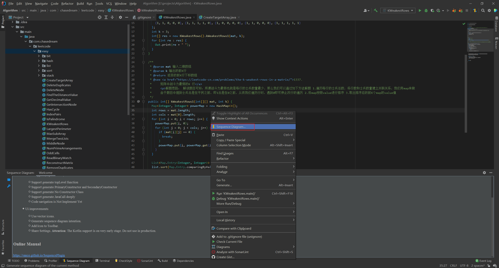

# Intellij

## 配置copyright和类头

### copyright

File->Setting->Copyright->Copyright Profiles,点击+号按钮，输入合法的copyright信息，点击validate，合格后，点击apply；


点击上一层的Copyright，Default project copyright，选择刚刚创建的coptright后点击应用。


### 类头信息

Editor下的File and Code Templates，然后点击右侧的Includes，选择File Header进行编辑，编辑的内容如右侧所示，然后点击Apply即可。

```
/**
 * @Description 
 * @Author      Zhang DeZhou
 * @Since       ${DATE} ${TIME}
 */
```


## 设置自动导包

首先，点击左上角的 “File”，选择 “settings”，或直接按快捷键Ctrl+Alt+s

选择“Editor”-“general”-“auto import”，在右侧将空勾选


## 插件工具

### CheckStyle

CheckStyle-IDEA

**下载：**


### Google-java-format

Google提供Java代码规范插件，可以按照google要求的代码规范进行代码的格式化。您也可以参阅[Google Java Style Guide](https://google.github.io/styleguide/javaguide.html)

**下载：**


**示例：**

Setting->Other Settings->google-java-format Settings，勾选Enable google-java-format，Code style选择Default Google Java style，最后点击“Apply”


这样，后面您的代码格式化将会按照google style进行格式化。

同时，结合上面下载的CheckStyle，您可以使用Google style检查您的代码是否符合Google Java编码规范；

使用：打开任意的类，选中IDEA下面任务栏中的CheckStyle，在Rules栏目选中Google Checks，紧接着点击左边的运行按钮，将会显示出所有和Google Java规范不符的条目


### Sonarlint

[代码质量管理]( http://intellij.sonarlint.org)，该款插件可以帮您找出代码隐藏bug或者坏味道

**下载：**


安装完成后，IDEA会提示您进行重启IDEA，重启后生效

**示例：**

打开任意的类，选中IDEA下面任务栏中的SonarLint，点击左边的运行按钮，将会显示出所有不规范的条目


### Spellcheck

Grazie，Elixir这两款插件能够帮您进行拼写的语法检查，

* Grazie：Intellig Idea内置，支持15种语言，识别自然语言的组织结构
* Elixir：支持语义高亮和语法注解

更多的信息，您可在IDEA中的插件下载页面进行查看，如下面时Elixir的介绍：


### Rainbow bracket

顾名思义，我们可以从名称中了解到彩虹括符，即每一对扩符的颜色像彩虹一样五颜六色，容易区分；您还可以从[官网](https://plugins.jetbrains.com/plugin/10080-rainbow-brackets)了解其更多相关知识。

**下载：**

Settings->Plugins->Rainbow bracket->Install

**示例：**


### CodeGlance

当您阅读自己的代码或者查看源码的时候，成千上万行的代码，向下拖拽的时候是不是感觉很累；codeGlance插件帮你解决这个问题，其在右侧生成一个缩略图，您可以通过缩略图快速切换到自己需要的地方。您可以通过[官网](https://github.com/Vektah/CodeGlance)了解更多。

**下载：**

Settings->Plugins->CodeGlance->Install

**示例：**


### Ignore

经常使用git的同学对于ignore一定不会陌生，我们可以在该文件中设置一些忽略提交的规则。通过该插件可以生成各种ignore文件，一键创建git ignore文件的模板，解决了手动去配置的麻烦。

**下载：**


**示例：**

假设我现在需要在根目录创建git的ignore文件，则可按照如下步骤进行创建：在IDEA左侧的project栏目选中工程根目录，右键New->.ignore File->.gitignore File->Generate


则会在根目录创建一个.gitignore文件，如下所示：


我们可以在.gitignore文件中宿输入你想要过滤的文件或者文件夹，如

```groovy
.idea
target
Algorithm.iml
```

### GsonFormatPlus

**下载：**

Settings->Plugins->GsonFormatPlus->Install

**示例：**

1. 创建一个Person.java

   选中Person类->右键鼠标->Generate

   

2. 点击"GsonFromatPlus"

   

3. 输入json数据

   在左侧栏输入您的json数据，点击右上角的Format，format成功后点击OK

   

   选择需要参与生成Java文件的成员变量，点击OK，会在Person类中生成对应的成员变量

   

### VisualVM Launcher

该款插件可用于Jvm调优。运行java程序的时候启动visualvm，方便查看jvm的情况 比如堆内存大小的分配；某个对象占用了多大的内存，

**下载：**

Settings->Plugins->VisualVM Launcher->Install

**示例：**

1. 选择jvisualvm.exe

   

2. 点击右上角的VisualVM的Run/Debug按钮，会出现JavaVisualVM的界面

   

### SequenceDiagram

有的时候，我们需要梳理业务逻辑或者阅读源码。从中，我们需要了解整个调用链路，反向生成 UML 的时序图是强需求。其中，SequenceDiagram 插件是一个非常棒的插件。您可以查看[官方地址](https://plugins.jetbrains.com/plugin/8286-sequencediagram)获得更多详细信息。

**下载：**

Settings->Plugins->SequenceDiagram->Install

**示例：**

假设您想看某个方法的执行流程，您可以选择右键这个方法接口或者方法实现，下面以kWeakestRows1为例：



会在底部Sequence Diagram的tab页输出时序图：


