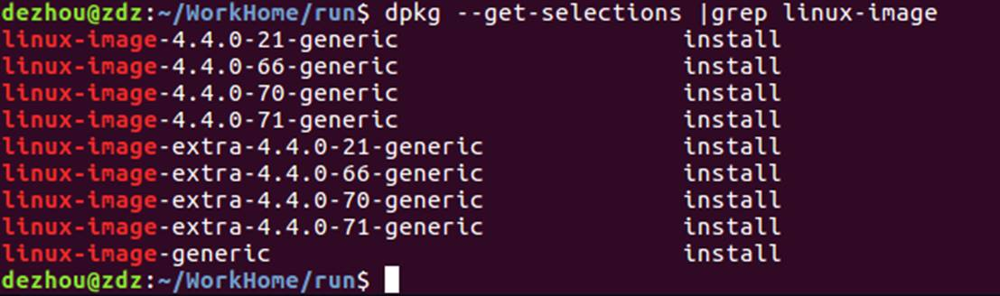
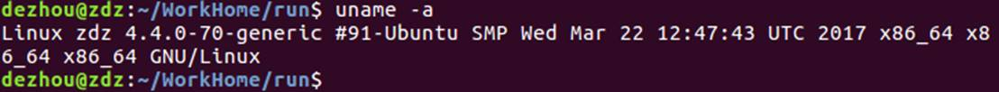
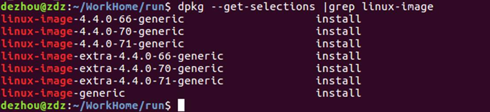
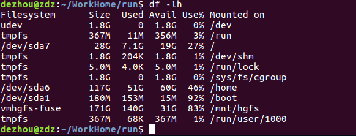

# Linux

## Ubuntu切换阿里源

请注意：Ubuntu 20.04 已于4月23日发布正式版本。
请注意：发现有些软件比如ckermit，仓库里还没有，升级及换源自行斟酌。

### 1 备份原来的源

```
cp -ra /etc/apt/sources.list /etc/apt/sources.list.bak
```

### 2 搞清楚ubuntu的代号

比如：
4.10 Warty Warthog(长疣的疣猪)
5.04 Hoary Hedgehog(灰白的刺猬)
5.10 Breezy Badger(活泼的獾)

6.06(LTS) Dapper Drake(整洁的公鸭)
6.10 Edgy Eft(急躁的水蜥)
7.04 Feisty Fawn(坏脾气的小鹿)
7.10 Gutsy Gibbon(勇敢的长臂猿)

8.04(LTS) Hardy Heron(耐寒的苍鹭)
8.10 Intrepid Ibex (勇敢的野山羊)
9.04 Jaunty Jackalope(得意洋洋的怀俄明野兔)
9.10 Karmic Koala(幸运的考拉)

10.04(LTS) Lucid Lynx(清醒的猞猁)
10.10 Oneiric Ocelot(梦幻的豹猫)
11.04 Natty Narwhal(敏捷的独角鲸)
11.10 Oneiric Ocelot（有梦的虎猫）

12.04(LTS) Precise Pangolin(精准的穿山甲)
12.10 Quantal Quetzal(量子的绿咬鹃)
13.04 Raring Ringtail(铆足了劲的猫熊)
13.10 Saucy Salamander(活泼的蝾螈)

14.04(LTS) Trusty Tahr (可靠的塔尔羊)(LTS)
14.10 Utopic Unicorn(乌托邦独角兽)
15.04 Vivid Vervet (活泼的小猴)
15.10 Wily Werewolf (狡猾的狼人)

16.04(LTS) Xenial Xerus (好客的非洲地松鼠)
16.10 Yakkety Yak（牦牛）
17.04 Zesty Zapus(开心的跳鼠)
17.10 Artful Aardvark(机灵的土豚)

18.04(LTS) Bionic Beaver（仿生海狸）
18.10 Cosmic Cuttlefish（宇宙墨鱼）
19.04 Disco Dingo（舞动的灵犬）
19.10 Eoan Ermine（白貂）

20.04(LTS) Focal Fossa（专注的马达加斯加长尾狸猫）
…
要知道当前系统的代号，可以用以下命令：

```
lsb_release -a
```

### 3 检查阿里源看下这个源存在不存在

http://archive.ubuntu.com/ubuntu/dists/

可以看到，现在已经有了ubuntu 20.04(代号focal)的源。

### 4 然后以下面的为模板进行更换

把’TODO’的地方换成上面的Codename

```
deb http://mirrors.aliyun.com/ubuntu/ TODO main restricted universe multiverse
deb-src http://mirrors.aliyun.com/ubuntu/ TODO main restricted universe multiverse

deb http://mirrors.aliyun.com/ubuntu/ TODO-security main restricted universe multiverse
deb-src http://mirrors.aliyun.com/ubuntu/ TODO-security main restricted universe multiverse

deb http://mirrors.aliyun.com/ubuntu/ TODO-updates main restricted universe multiverse
deb-src http://mirrors.aliyun.com/ubuntu/ TODO-updates main restricted universe multiverse

deb http://mirrors.aliyun.com/ubuntu/ TODO-proposed main restricted universe multiverse
deb-src http://mirrors.aliyun.com/ubuntu/ TODO-proposed main restricted universe multiverse

deb http://mirrors.aliyun.com/ubuntu/ TODO-backports main restricted universe multiverse

deb-src http://mirrors.aliyun.com/ubuntu/ TODO-backports main restricted universe multiverse
```

换好20.04的源以后是这样：

```
deb http://mirrors.aliyun.com/ubuntu/ focal main restricted universe multiverse
deb-src http://mirrors.aliyun.com/ubuntu/ focal main restricted universe multiverse

deb http://mirrors.aliyun.com/ubuntu/ focal-security main restricted universe multiverse
deb-src http://mirrors.aliyun.com/ubuntu/ focal-security main restricted universe multiverse

deb http://mirrors.aliyun.com/ubuntu/ focal-updates main restricted universe multiverse
deb-src http://mirrors.aliyun.com/ubuntu/ focal-updates main restricted universe multiverse

deb http://mirrors.aliyun.com/ubuntu/ focal-proposed main restricted universe multiverse
deb-src http://mirrors.aliyun.com/ubuntu/ focal-proposed main restricted universe multiverse

deb http://mirrors.aliyun.com/ubuntu/ focal-backports main restricted universe multiverse
deb-src http://mirrors.aliyun.com/ubuntu/ focal-backports main restricted universe multiverse
```


然后粘贴到刚才的/etc/apt/sources.list里。

### 5 更新缓存和升级

sudo apt-get update
sudo apt-get upgrade

## Terminal error

### Like sudo apt-get update：Could not get lock /var/lib/apt/lists/lock

method1:

$>sudo rm /var/cache/apt/archives/lock

$>sudo rm /var/lib/dpkg/lock

method2:

$>ps -aux 

list prosesses。Find which PID contains apt-get or wget，

$>sudo kill PID

### Gedit Chinese messy code

Download dconf-editor: sudo apt-get install dconf-editor, 

Check the key：/org/gnome/gedit/preferences/encodings：auto-detected/ candidate-encodings

gsettings set org.gnome.gedit.preferences.encodings auto-detected "['GB18030', 'GB2312', 'GBK', 'UTF-8', 'BIG5', 'CURRENT', 'UTF-16']"

gsettings set org.gnome.gedit.preferences.encodings shown-in-menu "['GB18030', 'GB2312', 'GBK', 'UTF-8', 'BIG5', 'CURRENT', 'UTF-16']"

**ubunut16.04 different from ubuntu12.04**

gsettings set org.gnome.gedit.preferences.encodings candidate-encodings "['GB18030', 'GB2312', 'GBK', 'UTF-8', 'BIG5', 'CURRENT', 'UTF-16']"

gsettings set org.gnome.gedit.preferences.encodings shown-in-menu "['GB18030', 'GB2312', 'GBK', 'UTF-8', 'BIG5', 'CURRENT', 'UTF-16']"

### sudo: add-apt-repository：找不到命令

> sudo apt-get install software-properties-common

### The volume “boot” has only 3.9MB disk space remaining

**1).$>dpkg --get-selections |grep linux-image**

**check installed linux kernel image**



**2). $>uname -a**

**check which image you current using**



**3).$> sudo apt-get purge linux-image-4.4.0-21-generic**

**unistall linux-image-4.4.0-21-generic**

**4). $>dpkg --get-selections |grep linux-image **

**check current image status**



**5). $>df -lh **

**show disk status**



### Grub error: no such partition

Input “**set**”, click Enter, terminal window will show message as below:

cmdpath=(hd0) 

prefix=(hd0,msdos8)/boot/grub 

root=hd0,msdox8

Now, we need to find which block the Ubuntu installed,

**Firstly:**

**$>ls (hd0,msdosX)/grub 或者 ls (hd0,msdosX)/boot/grub** 

X:represent number, such as 1,2,3...

If there are lots of message such as: ... XXX.txt ..., remember the block number, for example:the block number is 4

**Secondly:**

**$>set root=(hd0,msdos4)**

**$>set prefix=(hd0,msdos4)/grub**

and then input “**set**”, it will show:

cmdpath=(hd0)

prefix=(hd0,msdos4)/grub

root=hd0,msdos4

**Thirdly:**

**$>insmod normal or insmod /grub/normal.mod**

then input **“normal”**, the system will restart immediately. 
