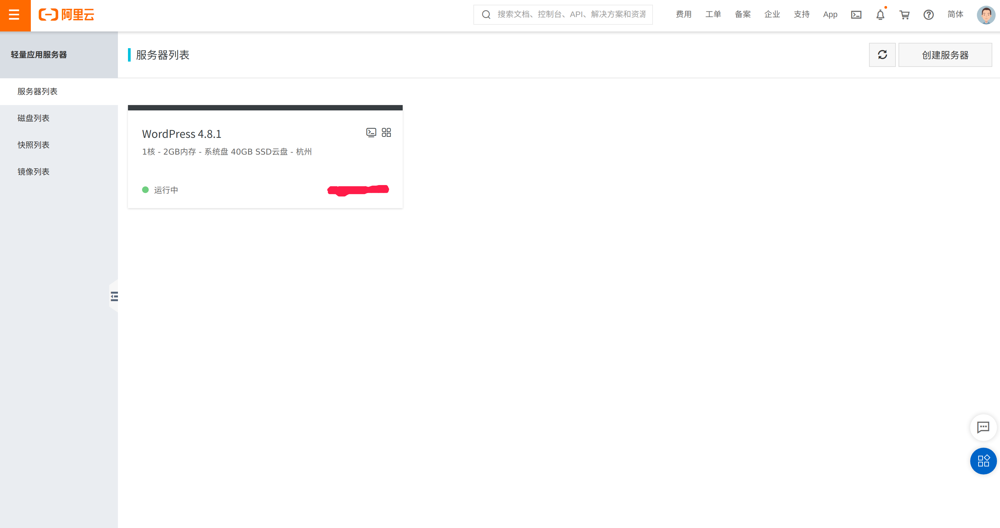

# 服务器搭建

## 安装JDK8

### 检查是否已安装及卸载

* 检查是否已安装

  > yum list installed | grep [java][jdk]

  ```
  java-1.8.0-openjdk.x86_64               1:1.8.0.282.b08-1.el7_9        @updates 
  java-1.8.0-openjdk-accessibility.x86_64 1:1.8.0.282.b08-1.el7_9        @updates 
  java-1.8.0-openjdk-demo.x86_64          1:1.8.0.282.b08-1.el7_9        @updates 
  java-1.8.0-openjdk-devel.x86_64         1:1.8.0.282.b08-1.el7_9        @updates 
  java-1.8.0-openjdk-headless.x86_64      1:1.8.0.282.b08-1.el7_9        @updates 
  java-1.8.0-openjdk-javadoc.noarch       1:1.8.0.282.b08-1.el7_9        @updates 
  java-1.8.0-openjdk-javadoc-zip.noarch   1:1.8.0.282.b08-1.el7_9        @updates 
  java-1.8.0-openjdk-src.x86_64           1:1.8.0.282.b08-1.el7_9        @updates 
  java-atk-wrapper.x86_64                 0.30.4-5.el7                   @base    
  javapackages-tools.noarch               3.4.1-11.el7                   @base    
  python-javapackages.noarch              3.4.1-11.el7                   @base    
  tzdata-java.noarch                      2021a-1.el7                    @updates 
  ```

* 卸载Java环境

  > yum -y remove java-1.8.0-openjdk*  //表时卸载所有openjdk相关文件输入 
  >
  > yum -y remove tzdata-java.noarch   //卸载tzdata-java

  

### 安装JDK

* 查看Java软件包列表

  > yum search java | grep -i --color jdk

  ```
  ldapjdk-javadoc.noarch : Javadoc for ldapjdk
  icedtea-web.x86_64 : Additional Java components for OpenJDK - Java browser
  java-1.6.0-openjdk.x86_64 : OpenJDK Runtime Environment
  java-1.6.0-openjdk-demo.x86_64 : OpenJDK Demos
  java-1.6.0-openjdk-devel.x86_64 : OpenJDK Development Environment
  java-1.6.0-openjdk-javadoc.x86_64 : OpenJDK API Documentation
  java-1.6.0-openjdk-src.x86_64 : OpenJDK Source Bundle
  java-1.7.0-openjdk.x86_64 : OpenJDK Runtime Environment
  java-1.7.0-openjdk-accessibility.x86_64 : OpenJDK accessibility connector
  java-1.7.0-openjdk-demo.x86_64 : OpenJDK Demos
  java-1.7.0-openjdk-devel.x86_64 : OpenJDK Development Environment
  java-1.7.0-openjdk-headless.x86_64 : The OpenJDK runtime environment without
  java-1.7.0-openjdk-javadoc.noarch : OpenJDK API Documentation
  java-1.7.0-openjdk-src.x86_64 : OpenJDK Source Bundle
  java-1.8.0-openjdk.i686 : OpenJDK Runtime Environment 8
  java-1.8.0-openjdk.x86_64 : OpenJDK 8 Runtime Environment
  java-1.8.0-openjdk-accessibility.i686 : OpenJDK accessibility connector
  java-1.8.0-openjdk-accessibility.x86_64 : OpenJDK accessibility connector
  java-1.8.0-openjdk-demo.i686 : OpenJDK Demos 8
  java-1.8.0-openjdk-demo.x86_64 : OpenJDK 8 Demos
  java-1.8.0-openjdk-devel.i686 : OpenJDK Development Environment 8
  java-1.8.0-openjdk-devel.x86_64 : OpenJDK 8 Development Environment
  java-1.8.0-openjdk-headless.i686 : OpenJDK Headless Runtime Environment 8
  java-1.8.0-openjdk-headless.x86_64 : OpenJDK 8 Headless Runtime Environment
  java-1.8.0-openjdk-javadoc.noarch : OpenJDK 8 API documentation
  java-1.8.0-openjdk-javadoc-zip.noarch : OpenJDK 8 API documentation compressed
  java-1.8.0-openjdk-src.i686 : OpenJDK Source Bundle 8
  java-1.8.0-openjdk-src.x86_64 : OpenJDK 8 Source Bundle
  java-11-openjdk.i686 : OpenJDK Runtime Environment 11
  java-11-openjdk.x86_64 : OpenJDK 11 Runtime Environment
  java-11-openjdk-demo.i686 : OpenJDK Demos 11
  java-11-openjdk-demo.x86_64 : OpenJDK 11 Demos
  java-11-openjdk-devel.i686 : OpenJDK Development Environment 11
  java-11-openjdk-devel.x86_64 : OpenJDK 11 Development Environment
  java-11-openjdk-headless.i686 : OpenJDK Headless Runtime Environment 11
  java-11-openjdk-headless.x86_64 : OpenJDK 11 Headless Runtime Environment
  java-11-openjdk-javadoc.i686 : OpenJDK 11 API documentation
  java-11-openjdk-javadoc.x86_64 : OpenJDK 11 API documentation
  java-11-openjdk-javadoc-zip.i686 : OpenJDK 11 API documentation compressed in a
  java-11-openjdk-javadoc-zip.x86_64 : OpenJDK 11 API documentation compressed in
  java-11-openjdk-jmods.i686 : JMods for OpenJDK 11
  java-11-openjdk-jmods.x86_64 : JMods for OpenJDK 11
  java-11-openjdk-src.i686 : OpenJDK Source Bundle 11
  java-11-openjdk-src.x86_64 : OpenJDK 11 Source Bundle
  java-11-openjdk-static-libs.i686 : OpenJDK libraries for static linking 11
  java-11-openjdk-static-libs.x86_64 : OpenJDK 11 libraries for static linking
  java-latest-openjdk.x86_64 : OpenJDK 15 Runtime Environment
  java-latest-openjdk-debug.x86_64 : OpenJDK 15 Runtime Environment with full
  java-latest-openjdk-demo.x86_64 : OpenJDK 15 Demos
  java-latest-openjdk-demo-debug.x86_64 : OpenJDK 15 Demos with full debugging on
  java-latest-openjdk-demo-fastdebug.x86_64 : OpenJDK 15 Demos with minimal
  java-latest-openjdk-devel.x86_64 : OpenJDK 15 Development Environment
  java-latest-openjdk-devel-debug.x86_64 : OpenJDK 15 Development Environment with
  java-latest-openjdk-devel-fastdebug.x86_64 : OpenJDK 15 Development Environment
  java-latest-openjdk-fastdebug.x86_64 : OpenJDK 15 Runtime Environment with
  java-latest-openjdk-headless.x86_64 : OpenJDK 15 Headless Runtime Environment
  java-latest-openjdk-headless-debug.x86_64 : OpenJDK 15 Runtime Environment with
  java-latest-openjdk-headless-fastdebug.x86_64 : OpenJDK 15 Runtime Environment
  java-latest-openjdk-javadoc.x86_64 : OpenJDK 15 API documentation
  java-latest-openjdk-javadoc-zip.x86_64 : OpenJDK 15 API documentation compressed
  java-latest-openjdk-jmods.x86_64 : JMods for OpenJDK 15
  java-latest-openjdk-jmods-debug.x86_64 : JMods for OpenJDK 15 with full
  java-latest-openjdk-jmods-fastdebug.x86_64 : JMods for OpenJDK 15 with minimal
  java-latest-openjdk-src.x86_64 : OpenJDK 15 Source Bundle
  java-latest-openjdk-src-debug.x86_64 : OpenJDK 15 Source Bundle for packages
  java-latest-openjdk-src-fastdebug.x86_64 : OpenJDK 15 Source Bundle
  java-latest-openjdk-static-libs.x86_64 : OpenJDK 15 libraries for static linking
  java-latest-openjdk-static-libs-debug.x86_64 : OpenJDK 15 libraries for static
  java-latest-openjdk-static-libs-fastdebug.x86_64 : OpenJDK 15 libraries for
  ldapjdk.noarch : The Mozilla LDAP Java SDK
  openprops.noarch : An improved java.util.Properties from OpenJDK
  ```

* 选择安装版本

  > yum install -y java-1.8.0-openjdk java-1.8.0-openjdk-devel.x86_64 
  >
  > *#或者如下命令，安装jdk1.8.0的所有文件* 
  >
  > yum install -y java-1.8.0-openjdk

* 查看JDK是否安装成功

  > java -version

  ```
  openjdk version "1.8.0_282"
  OpenJDK Runtime Environment (build 1.8.0_282-b08)
  OpenJDK 64-Bit Server VM (build 25.282-b08, mixed mode)
  ```

### 环境配置

* JDK的默认安装路径是：/usr/lib/jvm

  ```
  $ ls /usr/lib/jvm
  java
  java-1.8.0
  java-1.8.0-openjdk
  java-1.8.0-openjdk-1.8.0.282.b08-1.el7_9.x86_64
  java-openjdk
  jre
  jre-1.8.0
  jre-1.8.0-openjdk
  jre-1.8.0-openjdk-1.8.0.282.b08-1.el7_9.x86_64
  jre-openjdk
  ```

* 在`/etc/profile`文件添加如下命令

  ```
  # set java environment  
  JAVA_HOME=/usr/lib/jvm/java-1.8.0-openjdk-1.8.0.181-3.b13.el7_5.x86_64
  PATH=$PATH:$JAVA_HOME/bin  
  CLASSPATH=.:$JAVA_HOME/lib/dt.jar:$JAVA_HOME/lib/tools.jar  
  export JAVA_HOME CLASSPATH PATH
  ```

* 保存关闭`profile`文件，执行如下命令生效

  ```
  source  /etc/profile
  ```

* 使用如下命令，查看`JDK`变量

  ```
  echo $JAVA_HOME
  echo $PATH
  echo $CLASSPATH
  ```

## 安装Tomcat

### 安装

* yum -y install tomcat

* 查看Tomcat是否安装成功 

  > rpm -q tomcat

  出现如下所示表示安装成功：

  ```
  tomcat-7.0.76-16.el7_9.noarch
  ```

### 环境变量

Tomcat的默认安装路径是/usr/share/tomcat

```
$ ls -l /usr/share/tomcat
total 4
drwxr-xr-x 2 root root   4096 Mar  6 17:16 bin
lrwxrwxrwx 1 root tomcat   11 Mar  6 17:16 conf -> /etc/tomcat
lrwxrwxrwx 1 root tomcat   22 Mar  6 17:16 lib -> /usr/share/java/tomcat
lrwxrwxrwx 1 root tomcat   15 Mar  6 17:16 logs -> /var/log/tomcat
lrwxrwxrwx 1 root tomcat   22 Mar  6 17:16 temp -> /var/cache/tomcat/temp
lrwxrwxrwx 1 root tomcat   23 Mar  6 17:16 webapps -> /var/lib/tomcat/webapps
lrwxrwxrwx 1 root tomcat   22 Mar  6 17:16 work -> /var/cache/tomcat/work
```

* 在`/etc/profile`配置文件中加入`Tomcat`环境变量

  ```
  CATALINA_BASE=/usr/share/tomcat
  CATALINA_HOME=/usr/share/tomcat
  export JAVA_HOME PATH CLASSPATH CATALINA_BASE CATALINA_HOME
  ```

* 保存并关闭`profile`文件，执行如下命令生效

  ```
  source /etc/profile
  ```

* 使用如下命令常看Tomcat环境变量

  ```
  echo $CATALINA_BASE
  echo $CATALINA_HOME
  ```

### 启动

* 启动tomcat

  ```
  systemctl start tomcat
  ```

* 查看tomcat是否启动成功

  ```
  $ systemctl status tomcat
  ● tomcat.service - Apache Tomcat Web Application Container
     Loaded: loaded (/usr/lib/systemd/system/tomcat.service; enabled; vendor preset: disabled)
     Active: active (running) since Sun 2021-03-07 00:09:00 CST; 14h ago
   Main PID: 5213 (java)
     CGroup: /system.slice/tomcat.service
             └─5213 /usr/lib/jvm/jre/bin/java -Djavax.sql.DataSource.Factory=o...
  ```

  表明tomcat已经启动起来了

* 在浏览器输入IP`192.168.137.138:8080`，即可访问

### 问题

在浏览器输入http://IP:8080，无法访问

## Tomcat安装后公网无法访问

Tomcat默认8080断后访问，输入http://ip:8080后无法访问

### 不能访问的原因

* 因为前面安装的是 tomcat 的基础服务，并没有安装浏览器管理界面，接下来我们需要安装管理包

* 执行命令firewall-cmd --zone=public --add-port=8080/tcp --permanent 永久开放8080端口，否则会导致无法访问

* 开放8080后执行 systemctl restart firewalld.service重启防火墙
* 云服务器防火墙没有开放8080端口

### 设置开机启动

```
systemctl enable tomcat.service
```

### 安装`Tomcat`管理包

* 安装Tomcat根页面（tomcat-webapps）和Tomcat Web应用程序管理器和Virtual Host Manager（tomcat-admin-webapps），请运行以下2命令：

  ```
  yum install -y tomcat-webapps tomcat-admin-webapps 
  ```

* 安装在线文档（可选）

  ```
  yum install -y tomcat-docs-webapp tomcat-javadoc
  ```

* 安装完成后，检查/usr/share/tomcat/webapps目录是否存在如下文件夹

  ```
  $ ls /usr/share/tomcat/webapps
  examples  host-manager  manager  ROOT  sample
  ```

### 配置Tomcat Web管理界面

* 为了使用在上一步安装的manager webapp，我们必须添加一个登录到我们的Tomcat服务器。然后修改tomcat-users.xml的文件
  vim /usr/share/tomcat/conf/tomcat-users.xml

* 要新增谁可以访问用户manager-gui和admin-gui （前面我们安装了管理接口）。您可以通过定义类似于以下示例的用户来执行此操作。请务必将用户名和密码更改为安全：
  tomcat-users.xml – 管理用户

  ```xml
  <tomcat-users>
     <user username="admin" password="password" roles="manager-gui,admin-gui"/>
  </tomcat-users>
  ```

* 保存并关闭tomcat-users.xml 文件, 重启Tomcat服务
  sudo systemctl restart tomcat

### 开放云服务器防火墙的8080端口

以阿里云轻量应用服务器为例

* 登录swas.console.aliyun.com

  

* 点击相应的服务器，点击左侧栏的安全->防火墙，点击右上角的“添加规则”后在“端口范围”中输入8080后确定

  

* 浏览器地址栏中再次输入http://ip:8080后成功访问

  

## 宝塔面板安装后公网无法访问

和上面的tomcat公网无法访问的情况类似，在云服务器防火墙中把宝塔默认的8888端口放开即可


## 通过域名访问tomcat服务器

### 替换localhost为域名

* 替换Engine节点下的defaultHost中的localhost为域名

  替换前：

  

  替换后：

  

* 替换Host节点中的name为域名

  

* 在Host节点的结束标识符之前增加Context

  <Context path="" docBase="site" reloadable="false"></Context>

### 替换8080端口为80

## 文件传输

### 安装puty

> $ sudo apt-get install putty

### 拷贝项目至云服务器

> $ pscp site.tgz root@xxx.xxx.xxx.xxx:/usr/share/tomcat/webapps

