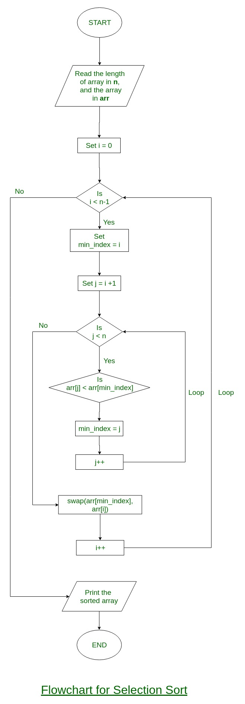

# 冒泡排序

Sort.java: BubbleSort

Bubble Sort is the simplest sorting algorithm that works by repeatedly swapping the adjacent elements if they are in wrong order.

假设按从小到大的顺序排序，每一趟排序结束后，最后的值都是最大的值。

**Example:**
**First Pass:**
( **5** **1** 4 2 8 ) –> ( **1** **5** 4 2 8 ), Here, algorithm compares the first two elements, and swaps since 5 > 1.
( 1 **5** **4** 2 8 ) –> ( 1 **4** **5** 2 8 ), Swap since 5 > 4
( 1 4 **5** **2** 8 ) –> ( 1 4 **2** **5** 8 ), Swap since 5 > 2
( 1 4 2 **5** **8** ) –> ( 1 4 2 **5** **8** ), Now, since these elements are already in order (8 > 5), algorithm does not swap them.

**Second Pass:**
( **1** **4** 2 5 8 ) –> ( **1** **4** 2 5 8 )
( 1 **4** **2** 5 8 ) –> ( 1 **2** **4** 5 8 ), Swap since 4 > 2
( 1 2 **4** **5** 8 ) –> ( 1 2 **4** **5** 8 )
( 1 2 4 **5** **8** ) –> ( 1 2 4 **5** **8** )
Now, the array is already sorted, but our algorithm does not know if it is completed. The algorithm needs one **whole** pass without **any** swap to know it is sorted.

**Third Pass:**
( **1** **2** 4 5 8 ) –> ( **1** **2** 4 5 8 )
( 1 **2** **4** 5 8 ) –> ( 1 **2** **4** 5 8 )
( 1 2 **4** **5** 8 ) –> ( 1 2 **4** **5** 8 )
( 1 2 4 **5** **8** ) –> ( 1 2 4 **5** **8** )

Implementation:

```java
public void bubbleSort(int[] arr) {
    int len = arr.length;
    for (int i = 0; i < len - 1; i++) {
        // 容易忽略的点，j 循环到 len - 1 - i即可，不必循环到最后，因为最后i个是已经排好序的 
        for (int j = 1; j < len - 1 - i; j++) {
            if (arr[j] < arr[j - 1]) {
                int temp = arr[j];
                arr[j] = arr[j - 1];
                arr[j - 1] = temp;
            }
        }
    }
}
```


Output:

```
Sorted array:
11 12 22 25 34 64 90
```

**Illustration :**
[](https://media.geeksforgeeks.org/wp-content/cdn-uploads/gq/2014/02/bubble-sort1.png)

**Optimized Implementation:**
The above function always runs O(n^2) time even if the array is sorted. It can be optimized by stopping the algorithm if inner loop didn’t cause any swap.

Implementation:

```java
public void bubbleSort(int[] arr) {
    int len = arr.length;
    boolean swapped; // 用于检查本趟是否有交换过，如果没有则表示该趟所有数据已经排好序，可直接退出
    for (int i = 0; i < len - 1; i++) {
        swapped = false;
        for (int j = 1; j < len - 1 - i; j++) {
            if (arr[j] < arr[j - 1]) {
                int temp = arr[j];
                arr[j] = arr[j - 1];
                arr[j - 1] = temp;
                swapped = true;
            }
        }

        if (!swapped) {
            break;
        }
    }
}
```


Output:

```
Sorted array:
11 12 22 25 34 64 90
```

**Worst and Average Case Time Complexity:** O(n*n). Worst case occurs when array is reverse sorted.

**Best Case Time Complexity:** O(n). Best case occurs when array is already sorted.

**Auxiliary Space:** O(1)

**Boundary Cases:** Bubble sort takes minimum time (Order of n) when elements are already sorted.

**Sorting In Place:** Yes

**Stable:** Yes

# 插入排序

Insertion sort is a simple sorting algorithm that works the way we sort playing cards in our hands.

插入排序是一种最简单直观的排序算法，其工作原理是构建有序序列，对于未排序数据，在已排序序列中从后向前扫描，找到对应的位置并插入。

**Algorithm**
// Sort an arr[] of size n
insertionSort(arr, n)
Loop from i = 1 to n-1.
……a) Pick element arr[i] and insert it into sorted sequence arr[0…i-1]

**Example:**
[](https://media.geeksforgeeks.org/wp-content/uploads/insertionsort.png)
**Another Example:**
**12**, 11, 13, 5, 6

Let us loop for i = 1 (second element of the array) to 4 (last element of the array)

i = 1. Since 11 is smaller than 12, move 12 and insert 11 before 12
**11, 12**, 13, 5, 6

i = 2. 13 will remain at its position as all elements in A[0..I-1] are smaller than 13
**11, 12, 13**, 5, 6

i = 3. 5 will move to the beginning and all other elements from 11 to 13 will move one position ahead of their current position.
**5, 11, 12, 13**, 6

i = 4. 6 will move to position after 5, and elements from 11 to 13 will move one position ahead of their current position.
**5, 6, 11, 12, 13**

```java
public void insertionSort(int[] arr) {
    int len = arr.length;
    int j;
    int key;
    for (int i = 1; i < len; i++) {
        key = arr[i];
        for (j = i; j > 0 && key < arr[j - 1]; j--) {
            arr[j] = arr[j - 1];
        }
        arr[j] = key;
    }
}
```

这种已经排好序的问题，就没有必要再定义临时变量来交换了，直接将大于key值的数据往后移动，最后再将相应的key值赋值到对应位置上。

**Output:**

```
5 6 11 12 13
```

**Time Complexity:** O(n*2)

**Auxiliary Space:** O(1)

**Boundary Cases**: Insertion sort takes maximum time to sort if elements are sorted in reverse order. And it takes minimum time (Order of n) when elements are already sorted.

**Algorithmic Paradigm:** Incremental Approach

**Sorting In Place:** Yes

**Stable:** Yes

**Online:** Yes

**Uses:** Insertion sort is used when number of elements is small. It can also be useful when input array is almost sorted, only few elements are misplaced in complete big array.

**What is Binary Insertion Sort?**
We can use binary search to reduce the number of comparisons in normal insertion sort. Binary Insertion Sort uses binary search to find the proper location to insert the selected item at each iteration. In normal insertion, sorting takes O(i) (at ith iteration) in worst case. We can reduce it to O(logi) by using binary search. The algorithm, as a whole, still has a running worst case running time of O(n2) because of the series of swaps required for each insertion. Refer [this](http://quiz.geeksforgeeks.org/binary-insertion-sort/) for implementation.

**How to implement Insertion Sort for Linked List?**
Below is simple insertion sort algorithm for linked list.

```
1) Create an empty sorted (or result) list
2) Traverse the given list, do following for every node.
......a) Insert current node in sorted way in sorted or result list.
3) Change head of given linked list to head of sorted (or result) list. 
```

Refer [this](http://quiz.geeksforgeeks.org/insertion-sort-for-singly-linked-list/) for implementation.

# 选择排序

The selection sort algorithm sorts an array by repeatedly finding the minimum element (considering ascending order) from unsorted part and putting it at the beginning. The algorithm maintains two subarrays in a given array.

1) The subarray which is already sorted.
2) Remaining subarray which is unsorted.

In every iteration of selection sort, the minimum element (considering ascending order) from the unsorted subarray is picked and moved to the sorted subarray.

```
arr[] = 64 25 12 22 11

// Find the minimum element in arr[0...4]
// and place it at beginning
11 25 12 22 64

// Find the minimum element in arr[1...4]
// and place it at beginning of arr[1...4]
11 12 25 22 64

// Find the minimum element in arr[2...4]
// and place it at beginning of arr[2...4]
11 12 22 25 64

// Find the minimum element in arr[3...4]
// and place it at beginning of arr[3...4]
11 12 22 25 64 
```

**Flowchart of the Selection Sort:**



```java
`// Java program for implementation of Selection Sort ``class` `SelectionSort ``{ ``  ``void` `sort(``int` `arr[]) ``  ``{ ``    ``int` `n = arr.length; `` ` `    ``// One by one move boundary of unsorted subarray ``    ``for` `(``int` `i = ``0``; i < n-``1``; i++) ``    ``{ ``      ``// Find the minimum element in unsorted array ``      ``int` `min_idx = i; ``      ``for` `(``int` `j = i+``1``; j < n; j++) ``        ``if` `(arr[j] < arr[min_idx]) ``          ``min_idx = j; `` ` `      ``// Swap the found minimum element with the first ``      ``// element ``      ``int` `temp = arr[min_idx]; ``      ``arr[min_idx] = arr[i]; ``      ``arr[i] = temp; ``    ``} ``  ``} `` ` `  ``// Prints the array ``  ``void` `printArray(``int` `arr[]) ``  ``{ ``    ``int` `n = arr.length; ``    ``for` `(``int` `i=``0``; i`      ``System.out.print(arr[i]+``" "``); ``    ``System.out.println(); ``  ``} `` ` `  ``// Driver code to test above ``  ``public` `static` `void` `main(String args[]) ``  ``{ ``    ``SelectionSort ob = ``new` `SelectionSort(); ``    ``int` `arr[] = {``64``,``25``,``12``,``22``,``11``}; ``    ``ob.sort(arr); ``    ``System.out.println(``"Sorted array"``); ``    ``ob.printArray(arr); ``  ``} ``} ``/* This code is contributed by Rajat Mishra*/`
```

**Output:**

```
Sorted array: 
11 12 22 25 64
```

**Time Complexity:** O(n2) as there are two nested loops.

**Auxiliary Space:** O(1)
The good thing about selection sort is it never makes more than O(n) swaps and can be useful when memory write is a costly operation.

**Exercise :**
[Sort an array of strings using Selection Sort](https://www.geeksforgeeks.org/c-program-to-sort-an-array-of-strings-using-selection-sort-2/)

[Stability : ](https://www.geeksforgeeks.org/stability-in-sorting-algorithms/)The default implementation is not stable. However it can be made stable. Please see [stable selection sort](https://www.geeksforgeeks.org/stable-selection-sort/) for details.

**In Place :** Yes, it does not require extra space.

# 希尔排序

又名缩小增量排序，将待排序的序列按照某种规则划分成几个子序列，分别对几个子序列进行直接插入排序。这个规则就是指增量，然后逐半递减，知道最后一个增量为1，相当于直接插入排序。[ShellSort ](http://en.wikipedia.org/wiki/Shellsort)is mainly a variation of [Insertion Sort](http://quiz.geeksforgeeks.org/insertion-sort/). In insertion sort, we move elements only one position ahead. When an element has to be moved far ahead, many movements are involved. The idea of shellSort is to allow exchange of far items. In shellSort, we make the array h-sorted for a large value of h. We keep reducing the value of h until it becomes 1. An array is said to be h-sorted if all sublists of every h’th element is sorted.

Following is the implementation of ShellSort.

迭代实现希尔排序：

```java
public void shellSort(int[] arr) {
    if (!isParamsValid(arr)) {
        return;
    }

    int len = arr.length;
    int increase = len / 2;
    int key;
    int j;
    while (increase >= 1) {
        for (int i = increase; i < len; i++) {
            key = arr[i];
            for (j = i; j - increase >= 0 && key < arr[j - increase]; j -= increase) {
                arr[j] = arr[j - increase];
            }
            arr[j] = key;
        }

        increase = increase / 2;
    }
}
```

递归实现希尔排序：

```java
public void shellSort(int[] arr) {
    if (!isParamsValid(arr)) {
        return;
    }

    int len = arr.length;
    shellSortRecursive(arr, len, len / 2);
}

public void shellSortRecursive(int[] arr, int len, int increase) {
    if (increase < 1) {
        return;
    }

    int key;
    int j;
    for (int i = increase; i < len; i++) {
        key = arr[i];
        for (j = i; j - increase >= 0 && key < arr[j - increase]; j -= increase) {
            arr[j] = arr[j - increase];
        }
        arr[j] = key;
    }
    shellSortRecursive(arr, len, increase / 2);

}
```

 **Time Complexity:** Time complexity of above implementation of shellsort is O(n2). In the above implementation gap is reduce by half in every iteration. There are many other ways to reduce gap which lead to better time complexity. See [this ](http://en.wikipedia.org/wiki/Shellsort#Gap_sequences)for more details. 

希尔排序相比直接插入排序可以至少缩小一半的循环次数：

假设数组逆序排列，分别使用直接插入排序和希尔排序（数组长度为n）

直接插入排序需要循环的次数：n(n - 1) / 2

希尔排序需要循环的次数：[(k + 1) (k + 2) + (k - 1) (k - 2) ] / 2,其中k = n / 2；

# 归并排序


# 快速排序


# 堆排序


# 基数排序


# 桶排序


# 计数排序


# 拓扑排序

