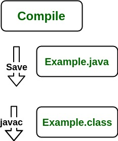

# JDK、JRE和JVM的区别

**Java Development Kit(JDK)**是用于开发 Java 应用程序和小程序的软件开发环境。它包括 Java 运行时环境 (JRE)、解释器/加载器 (Java)、编译器 (javac)、存档器 (jar)、文档生成器 (Javadoc) 以及 Java 开发所需的其他工具。

现在我们需要一个环境来运行我们的程序。此后，**JRE** 代表**“Java 运行时环境”**，也可以写成**“Java RTE”**。 Java 运行时环境提供了执行 Java 应用程序的最低要求；它由 Java 虚拟机 (JVM)、核心类和支持文件组成。

现在让我们讨论一下 **JVM**，它代表了 java 虚拟机。如下：

* 指定 Java 虚拟机工作的**规范**。但实现提供者可独立选择算法。它的实现由 Sun 和其他公司提供。
* **实现**是满足 JVM 规范要求的计算机程序。
* **运行时实例** 每当您在命令提示符下编写 java 命令以运行 java 类时，就会创建一个 JVM 实例。

在继续讨论 JDK、JRE 和 JVM 之间的区别之前，让我们先简要讨论它们，并将它们与下面提出的图像相互关联。

不要感到困惑，因为我们将一一讨论它们。

**1、JDK**（Java Development Kit）是一个提供开发和执行（运行）Java程序环境的工具包。 JDK 是一个工具包（或包），包括两个东西

* 开发工具（提供开发Java程序的环境）
* JRE（执行您的 java 程序）。

**2、JRE**（Java Runtime Environment）是一个安装包，它提供了一个环境，以便在你的机器上运行（而不是开发）java程序（或应用程序）。 JRE 仅供那些只想运行 Java 程序的系统终端用户使用。

**3、JVM**[（Java 虚拟机）](https://www.geeksforgeeks.org/jvm-works-jvm-architecture/)是 JDK 和 JRE 中非常重要的一部分，因为它包含或内置在两者中。无论你使用 JRE 还是 JDK 运行的 Java 程序都会进入 JVM，而 JVM 负责逐行执行 Java 程序，因此它也被称为[解释器](https://www.geeksforgeeks.org/compiler-vs-interpreter-2/)。

现在让我们讨论 JRE 的组件，以了解它的重要性并了解它的实际工作原理。

JRE的组件如下：

1. **部署技术**，包括部署、Java Web Start 和 Java 插件。
2. **用户界面工具包**，包括抽象窗口工具包 (AWT)、Swing、Java 2D、可访问性、图像 I/O、打印服务、声音、拖放 (DnD) 和输入法。
3. **集成库**，包括接口定义语言 (IDL)、Java 数据库连接 (JDBC)、Java 命名和目录接口 (JNDI)、远程方法调用 (RMI)、基于 Internet Inter-Orb 协议的远程方法调用 (RMI-IIOP)，以及脚本。
4. **其他基础库**，包括国际支持、输入/输出 (I/O)、扩展机制、Beans、Java 管理扩展 (JMX)、Java 本机接口 (JNI)、数学、网络、覆盖机制、安全性、序列化和 Java XML 处理 (XML JAXP)。
5. 语**言和实用程序基础库**，包括语言和实用程序、管理、版本控制、zip、仪器、反射、集合、并发实用程序、Java 存档 (JAR)、日志记录、首选项 API、引用对象和正则表达式。
6. **Java 虚拟机 (JVM)**，包括 Java HotSpot 客户端和服务器虚拟机。

在对组件有足够的了解之后，现在让我们讨论一下 JRE 的工作原理。 为了理解 JRE 是如何工作的，让我们考虑下面的一个例子：

**说明：**

> 假设有一个保存为“Example.java”的 java 源文件。 该文件被编译成一组字节码，存储在“.class”文件中。 这里将是“Example.class”。

>**注意：**以下操作在运行时发生，如下所示：
>
>* 类加载器
>* 字节码验证器
>* 解释器
>  * 执行字节码
>  * 对底层硬件进行适当的调用

**现在，让我们简单讨论下JVM是如何工作的。如下：**

JVM 在 Java 程序运行时成为 JRE 的一个实例。 它被广泛称为运行时解释器。JVM 在很大程度上为那些使用JDK中库的程序员抽象了内部实现。

***它主要负责三项活动***

* 加载
* 链接
* 初始化

**同样地，现在让我们讨论JRE的工作原理，如下所示：**

* JVM（Java 虚拟机）充当运行 Java 应用程序的运行时引擎。 JVM 是实际调用 java 代码中存在的 **main** 方法的那个。 JVM 是 JRE（Java 运行时环境）的一部分。

* Java 应用程序称为 WORA（一次编写，随处运行）。 这意味着程序员可以在一个系统上开发 Java 代码，并且可以期望它在任何其他支持 Java 的系统上运行而无需任何调整。 由于 JVM，这一切皆有可能。

* 当我们编译 .java 文件时，Java 编译器会生成与 .java 文件中存在的相同类名的 .class 文件（包含字节码）。 当我们运行这个 .class 文件时，它会进入各个步骤。 这些步骤一起描述了整个 JVM。

  