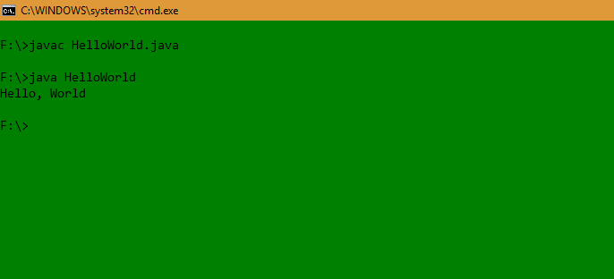

# Java Hello World 程序

Java 是最流行和广泛使用的编程语言和平台之一。 Java 快速、可靠且安全。 Java 被用于从桌面到 Web 应用程序、科学超级计算机到游戏机、从手机到 Internet 的每一个角落。

Java 易于学习，其语法简单易懂。 它基于 C++（对于了解 C++ 的程序员来说更容易）。

Java 编程的过程可以简化为三个步骤：

* 通过在文本编辑器中键入程序并将其保存到文件中来创建程序 - HelloWorld.java。
* 通过在终端窗口中键入“javac HelloWorld.java”来编译它。
* 通过在终端窗口中键入“java HelloWorld”来执行（或运行）它。

下面给出的程序是最简单的 Java 将“Hello World”打印到屏幕上的程序。 让我们尝试逐步理解每一段代码。

```java
// This is a simple Java program.
// FileName : "HelloWorld.java".
 
class HelloWorld
{
    // Your program begins with a call to main().
    // Prints "Hello, World" to the terminal window.
    public static void main(String args[])
    {
        System.out.println("Hello, World");
    }
}
```

**输出**

```
Hello, World
```

***时间复杂度:*** O(1)

**空间复杂度:** *O(1)*

“Hello World！” 程序由三个主要部分组成：HelloWorld 类定义、main 方法和源代码注释。下面的解释将为帮助您对代码有一个基本的理解：

**1、类定义**
这一行使用关键字 **class** 来声明正在定义一个新类。

```java
class HelloWorld {
    //
    //Statements
}
```

**2、HelloWorld**

它是一个标识符，即类的名称。 整个类定义，包括它的所有成员，将位于左大括号“**{**”和右大括号“**}**”之间。

**3.main方法**
在 Java 编程语言中，每个应用程序都必须包含一个 main 方法。 main 函数（方法）是 Java 应用程序的入口点，它在 Java 程序中是必需的。 其在 Java 中的签名是：

```java
public static void main(String[] args)
```

- **public**: 这样 [JVM](https://www.geeksforgeeks.org/jvm-works-jvm-architecture/) 就可以在任何地方执行该方法。
- **static**: main方法是在没有对象的情况下调用。修饰符public和static可以按任意顺序编写。
- **void**: main方法不返回任何内容。
- **main()**:  在[JVM](https://www.geeksforgeeks.org/jvm-works-jvm-architecture/)中配置的名称. main方法必须在类定义中。编译器总是从main函数开始执行代码。
- **String[]**: main接收单个参数, 即String类型的数组元素。

与 C/C++ 一样，main 方法是应用程序的入口，随后将调用程序所需的所有其他方法。

注意下面的代码，它发生在main方法内部。

```java
System.out.println("Hello, World");
```

此行输出字符串“Hello, World”，紧接着会在屏幕上新起一行。 输出由内置的 println() 方法完成。**System**是一个预定义的类，提供对系统的访问，out 是连接到控制台的输出流类型的变量。

## 注释

可以是多行，也可以是单行注释

```java
// This is a simple Java program. 
// Call this file "HelloWorld.java". 
```

这是个单行注释。注释的类型必须是像C/C++那样，以 // 开头。对于多行注释，必须从/* 开始，以 */ 结束。

## 重要的点

* 程序定义的类名是HelloWorld，与文件名（HelloWorld.java）相同。 这不是巧合。 在 Java 中，所有代码都必须位于一个类中，并且最多有一个public类包含 main() 方法。
* 按照惯例，主类（包含main方法的类）的名称应该与保存程序的文件的名称相匹配。
* 每个 Java 程序都必须有一个与文件名匹配的类定义（类名和文件名应该相同）。

## 编译程序

* 成功[设置环境](https://www.geeksforgeeks.org/setting-environment-java/),后，我们可以在 Windows/Unix 中打开一个终端，然后转到HelloWorld.java文件所在的目录。

* 现在，要编译HelloWorld程序，执行编译器 - javac，在命令行指定源文件名，如：

  ```
  javac HelloWorld.java
  ```

* 编译器创建一个包含程序字节码版本的 HelloWorld.class（在当前工作目录中）。 现在，要执行我们的程序，需要使用 java 调用 JVM（Java Virtual Machine），在命令行中指定类文件的名称，如：

  ```
  java HelloWorld
  ```

* 这将在终端屏幕上打印“Hello World”，Unix类似。

  

