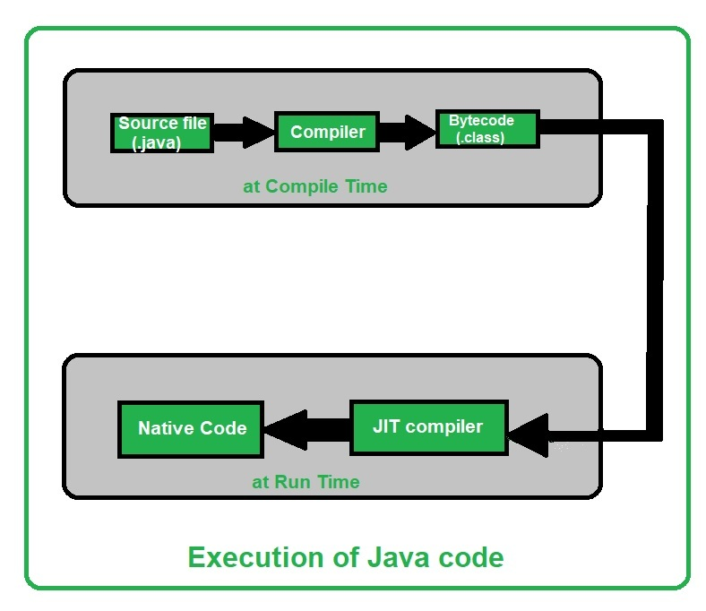
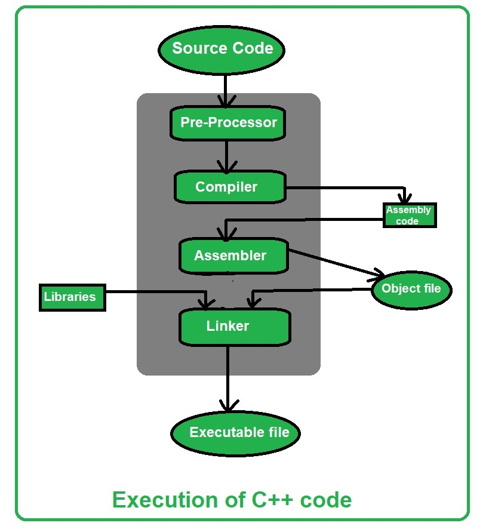

# Java和C++的异同

如今，[Java](https://www.geeksforgeeks.org/java/) 和 [C++](https://www.geeksforgeeks.org/c-plus-plus/) 编程语言广泛用于编码。 由于一些很棒的功能，这两种编程语言在行业中得到了广泛的应用。 C++ 因其高效、高速和动态内存利用率而在编码人员中广受欢迎。 Java广泛应用于IT行业，在软件开发方面它是任何其他编程语言都无法比拟的。 让我们通过各个点来比较这些流行的编码语言：

## **Java和C++之间的相似性**

**1、执行：**在编译时，Java 源代码或.java 文件被转换成字节码或.class 文件。 在运行时，[JVM（Java 虚拟机）](https://www.geeksforgeeks.org/jvm-works-jvm-architecture/)将加载 .class 文件，并在[解释器](https://www.geeksforgeeks.org/compiler-vs-interpreter-2/)的帮助下将其转换为机器代码。 在编译方法调用后（使用即时 (JIT) 编译器），JVM 将执行优化后的代码。 所以Java既是[编译语言又是解释语言](https://www.geeksforgeeks.org/difference-between-compiled-and-interpreted-language/)。 另一方面，C++ 仅使用编译器来执行代码。 C++ 编译器编译源代码并将其转换为机器代码。 这就是为什么 C++ 比 Java 快但不是平台无关的原因。

下面是如何执行 Java 和 C++ 代码的说明：

**Java代码的执行如下：**

**C++代码执行如下：**

**2、特性：**C++和Java都有几个[面向对象的编程](https://www.geeksforgeeks.org/object-oriented-programming-oops-concept-in-java/)特性，提供了很多有用的编程功能。 某些功能由一个支持，某些功能由另一个支持。 尽管两种语言都使用 OOP 的概念，但都不能称为 100% 面向对象的语言。 Java 使用原始数据类型，因此不能称为 100% 面向对象的语言。 C++ 使用一些类似于原始数据类型的数据类型，并且可以在不使用任何数据类型的情况下实现方法。 因此，它也被剥夺了 100% 面向对象的称号。
下表显示了两种编程语言支持和不支持的功能：

| Features                  | C++  | Java |
| :------------------------ | :--- | :--- |
| Abstraction               | Yes  | Yes  |
| Encapsulation             | Yes  | Yes  |
| Single Inheritance        | Yes  | Yes  |
| Multiple Inheritance      | Yes  | No   |
| Polymorphism              | Yes  | Yes  |
| Static Binding            | Yes  | Yes  |
| Dynamic Binding           | Yes  | Yes  |
| Operator Overloading      | Yes  | No   |
| Header Files              | Yes  | No   |
| Pointers                  | Yes  | No   |
| Global Variables          | Yes  | No   |
| Template Class            | Yes  | No   |
| Interference and Packages | No   | Yes  |
| API                       | No   | Yes  |

**应用程序：**C++ 和 Java 都有广泛的应用领域。以下是两种语言的应用：

* **C++编程语言的应用：**
  1. 适合开发大型软件（如乘客预订系统）。
  2. MySQL 是用 C++ 编写的。
  3. 为了快速执行，C++ 主要用于游戏开发。
  4. Google Chromium 浏览器、文件系统和集群数据处理都是用 C++ 编写的。
  5. Adobe Premiere、Photoshop 和 Illustrator；这些流行的应用程序是用 C++ 编写的。
  6. 高级计算和图形——实时物理模拟、高性能图像处理。
  7. C++ 也用于许多先进类型的医疗设备，如 MRI 机器等。
* **Java编程语言的应用：**
  1. 桌面 GUI 应用程序开发。
  2. Android 和移动应用程序开发。
  3. Java 的应用在嵌入式技术中，如 SIM 卡、磁盘播放器、电视等。
  4. Java EE（企业版）为运行大型企业软件提供了 API 和运行时环境。
  5. 网络应用程序和 Web 服务，例如 Internet 连接、Web 应用程序开发。

**环境：**C++ 是平台相关的，而 [Java 是平台无关的编程语言](https://www.geeksforgeeks.org/java-platform-independent/)。我们必须在同一平台上编写和运行 C++ 代码。 Java 具有 **WORA（一次编写并在任何地方运行）**特性，通过该特性，我们可以在一个平台上编写一次代码，然后就可以在任何地方运行代码。

Java和C++的区别如下：

| Parameters                          | Java                                                         | C++                                                          |
| :---------------------------------- | :----------------------------------------------------------- | :----------------------------------------------------------- |
| Founder                             | Java was developed by James Gosling at Sun Microsystems.     | C++ was developed by Bjarne Stroustrup at Bell Labs in 1979 as an extension of the C language. |
| First Release                       | On May 23, 1995                                              | In October 1985                                              |
| Stable Release                      | Java SE 14 or JDK 14 was released on March 17, 2020.         | C++17 was released in December 2017.                         |
| Official Website                    | oracle.com/java                                              | isocpp.org                                                   |
| Influenced By:                      | Java was Influenced by Ada 83, Pascal, C++, [C#](https://www.geeksforgeeks.org/csharp-programming-language/), etc. languages. | C++ was Influenced by Influenced by Ada, ALGOL 68, C, ML, Simula, Smalltalk, etc. languages. |
| Influenced to:                      | Java was influenced to develop BeanShell, C#, Clojure, Groovy, Hack, J#, Kotlin, PHP, Python, Scala, etc. languages. | C++ was influenced to develop C99, Java, JS++, Lua, Perl, PHP, Python, Rust, Seed7, etc. languages. |
| Platform Dependency                 | Platform independent, Java bytecode works on any operating system. | Platform dependent, should be compiled for different platforms. |
| Portability                         | It can run in any OS hence it is portable.                   | C++ is platform-dependent. Hence it is not portable.         |
| Compilation                         | Java is both Compiled and Interpreted Language.              | C++ is a Compiled Language.                                  |
| Memory Management                   | Memory Management is System Controlled.                      | Memory Management in C++ is Manual.                          |
| Virtual Keyword                     | It doesn’t have Virtual Keyword.                             | It has Virtual keywords.                                     |
| Multiple Inheritance                | It supports only single inheritance. Multiple inheritances are achieved partially using interfaces. | It supports both single and multiple Inheritance.            |
| Overloading                         | It supports only method overloading and doesn’t allow operator overloading. | It supports both method and operator overloading.            |
| Pointers                            | It has limited support for pointers.                         | It strongly supports pointers.                               |
| Libraries                           | It doesn’t support direct native library calls but only Java Native Interfaces. | It supports direct system library calls, making it suitable for system-level programming. |
| Libraries                           | Libraries have a wide range of classes for various high-level services. | C++ libraries have comparatively low-level functionalities.  |
| Documentation Comment               | It supports documentation comments (e.g., /**.. */) for source code. | It doesn’t support documentation comments for source code.   |
| Thread Support                      | Java provides built-in support for multithreading.           | C++ doesn’t have built-in support for threads, depends on third-party threading libraries. |
| Type                                | Java is only an object-oriented programming language.        | C++ is both a procedural and an object-oriented programming language. |
| Input-Output mechanism              | Java uses the (System class): **System.in** for input and **System.out** for output. | C++ uses **cin** for input and **cout** for an output operation. |
| goto Keyword                        | Java doesn’t support goto Keyword                            | C++ supports goto keyword.                                   |
| Structures and Unions               | Java doesn’t support Structures and Unions.                  | C++ supports Structures and Unions.                          |
| Parameter Passing                   | Java supports only the Pass by Value technique.              | C++ supports both Pass by Value and pass by reference.       |
| Global Scope                        | It supports no global scope.                                 | It supports both global scope and namespace scope.           |
| Object Management                   | Automatic object management with garbage collection.         | It supports manual object management using new and delete.   |
| Call by Value and Call by reference | Java supports only call by value.                            | C++ both supports call by value and call by reference.       |
| Hardware                            | Java is not so interactive with hardware.                    | C++ is nearer to hardware.                                   |