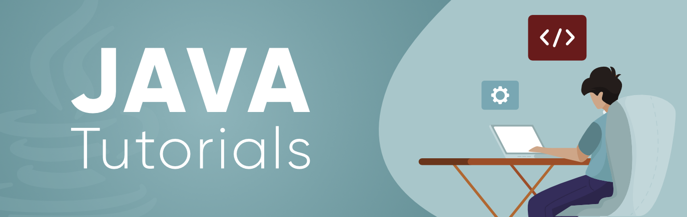
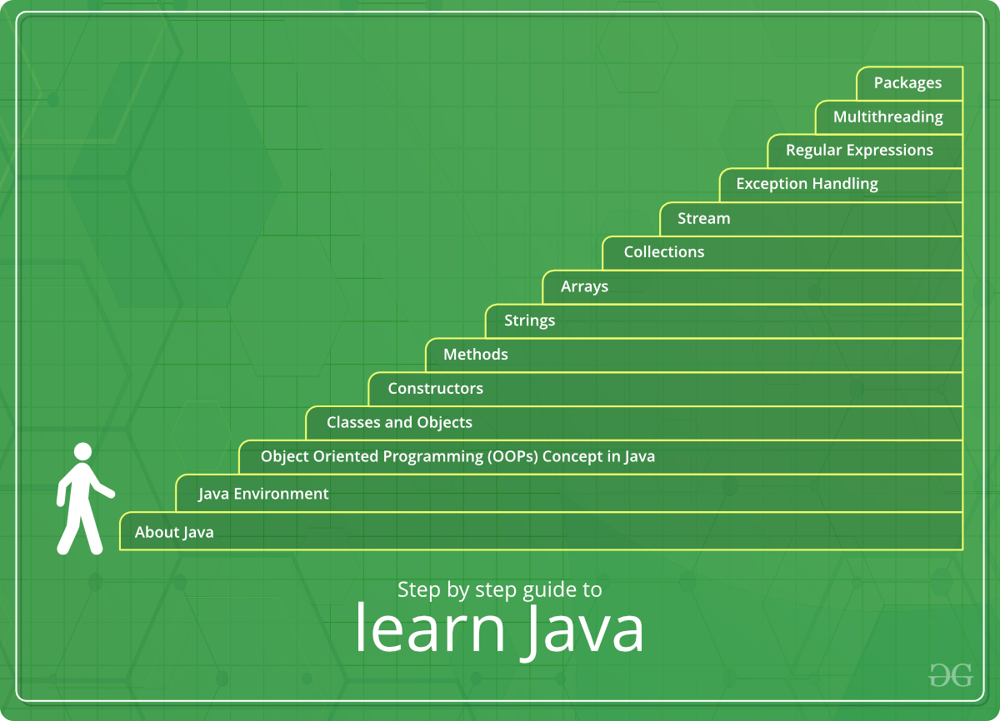

# Java概览

Java是最著名和使用最为广泛的编程语言和平台之一。所谓平台即一个能够帮助开发和运行任何编程语言编写的程序。

Java具有快速、可靠和安全的特性。Java被用在了各个角落，从桌面到web应用、科学超级计算机到游戏终端、网络电话到英特网。

Java易于学习，它的语法简单并且易于理解。它基于C++（所以对熟悉C++的编程人员来说更加简单）。Java移出了许多令人困惑和那些极少用到的特性，如：显示指针，操作符重载等。而且，Java关心内存管理，并为此提供了自动垃圾回收机制，自动回收那些不再使用的对象。

下面是一份完全指南：

1. [关于Java](https://www.geeksforgeeks.org/java-how-to-start-learning-java/):在开始之前，最重要的事情莫过于知道所有的为什么。这篇文章提及到了什么是Java、为什么流行、有哪些特性，等等。深入这篇文章，你将不仅仅是学习Java那么简单，而是懂得了如何开始学习Java。	

​		**Learn about Java here:** [How to start learning Java](https://www.geeksforgeeks.org/java-tutorial/?ref=lbp#:~:text=How%20to%20start%20learning%20Java)

2. [Java环境](https://www.geeksforgeeks.org/java-tutorial/?ref=lbp#:~:text=start%20learning%20Java-,Java%20Environment,-%3A%20To%20work%20on):让任何编程语言的工作第一件需要知道的事情那就是了解它的环境。环境是指那些编程语言工作以及如何工作的场景。Java运行在JVM环境中。点击下面提及的文章去了解JVM, 它的结构以及它是如何工作的。

   **Learn about JVM here:**[JVM](https://www.geeksforgeeks.org/jvm-works-jvm-architecture/)

3. [Java编程基础](https://www.geeksforgeeks.org/java-programming-basics/):熟练掌握任何一门编程语言，首要的事情就是理解这门语言的基础。因此，这篇文章将会以很简单的形式让你对Java基础有一个深入的了解。

   通过阅读这篇文章，你将会学习一些主题，从如何设置Java环境到编码的一些细节

   **Learning about Java Programming Basics here:**[Java Programming Basic](https://www.geeksforgeeks.org/java-programming-basics/)

4. [Java面向对象编程的概念](https://www.geeksforgeeks.org/object-oriented-programming-oops-concept-in-java/):Java是一门面向对象的编程语言。OOP通过将一个完整的程序拆分成了一个个对象，使其变得更加简单。这些对象可以被用作一个函数到另一个函数之间数据传递的桥梁。我们可以根据需要轻松地修改数据和功能。因此，学习OOPs概念是学习Java的一个重要步骤。

   **Learning about OOPs concepts in Java here:**[Object Oriented Programming (OOPs) Concept in Java](https://www.geeksforgeeks.org/object-oriented-programming-oops-concept-in-java/)

5. [Java中的类和对象](https://www.geeksforgeeks.org/classes-objects-java/):类和对象是面向对象编程的基本概念，其围绕现实世界中的实体和Java编程展开。这意味着在Java中是实现任何东西，都需要创建类和对象。这篇文章将会带你深入了解类和对象并帮助你将其和真实世界联系起来。

   **Learn about Classes and Objects in Java here: **[Classes and Objects in Java](https://www.geeksforgeeks.org/classes-objects-java/)

6. [Java构造器](https://www.geeksforgeeks.org/constructors-in-java/):为了有效地使用类和对象，需要了解Java构造器。构造器被用来初始化对象的状态。和方法一样，构造函数也包含在创建对象时执行的语句（即指令）集合。

   **Learn about Constructors in Java here: **[Constructors in Java](https://www.geeksforgeeks.org/constructors-in-java/)

7. [Java方法](https://www.geeksforgeeks.org/methods-in-java/)：方法是执行某些特定任务并将结果返回给调用者的语句的集合。方法可以执行某些特定的任务而不返回任何东西。方法可以复用，这样我们就不要重新再敲一遍。在Java中，每个方法都必须是类的一部分，这一点和C，C++和Python等语言有些不同。方法可以节省时间并帮助我们重用代码而无需重新敲一遍。这不仅仅是Java的重要组成部分，而且是初学者必须掌握的主题。

   **Learn about Methods in Java here: **[Methods in Java](https://www.geeksforgeeks.org/methods-in-java/)

8. [Java字符串](https://www.geeksforgeeks.org/strings-in-java/):字符串被定义为一个字符数组。与其他编程语言不同，Java提供了一个很简单的字符串实现，即使初学者也可以学习。将鼠标悬停在这篇提到的文章上，以深入学习Java中的字符串。

   **Learn about Strings in Java here:** [Strings in Java](https://www.geeksforgeeks.org/strings-in-java/)

9. [Java数组](https://www.geeksforgeeks.org/arrays-in-java/):数组是由一组由通用名称引用的变量。Java中的数组工作方式和C/C++不同。通过下面提到的文章了解更多。

   **Learn about Arrays in Java here: **[Arrays in Java](https://www.geeksforgeeks.org/arrays-in-java/)

10. [Java集合](https://www.geeksforgeeks.org/collections-in-java-2/):集合是将一组单个对象表示为一个单个单元。Java提供了集合框架，它定义了几个类和接口来将一组对象表示为一个单元。Java集合框架不是学习数据结构和算法的重要组成部分，但它是编程语言中最有用的模块。

    **Learn about Collections in Java here:** [Collections in Java](https://www.geeksforgeeks.org/collections-in-java-2/)

11. [Java范型](https://www.geeksforgeeks.org/generics-in-java/):Java中的范型类似于C++中的模板。想法是允许类型（Integer，String...以及用户自定义的类型）作为方法、类和接口的参数。例如，想HashSet、ArrayList、HashMap等很好地使用了范型。我们可以将它们用作任何类型。所以范型不仅仅是编程中的重要部分，而且是编写高效代码的基石。

    **Learn about Generics in Java here:**[Generics in Java](https://www.geeksforgeeks.org/generics-in-java/)

12. [Java流](https://www.geeksforgeeks.org/stream-in-java/):在Java 8中引入了Java Stream API用于处理对象的集合。流是一个对象序列，其支持各种方法将其按流的方式产生所需的结果。虽然这一特性是在Java 8中才引入的，但它很快在Java编程中占据了重要的一席之地。为了能够在Java中顺畅地处理数据，必须了解Stream。

    **Learn about Stream In Java here:** [Stream In Java](https://www.geeksforgeeks.org/stream-in-java/)

13. [Java异常和异常处理](https://www.geeksforgeeks.org/exceptions-in-java/):到现在为止，在学习Java中的过程中，你一定遇到过"EXCEPTION"这个词。异常是在程序执行期间（即运行时）不希望发生或者意外的事情，它会破坏程序指令的正常流程。因此，想要开发一个不会因为异常而中断的模块，就必须学习如何处理异常。

    **Learn about Exceptions and Exception Handling in Java here:** [Exceptions and Exception Handling in Java](https://www.geeksforgeeks.org/exceptions-in-java/)

14. [Java正则表达式(ReGex)](https://www.geeksforgeeks.org/regular-expressions-in-java/):尽管这个词对你来说有些陌生，但是正则表达式在开发过程中是一个重要的部分。正则表达式或者正则（简写）是一个接口，用于定义字符串的模式匹配，可用于查找、操作和编辑文本中的字符串。它被广泛用于定义字符串的约束（如密码）。

    **Learn about Regular Expressions here: **[Regular Expressions (ReGex) in Java](https://www.geeksforgeeks.org/regular-expressions-in-java/)

15. [Java多线程](https://www.geeksforgeeks.org/multithreading-in-java/):多线程是Java的一个特性，其允许并发执行程序中两个或更多的部分，以最大限度地利用CPU。这样的程序的每个部分都称为一个线程。因此，线程是进程中轻量级的进程。虽然一开始这似乎很困难，但它是Java并发编程的一个非常重要的部分。

    **Learn about Multithreading in Java here:** [Multithreading in Java](https://www.geeksforgeeks.org/multithreading-in-java/)

16. [Java文件处理](https://www.geeksforgeeks.org/file-handling-in-java-with-crud-operations/):Java也支持文件处理并允许用户处理文件，即读写文件，以及其他许多文件处理选项，以对文件进行操作。文件处理的概念已经延伸到其他各种语言，但实现要么复杂要么冗长，但是与Java其他的概念一样，这里的概念简单而简短。

    **Learn about File Handling in Java here:** [File Handling in Java](https://www.geeksforgeeks.org/file-handling-in-java-with-crud-operations)

17. [Java包](https://www.geeksforgeeks.org/packages-in-java/):Java中的包是用于封装一组类，子包和接口的机制。换句话说，Java中的包指类、接口、抽象类和异常的集合，这将帮助Java编程实现模块化。

    **Learn about Packages in Java here: **[Packages in Java](https://www.geeksforgeeks.org/packages-in-java/)