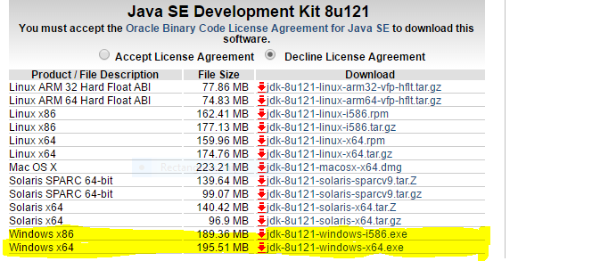
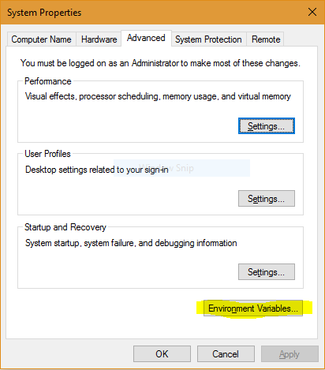
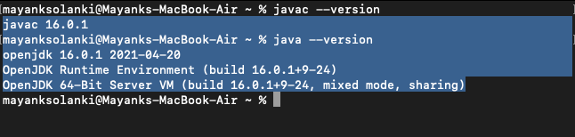
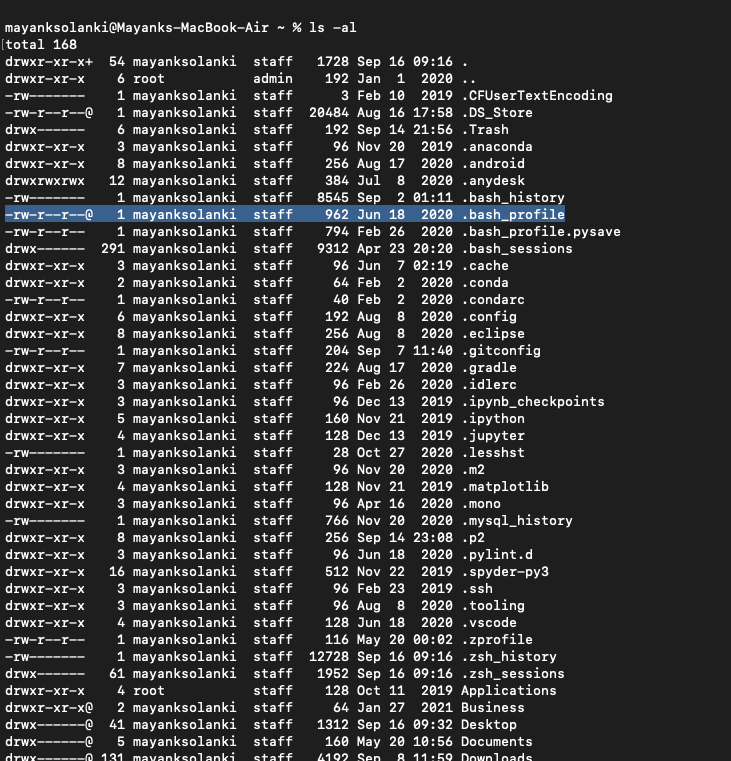
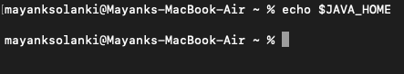
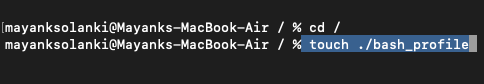
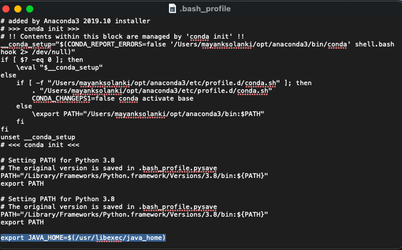
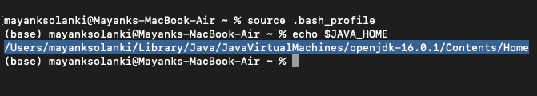

# Java环境设置

Java 是一种通用的计算机编程语言，它是并发的、基于类的、面向对象的。不管计算机架构如何，Java 应用程序通常可被编译为可以在任何 Java 虚拟机 (JVM) 上运行的[字节码](https://www.geeksforgeeks.org/difference-between-byte-code-and-machine-code/)。 最新版本是 **Java 18**。下面是 Linux 和 Windows 的环境设置。 JVM、JRE、JDK三者都是平台相关的，因为每个操作系统的配置都不一样。 但是，Java 是独立于平台的。 在设置环境之前，有几件事必须清楚，从下图提供的图像可以更好地感知，如下所示：


* **JDK**（Java Development Kit）：JDK 面向软件开发人员，包括 Java 编译器、Javadoc、Jar 和调试器等开发工具。
* **JRE**（Java 运行时环境）：JRE 包含运行 Java 程序所需的 Java 库部分，适用于终端用户。 JRE 可以看作是 JDK 的一个子集。
* **JVM**：JVM（Java虚拟机）是一种抽象机器。 它是一种规范，它提供了一个运行时环境，可以在其中执行 java 字节码。 JVM 可用于许多硬件和软件平台。

现在让我们讨论设置 Java 环境的步骤。 让我们使用 Windows 操作系统来说明这些步骤。

**步骤：**在这里，我们将为列出的三种不同操作系统上的步骤：

视窗操作系统
Linux操作系统
macOS 操作系统

## A. Windows操作系统

Windows操作系统设置环境的步骤如下: 

**Step 1:** Java8 JDK 可在[下载 Java 8](http://www.oracle.com/technetwork/java/javase/downloads/jdk8-downloads-2133151.html) 处获得。单击倒数第二个链接Windows（32 位）和最后一个链接 Windows（64 位），如下所示。



**Step 2:** 下载后运行 .exe 文件并按照说明在您的机器上安装 Java。安装 Java 后，必须设置环境变量。

**Step 3:** 转到**控制面板 -> 系统和安全 -> 系统**。在高级系统设置选项下，单击**Environment Variables**，如下所示。



**Step 4:** 现在，您必须更改系统变量下的“Path”变量，使其包含 Java 环境的路径。选择“Path”变量，然后单击下面高亮显示的编辑按钮。


**Step 5:** 你会看到一个路径的列表，点击**NEW**按钮，然后添加安装java的路径。默认情况下，java 安装在“C:\Program Files\Java\jdk\bin”文件夹或“C:\Program Files(x86)\Java\jdk\bin”中。如果您在任何其他位置安装了 java，则添加该路径。


**Step 6:** 点击确定，保存设置，大功告成！！现在要检查安装是否正确，打开命令提示符并键入 javac -version。您将看到 java 正在您的机器上运行。

> 注意：要确定编译器是否已设置，请在命令提示符下键入 javac。您将看到与 javac 相关的列表。

### B. Linux操作系统

在 Linux 中，有几种安装 java 的方法。但是我们将介绍最简单的使用终端安装java的方法。对于 Linux，我们将安装 OpenJDK。 OpenJDK 是 Java 编程语言的免费开源实现。 Linux操作系统环境设置步骤如下：

**Step 1:**  **应用程序 -> 附件 -> 终端**。

**Step 2:** 输入如下命令：

```
sudo apt-get install openjdk-8-jdk
```

**Step 3:** 对于如下所示的“JAVA_HOME”（环境变量）类型命令，在“终端”中使用您的安装路径...（注意：默认路径如图所示，但如果您必须在其他位置安装 OpenJDK，请设置小路。）

```
export JAVA_HOME = /usr/lib/jvm/java-8-openjdk
```

**Step 4:** 对于“PATH”（环境值）键入命令，如下所示，在“终端”中使用您的安装路径...注意：默认路径如图所示，但如果您必须在其他位置安装 OpenJDK，请设置您自己的路径。 )

```
export PATH = $PATH:/usr/lib/jvm/java-8-openjdk/bin
```

注意：我们已经完成了在 Java 中为 Linux OS 设置环境。

> ***注意**：现在要检查安装是否正确，请在终端中键入 java -version。您将看到 java 正在您的机器上运行。*
>
> * ***Notepad/gedit**：它们是用于编写 java 程序的简单**文本编辑器**。在 Windows 上用Notepad，在 Linux 上用gedit。*
>
> * ***Eclipse IDE**：它是使用最广泛的 IDE（集成开发环境），用于在 Java 中开发软件。您可以下载 Eclipse。*

### C. MacOS操作系统

**Step 1:** 从应用程序文件夹中打开终端或简单地同时按下“command”和“Shift”键并输入终端的首字母并按 Enter。

> 在您的机器上安装包管理器（例如 [homebrew](https://brew.sh/)）是一个不错的选择，因为我们可以通过使用终端命令从这里安装任何软件。

**Step 2:** 现在为了配置，首先编写命令“java –version”，它下面的消息将弹出没有

```
java --version
javac --version 
```

> ***注意：**如果已设置，那么您将在屏幕上显示版本，如下所示该机器中已设置的位置。因此，请记住在您的机器成功设置后记得检查您的机器。*
>
> 

**Step 2:** 一旦我们完成安装 JDK，现在让我们继续设置 java_home 环境变量，您将不得不使用以下命令查看名为 'bash_profie' 的东西

```
ls -al
```

您会注意到在您的机器上并没有如下所示的 bash_profile，因为在这台机器中我已经提前设置好了。如果bash_profile不存在，我们必须创建它。



**Step 3:** 设置 java home 变量。使用以下命令检查或设置是否未在终端上安装如下：

```
echo $JAVA_HOME
```



如果它显示为空白，则 java home 变量未设置，从上图中可以看出。

**Step 4:** 安装 bash_profile

确保转到终端中的根文件夹，并编写命令“touch ./bash_profile”



现在您将看到在您的机器中创建了如 step2 所示的 bash-profile ，可以通过编写如下命令来验证：

```
ls -al 
```

**Step 5:** 编辑创建的 .bash_profile，对于 java，您只需要编写在下面的命令，如下所示：

```
export JAVA_HOME=$(/usr/libexec/java_home)
// No need to remember this command  
```



保存此文件，关闭终端，然后重新启动终端。

 **Step 5:** 输入以下两条命令验证是否安装

```
source .bash_profile
echo $JAVA_HOME
```



现在从上面我们可以看到java变量都设置好了，因为之前上面的显示中是一段空白。