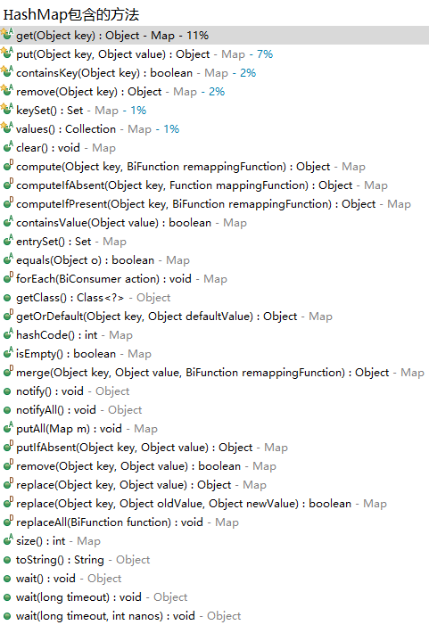

# 灵魂拷问

## Collection和Map中的是否可以存储null的问题

1. Collection中有哪些是不能存储null值的，以及不能为null的原因？
2. Map中哪些（key/value）可以为null，哪些不可以为null，以及不能为null的原因？（试着从源试码角度回答）

## HashMap扩容机制

1. 什么情况下回触发扩容机制?
2. 每次扩容的大小？
3. 负载因子大小的选取，为什么源码会选用0.75作为默认的负载因子？
4. 什么是rehashing？

## WeakHashMap

1. WeakHashMap什么时候会进行对象清理？

2. expungeStaleEntries中做了什么操作？

3. 怎样理解JDK源码中对WeakHashMap类头中的一开始的说明：

   ```
   Hash table based implementation of the Map interface, with weak keys. An entry in a WeakHashMap will automatically be removed when its key is no longer in ordinary use. More precisely, the presence of a mapping for a given key will not prevent the key from being discarded by the garbage collector, that is, made finalizable, finalized, and then reclaimed. When a key has been discarded its entry is effectively removed from the map, so this class behaves somewhat differently from other Map implementations.
   ```

   > 怎么理解weak keys?
   >
   > 怎么理解ordinary use？
   >
   > An entry... automaticlly be removed ....中，自动删除的过程是怎样的？
   >
   > key什么情况下会被判定为可以会被GC回收？
   >
   > key值被discarded掉后，entry是怎样被remove掉的？
   >
   > 怎样理解"This class(WeakHashMap) is intended primarily for use with key objects whose equals methods test for object identity using the == operator."这句话？

4. 

## TreeSet

1. 什么是Heterogeneous objects（异构对象），TreeSet中是否允许插入Heterogeneous objects？（从源码角度给出答案）

## Queue

1. java.util包下的队列和java.util.concurrent包下的队列有什么区别？其有界和无界有着什么含义？

## List

1. 分析下面的代码片段，并给出结果？

   ```java
   LinkedList<String> list = new LinkedList<>();
   list.add("geeks");
   list.add("for geeks");
   List<String> list2 = Collections.unmodifiableList(list);
   
   System.out.println(list.equals(list2));
   System.out.println(list == list2);
   ```

2. List转数组是的长度问题（最佳长度是多少）？为什么

   toArray(T[] a)的参数长度是零长度的数组有更好的性能，其数组容量大小是length的影响：

   * = 0，动态创建与size相同的数组，性能最好
   * 大于0但小于size， 重新创建大小等于size的数组，增加GC负担
   * 等于size，在高并发的情况下，数组创建完成后，size正在变大的情况下，负面影响同上
   * 大于size，空间浪费，且在size处插入null值，存在NPE隐患

   详细的分析请见Java源码分析-List

## 集合中存储的数据是存放的引用还是一个新的对象

看如下代码片段：

```java
static class Person {
	private String name;
	private int id;
	
	Person(String name, int id) {
		this.name = name;
		this.id = id;
	}
    
    @Override
    public void equal(object obj) {
        
    }
    
    @Override
    public void hashCode() {
        ...
    }
    
    public void setName(String name) {
        this.name = name;
    }
}

Map<Person, Integer> map = new HashMap<>();
Person person = new Person("zhangsan", 1);

map.put(person, 1);
System.out.println(map.get(person));

person.setName("lisi");
System.out.println(map.get(person));

person.setName("zhangsan");
System.out.println(map.get(person));
```

1. Person正确重写equal和hashCode
2. Person没有重写equal和hashCode

## HashMap 的工作原理及代码实现，什么时候用到红黑树



## 多线程情况下HashMap死循环的问题

[**https://blog.csdn.net/zhousenshan/article/details/52895874**](https://blog.csdn.net/zhousenshan/article/details/52895874)

[**https://www.cnblogs.com/dongguacai/p/5599100.html**](https://www.cnblogs.com/dongguacai/p/5599100.html)

## HashMap出现Hash DOS攻击的问题

## ConcurrentHashMap 的工作原理及代码实现，如何统计所有的元素个数

[**https://blog.csdn.net/helei810304/article/details/79786606**](https://blog.csdn.net/helei810304/article/details/79786606)

## 手写简单的HashMap

[**https://blog.csdn.net/it_lihongmin/article/details/76377229**](https://blog.csdn.net/it_lihongmin/article/details/76377229)

## 看过哪些Java集合类的源码

## 总结

|                 | 单线程                                                       | 并发                                                         |
| --------------- | ------------------------------------------------------------ | ------------------------------------------------------------ |
| Lists           | `ArrayList`——基于泛型数组 <br>`LinkedList`——不推荐使用 <br> `Vector`——已废弃（deprecated） | `CopyOnWriteArrayList`——几乎不更新，常用来遍历               |
| Queues / deques | `ArrayDeque`——基于泛型数组 <br>`Stack`——已废弃（deprecated）<br> `PriorityQueue`——读取操作的内容已排序 | `ArrayBlockingQueue`——带边界的阻塞式队列 <br>`ConcurrentLinkedDeque / ConcurrentLinkedQueue`——无边界的链表队列（CAS）<br> `DelayQueue`——元素带有延迟的队列<br> `LinkedBlockingDeque / LinkedBlockingQueue`——链表队列（带锁），可设定是否带边界 `LinkedTransferQueue`——可将元素<br>`transfer`进行w/o存储<br> `PriorityBlockingQueue`——并发`PriorityQueue`<br> `SynchronousQueue`——使用`Queue`接口进行`Exchanger` |
| Maps            | `HashMap`——通用Map<br/> `EnumMap`——键使用`enum` <br/>`Hashtable`——已废弃（deprecated）<br/> `IdentityHashMap`——键使用`==`进行比较<br/> `LinkedHashMap`——保持插入顺序 <br/>`TreeMap`——键已排序 <br/>`WeakHashMap`——适用于缓存（cache） | `ConcurrentHashMap`——通用并发<br>Map `ConcurrentSkipListMap`——已排序的并发Map |
| Sets            | `HashSet`——通用set <br>`EnumSet`——`enum` Set <br>`BitSet`——比特或密集的整数Set <br>`LinkedHashSet`——保持插入顺序 <br>`TreeSet`——排序Set |                                                              |